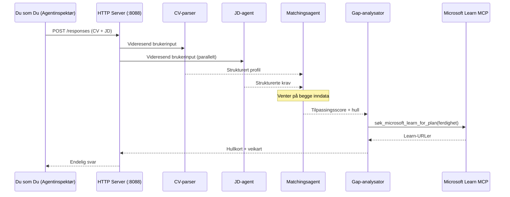
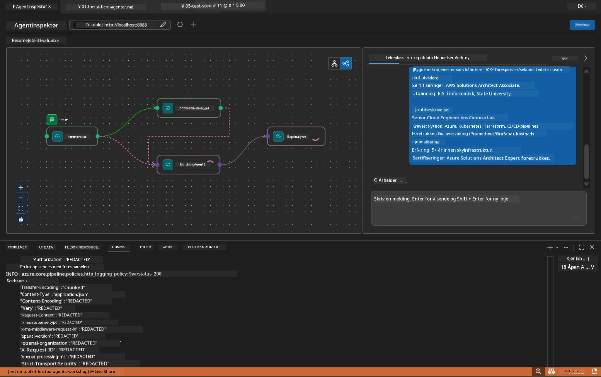

# Modul 5 - Test lokalt (Multi-Agent)

I denne modulen kjører du multi-agent arbeidsflyten lokalt, tester den med Agent Inspector, og verifiserer at alle fire agenter og MCP-verktøyet fungerer riktig før distribusjon til Foundry.

### Hva skjer under en lokal testrunde


---

## Steg 1: Start agent-serveren

### Valg A: Bruke VS Code-oppgaven (anbefalt)

1. Trykk `Ctrl+Shift+P` → skriv **Tasks: Run Task** → velg **Run Lab02 HTTP Server**.
2. Oppgaven starter serveren med debugpy tilkoblet på port `5679` og agenten på port `8088`.
3. Vent til output viser:

```
INFO:resume-job-fit:Starting Resume -> Job Fit Evaluator HTTP server...
INFO:resume-job-fit:Server running on http://localhost:8088
```

### Valg B: Bruke terminal manuelt

```powershell
cd workshop\lab02-multi-agent\PersonalCareerCopilot
```

Aktiver det virtuelle miljøet:

**PowerShell (Windows):**
```powershell
.\.venv\Scripts\Activate.ps1
```

**macOS/Linux:**
```bash
source .venv/bin/activate
```

Start serveren:

```powershell
python -m debugpy --listen 127.0.0.1:5679 -m agentdev run main.py --verbose --port 8088
```

### Valg C: Bruke F5 (debug-modus)

1. Trykk `F5` eller gå til **Run and Debug** (`Ctrl+Shift+D`).
2. Velg oppstarts-konfigurasjonen **Lab02 - Multi-Agent** fra nedtrekksmenyen.
3. Serveren starter med full støtte for breakpoint.

> **Tips:** Debug-modus lar deg sette breakpoints inne i `search_microsoft_learn_for_plan()` for å inspisere MCP-responser, eller i agenter sine instruksjonsstrenger for å se hva hver agent mottar.

---

## Steg 2: Åpne Agent Inspector

1. Trykk `Ctrl+Shift+P` → skriv **Foundry Toolkit: Open Agent Inspector**.
2. Agent Inspector åpnes i en nettleserfane på `http://localhost:5679`.
3. Du skal se agentgrensesnittet klart til å motta meldinger.

> **Hvis Agent Inspector ikke åpner:** Sørg for at serveren er fullstendig startet (du ser loggen "Server running"). Hvis port 5679 er opptatt, se [Modul 8 - Feilsøking](08-troubleshooting.md).

---

## Steg 3: Kjør røyktester

Kjør disse tre testene i rekkefølge. Hver tester stadig mer av arbeidsflyten.

### Test 1: Grunnleggende CV + stillingsbeskrivelse

Lim inn følgende i Agent Inspector:

```
Resume:
Jane Doe
Senior Software Engineer with 5 years of experience in Python, Django, and AWS.
Built microservices handling 10K+ requests/second. Led a team of 4 developers.
Certifications: AWS Solutions Architect Associate.
Education: B.S. Computer Science, State University.

Job Description:
Senior Cloud Engineer at Contoso Ltd.
Required: Python, Azure, Kubernetes, Terraform, CI/CD pipelines.
Preferred: Go, monitoring (Prometheus/Grafana), cost optimization.
Experience: 5+ years in cloud infrastructure.
Certifications: Azure Solutions Architect Expert preferred.
```

**Forventet output-struktur:**

Responsen skal inneholde output fra alle fire agenter i rekkefølge:

1. **Resume Parser-output** - Strukturert kandidatprofil med ferdigheter gruppert etter kategori
2. **JD Agent-output** - Strukturerte krav med skill skilt mellom påkrevede og foretrukne
3. **Matching Agent-output** - Passende score (0–100) med oppdeling, matchede ferdigheter, manglende ferdigheter, gap
4. **Gap Analyzer-output** - Individuelle gap-kort for hver manglende ferdighet, hver med Microsoft Learn URLer



### Hva verifisere i Test 1

| Sjekk | Forventet | Bestått? |
|-------|-----------|----------|
| Respons inneholder pass-score | Tall mellom 0–100 med oppdeling | |
| Matchede ferdigheter er listet | Python, CI/CD (delvis), osv. | |
| Manglende ferdigheter er listet | Azure, Kubernetes, Terraform, osv. | |
| Gap-kort eksisterer for hver manglende ferdighet | Ett kort per ferdighet | |
| Microsoft Learn URLer er til stede | Reelle `learn.microsoft.com`-lenker | |
| Ingen feilmeldinger i respons | Ren strukturert output | |

### Test 2: Verifiser MCP-verktøyets kjøring

Mens Test 1 kjører, sjekk **server-terminalen** for MCP-loggoppføringer:

```
GET https://learn.microsoft.com/api/mcp → 405 (Method Not Allowed)
POST https://learn.microsoft.com/api/mcp → 200
DELETE https://learn.microsoft.com/api/mcp → 405 (Method Not Allowed)
```

| Loggoppføring | Betydning | Forventet? |
|---------------|-----------|------------|
| `GET ... → 405` | MCP-klienten sjekker med GET under initialisering | Ja - normalt |
| `POST ... → 200` | Faktisk verktøysanrop til Microsoft Learn MCP-server | Ja - dette er det reelle anropet |
| `DELETE ... → 405` | MCP-klienten sjekker med DELETE under opprydding | Ja - normalt |
| `POST ... → 4xx/5xx` | Verktøysanrop feilet | Nei - se [Feilsøking](08-troubleshooting.md) |

> **Viktig:** Linjene `GET 405` og `DELETE 405` er **forventet adferd**. Bare bekymre deg hvis `POST`-anrop returnerer statuskoder som ikke er 200.

### Test 3: Kanttilfelle - kandidat med høy passform

Lim inn en CV som tett matcher stillingsbeskrivelsen for å verifisere at GapAnalyzer håndterer høypass-scenarier:

```
Resume:
Alex Chen
Senior Cloud Engineer with 7 years of experience.
Skills: Python, Azure (AKS, Functions, DevOps), Kubernetes, Terraform, CI/CD (GitHub Actions, Azure Pipelines), Go, Prometheus, Grafana, cost optimization.
Certifications: Azure Solutions Architect Expert, Azure DevOps Engineer Expert.
Led infrastructure migration to Azure for 3 enterprise clients.
Education: M.S. Computer Science, Tech University.

Job Description:
Senior Cloud Engineer at Contoso Ltd.
Required: Python, Azure, Kubernetes, Terraform, CI/CD pipelines.
Preferred: Go, monitoring (Prometheus/Grafana), cost optimization.
Experience: 5+ years in cloud infrastructure.
Certifications: Azure Solutions Architect Expert preferred.
```

**Forventet adferd:**
- Pass-score skal være **80+** (de fleste ferdigheter matcher)
- Gap-kort bør fokusere på polering/intervjuforberedelse i stedet for grunnleggende læring
- GapAnalyzer-instruksjonene sier: "Hvis passform >= 80, fokuser på polering/intervjuforberedelse"

---

## Steg 4: Verifiser output-fullstendighet

Etter å ha kjørt testene, verifiser at output møter disse kriteriene:

### Sjekkliste for output-struktur

| Seksjon | Agent | Tilstede? |
|---------|-------|-----------|
| Kandidatprofil | Resume Parser | |
| Tekniske ferdigheter (gruppert) | Resume Parser | |
| Rolleoversikt | JD Agent | |
| Påkrevede vs. foretrukne ferdigheter | JD Agent | |
| Pass-score med oppdeling | Matching Agent | |
| Matchende / manglende / delvise ferdigheter | Matching Agent | |
| Gap-kort per manglende ferdighet | Gap Analyzer | |
| Microsoft Learn URLer i gap-kort | Gap Analyzer (MCP) | |
| Læringsrekkefølge (nummerert) | Gap Analyzer | |
| Tidslinjesammendrag | Gap Analyzer | |

### Vanlige problemer i dette stadiet

| Problem | Årsak | Løsning |
|---------|--------|---------|
| Kun 1 gap-kort (resten avkortet) | Manglende CRITICAL-blokk i GapAnalyzer-instruksjoner | Legg til `CRITICAL:`-avsnittet i `GAP_ANALYZER_INSTRUCTIONS` - se [Modul 3](03-configure-agents.md) |
| Ingen Microsoft Learn URLer | MCP-endepunkt ikke tilgjengelig | Sjekk internettforbindelsen. Verifiser at `MICROSOFT_LEARN_MCP_ENDPOINT` i `.env` er `https://learn.microsoft.com/api/mcp` |
| Tom respons | `PROJECT_ENDPOINT` eller `MODEL_DEPLOYMENT_NAME` ikke satt | Sjekk verdier i `.env`. Kjør `echo $env:PROJECT_ENDPOINT` i terminal |
| Pass-score er 0 eller mangler | MatchingAgent mottok ingen upstream-data | Sjekk at `add_edge(resume_parser, matching_agent)` og `add_edge(jd_agent, matching_agent)` finnes i `create_workflow()` |
| Agent starter, men avslutter umiddelbart | Importfeil eller manglende avhengighet | Kjør `pip install -r requirements.txt` på nytt. Sjekk terminal for stack-traces |
| `validate_configuration`-feil | Manglende miljøvariabler | Lag `.env` med `PROJECT_ENDPOINT=<ditt-endepunkt>` og `MODEL_DEPLOYMENT_NAME=<din-modell>` |

---

## Steg 5: Test med egne data (valgfritt)

Prøv å lime inn din egen CV og en ekte stillingsbeskrivelse. Dette hjelper deg å verifisere:

- At agentene håndterer ulike CV-formater (kronologisk, funksjonell, hybrid)
- At JD Agent håndterer forskjellige JD-stiler (punktlister, avsnitt, strukturert)
- At MCP-verktøyet returnerer relevante ressurser for ekte ferdigheter
- At gap-kortene er tilpasset din spesifikke bakgrunn

> **Personvernmerking:** Når du tester lokalt, forblir dataene dine på maskinen din og sendes kun til din Azure OpenAI-distribusjon. De logges eller lagres ikke av workshop-infrastrukturen. Bruk gjerne fiktive navn hvis du ønsker (f.eks. "Jane Doe" i stedet for ditt virkelige navn).

---

### Sjekkpunkter

- [ ] Server startet vellykket på port `8088` (logg viser "Server running")
- [ ] Agent Inspector åpnet og koblet til agenten
- [ ] Test 1: Komplett respons med pass-score, matchende/manglende ferdigheter, gap-kort og Microsoft Learn URLer
- [ ] Test 2: MCP-logger viser `POST ... → 200` (verktøysanrop vellykkes)
- [ ] Test 3: Kandidat med høy passform får score 80+ med anbefalinger fokusert på polering
- [ ] Alle gap-kort tilstede (ett per manglende ferdighet, ingen avkorting)
- [ ] Ingen feil eller stack-traces i server-terminal

---

**Forrige:** [04 - Orchestration Patterns](04-orchestration-patterns.md) · **Neste:** [06 - Deploy to Foundry →](06-deploy-to-foundry.md)

---

<!-- CO-OP TRANSLATOR DISCLAIMER START -->
**Ansvarsfraskrivelse**:  
Dette dokumentet er oversatt ved hjelp av AI-oversettelsestjenesten [Co-op Translator](https://github.com/Azure/co-op-translator). Selv om vi streber etter nøyaktighet, vennligst vær oppmerksom på at automatiserte oversettelser kan inneholde feil eller unøyaktigheter. Det opprinnelige dokumentet på sitt opprinnelige språk skal betraktes som den autoritative kilden. For kritisk informasjon anbefales profesjonell menneskelig oversettelse. Vi er ikke ansvarlige for misforståelser eller feiltolkninger som følge av bruken av denne oversettelsen.
<!-- CO-OP TRANSLATOR DISCLAIMER END -->