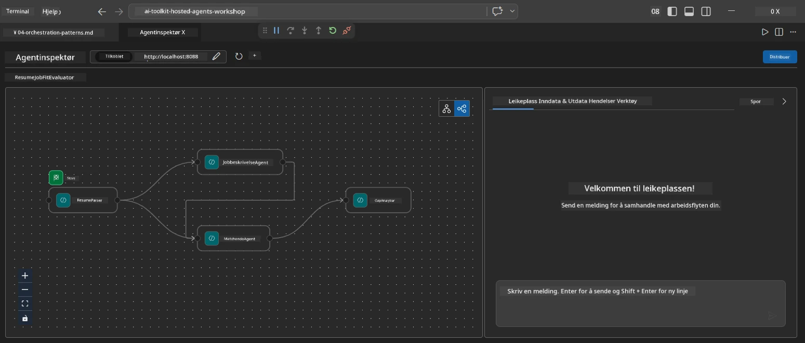
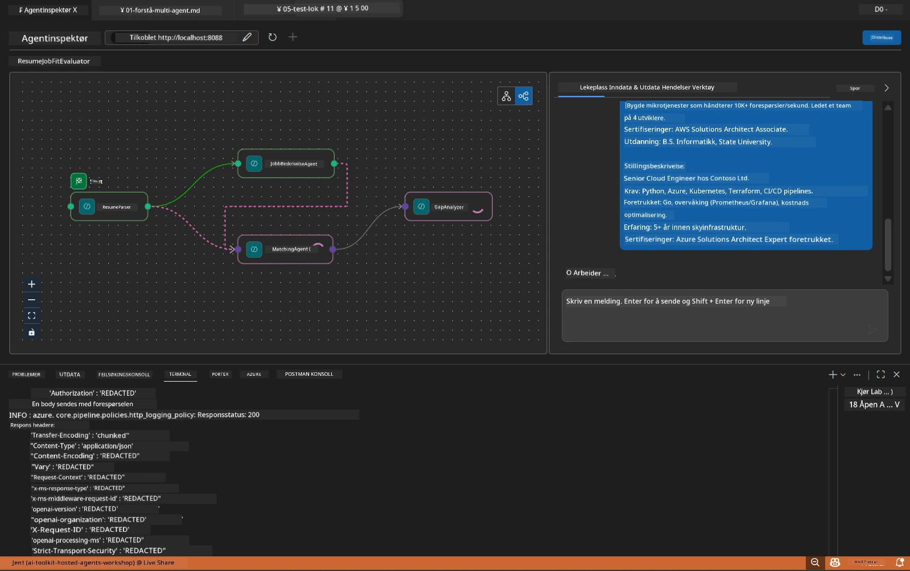
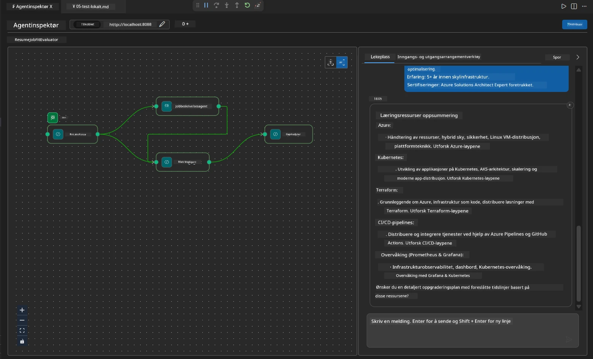

# Modul 5 - Test lokalt

⏱️ ~15 min

I denne modulen kjører du multi-agent-arbeidsflyten lokalt, tester den med Agent Inspector, og verifiserer at alle fire agenter og MCP-verktøyet fungerer korrekt før distribusjon.

---

## Trinn 1: Start agentserveren

### Alternativ A: Bruke VS Code-oppgaven (anbefalt)

1. Åpne `workshop/lab02-multi-agent/PersonalCareerCopilot/` som VS Code-mappen din.
2. Trykk `Ctrl+Shift+P` → skriv **Tasks: Run Task** → velg **Run Agent HTTP Server**.
3. Oppgaven starter serveren med debugpy koblet til på port `5679` og agenten på port `8088`.
4. Vent til output viser:

```
INFO:resume-job-fit:Starting Resume -> Job Fit Evaluator HTTP server...
INFO:resume-job-fit:Server running on http://localhost:8088
```

### Alternativ B: Bruke F5 (debugmodus)

1. Trykk `F5` → velg **Debug Local Agent HTTP Server**.
2. Serveren starter med full støtte for breakpoints – nyttig for å inspisere MCP-svar eller agentoutput.

---

## Trinn 2: Åpne Agent Inspector

1. Trykk `Ctrl+Shift+P` → skriv **Foundry Toolkit: Open Agent Inspector**.
2. Agent Inspector åpnes som en VS Code-panel koblet til `http://localhost:8088`.
3. Du skal se agentgrensesnittet klart til å motta meldinger.



> **Hvis Agent Inspector ikke åpnes:** Sørg for at serveren er fullstendig startet (du ser "Server running"-loggen). Hvis port 5679 er opptatt, se [Modul 8 - Feilsøking](08-troubleshooting.md).

---

## Trinn 2b: (Valgfritt) Åpne Workflow Visualizer

Foundry Toolkit inkluderer en sanntids **Workflow Visualizer** som viser hvordan agenter samhandler mens grafen kjører. Dette er spesielt nyttig for feilsøking med flere agenter.

1. Trykk `Ctrl+Shift+P` → skriv **Foundry Toolkit: Open Visualizer for Hosted Agents**.
2. En ny VS Code-fane åpnes og viser den levende kjøre-grafen.
3. Når du sender meldinger i Agent Inspector, oppdateres visualizeren automatisk – grønne noder viser fullførte agenter, og animerte kanter viser dataflyt mellom dem.

> **Portkonflikt:** Hvis visualizerporten allerede er i bruk, endre den i VS Code-innstillinger → **Extensions** → **Microsoft Foundry Configuration** → **Hosted Agents: Visualizer Port**.

---

## Trinn 3: Kjør røyktester

Kjør disse tre testene i rekkefølge. Hver tester gradvis mer av arbeidsflyten.

### Test 1: Grunnleggende CV + stillingsbeskrivelse

Lim inn følgende i Agent Inspector:

```
Resume:
Jane Doe
Senior Software Engineer with 5 years of experience in Python, Django, and AWS.
Built microservices handling 10K+ requests/second. Led a team of 4 developers.
Certifications: AWS Solutions Architect Associate.
Education: B.S. Computer Science, State University.

Job Description:
Senior Cloud Engineer at Contoso Ltd.
Required: Python, Azure, Kubernetes, Terraform, CI/CD pipelines.
Preferred: Go, monitoring (Prometheus/Grafana), cost optimization.
Experience: 5+ years in cloud infrastructure.
Certifications: Azure Solutions Architect Expert preferred.
```

**Forventet output-struktur:**

Svaret bør inneholde output fra alle fire agenter i rekkefølge:

1. **Resume Parser-output** – To merkede seksjoner: `[PARSED RESUME]` (kandidatprofil med grupperte ferdigheter) og `[JOB DESCRIPTION PASS-THROUGH]` (ordrett JD-tekst som mates til JD Agent)
2. **JD Agent-output** – Strukturerte krav med skill-skille mellom nødvendige og foretrukne ferdigheter
3. **Matching Agent-output** – Passingsscore (0-100) med detaljert oversikt, matchede ferdigheter, manglende ferdigheter, gap
4. **Gap Analyzer-output** – Individuelle gapkort for hver manglende ferdighet, hver med Microsoft Learn-URLer





### Hva du skal verifisere i Test 1

| Sjekk | Forventet | Godkjent? |
|-------|-----------|------------|
| Respons inneholder passingsscore | Tall mellom 0-100 med detaljert oversikt | |
| Matchede ferdigheter er listet | Python, CI/CD (delvis), osv. | |
| Manglende ferdigheter er listet | Azure, Kubernetes, Terraform, osv. | |
| Gapkort finnes for hver manglende ferdighet | Ett kort per ferdighet | |
| Microsoft Learn-URLer er til stede | Ekte `learn.microsoft.com`-lenker | |
| Ingen feilmeldinger i responsen | Rent strukturert output | |

### Test 2: Ekstremtilfelle – kandidat med høy match

Lim inn en CV som matcher stillingsbeskrivelsen godt for å verifisere at GapAnalyzer håndterer høy-match-scenarioer:

```
Resume:
Alex Chen
Senior Cloud Engineer with 7 years of experience.
Skills: Python, Azure (AKS, Functions, DevOps), Kubernetes, Terraform, CI/CD (GitHub Actions, Azure Pipelines), Go, Prometheus, Grafana, cost optimization.
Certifications: Azure Solutions Architect Expert, Azure DevOps Engineer Expert.
Led infrastructure migration to Azure for 3 enterprise clients.
Education: M.S. Computer Science, Tech University.

Job Description:
Senior Cloud Engineer at Contoso Ltd.
Required: Python, Azure, Kubernetes, Terraform, CI/CD pipelines.
Preferred: Go, monitoring (Prometheus/Grafana), cost optimization.
Experience: 5+ years in cloud infrastructure.
Certifications: Azure Solutions Architect Expert preferred.
```

**Forventet oppførsel:**
- Passingsscoren bør være **80+** (de fleste ferdigheter matcher)
- Gapkortene bør fokusere på polering/intervjuforberedelse snarere enn grunnleggende læring
- GapAnalyzer-instruksjonene sier: "Hvis passingsscore >= 80, fokuser på polering/intervjuforberedelse"

---

## Trinn 4: Test med egne data (valgfritt)

Prøv å lime inn din egen CV og en ekte stillingsbeskrivelse. Dette bidrar til å verifisere:

- At agentene håndterer ulike CV-formater (kronologisk, funksjonell, hybrid)
- At JD Agent håndterer forskjellige JD-stiler (punkter, avsnitt, strukturert)
- At MCP-verktøyet returnerer relevante ressurser for ekte ferdigheter
- At gapkortene er tilpasset din spesifikke bakgrunn

> **Personvern – Vei A (Foundry sky):** CV- og JD-tekst sendes til din Azure OpenAI-distribusjon for inferens. Den logges eller lagres ikke av workshop-infrastrukturen. Bruk eventuelt plassenavn (f.eks. "Jane Doe").
>
> **Personvern – Vei B (Foundry Local):** Alle fire agentinferanser kjører helt på din enhet. Din CV og JD-tekst **forlater aldri maskinen din**. Den eneste utgående forespørselen er MCP-verktøyet som henter ressurser fra `https://learn.microsoft.com/api/mcp`; den spørringen inneholder kun ferdighetsnavnet, ikke dine personlige data.

---

### Kontrollpunkt

- [ ] Server startet vellykket på port `8088` (logg viser "Server running")
- [ ] Agent Inspector åpnet og koblet til agenten
- [ ] Test 1: Komplett respons med passingsscore, matchede/manglende ferdigheter, gapkort og Microsoft Learn-URLer
- [ ] Test 2: Kandidat med høy match får score 80+ med poleringsfokusert anbefalinger
- [ ] Alle gapkort tilstede (ett per manglende ferdighet, ingen avkorting)
- [ ] Ingen feil eller stack traces i server-terminalen

---

**Forrige:** [04 - Orchestration Patterns](04-orchestration-patterns.md) · **Neste:** [06 - Deploy to Foundry →](06-deploy-to-foundry.md)

---

<!-- CO-OP TRANSLATOR DISCLAIMER START -->
**Ansvarsfraskrivelse**:
Dette dokumentet er oversatt ved hjelp av AI-oversettelsestjenesten [Co-op Translator](https://github.com/Azure/co-op-translator). Selv om vi streber etter nøyaktighet, vær oppmerksom på at automatiske oversettelser kan inneholde feil eller unøyaktigheter. Det opprinnelige dokumentet på originalspråket skal betraktes som den autoritative kilden. For kritisk informasjon anbefales profesjonell menneskelig oversettelse. Vi er ikke ansvarlige for eventuelle misforståelser eller feiltolkninger som oppstår ved bruk av denne oversettelsen.
<!-- CO-OP TRANSLATOR DISCLAIMER END -->