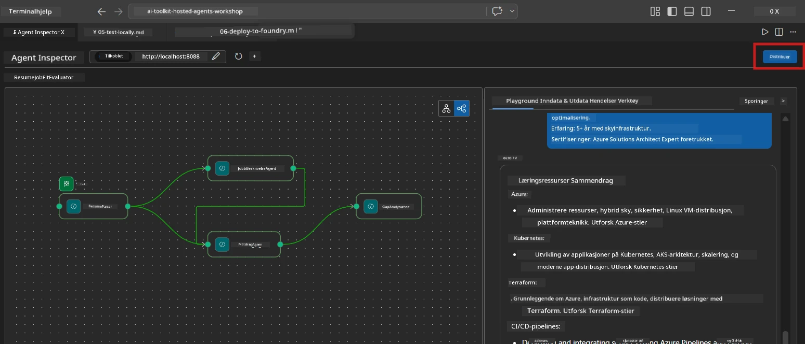
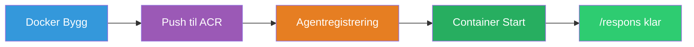
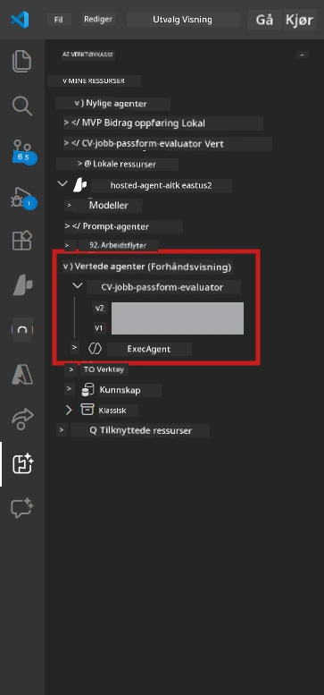

# Modul 6 - Distribuer til Foundry Agent-tjeneste

I denne modulen distribuerer du ditt lokalt testede multi-agent arbeidsflyt til [Microsoft Foundry](https://learn.microsoft.com/azure/foundry/agents/concepts/hosted-agents) som en **Hosted Agent**. Distribusjonsprosessen bygger et Docker containerimage, laster det opp til [Azure Container Registry (ACR)](https://learn.microsoft.com/azure/container-registry/container-registry-intro), og oppretter en hosted agent-versjon i [Foundry Agent Service](https://learn.microsoft.com/azure/foundry/agents/how-to/publish-agent).

> **Nøkkelforskjell fra Lab 01:** Distribusjonsprosessen er identisk. Foundry behandler din multi-agent arbeidsflyt som en enkelt hosted agent – kompleksiteten er inne i containeren, men distribusjonsoverflaten er den samme `/responses` endepunktet.

---

## Forutsetninger

Før distribusjon, verifiser hvert punkt nedenfor:

1. **Agenten består lokale røyktester:**
   - Du har fullført alle 3 testene i [Modul 5](05-test-locally.md) og arbeidsflyten produserte komplett output med gapkort og Microsoft Learn URL-er.

2. **Du har [Azure AI User](https://learn.microsoft.com/azure/foundry/concepts/rbac-foundry) rolle:**
   - Tilordnet i [Lab 01, Modul 2](../../lab01-single-agent/docs/02-create-foundry-project.md). Verifiser:
   - [Azure Portal](https://portal.azure.com) → ditt Foundry **prosjekt**-ressurs → **Tilgangskontroll (IAM)** → **Rolle-tilordninger** → bekreft at **[Azure AI User](https://aka.ms/foundry-ext-project-role)** er listet for din konto.

3. **Du er logget inn i Azure i VS Code:**
   - Sjekk konto-ikonet nederst til venstre i VS Code. Ditt kontonavn skal være synlig.

4. **`agent.yaml` har korrekte verdier:**
   - Åpne `PersonalCareerCopilot/agent.yaml` og verifiser:
     ```yaml
     environment_variables:
       - name: PROJECT_ENDPOINT
         value: ${PROJECT_ENDPOINT}
       - name: MODEL_DEPLOYMENT_NAME
         value: ${MODEL_DEPLOYMENT_NAME}
     ```
   - Disse må samsvare med miljøvariablene `main.py` leser.

5. **`requirements.txt` har riktige versjoner:**
   ```
   agent-framework-azure-ai==1.0.0rc3
   agent-framework-core==1.0.0rc3
   azure-ai-agentserver-agentframework==1.0.0b16
   azure-ai-agentserver-core==1.0.0b16
   debugpy
   agent-dev-cli --pre
   ```

---

## Steg 1: Start distribusjonen

### Alternativ A: Distribuer fra Agent Inspector (anbefalt)

Hvis agenten kjører via F5 med Agent Inspector åpen:

1. Se på **øverst til høyre** i Agent Inspector-panelet.
2. Klikk på **Deploy**-knappen (skysymbol med pil opp ↑).
3. Distribusjonsveiviseren åpnes.



### Alternativ B: Distribuer fra Kommandomenyen

1. Trykk `Ctrl+Shift+P` for å åpne **Kommandomenyen**.
2. Skriv: **Microsoft Foundry: Deploy Hosted Agent** og velg den.
3. Distribusjonsveiviseren åpnes.

---

## Steg 2: Konfigurer distribusjonen

### 2.1 Velg målprosjekt

1. En rullegardinmeny viser dine Foundry-prosjekter.
2. Velg prosjektet du har brukt i hele workshopen (f.eks. `workshop-agents`).

### 2.2 Velg container agent fil

1. Du blir bedt om å velge agentens inngangspunkt.
2. Naviger til `workshop/lab02-multi-agent/PersonalCareerCopilot/` og velg **`main.py`**.

### 2.3 Konfigurer ressurser

| Innstilling | Anbefalt verdi | Notater |
|---------|------------------|-------|
| **CPU** | `0.25` | Standard. Multi-agent arbeidsflyter trenger ikke mer CPU fordi modellkall er I/O-binding |
| **Minne** | `0.5Gi` | Standard. Øk til `1Gi` hvis du legger til store data behandlingsverktøy |

---

## Steg 3: Bekreft og distribuer

1. Veiviseren viser et distribusjonssammendrag.
2. Gå gjennom og klikk **Confirm and Deploy**.
3. Følg fremdriften i VS Code.

### Hva skjer under distribusjon

Se VS Code **Output**-panelet (velg "Microsoft Foundry" i nedtrekksmenyen):


1. **Docker build** - Bygger containeren fra din `Dockerfile`:
   ```
   Step 1/6 : FROM python:3.14-slim
   Step 2/6 : WORKDIR /app
   ...
   Successfully built abc123def456
   ```

2. **Docker push** - Laster bildet opp til ACR (1-3 minutter på første distribusjon).

3. **Agent-registrering** - Foundry oppretter en hosted agent ved hjelp av `agent.yaml` metadata. Agentens navn er `resume-job-fit-evaluator`.

4. **Container start** - Containeren starter i Foundrys administrerte infrastruktur med et systemadministrert identitet.

> **Første distribusjon er tregere** (Docker laster opp alle lag). Påfølgende distribusjoner gjenbruker hurtigbufferlag og går raskere.

### Multi-agent spesifikke notater

- **Alle fire agentene er i én container.** Foundry ser en enkelt hosted agent. WorkflowBuilder-grafen kjøres internt.
- **MCP-kall går utgående.** Containeren trenger internett-tilgang for å nå `https://learn.microsoft.com/api/mcp`. Foundrys administrerte infrastruktur gir dette som standard.
- **[Administrert identitet](https://learn.microsoft.com/python/api/overview/azure/identity-readme#managed-identity-support).** I det hostede miljøet returnerer `get_credential()` i `main.py` `ManagedIdentityCredential()` (fordi `MSI_ENDPOINT` er satt). Dette skjer automatisk.

---

## Steg 4: Verifiser distribusjonsstatus

1. Åpne **Microsoft Foundry** sidepanelet (klikk Foundry-ikonet i Aktivitetsfeltet).
2. Utvid **Hosted Agents (Preview)** under prosjektet ditt.
3. Finn **resume-job-fit-evaluator** (eller agentnavnet ditt).
4. Klikk på agentnavnet → utvid versjoner (f.eks. `v1`).
5. Klikk på versjonen → sjekk **Container Details** → **Status**:



| Status | Betydning |
|--------|---------|
| **Started** / **Running** | Container kjører, agent er klar |
| **Pending** | Container starter (vent 30-60 sekunder) |
| **Failed** | Container feilet under oppstart (sjekk logger – se nedenfor) |

> **Multi-agent oppstart tar lengre tid** enn enkelt-agent fordi containeren oppretter 4 agent-instans ved oppstart. "Pending" i opptil 2 minutter er normalt.

---

## Vanlige distribusjonsfeil og løsninger

### Feil 1: Permission denied - `agents/write`

```
Error: lacks the required data action 
Microsoft.CognitiveServices/accounts/AIServices/agents/write
```

**Løsning:** Tildel **[Azure AI User](https://learn.microsoft.com/azure/foundry/concepts/rbac-foundry)** rolle på **prosjektnivå**. Se [Modul 8 - Feilsøking](08-troubleshooting.md) for steg-for-steg instruksjoner.

### Feil 2: Docker kjører ikke

```
Error: Docker build failed / Cannot connect to Docker daemon
```

**Løsning:**
1. Start Docker Desktop.
2. Vent på "Docker Desktop is running".
3. Verifiser: `docker info`
4. **Windows:** Sørg for at WSL 2 backend er aktivert i Docker Desktop-innstillinger.
5. Prøv på nytt.

### Feil 3: pip install feiler under Docker build

```
Error: Could not find a version that satisfies the requirement agent-dev-cli
```

**Løsning:** `--pre` flagget i `requirements.txt` håndteres annerledes i Docker. Sørg for at din `requirements.txt` har:
```
agent-dev-cli --pre
```

Hvis Docker fremdeles feiler, opprett en `pip.conf` eller send `--pre` via et build-argument. Se [Modul 8](08-troubleshooting.md).

### Feil 4: MCP-verktøy feiler i hosted agent

Hvis Gap Analyzer slutter å produsere Microsoft Learn URL-er etter distribusjon:

**Årsak:** Nettverkspolicy kan blokkere utgående HTTPS fra containeren.

**Løsning:**
1. Dette er vanligvis ikke et problem med Foundrys standardkonfigurasjon.
2. Hvis det oppstår, sjekk om Foundry-prosjektets virtuelle nettverk har en NSG som blokkerer utgående HTTPS.
3. MCP-verktøyet har innebygde fallback-URL-er, så agenten vil fortsatt produsere output (uten live URL-er).

---

### Sjekkpunkter

- [ ] Distribusjonskommandoen fullførte uten feil i VS Code
- [ ] Agenten vises under **Hosted Agents (Preview)** i Foundry sidepanelet
- [ ] Agentnavnet er `resume-job-fit-evaluator` (eller valgt navn)
- [ ] Containerstatus viser **Started** eller **Running**
- [ ] (Ved feil) Du identifiserte feilen, brukte løsningen og distribuert på nytt med suksess

---

**Forrige:** [05 - Test lokalt](05-test-locally.md) · **Neste:** [07 - Verifiser i Playground →](07-verify-in-playground.md)

---

<!-- CO-OP TRANSLATOR DISCLAIMER START -->
**Ansvarsfraskrivelse**:
Dette dokumentet er oversatt ved hjelp av AI-oversettelsestjenesten [Co-op Translator](https://github.com/Azure/co-op-translator). Selv om vi streber etter nøyaktighet, vennligst vær oppmerksom på at automatiske oversettelser kan inneholde feil eller unøyaktigheter. Det opprinnelige dokumentet på sitt originale språk skal betraktes som den autoritative kilden. For kritisk informasjon anbefales profesjonell menneskelig oversettelse. Vi er ikke ansvarlige for eventuelle misforståelser eller feiltolkninger som oppstår ved bruk av denne oversettelsen.
<!-- CO-OP TRANSLATOR DISCLAIMER END -->