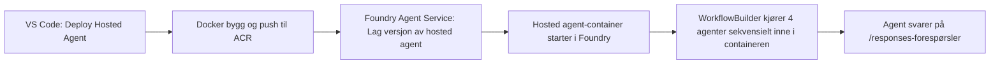
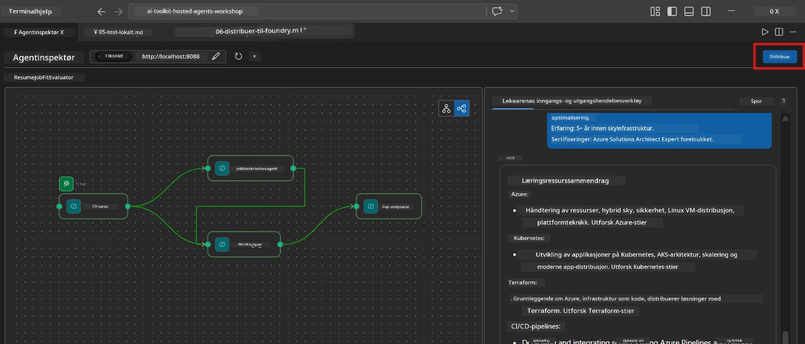
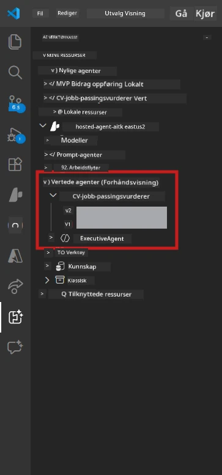

# Modul 6 - Distribuer til Foundry Agent Service

⏱️ ~10 min

I denne modulen distribuerer du din lokalt testede multi-agent arbeidsflyt til [Microsoft Foundry](https://learn.microsoft.com/azure/foundry/agents/concepts/hosted-agents) som en **Hosted Agent**. Distribusjonsprosessen bygger et Docker container image, sender det til [Azure Container Registry (ACR)](https://learn.microsoft.com/azure/container-registry/container-registry-intro), og oppretter en hosted agent versjon i [Foundry Agent Service](https://learn.microsoft.com/azure/foundry/agents/how-to/publish-agent).

> **Viktig forskjell fra Lab 01:** Distribusjonsprosessen er identisk. Foundry behandler din multi-agent arbeidsflyt som en enkelt hosted agent - kompleksiteten er inne i containeren, men distribusjonsflaten er den samme `/responses` endepunktet.

### Distribusjonspipeline


```mermaid
flowchart LR
    A[VS Code: Deploy Hosted Agent] --> B[Docker bygg og push til ACR]
    B --> C[Foundry Agent Service: Lag versjon av hosted agent]
    C --> D[Hosted agent-container starter i Foundry]
    D --> E[WorkflowBuilder kjører 4 agenter sekvensielt inne i containeren]
    E --> F[Agent svarer på /responses-forespørsler]
```

---

## Sjekkliste for forutsetninger

Før du distribuerer, sjekk at alle punktene under er oppfylt:

1. **Agenten består lokale røyktester:**
   - Du fullførte alle 3 testene i [Modul 5](05-test-locally.md) og arbeidsflyten produserte fullstendig output med gap-kort og Microsoft Learn URLer.

2. **Du har [Foundry User](https://learn.microsoft.com/azure/foundry/concepts/rbac-foundry) rollen** (for å distribuere trenger du minimum **Foundry Project Manager** på prosjekt-nivå):

   > **Merk:** Foundry RBAC-roller ble nylig omdøpt - **Foundry User**, **Foundry Owner**, og **Foundry Project Manager** het tidligere Azure AI User, Azure AI Owner, og Azure AI Project Manager. Rolle-ID og tillatelser er uendret.

   - Verifiser i [Azure Portal](https://portal.azure.com) → ditt Foundry **prosjekt** ressurs → **Tilgangskontroll (IAM)** → **Rolletildelinger** → bekreft at **Foundry User** (eller høyere) er oppført for kontoen din.

3. **Du er pålogget Azure i VS Code:**
   - Se etter Konto-ikonet nederst til venstre i VS Code. Konto-navnet ditt skal være synlig.

4. **`agent.yaml` har riktige verdier:**
   - Åpne `PersonalCareerCopilot/agent.yaml` og verifiser:
     ```yaml
     environment_variables:
       - name: AZURE_AI_MODEL_DEPLOYMENT_NAME
         value: ${AZURE_AI_MODEL_DEPLOYMENT_NAME}
     ```
   - `FOUNDRY_PROJECT_ENDPOINT` er **ikke** listet her - Foundry setter denne ved kjøring. Bare `AZURE_AI_MODEL_DEPLOYMENT_NAME` må deklareres.

5. **`requirements.txt` har riktige versjoner:**
   ```
   agent-framework-foundry
   agent-framework-foundry-hosting
   mcp<2,>=1.24.0
   debugpy
   ```

---

## Steg 1: Start distribusjonen

### Alternativ A: Distribuer fra Agent Inspector (anbefalt)

Hvis agenten kjører via F5 med Agent Inspector åpen:

1. Se i **øverste høyre hjørne** på Agent Inspector-panelet.
2. Klikk på **Deploy** knappen (sky-ikon med oppoverpil ↑).
3. Distribusjonsveiviseren åpnes.



### Alternativ B: Distribuer fra Command Palette

1. Trykk `Ctrl+Shift+P` for å åpne **Command Palette**.
2. Skriv: **Foundry Toolkit: Deploy Hosted Agent** og velg det.
3. Distribusjonsveiviseren åpnes.

---

## Steg 2: Konfigurer distribusjonen

### 2.1 Velg målprosjekt

1. En nedtrekksmeny viser dine Foundry prosjekter.
2. Velg prosjektet du brukte gjennom workshopen (f.eks. `workshop-agents`).

### 2.2 Velg container agent fil

1. Du blir bedt om å velge agentens inngangspunkt.
2. Naviger til `workshop/lab02-multi-agent/PersonalCareerCopilot/` og velg **`main.py`**.

### 2.3 Konfigurer ressurser

| Innstilling | Anbefalt verdi | Notater |
|---------|------------------|-------|
| **Distribusjonsmetode** | **Container** (anbefalt) eller **Code** | Container bygger et Docker image; Code laster opp kildekoden som en ZIP (preview) |
| **Container Registry** | **Standard ACR** | Foundry oppretter og administrerer en for deg |
| **CPU** | `0.25` | Standard. Multi-agent arbeidsflyter trenger ikke mer CPU fordi modellkall er I/O-bundet |
| **Minne** | `0.5Gi` | Standard. Øk til `1Gi` hvis du legger til store databehandlingsverktøy |

---

## Steg 3: Bekreft og distribuer

1. Veiviseren viser et distribusjonssammendrag.
2. Gå gjennom og klikk **Bekreft og distribuer**.
3. Følg fremdriften i VS Code.

### Hva skjer under distribusjonen

Følg VS Code **Output** panelet (velg "Microsoft Foundry" fra nedtrekksmenyen):

1. **Docker build** - bygger containeren fra din `Dockerfile`
   ```
   Step 1/6 : FROM python:3.12-slim
   Step 2/6 : WORKDIR /app
   ...
   Successfully built abc123def456
   ```

2. **Docker push** - sender imaget til ACR (1-3 minutter ved første distribusjon).

3. **Agentregistrering** - Foundry oppretter en hosted agent ved hjelp av metadata fra `agent.yaml`. Agentnavnet er `resume-job-fit-evaluator`.

4. **Container start** - Containeren starter i Foundrys administrerte infrastruktur med et system-administrert identitet.

> **Første distribusjon er tregere** (Docker pusher alle lag). Påfølgende distribusjoner gjenbruker bufrede lag og går raskere.

### Spesifikke merknader for multi-agent

- **Alle fire agenter er inne i én container.** Foundry ser en enkelt hosted agent. WorkflowBuilder grafen kjører internt.
- **MCP kall går ut av containeren.** Containeren trenger internett-tilgang for å nå `https://learn.microsoft.com/api/mcp`. Foundrys administrerte infrastruktur gir dette som standard.
- **[Administrert identitet](https://learn.microsoft.com/azure/foundry/agents/concepts/agent-identity).** Foundry lager automatisk en **dedikert per-agent Entra identitet** for hver Hosted agent ved distribusjonstidspunkt. I det hostede miljøet løser `DefaultAzureCredential` automatisk til denne agentidentiteten - ingen manuell konfigurering av administrert identitet er nødvendig.

---

## Steg 4: Verifiser distribusjonsstatus

1. Åpne **Microsoft Foundry** sidepanelet (klikk på Foundry-ikonet i Aktivitetslinjen).
2. Utvid **Hosted Agents (Preview)** under prosjektet ditt.
3. Finn **resume-job-fit-evaluator** (eller agentnavnet ditt).
4. Klikk på agentnavnet → utvid versjoner (f.eks. `v1`).
5. Klikk på versjonen → sjekk **Container-detaljer** → **Status**:



| Status | Betydning |
|--------|---------|
| **aktiv** | Agenten kjører og er klar til å motta forespørsler |
| **opprettes** | Containeren starter (vent 30–60 sekunder) |
| **feilet** | Containeren klarte ikke å starte (sjekk logger - se nedenfor) |

> **Merk:** VS Code sidepanelet kan vise etiketter som "Running" eller "Started" mens underlying API status bruker `active`/`creating`. Begge visningene indikerer samme tilstand.

> **Multi-agent oppstart tar lengre tid** enn enkelt-agent fordi containeren starter 4 agent-instanser ved oppstart. `creating` i opptil 2 minutter er normalt.

---

## Vanlige distribusjonsfeil og løsninger

### Feil 1: Tillatelse nektet - `agents/write`

```
Error: lacks the required data action 
Microsoft.CognitiveServices/accounts/AIServices/agents/write
```

**Løsning:** Tilordne **[Foundry User](https://learn.microsoft.com/azure/foundry/concepts/rbac-foundry)** rollen (tidligere **Azure AI User**) på **prosjektnivå**. Se [Modul 8 - Feilsøking](08-troubleshooting.md) for steg-for-steg instruksjoner.

### Feil 2: Docker kjører ikke

```
Error: Docker build failed / Cannot connect to Docker daemon
```

**Løsning:**
1. Start Docker Desktop.
2. Vent på "Docker Desktop is running".
3. Verifiser: `docker info`
4. **Windows:** Sørg for at WSL 2 backend er aktivert i Docker Desktop-innstillinger.
5. Prøv på nytt.

### Feil 3: pip install feiler under Docker build

```
Error: Could not find a version that satisfies the requirement agent-framework-foundry
```

**Løsning:** Verifiser at `requirements.txt` stemmer med:
```
agent-framework-foundry
agent-framework-foundry-hosting
mcp<2,>=1.24.0
debugpy
```

Hvis byggingen fortsatt feiler, kan nettverket i Docker blokkere PyPI. Sjekk `docker info` for proxy-innstillinger.

### Feil 4: MCP-verktøyet feiler i hosted agent

Hvis Gap Analyzer slutter å produsere Microsoft Learn URLer etter distribusjon:

**Årsak:** Nettverkspolicy kan blokkere utgående HTTPS fra containeren.

**Løsning:**
1. Dette er vanligvis ikke et problem med Foundrys standardkonfigurasjon.
2. Dersom det oppstår, sjekk om Foundry prosjektets virtuelle nettverk har en NSG som blokkerer utgående HTTPS.
3. MCP-verktøyet har innebygde fallback URLer, så agenten vil fortsatt produsere output (uten live URLer).

---

### Sjekkpunkt

- [ ] Distribusjonskommando fullført uten feil i VS Code
- [ ] Agenten vises under **Hosted Agents (Preview)** i Foundry sidepanelet
- [ ] Agentnavnet er `resume-job-fit-evaluator` (eller valgt navn)
- [ ] Containerstatus viser **Started** eller **Running**
- [ ] (Hvis feil) Du har identifisert feilen, anvendt løsningen, og distribuert på nytt med suksess

---

**Forrige:** [05 - Test lokalt](05-test-locally.md) · **Neste:** [07 - Verifiser i Playground →](07-verify-in-playground.md)

---

<!-- CO-OP TRANSLATOR DISCLAIMER START -->
**Ansvarsfraskrivelse**:
Dette dokumentet er oversatt ved hjelp av AI-oversettelsestjenesten [Co-op Translator](https://github.com/Azure/co-op-translator). Selv om vi streber etter nøyaktighet, vær oppmerksom på at automatiske oversettelser kan inneholde feil eller unøyaktigheter. Det opprinnelige dokumentet på originalspråket skal betraktes som den autoritative kilden. For kritisk informasjon anbefales profesjonell menneskelig oversettelse. Vi er ikke ansvarlige for eventuelle misforståelser eller feiltolkninger som oppstår ved bruk av denne oversettelsen.
<!-- CO-OP TRANSLATOR DISCLAIMER END -->