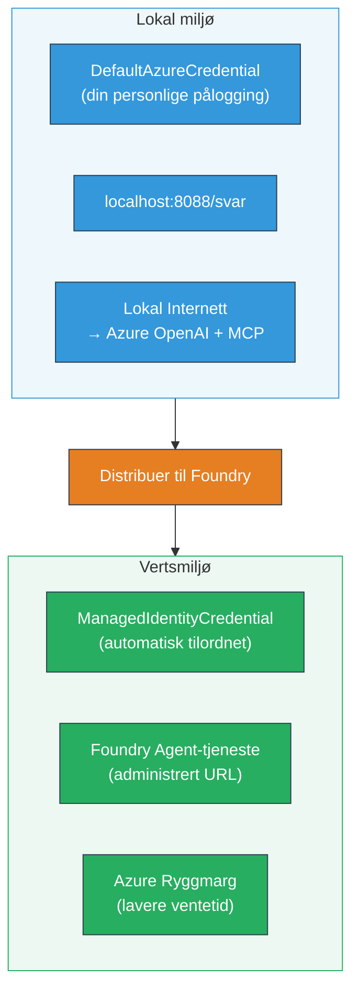

# Module 7 - Verifiser i Playground

I denne modulen tester du din distribuerte multi-agent arbeidsflyt både i **VS Code** og i **[Foundry-portalen](https://ai.azure.com)**, og bekrefter at agenten oppfører seg identisk som ved lokal testing.

---

## Hvorfor verifisere etter distribusjon?

Din multi-agent arbeidsflyt kjørte perfekt lokalt, så hvorfor teste igjen? Det hostede miljøet skiller seg i flere aspekter:


| Forskjell | Lokalt | Hostet |
|-----------|--------|--------|
| **Identitet** | [`DefaultAzureCredential`](https://learn.microsoft.com/azure/developer/python/sdk/authentication/credential-chains#defaultazurecredential-overview) (din personlige pålogging) | [`ManagedIdentityCredential`](https://learn.microsoft.com/python/api/overview/azure/identity-readme#managed-identity-support) (automatisk provisjonert) |
| **Endepunkt** | `http://localhost:8088/responses` | [Foundry Agent Service](https://learn.microsoft.com/azure/foundry/agents/concepts/hosted-agents) endepunkt (administrert URL) |
| **Nettverk** | Lokal maskin → Azure OpenAI + MCP utgående | Azure ryggrad (lavere ventetid mellom tjenester) |
| **MCP tilkobling** | Lokal internett → `learn.microsoft.com/api/mcp` | Container utgående → `learn.microsoft.com/api/mcp` |

Hvis noen miljøvariabler er feil konfigurert, RBAC er ulikt, eller MCP-utgående er blokkert, fanger du det her.

---

## Alternativ A: Test i VS Code Playground (anbefalt først)

[Foundry-utvidelsen](https://marketplace.visualstudio.com/items?itemName=TeamsDevApp.vscode-ai-foundry) inkluderer en integrert Playground som lar deg chatte med din distribuerte agent uten å forlate VS Code.

### Trinn 1: Naviger til din hostede agent

1. Klikk på **Microsoft Foundry**-ikonet i VS Code **Aktivitetslinje** (venstre sidepanel) for å åpne Foundry-panelet.
2. Utvid prosjektet du er koblet til (f.eks. `workshop-agents`).
3. Utvid **Hosted Agents (Preview)**.
4. Du skal se agentens navn (f.eks. `resume-job-fit-evaluator`).

### Trinn 2: Velg en versjon

1. Klikk på agentnavnet for å utvide versjonene.
2. Klikk på versjonen du har distribuert (f.eks. `v1`).
3. Et **detaljpanel** åpnes som viser Container-detaljer.
4. Verifiser at status er **Started** eller **Running**.

### Trinn 3: Åpne Playground

1. I detaljpanelet klikker du på **Playground**-knappen (eller høyreklikk på versjonen → **Open in Playground**).
2. En chattegrensesnitt åpnes i en VS Code-fane.

### Trinn 4: Kjør dine røyktester

Bruk de samme 3 testene fra [Modul 5](05-test-locally.md). Skriv hver melding i Playground innskrivningsfelt og trykk **Send** (eller **Enter**).

#### Test 1 - Full CV + JD (standardflyt)

Lim inn full CV + JD-prompt fra Modul 5, Test 1 (Jane Doe + Senior Cloud Engineer hos Contoso Ltd).

**Forventet:**
- Fit-score med detaljert matematikk (100-poengsskala)
- Seksjon med Matchede Ferdigheter
- Seksjon med Manglende Ferdigheter
- **Ett gap-kort per manglende ferdighet** med Microsoft Learn-URLer
- Læringsplan med tidslinje

#### Test 2 - Rask kort test (minimalt input)

```
RESUME: 3 years Python developer, knows Django and PostgreSQL, no cloud experience.

JOB: Cloud DevOps Engineer requiring AWS, Kubernetes, Terraform, CI/CD. 5 years needed.
```

**Forventet:**
- Lavere fit-score (< 40)
- Ærlig vurdering med trinnvis læringsplan
- Flere gap-kort (AWS, Kubernetes, Terraform, CI/CD, erfaring-gap)

#### Test 3 - Kandidat med høy match

```
RESUME:
10 years Azure Cloud Architect. AZ-305 certified. Expert in AKS, Terraform, Azure DevOps, 
Azure Functions, Helm, Prometheus, Grafana, Python, Go. Led platform team of 8.

JOB:
Senior Cloud Engineer. Required: AKS, Terraform, Azure DevOps, Python. Preferred: Helm, Go.
5+ years experience. AZ-305 preferred.
```

**Forventet:**
- Høy fit-score (≥ 80)
- Fokus på intervjuklarhet og finsliping
- Få eller ingen gap-kort
- Kort tidslinje med fokus på forberedelser

### Trinn 5: Sammenlign med lokale resultater

Åpne notatene eller nettleserfanen fra Modul 5 hvor du lagret lokale svar. For hver test:

- Har svaret **samme struktur** (fit-score, gap-kort, plan)?
- Følger det **samme poengskjemaet** (100-poengs inndeling)?
- Er **Microsoft Learn-URLer** fortsatt til stede i gap-kortene?
- Er det **ett gap-kort per manglende ferdighet** (ikke avkortet)?

> **Små ordvalgforskjeller er normalt** - modellen er ikke deterministisk. Fokuser på struktur, poengkonsistens og MCP-verktøybruk.

---

## Alternativ B: Test i Foundry-portalen

[Foundry-portalen](https://ai.azure.com) tilbyr en nettbasert playground som er nyttig for å dele med kolleger eller interessenter.

### Trinn 1: Åpne Foundry-portalen

1. Åpne nettleseren din og gå til [https://ai.azure.com](https://ai.azure.com).
2. Logg inn med samme Azure-konto som du har brukt gjennom hele workshopen.

### Trinn 2: Naviger til prosjektet ditt

1. På startsiden finner du **Nylige prosjekter** i venstre sidepanel.
2. Klikk på prosjektets navn (f.eks. `workshop-agents`).
3. Hvis du ikke ser det, klikk **Alle prosjekter** og søk etter det.

### Trinn 3: Finn din distribuerte agent

1. I prosjektets venstremeny klikker du **Bygg** → **Agenter** (eller se etter **Agenter**-seksjonen).
2. Du skal se en liste over agenter. Finn din distribuerte agent (f.eks. `resume-job-fit-evaluator`).
3. Klikk på agentnavnet for å åpne detaljsiden.

### Trinn 4: Åpne Playground

1. På agentens detaljside ser du på toppverktøylinjen.
2. Klikk **Open in playground** (eller **Try in playground**).
3. Et chattegrensesnitt åpnes.

### Trinn 5: Kjør de samme røyktestene

Gjenta alle 3 testene fra VS Code Playground-seksjonen ovenfor. Sammenlign hvert svar med både lokale resultater (Modul 5) og VS Code Playground-resultater (Alternativ A over).

---

## Multi-agent spesifikk verifisering

Utover grunnleggende korrekthet, verifiser disse multi-agent-spesifikke oppførslene:

### Eksekvering av MCP-verktøy

| Sjekk | Hvordan verifisere | Bestått betingelse |
|-------|--------------------|--------------------|
| MCP-kall lykkes | Gap-kort inneholder `learn.microsoft.com` URLer | Reelle URLer, ikke fallback-meldinger |
| Flere MCP-kall | Hvert gap med høy/middels prioritet har ressurser | Ikke bare det første gap-kortet |
| MCP fallback fungerer | Hvis URLer mangler, sjekk etter fallback-tekst | Agent produserer fortsatt gap-kort (med eller uten URLer) |

### Agent-koordinasjon

| Sjekk | Hvordan verifisere | Bestått betingelse |
|-------|--------------------|--------------------|
| Alle 4 agenter kjørte | Utdata inneholder fit-score OG gap-kort | Score kommer fra MatchingAgent, kort fra GapAnalyzer |
| Parallell distribusjon | Respons tid er rimelig (< 2 min) | Hvis > 3 min, fungerer kanskje ikke parallell kjøring |
| Dataintegritet | Gap-kort refererer ferdigheter fra matching-rapporten | Ingen oppdiktede ferdigheter som ikke er i JD |

---

## Valideringsskjema

Bruk denne skjemaet for å evaluere din multi-agent arbeidsflyts hostede oppførsel:

| # | Kriterium | Bestått betingelse | Bestått? |
|---|-----------|--------------------|----------|
| 1 | **Funksjonell korrekthet** | Agent svarer på CV + JD med fit-score og gap-analyse | |
| 2 | **Poengkonsistens** | Fit-score bruker 100-poengsskala med detaljert matematikk | |
| 3 | **Fullstendighet i gap-kort** | Ett kort per manglende ferdighet (ikke avkortet eller kombinert) | |
| 4 | **MCP verktøy-integrasjon** | Gap-kort inkluderer ekte Microsoft Learn-URLer | |
| 5 | **Strukturell konsistens** | Utdata struktur matcher mellom lokale og hostede kjøringer | |
| 6 | **Responstid** | Hostet agent svarer innen 2 minutter for full vurdering | |
| 7 | **Ingen feil** | Ingen HTTP 500 feil, tidsavbrudd eller tomme svar | |

> En "bestått" betyr at alle 7 kriteriene er oppfylt for alle 3 røyktester i minst en playground (VS Code eller Portal).

---

## Feilsøking av playground-problemer

| Symptom | Sannsynlig årsak | Løsning |
|---------|------------------|---------|
| Playground laster ikke | Containerstatus ikke "Started" | Gå tilbake til [Modul 6](06-deploy-to-foundry.md), verifiser distribusjonsstatus. Vent hvis "Pending" |
| Agent returnerer tomt svar | Modelldistribusjonsnavn stemmer ikke | Sjekk `agent.yaml` → `environment_variables` → `MODEL_DEPLOYMENT_NAME` matcher distribuert modell |
| Agent returnerer feilmelding | [RBAC](https://learn.microsoft.com/azure/foundry/concepts/rbac-foundry) tillatelse mangler | Tildel **[Azure AI User](https://aka.ms/foundry-ext-project-role)** på prosjektomfang |
| Ingen Microsoft Learn-URLer i gap-kort | MCP utgående blokkert eller MCP-server utilgjengelig | Sjekk om container kan nå `learn.microsoft.com`. Se [Modul 8](08-troubleshooting.md) |
| Kun 1 gap-kort (avkortet) | GapAnalyzer instruksjoner mangler "CRITICAL" blokk | Gå gjennom [Modul 3, Trinn 2.4](03-configure-agents.md) |
| Fit-score veldig annerledes enn lokalt | Annen modell eller instruksjoner distribuert | Sammenlign `agent.yaml` miljøvariabler med lokal `.env`. Distribuer på nytt hvis nødvendig |
| "Agent not found" i Portalen | Distribusjonen sprer seg fortsatt eller feilet | Vent 2 minutter, oppdater. Hvis fortsatt mangler, deploy på nytt fra [Modul 6](06-deploy-to-foundry.md) |

---

### Sjekkliste

- [ ] Testet agent i VS Code Playground - alle 3 røyktester bestått
- [ ] Testet agent i [Foundry-portalen](https://ai.azure.com) Playground - alle 3 røyktester bestått
- [ ] Svar er strukturelt konsistente med lokal testing (fit-score, gap-kort, plan)
- [ ] Microsoft Learn-URLer er til stede i gap-kort (MCP-verktøy fungerer i hostet miljø)
- [ ] Ett gap-kort per manglende ferdighet (ingen avkorting)
- [ ] Ingen feil eller tidsavbrudd under testing
- [ ] Fullført valideringsskjema (alle 7 kriterier bestått)

---

**Forrige:** [06 - Deploy to Foundry](06-deploy-to-foundry.md) · **Neste:** [08 - Troubleshooting →](08-troubleshooting.md)

---

<!-- CO-OP TRANSLATOR DISCLAIMER START -->
**Ansvarsfraskrivelse**:  
Dette dokumentet er oversatt ved hjelp av AI-oversettelsestjenesten [Co-op Translator](https://github.com/Azure/co-op-translator). Selv om vi streber etter nøyaktighet, vennligst vær oppmerksom på at automatiske oversettelser kan inneholde feil eller unøyaktigheter. Det originale dokumentet på dets opprinnelige språk skal anses som den autoritative kilden. For kritisk informasjon anbefales profesjonell menneskelig oversettelse. Vi er ikke ansvarlige for eventuelle misforståelser eller feiltolkninger som oppstår ved bruk av denne oversettelsen.
<!-- CO-OP TRANSLATOR DISCLAIMER END -->