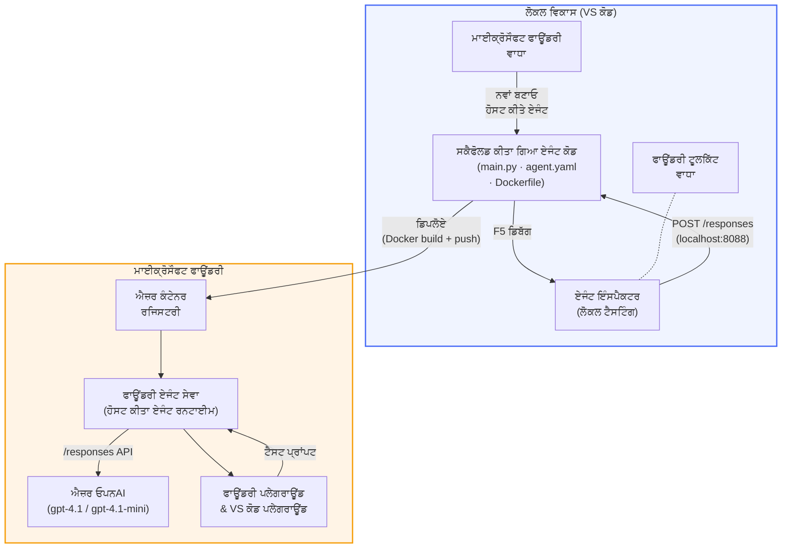

# Foundry Toolkit + Foundry Hosted Agents ਵਰਕਸ਼ਾਪ

[](https://www.python.org/)
[](https://github.com/microsoft/agents)
[](https://learn.microsoft.com/azure/ai-foundry/agents/concepts/hosted-agents/)
[](https://ai.azure.com/)
[](https://learn.microsoft.com/azure/ai-services/openai/)
[](https://learn.microsoft.com/cli/azure/install-azure-cli)
[](https://learn.microsoft.com/azure/developer/azure-developer-cli/install-azd)
[](https://www.docker.com/)
[](https://marketplace.visualstudio.com/items?itemName=ms-windows-ai-studio.windows-ai-studio)
[](LICENSE)

**Microsoft Foundry Agent Service** ਦੇ ਤੌਰ ਤੇ AI ਏਜੰਟ ਬਣਾਓ, ਟੈਸਟ ਕਰੋ ਅਤੇ ਤੈਨਾਤ ਕਰੋ ***Hosted Agents*** - ਪੂਰੀ ਤਰ੍ਹਾਂ VS ਕੋਡ ਵਿੱਚੋਂ ਮਾਈਕਰੋਸਾਫਟ ਫਾਉਂਡਰੀ ਐਕਸਟੈਂਸ਼ਨ ਅਤੇ ਫਾਉਂਡਰੀ ਟੂਲਕਿਟ ਦੀ ਵਰਤੋਂ ਕਰਕੇ।

> **Hosted Agents ਇਸ ਵੇਲੇ ਪ੍ਰੀਵਿਊ ਵਿੱਚ ਹਨ।** ਸਮਰਥਿਤ ਖੇਤਰ ਸੀਮਿਤ ਹਨ - ਵੇਖੋ [ਖੇਤਰ ਉਪਲੱਬਧਤਾ](https://learn.microsoft.com/azure/foundry/agents/concepts/hosted-agents#region-availability)।

> ਹਰ ਲੈਬ ਵਿੱਚ `agent/` ਫੋਲਡਰ **Foundry ਐਕਸਟੈਂਸ਼ਨ ਦੁਆਰਾ ਸਵੈਚਾਲਿਤ ਰੂਪ ਵਿੱਚ ਬਣਾਇਆ ਜਾਂਦਾ ਹੈ** - ਫਿਰ ਤੁਸੀਂ ਕੋਡ ਨੂੰ ਕਸਟਮਾਈਜ਼ ਕਰੋ, ਸਥਾਨਕ ਟੈਸਟ ਕਰੋ ਅਤੇ ਤੈਨਾਤ ਕਰੋ।

### 🌐 ਬਹੁ-ਭਾਸ਼ਾਈ ਸਹਿਯੋਗ

#### GitHub Action ਰਾਹੀਂ ਸਮਰਥਿਤ (ਸਵੈਚਾਲਿਤ ਅਤੇ ਹਮੇਸ਼ਾ ਅਪ-ਟੂ-ਡੇਟ)

<!-- CO-OP TRANSLATOR LANGUAGES TABLE START -->
[Arabic](../ar/README.md) | [Bengali](../bn/README.md) | [Bulgarian](../bg/README.md) | [Burmese (Myanmar)](../my/README.md) | [Chinese (Simplified)](../zh-CN/README.md) | [Chinese (Traditional, Hong Kong)](../zh-HK/README.md) | [Chinese (Traditional, Macau)](../zh-MO/README.md) | [Chinese (Traditional, Taiwan)](../zh-TW/README.md) | [Croatian](../hr/README.md) | [Czech](../cs/README.md) | [Danish](../da/README.md) | [Dutch](../nl/README.md) | [Estonian](../et/README.md) | [Finnish](../fi/README.md) | [French](../fr/README.md) | [German](../de/README.md) | [Greek](../el/README.md) | [Hebrew](../he/README.md) | [Hindi](../hi/README.md) | [Hungarian](../hu/README.md) | [Indonesian](../id/README.md) | [Italian](../it/README.md) | [Japanese](../ja/README.md) | [Kannada](../kn/README.md) | [Khmer](../km/README.md) | [Korean](../ko/README.md) | [Lithuanian](../lt/README.md) | [Malay](../ms/README.md) | [Malayalam](../ml/README.md) | [Marathi](../mr/README.md) | [Nepali](../ne/README.md) | [Nigerian Pidgin](../pcm/README.md) | [Norwegian](../no/README.md) | [Persian (Farsi)](../fa/README.md) | [Polish](../pl/README.md) | [Portuguese (Brazil)](../pt-BR/README.md) | [Portuguese (Portugal)](../pt-PT/README.md) | [Punjabi (Gurmukhi)](./README.md) | [Romanian](../ro/README.md) | [Russian](../ru/README.md) | [Serbian (Cyrillic)](../sr/README.md) | [Slovak](../sk/README.md) | [Slovenian](../sl/README.md) | [Spanish](../es/README.md) | [Swahili](../sw/README.md) | [Swedish](../sv/README.md) | [Tagalog (Filipino)](../tl/README.md) | [Tamil](../ta/README.md) | [Telugu](../te/README.md) | [Thai](../th/README.md) | [Turkish](../tr/README.md) | [Ukrainian](../uk/README.md) | [Urdu](../ur/README.md) | [Vietnamese](../vi/README.md)

> **ਛੇਤੀ ਨਕਲ ਕਰਨਾ ਚਾਹੁੰਦੇ ਹੋ?**
>
> ਇਸ ਰਿਪੋ ਵਿੱਚ 50+ ਭਾਸ਼ਾਈ ਅਨੁਵਾਦ ਸ਼ਾਮਿਲ ਹਨ ਜੋ ਡਾਊਨਲੋਡ ਆਕਾਰ ਨੂੰ ਕਾਫੀ ਵਧਾਉਂਦੇ ਹਨ। ਬਿਨਾਂ ਅਨੁਵਾਦਾਂ ਦੇ ਨਕਲ ਕਰਨ ਲਈ sparse checkout ਦੀ ਵਰਤੋਂ ਕਰੋ:
>
> **Bash / macOS / Linux:**
> ```bash
> git clone --filter=blob:none --sparse https://github.com/microsoft-foundry/Foundry_Toolkit_for_VSCode_Lab.git
> cd Foundry_Toolkit_for_VSCode_Lab
> git sparse-checkout set --no-cone '/*' '!translations' '!translated_images'
> ```
>
> **CMD (Windows):**
> ```cmd
> git clone --filter=blob:none --sparse https://github.com/microsoft-foundry/Foundry_Toolkit_for_VSCode_Lab.git
> cd Foundry_Toolkit_for_VSCode_Lab
> git sparse-checkout set --no-cone "/*" "!translations" "!translated_images"
> ```
>
> ਇਹ ਤੁਹਾਨੂੰ ਕੋਰਸ ਪੂਰਾ ਕਰਨ ਲਈ ਸਾਰਾ ਜਰੂਰੀ ਸਮਾਨ ਤੇਜ਼ ਡਾਊਨਲੋਡ ਨਾਲ ਦਿੰਦਾ ਹੈ।
<!-- CO-OP TRANSLATOR LANGUAGES TABLE END -->

---

## ਆਰਕੀਟੈਕਚਰ


**ਫਲੋ:** Foundry ਐਕਸਟੈਂਸ਼ਨ ਏਜੰਟ ਨੂੰ ਸਕੈਫੋਲਡ ਕਰਦਾ ਹੈ → ਤੁਸੀਂ ਕੋਡ ਅਤੇ ਨਿਰਦੇਸ਼ ਨੂੰ ਨਿੱਜੀਕਰਤ ਕਰਦੇ ਹੋ → Agent Inspector ਨਾਲ ਸਥਾਨਕ ਟੈਸਟ → Foundry 'ਤੇ ਤੈਨਾਤ (Docker ਇਮੇਜ ACR ਨੂੰ ਧੱਕਿਆ ਜਾਂਦਾ ਹੈ) → Playground ਵਿੱਚ ਜਾਂਚ ਕਰੋ।

---

## ਤੁਸੀਂ ਕੀ ਬਣਾਵੋਗੇ

| ਲੈਬ | ਵੇਰਵਾ | ਸਥਿਤੀ |
|-----|-------------|--------|
| **Lab 01 - ਸਿੰਗਲ ਏਜੰਟ** | **"Explain Like I'm an Executive"** ਏਜੰਟ ਬਣਾਓ, ਸਥਾਨਕ ਟੈਸਟ ਕਰੋ ਅਤੇ Foundry ਤੇ ਤੈਨਾਤ ਕਰੋ | ✅ ਉਪਲਬਧ |
| **Lab 02 - ਮਲਟੀ-ਏਜੰਟ ਵਰਕਫਲੋ** | **"Resume → Job Fit Evaluator"** ਬਣਾਓ - 4 ਏਜੰਟ ਰੇਜ਼ਿਊਮ ਫਿਟ ਸਕੋਰ ਕਰਨ ਅਤੇ ਸਿੱਖਣ ਦਾ ਰੋਡਮੈਪ ਬਣਾਉਣ ਲਈ ਸਹਿਯੋਗ ਕਰਦੇ ਹਨ | ✅ ਉਪਲਬਧ |

---

## Executive Agent ਨਾਲ ਮਿਲੋ

ਇਸ ਵਰਕਸ਼ਾਪ ਵਿੱਚ ਤੁਸੀਂ **"Explain Like I'm an Executive"** ਏਜੰਟ ਬਣਾਵੋਗੇ - ਇੱਕ ਐਸਾ AI ਏਜੰਟ ਜੋ ਗੰਭੀਰ ਤਕਨੀਕੀ ਜਾਰਗਨ ਨੂੰ ਲੈਂਦਾ ਹੈ ਅਤੇ ਉਸ ਨੂੰ ਸ਼ਾਂਤ, ਬੋਰਡਰੂਮ-ਤਿਆਰ ਸੰਖੇਪ ਵਿੱਚ ਤਰਜਮਾ ਕਰਦਾ ਹੈ। ਕਿਉਂਕਿ ਆਓ ਸੱਚ ਬੋਲੀਂ, C-suite ਵਿੱਚ ਕਿਸੇ ਨੂੰ ਵੀ "v3.2 ਵਿੱਚ ਲਾਗੂ ਸਿੰਕ੍ਰੋਨਸ ਕਾਲਾਂ ਕਾਰਨ থ੍ਰੈਡ ਪੂਲ ਖ਼ਤਮ ਹੋਣਾ" ਦੇ ਬਾਰੇ ਸੁਣਨਾ ਨਹੀਂ ਚਾਹੀਦਾ।

ਮੈਂ ਇਹ ਏਜੰਟ ਉਸ ਵਾਰ ਬਣਾਇਆ ਸੀ ਜਦੋਂ ਮੇਰੀ ਪਰਫੈਕਟ ਪੋਸਟ-ਮੋਰਟਮ ਨੂੰ ਜਵਾਬ ਮਿਲਿਆ: *"ਤਾਂ... ਵੈਬਸਾਈਟ ਡਾਊਨ ਹੈ ਜਾਂ ਨਹੀਂ?"*

### ਇਹ ਕਿਵੇਂ ਕੰਮ ਕਰਦਾ ਹੈ

ਤੁਸੀਂ ਇਸਨੂੰ ਇਕ ਤਕਨੀਕੀ ਅੱਪਡੇਟ ਦਿੰਦੇ ਹੋ। ਇਹ ਇਕਜ਼ੈਕਟਿਵ ਸਮਰੀ ਵਾਪਸ ਕਰਦਾ ਹੈ - ਤਿੰਨ ਬੁਲੇਟ ਪੌਇੰਟਸ, ਕੋਈ ਜਾਰਗਨ ਨਹੀਂ, ਕੋਈ ਸਟੈਕ ਟ੍ਰੇਸ ਨਹੀਂ, ਕੋਈ ਅਸਤੀਤਤਕ ਡਰ ਨਹੀਂ। ਸਿਰਫ **ਕੀ ਹੋਇਆ**, **ਕਾਰੋਬਾਰੀ ਪ੍ਰਭਾਵ**, ਅਤੇ **ਅਗਲਾ ਕਦਮ**।

### ਅਮਲ ਵਿੱਚ ਵੇਖੋ

**ਤੁਸੀਂ ਕਹਿੰਦੇ ਹੋ:**
> "The API latency increased due to thread pool exhaustion caused by synchronous calls introduced in v3.2."

**ਏਜੰਟ ਜਵਾਬ ਦਿੰਦਾ ਹੈ:**

> **Executive Summary:**
> - **ਕੀ ਹੋਇਆ:** ਨਵੀਨਤਮ ਰਿਲੀਜ਼ ਦੇ ਬਾਦ ਸਿਸਟਮ ਦੇਰ ਨਾਲ ਚਲਿਆ।
> - **ਕਾਰੋਬਾਰੀ ਪ੍ਰਭਾਵ:** ਕੁਝ ਉਪਭੋਗਤਾਵਾਂ ਨੇ ਸੇਵਾ ਦੀ ਵਰਤੋਂ ਦੌਰਾਨ ਦੇਰੀ ਮਹਿਸੂਸ ਕੀਤੀ।
> - **ਅਗਲਾ ਕਦਮ:** ਬਦਲਾਅ ਵਾਪਸ ਲਿਆ ਗਿਆ ਹੈ ਅਤੇ ਮੁੜ ਤੈਨਾਤ ਕਰਨ ਤੋਂ ਪਹਿਲਾਂ ਮੁਰੰਮਤ ਤਿਆਰ ਕੀਤੀ ਜਾ ਰਹੀ ਹੈ।

### ਇਹ ਏਜੰਟ ਕਿਉਂ?

ਇਹ ਇੱਕ ਬਹੁਤ ਸਿਧਾ ਸਧਾਰਣ, ਇੱਕ ਹੀ ਉਦੇਸ਼ ਵਾਲਾ ਏਜੰਟ ਹੈ - ਜੋ ਹੋਸਟ ਕੀਤੇ ਏਜੰਟ ਵਰਕਫਲੋ ਨੂੰ ਅੰਤ ਤੋਂ ਅੰਤ ਤੱਕ ਸਿੱਖਣ ਲਈ ਬਿਲਕੁਲ ਬਿਹਤਰ ਹੈ ਬਿਨਾਂ ਸਥੂਲ ਟੂਲ ਚੇਨਾਂ ਵਿੱਚ ਘਿਰੇ। ਅਤੇ ਅਸਲ ਵਿੱਚ? ਹਰ ਇੰਜੀਨੀਅਰਿੰਗ ਟੀਮ ਨੂੰ ਇਕ ਐਸਾ ਏਜੰਟ ਚਾਹੀਦਾ ਹੈ।

---

## ਵਰਕਸ਼ਾਪ ਡਾਂਚਾ

```
📂 Foundry_Toolkit_for_VSCode_Lab/
├── 📄 README.md                      ← You are here
├── 📂 ExecutiveAgent/                ← Standalone hosted agent project
│   ├── agent.yaml
│   ├── Dockerfile
│   ├── main.py
│   └── requirements.txt
└── 📂 workshop/
    ├── 📂 lab01-single-agent/        ← Full lab: docs + agent code
    │   ├── README.md                 ← Hands-on lab instructions
    │   ├── 📂 docs/                  ← Step-by-step tutorial modules
    │   │   ├── 00-prerequisites.md
    │   │   ├── 01-install-foundry-toolkit.md
    │   │   ├── 02-create-foundry-project.md
    │   │   ├── 03-create-hosted-agent.md
    │   │   ├── 04-configure-and-code.md
    │   │   ├── 05-test-locally.md
    │   │   ├── 06-deploy-to-foundry.md
    │   │   ├── 07-verify-in-playground.md
    │   │   └── 08-troubleshooting.md
    │   └── 📂 agent/                 ← Reference solution (auto-scaffolded by Foundry extension)
    │       ├── agent.yaml
    │       ├── Dockerfile
    │       ├── main.py
    │       └── requirements.txt
    └── 📂 lab02-multi-agent/         ← Resume → Job Fit Evaluator
        ├── README.md                 ← Hands-on lab instructions (end-to-end)
        ├── 📂 docs/                  ← Step-by-step tutorial modules
        │   ├── 00-prerequisites.md
        │   ├── 01-understand-multi-agent.md
        │   ├── 02-scaffold-multi-agent.md
        │   ├── 03-configure-agents.md
        │   ├── 04-orchestration-patterns.md
        │   ├── 05-test-locally.md
        │   ├── 06-deploy-to-foundry.md
        │   ├── 07-verify-in-playground.md
        │   └── 08-troubleshooting.md
        └── 📂 PersonalCareerCopilot/ ← Reference solution (multi-agent workflow)
            ├── agent.yaml
            ├── Dockerfile
            ├── main.py
            └── requirements.txt
```

> **نوٹ:** ਹਰ ਲੈਬ ਵਿੱਚ `agent/` ਫੋਲਡਰ ਉਹੀ ਹੁੰਦਾ ਹੈ ਜੋ **Microsoft Foundry ਐਕਸਟੈਂਸ਼ਨ** ਕਮਾਂਡ ਪਲੈਟੇਟ 'Microsoft Foundry: Create a New Hosted Agent' ਚਲਾਉਂਦਿਆਂ ਬਣਾਉਂਦਾ ਹੈ। ਫਾਇਲਾਂ ਫਿਰ ਤੁਹਾਡੇ ਏਜੰਟ ਦੇ ਨਿਰਦੇਸ਼, ਟੂਲਾਂ ਅਤੇ ਵਿਵਸਥਾ ਨਾਲ ਕਸਟਮਾਈਜ਼ ਕੀਤੀਆਂ ਜਾਂਦੀਆਂ ਹਨ। Lab 01 ਤੁਹਾਨੂੰ ਥਾਂਥਾਂ ਤੋਂ ਇਹ ਦੁਬਾਰਾ ਬਣਾਉਣ ਵਿੱਚ ਮਦਦ ਕਰੇਗਾ।

---

## ਸ਼ੁਰੂਆਤ

### 1. ਰਿਪੋਜ਼ਟਰੀ ਕਲੋਨ ਕਰੋ

```bash
git clone https://github.com/microsoft-foundry/Foundry_Toolkit_for_VSCode_Lab.git
cd Foundry_Toolkit_for_VSCode_Lab
```

### 2. Python ਵਰਚੁਅਲ ਵਾਤਾਵਰਣ ਸੈਟ ਕਰੋ

```bash
python -m venv venv
```

ਇਸਨੂੰ ਸක්ਰੀਆ ਕਰੋ:

- **Windows (PowerShell):**
  ```powershell
  .\venv\Scripts\Activate.ps1
  ```
- **macOS / Linux:**
  ```bash
  source venv/bin/activate
  ```

### 3. ਨਿਰਭਰਤਾਵਾਂ ਇੰਸਟਾਲ ਕਰੋ

```bash
pip install -r workshop/lab01-single-agent/agent/requirements.txt
```

### 4. ਵਾਤਾਵਰਣ ਵੈਰੀਏਬਲ ਸੈੱਟ ਕਰੋ

Agent ਫੋਲਡਰ ਦੇ ਅੰਦਰ `.env` ਫਾਇਲ ਦੀ ਨਕਲ ਕਰੋ ਅਤੇ ਆਪਣੀਆਂ ਕਦਰਾਂ ਭਰੋ:

```bash
cp workshop/lab01-single-agent/agent/.env.example workshop/lab01-single-agent/agent/.env
```

`workshop/lab01-single-agent/agent/.env` ਨੂੰ ਸੰਪਾਦਿਤ ਕਰੋ:

```env
AZURE_AI_PROJECT_ENDPOINT=https://<your-account>.services.ai.azure.com/api/projects/<your-project>
MODEL_DEPLOYMENT_NAME=<your-model-deployment-name>
```

### 5. ਵਰਕਸ਼ਾਪ ਲੈਬਜ਼ ਦੀ ਪਾਲਣਾ ਕਰੋ

ਹਰ ਲੈਬ ਆਪਣੇ ਮਾਡਿਊਲ ਨਾਲ ਖੁਦਮੁਖਤਿਆਰ ਹੈ। ਮੂਲ ਭੂਤ ਸਿੱਖਣ ਲਈ **Lab 01** ਨਾਲ ਸ਼ੁਰੂ ਕਰੋ, ਫਿਰ ਮਲਟੀ-ਏਜੰਟ ਵਰਕਫਲੋ ਲਈ **Lab 02** ਚਲੇ ਜਾਓ।

#### Lab 01 - ਸਿੰਗਲ ਏਜੰਟ ([ਪੂਰੇ ਨਿਰਦੇਸ਼](workshop/lab01-single-agent/README.md))

| # | ਮਾਡਿਊਲ | ਲਿੰਕ |
|---|--------|------|
| 1 | ਤਿਆਰੀ ਪੜ੍ਹੋ | [00-prerequisites.md](workshop/lab01-single-agent/docs/00-prerequisites.md) |
| 2 | Foundry Toolkit ਅਤੇ Foundry ਐਕਸਟੈਂਸ਼ਨ ਇੰਸਟਾਲ ਕਰੋ | [01-install-foundry-toolkit.md](workshop/lab01-single-agent/docs/01-install-foundry-toolkit.md) |
| 3 | Foundry ਪ੍ਰੋਜੈਕਟ ਬਣਾਓ | [02-create-foundry-project.md](workshop/lab01-single-agent/docs/02-create-foundry-project.md) |
| 4 | ਇੱਕ ਹੋਸਟਡ ਏਜੰਟ ਬਣਾਓ | [03-create-hosted-agent.md](workshop/lab01-single-agent/docs/03-create-hosted-agent.md) |
| 5 | ਨਿਰਦੇਸ਼ ਅਤੇ ਵਾਤਾਵਰਣ ਕਨਫਿਗਰ ਕਰੋ | [04-configure-and-code.md](workshop/lab01-single-agent/docs/04-configure-and-code.md) |
| 6 | ਸਥਾਨਕ ਟੈਸਟ ਕਰੋ | [05-test-locally.md](workshop/lab01-single-agent/docs/05-test-locally.md) |
| 7 | Foundry ਤੇ ਤੈਨਾਤ ਕਰੋ | [06-deploy-to-foundry.md](workshop/lab01-single-agent/docs/06-deploy-to-foundry.md) |
| 8 | ਪਲੇਗ੍ਰਾਊਂਡ ਵਿੱਚ ਜਾਂਚ ਕਰੋ | [07-verify-in-playground.md](workshop/lab01-single-agent/docs/07-verify-in-playground.md) |
| 9 | ਸਮੱਸਿਆ ਸੁਧਾਰ | [08-troubleshooting.md](workshop/lab01-single-agent/docs/08-troubleshooting.md) |

#### Lab 02 - ਮਲਟੀ-ਏਜੰਟ ਵਰਕਫਲੋ ([ਪੂਰੇ ਨਿਰਦੇਸ਼](workshop/lab02-multi-agent/README.md))

| # | ਮਾਡਿਊਲ | ਲਿੰਕ |
|---|--------|------|
| 1 | ਲੈਬ 02 ਲਈ ਤਿਆਰੀ | [00-prerequisites.md](workshop/lab02-multi-agent/docs/00-prerequisites.md) |
| 2 | ਮਲਟੀ-ਏਜੰਟ ਆਰਕੀਟੈਕਚਰ ਸਮਝੋ | [01-understand-multi-agent.md](workshop/lab02-multi-agent/docs/01-understand-multi-agent.md) |
| 3 | ਮਲਟੀ-ਏਜੰਟ ਪ੍ਰੋਜੈਕਟ ਸਕੈਫੋਲਡ ਕਰੋ | [02-scaffold-multi-agent.md](workshop/lab02-multi-agent/docs/02-scaffold-multi-agent.md) |
| 4 | ਏਜੰਟ ਅਤੇ ਵਾਤਾਵਰਣ ਕਨਫਿਗਰ ਕਰੋ | [03-configure-agents.md](workshop/lab02-multi-agent/docs/03-configure-agents.md) |
| 5 | ਆਰਕੇਸਟ੍ਰੇਸ਼ਨ ਪੈਟਰਨ | [04-orchestration-patterns.md](workshop/lab02-multi-agent/docs/04-orchestration-patterns.md) |
| 6 | ਸਥਾਨਕ ਟੈਸਟ ਕਰੋ (ਮਲਟੀ-ਏਜੰਟ) | [05-test-locally.md](workshop/lab02-multi-agent/docs/05-test-locally.md) |
| 7 | ਫਾਉਂਡਰੀ 'ਤੇ ਤੈਨਾਤ ਕਰੋ | [06-deploy-to-foundry.md](workshop/lab02-multi-agent/docs/06-deploy-to-foundry.md) |
| 8 | ਖੇਡ ਮੈਦਾਨ ਵਿੱਚ ਜਾਂਚ ਕਰੋ | [07-verify-in-playground.md](workshop/lab02-multi-agent/docs/07-verify-in-playground.md) |
| 9 | ਸਮੱਸਿਆ ਨਿਵਾਰਣ (ਬਹੁ-ਏਜੈਂਟ) | [08-troubleshooting.md](workshop/lab02-multi-agent/docs/08-troubleshooting.md) |

---

## ਮੇਨਟੇਨਰ

<table>
<tr>
    <td align="center"><a href="https://github.com/ShivamGoyal03">
        <br />
        <sub><b>ਸ਼ਿਵਮ ਗੋਯਲ</b></sub>
    </a><br />
    </td>
</tr>
</table>

---

## ਲੋੜੀਂਦੇ ਅਧਿਕਾਰ (ਤੁਰੰਤ ਸੰਦਰਭ)

| ਦ੍ਰਿਸ਼ | ਲੋੜੀਂਦੇ ਰੋਲ |
|----------|---------------|
| ਨਵਾਂ ਫਾਉਂਡਰੀ ਪ੍ਰੋਜੈਕਟ ਬਣਾਓ | ਫਾਉਂਡਰੀ ਸਰੋਤ 'ਤੇ **Azure AI ਮਾਲਕ** |
| ਮੌਜੂਦਾ ਪ੍ਰੋਜੈਕਟ ('ਚ ਨਵੇਂ ਸਰੋਤ) ਨੂੰ ਤੈਨਾਤ ਕਰੋ | ਸਬਸਕ੍ਰਿਪਸ਼ਨ 'ਤੇ **Azure AI ਮਾਲਕ** + **ਯੋਗਦਾਤਾ** |
| ਪੂਰੀ ਤਰ੍ਹਾਂ ਸੰਰਚਿਤ ਪ੍ਰੋਜੈਕਟ ਨੂੰ ਤੈਨਾਤ ਕਰੋ | ਖਾਤੇ 'ਤੇ **ਪਾਠਕ** + ਪ੍ਰੋਜੈਕਟ 'ਤੇ **Azure AI ਉਪਭੋਗਤਾ** |

> **ਮਹੱਤਵਪੂਰਨ:** Azure `ਮਾਲਕ` ਅਤੇ `ਯੋਗਦਾਤਾ` ਰੋਲ ਵਿੱਚ ਸਿਰਫ *ਪ੍ਰਬੰਧਨ* ਅਧਿਕਾਰ ਸ਼ਾਮਲ ਹੁੰਦੇ ਹਨ, ਨਕਿ *ਵਿਕਾਸ* (ਡਾਟਾ ਕਿਰਿਆ) ਅਧਿਕਾਰ। ਤੁਹਾਨੂੰ ਏਜੰਟ ਬਣਾਉਣ ਅਤੇ ਤੈਨਾਤ ਕਰਨ ਲਈ **Azure AI ਉਪਭੋਗਤਾ** ਜਾਂ **Azure AI ਮਾਲਕ** ਦੀ ਜ਼ਰੂਰਤ ਹੈ।

---

## ਸੰਦਰਭ

- [ਤੁਹਾਡਾ ਪਹਿਲਾ ਹੋਸਟ ਕੀਤਾ ਏਜੰਟ ਤੈਨਾਤ ਕਰਨ ਲਈ ਤੇਜ਼ ਸ਼ੁਰੂਆਤ (VS ਕੋਡ)](https://learn.microsoft.com/azure/foundry/agents/quickstarts/quickstart-hosted-agent)
- [ਹੋਸਟ ਕੀਤੇ ਏਜੰਟ ਕੀ ਹਨ?](https://learn.microsoft.com/azure/foundry/agents/concepts/hosted-agents)
- [VS ਕੋਡ ਵਿੱਚ ਹੋਸਟ ਕੀਤਾ ਏਜੰਟ ਵਰਕਫਲੋ ਬਣਾਓ](https://learn.microsoft.com/azure/foundry/agents/how-to/vs-code-agents-workflow-pro-code)
- [ਹੋਸਟ ਕੀਤਾ ਏਜੰਟ ਤੈਨਾਤ ਕਰੋ](https://learn.microsoft.com/azure/foundry/agents/how-to/deploy-hosted-agent)
- [Microsoft Foundry ਲਈ RBAC](https://learn.microsoft.com/azure/foundry/concepts/rbac-foundry)
- [ਆਰਕੀਟੈਕਚਰ ਸਮੀਖਿਆ ਏਜੰਟ ਨਮੂਨਾ](https://github.com/Azure-Samples/agent-architecture-review-sample) - MCP ਸੰਦਾਂ, Excalidraw ਡਾਇਗ੍ਰਾਮਾਂ, ਅਤੇ ਡੁਅਲ ਤੈਨਾਤੀ ਦੇ ਨਾਲ ਅਸਲੀ ਦੁਨੀਆ ਦਾ ਹੋਸਟ ਕੀਤਾ ਏਜੰਟ

---

## ਲਾਇਸੰਸ

[MIT](../../LICENSE)

---

<!-- CO-OP TRANSLATOR DISCLAIMER START -->
**ਅਸਵੀਕਾਰਤਾ**:  
ਇਸ ਦਸਤਾਵੇਜ਼ ਦਾ ਅਨੁਵਾਦ ਏਆਈ ਅਨੁਵਾਦ ਸੇਵਾ [Co-op Translator](https://github.com/Azure/co-op-translator) ਦੀ ਵਰਤੋਂ ਨਾਲ ਕੀਤਾ ਗਿਆ ਹੈ। ਜਦੋਂ ਕਿ ਅਸੀਂ ਸਹੀਤਾ ਲਈ ਕੋਸ਼ਿਸ਼ ਕਰਦੇ ਹਾਂ, ਕਿਰਪਾ ਕਰਕੇ ਧਿਆਨ ਰੱਖੋ ਕਿ ਆਟੋਮੇਟਿਕ ਅਨੁਵਾਦਾਂ ਵਿੱਚ ਗਲਤੀਆਂ ਜਾਂ ਅਸਮਰਥਤਾਵਾਂ ਹੋ ਸਕਦੀਆਂ ਹਨ। ਮੂਲ ਦਸਤਾਵੇਜ਼ ਆਪਣੀ ਮੂਲ ਭਾਸ਼ਾ ਵਿੱਚ ਹੀ ਅਧਿਕਾਰਤ ਸਰੋਤ ਮੰਨਿਆ ਜਾਣਾ ਚਾਹੀਦਾ ਹੈ। ਮਹੱਤਵਪੂਰਣ ਜਾਣਕਾਰੀ ਲਈ, ਪੇਸ਼ੇਵਰ ਮਨੁੱਖੀ ਅਨੁਵਾਦ ਦੀ ਸਿਫਾਰਸ਼ ਕੀਤੀ ਜਾਂਦੀ ਹੈ। ਇਸ ਅਨੁਵਾਦ ਦੇ ਉਪਯੋਗ ਤੋਂ ਹੋਣ ਵਾਲੀਆਂ ਕਿਸੇ ਵੀ ਗਲਤਫ਼ਹਿਮੀਆਂ ਜਾਂ ਗਲਤ ਵਿਆਖਿਆਵਾਂ ਲਈ ਅਸੀਂ ਜ਼ਿੰਮੇਵਾਰ ਨਹੀਂ ਹਾਂ।
<!-- CO-OP TRANSLATOR DISCLAIMER END -->