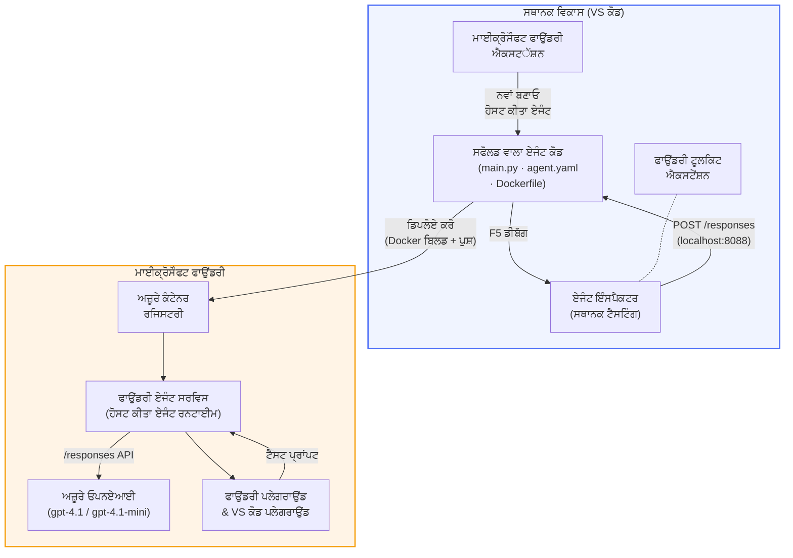

# Foundry Toolkit + Foundry Hosted Agents ਵਰਕਸ਼ਾਪ

[](https://www.python.org/)
[](https://github.com/microsoft/agents)
[](https://learn.microsoft.com/azure/ai-foundry/agents/concepts/hosted-agents/)
[](https://ai.azure.com/)
[](https://learn.microsoft.com/azure/ai-services/openai/)
[](https://learn.microsoft.com/cli/azure/install-azure-cli)
[](https://learn.microsoft.com/azure/developer/azure-developer-cli/install-azd)
[](https://www.docker.com/)
[](https://marketplace.visualstudio.com/items?itemName=ms-windows-ai-studio.windows-ai-studio)
[](LICENSE)

**Microsoft Foundry Agent Service** ਨੂੰ **Hosted Agents** ਦੇ ਤੌਰ 'ਤੇ AI ਏਜੰਟ ਬਣਾਓ, ਟੈਸਟ ਕਰੋ ਅਤੇ ਡਿਪਲੋਯ ਕਰੋ - ਸਿਰਫ VS ਕੋਡ ਤੋਂ **Microsoft Foundry extension** ਅਤੇ **Foundry Toolkit** ਦੀ ਵਰਤੋਂ ਕਰਕੇ।

> **Hosted Agents ਇਸ ਸਮੇਂ ਪ੍ਰੀਵਿਊ ਵਿੱਚ ਹਨ।** ਸਮਰਥਤ ਖੇਤਰ ਸੀਮਤ ਹਨ - ਦੇਖੋ [ਖੇਤਰ ਉਪਲਬਧਤਾ](https://learn.microsoft.com/azure/foundry/agents/concepts/hosted-agents#region-availability)।

> ਹਰ ਲੈਬ ਦੇ ਅੰਦਰ `agent/` ਫੋਲਡਰ ਨੂੰ Foundry ਐਕਸਟੈਂਸ਼ਨ ਦੁਆਰਾ **ਆਟੋਮੈਟਿਕ ਤੌਰ 'ਤੇ ਸਕੈਫੋਲਡ ਕੀਤਾ ਜਾਂਦਾ ਹੈ** - ਫਿਰ ਤੁਸੀਂ ਕੋਡ ਕਸਟਮਾਈਜ਼ ਕਰੋ, ਲੋਕਲ ਟੈਸਟ ਕਰੋ ਅਤੇ ਡਿਪਲੋਯ ਕਰੋ।

<!-- CO-OP TRANSLATOR LANGUAGES TABLE START -->
[Arabic](../ar/README.md) | [Bengali](../bn/README.md) | [Bulgarian](../bg/README.md) | [Burmese (Myanmar)](../my/README.md) | [Chinese (Simplified)](../zh-CN/README.md) | [Chinese (Traditional, Hong Kong)](../zh-HK/README.md) | [Chinese (Traditional, Macau)](../zh-MO/README.md) | [Chinese (Traditional, Taiwan)](../zh-TW/README.md) | [Croatian](../hr/README.md) | [Czech](../cs/README.md) | [Danish](../da/README.md) | [Dutch](../nl/README.md) | [Estonian](../et/README.md) | [Finnish](../fi/README.md) | [French](../fr/README.md) | [German](../de/README.md) | [Greek](../el/README.md) | [Hebrew](../he/README.md) | [Hindi](../hi/README.md) | [Hungarian](../hu/README.md) | [Indonesian](../id/README.md) | [Italian](../it/README.md) | [Japanese](../ja/README.md) | [Kannada](../kn/README.md) | [Khmer](../km/README.md) | [Korean](../ko/README.md) | [Lithuanian](../lt/README.md) | [Malay](../ms/README.md) | [Malayalam](../ml/README.md) | [Marathi](../mr/README.md) | [Nepali](../ne/README.md) | [Nigerian Pidgin](../pcm/README.md) | [Norwegian](../no/README.md) | [Persian (Farsi)](../fa/README.md) | [Polish](../pl/README.md) | [Portuguese (Brazil)](../pt-BR/README.md) | [Portuguese (Portugal)](../pt-PT/README.md) | [Punjabi (Gurmukhi)](./README.md) | [Romanian](../ro/README.md) | [Russian](../ru/README.md) | [Serbian (Cyrillic)](../sr/README.md) | [Slovak](../sk/README.md) | [Slovenian](../sl/README.md) | [Spanish](../es/README.md) | [Swahili](../sw/README.md) | [Swedish](../sv/README.md) | [Tagalog (Filipino)](../tl/README.md) | [Tamil](../ta/README.md) | [Telugu](../te/README.md) | [Thai](../th/README.md) | [Turkish](../tr/README.md) | [Ukrainian](../uk/README.md) | [Urdu](../ur/README.md) | [Vietnamese](../vi/README.md)

> **ਸਥਾਨਕ ਤੌਰ 'ਤੇ ਕਲੋਨ ਕਰਨਾ ਪਸੰਦ ਹੈ?**
>
> ਇਹ ਰੀਪੋਜ਼ਿਟਰੀ 50+ ਭਾਸ਼ਾ ਅਨੁਵਾਦ ਸ਼ਾਮਲ ਕਰਦਾ ਹੈ ਜੋ ਡਾਊਨਲੋਡ ਸਾਈਜ਼ ਨੂੰ ਕਾਫੀ ਵਧਾ ਦਿੰਦਾ ਹੈ। ਬਿਨਾਂ ਅਨੁਵਾਦਾਂ ਦੇ ਕਲੋਨ ਕਰਨ ਲਈ sparse checkout ਵਰਤੋ:
>
> **Bash / macOS / Linux:**
> ```bash
> git clone --filter=blob:none --sparse https://github.com/microsoft-foundry/Foundry_Toolkit_for_VSCode_Lab.git
> cd Foundry_Toolkit_for_VSCode_Lab
> git sparse-checkout set --no-cone '/*' '!translations' '!translated_images'
> ```
>
> **CMD (Windows):**
> ```cmd
> git clone --filter=blob:none --sparse https://github.com/microsoft-foundry/Foundry_Toolkit_for_VSCode_Lab.git
> cd Foundry_Toolkit_for_VSCode_Lab
> git sparse-checkout set --no-cone "/*" "!translations" "!translated_images"
> ```
>
> ਇਹ ਤੁਹਾਨੂੰ ਕੋਰਸ ਪੂਰਾ ਕਰਨ ਲਈ ਸਾਰਾ ਜ਼ਰੂਰੀ ਸਮੱਗਰੀ ਤੇਜ਼ ਡਾਊਨਲੋਡ ਡਿਫਾਲਟ ਦੇ ਨਾਲ ਦਿੰਦਾ ਹੈ।
<!-- CO-OP TRANSLATOR LANGUAGES TABLE END -->

---

## ਆਰਕੀਟੈਕਚਰ


**ਫਲੋ:** Foundry ਐਕਸਟੈਂਸ਼ਨ ਏਜੰਟ ਨੂੰ ਸਕੈਫੋਲਡ ਕਰਦਾ ਹੈ → ਤੁਸੀਂ ਕੋਡ ਅਤੇ ਨਿਰਦੇਸ਼ਾਂ ਨੂੰ ਕਸਟਮਾਈਜ਼ ਕਰਦੇ ਹੋ → Agent Inspector ਨਾਲ ਲੋਕਲ ਟੈਸਟ ਕਰੋ → Foundry ਵਿੱਚ ਡਿਪਲੋਯ ਕਰੋ (Docker ਇਮੇਜ਼ ACR ਨੂੰ ਪੁਸ਼ ਕੀਤੀ ਜਾਂਦੀ ਹੈ) → Playground ਵਿੱਚ ਵੈਰੀਫਾਈ ਕਰੋ।

---

## ਤੁਸੀਂ ਕੀ ਬਣਾਉਗੇ

| ਲੈਬ | ਵੇਰਵਾ | ਸਥਿਤੀ |
|-----|--------|---------|
| **Lab 01 - ਇੱਕ ਏਜੰਟ** | **"Explain Like I'm an Executive" Agent** ਬਣਾਓ, ਲੋਕਲ ਟੈਸਟ ਕਰੋ ਅਤੇ Foundry ਵਿੱਚ ਡਿਪਲੋਯ ਕਰੋ | ✅ ਉਪਲਬਧ |
| **Lab 02 - ਮਲਟੀ-ਏਜੰਟ ਵਰਕਫਲੋ** | **"Resume → Job Fit Evaluator"** ਬਣਾਓ - 4 ਏਜੰਟ ਮਿਲ ਕੇ ਰਿਜ਼ੂਮੇ ਫਿਟਨੈੱਸ ਸਕੋਰ ਕਰਦੇ ਹਨ ਅਤੇ ਸਿੱਖਣ ਦੀ ਯੋਜਨਾ ਬਣਾਉਂਦੇ ਹਨ | ✅ ਉਪਲਬਧ |

---

## Executive Agent ਨਾਲ ਮਿਲੋ

ਇਸ ਵਰਕਸ਼ਾਪ ਵਿੱਚ ਤੁਸੀਂ **"Explain Like I'm an Executive" Agent** ਬਣਾਓਗੇ - ਇੱਕ AI ਏਜੰਟ ਜੋ ਔਖੇ ਤਕਨੀਕੀ ਸ਼ਬਦਾਵਲੀ ਨੂੰ ਸਾਂਤ ਤੇ ਬੋਰਡਰੂਮ-ਤਿਆਰ ਸਮਰੀਜ਼ ਵਿੱਚ ਤਬਦੀਲ ਕਰਦਾ ਹੈ। ਕਿਉਂਕਿ ਸੱਚ ਆਖੀਏ, ਸੀ-ਸੂਟੀ ਵਿੱਚ ਕੋਈ ਵੀ "thread pool exhaustion caused by synchronous calls introduced in v3.2." ਬਾਰੇ ਸੁਣਨਾ ਨਹੀਂ ਚਾਹੁੰਦਾ।

ਮੈਂ ਇਹ ਏਜੰਟ ਇਸ ਲਈ ਬਣਾਇਆ ਕਿਉਂਕਿ ਮੇਰਾ ਬਹੁਤ ਹੀ ਚੰਗਾ ਬਣਾਇਆ ਹੋਇਆ ਪੋਸਟ-ਮਾਰਟਮ ਮਿਲ ਕੇ ਸਵਾਲ ਮਿਲੇ: *"ਤਾਂ... ਕੀ ਵੈੱਬਸਾਈਟ ਡਾਊਨ ਹੈ ਜਾਂ ਨਹੀਂ?"*

### ਇਹ ਕਿਵੇਂ ਕੰਮ ਕਰਦਾ ਹੈ

ਤੁਸੀਂ ਇਸਨੂੰ ਤਕਨੀਕੀ ਅੱਪਡੇਟ ਦਿੰਦੇ ਹੋ। ਇਹ ਤਿੰਨ ਬੁਲੇਟ ਪੁਆਇੰਟਾਂ ਵਾਲੀ ਇਕਜ਼ੈਕਟੀਵ ਸਰੰਸ਼ ਦਿੰਦਾ ਹੈ - ਕੋਈ ਜਾਰਗਨ ਨਹੀਂ, ਕੋਈ ਸਟੈਕ ਟਰੇਸ ਨਹੀਂ, ਕੋਈ ਡਰ ਨਹੀਂ। ਸਿਰਫ਼ **ਕੀ ਹੋਇਆ**, **ਕਾਰੋਬਾਰੀ ਪ੍ਰਭਾਵ**, ਅਤੇ **ਅਗਲਾ ਕਦਮ**।

### ਇਹਨੂੰ ਕਾਰਜ ਵਿੱਚ ਦੇਖੋ

**ਤੁਸੀਂ ਕਹਿੰਦੇ ਹੋ:**
> "The API latency increased due to thread pool exhaustion caused by synchronous calls introduced in v3.2."

**ਏਜੰਟ ਜਵਾਬ ਦਿੰਦਾ ਹੈ:**

> **Executive Summary:**
> - **ਕੀ ਹੋਇਆ:** ਆਖਰੀ ਰਿਲੀਜ਼ ਤੋਂ ਬਾਅਦ ਸਿਸਟਮ धीਮਾ ਹੋ ਗਿਆ।
> - **ਕਾਰੋਬਾਰੀ ਪ੍ਰਭਾਵ:** ਕੁਝ ਉਪਭੋਗਤਾਵਾਂ ਨੂੰ ਸੇਵਾ ਵਰਤਦੇ ਸਮੇਂ ਦੇਰ ਦਾ ਸਾਹਮਣਾ ਕਰਨਾ ਪਿਆ।
> - **ਅਗਲਾ ਕਦਮ:** ਬਦਲਾਅ ਵਾਪਸ ਲਿਆ ਲਿਆ ਗਿਆ ਹੈ ਅਤੇ ਮੁੜ ਡਿਪਲੋਯਮੈਂਟ ਤੋਂ ਪਹਿਲਾਂ ਇੱਕ ਫਿਕਸ ਤਿਆਰ ਕੀਤਾ ਜਾ ਰਿਹਾ ਹੈ।

### ਇਹ ਏਜੰਟ ਕਿਉਂ?

ਇਹ ਇੱਕ ਬਹੁਤ ਹੀ ਸਿੱਧਾ, ਏਕ-ਉਦੇਸ਼ੀ ਏਜੰਟ ਹੈ - ਜੋ ਕਿ ਹੋਸਟਡ ਏਜੰਟ ਵਰਕਫਲੋ ਨੂੰ ਅਖੀਰ ਤੱਕ ਸਿੱਖਣ ਲਈ ਬਿਹਤਰੀਨ ਹੈ ਬਿਨਾਂ ਕਿਸੇ ਜਟਿਲ ਟੂਲ ਚੇਨਾਂ ਵਿੱਚ ਫਸੇ। ਅਤੇ ਸਚ ਮੰਨੋ, ਹਰ ਇੰਜੀਨੀਅਰਿੰਗ ਟੀਮ ਨੂੰ ਇਹਨਾਂ ਵਿੱਚੋਂ ਇੱਕ ਦੀ ਲੋੜ ਹੈ।

---

## ਵਰਕਸ਼ਾਪ ਦੀ ਸੰਰਚਨਾ

```
📂 Foundry_Toolkit_for_VSCode_Lab/
├── 📄 README.md                      ← You are here
├── 📂 ExecutiveAgent/                ← Standalone hosted agent project
│   ├── agent.yaml
│   ├── Dockerfile
│   ├── main.py
│   └── requirements.txt
└── 📂 workshop/
    ├── 📂 lab01-single-agent/        ← Full lab: docs + agent code
    │   ├── README.md                 ← Hands-on lab instructions
    │   ├── 📂 docs/                  ← Step-by-step tutorial modules
    │   │   ├── 00-prerequisites.md
    │   │   ├── 01-install-foundry-toolkit.md
    │   │   ├── 02-create-foundry-project.md
    │   │   ├── 03-create-hosted-agent.md
    │   │   ├── 04-configure-and-code.md
    │   │   ├── 05-test-locally.md
    │   │   ├── 06-deploy-to-foundry.md
    │   │   ├── 07-verify-in-playground.md
    │   │   └── 08-troubleshooting.md
    │   └── 📂 agent/                 ← Reference solution (auto-scaffolded by Foundry extension)
    │       ├── agent.yaml
    │       ├── Dockerfile
    │       ├── main.py
    │       └── requirements.txt
    └── 📂 lab02-multi-agent/         ← Resume → Job Fit Evaluator
        ├── README.md                 ← Hands-on lab instructions (end-to-end)
        ├── 📂 docs/                  ← Step-by-step tutorial modules
        │   ├── 00-prerequisites.md
        │   ├── 01-understand-multi-agent.md
        │   ├── 02-scaffold-multi-agent.md
        │   ├── 03-configure-agents.md
        │   ├── 04-orchestration-patterns.md
        │   ├── 05-test-locally.md
        │   ├── 06-deploy-to-foundry.md
        │   ├── 07-verify-in-playground.md
        │   └── 08-troubleshooting.md
        └── 📂 PersonalCareerCopilot/ ← Reference solution (multi-agent workflow)
            ├── agent.yaml
            ├── Dockerfile
            ├── main.py
            └── requirements.txt
```

> **ਨੋਟ:** ਹਰ ਲੈਬ ਦੇ ਅੰਦਰ `agent/` ਫੋਲਡਰ **Microsoft Foundry extension** ਵੱਲੋਂ ਬਣਾਇਆ ਜਾਂਦਾ ਹੈ ਜਦੋਂ ਤੁਸੀਂ ਕਮਾਂਡ ਪੈਲੇਟ ਤੋਂ `Microsoft Foundry: Create a New Hosted Agent` ਚਲਾਉਂਦੇ ਹੋ। ਫ਼ਾਇਲਾਂ ਨੂੰ ਫਿਰ ਤੁਹਾਡੇ ਏਜੰਟ ਦੀਆਂ ਨਿਰਦੇਸ਼ਾਵਾਂ, ਟੂਲਜ਼ ਅਤੇ ਕਨਫਿਗਰੇਸ਼ਨ ਨਾਲ ਪਰਿਵਰਤਿਤ ਕੀਤਾ ਜਾਂਦਾ ਹੈ। ਲੈਬ 01 ਤੁਹਾਨੂੰ ਇਸਨੂੰ ਸਿਰੇ ਤੋਂ ਬਣਾਉਣ ਲਈ ਰਾਹ ਪ੍ਰਦਰਸ਼ਿਤ ਕਰੇਗਾ।

---

## ਸ਼ੁਰੂਆਤ ਕਰਨ ਲਈ

### 1. ਰੀਪੋਜ਼ਿਟਰੀ ਕਲੋਨ ਕਰੋ

```bash
git clone https://github.com/microsoft-foundry/Foundry_Toolkit_for_VSCode_Lab.git
cd Foundry_Toolkit_for_VSCode_Lab
```

### 2. ਪਾਈਥਨ ਵਰਚੁਅਲ ਵਾਤਾਵਰਨ ਸੈੱਟ ਕਰੋ

```bash
python -m venv venv
```

ਇਸਨੂੰ ਐਕਟੀਵੇਟ ਕਰੋ:

- **ਵਿੰਡੋਜ਼ (ਪਾਵਰਸ਼ੇੱਲ):**
  ```powershell
  .\venv\Scripts\Activate.ps1
  ```
- **macOS / ਲਿਨਕਸ:**
  ```bash
  source venv/bin/activate
  ```

### 3. ਡਿਪੈਂਡੈਂਸੀਜ਼ ਇੰਸਟਾਲ ਕਰੋ

```bash
pip install -r workshop/lab01-single-agent/agent/requirements.txt
```

### 4. ਪਰਿਵਾਰਤਕ ਵੈਰੀਏਬਲ ਸੈੱਟ ਕਰੋ

agent ਫੋਲਡਰ ਅੰਦਰ ਮਿਸਾਲ `.env` ਫਾਇਲ ਨੂੰ ਕਾਪੀ ਕਰੋ ਅਤੇ ਆਪਣੀਆਂ ਵੈਲਯੂਜ਼ ਭਰੋ:

```bash
cp workshop/lab01-single-agent/agent/.env.example workshop/lab01-single-agent/agent/.env
```

`workshop/lab01-single-agent/agent/.env` ਸੋਧੋ:

```env
AZURE_AI_PROJECT_ENDPOINT=https://<your-account>.services.ai.azure.com/api/projects/<your-project>
MODEL_DEPLOYMENT_NAME=<your-model-deployment-name>
```

### 5. ਵਰਕਸ਼ਾਪ ਦੀਆਂ ਲੈਬਾਂ ਫੋਲੋ ਕਰੋ

ਹਰ ਲੈਬ ਆਪਣੀ ਮਾਡਿਊਲਾਂ ਨਾਲ ਸਵੈ-ਨਿਰਭਰ ਹੁੰਦੀ ਹੈ। ਮੂਲ ਧਾਰਾ ਸਿੱਖਣ ਲਈ **Lab 01** ਨਾਲ ਸ਼ੁਰੂ ਕਰੋ, ਫਿਰ ਮਲਟੀ-ਏਜੰਟ ਵਰਕਫਲੋ ਲਈ **Lab 02** ਤੇ ਜਾਓ।

#### Lab 01 - ਇੱਕ ਏਜੰਟ ([ਪੂਰੇ ਨਿਰਦੇਸ਼](workshop/lab01-single-agent/README.md))

| # | ਮਾਡਿਊਲ | ਲਿੰਕ |
|---|---------|------|
| 1 | ਪ੍ਰੀਰਿਕ्वਿਜਿਟਸ ਪੜ੍ਹੋ | [00-prerequisites.md](workshop/lab01-single-agent/docs/00-prerequisites.md) |
| 2 | Foundry Toolkit ਅਤੇ Foundry ਐਕਸਟੈਂਸ਼ਨ ਇੰਸਟਾਲ ਕਰੋ | [01-install-foundry-toolkit.md](workshop/lab01-single-agent/docs/01-install-foundry-toolkit.md) |
| 3 | ਇੱਕ Foundry ਪ੍ਰੋਜੈਕਟ ਬਣਾਓ | [02-create-foundry-project.md](workshop/lab01-single-agent/docs/02-create-foundry-project.md) |
| 4 | ਇੱਕ ਹੋਸਟਡ ਏਜੰਟ ਬਣਾਓ | [03-create-hosted-agent.md](workshop/lab01-single-agent/docs/03-create-hosted-agent.md) |
| 5 | ਨਿਰਦੇਸ਼ ਅਤੇ ਵਾਤਾਵਰਨ ਸੈੱਟ ਕਰੋ | [04-configure-and-code.md](workshop/lab01-single-agent/docs/04-configure-and-code.md) |
| 6 | ਲੋਕਲ ਵਿੱਚ ਟੈਸਟ ਕਰੋ | [05-test-locally.md](workshop/lab01-single-agent/docs/05-test-locally.md) |
| 7 | Foundry ਵਿੱਚ ਡਿਪਲੋਯ ਕਰੋ | [06-deploy-to-foundry.md](workshop/lab01-single-agent/docs/06-deploy-to-foundry.md) |
| 8 | ਪਲੇਗਰਾਊਂਡ ਵਿੱਚ ਵੈਰੀਫਾਈ ਕਰੋ | [07-verify-in-playground.md](workshop/lab01-single-agent/docs/07-verify-in-playground.md) |
| 9 | ਸਮਸਿਆ-ਹੱਲ | [08-troubleshooting.md](workshop/lab01-single-agent/docs/08-troubleshooting.md) |

#### Lab 02 - ਮਲਟੀ-ਏਜੰਟ ਵਰਕਫਲੋ ([ਪੂਰੇ ਨਿਰਦੇਸ਼](workshop/lab02-multi-agent/README.md))

| # | ਮਾਡਿਊਲ | ਲਿੰਕ |
|---|---------|------|
| 1 | ਪ੍ਰੀਰਿਕਵਿਜਿਟਸ (Lab 02) | [00-prerequisites.md](workshop/lab02-multi-agent/docs/00-prerequisites.md) |
| 2 | ਮਲਟੀ-ਏਜੰਟ ਆਰਕੀਟੈਕਚਰ ਨੂੰ ਸਮਝੋ | [01-understand-multi-agent.md](workshop/lab02-multi-agent/docs/01-understand-multi-agent.md) |
| 3 | ਮਲਟੀ-ਏਜੰਟ ਪ੍ਰੋਜੈਕਟ ਨੂੰ ਸਕੈਫੋਲਡ ਕਰੋ | [02-scaffold-multi-agent.md](workshop/lab02-multi-agent/docs/02-scaffold-multi-agent.md) |
| 4 | ਏਜੰਟ ਅਤੇ ਵਾਤਾਵਰਨ ਸੈੱਟ ਕਰੋ | [03-configure-agents.md](workshop/lab02-multi-agent/docs/03-configure-agents.md) |
| 5 | ਆਰਚੇਸਟਰੈਸ਼ਨ ਪੈਟਰਨ | [04-orchestration-patterns.md](workshop/lab02-multi-agent/docs/04-orchestration-patterns.md) |
| 6 | ਲੋਕਲ ਵਿੱਚ ਟੈਸਟ ਕਰੋ (ਮਲਟੀ-ਏਜੰਟ) | [05-test-locally.md](workshop/lab02-multi-agent/docs/05-test-locally.md) |
| 7 | ਫਾਊਂਡਰੀ 'ਤੇ ਡਿਪਲਾਇ ਕਰੋ | [06-deploy-to-foundry.md](workshop/lab02-multi-agent/docs/06-deploy-to-foundry.md) |
| 8 | ਪਲੇਗ੍ਰਾਊਂਡ ਵਿੱਚ ਸੱਚਾਈ ਦੀ ਜਾਂਚ ਕਰੋ | [07-verify-in-playground.md](workshop/lab02-multi-agent/docs/07-verify-in-playground.md) |
| 9 | ਸਮੱਸਿਆ ਨਿਵਾਰਣ (ਮਲਟੀ-ਏਜੰਟ) | [08-troubleshooting.md](workshop/lab02-multi-agent/docs/08-troubleshooting.md) |

---

## ਸੰਭਾਲਨ ਵਾਲਾ

<table>
<tr>
    <td align="center"><a href="https://github.com/ShivamGoyal03">
        <br />
        <sub><b>ਸ਼ਿਵਾਮ ਗੋਯਲ</b></sub>
    </a><br />
    </td>
</tr>
</table>

---

## ਲੋੜੀਂਦੇ ਅਧਿਕਾਰ (ਤੁਰੰਤ ਸੰਦਰਭ)

| ਪਰਿਦ੍ਰਿਸ਼ | ਲੋੜੀਂਦੇ ਭੂਮਿਕਾਵਾਂ |
|----------|-------------------|
| ਨਵਾਂ ਫਾਊਂਡਰੀ ਪ੍ਰੋਜੈਕਟ ਬਣਾਉਣਾ | ਫਾਊਂਡਰੀ ਸਰੋਤ 'ਤੇ **ਅਜ਼ੂਰ ਏਆਈ ਮਾਲਕ** |
| ਮੌਜੂਦਾ ਪ੍ਰੋਜੈਕਟ ਵਿੱਚ ਡਿਪਲਾਇ (ਨਵੇਂ ਸਰੋਤ) | ਸਬਸਕ੍ਰਿਪਸ਼ਨ 'ਤੇ **ਅਜ਼ੂਰ ਏਆਈ ਮਾਲਕ** + **ਸਹਿਯੋਗੀ** |
| ਪੂਰੀ ਤਰ੍ਹਾਂ ਸੰਰਚਿਤ ਪ੍ਰੋਜੈਕਟ ਵਿੱਚ ਡਿਪਲਾਇ | ਖਾਤਾ 'ਤੇ **ਪਾਠਕ** + ਪ੍ਰੋਜੈਕਟ 'ਤੇ **ਅਜ਼ੂਰ ਏਆਈ ਯੂਜ਼ਰ** |

> **ਮਹੱਤਵਪੂਰਨ:** ਅਜ਼ੂਰ `ਮਾਲਕ` ਅਤੇ `ਸਹਿਯੋਗੀ` ਭੂਮਿਕਾਵਾਂ ਵਿੱਚ ਸਿਰਫ਼ *ਪ੍ਰਬੰਧਨ* ਅਧਿਕਾਰ ਸ਼ਾਮਲ ਹਨ, ਨਾ ਕਿ *ਵਿਕਾਸ* (ਡੈਟਾ ਕਾਰਵਾਈ) ਅਧਿਕਾਰ। ਤੁਹਾਨੂੰ ਏਜੰਟਾਂ ਨੂੰ ਬਿਲਡ ਅਤੇ ਡਿਪਲਾਇ ਕਰਨ ਲਈ **ਅਜ਼ੂਰ ਏਆਈ ਯੂਜ਼ਰ** ਜਾਂ **ਅਜ਼ੂਰ ਏਆਈ ਮਾਲਕ** ਦੀ ਲੋੜ ਹੈ।

---

## ਸੰਦਭਾਵਾਂ

- [ਤੁਰੰਤ ਸ਼ੁਰੂਆਤ: ਆਪਣਾ ਪਹਿਲਾ ਹੋਸਟਡ ਏਜੰਟ ਡਿਪਲਾਇ ਕਰੋ (VS ਕੋਡ)](https://learn.microsoft.com/azure/foundry/agents/quickstarts/quickstart-hosted-agent)
- [ਹੋਸਟਡ ਏਜੰਟ ਕੀ ਹਨ?](https://learn.microsoft.com/azure/foundry/agents/concepts/hosted-agents)
- [VS ਕੋਡ ਵਿੱਚ ਹੋਸਟਡ ਏਜੰਟ ਵਰਕਫਲੋ ਬਣਾਓ](https://learn.microsoft.com/azure/foundry/agents/how-to/vs-code-agents-workflow-pro-code)
- [ਹੋਸਟਡ ਏਜੰਟ ਡਿਪਲਾਇ ਕਰੋ](https://learn.microsoft.com/azure/foundry/agents/how-to/deploy-hosted-agent)
- [ਮਾਇਕ੍ਰੋਸਾਫਟ ਫਾਊਂਡਰੀ ਲਈ RBAC](https://learn.microsoft.com/azure/foundry/concepts/rbac-foundry)
- [ਆਰਕੀਟੈਕਚਰ ਰਿਵਿਊ ਏਜੰਟ ਸੈਂਪਲ](https://github.com/Azure-Samples/agent-architecture-review-sample) - MCP ਟੂਲਾਂ, ਐਕਸਕੈਲਿਡਰਾਈ ਡਾਇਗ੍ਰਾਮ ਅਤੇ ਡੁਅਲ ਡਿਪਲੋਇਮੈਂਟ ਨਾਲ ਹਕੀਕਤੀ ਦੁਨੀਆ ਦਾ ਹੋਸਟਡ ਏਜੰਟ

---


## ਲਾਇਸੈਂਸ

[MIT](../../LICENSE)

---

<!-- CO-OP TRANSLATOR DISCLAIMER START -->
**ਅਸਵੀਕਾਰਾਂ**:  
ਇਹ ਦਸਤਾਵੇਜ਼ AI ਅਨੁਵਾਦ ਸੇਵਾ [Co-op Translator](https://github.com/Azure/co-op-translator) ਦੀ ਵਰਤੋਂ ਨਾਲ ਅਨੁਵਾਦ ਕੀਤਾ ਗਿਆ ਹੈ। ਜਦੋਂ ਕਿ ਅਸੀਂ ਸਠਿਕਤਾ ਲਈ ਕੋਸ਼ਿਸ਼ ਕਰਦੇ ਹਾਂ, ਕਿਰਪਾ ਕਰਕੇ ਜਾਣਕਾਰੀ ਰੱਖੋ ਕਿ ਸਵੈਚਾਲਿਤ ਅਨੁਵਾਦਾਂ ਵਿੱਚ ਗਲਤੀਆਂ ਜਾਂ ਅਸਮਤੋਲਿਤਾਵਾਂ ਹੋ ਸਕਦੀਆਂ ਹਨ। ਮੂਲ ਦਸਤਾਵੇਜ਼ ਆਪਣੀ ਮੂਲ ਭਾਸ਼ਾ ਵਿੱਚ ਅਧਿਕਾਰਿਤ ਸਰੋਤ ਮੰਨਿਆ ਜਾਣਾ ਚਾਹੀਦਾ ਹੈ। ਨਿਰਣਾਇਕ ਜਾਣਕਾਰੀ ਲਈ, ਪੇਸ਼ੇਵਰ ਮਨੁੱਖੀ ਅਨੁਵਾਦ ਦੀ ਸਿਫਾਰਸ਼ ਕੀਤੀ ਜਾਂਦੀ ਹੈ। ਅਸੀਂ ਇਸ ਅਨੁਵਾਦ ਦੀ ਵਰਤੋਂ ਨਾਲ ਉਤਪੰਨ ਹੋਣ ਵਾਲੀਆਂ ਕਿਸੇ ਵੀ ਗਲਤਫਹਿਮੀਆਂ ਜਾਂ ਗਲਤ ਵਿਆਖਿਆਵਾਂ ਲਈ ਜਿੰਮੇਵਾਰ ਨਹੀਂ ਹਾਂ।
<!-- CO-OP TRANSLATOR DISCLAIMER END -->