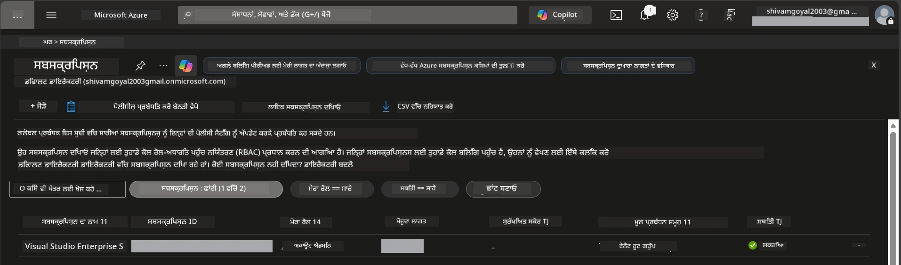

# Module 0 - ਪਹਿਲਾਂ ਦੇ ਲੋੜੀਂਦੇ ਚੀਜ਼ਾਂ

ਵਰਕਸ਼ਾਪ ਸ਼ੁਰੂ ਕਰਨ ਤੋਂ ਪਹਿਲਾਂ, ਯਕੀਨੀ ਬਣਾਓ ਕਿ ਤੁਹਾਡੇ ਕੋਲ ਹੇਠਾਂ ਦਿੱਤੇ ਟੂਲਜ਼, ਐਕਸੈਸ ਅਤੇ ਵਾਤਾਵਰਣ ਤਿਆਰ ਹਨ। ਹਰ ਕਦਮ ਨੂੰ ਧਿਆਨ ਨਾਲ ਫੋਲੋ ਕਰੋ - ਅੱਗੇ ਨਾ ਵਧੋ।

---

## 1. ਐਜ਼ੂਰ ਖਾਤਾ ਅਤੇ ਸਬਸਕ੍ਰਿਪਸ਼ਨ

### 1.1 ਆਪਣੀ ਐਜ਼ੂਰ ਸਬਸਕ੍ਰਿਪਸ਼ਨ ਬਣਾਓ ਜਾਂ ਜਾਂਚੋ

1. ਕਿਸੇ ਬ੍ਰਾਊਜ਼ਰ ਵਿੱਚ ਜਾਓ ਅਤੇ [https://azure.microsoft.com/free/](https://azure.microsoft.com/free/) ਖੋਲ੍ਹੋ।
2. ਜੇ ਤੁਹਾਡੇ ਕੋਲ ਐਜ਼ੂਰ ਖਾਤਾ ਨਹੀਂ ਹੈ, ਤਾਂ **Start free** 'ਤੇ ਕਲਿੱਕ ਕਰੋ ਅਤੇ ਸਾਈਨ-ਅੱਪ ਪ੍ਰਕਿਰਿਆ ਪੂਰੀ ਕਰੋ। ਤੁਹਾਨੂੰ ਮਾਈਕ੍ਰੋਸੋਫਟ ਖਾਤਾ (ਜਾਂ ਨਵਾਂ ਬਣਾਓ) ਅਤੇ ਪਹਚਾਣ ਦੀ ਪੁਸ਼ਟੀ ਲਈ ਕਰੇਡਿਟ ਕਾਰਡ ਦੀ ਲੋੜ ਹੋਏਗੀ।
3. ਜੇ ਤੁਹਾਡੇ ਕੋਲ ਪਹਿਲਾਂ ਹੀ ਖਾਤਾ ਹੈ, ਤਾਂ [https://portal.azure.com](https://portal.azure.com) 'ਤੇ ਸਾਈਨ ਇਨ ਕਰੋ।
4. ਪੋਰਟਲ ਵਿੱਚ, ਖੱਬੇ ਨੈਵੀਗੇਸ਼ਨ ਵਿੱਚ **Subscriptions** ਬਲੇਡ 'ਤੇ ਕਲਿੱਕ ਕਰੋ (ਜਾਂ ਉਪਰਲੇ ਖੋਜ ਬਾਰ ਵਿੱਚ "Subscriptions" ਲਿਖੋ)।
5. ਯਕੀਨ ਬਣਾਓ ਕਿ ਤੁਹਾਡੇ ਕੋਲ ਘੱਟੋ-ਘੱਟ ਇੱਕ **Active** ਸਬਸਕ੍ਰਿਪਸ਼ਨ ਹੈ। **Subscription ID** ਨੋਟ ਕਰੋ - ਇਹ ਤੁਹਾਨੂੰ ਬਾਅਦ ਵਿੱਚ ਲੋੜ ਪਵੇਗਾ।



### 1.2 ਜਰੂਰੀ RBAC ਭੂਮਿਕਾਵਾਂ ਨੂੰ ਸਮਝੋ

[Hosted Agent](https://learn.microsoft.com/azure/foundry/agents/concepts/hosted-agents) ਡੀਪਲੋਇਮੈਂਟ ਲਈ ਉਹਨਾਂ ਦੀਆਂ **ਡੇਟਾ ਐਕਸ਼ਨ** ਅਨੁਮਤੀਆਂ ਦੀ ਲੋੜ ਹੁੰਦੀ ਹੈ ਜੋ ਮਿਆਰੀ ਐਜ਼ੂਰ `Owner` ਅਤੇ `Contributor` ਭੂਮਿਕਾਵਾਂ ਵਿੱਚ **ਸ਼ਾਮਿਲ ਨਹੀਂ ਹਨ**। ਤੁਹਾਨੂੰ ਹੇਠਾਂ ਦਿੱਤੇ [ਭੂਮਿਕਾ ਸਮੂਹਾਂ](https://learn.microsoft.com/azure/foundry/concepts/rbac-foundry#built-in-roles) ਵਿੱਚੋਂ ਕਿਸੇ ਇੱਕ ਦੀ ਲੋੜ ਹੋਏਗੀ:

| ਸਿਨਾਰੀਓ | ਜਰੂਰੀ ਭੂਮਿਕਾਵਾਂ | ਕਿੱਥੇ ਅਸਾਈਨ ਕਰਨੀ ਹੈ |
|----------|------------------|---------------------|
| ਨਵਾਂ Foundry ਪ੍ਰੋਜੈਕਟ ਬਣਾਓ | Foundry ਰਿਸੋਰਸ 'ਤੇ **Azure AI Owner** | ਐਜ਼ੂਰ ਪੋਰਟਲ ਵਿੱਚ Foundry ਰਿਸੋਰਸ |
| ਮੌਜੂਦਾ ਪ੍ਰੋਜੈਕਟ (ਨਵੇਂ ਰਿਸੋਰਸ) 'ਤੇ ਡੀਪਲੋਇ | ਸਬਸਕ੍ਰਿਪਸ਼ਨ 'ਤੇ **Azure AI Owner** + **Contributor** | ਸਬਸਕ੍ਰਿਪਸ਼ਨ + Foundry ਰਿਸੋਰਸ |
| ਪੂਰੀ ਤਰ੍ਹਾਂ ਸੰਰਚਿਤ ਪ੍ਰੋਜੈਕਟ 'ਤੇ ਡੀਪਲੋਇ | ਖਾਤੇ 'ਤੇ **Reader** + ਪ੍ਰੋਜੈਕਟ 'ਤੇ **Azure AI User** | ਐਜ਼ੂਰ ਪੋਰਟਲ ਵਿੱਚ ਖਾਤਾ + ਪ੍ਰੋਜੈਕਟ |

> **ਮੁੱਖ ਗੱਲ:** ਐਜ਼ੂਰ `Owner` ਅਤੇ `Contributor` ਭੂਮਿਕਾਵਾਂ ਸਿਰਫ਼ *ਮੈਨੇਜਮੈਂਟ* ਅਨੁਮਤੀਆਂ (ARM ਆਪਰੇਸ਼ਨਾਂ) ਕਵਰ ਕਰਦੀਆਂ ਹਨ। ਤੁਹਾਨੂੰ *ਡੇਟਾ ਐਕਸ਼ਨਾਂ* ਲਈ [**Azure AI User**](https://learn.microsoft.com/azure/foundry/concepts/rbac-foundry#built-in-roles) (ਜਾਂ ਉੱਚ ਭੂਮਿਕਾ) ਦੀ ਲੋੜ ਹੈ ਜਿਵੇਂ ਕਿ `agents/write` ਜੋ ਏਜੰਟ ਬਣਾਉਣ ਅਤੇ ਡੀਪਲੋਇ ਕਰਨ ਲਈ ਜ਼ਰੂਰੀ ਹੈ। ਤੁਸੀਂ ਇਹ ਭੂਮਿਕਾਵਾਂ [Module 2](02-create-foundry-project.md) ਵਿੱਚ ਅਸਾਈਨ ਕਰੋਗੇ।

---

## 2. ਲੋਕਲ ਟੂਲ ਇੰਸਟਾਲ ਕਰੋ

ਹੇਠਾਂ ਦਿੱਤੇ ਹਰ ਟੂਲ ਨੂੰ ਇੰਸਟਾਲ ਕਰੋ। ਇੰਸਟਾਲ ਕਰਨ ਤੋਂ ਬਾਅਦ, ਚੈੱਕ ਕਮਾਂਡ ਚਲਾਕੇ ਕੰਮ ਕਰਨ ਦੀ ਪੁਸ਼ਟੀ ਕਰੋ।

### 2.1 Visual Studio Code

1. [https://code.visualstudio.com/](https://code.visualstudio.com/) 'ਤੇ ਜਾਓ।
2. ਆਪਣੇ OS ਲਈ ਇੰਸਟਾਲਰ ਡਾਊਨਲੋਡ ਕਰੋ (Windows/macOS/Linux)।
3. ਡਿਫਾਲਟ ਸੈਟਿੰਗਾਂ ਨਾਲ ਇੰਸਟਾਲਰ ਚਲਾਓ।
4. VS Code ਨੂੰ ਖੋਲ੍ਹੋ ਅਤੇ ਪੱਕਾ ਕਰੋ ਕਿ ਇਹ ਲਾਂਚ ਹੋ ਰਹਾ ਹੈ।

### 2.2 Python 3.10+

1. [https://www.python.org/downloads/](https://www.python.org/downloads/) 'ਤੇ ਜਾਓ।
2. ਪਾਇਥਨ 3.10 ਜਾਂ ਉਪਰਲਾ ਵਰਜਨ ਡਾਊਨਲੋਡ ਕਰੋ (3.12+ ਸੁਪਰਸ਼ਿਫਾਰਸ਼ੀ)।
3. **Windows:** ਇੰਸਟਾਲੇਸ਼ਨ ਦੌਰਾਨ ਪਹਿਲੇ ਸਕਰੀਨ 'ਤੇ **"Add Python to PATH"** ਨੂੰ ਚੈੱਕ ਕਰੋ।
4. ਇੱਕ ਟਰਮੀਨਲ ਖੋਲ੍ਹੋ ਅਤੇ ਜਾਂਚ ਕਰੋ:

   ```powershell
   python --version
   ```

   ਉਮੀਦ ਵਰਗੀ ਆਉਟਪੁੱਟ: `Python 3.10.x` ਜਾਂ ਉਪਰਲਾ।

### 2.3 Azure CLI

1. [https://learn.microsoft.com/cli/azure/install-azure-cli](https://learn.microsoft.com/cli/azure/install-azure-cli) 'ਤੇ ਜਾਓ।
2. ਆਪਣੇ OS ਲਈ ਇੰਸਟਾਲੇਸ਼ਨ ਨਿਰਦੇਸ਼ਾਂ ਨੂੰ ਫੋਲੋ ਕਰੋ।
3. ਜਾਂਚ ਕਰੋ:

   ```powershell
   az --version
   ```

   ਉਮੀਦ: `azure-cli 2.80.0` ਜਾਂ ਉਪਰਲਾ।

4. ਸਾਈਨ ਇਨ ਕਰੋ:

   ```powershell
   az login
   ```

### 2.4 Azure Developer CLI (azd)

1. [https://learn.microsoft.com/azure/developer/azure-developer-cli/install-azd](https://learn.microsoft.com/azure/developer/azure-developer-cli/install-azd) 'ਤੇ ਜਾਓ।
2. ਆਪਣੇ OS ਲਈ ਇੰਸਟਾਲੇਸ਼ਨ ਨਿਰਦੇਸ਼ਾਂ ਨੂੰ ਫੋਲੋ ਕਰੋ। Windows 'ਤੇ:

   ```powershell
   winget install microsoft.azd
   ```

3. ਜਾਂਚ ਕਰੋ:

   ```powershell
   azd version
   ```

   ਉਮੀਦ: `azd version 1.x.x` ਜਾਂ ਉਪਰਲਾ।

4. ਸਾਈਨ ਇਨ ਕਰੋ:

   ```powershell
   azd auth login
   ```

### 2.5 Docker Desktop (ਇੱਛਾ ਅਨੁਸਾਰ)

ਡੀਪਲੋਇਮੈਂਟ ਤੋਂ ਪਹਿਲਾਂ ਕਨਟੇਨਰ ਇਮੇਜ ਲੋਕਲ ਤੌਰ 'ਤੇ ਬਣਾਉਣ ਅਤੇ ਟੈਸਟ ਕਰਨ ਲਈ Docker ਦੀ ਲੋੜ ਹੁੰਦੀ ਹੈ। Foundry ਐਕਸਟੈਂਸ਼ਨ ਡੀਪਲੋਇਮੈਂਟ ਦੌਰਾਨ ਕਨਟੇਨਰ ਬਿਲਡਸ ਆਪੋ-ਆਪ ਕਰਦਾ ਹੈ।

1. [https://docs.docker.com/get-docker/](https://docs.docker.com/get-docker/) 'ਤੇ ਜਾਓ।
2. ਆਪਣੇ OS ਲਈ Docker Desktop ਡਾਊਨਲੋਡ ਅਤੇ ਇੰਸਟਾਲ ਕਰੋ।
3. **Windows:** ਇੰਸਟਾਲੇਸ਼ਨ ਦੌਰਾਨ WSL 2 ਬੈਕਐਂਡ ਚੁਣਿਆ ਹੋਇਆ ਹੋਣਾ ਚਾਹੀਦਾ ਹੈ।
4. Docker Desktop ਚਲਾਓ ਅਤੇ ਸਿਸਟਮ ਟਰੇ ਵਿੱਚ ਆਇਕਨ ਆ ਕੇ ਦਿਖਾਏ **"Docker Desktop is running"** ਦਾ ਇੰਤਜ਼ਾਰ ਕਰੋ।
5. ਇੱਕ ਟਰਮੀਨਲ ਖੋਲ੍ਹੋ ਅਤੇ ਜਾਂਚ ਕਰੋ:

   ```powershell
   docker info
   ```

   ਇਹ Docker ਸਿਸਟਮ ਜਾਣਕਾਰੀ ਬਿਨਾਂ ਕਿਸੇ ਐਰਰ ਦੇ ਪ੍ਰਿੰਟ ਕਰੇਗੀ। ਜੇ `Cannot connect to the Docker daemon` ਵੇਖੋ, ਤਾਂ Docker ਦੇ ਪੂਰੀ ਤਰ੍ਹਾਂ ਸਟਾਰਟ ਹੋਣ ਲਈ ਕੁਝ ਸਕਿੰਟ ਸਹਿਣ ਕਰੋ।

---

## 3. VS Code ਐਕਸਟੈਂਸ਼ਨਸ ਇੰਸਟਾਲ ਕਰੋ

ਤੁਹਾਨੂੰ ਤਿੰਨ ਐਕਸਟੈਂਸ਼ਨਸ ਦੀ ਲੋੜ ਹੈ। ਵਰਕਸ਼ਾਪ ਸ਼ੁਰੂ ਹੋਣ ਤੋਂ **ਪਹਿਲਾਂ** ਇਹਨਾਂ ਨੂੰ ਇੰਸਟਾਲ ਕਰੋ।

### 3.1 Microsoft Foundry for VS Code

1. VS Code ਖੋਲ੍ਹੋ।
2. `Ctrl+Shift+X` ਦਬਾ ਕੇ ਐਕਸਟੈਂਸ਼ਨ ਪੈਨਲ ਖੋਲ੍ਹੋ।
3. ਖੋਜ ਬਾਕਸ ਵਿੱਚ **"Microsoft Foundry"** ਟਾਈਪ ਕਰੋ।
4. **Microsoft Foundry for Visual Studio Code** ਲੱਭੋ (ਪਬਲਿਸ਼ਰ: Microsoft, ID: `TeamsDevApp.vscode-ai-foundry`)।
5. **Install** 'ਤੇ ਕਲਿੱਕ ਕਰੋ।
6. ਇੰਸਟਾਲੇਸ਼ਨ ਤੋਂ ਬਾਅਦ, ਤੁਹਾਨੂੰ ਐਕਟਿਵਿਟੀ ਬਾਰ (ਖੱਬਾ ਸਾਈਡਬਾਰ) ਵਿੱਚ **Microsoft Foundry** ਆਇਕਨ ਵੇਖਾਈ ਦੇਵੇਗਾ।

### 3.2 Foundry Toolkit

1. ਐਕਸਟੈਂਸ਼ਨ ਪੈਨਲ ਵਿੱਚ (`Ctrl+Shift+X`), **"Foundry Toolkit"** ਲੱਭੋ।
2. **Foundry Toolkit** ਲੱਭੋ (ਪਬਲਿਸ਼ਰ: Microsoft, ID: `ms-windows-ai-studio.windows-ai-studio`)।
3. **Install** 'ਤੇ ਕਲਿੱਕ ਕਰੋ।
4. ਐਕਟਿਵਿਟੀ ਬਾਰ ਵਿੱਚ **Foundry Toolkit** ਆਇਕਨ ਆ ਜਾਣੀ ਚਾਹੀਦੀ ਹੈ।

### 3.3 Python

1. ਐਕਸਟੈਂਸ਼ਨ ਪੈਨਲ ਵਿੱਚ **"Python"** ਲੱਭੋ।
2. **Python** ਲੱਭੋ (ਪਬਲਿਸ਼ਰ: Microsoft, ID: `ms-python.python`)।
3. **Install** 'ਤੇ ਕਲਿੱਕ ਕਰੋ।

---

## 4. VS Code ਤੋਂ ਐਜ਼ੂਰ ਵਿੱਚ ਸਾਈਨ ਇਨ ਕਰੋ

[Microsoft Agent Framework](https://learn.microsoft.com/agent-framework/overview/) ਵੀ ਸਾਈਨ ਇਨ ਲਈ [`DefaultAzureCredential`](https://learn.microsoft.com/azure/developer/python/sdk/authentication/credential-chains#defaultazurecredential-overview) ਵਰਤਦਾ ਹੈ। ਤੁਹਾਨੂੰ VS Code ਵਿੱਚ ਐਜ਼ੂਰ ਵਿੱਚ ਸਾਈਨ ਇਨ ਕਰਨਾ ਲਾਜ਼ਮੀ ਹੈ।

### 4.1 VS Code ਰਾਹੀਂ ਸਾਈਨ ਇਨ

1. VS Code ਦੇ ਖੱਬੇ ਹੇਠਲੇ ਕੋਨੇ ਵਿੱਚ **Accounts** ਆਇਕਨ (ਆਦਮੀ ਦੀ ਸਿੱਲੂਐਟ) 'ਤੇ ਕਲਿੱਕ ਕਰੋ।
2. **Sign in to use Microsoft Foundry** (ਜਾਂ **Sign in with Azure**) 'ਤੇ ਕਲਿੱਕ ਕਰੋ।
3. ਇੱਕ ਬ੍ਰਾਊਜ਼ਰ ਵਿੰਡੋ ਖੁਲ ਜਾਏਗੀ - ਆਪਣੀ ਐਜ਼ੂਰ ਖਾਤੇ ਨਾਲ ਸਾਈਨ ਇਨ ਕਰੋ ਜਿਸ ਨੂੰ ਤੁਹਾਡੇ ਸਬਸਕ੍ਰਿਪਸ਼ਨ ਦੀ ਐਕਸੈਸ ਹੈ।
4. VS Code ਤੇ ਵਾਪਸ ਆਓ। ਤੁਹਾਡਾ ਖਾਤਾ ਨਾਮ ਖੱਬੇ ਹੇਠਲੇ ਵਿੱਚ ਵੇਖਾਈ ਦੇਵੇਗਾ।

### 4.2 (ਇੱਛਾ ਅਨੁਸਾਰ) Azure CLI ਰਾਹੀਂ ਸਾਈਨ ਇਨ

ਜੇ ਤੁਸੀਂ Azure CLI ਇੰਸਟਾਲ ਕੀਤਾ ਹੈ ਅਤੇ CLI-ਆਧਾਰਿਤ ਪ੍ਰਮਾਣੀਕਰਨ ਪਸੰਦ ਕਰਦੇ ਹੋ:

```powershell
az login
```

ਇਹ ਸਾਈਨ ਇਨ ਲਈ ਬ੍ਰਾਊਜ਼ਰ ਖੋਲ੍ਹਦਾ ਹੈ। ਸਾਈਨ ਇਨ ਕਰਨ ਤੋਂ ਬਾਅਦ, ਸਹੀ ਸਬਸਕ੍ਰਿਪਸ਼ਨ ਸੈਟ ਕਰੋ:

```powershell
az account set --subscription "<your-subscription-id>"
```

ਜਾਂਚੋ:

```powershell
az account show --query "{name:name, id:id, state:state}" --output table
```

ਤੁਹਾਨੂੰ ਆਪਣੀ ਸਬਸਕ੍ਰਿਪਸ਼ਨ ਦਾ ਨਾਮ, ID ਅਤੇ ਸਥਿਤੀ = `Enabled` ਵੇਖਾਈ ਦੇਵੇਗੀ।

### 4.3 (ਵਿਕਲਪਕ) ਸਰਵਿਸ ਪ੍ਰਿੰਸੀਪਲ ਉਥੰਡੀਕਰਨ

CI/CD ਜਾਂ ਸਾਂਝੇ ਵਾਤਾਵਰਣ ਲਈ, ਇਹ ਵਾਤਾਵਰਣ ਵੇਰੀਏਬਲ ਸੈੱਟ ਕਰੋ:

```powershell
$env:AZURE_TENANT_ID = "<your-tenant-id>"
$env:AZURE_CLIENT_ID = "<your-client-id>"
$env:AZURE_CLIENT_SECRET = "<your-client-secret>"
```

---

## 5. ਪੀਹਲਾਂ ਦੀਆਂ ਸੀਮਾਵਾਂ

ਆਗੇ ਵਧਣ ਤੋਂ ਪਹਿਲਾਂ, ਮੌਜੂਦਾ ਸੀਮਾਵਾਂ ਬਾਰੇ ਜਾਣੂ ਰਹੋ:

- [**Hosted Agents**](https://learn.microsoft.com/azure/foundry/agents/concepts/hosted-agents) ਹਾਲੇ **ਪਬਲਿਕ ਪੀਹਲਾੜੀ** ਵਿੱਚ ਹਨ - ਉਤਪਾਦਨ ਵਰਕਲੋਡ ਲਈ ਸਿਫ਼ਾਰਸ਼ ਨਹੀਂ ਕੀਤੀ ਜਾਂਦੀ।
- **ਸਮਰਥਿਤ ਖੇਤਰ ਸੀਮਿਤ ਹਨ** - ਰਿਸੋਰਸ ਬਨਾਉਣ ਤੋਂ ਪਹਿਲਾਂ [ਖੇਤਰ ਉਪਲਬਧਤਾ](https://learn.microsoft.com/azure/foundry/agents/concepts/hosted-agents#region-availability) ਚੈੱਕ ਕਰੋ। ਜੇ ਤੁਸੀਂ ਅਣਸਮਰਥਿਤ ਖੇਤਰ ਚੁਣਦੇ ਹੋ, ਤਾਂ ਡੀਪਲੋਇਮੈਂਟ ਫੇਲ੍ਹ ਹੋਵੇਗੀ।
- `azure-ai-agentserver-agentframework` ਪੈਕੇਜ ਪ੍ਰੀ-ਰੇਲਿਜ਼ (`1.0.0b16`) ਹੈ - APIs ਬਦਲ ਸਕਦੇ ਹਨ।
- ਸਕੇਲ ਸੀਮਾਵਾਂ: hosted agents 0-5 ਕਾਪੀਆਂ ਸਕੇਲ ਕਰਨ ਸਮਰਥ ਕਰਦੇ ਹਨ (ਜਿਸ ਵਿੱਚ ਸਕੇਲ-ਟੂ-ਜ਼ੀਰੋ ਸ਼ਾਮਿਲ ਹੈ)।

---

## 6. ਪਹਿਲਾਂ-ਚੈੱਕ ਸੂਚੀ

ਹੇਠਾਂ ਦਿੱਤੇ ਹਰ ਆਈਟਮ ਨੂੰ ਚੈੱਕ ਕਰੋ। ਜੇ ਕੋਈ ਕਦਮ ਫੇਲ੍ਹ ਹੋਵੇ, ਤਾਂ ਵਾਪਸ ਜਾ ਕੇ ਠੀਕ ਕਰੋ।

- [ ] VS Code ਬਿਨਾਂ ਕਿਸੇ ਗਲਤੀ ਦੇ ਖੁਲਦਾ ਹੈ
- [ ] Python 3.10+ ਤੁਹਾਡੇ PATH ਵਿੱਚ ਹੈ (`python --version` 'ਤੇ `3.10.x` ਜਾਂ ਵੱਧ ਆਉਂਦਾ ਹੈ)
- [ ] Azure CLI ਇੰਸਟਾਲ ਹੈ (`az --version` 'ਤੇ `2.80.0` ਜਾਂ ਵੱਧ ਆਉਂਦਾ ਹੈ)
- [ ] Azure Developer CLI ਇੰਸਟਾਲ ਹੈ (`azd version` 'ਤੇ ਵਰਜਨ ਜਾਣਕਾਰੀ ਆਉਂਦੀ ਹੈ)
- [ ] Microsoft Foundry ਐਕਸਟੈਂਸ਼ਨ ਇੰਸਟਾਲ ਹੈ (ਐਕਟਿਵਿਟੀ ਬਾਰ ਵਿੱਚ ਆਇਕਨ)
- [ ] Foundry Toolkit ਐਕਸਟੈਂਸ਼ਨ ਇੰਸਟਾਲ ਹੈ (ਐਕਟਿਵਿਟੀ ਬਾਰ ਵਿੱਚ ਆਇਕਨ)
- [ ] Python ਐਕਸਟੈਂਸ਼ਨ ਇੰਸਟਾਲ ਹੈ
- [ ] ਤੁਹਾਡੇ VS Code ਵਿੱਚ Azure ਵਿੱਚ ਸਾਈਨ ਇਨ ਕੀਤਾ ਹੋਇਆ ਹੈ (ਖੱਬੇ ਹੇਠਲੇ ਵਿੱਚ Accounts ਆਇਕਨ ਚੈੱਕ ਕਰੋ)
- [ ] `az account show` ਤੁਹਾਡੀ ਸਬਸਕ੍ਰਿਪਸ਼ਨ ਦਿਖਾਂਦਾ ਹੈ
- [ ] (ਚਾਹੇ ਤਾਂ) Docker Desktop ਚਲ ਰਿਹਾ ਹੈ (`docker info` ਸਿਸਟਮ ਜਾਣਕਾਰੀ ਦੇਂਦਾ ਹੈ ਬਿਨਾਂ ਐਰਰ ਦੇ)

### ਚੈੱਕਪੌਇੰਟ

VS Code ਦੀ ਐਕਟਿਵਿਟੀ ਬਾਰ ਖੋਲ੍ਹੋ ਅਤੇ ਪੱਕਾ ਕਰੋ ਕਿ ਤੁਸੀਂ ਦੋਹਾਂ **Foundry Toolkit** ਅਤੇ **Microsoft Foundry** ਸਾਈਡਬਾਰ ਵੀਅਲ ਵੇਖ ਰਹੇ ਹੋ। ਹਰ ਇੱਕ ਤੇ ਕਲਿੱਕ ਕਰੋ ਅਤੇ ਯਕੀਨ ਕਰੋ ਕਿ ਉਹ ਬਿਨਾਂ ਕਿਸੇ ਗਲਤੀ ਦੇ ਲੋਡ ਹੁੰਦੇ ਹਨ।

---

**ਅਗਲਾ:** [01 - Install Foundry Toolkit & Foundry Extension →](01-install-foundry-toolkit.md)

---

<!-- CO-OP TRANSLATOR DISCLAIMER START -->
**ਅਸਵੀਕਾਰੋक्ति**:
ਇਹ ਦਸਤਾਵੇਜ਼ ਏਆਈ ਅਨੁਵਾਦ ਸੇਵਾ [Co-op Translator](https://github.com/Azure/co-op-translator) ਦੀ ਵਰਤੋਂ ਕਰਕੇ ਅਨੁਵਾਦ ਕੀਤਾ ਗਿਆ ਹੈ। ਜਦੋਂ ਕਿ ਅਸੀਂ ਸਹੀਤਾ ਲਈ ਯਤਨਸ਼ੀਲ ਹਾਂ, ਕਿਰਪਾ ਕਰਕੇ ਧਿਆਨ ਰੱਖੋ ਕਿ ਆਟੋਮੇਟਿਕ ਅਨੁਵਾਦਾਂ ਵਿੱਚ ਗਲਤੀਆਂ ਜਾਂ ਅਸੁਰੱਖਿਅਤੀਆਂ ਹੋ ਸਕਦੀਆਂ ਹਨ। ਮੂਲ ਦਸਤਾਵੇਜ਼ ਆਪਣੀ ਮੂਲ ਭਾਸ਼ਾ ਵਿੱਚ ਹੀ ਪ੍ਰਮਾਣਿਕ ਸਰੋਤ ਮੰਨਿਆ ਜਾਣਾ ਚਾਹੀਦਾ ਹੈ। ਮਹੱਤਵਪੂਰਣ ਜਾਣਕਾਰੀ ਲਈ, ਵਿਸ਼ੇਸ਼ਗਿਆਨਵਾਨ ਮਨੁੱਖੀ ਅਨੁਵਾਦ ਦੀ ਸਿਫ਼ਾਰਸ਼ ਕੀਤੀ ਜਾਂਦੀ ਹੈ। ਅਸੀਂ ਇਸ ਅਨੁਵਾਦ ਦੀ ਵਰਤੋਂ ਤੋਂ ਹੋਣ ਵਾਲੇ ਕਿਸੇ ਵੀ ਗਲਤਫਹਮੀ ਜਾਂ ਗਲਤ ਵਿਆਖਿਆ ਲਈ ਜ਼ਿੰਮੇਵਾਰ ਨਹੀਂ ਹਾਂ।
<!-- CO-OP TRANSLATOR DISCLAIMER END -->