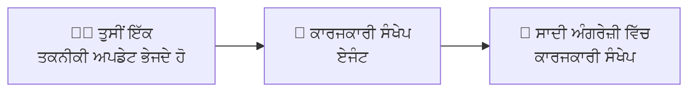

# ਮੋਡਿਊਲ 0 - ਪਰਿਚਯ

⏱️ ~10 ਮਿੰਟ

> [!WARNING]
> **ਪ੍ਰੀਵਿਊ ਅਤੇ ਸੀਮਾਵਾਂ:** [Hosted Agents](https://learn.microsoft.com/azure/foundry/agents/concepts/hosted-agents) ਇਸ ਸਮੇਂ **ਪਬਲਿਕ ਪ੍ਰੀਵਿਊ** ਵਿੱਚ ਹਨ - ਪ੍ਰੋਡਕਸ਼ਨ ਵਰਕਲੋਡ ਲਈ ਸਿਫ਼ਾਰਸ਼ ਨਹੀਂ ਕੀਤੀ ਜਾਂਦੀ। ਹੇਠ ਲਿਖੀਆਂ ਗੱਲਾਂ ਦਾ ਧਿਆਨ ਰੱਖੋ:
> - **ਸਮਰਥਿਤ ਖੇਤਰ ਸੀਮਿਤ ਹਨ** - ਸਰੋਤ ਬਣਾਉਣ ਤੋਂ ਪਹਿਲਾਂ [ਖੇਤਰ ਉਪਲਬਧਤਾ](https://learn.microsoft.com/azure/foundry/agents/concepts/hosted-agents#region-availability) ਚੈੱਕ ਕਰੋ। ਜੇ ਤੁਸੀਂ ਅਸਮਰਥਿਤ ਖੇਤਰ ਚੁਣਦੇ ਹੋ, ਤਾਂ ਤਾਇਨਾਤੀ ਅਸਫਲ ਰਹੇਗੀ।
> - `azure-ai-agentserver-agentframework` ਪੈਕੇਜ ਪ੍ਰੀ-ਰਿਲੀਜ਼ ਹੈ - API ਵਰਜਨਾਂ ਵਿੱਚ ਬਦਲ ਸਕਦੇ ਹਨ।
> - ਸਕੇਲ ਸੀਮਾਵਾਂ: hosted agents 0-5 ਨਕਲਾਂ (ਸਕੇਲ-ਟੁ-ਜ਼ੀਰੋ ਸਮੇਤ) ਦਾ ਸਮਰਥਨ ਕਰਦੇ ਹਨ।
> - ਇਸ ਕਾਰਖਾਨੇ ਵਿੱਚ ਦਿੱਤੀਆਂ ਕੁਝ ਵਿਸ਼ੇਸ਼ਤਾਵਾਂ ਸੇਵਾ ਦੇ GA ਵੱਲ ਵੱਧਦੇ ਸਮੇਂ ਬਦਲ ਸਕਦੀਆਂ ਹਨ।

## ਤੁਸੀਂ ਕੀ ਬਣਾਉਗੇ

ਇਸ ਕਾਰਖਾਨੇ ਵਿੱਚ, ਤੁਸੀਂ ਇੱਕ **"Explain Like I'm an Executive"** ਏਜੰਟ ਬਣਾਓਗੇ - ਇੱਕ hosted AI ਏਜੰਟ ਜੋ ਕੁਝ ਜਟਿਲ ਤਕਨੀਕੀ ਅਪਡੇਟਾਂ ਨੂੰ ਸਧਾਰਨ ਅੰਗਰੇਜ਼ੀ ਕਾਰੋਬਾਰੀ ਸੰਖੇਪਾਂ ਵਾਂਗ ਦੁਬਾਰਾ ਲਿਖਦਾ ਹੈ।

```mermaid
flowchart LR
    A["🧑‍💻 ਤੁਸੀਂ ਇੱਕ\nਤਕਨੀਕੀ ਅਪਡੇਟ ਭੇਜਦੇ ਹੋ"] --> B["🤖 ਕਾਰਜਕਾਰੀ ਸੰਖੇਪ\nਏਜੰਟ"]
    B --> C["📝 ਸਾਦੀ ਅੰਗਰੇਜ਼ੀ ਵਿੱਚ\nਕਾਰਜਕਾਰੀ ਸੰਖੇਪ"]
```

**ਏਜੰਟ ਇਹ ਵਰਤਦਾ ਹੈ:**
- **Microsoft Agent Framework** - ਏਜੰਟ ਲਾਜਿਕ ਅਤੇ ਢਾਂਚੇ ਲਈ
- **Foundry Toolkit for VS Code** - ਸਕੈਫੋਲਡ, ਸਥਾਨਕ ਟੈਸਟ ਅਤੇ ਤਾਇਨਾਤੀ ਲਈ
- **ਇੱਕ AI ਮਾਡਲ** (ਜਿਵੇਂ, `gpt-4.1-mini/gpt-5-mini`) - ਸੰਖੇਪ ਤਿਆਰ ਕਰਨ ਲਈ

ਇਸ ਲੈਬ ਦੇ ਅੰਤ ਤੱਕ, ਤੁਹਾਡੇ ਕੋਲ ਇੱਕ ਕਾਮਯਾਬ ਏਜੰਟ ਹੋਵੇਗਾ ਜਿਸਨੂੰ ਤੁਸੀਂ Agent Inspector ਰਾਹੀਂ ਸਥਾਨਕ ਤੌਰ 'ਤੇ ਟੈਸਟ ਕਰ ਸਕਦੇ ਹੋ ਅਤੇ ਚਾਹੁੰਦੇ ਹੋ ਤਾਂ ਕਲਾਉਡ 'ਤੇ ਤਾਇਨਾਤੀ ਕਰ ਸਕਦੇ ਹੋ।

---

## hosted agents ਕੀ ਹੁੰਦੇ ਹਨ?

ਇੱਕ **hosted agent** ਇੱਕ AI ਏਜੰਟ ਹੈ ਜੋ Microsoft Foundry ਵਿੱਚ ਇੱਕ ਪ੍ਰਬੰਧਿਤ ਸੇਵਾ ਵਜੋਂ ਚੱਲਦਾ ਹੈ। ਆਪਣਾ ਇੰਫਰਾਸਟਰੱਕਚਰ ਪ੍ਰਬੰਧਿਤ ਕਰਨ ਦੀ ਬਜਾਏ, ਤੁਸੀਂ ਆਪਣੇ ਏਜੰਟ ਕੋਡ ਨੂੰ ਇਕ ਕੰਟੇਨਰ ਵਿੱਚ ਪੈਕੇਜ ਕਰਦੇ ਹੋ ਅਤੇ Foundry ਇਸਦੀ ਸਕੇਲਿੰਗ, ਹੋਸਟਿੰਗ ਅਤੇ ਇੱਕ ਮਿਆਰੀ HTTP ਐਂਡਪੌਇੰਟ ਰਾਹੀਂ ਇਸਦੇ ਪ੍ਰਦਰਸ਼ਨ ਦੀ ਸੰਭਾਲ ਕਰਦਾ ਹੈ।

| ਧਾਰਣਾ | ਇਸਦਾ ਮਤਲਬ |
|---------|--------------|
| **Agent** | ਤੁਹਾਡਾ ਪਾਇਥਨ ਕੋਡ ਜੋ ਵਰਤੋਂਕਾਰ ਸੁਨੇਹਾ ਪ੍ਰਾਪਤ ਕਰਦਾ ਹੈ, AI ਮਾਡਲ ਨੂੰ ਕਾਲ ਕਰਦਾ ਹੈ, ਅਤੇ ਇੱਕ ਸੰਰਚਿਤ ਜਵਾਬ ਦਿੰਦਾ ਹੈ |
| **Hosted** | Foundry ਤੁਹਾਡੇ ਕੰਟੇਨਰ ਨੂੰ ਚਲਾਉਂਦਾ ਹੈ - ਕੋਈ VM, ਕੋਈ Kubernetes, ਕੋਈ ਇੰਫਰਾਸਟਰੱਕਚਰ ਪ੍ਰਬੰਧਨ ਨਹੀਂ |
| **Responses protocol** | ਇੱਕ ਮਿਆਰੀ HTTP API (`POST /responses`) ਜੋ ਕੋਈ ਵੀ ਕਲਾਇੰਟ ਤੁਹਾਡੇ ਏਜੰਟ ਨਾਲ ਗੱਲਬਾਤ ਲਈ ਕਾਲ ਕਰ ਸਕਦਾ ਹੈ |
| **Agent Inspector** | ਇੱਕ ਸਥਾਨਕ ਟੈਸਟਿੰਗ UI (Foundry Toolkit ਵਿੱਚ ਬਣਿਆ) ਜੋ ਤੁਹਾਨੂੰ ਤਾਇਨਾਤੀ ਤੋਂ ਪਹਿਲਾਂ ਆਪਣੇ ਏਜੰਟ ਨਾਲ ਗੱਲਬਾਤ ਕਰਨ ਦਿੰਦਾ ਹੈ |

ਇਸ ਕਾਰਖਾਨੇ ਵਿੱਚ, ਤੁਸੀਂ ਸ਼ੂਨ੍ਹ ਤੋਂ ਪੂਰੀ ਤਰਾ hosted agent ਤੱਕ ਜਾਂਗੇ - ਜੇਕਰ ਤੁਸੀਂ ਚਾਹੋ ਤਾਂ ਸਿਰਫ ਸਥਾਨਕ ਟੈਸਟਿੰਗ 'ਤੇ ਰੁਕ ਜਾ ਸਕਦੇ ਹੋ।

---

## ਆਪਣਾ ਰਸਤਾ ਚੁਣੋ

> ⚠️ **ਜਾਰੀ ਰੱਖਣ ਤੋਂ ਪਹਿਲਾਂ ਇੱਕ ਰਸਤਾ ਚੁਣੋ।** ਤੁਹਾਡੀ ਚੋਣ ਇਹ ਨਿਰਧਾਰਤ ਕਰਦੀ ਹੈ ਕਿ ਕਿਹੜੇ ਟੂਲ ਇੰਸਟਾਲ ਕਰਨ ਹਨ ਅਤੇ ਕਿਹੜੇ ਮੋਡਿਊਲ ਲਾਗੂ ਹੁੰਦੇ ਹਨ। ਜੇਕਰ ਤੁਹਾਨੂੰ ਸਬਸਕ੍ਰਿਪਸ਼ਨ ਮਿਲ ਜਾਂਦਾ ਹੈ ਤਾਂ ਤੁਸੀਂ ਰਸਤਾ B ਤੋਂ ਰਸਤਾ A ਵੱਲ ਬਦਲ ਸਕਦੇ ਹੋ।

<strong>🅰️ ਰਸਤਾ A - Azure ਕਲਾਉਡ (Azure ਸਬਸਕ੍ਰਿਪਸ਼ਨ ਲੋੜੀਂਦਾ ਹੈ)</strong>

| | ਵੇਰਵੇ |
|---|---|
| **ਇਹ ਕਿਸ ਲਈ ਹੈ?** | ਤੁਹਾਡੇ ਕੋਲ ਇੱਕ ਚਾਲੂ Azure ਸਬਸਕ੍ਰਿਪਸ਼ਨ ਹੈ ਅਤੇ ਤੁਸੀਂ Foundry ਸਰੋਤ ਬਣਾਉ ਸਕਦੇ ਹੋ |
| **ਮਾਡਲ** | Foundry ਰਾਹੀਂ Azure OpenAI (ਜਿਵੇਂ, `gpt-4.1-mini/gpt-5-mini`) |
| **ਮੋਡਿਊਲ ਕਵਰੇਜ** | ਸਾਰੇ ਮੋਡਿਊਲ (00–07) |
| **ਕਲਾਉਡ 'ਤੇ ਤਾਇਨਾਤੀ?** | ✅ ਹਾਂ - ਪੂਰੀ ਅੰਤ ਤੋਂ ਅੰਤ ਤਾਇਨਾਤੀ |

<strong>🅱️ ਰਸਤਾ B - ਸਥਾਨਕ / ਮੁਫ਼ਤ-ਪੱਧਰ (ਕੋਈ Azure ਸਬਸਕ੍ਰਿਪਸ਼ਨ ਨਹੀਂ ਚਾਹੀਦਾ)</strong>

| | ਵੇਰਵੇ |
|---|---|
| **ਇਹ ਕਿਸ ਲਈ ਹੈ?** | MVP, ਵਿਦਿਆਰਥੀ, ਜਾਂ ਜਿਹੜਿਆਂ ਕੋਲ Azure ਪਹੁੰਚ ਨਹੀਂ ਹੈ |
| **ਮਾਡਲ** | **Foundry Local** (ਮੁਫ਼ਤ, ਤੁਹਾਡੇ ਮਸ਼ੀਨ 'ਤੇ ਚੱਲਦਾ ਹੈ) |
| **ਮੋਡਿਊਲ ਕਵਰੇਜ** | ਮੋਡਿਊਲ 00–04 (ਤਾਇਨਾਤੀ ਅਤੇ ਕਲਾਉਡ ਵੈਰੀਫਾਈ ਛੱਡੋ) |
| **ਕਲਾਉਡ 'ਤੇ ਤਾਇਨਾਤੀ?** | ❌ ਨਹੀਂ - ਸਿਰਫ ਸਥਾਨਕ ਟੈਸਟਿੰਗ Agent Inspector ਰਾਹੀਂ |

---

## ਸਾਰੇ ਰਸਤੇ: ਲੋੜੀਂਦੇ ਟੂਲ

ਹੇਠਾਂ ਦਿੱਤੇ ਹਰ ਟੂਲ ਨੂੰ ਇੰਸਟਾਲ ਕਰੋ। ਇੰਸਟਾਲ ਕਰਨ ਤੋਂ ਬਾਦ, ਚੈੱਕ ਕਮਾਂਡ ਚਲਾ ਕੇ ਇਸ ਦੀ ਕੰਮਯਾਬੀ ਦੀ ਪੁਸ਼ਟੀ ਕਰੋ।

| # | ਟੂਲ | ਵਰਜਨ | ਇੰਸਟਾਲ | ਪੁਸ਼ਟੀ (ਉਮੀਦ ਕੀਤੀ ਆਉਟਪੁੱਟ) |
|---|------|---------|---------|---------------------------|
| 1 | **Visual Studio Code** | ਨਵਾਂਤਮ | [code.visualstudio.com](https://code.visualstudio.com/) | ਬਿਨਾ ਗਲਤੀਆਂ ਖੁੱਲਦਾ ਹੈ |
| 2 | **Python** | 3.12 ਜਾਂ ਉੱਚਾ| [python.org/downloads](https://www.python.org/downloads/) | `python --version` $\rightarrow$ `Python 3.12.x` |
| 3 | **Foundry Toolkit for VS Code** | ਨਵਾਂਤਮ | Extension ID: `ms-windows-ai-studio.windows-ai-studio` | Foundry ਆਈਕਨ ਐਕਟਿਵਿਟੀ ਬਾਰ ਵਿੱਚ |
| 4 | **Python extension for VS Code** | ਨਵਾਂਤਮ | Extension ID: `ms-python.python` | Extensions ਪੈਨਲ ਵਿੱਚ ਇੰਸਟਾਲ |

> [!TIP]
> **ਇੰਸਟਾਲੇਸ਼ਨ ਲਈ ਪ੍ਰੋ-ਟਿਪਸ:**
> - **Python PATH (Windows):** Python ਇੰਸਟਾਲਰ ਦੇ ਪਹਿਲੇ ਸਕਰੀਨ ਤੇ ਹਮੇਸ਼ਾ **"Add Python to PATH"** ਚੈੱਕ ਕਰੋ। ਇਸ ਦੇ ਬਗੈਰ, `python` ਤੁਹਾਡੇ ਟਰਮੀਨਲ ਵਿੱਚ ਨਹੀਂ ਚੱਲੇਗਾ।
> - **ਕਈ Python ਵਰਜਨ:** ਜੇ ਤੁਹਾਡੇ ਕੋਲ Python 3.10 ਅਤੇ 3.12 ਦੋਹਾਂ ਇੰਸਟਾਲ ਹਨ, ਤਾਂ ਆਪਣੇ ਵਰਚੁਅਲ ਇੰਵਾਇਰੰਮੈਂਟ ਲਈ ਸਹੀ ਵਰਜਨ ਯਕੀਨੀ ਬਣਾਉਣ ਲਈ `python3.12 -m venv .venv` ਵਰਤੋਂ।
> - **Docker WSL 2 (Windows):** Docker Desktop ਇੰਸਟਾਲੇਸ਼ਨ ਦੌਰਾਨ, ਯਕੀਨ ਕਰੋ ਕਿ **WSL 2 backend** ਚੁਣਿਆ ਗਿਆ ਹੈ। Hyper-V ਨਾਲ Docker ਸਸਤਾ ਹੈ ਅਤੇ Foundry ਕੰਟੇਨਰ ਬਿਲਡਾਂ ਵਿੱਚ ਸਮੱਸਿਆਵਾਂ ਪੈਦਾ ਕਰ ਸਕਦਾ ਹੈ।
> - **Docker ਸ਼ੁਰੂ ਨਹੀਂ ਹੋ ਰਿਹਾ?** Docker Desktop ਚਲਾਉਣ ਤੋਂ ਬਾਅਦ 30-60 ਸਕਿੰਟ ਇੰਤਜ਼ਾਰ ਕਰੋ। `docker info` ਚਲਾਓ - ਜੇ "Cannot connect to the Docker daemon" ਵੇਖੋ, ਤਾਂ Docker ਹਾਲੇ ਸ਼ੁਰੂਆਤ ਵਿੱਚ ਹੈ।
> - **VS Code ਐਕਸਟੇੰਸ਼ਨ ਲੋਡ ਨਹੀਂ ਹੁੰਦੇ?** ਐਕਸਟੇੰਸ਼ਨ ਇੰਸਟਾਲ ਕਰਨ ਤੋਂ ਬਾਅਦ ਵਿੰਡੋ ਨੂੰ ਰੀਲੋਡ ਕਰੋ: `Ctrl+Shift+P` → `Developer: Reload Window`।

> **Windows ਵਰਤੋਂਕਾਰ:** Python ਇੰਸਟਾਲੇਸ਼ਨ ਦੌਰਾਨ **"Add Python to PATH"** ਚੈੱਕ ਕਰੋ।

**ਅਗਲਾ:** [01 - ਸੈਟਅਪ →](01-setup.md)

---

<!-- CO-OP TRANSLATOR DISCLAIMER START -->
**ਅਸਵੀਕਾਰੋਪਣ**:
ਇਸ ਦਸਤਾਵੇਜ਼ ਦਾ ਅਨੁਵਾਦ ਏਆਈ ਅਨੁਵਾਦ ਸੇਵਾ [Co-op Translator](https://github.com/Azure/co-op-translator) ਦੀ ਵਰਤੋਂ ਕਰਕੇ ਕੀਤਾ ਗਿਆ ਹੈ। ਜਦੋਂ ਕਿ ਅਸੀਂ ਸਹੀਤਾਵਾਂ ਲਈ ਯਤਨਸ਼ੀਲ ਹਾਂ, ਕਿਰਪਾ ਕਰਕੇ ਧਿਆਨ ਰੱਖੋ ਕਿ ਸਵੈਚਾਲਿਤ ਅਨੁਵਾਦਾਂ ਵਿੱਚ ਗਲਤੀਆਂ ਜਾਂ ਅਸਮੱਤਿਆਵਾਂ ਹੋ ਸਕਦੀਆਂ ਹਨ। ਮੂਲ ਦਸਤਾਵੇਜ਼ ਆਪਣੀ ਮੂਲ ਭਾਸ਼ਾ ਵਿੱਚ ਅਧਿਕਾਰਕ ਸਰੋਤ ਮੰਨਿਆ ਜਾਣਾ ਚਾਹੀਦਾ ਹੈ। ਜਰੂਰੀ ਜਾਣਕਾਰੀ ਲਈ, ਪੇਸ਼ੇਵਰ ਮਨੁੱਖੀ ਅਨੁਵਾਦ ਦੀ ਸਿਫ਼ਾਰਸ਼ ਕੀਤੀ ਜਾਂਦੀ ਹੈ। ਅਸੀਂ ਇਸ ਅਨੁਵਾਦ ਦੇ ਉਪਯੋਗ ਤੋਂ ਪੈਦਾ ਹੋਣ ਵਾਲੀਆਂ ਕਿਸੇ ਵੀ ਗਲਤਫਹਿਮੀਆਂ ਜਾਂ ਗਲਤ ਵਿਆਖਿਆਵਾਂ ਲਈ ਜਵਾਬਦੇਹ ਨਹੀਂ ਹਾਂ।
<!-- CO-OP TRANSLATOR DISCLAIMER END -->