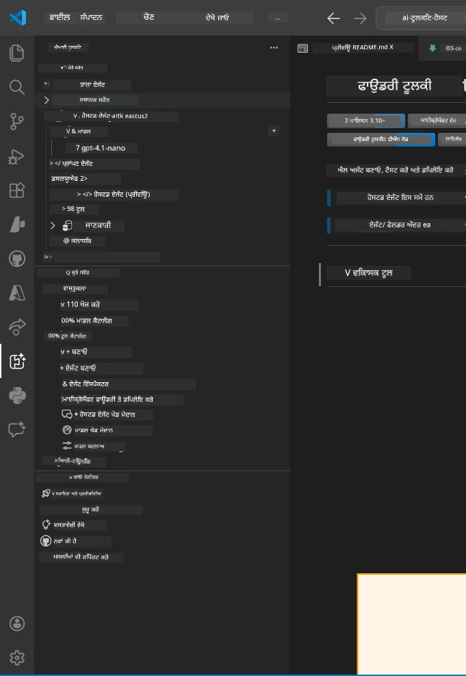
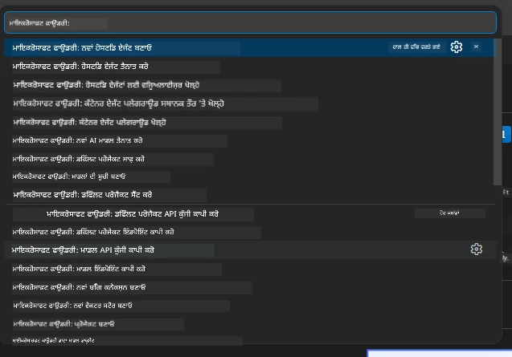

# Module 1 - ਫਾਊਂਡਰੀ ਟੂਲਕਿਟ ਅਤੇ ਫਾਊਂਡਰੀ ਐਕਸਟੈਂਸ਼ਨ ਇੰਸਟਾਲ ਕਰੋ

ਇਹ ਮਾਡਿਊਲ ਤੁਹਾਨੂੰ ਇਸ ਵਰਕਸ਼ਾਪ ਲਈ ਦੋ ਮੁੱਖ VS ਕੋਡ ਐਕਸਟੈਂਸ਼ਨਾਂ ਨੂੰ ਇੰਸਟਾਲ ਕਰਨ ਅਤੇ ਸਹੀ ਤਰੀਕੇ ਨਾਲ ਕੰਮ ਕਰਨ ਦੀ ਜਾਂਚ ਕਰਨ ਵਿੱਚ ਮਦਦ ਕਰਦਾ ਹੈ। ਜੇ ਤੁਸੀਂ ਇਹ ਪਹਿਲਾਂ [ਮਾਡਿਊਲ 0](00-prerequisites.md) ਵਿੱਚ ਇੰਸਟਾਲ ਕਰ ਚੁੱਕੇ ਹੋ, ਤਾਂ ਇਸ ਮਾਡਿਊਲ ਨੂੰ ਵਰਤੇ ਜਾ ਸਕਦਾ ਹੈ ਇਹ ਯਕੀਨੀ ਬਣਾਉਣ ਲਈ ਕਿ ਇਹ ਠੀਕ ਤਰ੍ਹਾਂ ਕੰਮ ਕਰ ਰਹੇ ਹਨ।

---

## ਕਦਮ 1: Microsoft Foundry ਐਕਸਟੈਂਸ਼ਨ ਇੰਸਟਾਲ ਕਰੋ

**Microsoft Foundry for VS Code** ਐਕਸਟੈਂਸ਼ਨ ਤੁਹਾਡਾ ਮੁੱਖ ਸਾਧਨ ਹੈ ਫਾਊਂਡਰੀ ਪ੍ਰੋਜੈਕਟ ਬਣਾਉਣ ਲਈ, ਮਾਡਲ ਡਿਪਲੋਏ ਕਰਨ ਲਈ, ਹੋਸਟ ਕੀਤੇ ਏਜੰਟਾਂ ਨੂੰ ਸਕੈਫੋਲਡ ਕਰਨ ਲਈ ਅਤੇ ਡਾਇਰੈਕਟ VS ਕੋਡ ਤੋਂ ਤੈਨਾਤ ਕਰਨ ਲਈ।

1. VS ਕੋਡ ਖੋਲ੍ਹੋ।
2. `Ctrl+Shift+X` ਦਬਾਓ ਤਾਂ ਕਿ **Extensions** ਪੈਨਲ ਖੁਲੇ।
3. ਉਪਰਲੇ ਖੋਜ ਬਾਕਸ ਵਿੱਚ ਲਿਖੋ: **Microsoft Foundry**
4. ਖੋਜ ਨਤੀਜੇ ਵਿੱਚ **Microsoft Foundry for Visual Studio Code** ਖੋਜੋ।
   - ਪ੍ਰਕਾਸ਼ਕ: **Microsoft**
   - ਐਕਸਟੈਂਸ਼ਨ ID: `TeamsDevApp.vscode-ai-foundry`
5. **Install** ਬਟਨ 'ਤੇ ਕਲਿੱਕ ਕਰੋ।
6. ਇੰਸਟਾਲੇਸ਼ਨ ਪੂਰੀ ਹੋਣ ਦੀ ਉਡੀਕ ਕਰੋ (ਤੁਹਾਨੂੰ ਇਕ ਛੋਟਾ ਪ੍ਰਗਤੀ ਸੂਚਕ ਦਿੱਸੇਗਾ)।
7. ਇੰਸਟਾਲੇਸ਼ਨ ਤੋਂ ਬਾਅਦ, **Activity Bar** (VS ਕੋਡ ਦੇ ਖੱਬੇ ਪਾਸੇ ਖੜਾ ਆਇਕਨ ਬਾਰ) ਵਿੱਚ ਨਵਾਂ **Microsoft Foundry** ਆਇਕਨ ਦਿਖਾਈ ਦੇਣਾ ਚਾਹੀਦਾ ਹੈ (ਹੀਰਾ/AI ਆਇਕਨ ਵਰਗਾ ਲੱਗਦਾ ਹੈ)।
8. **Microsoft Foundry** ਆਇਕਨ 'ਤੇ ਕਲਿੱਕ ਕਰੋ ਤਾਂ ਜੋ ਇਸਦਾ ਸਾਈਡਬਾਰ ਵਿਊ ਖੁਲੇ। ਤੁਹਾਨੂੰ ਹੇਠਾਂ ਵਾਲੇ ਸੈਕਸ਼ਨਜ਼ ਵੇਖਣ ਨੂੰ ਮਿਲਣਗੇ:
   - **Resources** (ਜਾਂ Projects)
   - **Agents**
   - **Models**

> **ਜੇ ਆਇਕਨ ਨਹੀਂ ਦਿਖਾਈ ਦੇਂਦਾ:** VS ਕੋਡ ਨੂੰ ਰੀਲੋਡ ਕਰੋ (`Ctrl+Shift+P` → `Developer: Reload Window`)।

---

## ਕਦਮ 2: Foundry Toolkit ਐਕਸਟੈਂਸ਼ਨ ਇੰਸਟਾਲ ਕਰੋ

**Foundry Toolkit** ਐਕਸਟੈਂਸ਼ਨ [**Agent Inspector**](https://learn.microsoft.com/azure/foundry/agents/how-to/vs-code-agents-workflow-pro-code) ਪ੍ਰਦਾਨ ਕਰਦਾ ਹੈ - ਇੱਕ ਵਿਜ਼ੂਅਲ ਇੰਟਰਫੇਸ ਜੋ ਏਜੰਟਾਂ ਦੀ ਸਥਾਨਕ ਜਾਂਚ ਅਤੇ ਡੀਬੱਗਿੰਗ ਲਈ ਹੈ - ਨਾਲ ਹੀ ਪਲੇਗ੍ਰਾਊਂਡ, ਮਾਡਲ ਪ੍ਰਬੰਧਨ ਅਤੇ ਮੁਲਾਂਕਣ ਟੂਲ ਵੀ।

1. Extensions ਪੈਨਲ (`Ctrl+Shift+X`) ਵਿੱਚ ਖੋਜ ਬਾਕਸ ਸਾਫ਼ ਕਰੋ ਅਤੇ ਲਿਖੋ: **Foundry Toolkit**
2. ਨਤੀਜਿਆਂ ਵਿੱਚੋਂ **Foundry Toolkit** ਨੂੰ ਲੱਭੋ।
   - ਪ੍ਰਕਾਸ਼ਕ: **Microsoft**
   - ਐਕਸਟੈਂਸ਼ਨ ID: `ms-windows-ai-studio.windows-ai-studio`
3. **Install** 'ਤੇ ਕਲਿੱਕ ਕਰੋ।
4. ਇੰਸਟਾਲੇਸ਼ਨ ਤੋਂ ਬਾਅਦ, **Foundry Toolkit** ਆਇਕਨ Activity Bar ਵਿਚ ਦਿਖਾਈ ਦੇਗਾ (ਏਕ ਰੋਬੋਟ/ਚਮਕਦਾਰ ਆਇਕਨ ਵਾਂਗ ਲੱਗਦਾ ਹੈ)।
5. **Foundry Toolkit** ਆਇਕਨ 'ਤੇ ਕਲਿੱਕ ਕਰੋ ਤਾਂ ਜੋ ਇਸਦਾ ਸਾਈਡਬਾਰ ਖੁਲੇ। ਤੁਹਾਨੂੰ Foundry Toolkit ਦਾ ਵੈੱਲਕਮ ਸਕ੍ਰੀਨ ਦਿਖਾਈ ਦੇਵੇਗਾ ਜਿਸ ਵਿੱਚ ਹੇਠਾਂ ਦਿੱਤੇ ਵਿਕਲਪ ਹੋਣਗੇ:
   - **Models**
   - **Playground**
   - **Agents**

---

## ਕਦਮ 3: ਦੋਹਾਂ ਐਕਸਟੈਂਸ਼ਨਾਂ ਦੀ ਕੰਮ ਕਰਨ ਦੀ ਜਾਂਚ ਕਰੋ

### 3.1 Microsoft Foundry ਐਕਸਟੈਂਸ਼ਨ ਦੀ ਜਾਂਚ

1. Activity Bar ਵਿੱਚੋਂ **Microsoft Foundry** ਆਇਕਨ 'ਤੇ ਕਲਿੱਕ ਕਰੋ।
2. ਜੇ ਤੁਸੀਂ Azure ਵਿੱਚ ਸਾਇਨ ਇਨ ਹੋ (Module 0 ਤੋਂ), ਤਾਂ ਤੁਹਾਡੇ ਪ੍ਰੋਜੈਕਟ **Resources** ਹੇਠਾਂ ਦਿਖਣਗੇ।
3. ਜੇ ਸਾਇਨ ਇਨ ਕਰਨ ਦੀ ਦਰਖ਼ਾਸਤ ਹੋਵੇ, ਤਾਂ **Sign in** 'ਤੇ ਕਲਿੱਕ ਕਰੋ ਅਤੇ ਪ੍ਰਮਾਣਿਕਤਾ ਦਿਸ਼ਾ-ਨਿਰਦੇਸ਼ਾਂ ਦਾ ਪਾਲਣ ਕਰੋ।
4. ਪੱਕਾ ਕਰੋ ਕਿ ਤੁਸੀਂ ਸਾਈਡਬਾਰ ਨੂੰ ਬਿਨਾਂ ਕਿਸੇ ਗਲਤੀ ਦੇ ਦੇਖ ਸਕਦੇ ਹੋ।

### 3.2 Foundry Toolkit ਐਕਸਟੈਂਸ਼ਨ ਦੀ ਜਾਂਚ

1. Activity Bar ਵਿੱਚੋਂ **Foundry Toolkit** ਆਇਕਨ 'ਤੇ ਕਲਿੱਕ ਕਰੋ।
2. ਪ੍ਰਮਾਣਿਤ ਕਰੋ ਕਿ ਵੈੱਲਕਮ ਵਿਉ ਜਾਂ ਮੁੱਖ ਪੈਨਲ ਬਿਨਾਂ ਐਰਰ ਦੇ ਲੋਡ ਹੁੰਦਾ ਹੈ।
3. ਹੁਣੇ ਤੁਹਾਨੂੰ ਕੁਝ ਸੈਟਅਪ ਕਰਨ ਦੀ ਲੋੜ ਨਹੀਂ ਹੈ - ਅਸੀਂ Agent Inspector ਨੂੰ [ਮਾਡਿਊਲ 5](05-test-locally.md) ਵਿੱਚ ਵਰਤਾਂਗੇ।

### 3.3 ਕਮਾਂਡ ਪੈਲੇਟ ਰਾਹੀਂ ਜਾਂਚ

1. `Ctrl+Shift+P` ਦਬਾਓ ਤਾਂ ਜੋ ਕਮਾਂਡ ਪੈਲੇਟ ਖੁੱਲੇ।
2. ਲਿਖੋ **"Microsoft Foundry"** - ਤੁਹਾਨੂੰ ਹੇਠਾਂ ਵਾਲੇ ਕਮਾਂਡਜ਼ ਦਿੱਸਣਗੇ:
   - `Microsoft Foundry: Create a New Hosted Agent`
   - `Microsoft Foundry: Deploy Hosted Agent`
   - `Microsoft Foundry: Open Model Catalog`
3. ਕਮਾਂਡ ਪੈਲੇਟ ਬੰਦ ਕਰਨ ਲਈ `Escape` ਦਬਾਓ।
4. ਫਿਰ ਕਮਾਂਡ ਪੈਲੇਟ ਖੋਲ੍ਹੋ ਤੇ ਲਿਖੋ **"Foundry Toolkit"** - ਤੁਹਾਨੂੰ ਇਹ ਕਮਾਂਡ ਜਿਹੇ ਦਿੱਸਣਗੇ:
   - `Foundry Toolkit: Open Agent Inspector`

> ਜੇ ਇਹ ਕਮਾਂਡਜ਼ ਨਹੀਂ ਦਿਸ ਰਹੀਆਂ, ਤਾਂ ਸ਼ਾਇਦ ਐਕਸਟੈਂਸ਼ਨਸ ਸਹੀ ਤਰੀਕੇ ਨਾਲ ਇੰਸਟਾਲ ਨਹੀਂ ਹੋਏ। ਇਨ੍ਹਾਂ ਨੂੰ ਅਨਇੰਸਟਾਲ ਕਰਕੇ ਦੁਬਾਰਾ ਇੰਸਟਾਲ ਕਰਨ ਦੀ ਕੋਸ਼ਿਸ਼ ਕਰੋ।

---

## ਇਸ ਵਰਕਸ਼ਾਪ ਵਿੱਚ ਇਹ ਐਕਸਟੈਂਸ਼ਨ ਕੀ ਕਰਦੇ ਹਨ

| ਐਕਸਟੈਂਸ਼ਨ | ਕੀ ਕਰਦਾ ਹੈ | ਕਦੋਂ ਵਰਤੋਂਗੇ |
|-----------|-------------|-------------------|
| **Microsoft Foundry for VS Code** | ਫਾਊਂਡਰੀ ਪ੍ਰੋਜੈਕਟ ਬਣਾਉਣਾ, ਮਾਡਲ ਡਿਪਲੋਏ ਕਰਨਾ, **[ਹੋਸਟ ਕੀਤੇ ਏਜੰਟਾਂ](https://learn.microsoft.com/azure/foundry/agents/concepts/hosted-agents)** ਨੂੰ ਸਕੈਫੋਲਡ ਕਰਨਾ (ਆਟੋਮੈਟਿਕ ਤੌਰ 'ਤੇ `agent.yaml`, `main.py`, `Dockerfile`, `requirements.txt` ਬਣਾਇਆ ਜਾਂਦਾ ਹੈ), [Foundry Agent Service](https://learn.microsoft.com/azure/foundry/agents/overview) 'ਤੇ ਤੈਨਾਤ ਕਰਨਾ | ਮਾਡਿਊਲ 2, 3, 6, 7 |
| **Foundry Toolkit** | ਸਥਾਨਕ ਜਾਂਚ ਅਤੇ ਡੀਬੱਗਿੰਗ ਲਈ Agent Inspector, ਪਲੇਗ੍ਰਾਊਂਡ UI, ਮਾਡਲ ਪ੍ਰਬੰਧਨ | ਮਾਡਿਊਲ 5, 7 |

> **Foundry ਐਕਸਟੈਂਸ਼ਨ ਇਸ ਵਰਕਸ਼ਾਪ ਵਿੱਚ ਸਭ ਤੋਂ ਮਹੱਤਵਪੂਰਣ ਸਾਧਨ ਹੈ।** ਇਹ ਪੂਰੇ ਲਾਈਫਸਾਈਕਲ ਨੂੰ ਸੰਭਾਲਦਾ ਹੈ: ਸਕੈਫੋਲਡ → ਕਨਫਿਗਰ → ਡਿਪਲੋਏ → ਜਾਂਚ। Foundry Toolkit ਇਸਨੂੰ ਸਥਾਨਕ ਜਾਂਚ ਲਈ ਵਿਜ਼ੂਅਲ Agent Inspector ਮੁਹੱਈਆ ਕਰਕੇ ਸਹਾਰਾ ਦਿੰਦਾ ਹੈ।

---

### ਚੈੱਕਪੋਇੰਟ

- [ ] Activity Bar ਵਿੱਚ Microsoft Foundry ਆਇਕਨ ਦਿਖਾਈ ਦੇ ਰਿਹਾ ਹੈ
- [ ] ਇਸ 'ਤੇ ਕਲਿੱਕ ਕਰਨ ਤੇ ਸਾਈਡਬਾਰ ਬਿਨਾਂ ਗਲਤੀ ਦਿਖਾਈ ਦਿੰਦਾ ਹੈ
- [ ] Activity Bar ਵਿੱਚ Foundry Toolkit ਆਇਕਨ ਦਿਖਾਈ ਦੇ ਰਿਹਾ ਹੈ
- [ ] ਇਸ 'ਤੇ ਕਲਿੱਕ ਕਰਨ ਤੇ ਸਾਈਡਬਾਰ ਬਿਨਾਂ ਗਲਤੀ ਦਿਖਾਈ ਦਿੰਦਾ ਹੈ
- [ ] `Ctrl+Shift+P` → "Microsoft Foundry" ਲਿਖ ਕੇ ਉਪਲਬਧ ਕਮਾਂਡਜ਼ ਦਿਖਾਈ ਦੇ ਰਹੀਆਂ ਹਨ
- [ ] `Ctrl+Shift+P` → "Foundry Toolkit" ਲਿਖ ਕੇ ਉਪਲਬਧ ਕਮਾਂਡਜ਼ ਦਿਖਾਈ ਦੇ ਰਹੀਆਂ ਹਨ

---

**ਪਿਛਲਾ:** [00 - ਪ੍ਰੀਰੇਕਵਿਸਿਟ](00-prerequisites.md) · **ਅਗਲਾ:** [02 - ਫਾਊਂਡਰੀ ਪ੍ਰੋਜੈਕਟ ਬਣਾਓ →](02-create-foundry-project.md)

---

<!-- CO-OP TRANSLATOR DISCLAIMER START -->
**ਅਸਵੀਕਾਰੋਪ**:  
ਇਹ ਦਸਤਾਵੇਜ਼ AI ਅਨੁਵਾਦ ਸੇਵਾ [Co-op Translator](https://github.com/Azure/co-op-translator) ਦੀ ਵਰਤੋਂ ਕਰਕੇ ਅਨੁਵਾਦਿਤ ਕੀਤਾ ਗਿਆ ਹੈ। ਜਦੋਂ ਕਿ ਅਸੀਂ ਸਹੀਅਤ ਲਈ ਕੋਸ਼ਿਸ਼ ਕਰਦੇ ਹਾਂ, ਕਿਰਪਾ ਕਰਕੇ ਧਿਆਨ ਦੇਵੋ ਕਿ ਆਟੋਮੈਟਿਕ ਅਨੁਵਾਦਾਂ ਵਿੱਚ ਗਲਤੀਆਂ ਜਾਂ ਅਸਮਰੱਥਾਵਾਂ ਹੋ ਸਕਦੀਆਂ ਹਨ। ਮੂਲ ਦਸਤਾਵੇਜ਼ ਆਪਣੇ ਮੂਲ ਭਾਸ਼ਾ ਵਿੱਚ ਪ੍ਰਮਾਣਿਕ ਸ੍ਰੋਤ ਵਜੋਂ ਮੰਨਿਆ ਜਾਣਾ ਚਾਹੀਦਾ ਹੈ। ਅਹੰਕਾਰ ਜਾਣਕਾਰੀ ਲਈ, ਪੇਸ਼ੇਵਰ ਮਨੁੱਖੀ ਅਨੁਵਾਦ ਦੀ ਸਿਫਾਰਸ਼ ਕੀਤੀ ਜਾਂਦੀ ਹੈ। ਸਾਡੇ ਉੱਤੇ ਇਸ ਅਨੁਵਾਦ ਦੀ ਵਰਤੋਂ ਨਾਲ ਪੈਦਾ ਹੋਣ ਵਾਲੀਆਂ ਕਿਸੇ ਵੀ ਗਲਤ ਫਹਿਮੀਆਂ ਜਾਂ ਗਲਤ ਵਿਆਖਿਆਵਾਂ ਲਈ ਜ਼ਿੰਮੇਵਾਰੀ ਨਹੀਂ ਹੈ।
<!-- CO-OP TRANSLATOR DISCLAIMER END -->