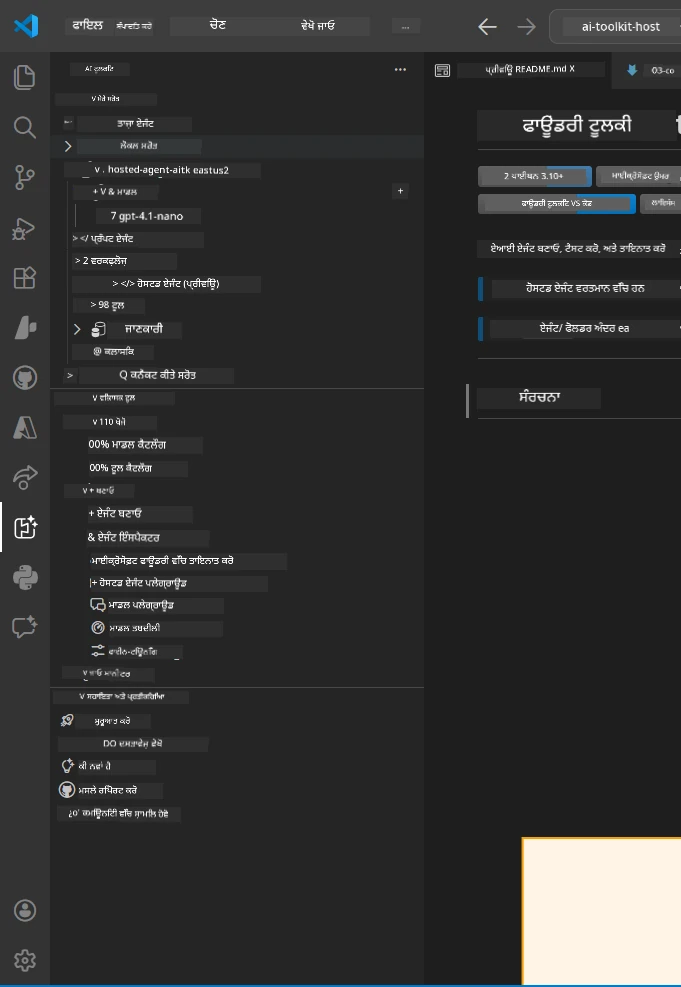
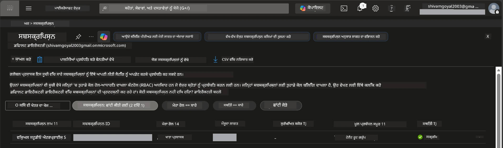
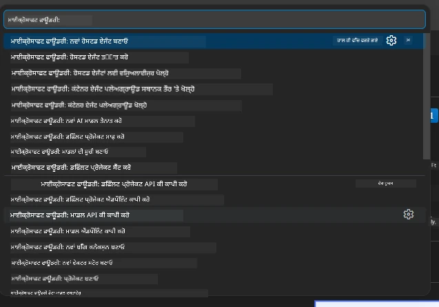
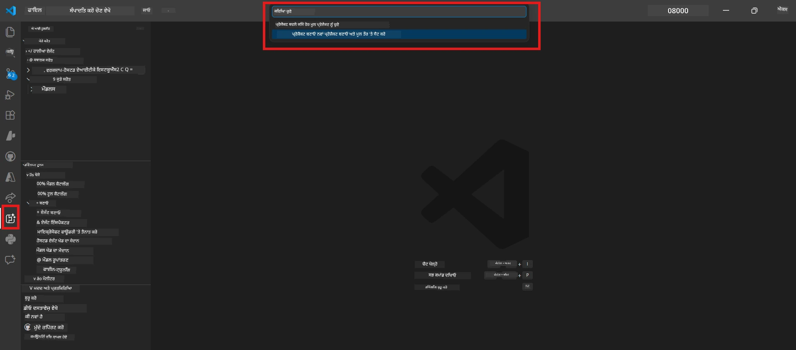
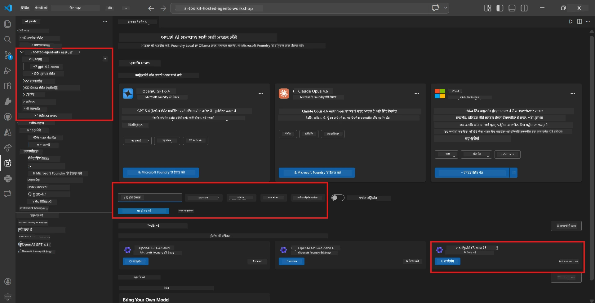
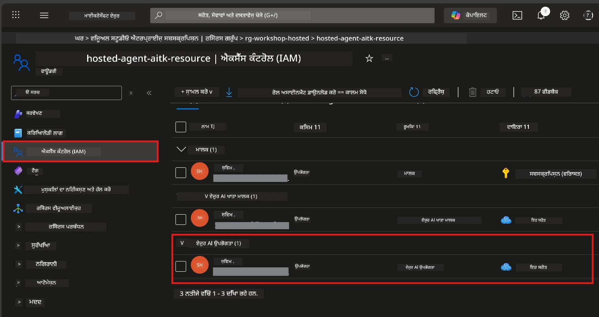

# ਸੈਟਅਪ: ਐਕਸਟੇੰਸ਼ਨ, ਪ੍ਰਾਜੈਕਟ ਅਤੇ ਮਾਡਲ

⏱️ ~15 ਮਿੰਟ

ਇਸ ਮੋਡੀਊਲ ਵਿੱਚ, ਤੁਸੀਂ ਫਾਊਂਡਰੀ ਟੂਲਕਿਟ ਐਕਸਟੇੰਸ਼ਨ ਨੂੰ ਇੰਸਟਾਲ ਅਤੇ ਵੈਰੀਫਾਈ ਕਰੋਗੇ, ਇੱਕ ਫਾਊਂਡਰੀ ਪ੍ਰਾਜੈਕਟ ਬਣਾਉਂਦੇ ਜਾਂ ਜੋੜਦੇ ਹੋ, ਅਤੇ ਆਪਣੇ ਏਜੰਟ ਲਈ ਮਾਡਲ ਤਿਆਰ ਕਰਦੇ ਹੋ।

## ਕਦਮ 1: ਫਾਊਂਡਰੀ ਟੂਲਕਿਟ ਇੰਸਟਾਲ ਕਰੋ

**ਵਿਜ਼ੂਅਲ ਸਟੂਡੀਓ ਕੋਡ ਲਈ ਫਾਊਂਡਰੀ ਟੂਲਕਿਟ** ਇਸ ਵਰਕਸ਼ਾਪ ਲਈ ਪ੍ਰਮੁੱਖ ਐਕਸਟੇੰਸ਼ਨ ਹੈ। ਇਹ ਪ੍ਰਾਜੈਕਟ ਬਣਾਉਣਾ, ਮਾਡਲ ਡਿਪਲੋਇ ਕਰਨਾ, ਏਜੰਟ ਸਕੈਫੋਲਡਿੰਗ, ਲੋਕਲ ਟੈਸਟਿੰਗ (Agent Inspector), ਅਤੇ ਕਲੌਡ ਡਿਪਲੋਇਮੈਂਟ ਸਾਰੀਆਂ ਸਹੂਲਤਾਂ ਦਿੰਦਾ ਹੈ — ਸਾਰੇ VS ਕੋਡ ਤੋਂ।

1. VS ਕੋਡ ਖੋਲ੍ਹੋ ਅਤੇ ਫਿਰ `Ctrl+Shift+X` ਦਬਾ ਕੇ **ਐਕਸਟੇੰਸ਼ਨਜ਼** ਪੈਨਲ ਖੋਲ੍ਹੋ।
2. **Foundry Toolkit** ਲਈ ਖੋਜ ਕਰੋ।
3. **Foundry Toolkit for VS Code** (ਪਬਲਿਸ਼ਰ: Microsoft, ਆਈਡੀ: `ms-windows-ai-studio.windows-ai-studio`) ਇੰਸਟਾਲ ਕਰੋ।
4. ਇੰਸਟਾਲੇਸ਼ਨ ਤੋਂ ਬਾਅਦ, **Foundry Toolkit** ਦਾ ਆਈਕਨ ਐਕਟਿਵਿਟੀ ਬਾਰ (ਖੱਬਾ ਸਾਈਡਬਾਰ) 'ਚ ਦਿਖਾਈ ਦੇਵੇਗਾ।

> *ਨੋਟ: ਪੁਰਾਣੀਆਂ ਐਕਸਟੇੰਸ਼ਨ ਵਰਜ਼ਨਾਂ ਵਿੱਚ ਐਕਟਿਵਿਟੀ ਬਾਰ 'ਤੇ "AI TOOLKIT" ਦਿਖਾਈ ਦੇ ਸਕਦਾ ਹੈ। ਫੰਕਸ਼ਨਾਲਿਟੀ ਇਖੇ ਹੀ ਹੈ।*



## ਕਦਮ 2: ਆਪਣੇ ਐਕਸੈੱਸ ਅਨੁਸਾਰ ਸੈਟ ਅੱਪ ਕਰੋ

> **ਆਪਣਾ ਰਸਤਾ ਚੁਣੋ:** ਹੇਠਾਂ ਉਸ ਭਾਗ ਨੂੰ ਫੈਲਾਓ ਜੋ ਤੁਹਾਡੇ ਸੈਟਅਪ ਨਾਲ ਮਿਲਦਾ ਹੈ। ਤੁਹਾਨੂੰ ਸਿਰਫ਼ **ਇੱਕ** ਰਸਤਾ ਪੂਰਾ ਕਰਨਾ ਹੈ।

<details>
<summary><strong>🅰️ ਰਸਤਾ A - ਐਜੂਰ ਕਲੌਡ (ਐਜੂਰ ਸਬਸਕ੍ਰਿਪਸ਼ਨ ਲਾਜ਼ਮੀ)</strong></summary>

### ਐਜੂਰ CLI

1. ਇੰਸਟਾਲ ਕਰੋ: [learn.microsoft.com/cli/azure/install-azure-cli](https://learn.microsoft.com/cli/azure/install-azure-cli) ਤੋਂ।
2. ਵੈਰੀਫਾਈ ਕਰੋ: `az --version` (2.80.0+ ਉਮੀਦ ਕਰੋ)।
3. ਸਾਈਨ ਇਨ ਕਰੋ: `az login`

### ਪ੍ਰਮਾਣਿਕਤਾ ਵਿਕਲਪ

[Microsoft Agent Framework](https://learn.microsoft.com/agent-framework/overview/) [`DefaultAzureCredential`](https://learn.microsoft.com/azure/developer/python/sdk/authentication/credential-chains#defaultazurecredential-overview) ਦੀ ਵਰਤੋਂ ਕਰਦਾ ਹੈ ਜੋ ਕਈ ਪ੍ਰਮਾਣਿਕਤਾ ਢੰਗਾਂ ਨੂੰ ਕਿਸੇ ਕਿੱਥੇ ਨਾਲ ਪਰਖਦਾ ਹੈ। ਆਪਣੇ ਵਾਤਾਵਰਣ ਦੇ ਅਨੁਸਾਰ ਇੱਕ ਚੁਣੋ:

#### ਵਿਕਲਪ 1: VS ਕੋਡ ਖਾਤੇ (ਵਰਕਸ਼ਾਪ ਲਈ ਸਿਫਾਰਸ਼ੀ)
1. VS ਕੋਡ ਦੇ ਖੱਬੇ-ਥੱਲੇ ਕੋਨੇ ਵਿੱਚ **Accounts** ਆਈਕਨ (ਵਿਅਕਤੀ ਦਾ ਸਿਲੂਐਟ) 'ਤੇ ਕਲਿੱਕ ਕਰੋ।
2. **Microsoft Foundry ਲਈ ਸਾਈਨ ਇਨ ਕਰੋ** ਜਾਂ **Azure ਨਾਲ ਸਾਈਨ ਇਨ ਕਰੋ** ਚੁਣੋ।
3. ਬ੍ਰਾਊਜ਼ਰ ਖੁਲ ਜਾਏਗਾ - ਉਸ ਐਜੂਰ ਖਾਤੇ ਨਾਲ ਸਾਈਨ ਇਨ ਕਰੋ ਜਿਸਨੂੰ ਤੁਹਾਡੀ ਸਬਸਕ੍ਰਿਪਸ਼ਨ ਤੱਕ ਪਹੁੰਚ ਹੈ।
4. VS ਕੋਡ 'ਤੇ ਵਾਪਸ ਜਾਓ। ਤੁਹਾਨੂੰ ਹੇਠਲੇ ਖੱਬੇ ਕੋਨੇ ਵਿੱਚ ਆਪਣਾ ਖਾਤਾ ਨਾਮ ਦਿਖਾਈ ਦੇਵੇਗਾ।

#### ਵਿਕਲਪ 2: ਐਜੂਰ CLI
```bash
az login
az account set --subscription "<your-subscription-id>"
```

#### ਵਿਕਲਪ 3: ਸਰਵਿਸ ਪ੍ਰਿੰਸਿਪਲ (ਇੰਟਰਪ੍ਰਾਈਜ਼/CI)
ਲਾਕਡ-ਡਾਊਨ ਵਾਤਾਵਰਨ ਜਾਂ CI/CD ਪਾਈਪਲਾਈਨ ਲਈ, ਇਹ ਵਾਤਾਵਰਣ ਚਲਕਾਂ `.env` ਫਾਈਲ ਵਿਚ ਸੈੱਟ ਕਰੋ:
```env
AZURE_TENANT_ID=<your-tenant-id>
AZURE_CLIENT_ID=<your-client-id>
AZURE_CLIENT_SECRET=<your-client-secret>
```

> **`DefaultAzureCredential` ਕਿਵੇਂ ਕੰਮ ਕਰਦਾ ਹੈ:** ਇਹ ਪਹਿਲਾਂ ਵਾਤਾਵਰਣ ਚਲਕਾਂ ਨੂੰ ਕੋਸ਼ਿਸ਼ ਕਰਦਾ ਹੈ, ਫਿਰ ਮੈਨੇਜਡ ਆਈਡੈਂਟਿਟੀ, ਫਿਰ VS ਕੋਡ ਸਾਈਨ-ਇਨ, ਫਿਰ ਐਜੂਰ CLI – ਅਤੇ ਜੋ ਵੀ ਪਹਿਲਾਂ ਸਫਲ ਹੁੰਦਾ ਹੈ, ਉਸਦਾ ਇਸਤੇਮਾਲ ਕਰਦਾ ਹੈ। ਵੇਖੋ [ਕ੍ਰੈਡੈਂਸ਼ੀਅਲ ਚੇਨ ਡੌਕਸ](https://learn.microsoft.com/azure/developer/python/sdk/authentication/credential-chains#defaultazurecredential-overview)।

### ਐਜੂਰ ਡਿਵੈਲਪਰ CLI (azd)

1. ਇੰਸਟਾਲ ਕਰੋ: `winget install microsoft.azd` (ਵਿੰਡੋਜ਼) ਜਾਂ ਵੇਖੋ [ਇੰਸਟਾਲ ਡੌਕਸ](https://learn.microsoft.com/azure/developer/azure-developer-cli/install-azd)।
2. ਵੈਰੀਫਾਈ ਕਰੋ: `azd version`
3. ਸਾਈਨ ਇਨ ਕਰੋ: `azd auth login`

### ਡੋਕਰ ਡੈਸਕਟੌਪ (ਇਚਛਾ ਅਨੁਸਾਰ)

ਡੋਕਰ ਸਿਰਫ਼ ਇਸ ਸੂਰਤ ਵਿੱਚ ਲੋੜੀਂਦਾ ਹੈ ਜੇ ਤੁਸੀਂ ਲੋਕਲ ਤੌਰ 'ਤੇ ਕੰਟੇਨਰ ਬਣਾਉਣਾ ਚਾਹੁੰਦੇ ਹੋ। ਫਾਊਂਡਰੀ ਐਕਸਟੇੰਸ਼ਨ ਡਿਪਲੋਇਮੈਂਟ ਦੌਰਾਨ ਅਪਣੇ ਆਪ ਬਿਲਡ ਸਾਂਭਦਾ ਹੈ।

1. ਇੰਸਟਾਲ ਕਰੋ: [docs.docker.com/get-docker](https://docs.docker.com/get-docker/) ਤੋਂ।
2. ਵੈਰੀਫਾਈ ਕਰੋ: `docker info`

### ਐਜੂਰ ਸਬਸਕ੍ਰਿਪਸ਼ਨ ਅਤੇ RBAC

1. ਸਾਈਨ ਇਨ ਕਰੋ: [portal.azure.com](https://portal.azure.com) 'ਤੇ।
2. **Subscriptions** ਵਿੱਚ ਜਾਓ ਅਤੇ ਘੱਟੋ-ਘੱਟ ਇੱਕ ਨੂੰ **Active** ਹੋਣ ਦੀ ਪੁਸ਼ਟੀ ਕਰੋ।
3. ਆਪਣਾ **Subscription ID** ਨੋਟ ਕਰੋ - ਤੁਹਾਨੂੰ ਇਹ ਮੋਡੀਊਲ 01 ਵਿੱਚ ਚਾਹੀਦਾ ਹੋਵੇਗਾ।



#### RBAC ਸਿਨਾਰੀਓ ਟੇਬਲ

[Hosted Agent](https://learn.microsoft.com/azure/foundry/agents/concepts/hosted-agents) ਡਿਪਲੋਇਮੈਂਟ ਨੂੰ ਉਹਨਾਂ **ਡਾਟਾ ਐਕਸ਼ਨ** ਅਧਿਕਾਰਾਂ ਦੀ ਜ਼ਰੂਰਤ ਹੁੰਦੀ ਹੈ ਜੋ ਸਧਾਰਣ ਐਜੂਰ `Owner` ਅਤੇ `Contributor` ਭੂਮਿਕਾਵਾਂ ਵਿੱਚ ਨਹੀਂ ਹੁੰਦੇ। ਹੇਠਾਂ ਦਿੱਤੀ ਟੇਬਲ ਦੇਖੋ ਕਿ ਕਿਹੜੀਆਂ ਭੂਮਿਕਾਵਾਂ ਦੀ ਲੋੜ ਹੈ:

| ਸਿਨਾਰੀਓ | ਲੋੜੀਂਦੀਆਂ ਭੂਮਿਕਾਵਾਂ | ਕਿੱਥੇ ਸੰਸੋਧਿਤ ਕਰਨੀਆਂ ਹਨ |
|----------|---------------|----------------------|
| ਨਵਾਂ ਫਾਊਂਡਰੀ ਪ੍ਰਾਜੈਕਟ ਬਣਾਉਣਾ | ਫਾਊਂਡਰੀ ਸਰੋਤ 'ਤੇ **Azure AI Owner** | ਐਜੂਰ ਪੋਰਟਲ ਵਿੱਚ ਫਾਊਂਡਰੀ ਸਰੋਤ |
| ਮੌਜੂਦਾ ਪ੍ਰਾਜੈਕਟ ਵਿੱਚ ਡਿਪਲੋਇ (ਨਵੇਂ ਸਰੋਤ) | ਸਬਸਕ੍ਰਿਪਸ਼ਨ 'ਤੇ **Azure AI Owner** + **Contributor** | ਸਬਸਕ੍ਰਿਪਸ਼ਨ + ਫਾਊਂਡਰੀ ਸਰੋਤ |
| ਪੂਰੀ ਤਰ੍ਹਾਂ ਸੰਰਚਿਤ ਪ੍ਰਾਜੈਕਟ 'ਤੇ ਡਿਪਲੋਇ | ਖਾਤੇ 'ਤੇ **Reader** + ਪ੍ਰਾਜੈਕਟ 'ਤੇ **Azure AI User** | ਐਜੂਰ ਪੋਰਟਲ ਵਿੱਚ ਖਾਤਾ + ਪ੍ਰਾਜੈਕਟ |
| ਸਿਰਫ਼ ਲੋਕਲ ਟੈਸਟਿੰਗ (ਕੋਈ ਡਿਪਲੋਇ ਨਹੀਂ) | ਪ੍ਰਾਜੈਕਟ 'ਤੇ **Azure AI User** | ਐਜੂਰ ਪੋਰਟਲ ਵਿੱਚ ਪ੍ਰਾਜੈਕਟ |

> **ਮੁੱਖ ਗੱਲ:** ਐਜੂਰ `Owner` ਅਤੇ `Contributor` ਭੂਮਿਕਾਵਾਂ ਸਿਰਫ਼ *ਪರਬੰਧ* ਅਧਿਕਾਰ (ARM ਓਪਰੇਸ਼ਨ) ਕਵਰ ਕਰਦੀਆਂ ਹਨ। ਤੁਹਾਨੂੰ ਡਾਟਾ ਐਕਸ਼ਨਾਂ ਲਈ [**Azure AI User**](https://learn.microsoft.com/azure/foundry/concepts/rbac-foundry#built-in-roles) (ਜਾਂ ਉੱਚਾ) ਚਾਹੀਦਾ ਹੈ ਜਿਵੇਂ ਕਿ `agents/write` ਜੋ ਏਜੰਟ ਬਣਾਉਣ ਅਤੇ ਡਿਪਲੋਇ ਕਰਨ ਲਈ ਲਾਜ਼ਮੀ ਹੈ।

## ਫਾਊਂਡਰੀ ਪ੍ਰਾਜੈਕਟ ਜੋੜੋ ਜਾਂ ਬਣਾਓ



1. `Ctrl+Shift+P` ਦਬਾਓ → **Foundry Toolkit: Create Project** ਟਾਈਪ ਕਰੋ → ਚੁਣੋ।
2. ਡ੍ਰੌਪਡਾਊਨ ਵਿਚੋਂ ਆਪਣੀ **Azure subscription** ਚੁਣੋ।
3. ਇੱਕ **resource group** ਚੁਣੋ ਜਾਂ ਬਣਾਓ (ਜਿਵੇਂ `rg-hosted-agents-workshop`)۔
4. ਇੱਕ **region** ਚੁਣੋ ਜੋ hosted agents ਨੂੰ ਸਹਾਇਤਾ ਦਿੰਦਾ ਹੈ: `East US`, `West US 2`, ਜਾਂ `Sweden Central`। ਵੇਖੋ [ਰੀਜਨ ਉਪਲਬਧਤਾ](https://learn.microsoft.com/azure/foundry/agents/concepts/hosted-agents#region-availability)।
5. ਇੱਕ ਪ੍ਰਾਜੈਕਟ ਨਾਮ ਦਰਜ ਕਰੋ (ਜਿਵੇਂ `workshop-agents`)।
6. ਪ੍ਰੋਵੀਜ਼ਨਿੰਗ ਲਈ 2-5 ਮਿੰਟ ਰੁਕੋ। VS ਕੋਡ ਵਿੱਚ ਇੱਕ ਪ੍ਰਗਤੀ ਸੂਚਨਾ ਦਿਖਾਈ ਦੇਵੇਗੀ।
7. ਮੁਕੰਮਲ ਹੋਣ 'ਤੇ, ਤੁਹਾਡਾ ਪ੍ਰਾਜੈਕਟ **Foundry Toolkit** ਸਾਈਡਬਾਰ ਵਿੱਚ **MY RESOURCES** ਹੇਠ ਦਿਖਾਈ ਦੇਵੇਗਾ।



## ਮਾਡਲ ਡਿਪਲੋਇ ਕਰੋ ਅਤੇ RBAC ਅਸਾਈਨ ਕਰੋ

ਤੁਹਾਡੇ ਹੋਸਟ ਕੀਤੇ ਏਜੰਟ ਨੂੰ ਜਵਾਬ ਤਿਆਰ ਕਰਨ ਲਈ ਇੱਕ AI ਮਾਡਲ ਦੀ ਲੋੜ ਹੈ।

#### ਮਾਡਲ ਚੋਣ ਮੈਟ੍ਰਿਕਸ
ਤੁਹਾਡੀਆਂ ਜ਼ਰੂਰਤਾਂ ਅਨੁਸਾਰ, ਤੁਸੀਂ ਵੱਖ-ਵੱਖ ਮਾਡਲ ਟੀਅਰਾਂ ਵਿੱਚੋਂ ਚੁਣ ਸਕਦੇ ਹੋ:

| ਮਾਡਲ | ਸਭ ਤੋਂ ਵਧੀਆ | ਲਾਗਤ | ਟਿੱਪਣੀਆਂ |
|-------|----------|------|-------|
| `gpt-4.1` | ਉੱਚ ਗੁਣਵੱਤਾ ਅਤੇ ਸੁক্ষਮ ਜਵਾਬ | ਵੱਧ | ਸਭ ਤੋਂ ਵਧੀਆ ਨਤੀਜੇ, ਅੰਤਮ ਟੈਸਟਿੰਗ ਲਈ ਸੁਝਾਅ |
| `gpt-4.1-mini/gpt-5-mini` | ਤੇਜ਼ ਇਟਰੇਸ਼ਨ, ਘੱਟ ਖ਼ਰਚ | ਘੱਟ | ਵਰਕਸ਼ਾਪ ਵਿਕਾਸ ਅਤੇ ਤੇਜ਼ ਟੈਸਟਿੰਗ ਲਈ ਚੰਗਾ |
| `gpt-4.1-nano` | ਹਲਕੇ ਕਾਮ | ਸਭ ਤੋਂ ਘੱਟ | ਸਭ ਤੋਂ ਕੰਮ ਲਾਗਤ, ਪਰ ਸਧਾਰਣ ਜਵਾਬ |

1. `Ctrl+Shift+P` ਦਬਾਓ → **Foundry Toolkit: Open Model Catalog** (ਜਾਂ ਸਾਈਡਬਾਰ ਵਿੱਚ DEVELOPER TOOLS ਹੇਠ **Model Catalog** 'ਤੇ ਕਲਿੱਕ ਕਰੋ).
2. ਕੈਟਾਲੌਗ ਵਿੱਚ **gpt-4.1** ਲੱਭੋ।
3. **OpenAI GPT-4.1-mini** (ਜਾਂ ਬਿਹਤਰ ਗੁਣਵੱਤਾ ਲਈ `gpt-5-mini`) ਲੱਭੋ ਅਤੇ **Deploy** 'ਤੇ ਕਲਿੱਕ ਕਰੋ।



4. ਡਿਪਲੋਇਮੈਂਟ ਵਿਨਯਾਸ ਵਿੱਚ:
   - **Deployment name:** ਡਿਫਾਲਟ ਛੱਡੋ ਜਾਂ ਕਸਟਮ ਨਾਮ ਦਿਓ। **ਇਸ ਨਾਮ ਨੂੰ ਯਾਦ ਰੱਖੋ।**
   - **Target:** **Deploy to Foundry Toolkit** ਚੁਣੋ → ਆਪਣਾ ਪ੍ਰਾਜੈਕਟ ਚੁਣੋ।
5. **Deploy** 'ਤੇ ਕਲਿੱਕ ਕਰੋ ਅਤੇ 1-3 ਮਿੰਟ ਰੁਕੋ।

> **ਸਿਫਾਰਸ਼:** ਵਰਕਸ਼ਾਪ ਲਈ `gpt-4.1-mini/gpt-5-mini` ਵਰਤੋ — ਤੇਜ਼, ਸਸਤਾ, ਅਤੇ ਚੰਗੇ ਨਤੀਜੇ ਦਿੰਦਾ ਹੈ।

### ਆਪਣੀਆਂ ਕੀਮਤਾਂ ਨੋਟ ਕਰੋ

ਡਿਪਲੋਇਮੈਂਟ ਤੋਂ ਬਾਅਦ, ਇਹ ਦੋ ਕੀਮਤਾਂ ਨੋਟ ਕਰੋ (ਤੁਹਾਨੂੰ ਮੋਡੀਊਲ 03 ਵਿੱਚ ਲੋੜ ਪਵੇਗੀ):

| ਕੀਮਤ | ਕਿੱਥੇ ਲੱਭਣੀ ਹੈ |
|-------|-----------------|
| **ਪ੍ਰਾਜੈਕਟ ਐਂਡਪਾਇੰਟ** | ਸਾਈਡਬਾਰ ਵਿੱਚ ਆਪਣੇ ਪ੍ਰਾਜੈਕਟ 'ਤੇ ਕਲਿੱਕ ਕਰੋ → ਵਿਸਥਾਰ ਦ੍ਰਿਸ਼ ਵੱਖਰੇ URL ਨੂੰ ਦਿਖਾਉਂਦਾ ਹੈ (ਜਿਵੇਂ `https://<account>.services.ai.azure.com/api/projects/<project>`) |
| **ਮਾਡਲ ਡਿਪਲੋਇਮੈਂਟ ਨਾਮ** | ਪ੍ਰਾਜੈਕਟ ਖੋਲ੍ਹੋ → **Models** → ਆਪਣੇ ਡਿਪਲੋਇਡ ਮਾਡਲ ਦੇ ਨੇੜੇ ਦਾ ਨਾਮ (ਜਿਵੇਂ `gpt-4.1-mini/gpt-5-mini`) |

### RBAC ਭੂਮਿਕਾ ਅਸਾਈਨ ਕਰੋ

> ⚠️ **ਇਹ ਸਭ ਤੋਂ ਵੱਧ ਛੁੱਟੀ ਹੋਈ ਕਦਮ ਹੈ।** ਸਹੀ ਭੂਮਿਕਾ ਵਿੱਣ ਡਿਪਲੋਇਮੈਂਟ ਮੋਡੀਊਲ 05 ਵਿੱਚ ਫੇਲ ਹੋ ਜਾਵੇਗਾ।

#### ਮੈਨੂੰ ਕਿਹੜੀ ਭੂਮਿਕਾ ਚਾਹੀਦੀ ਹੈ?
ਤੁਹਾਡੇ ਸਿਨਾਰੀਓ ਦੇ ਅਨੁਸਾਰ, ਤੁਸੀਂ ਹੇਠਾਂ ਦਿੱਤੀਆਂ ਭੂਮਿਕਾਵਾਂ ਦੇ ਜੋੜੇ ਦੀ ਲੋੜ ਹੋਵੇਗੀ:

| ਸਿਨਾਰੀਓ | ਲੋੜੀਂਦੀਆਂ ਭੂਮਿਕਾਵਾਂ | ਕਿੱਥੇ ਸੰਸੋਧਿਤ ਕਰਨੀਆਂ ਹਨ |
|----------|---------------|----------------------|
| ਨਵਾਂ ਫਾਊਂਡਰੀ ਪ੍ਰਾਜੈਕਟ ਬਣਾਉਣਾ | ਫਾਊਂਡਰੀ ਸਰੋਤ 'ਤੇ **Azure AI Owner** | ਐਜੂਰ ਪੋਰਟਲ ਵਿੱਚ ਫਾਊਂਡਰੀ ਸਰੋਤ |
| ਮੌਜੂਦਾ ਪ੍ਰਾਜੈਕਟ ਵਿੱਚ ਡਿਪਲੋਇਮੈਂਟ (ਨਵੇਂ ਸਰੋਤ) | ਸਬਸਕ੍ਰਿਪਸ਼ਨ 'ਤੇ **Azure AI Owner** + **Contributor** | ਸਬਸਕ੍ਰਿਪਸ਼ਨ + ਫਾਊਂਡਰੀ ਸਰੋਤ |
| ਪੂਰੀ ਤਰ੍ਹਾਂ ਸੰਰਚਿਤ ਪ੍ਰਾਜੈਕਟ 'ਤੇ ਡਿਪਲੋਇਮੈਂਟ | ਖਾਤੇ 'ਤੇ **Reader** + ਪ੍ਰਾਜੈਕਟ 'ਤੇ **Azure AI User** | ਐਜੂਰ ਪੋਰਟਲ ਵਿੱਚ ਖਾਤਾ + ਪ੍ਰਾਜੈਕਟ |

**ਮੁੱਖ ਗੱਲ:** ਐਜੂਰ `Owner` ਅਤੇ `Contributor` ਭੂਮਿਕਾਵਾਂ ਸਿਰਫ਼ *ਪರਬੰਧ* ਅਧਿਕਾਰ ਕਵਰ ਕਰਦੀਆਂ ਹਨ। ਤੁਹਾਨੂੰ *ਡਾਟਾ ਐਕਸ਼ਨ* ਲਈ **Azure AI User** (ਜਾਂ ਉੱਚਾ) ਚਾਹੀਦਾ ਹੈ ਜਿਵੇਂ `agents/write` ਜੋ ਏਜੰਟ ਬਣਾਉਣ ਅਤੇ ਡਿਪਲੋਇ ਕਰਨ ਲਈ ਲਾਜ਼ਮੀ ਹੈ।

1. [portal.azure.com](https://portal.azure.com) ਖੋਲ੍ਹੋ।
2. ਆਪਣਾ **Foundry project** ਨਾਮ ਖੋਜੋ → **"Foundry Toolkit project"** ਕਿਸਮ ਦਾ ਨਤੀਜਾ ਕਲਿੱਕ ਕਰੋ (ਮੁਖ਼ ਪਲੇਟਫਾਰਮ ਖਾਤਾ ਨਹੀਂ)।
3. ਖੱਬੇ ਨੇਵੀਗੇਸ਼ਨ 'ਚ **Access control (IAM)** 'ਤੇ ਕਲਿੱਕ ਕਰੋ।
4. **+ Add** → **Add role assignment** 'ਤੇ ਕਲਿੱਕ ਕਰੋ।
5. **Role tab:** **Azure AI User** ਖੋਜੋ, ਚੁਣੋ, ਅਤੇ **Next** 'ਤੇ ਕਲਿੱਕ ਕਰੋ।
6. **Members tab:** **User, group, or service principal** ਚੁਣੋ → **+ Select members** → ਆਪਣੇ ਆਪ ਨੂੰ ਖੋਜੋ ਅਤੇ ਚੁਣੋ → **Select** 'ਤੇ ਕਲਿੱਕ ਕਰੋ।
7. **Review + assign** 'ਤੇ ਕਲਿੱਕ ਕਰੋ → ਦੁਬਾਰਾ **Review + assign** 'ਤੇ ਕਲਿੱਕ ਕਰੋ।
8. ਪ੍ਰਸਾਰਣ ਲਈ **1–2 ਮਿੰਟ** ਉਡੀਕ ਕਰੋ।

> **ਇਹ ਭੂਮਿਕਾ ਕਿਉਂ?** ਐਜੂਰ `Owner`/`Contributor` ਸਿਰਫ਼ ਪਰਬੰਧਕੀ ਅਧਿਕਾਰ ਦਿੰਦੇ ਹਨ। **Azure AI User** ਭੂਮਿਕਾ `agents/write` ਡਾਟਾ ਐਕਸ਼ਨ ਦਿੰਦੀ ਹੈ ਜੋ ਏਜੰਟ ਬਣਾਉਣ ਅਤੇ ਡਿਪਲੋਇ ਕਰਨ ਲਈ ਲਾਜ਼ਮੀ ਹੈ। ਵੇਖੋ [Foundry RBAC ਡੌਕਸ](https://learn.microsoft.com/azure/foundry/concepts/rbac-foundry#built-in-roles)।



</details>

<details>
<summary><strong>🅱️ ਰਸਤਾ B - ਲੋਕਲ / ਮੁਫ਼ਤ ਟੀਅਰ (ਕੋਈ ਐਜੂਰ ਸਬਸਕ੍ਰਿਪਸ਼ਨ ਨਹੀਂ ਚਾਹੀਦਾ)</strong></summary>

### ਫਾਊਂਡਰੀ ਲੋਕਲ

ਫਾਊਂਡਰੀ ਲੋਕਲ ਤੁਹਾਡੇ ਆਪਣੀ ਮਸ਼ੀਨ 'ਤੇ AI ਮਾਡਲ ਚਲਾਉਣ ਦਿੰਦਾ ਹੈ — ਕੋਈ ਕਲੌਡ ਖਾਤਾ ਨਹੀਂ ਚਾਹੀਦਾ। ਤੁਸੀਂ ਫਾਊਂਡਰੀ ਟੂਲਕਿਟ ਰਾਹੀਂ ਫਾਊਂਡਰੀ ਲੋਕਲ ਮਾਡਲ ਨੂੰ ਮਾਡਲ ਕੈਟਾਲਾਗ ਵਿੱਚੋਂ ਐਕਸੈੱਸ ਕਰ ਸਕਦੇ ਹੋ ਇਸ ਤਰ੍ਹਾਂ:

1. ਫਾਊਂਡਰੀ ਟੂਲਕਿਟ ਐਕਸਟੇੰਸ਼ਨ 'ਤੇ ਜਾਓ।
2. ਫਾਊਂਡਰੀ ਟੂਲਕਿਟ ਨੇਵੀਗੇਸ਼ਨ ਵਿੱਚ **Developer Tools** > **Model Catalog** ਨੂੰ ਚੁਣੋ।
3. ਨਵੇਂ ਵਿਂਡੋ ਵਿੱਚ, ਨੇਵੀਗੇਸ਼ਨ ਬਾਰ ਵਿੱਚੋਂ **local** ਚੁਣੋ।
4. **Phi 4 Mini** ਤੱਕ ਸਰੀਕੋ, ਅਤੇ **ਐਡ ਬਟਨ** 'ਤੇ ਕਲਿੱਕ ਕਰੋ; ਇੱਕ ਪਾਪਅੱਪ ਆਵੇਗਾ ਜੋ ਦਿਖਾਵੇਗਾ ਕਿ ਮਾਡਲ ਡਾਊਨਲੋਡ ਹੋ ਰਿਹਾ ਹੈ।
5. ਜਦੋਂ ਮਾਡਲ ਡਾਊਨਲੋਡ ਹੋ ਜਾਵੇ, ਤੁਸੀਂ ਅਗਲੇ ਕਦਮ ਵੱਲ ਵਧ ਸਕਦੇ ਹੋ।

</details>

### ✅ ਚੈੱਕਪੌਇੰਟ


- [ ] `Ctrl+Shift+P` → "Foundry Toolkit" ਉਪਲਬਧ ਕਮਾਂਡ ਦਿਖਾਈ ਦੇਂਦੀਆਂ ਹਨ
- [ ] Foundry Toolkit ਐਕਸਟੇੰਸ਼ਨ ਇੰਸਟਾਲ ਹੈ ਅਤੇ ਬਿਨਾਂ ਕੋਈ ਗਲਤੀ ਸਾਈਡਬਾਰ ਲੋਡ ਹੁੰਦਾ ਹੈ
- [ ] VS ਕੋਡ ਖੁਲਦਾ ਹੈ ਅਤੇ ਠੀਕ ਚੱਲਦਾ ਹੈ
- [ ] `python --version` 3.10+ ਦਿਖਾਉਂਦਾ ਹੈ
- [ ] Foundry Toolkit ਆਈਕਨ VS ਕੋਡ ਐਕਟਿਵਿਟੀ ਬਾਰ ਵਿੱਚ ਦਿੱਖਦਾ ਹੈ
- [ ] **ਰਸਤਾ A:** `az login` ਸਫਲ, ਸਬਸਕ੍ਰਿਪਸ਼ਨ ਐਕਟਿਵ ਹੈ
- [ ] **ਰਸਤਾ B:** ਫਾਊਂਡਰੀ ਲੋਕਲ ਚੱਲ ਰਿਹਾ ਹੈ (`foundry local status`)
- [ ] **ਰਸਤਾ A:** ਫਾਊਂਡਰੀ ਪ੍ਰਾਜੈਕਟ ਸਾਈਡਬਾਰ ਵਿੱਚ, ਮਾਡਲ ਡਿਪਲੋਇਡ ਹੈ, Azure AI User ਭੂਮਿਕਾ ਅਸਾਈਨ ਕੀਤੀ
- [ ] **ਰਸਤਾ B:** ਫਾਊਂਡਰੀ ਲੋਕਲ ਮਾਡਲ ਨਾਲ ਚੱਲ ਰਿਹਾ ਹੈ
- [ ] ਤੁਸੀਂ ਆਪਣਾ **ਐਂਡਪਾਇੰਟ** ਅਤੇ **ਮਾਡਲ ਡਿਪਲੋਇਮੈਂਟ ਨਾਮ** ਨੋਟ ਕੀਤਾ ਹੈ


**ਪਿਛਲਾ:** [00 - Prerequisites](00-prerequisites.md) · **ਅਗਲਾ:** [02 - Create Hosted Agent →](02-create-hosted-agent.md)

---

<!-- CO-OP TRANSLATOR DISCLAIMER START -->
**ਅਸਵੀਕਾਰੋਪਣ**:
ਇਸ ਦਸਤਾਵੇਜ਼ ਦਾ ਅਨੁਵਾਦ ਏਆਈ ਅਨੁਵਾਦ ਸੇਵਾ [Co-op Translator](https://github.com/Azure/co-op-translator) ਦੀ ਵਰਤੋਂ ਕਰਕੇ ਕੀਤਾ ਗਿਆ ਹੈ। ਜਦੋਂ ਕਿ ਅਸੀਂ ਸਹੀਤਾਵਾਂ ਲਈ ਯਤਨਸ਼ੀਲ ਹਾਂ, ਕਿਰਪਾ ਕਰਕੇ ਧਿਆਨ ਰੱਖੋ ਕਿ ਸਵੈਚਾਲਿਤ ਅਨੁਵਾਦਾਂ ਵਿੱਚ ਗਲਤੀਆਂ ਜਾਂ ਅਸਮੱਤਿਆਵਾਂ ਹੋ ਸਕਦੀਆਂ ਹਨ। ਮੂਲ ਦਸਤਾਵੇਜ਼ ਆਪਣੀ ਮੂਲ ਭਾਸ਼ਾ ਵਿੱਚ ਅਧਿਕਾਰਕ ਸਰੋਤ ਮੰਨਿਆ ਜਾਣਾ ਚਾਹੀਦਾ ਹੈ। ਜਰੂਰੀ ਜਾਣਕਾਰੀ ਲਈ, ਪੇਸ਼ੇਵਰ ਮਨੁੱਖੀ ਅਨੁਵਾਦ ਦੀ ਸਿਫ਼ਾਰਸ਼ ਕੀਤੀ ਜਾਂਦੀ ਹੈ। ਅਸੀਂ ਇਸ ਅਨੁਵਾਦ ਦੇ ਉਪਯੋਗ ਤੋਂ ਪੈਦਾ ਹੋਣ ਵਾਲੀਆਂ ਕਿਸੇ ਵੀ ਗਲਤਫਹਿਮੀਆਂ ਜਾਂ ਗਲਤ ਵਿਆਖਿਆਵਾਂ ਲਈ ਜਵਾਬਦੇਹ ਨਹੀਂ ਹਾਂ।
<!-- CO-OP TRANSLATOR DISCLAIMER END -->