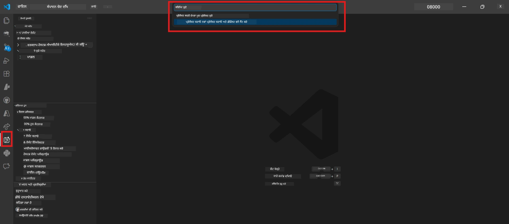
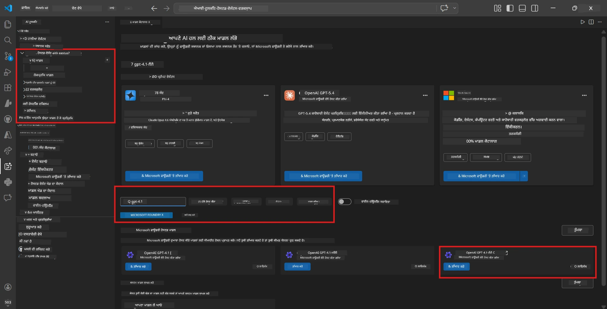
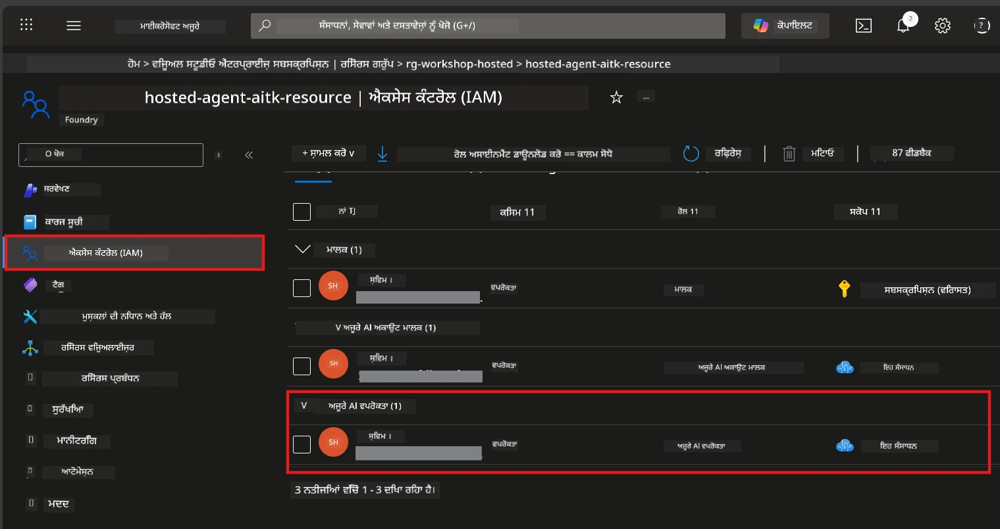

# Module 2 - ਇੱਕ Foundry ਪ੍ਰੋਜੈਕਟ ਬਣਾਓ ਅਤੇ ਮਾਡਲ ਤੈਨਾਤ ਕਰੋ

ਇਸ ਮੋਡੀਅਲ ਵਿੱਚ, ਤੁਸੀਂ ਇੱਕ ਮਾਇਕ੍ਰੋਸਾਫਟ Foundry ਪ੍ਰੋਜੈਕਟ ਬਣਾਉਂਦੇ (ਜਾਂ ਚੁਣਦੇ) ਹੋ ਅਤੇ ਇੱਕ ਮਾਡਲ ਤੈਨਾਤ ਕਰਦੇ ਹੋ ਜੋ ਤੁਹਾਡਾ ਏਜੰਟ ਵਰਤੇਗਾ। ਹਰ ਕਦਮ ਸਪੱਠ ਤਰੀਕੇ ਨਾਲ ਲਿਖਿਆ ਗਿਆ ਹੈ - ਉਨ੍ਹਾਂ ਨੂੰ ਕ੍ਰਮਬੱਧ ਤੌਰ ਤੇ ਫੋਲੋ ਕਰੋ।

> ਜੇ ਤੁਹਾਡੇ ਕੋਲ ਪਹਿਲਾਂ ਹੀ ਤੈਨਾਤ ਕੀਤਾ ਗਿਆ ਮਾਡਲ ਵਾਲਾ Foundry ਪ੍ਰੋਜੈਕਟ ਹੈ, ਤਾਂ [Module 3](03-create-hosted-agent.md) 'ਤੇ ਜਾਓ।

---

## ਕਦਮ 1: VS ਕੋਡ ਤੋਂ ਇੱਕ Foundry ਪ੍ਰੋਜੈਕਟ ਬਣਾਓ

ਤੁਸੀਂ ਮਾਇਕ੍ਰੋਸਾਫਟ Foundry ਐਕਸਟੈਂਸ਼ਨ ਵਰਤ ਕੇ ਬਿਨਾਂ VS ਕੋਡ ਤੋਂ ਬਾਹਰ ਗਏ ਪ੍ਰੋਜੈਕਟ ਬਣਾਓਗੇ।

1. `Ctrl+Shift+P` ਦਬਾ ਕੇ **Command Palette** ਖੋਲ੍ਹੋ।
2. ਟਾਈਪ ਕਰੋ: **Microsoft Foundry: Create Project** ਅਤੇ ਚੁਣੋ।
3. ਇੱਕ ਡ੍ਰਾਪਡਾਊਨ ਖੁੱਲਦਾ ਹੈ - ਆਪਣੀ **Azure ਸਬਸਕ੍ਰਿਪਸ਼ਨ** ਦੀ ਸੂਚੀ ਵਿੱਚੋਂ ਚੁਣੋ।
4. ਤੁਹਾਨੂੰ ਇੱਕ **resource group** ਚੁਣਨ ਜਾਂ ਬਣਾਉਣ ਲਈ ਪੁੱਛਿਆ ਜਾਵੇਗਾ:
   - ਨਵਾਂ ਬਣਾਉਣ ਲਈ: ਇੱਕ ਨਾਮ ਲਿਖੋ (ਉਦਾਹਰਣ ਵਜੋਂ, `rg-hosted-agents-workshop`) ਅਤੇ Enter ਦਬਾਓ।
   - ਮੌਜੂਦਾ ਵਿੱਚੋਂ ਵਰਤਣ ਲਈ: ਡ੍ਰਾਪਡਾਊਨ ਵਿਚੋਂ ਚੁਣੋ।
5. ਇੱਕ **Region** ਚੁਣੋ। **ਮਹੱਤਵਪੂਰਣ:** ਉਹ ਰੀਜਿਅਨ ਚੁਣੋ ਜੋ hosted agents ਦਾ ਸਮਰਥਨ ਕਰਦਾ ਹੈ। [Region availability](https://learn.microsoft.com/azure/foundry/agents/concepts/hosted-agents#region-availability) ਚੈੱਕ ਕਰੋ - ਆਮ ਚੋਣਾਂ ਹਨ `East US`, `West US 2`, ਜਾਂ `Sweden Central`.
6. Foundry ਪ੍ਰੋਜੈਕਟ ਲਈ ਇੱਕ **ਨਾਮ** ਦਿਓ (ਉਦਾਹਰਣ ਵਜੋਂ, `workshop-agents`)।
7. Enter ਦਬਾਓ ਅਤੇ provisioning ਦੇ ਖ਼ਤਮ ਹੋਣ ਦਾ ਇੰਤਜ਼ਾਰ ਕਰੋ।

> **Provisioning 2-5 ਮਿੰਟ ਲੈਂਦਾ ਹੈ।** ਤੁਸੀਂ VS ਕੋਡ ਦੇ ਹੇਠਲੇ ਸੱਜੇ ਕੋਨੇ ਵਿੱਚ ਪ੍ਰਗਤੀ ਸੂਚਨਾ ਦੇਖੋਗੇ। Provisioning ਦੌਰਾਨ VS ਕੋਡ ਨੂੰ ਬੰਦ ਨਾ ਕਰੋ।

8. ਜਦੋਂ ਮੁਕੰਮਲ ਹੋ ਜਾਵੇ, ਤਾਂ **Microsoft Foundry** ਸਾਈਡਬਰ ਵਿੱਚ ਤੁਹਾਡਾ ਨਵਾਂ ਪ੍ਰੋਜੈਕਟ **Resources** ਹੇਠ ਲਿਸਟ ਹੋਵੇਗਾ।
9. ਪ੍ਰੋਜੈਕਟ ਦੇ ਨਾਮ 'ਤੇ ਕਲਿੱਕ ਕਰੋ ਤਾ ਕਿ ਇਹ ਫੈਲ ਜਾਵੇ ਅਤੇ ਇਹ ਦੇਖੋ ਕਿ ਇਹ ਸ਼ਿਖੜੇ ਜਿਵੇਂ **Models + endpoints** ਅਤੇ **Agents** ਦਿਖਾ ਰਿਹਾ ਹੈ।



### ਵਿਕਲਪ: Foundry ਪੋਰਟਲ ਰਾਹੀਂ ਬਣਾਉਣਾ

ਜੇ ਤੁਸੀਂ ਬ੍ਰਾਊਜ਼ਰ ਵਰਤਣਾ ਪਸੰਦ ਕਰਦੇ ਹੋ:

1. [https://ai.azure.com](https://ai.azure.com) ਖੋਲ੍ਹੋ ਅਤੇ ਸਾਈਨ ਇਨ ਕਰੋ।
2. ਮੁੱਖ ਪੰਨਾ ਤੇ **Create project** 'ਤੇ ਕਲਿੱਕ ਕਰੋ।
3. ਪ੍ਰੋਜੈਕਟ ਨਾਮ ਦਿਓ, ਫਿਰ ਆਪਣੀ ਸਬਸਕ੍ਰਿਪਸ਼ਨ, ਰਿਸੋर्स ਗਰੂਪ ਅਤੇ ਰੀਜਿਅਨ ਚੁਣੋ।
4. **Create** 'ਤੇ ਕਲਿੱਕ ਕਰੋ ਅਤੇ provisioning ਦਾ ਇੰਤਜ਼ਾਰ ਕਰੋ।
5. ਬਣਨ ਤੋਂ ਬਾਅਦ, VS ਕੋਡ ਵਿੱਚ ਵਾਪਸ ਜਾਓ - ਪ੍ਰੋਜੈਕਟ Foundry ਸਾਈਡਬਰ ਵਿੱਚ ਰਿਫ੍ਰੈਸ਼ ਕਰਨ (refresh ਆਈਕਨ 'ਤੇ ਕਲਿੱਕ ਕਰੋ) ਤੋਂ ਬਾਅਦ ਦਰਸਾਏਗਾ।

---

## ਕਦਮ 2: ਇੱਕ ਮਾਡਲ ਤੈਨਾਤ ਕਰੋ

ਤੁਹਾਡੇ [hosted agent](https://learn.microsoft.com/azure/foundry/agents/concepts/hosted-agents) ਨੂੰ ਜਵਾਬ ਬਣਾਉਣ ਲਈ ਇੱਕ Azure OpenAI ਮਾਡਲ ਦੀ ਲੋੜ ਹੈ। ਤੁਸੀਂ ਹੁਣੇ ਇੱਕ [ਤੈਨਾਤ ਕਰੋ](https://learn.microsoft.com/azure/ai-foundry/openai/how-to/create-resource#deploy-a-model)।

1. `Ctrl+Shift+P` ਦਬਾ ਕੇ **Command Palette** ਖੋਲ੍ਹੋ।
2. ਟਾਈਪ ਕਰੋ: **Microsoft Foundry: Open [Model Catalog](https://learn.microsoft.com/azure/ai-foundry/openai/concepts/models)** ਅਤੇ ਚੁਣੋ।
3. Model Catalog ਵਿਊ VS ਕੋਡ ਵਿੱਚ ਖੁੱਲ੍ਹਦਾ ਹੈ। **gpt-4.1** ਲੱਭਣ ਲਈ ਖੋਜ ਬਾਰ ਵਰਤੋਂ ਜਾਂ ਬਰਾਊਜ਼ ਕਰੋ।
4. **gpt-4.1** ਮਾਡਲ ਕਾਰਡ (ਜਾਂ ਘੱਟ ਕਿਮਤ ਲਈ `gpt-4.1-mini`) 'ਤੇ ਕਲਿੱਕ ਕਰੋ।
5. **Deploy** 'ਤੇ ਕਲਿੱਕ ਕਰੋ।


6. ਡਿਪਲੌਇਮੈਂਟ ਕੰਫਿਗਰੇਸ਼ਨ ਵਿੱਚ:
   - **Deployment name**: ਡિફਾਲਟ (ਜਿਵੇਂ `gpt-4.1`) ਛੱਡੋ ਜਾਂ ਆਪਣਾ ਨਾਮ ਦਿਓ। **ਇਹ ਨਾਮ ਯਾਦ ਰੱਖੋ** - ਤੁਹਾਨੂੰ Module 4 ਵਿੱਚ ਲੋੜ ਪਵੇਗੀ।
   - **Target**: **Deploy to Microsoft Foundry** ਚੁਣੋ ਅਤੇ ਵਜੋਂ ਤਿਆਰ ਕੀਤਾ ਪ੍ਰੋਜੈਕਟ ਚੁਣੋ।
7. **Deploy** 'ਤੇ ਕਲਿੱਕ ਕਰੋ ਅਤੇ ਡਿਪਲੌਇਮੈਂਟ ਪੂਰਾ ਹੋਣ ਤੱਕ ਇੰਤਜ਼ਾਰ ਕਰੋ (1-3 ਮਿੰਟ)।

### ਮਾਡਲ ਚੁਣਨਾ

| ਮਾਡਲ | ਉੱਤਮ ਹੈ | ਲਾਗਤ | ਨੋਟਸ |
|-------|----------|------|-------|
| `gpt-4.1` | ਉੱਚ-ਗੁਣਵੱਤਾ, ਬਰੀਕੀ ਵਾਲੇ ਜਵਾਬ | ਵੱਧ | ਸਭ ਤੋਂ ਵਧੀਆ ਨਤੀਜੇ, ਅੰਤਮ ਟੈਸਟਿੰਗ ਲਈ ਸਿਫਾਰਸ਼ੀ |
| `gpt-4.1-mini` | ਤੇਜ਼ iteration, ਘੱਟ ਲਾਗਤ | ਘੱਟ | ਵਰਕਸ਼ਾਪ ਵਿਕਾਸ ਅਤੇ ਤੇਜ਼ ਟੈਸਟਿੰਗ ਲਈ ਚੰਗਾ |
| `gpt-4.1-nano` | ਹਲਕੇ ਕੰਮ | ਸਭ ਤੋਂ ਘੱਟ | ਸਭ ਤੋਂ ਘੱਟ ਲਾਗਤ ਵਾਲਾ, ਪਰ ਸਧਾਰਨ ਜਵਾਬ |

> **ਇਸ ਵਰਕਸ਼ਾਪ ਲਈ ਸਿਫਾਰਸ਼:** ਵਿਕਾਸ ਅਤੇ ਟੈਸਟਿੰਗ ਲਈ `gpt-4.1-mini` ਵਰਤੋਂ। ਇਹ ਤੇਜ਼, ਸਸਤਾ ਹੈ ਅਤੇ ਕੁਸ਼ਲਤਾਪੂਰਕ ਨਤੀਜੇ ਦਿੰਦਾ ਹੈ।

### ਮਾਡਲ ਡਿਪਲੌਇਮੈਂਟ ਚੈੱਕ ਕਰੋ

1. **Microsoft Foundry** ਸਾਈਡਬਰ ਵਿੱਚ ਆਪਣੇ ਪ੍ਰੋਜੈਕਟ ਨੂੰ ਖੋਲ੍ਹੋ।
2. **Models + endpoints** (ਜਾਂ ਸਮਾਨ ਸੈਕਸ਼ਨ) ਹੇਠ ਵੇਖੋ।
3. ਤੁਹਾਨੂੰ ਆਪਣਾ ਤੈਨਾਤ ਕੀਤਾ ਮਾਡਲ (ਜਿਵੇਂ `gpt-4.1-mini`) ਨਾਲ **Succeeded** ਜਾਂ **Active** ਸਥਿਤੀ ਨਾਲ ਵੇਖਣਾ ਚਾਹੀਦਾ ਹੈ।
4. ਮਾਡਲ ਡਿਪਲੌਇਮੈਂਟ 'ਤੇ ਕਲਿੱਕ ਕਰਕੇ ਇਸ ਦੇ ਵੇਰਵੇ ਵੇਖੋ।
5. ਇਹ ਦੋ ਮੁੱਲ ਨੋਟ ਕਰ ਲਵੋ - ਤੁਹਾਨੂੰ Module 4 ਵਿੱਚ ਇਹ ਲੋੜਹੀਂਗੇ:

   | ਸੈਟਿੰਗ | ਕਿੱਥੇ ਲੱਭਣਾ ਹੈ | ਉਦਾਹਰਣ ਮੁੱਲ |
   |---------|-----------------|---------------|
   | **Project endpoint** | Foundry ਸਾਈਡਬਰ ਵਿੱਚ ਪ੍ਰੋਜੈਕਟ ਨਾਮ 'ਤੇ ਕਲਿੱਕ ਕਰੋ। ਵੇਰਵਾ ਵਿਉ ਵਿੱਚ endpoint URL ਦਰਸਾਇਆ ਗਿਆ ਹੈ। | `https://<account>.services.ai.azure.com/api/projects/<project>` |
   | **Model deployment name** | ਤੈਨਾਤ ਕੀਤੇ ਮਾਡਲ ਦੇ ਨਾਲ ਦਿਖਾਇਆ ਗਿਆ ਨਾਮ। | `gpt-4.1-mini` |

---

## ਕਦਮ 3: ਲੋੜੀਂਦੇ RBAC ਰੋਲ ਅਸਾਈਨ ਕਰੋ

ਇਹ **ਸਭ ਤੋਂ ਆਮ ਗਲਤੀ ਵਾਲਾ ਕਦਮ** ਹੈ। ਸਹੀ ਰੋਲਾਂ ਦੇ ਬਿਨਾ, Module 6 ਵਿੱਚ ਡਿਪਲੌਇਮੈਂਟ ਅਸਫਲ ਰਹੇਗੀ ਕਿਉਂਕਿ अनुमति ਭੁੱਲ ਹੋਏਗੀ।

### 3.1 ਆਪਣੀਆਜ਼ੂਰੇ AI ਯੂਜ਼ਰ ਰੋਲ ਅਸਾਈਨ ਕਰੋ

1. ਬ੍ਰਾਊਜ਼ਰ ਖੋਲ੍ਹੋ ਅਤੇ [https://portal.azure.com](https://portal.azure.com) 'ਤੇ ਜਾਓ।
2. ਉੱਪਰਲੇ ਖੋਜ ਬਾਰ ਵਿੱਚ ਆਪਣੇ **Foundry ਪ੍ਰੋਜੈਕਟ** ਦਾ ਨਾਮ ਲਿਖੋ ਅਤੇ ਨਤੀਜਿਆਂ ਵਿੱਚ ਉਸ 'ਤੇ ਕਲਿੱਕ ਕਰੋ।
   - **ਮਹੱਤਵਪੂਰਣ:** ਸਿੱਧਾ **project** resource 'ਤੇ ਜਾਣ (ਟਾਈਪ: "Microsoft Foundry project"), ਨਾ ਕਿ ਮਾਤਰ ਮਾਤਾ ਖਾਤਾ/ਹਬ resource।
3. ਪ੍ਰੋਜੈਕਟ ਦੀ ਖੱਬੇ ਵੱਲੀ ਨੈਵੀਗੇਸ਼ਨ ਵਿੱਚ, **Access control (IAM)** 'ਤੇ ਕਲਿੱਕ ਕਰੋ।
4. ਉੱਪਰ **+ Add** ਬਟਨ 'ਤੇ ਕਲਿੱਕ ਕਰੋ → **Add role assignment** ਚੁਣੋ।
5. **Role** ਟੈਬ ਵਿੱਚ, [**Azure AI User**](https://learn.microsoft.com/azure/foundry/concepts/rbac-foundry#built-in-roles) ਲਈ ਖੋਜ ਕਰਕੇ ਇਸਨੂੰ ਚੁਣੋ। ਫਿਰ **Next** 'ਤੇ ਕਲਿੱਕ ਕਰੋ।
6. **Members** ਟੈਬ ਵਿੱਚ:
   - **User, group, or service principal** ਚੁਣੋ।
   - **+ Select members** 'ਤੇ ਕਲਿੱਕ ਕਰੋ।
   - ਆਪਣੇ ਨਾਮ ਜਾਂ ਈਮੇਲ ਲਈ ਖੋਜ ਕਰੋ, ਆਪਣੇ ਆਪ ਨੂੰ ਚੁਣੋ, ਅਤੇ **Select** ਕਲਿੱਕ ਕਰੋ।
7. **Review + assign** ਤੇ ਕਲਿੱਕ ਕਰੋ → ਫਿਰ ਪੁਸ਼ਟੀ ਲਈ ਫਿਰ ਵਾਰ **Review + assign** ਕਲਿੱਕ ਕਰੋ।



### 3.2 (ਵਿਕਲਪਿਤ) Azure AI Developer ਰੋਲ ਅਸਾਈਨ ਕਰੋ

ਜੇ ਤੁਹਾਨੂੰ ਪ੍ਰੋਜੈਕਟ ਵਿੱਚ ਹੋਰ ਰਿਸੋਸ ਬਣਾਉਣੇ ਹਨ ਜਾਂ ਡਿਪਲੌਇਮੈਂਟ ਨੂੰ ਪ੍ਰੋਗਰਾਮਿੰਗ ਤਰੀਕੇ ਨਾਲ ਮੈਨੇਜ ਕਰਨਾ ਹੈ:

1. ਉਪਰ ਦਿੱਤੇ ਕਦਮ ਦੁਹਰਾਓ, ਪਰ ਕਦਮ 5 ਵਿੱਚ **Azure AI Developer** ਚੁਣੋ।
2. ਇਹ ਰੋਲ **Foundry resource (account)** ਪੱਧਰ 'ਤੇ ਦਿਓ, ਸਿਰਫ ਪ੍ਰੋਜੈਕਟ ਪੱਧਰ 'ਤੇ ਨਹੀਂ।

### 3.3 ਆਪਣੇ ਰੋਲ ਅਸਾਈਨਮੈਂਟ ਦੀ ਪੁਸ਼ਟੀ ਕਰੋ

1. ਪ੍ਰੋਜੈਕਟ ਦੇ **Access control (IAM)** ਸਫ਼ੇ 'ਤੇ **Role assignments** ਟੈਬ 'ਤੇ ਕਲਿੱਕ ਕਰੋ।
2. ਆਪਣੇ ਨਾਮ ਦੀ ਖੋਜ ਕਰੋ।
3. ਤੁਹਾਨੂੰ ਘੱਟੋ-ਘੱਟ ਪ੍ਰੋਜੈਕਟ ਸਕੋਪ ਲਈ **Azure AI User** ਲਿਸਟ ਹੋਣਾ ਚਾਹੀਦਾ ਹੈ।

> **ਇਹ ਮਹੱਤਵਪੂਰਣ ਕਿਉਂ ਹੈ:** [`Azure AI User`](https://learn.microsoft.com/azure/foundry/concepts/rbac-foundry#built-in-roles) ਰੋਲ `Microsoft.CognitiveServices/accounts/AIServices/agents/write` ਡਾਟਾ ਐਕਸ਼ਨ ਦਿੰਦਾ ਹੈ। ਇਸਦੇ ਬਿਨਾ, ਡਿਪਲੌਇਮੈਂਟ ਦੌਰਾਨ ਤਰੁੱਟੀ ਆਵੇਗੀ:
>
> ```
> Error: lacks the required data action 
> Microsoft.CognitiveServices/accounts/AIServices/agents/write 
> to perform POST /api/projects/{projectName}/assistants operation.
> ```
>
> ਹੋਰ ਜਾਣਕਾਰੀ ਲਈ ਦੇਖੋ [Module 8 - Troubleshooting](08-troubleshooting.md)।

---

### ਚੈਕਪੋਇੰਟ

- [ ] Foundry ਪ੍ਰੋਜੈਕਟ ਮੌਜੂਦ ਹੈ ਅਤੇ Microsoft Foundry ਸਾਈਡਬਰ ਵਿੱਚ VS ਕੋਡ ਵਿੱਚ ਦਰਸਾਇਆ ਗਿਆ ਹੈ
- [ ] ਘੱਟੋ-ਘੱਟ ਇੱਕ ਮਾਡਲ ਤੈਨਾਤ ਕੀਤਾ ਹੋਇਆ ਹੈ (ਜਿਵੇਂ `gpt-4.1-mini`) ਜਿਸ ਦੀ ਸਥਿਤੀ **Succeeded** ਹੈ
- [ ] ਤੁਸੀਂ **project endpoint** URL ਅਤੇ **model deployment name** ਨੋਟ ਕੀਤੇ ਹਨ
- [ ] ਤੁਹਾਡੇ ਕੋਲ ਪ੍ਰੋਜੈਕਟ ਪੱਧਰ 'ਤੇ **Azure AI User** ਰੋਲ ਹੈ (Azure Portal → IAM → Role assignments 'ਚ ਵੈਰੀਫਾਈ ਕਰੋ)
- [ ] ਪ੍ਰੋਜੈਕਟ ਉਹ [supported region](https://learn.microsoft.com/azure/foundry/agents/concepts/hosted-agents#region-availability) ਵਿੱਚ ਹੈ ਜੋ hosted agents ਲਈ ਸਹਾਇਕ ਹੈ

---

**ਪਿਛਲਾ:** [01 - Install Foundry Toolkit](01-install-foundry-toolkit.md) · **ਅਗਲਾ:** [03 - Create a Hosted Agent →](03-create-hosted-agent.md)

---

<!-- CO-OP TRANSLATOR DISCLAIMER START -->
**ਜੇਖੜੀ ਨੋਟ**:  
ਇਹ ਦਸਤਾਵੇਜ਼ AI ਅਨੁਵਾਦ ਸੇਵਾ [Co-op Translator](https://github.com/Azure/co-op-translator) ਦੀ ਵਰਤੋਂ ਨਾਲ ਅਨੁਵਾਦ ਕੀਤਾ ਗਿਆ ਹੈ। ਜਦਾਕਿ ਅਸੀਂ ਸਹੀਤਾ ਲਈ ਕੋਸ਼ਿਸ਼ ਕਰਦੇ ਹਾਂ, ਕਿਰਪਾ ਕਰਕੇ ਧਿਆਨ ਦਿਓ ਕਿ ਸਵੈਚਾਲਿਤ ਅਨੁਵਾਦਾਂ ਵਿੱਚ ਗਲਤੀਆਂ ਜਾਂ ਅਣਧੁੰਦੀਆਂ ਹੋ ਸਕਦੀਆਂ ਹਨ। ਮੂਲ ਦਸਤਾਵੇਜ਼ ਇਸ ਦੀ ਮੂਲ ਭਾਸ਼ਾ ਵਿੱਚ ਅਥਾਰਟੀਟੇਟਿਵ ਸਰੋਤ ਮੰਨਿਆ ਜਾਣਾ ਚਾਹੀਦਾ ਹੈ। ਜਰੂਰੀ ਜਾਣਕਾਰੀ ਲਈ, ਪ੍ਰੋਫੈਸ਼ਨਲ ਮਾਨਵੀ ਅਨੁਵਾਦ ਦੀ ਸਿਫਾਰਸ਼ ਕੀਤੀ ਜਾਂਦੀ ਹੈ। ਅਸੀਂ ਇਸ ਅਨੁਵਾਦ ਦੀ ਵਰਤੋਂ ਤੋਂ ਉਤਪੰਨ ਕਿਸੇ ਵੀ ਗਲਤ ਸਮਝ ਜਾਂ ਗਲਤ ਵਿਆਖਿਆ ਲਈ ਜਿੰਮੇਵਾਰ ਨਹੀਂ ਹਾਂ।
<!-- CO-OP TRANSLATOR DISCLAIMER END -->