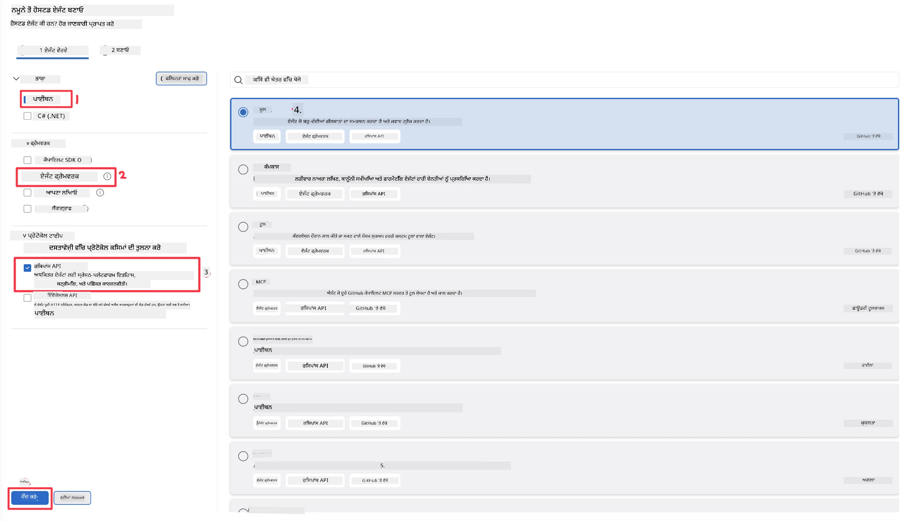
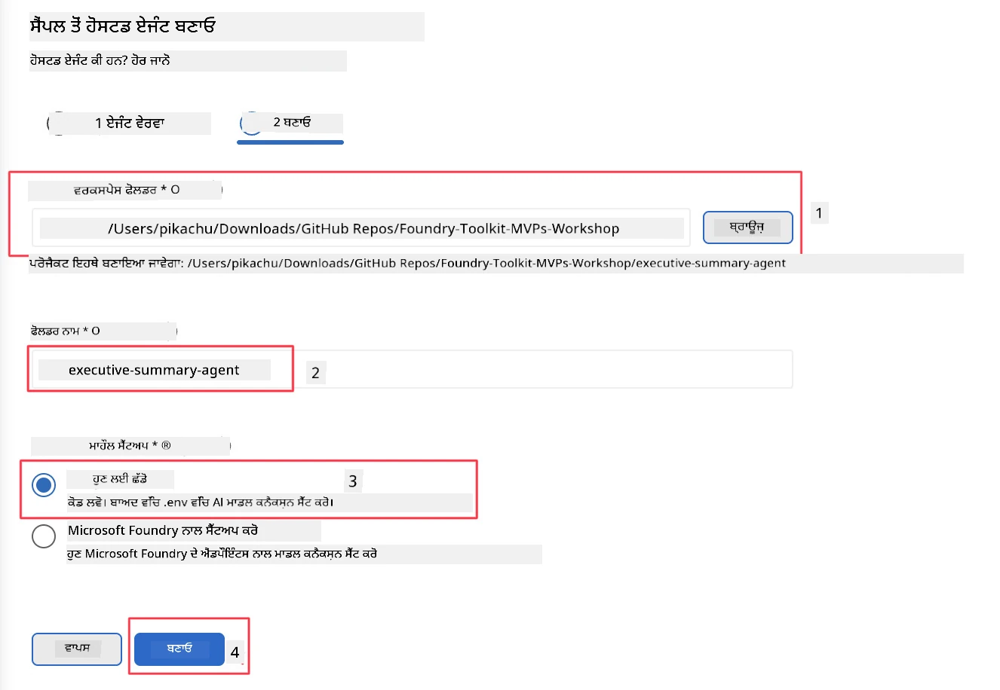

# ਮਾਡਿਊਲ 2 - ਨਵਾਂ ਹੋਸਟਡ ਏਜੰਟ ਬਣਾਓ

⏱️ ~5 ਮਿੰਟ

ਇਸ ਮਾਡਿਊਲ ਵਿੱਚ, ਤੁਸੀਂ Foundry Toolkit ਦੀ ਵਰਤੋਂ ਕਰਕੇ **ਹੋਸਟਡ ਏਜੰਟ ਪ੍ਰੋਜੈਕਟ ਲਈ ਸਕੈਫੋਲਡ ਬਣਾਉਂਦੇ ਹੋ**। ਸਕੈਫੋਲਡ ਪੂਰਾ ਪ੍ਰੋਜੈਕਟ ਢਾਂਚਾ ਤਿਆਰ ਕਰਦਾ ਹੈ - `agent.yaml`, `main.py`, `Dockerfile`, `requirements.txt`, ਅਤੇ VS ਕੋਡ ਡੀਬੱਗ ਸੰਰਚਨਾ - ਤਾਂ ਜੋ ਤੁਸੀਂ ਏਜੰਟ ਦੇ ਵਿਹਾਰ ਨੂੰ ਵਿਅਕਤੀਗਤ ਕਰਨ 'ਤੇ ਧਿਆਨ ਕੇਂਦਰਿਤ ਕਰ ਸਕੋ।

> **ਮੁੱਖ ਧਾਰਣਾ:** ਇਸ ਲੈਬ ਵਿੱਚ `agent/` ਫੋਲਡਰ Foundry Toolkit ਦੁਆਰਾ ਉਤਪੰਨ ਕੀਤੇ ਗਏ ਉਦਾਹਰਣ ਵਜੋਂ ਹੈ। ਤੁਸੀਂ ਇਹ ਫਾਇਲਾਂ ਸ਼ੁਰੂ ਤੋਂ ਨਹੀਂ ਲਿਖਦੇ।

### ਸਕੈਫੋਲਡ ਵਿਜ਼ਾਰਡ ਫਲੋ


---

## ਕਦਮ 1: Create Hosted Agent ਵਿਜ਼ਾਰਡ ਖੋਲ੍ਹੋ

1. **ਕਮਾਂਡ ਪੈਲੀਟ** ਖੋਲ੍ਹਣ ਲਈ `Ctrl+Shift+P` ਦਬਾਓ।
2. ਲਿਖੋ: **Foundry Toolkit: Create new Hosted Agent** ਅਤੇ ਇਸ ਨੂੰ ਚੁਣੋ।

> **ਵਿਕਲਪਿਕ: Foundry ਪੋਰਟਲ ਰਾਹੀਂ ਬਣਾਓ**
> ਜੇ ਤੁਸੀਂ ਬ੍ਰਾਊਜ਼ਰ ਦੀ ਵਰਤੋਂ ਕਰਨਾ ਚਾਹੁੰਦੇ ਹੋ ਤਾਂ ਆਪਣੇ ਪ੍ਰੋਜੈਕਟ ਨੂੰ [https://ai.azure.com](https://ai.azure.com) 'ਤੇ ਬਣਾਓ। ਜਦ ਪ੍ਰੋਜੈਕਟ ਤਿਆਰ ਹੋ ਜਾਵੇ, ਤਦ VS ਕੋਡ ਵਿਚ ਵਾਪਸ ਆਓ ਅਤੇ **Foundry Toolkit** ਸਾਈਡਬਾਰ ਦੀ ਵਰਤੋਂ ਕਰਕੇ ਇਸ ਨਾਲ ਜੁੜੋ।

> **ਵਿਕਲਪਿਕ:** Foundry Toolkit ਸਾਈਡਬਾਰ ਵਿੱਚ **Hosted Agents (Preview)** ਦੇ ਕੋਲ **+** ਆਈਕਨ 'ਤੇ ਕਲਿੱਕ ਕਰੋ।

## ਕਦਮ 2: ਸੈਟਿੰਗਜ਼ ਚੁਣੋ



1. ਖੱਬੇ ਤੇ ਨੈਵੀਗੇਸ਼ਨ/ਵਿਕਲਪ ਸੈਕਸ਼ਨ ਵਿੱਚ ਹੇਠ ਲਿਖੇ ਚੁਣੋ:

| ਮੈਨੂ | ਚੋਣ | ਨੋਟਸ |
|--------|-----------|-------|
| **ਭਾਸ਼ਾ** | Python | C# ਵੀ ਸਮਰਥਿਤ |
| **ਫ੍ਰੇਮਵਰਕ** | Agent Framework | Agent Framework SDK ਦੀ ਵਰਤੋਂ ਕਰਕੇ ਸਧਾਰਣ ਸ਼ੁਰੂਆਤ |
| **API ਕਿਸਮ** | Response API | `POST /responses` - ਸਾਂਝੀ ਵਾਤਾਵਰਣ, ਪਲੇਟਫਾਰਮ ਦੁਆਰਾ ਪ੍ਰਬੰਧਤ ਇਤਿਹਾਸ ਸਮੇਤ |
| **ਟੈਮਪਲੇਟ** | Basic | Agent Framework SDK ਦੀ ਵਰਤੋਂ ਕਰਕੇ ਸਧਾਰਣ ਸ਼ੁਰੂਆਤ |

2. ਚੁਣਨ ਮਗਰੋਂ, **Next** 'ਤੇ ਕਲਿੱਕ ਕਰੋ



3. ਅਗਲੇ ਵਿੰਡੋ ਵਿੱਚ, ਹੇਠ ਲਿਖਿਆਂ ਨੂੰ ਚੁਣੋ:

| ਮੈਨੂ | ਚੋਣ | ਨੋਟਸ |
|--------|-----------|-------|
| **ਵਰਕਸਪੇਸ ਫੋਲਡਰ** | ਇੱਕ ਟਾਰਗਟ ਫੋਲਡਰ ਚੁਣੋ | ਜਿਵੇਂ: `/workspace/Foundry_Toolkit_for_VSCode_Lab/` ਜਾਂ ਇਸ ਰਿਪੋ ਵਿੱਚ ਕੋਈ ਸਬਫੋਲਡਰ |
| **ਏਜੰਟ ਨਾਮ** | ਨਾਮ ਦਰਜ ਕਰੋ | ਜਿਵੇਂ: `executive-summary-agent` |
| **ਵਾਤਾਵਰਣ ਸੈਟਅੱਪ** | ਸੈਟਅੱਪ ਲਈ ਅਜੇ ਛੱਡੋ |  |

ਸਾਡਾ ਏਜੰਟ ਬਣਾਉਣ ਲਈ **create** 'ਤੇ ਕਲਿੱਕ ਕਰੋ। ਇੱਕ ਨਵਾਂ ਫੋਲਡਰ ਹੋਸਟਡ ਏਜੰਟ ਦੇ ਨਾਮ ਦੇ ਨਾਲ ਬਣਾਇਆ ਜਾਵੇਗਾ।

## ਕਦਮ 3: ਤਿਆਰ ਕੀਤੇ ਪ੍ਰੋਜੈਕਟ ਦੀ ਜਾਂਚ ਕਰੋ

ਸਕੈਫੋਲਡਿੰਗ ਪੂਰੀ ਹੋਣ ਦੇ ਬਾਅਦ, Explorer (`Ctrl+Shift+E`) ਵਿੱਚ ਇਹ ਫਾਇਲਾਂ ਵੇਖੋ:

```
📂 my-agent/
├── .env                ← Environment variables (placeholders)
├── .vscode/
│   ├── launch.json     ← Debug config (F5 → run + Agent Inspector)
│   └── tasks.json      ← VS Code task definitions
├── agent.yaml          ← Agent definition (kind: hosted)
├── Dockerfile          ← Container config for deployment
├── main.py             ← Agent entry point (your main code)
└── requirements.txt    ← Python dependencies
```

### ਮੁੱਖ ਫਾਇਲਾਂ ਦੀ ਵਿਆਖਿਆ

| ਫਾਇਲ | ਮਕਸਦ |
|------|---------|
| `agent.yaml` | ਏਜੰਟ ਨੂੰ `kind: hosted` ਵਜੋਂ ਐਲਾਨ ਕਰਦਾ ਹੈ, ਵਾਤਾਵਰਣ ਵੈਰੀਏਬਲ ਮੈਪ ਕਰਦਾ ਹੈ, `/responses` ਪ੍ਰੋਟੋਕੋਲ ਲੱਖਦਾ ਹੈ |
| `main.py` | `FoundryChatClient` ਬਣਾਉਂਦਾ ਹੈ → ਇਸਨੂੰ `Agent` ਵਿੱਚ ਲੈ ਕੇ ਇੰਸਟ੍ਰਕਸ਼ਨ ਦੇਣਦਾ ਹੈ → `ResponsesHostServer` ਰਾਹੀਂ ਪੋਰਟ 8088 'ਤੇ ਸੇਵਾ ਦਿੰਦਾ ਹੈ |
| `Dockerfile` | `python:3.12-slim` ਦੀ ਵਰਤੋਂ ਕਰਦਾ ਹੈ, ਡਿਪੈਂਡੇਂਸੀਜ਼ ਇੰਸਟਾਲ ਕਰਦਾ ਹੈ, ਪੋਰਟ 8088 ਖੋਲ੍ਹਦਾ ਹੈ, `main.py` ਚਲਾਉਂਦਾ ਹੈ |
| `requirements.txt` | `agent-framework-foundry`, `agent-framework-foundry-hosting`, `mcp`, `debugpy` |

> **ਮਹੱਤਵਪੂਰਣ:** VS ਕੋਡ ਵਿੱਚ ਸਕੈਫੋਲਡ ਕੀਤਾ ਹੋਇਆ ਏਜੰਟ ਫੋਲਡਰ (ਪ੍ਰਤੀਕਾਤਮਕ ਤੌਰ 'ਤੇ `agent/` ਫੋਲਡਰ) ਸਿੱਧਾ ਖੋਲ੍ਹੋ ਤਾਂ ਜੋ `.vscode/launch.json` ਅਤੇ `tasks.json` F5 ਡੀਬੱਗਿੰਗ ਲਈ ਠੀਕ ਤਰ੍ਹਾਂ ਕੰਮ ਕਰਨ।

---

### ✅ ਚੈਕਪੋਇੰਟ

- [ ] ਸਕੈਫੋਲਡ ਪ੍ਰੋਜੈਕਟ ਸਾਰੇ ਉਮੀਦ ਵਰਗੇ ਫਾਇਲਾਂ ਨਾਲ ਬਣਾਇਆ ਗਿਆ
- [ ] `agent.yaml` ਵਿੱਚ `kind: hosted` ਅਤੇ `protocol: responses` ਦਿਖਦਾ ਹੈ
- [ ] `main.py` ਵਿੱਚ `Agent`, `FoundryChatClient`, `ResponsesHostServer` ਇੰਪੋਰਟ ਕੀਤੇ ਗਏ ਹਨ
- [ ] ਏਜੰਟ ਫੋਲਡਰ VS ਕੋਡ ਵਿੱਚ ਵਰਕਸਪੇਸ ਰੂਟ ਵਜੋਂ ਖੁਲਾ ਹੋਇਆ ਹੈ

---

**ਪਿਛਲਾ:** [01 - Setup](01-setup.md) · **ਅਗਲਾ:** [03 - Configure & Code →](03-configure-and-code.md)

---

<!-- CO-OP TRANSLATOR DISCLAIMER START -->
**ਅਸਵੀਕਾਰੋਪਣ**:
ਇਸ ਦਸਤਾਵੇਜ਼ ਦਾ ਅਨੁਵਾਦ ਏਆਈ ਅਨੁਵਾਦ ਸੇਵਾ [Co-op Translator](https://github.com/Azure/co-op-translator) ਦੀ ਵਰਤੋਂ ਕਰਕੇ ਕੀਤਾ ਗਿਆ ਹੈ। ਜਦੋਂ ਕਿ ਅਸੀਂ ਸਹੀਤਾਵਾਂ ਲਈ ਯਤਨਸ਼ੀਲ ਹਾਂ, ਕਿਰਪਾ ਕਰਕੇ ਧਿਆਨ ਰੱਖੋ ਕਿ ਸਵੈਚਾਲਿਤ ਅਨੁਵਾਦਾਂ ਵਿੱਚ ਗਲਤੀਆਂ ਜਾਂ ਅਸਮੱਤਿਆਵਾਂ ਹੋ ਸਕਦੀਆਂ ਹਨ। ਮੂਲ ਦਸਤਾਵੇਜ਼ ਆਪਣੀ ਮੂਲ ਭਾਸ਼ਾ ਵਿੱਚ ਅਧਿਕਾਰਕ ਸਰੋਤ ਮੰਨਿਆ ਜਾਣਾ ਚਾਹੀਦਾ ਹੈ। ਜਰੂਰੀ ਜਾਣਕਾਰੀ ਲਈ, ਪੇਸ਼ੇਵਰ ਮਨੁੱਖੀ ਅਨੁਵਾਦ ਦੀ ਸਿਫ਼ਾਰਸ਼ ਕੀਤੀ ਜਾਂਦੀ ਹੈ। ਅਸੀਂ ਇਸ ਅਨੁਵਾਦ ਦੇ ਉਪਯੋਗ ਤੋਂ ਪੈਦਾ ਹੋਣ ਵਾਲੀਆਂ ਕਿਸੇ ਵੀ ਗਲਤਫਹਿਮੀਆਂ ਜਾਂ ਗਲਤ ਵਿਆਖਿਆਵਾਂ ਲਈ ਜਵਾਬਦੇਹ ਨਹੀਂ ਹਾਂ।
<!-- CO-OP TRANSLATOR DISCLAIMER END -->