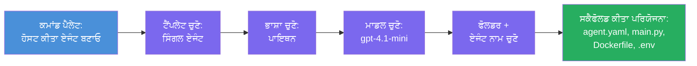

# Module 3 - ਨਵਾਂ ਹੋਸਟ ਕੀਤਾ ਏਜੰਟ ਬਣਾਓ (Foundry ਐਕਸਟੈਂਸ਼ਨ ਦੁਆਰਾ ਆਟੋ-ਸਕੈਫੋਲਡ ਕੀਤਾ ਗਿਆ)

ਇਸ ਮਾਡਿਊਲ ਵਿੱਚ, ਤੁਸੀਂ Microsoft Foundry ਐਕਸਟੈਂਸ਼ਨ ਦੀ ਵਰਤੋਂ ਕਰਕੇ **ਨਵਾਂ [ਹੋਸਟ ਕੀਤਾ ਏਜੰਟ](https://learn.microsoft.com/azure/foundry/agents/concepts/hosted-agents) ਪ੍ਰੋਜੈਕਟ ਸਕੈਫੋਲਡ ਕਰਦੇ ਹੋ**। ਐਕਸਟੈਂਸ਼ਨ ਤੁਹਾਡੇ ਲਈ ਪੂਰੀ ਪ੍ਰੋਜੈਕਟ ਸਟ੍ਰਕਚਰ ਪੈਦਾ ਕਰਦਾ ਹੈ - ਜਿਸ ਵਿੱਚ `agent.yaml`, `main.py`, `Dockerfile`, `requirements.txt`, ਇੱਕ `.env` ਫਾਈਲ, ਅਤੇ ਇੱਕ VS Code ਡੀਬੱਗ ਸੰਰਚਨਾ ਸ਼ਾਮਿਲ ਹੈ। ਸਕੈਫੋਲਡਿੰਗ ਤੋਂ ਬਾਅਦ, ਤੁਸੀਂ ਇਹਨਾਂ ਫਾਈਲਾਂ ਨੂੰ ਆਪਣੇ ਏਜੰਟ ਦੀਆਂ ਹਦਾਇਤਾਂ, ਟੂਲਾਂ ਅਤੇ ਸੰਰਚਨਾ ਨਾਲ ਕਸਟਮਾਈਜ਼ ਕਰਦੇ ਹੋ।

> **ਮੁੱਖ ਸੰਕਲਪ:** ਇਸ ਲੈਬ ਵਿੱਚ `agent/` ਫੋਲਡਰ ਉਹ ਉਦਾਹਰਨ ਹੈ ਜੋ Foundry ਐਕਸਟੈਂਸ਼ਨ ਇਸ ਸਕੈਫੋਲਡ ਕਮਾਂਡ ਨੂੰ ਚਲਾਉਣ ਤੇ ਪੈਦਾ ਕਰਦਾ ਹੈ। ਤੁਸੀਂ ਇਹਨਾਂ ਫਾਈਲਾਂ ਨੂੰ ਸਿਰੇ ਤੋਂ ਨਹੀਂ ਲਿਖਦੇ - ਐਕਸਟੈਂਸ਼ਨ ਇਹਨਾਂ ਨੂੰ ਬਣਾਉਂਦਾ ਹੈ, ਫਿਰ ਤੁਸੀਂ ਉਨ੍ਹਾਂ ਨੂੰ ਸੋਧਦੇ ਹੋ।

### ਸਕੈਫੋਲਡ ਵਿਜ਼ਾਰਡ ਪ੍ਰਵਾਹ


---

## ਕਦਮ 1: Create Hosted Agent ਵਿਜ਼ਾਰਡ ਖੋਲ੍ਹੋ

1. **Command Palette** ਖੋਲ੍ਹਣ ਲਈ `Ctrl+Shift+P` ਦਬਾਓ।  
2. ਟਾਈਪ ਕਰੋ: **Microsoft Foundry: Create a New Hosted Agent** ਅਤੇ ਚੁਣੋ।  
3. ਹੋਸਟ ਕੀਤਾ ਏਜੰਟ ਬਣਾਉਣ ਵਾਲਾ ਵਿਜ਼ਾਰਡ ਖੁਲ ਜਾਵੇਗਾ।

> **ਵਿਕਲਪਿਕ ਰਸਤਾ:** ਤੁਸੀਂ Microsoft Foundry ਸਾਈਡਬਾਅਰ → **Agents** ਦੇ ਕੋਲ **+** ਆਈਕਾਨ 'ਤੇ ਕਲਿਕ ਕਰਕੇ ਜਾਂ ਰਾਈਟ-ਕਲਿਕ ਕਰਕੇ ਅਤੇ **Create New Hosted Agent** ਚੁਣ ਕੇ ਵੀ ਇਹ ਵਿਜ਼ਾਰਡ ਪ੍ਰਾਪਤ ਕਰ ਸਕਦੇ ਹੋ।

---

## ਕਦਮ 2: ਆਪਣਾ ਟੈਮਪਲੇਟ ਚੁਣੋ

ਵਿਜ਼ਾਰਡ ਤੁਹਾਨੂੰ ਇੱਕ ਟੈਮਪਲੇਟ ਚੁਣਨ ਲਈ ਪੁੱਛਦਾ ਹੈ। ਤੁਸੀਂ ਇਹ ਵਿਕਲਪ ਦੇਖੋਗੇ:

| ਟੈਮਪਲੇਟ | ਵੇਰਵਾ | ਕਦੋਂ ਵਰਤਣਾ ਹੈ |
|----------|--------|----------------|
| **Single Agent** | ਇੱਕ ਏਜੰਟ ਆਪਣਾ ਮਾਡਲ, ਹਦਾਇਤਾਂ, ਅਤੇ ਵਿਕਲਪਿਕ ਟੂਲਾਂ ਨਾਲ | ਇਹ ਵਰਕਸ਼ਾਪ (Lab 01) |
| **Multi-Agent Workflow** | ਕਈ ਏਜੰਟ ਜੋ ਕ੍ਰਮਵਾਰ ਸਹਿਯੋਗ ਕਰਦੇ ਹਨ | Lab 02 |

1. **Single Agent** ਚੁਣੋ।  
2. **Next** 'ਤੇ ਕਲਿੱਕ ਕਰੋ (ਜਾਂ ਚੋਣ ਆਪਣੇ ਆਪ ਅੱਗੇ ਵਧ ਜਾਂਦੀ ਹੈ)।

---

## ਕਦਮ 3: ਪ੍ਰੋਗ੍ਰਾਮਿੰਗ ਭਾਸ਼ਾ ਚੁਣੋ

1. **Python** ਚੁਣੋ (ਇਸ ਵਰਕਸ਼ਾਪ ਲਈ ਸਿਫਾਰਸ਼ੀ)।  
2. **Next** 'ਤੇ ਕਲਿੱਕ ਕਰੋ।

> **C# ਵੀ ਸਮਰਥਿਤ ਹੈ** ਜੇ ਤੁਸੀਂ .NET ਨੂੰ ਪਸੰਦ ਕਰਦੇ ਹੋ। ਸਕੈਫੋਲਡ ਸਟ੍ਰਕਚਰ ਇਸੇ ਤਰ੍ਹਾਂ ਹੈ (ਜਿਸ ਵਿੱਚ `main.py` ਦੀ ਜਗ੍ਹਾ `Program.cs` ਵਰਤੀ ਜਾਂਦੀ ਹੈ)।

---

## ਕਦਮ 4: ਆਪਣਾ ਮਾਡਲ ਚੁਣੋ

1. ਵਿਜ਼ਾਰਡ ਤੁਹਾਡੇ Foundry ਪ੍ਰੋਜੈਕਟ (ਮਾਡਿਊਲ 2 ਤੋਂ) ਵਿੱਚ ਡਿਪਲੌਏ ਕੀਤੇ ਮਾਡਲ ਦਿਖਾਉਂਦਾ ਹੈ।  
2. ਉਸ ਮਾਡਲ ਨੂੰ ਚੁਣੋ ਜੋ ਤੁਸੀਂ ਡਿਪਲੌਏ ਕੀਤਾ ਸੀ - ਉਦਾਹਰਨ ਵਜੋਂ, **gpt-4.1-mini**।  
3. **Next** 'ਤੇ ਕਲਿੱਕ ਕਰੋ।

> ਜੇ ਕੋਈ ਮਾਡਲ ਨਹੀਂ ਦਿੱਸਦੇ, ਤਾਂ ਵਾਪਸ [ਮਾਡਿਊਲ 2](02-create-foundry-project.md) ਤੇ ਜਾ ਕੇ ਪਹਿਲਾਂ ਇੱਕ ਨੂੰ ਡਿਪਲੌਏ ਕਰੋ।

---

## ਕਦਮ 5: ਫੋਲਡਰ ਸਥਾਨ ਅਤੇ ਏਜੰਟ ਨਾਮ ਚੁਣੋ

1. ਇੱਕ ਫਾਈਲ ਡਾਇਲਾਗ ਖੁਲਦਾ ਹੈ - ਕਦੇ **ਲਕੜੀ ਵਾਲਾ ਫੋਲਡਰ** ਚੁਣੋ ਜਿੱਥੇ ਪ੍ਰੋਜੈਕਟ ਬਣਾਇਆ ਜਾਵੇਗਾ। ਇਸ ਵਰਕਸ਼ਾਪ ਲਈ:  
   - ਨਵੀਂ ਸ਼ੁਰੂਆਤ ਕਰ ਰਹੇ ਹੋ: ਕੋਈ ਵੀ ਫੋਲਡਰ ਚੁਣੋ (ਜਿਵੇਂ, `C:\Projects\my-agent`)  
   - ਵਰਕਸ਼ਾਪ ਰੈਪੋ ਵਿੱਚ ਕੰਮ ਕਰ ਰਹੇ ਹੋ: `workshop/lab01-single-agent/agent/` ਹੇਠ ਨਵਾਂ ਸਬਫੋਲਡਰ ਬਣਾਓ  
2. ਹੋਸਟ ਕੀਤਾ ਏਜੰਟ ਲਈ ਇੱਕ **ਨਾਮ** ਦਿਓ (ਜਿਵੇਂ, `executive-summary-agent` ਜਾਂ `my-first-agent`)।  
3. **Create** 'ਤੇ ਕਲਿੱਕ ਕਰੋ (ਜਾਂ Enter ਦਬਾਓ)।

---

## ਕਦਮ 6: ਸਕੈਫੋਲਡਿੰਗ ਪੂਰੀ ਹੋਣ ਦੀ ਉਡੀਕ ਕਰੋ

1. VS Code ਇੱਕ **ਨਵੀਂ ਵਿੰਡੋ** ਖੋਲ੍ਹਦਾ ਹੈ ਜਿਸ ਵਿੱਚ ਸਕੈਫੋਲਡ ਕੀਤਾ ਗਿਆ ਪ੍ਰੋਜੈਕਟ ਹੁੰਦਾ ਹੈ।  
2. ਪ੍ਰੋਜੈਕਟ ਪੂਰੀ ਤਰ੍ਹਾਂ ਲੋਡ ਹੋਣ ਲਈ ਕੁਝ ਸਕਿੰਟਾਂ ਦੀ ਉਡੀਕ ਕਰੋ।  
3. ਤੁਹਾਨੂੰ Explorer ਪੈਨਲ (`Ctrl+Shift+E`) ਵਿੱਚਆਂ ਫਾਈਲਾਂ ਵਿਖਾਈ ਦੇਣਗੀਆਂ:

```
📂 my-first-agent/
├── .env                ← Environment variables (auto-generated with placeholders)
├── .vscode/
│   └── launch.json     ← Debug configuration (F5 to run + Agent Inspector)
├── agent.yaml          ← Agent definition (kind: hosted)
├── Dockerfile          ← Container configuration for deployment
├── main.py             ← Agent entry point (your main code file)
└── requirements.txt    ← Python dependencies
```

> **ਇਹ ਇਸ ਲੈਬ ਵਿੱਚ `agent/` ਫੋਲਡਰ ਨਾਲੋ ਹੀ ਸਟ੍ਰਕਚਰ ਹੈ।** Foundry ਐਕਸਟੈਂਸ਼ਨ ਇਹ ਫਾਈਲਾਂ ਆਪਣੇ ਆਪ ਪੈਦਾ ਕਰਦਾ ਹੈ - ਤੁਹਾਨੂੰ ਇਹ ਮੈਨੂਅਲੀ ਬਣਾਉਣ ਦੀ ਕੋਈ ਲੋੜ ਨਹੀਂ।

> **ਵਰਕਸ਼ਾਪ ਨੋਟ:** ਇਸ ਵਰਕਸ਼ਾਪ ਰੈਪੋ ਵਿੱਚ, `.vscode/` ਫੋਲਡਰ **ਵਰਕਸਪੇਸ ਦੇ ਰੂਟ** 'ਤੇ ਹੈ (ਹਰ ਪ੍ਰੋਜੈਕਟ ਦੇ ਅੰਦਰ ਨਹੀਂ). ਇਸ ਵਿੱਚ ਇੱਕ ਸਾਂਝਾ `launch.json` ਅਤੇ `tasks.json` ਹਨ ਜਿਨ੍ਹਾਂ ਵਿੱਚ ਦੋ ਡੀਬੱਗ ਸੰਰਚਨਾਵਾਂ - **"Lab01 - Single Agent"** ਅਤੇ **"Lab02 - Multi-Agent"** - ਹਰ ਇੱਕ ਸਹੀ ਲੈਬ ਦੇ `cwd` ਦੀ ਨੁਸਖਾ ਹੈ। ਜਦੋਂ ਤੁਸੀਂ F5 ਦਬਾਉਂਦੇ ਹੋ, ਡ੍ਰਾਪਡਾਊਨ ਤੋਂ ਆਪਣਾ ਕੰਮ ਕਰ ਰਹੇ ਲੈਬ ਅਨੁਕੂਲ ਸੰਰਚਨਾ ਚੁਣੋ।

---

## ਕਦਮ 7: ਹਰ ਬਨਾਈ ਹੋਈ ਫਾਈਲ ਨੂੰ ਸਮਝੋ

ਕੋਈ ਸਮਾਂ ਲਓ ਅਤੇ ਵਿਜ਼ਾਰਡ ਦੁਆਰਾ ਬਣਾਈ ਹਰ ਫਾਈਲ ਨੂੰ ਵੇਖੋ। ਇਹ ਸਮਝਣਾ Module 4 (ਕਸਟਮਾਈਜ਼ੇਸ਼ਨ) ਲਈ ਜ਼ਰੂਰੀ ਹੈ।

### 7.1 `agent.yaml` - ਏਜੰਟ ਦੀ ਪਰਿਭਾਸ਼ਾ

`agent.yaml` ਖੋਲ੍ਹੋ। ਇਹ ਇੰਜ ਲੱਗਦਾ ਹੈ:

```yaml
# yaml-language-server: $schema=https://raw.githubusercontent.com/microsoft/AgentSchema/refs/heads/main/schemas/v1.0/ContainerAgent.yaml

kind: hosted
name: my-first-agent
description: >
  A hosted agent deployed to Microsoft Foundry Agent Service.
metadata:
  authors:
    - Microsoft
  tags:
    - Azure AI AgentServer
    - Microsoft Agent Framework
    - Hosted Agent
protocols:
  - protocol: responses
    version: v1
environment_variables:
  - name: AZURE_AI_PROJECT_ENDPOINT
    value: ${PROJECT_ENDPOINT}
  - name: AZURE_AI_MODEL_DEPLOYMENT_NAME
    value: ${MODEL_DEPLOYMENT_NAME}
dockerfile_path: Dockerfile
resources:
  cpu: '0.25'
  memory: 0.5Gi
```

**ਮੁੱਖ ਖੇਤਰ:**

| ਖੇਤਰ | ਮਕਸਦ |
|-------|-------|
| `kind: hosted` | ਇਹ ਦੱਸਦਾ ਹੈ ਕਿ ਇਹ ਇੱਕ ਹੋਸਟ ਕੀਤਾ ਏਜੰਟ ਹੈ (ਕੰਟੇਨਰ-ਅਧਾਰਤ, [Foundry Agent Service](https://learn.microsoft.com/azure/foundry/agents/overview) ਨੂੰ ਡਿਪਲੌਏ ਕੀਤਾ ਗਿਆ) |
| `protocols: responses v1` | ਏਜੰਟ OpenAI-ਕੰਪੈਟਿਬਲ `/responses` HTTP ਐਂਡਪોઈਂਟ ਪ੍ਰਦਾਨ ਕਰਦਾ ਹੈ |
| `environment_variables` | `.env` ਦੀਆਂ ਵੈਲਯੂਜ਼ ਨੂੰ ਡਿਪਲੌਯਮੈਂਟ ਸਮੇਂ ਕੰਟੇਨਰ env vars ਨਾਲ ਮੈਪ ਕਰਦਾ ਹੈ |
| `dockerfile_path` | ਕੰਟੇਨਰ ਇਮੇਜ ਬਣਾਉਣ ਲਈ Dockerfile ਦੀ ਸਥਿਤੀ ਦਿਖਾਉਂਦਾ ਹੈ |
| `resources` | ਕੰਟੇਨਰ ਲਈ CPU ਅਤੇ ਮੈਮੋਰੀ ਅਲਾਟਮੈਂਟ (0.25 CPU, 0.5Gi ਮੈਮੋਰੀ) |

### 7.2 `main.py` - ਏਜੰਟ ਐਂਟਰੀ ਪੋਇੰਟ

`main.py` ਖੋਲ੍ਹੋ। ਇਹ ਮੁੱਖ ਪਾਇਥਨ ਫਾਈਲ ਹੈ ਜਿੱਥੇ ਤੁਹਾਡਾ ਏਜੰਟ ਲਾਜਿਕ ਹੈ। ਸਕੈਫੋਲਡ ਵਿੱਚ ਸ਼ਾਮਲ ਹਨ:

```python
from agent_framework.azure import AzureAIAgentClient
from azure.ai.agentserver.agentframework import from_agent_framework
from azure.identity.aio import DefaultAzureCredential
```

**ਮੁੱਖ ਇੰਪੋਰਟਸ:**

| ਇੰਪੋਰਟ | ਮਕਸਦ |
|---------|-------|
| `AzureAIAgentClient` | ਤੁਹਾਡੇ Foundry ਪ੍ਰੋਜੈਕਟ ਨਾਲ ਕਨੈਕਟ ਕਰਦਾ ਅਤੇ `.as_agent()` ਰਾਹੀਂ ਏਜੰਟ ਬਣਾਂਦਾ ਹੈ |
| [`DefaultAzureCredential`](https://learn.microsoft.com/azure/developer/python/sdk/authentication/credential-chains#defaultazurecredential-overview) | ਪ੍ਰਮਾਣਿਕਤਾ ਸੰਭਾਲਦਾ ਹੈ (Azure CLI, VS Code ਸਾਈਨ-ਇਨ, ਮੈਨੇਜਡ ਆਈਡੈਂਟਿਟੀ, ਜਾਂ ਸਰਵਿਸ ਪ੍ਰਿੰਸੀਪਲ) |
| `from_agent_framework` | ਏਜੰਟ ਨੂੰ HTTP ਸਰਵਰ ਵਜੋਂ ਲਪੇਟਦਾ ਹੈ ਜੋ `/responses` ਐਂਡਪੋਇੰਟ ਦਿਖਾਂਦਾ ਹੈ |

ਮੁੱਖ ਪ੍ਰਵਾਹ ਹੈ:  
1. ਇੱਕ credential ਬਣਾਓ → client ਬਣਾਓ → `.as_agent()` ਕਾਲ ਕਰਕੇ ਏਜੰਟ ਪ੍ਰਾਪਤ ਕਰੋ (async context manager) → ਇਸ ਨੂੰ ਸਰਵਰ ਵਜੋਂ ਲਪੇਟੋ → ਚਲਾਓ

### 7.3 `Dockerfile` - ਕੰਟੇਨਰ ਇਮੇਜ

```dockerfile
FROM python:3.14-slim

WORKDIR /app

COPY ./ .

RUN pip install --upgrade pip && \
    if [ -f requirements.txt ]; then \
        pip install -r requirements.txt; \
    else \
        echo "No requirements.txt found" >&2; exit 1; \
    fi

EXPOSE 8088

CMD ["python", "main.py"]
```

**ਮੁੱਖ ਵੇਰਵੇ:**  
- ਬੇਸ ਇਮੇਜ ਵਜੋਂ `python:3.14-slim` ਵਰਤਦਾ ਹੈ।  
- ਸਾਰੇ ਪ੍ਰੋਜੈਕਟ ਫਾਈਲਾਂ `/app` ਵਿੱਚ ਕਾਪੀ ਕਰਦਾ ਹੈ।  
- `pip` ਨੂੰ ਅੱਪਗ੍ਰੇਡ ਕਰਦਾ ਹੈ, `requirements.txt` ਤੋਂ ਡਿਪੈਂਡੈਂਸੀਜ਼ ਇੰਸਟਾਲ ਕਰਦਾ ਹੈ, ਅਤੇ ਜੇ ਫਾਈਲ ਮੌਜੂਦ ਨਾ ਹੋਵੇ ਤਾਂ ਤੇਜ਼ੀ ਨਾਲ ਫੇਲ ਕਰਦਾ ਹੈ।  
- **ਪੋਰਟ 8088 ਖੋਲ੍ਹਦਾ ਹੈ** - ਇਹ ਹੋਸਟ ਕੀਤੇ ਏਜੰਟ ਲਈ ਲਾਜ਼ਮੀ ਪੋਰਟ ਹੈ। ਇਸਨੂੰ ਬਦਲੋ ਨਾ।  
- `python main.py` ਨਾਲ ਏਜੰਟ ਸਟਾਰਟ ਹੁੰਦਾ ਹੈ।

### 7.4 `requirements.txt` - ਡਿਪੈਂਡੈਂਸੀਜ਼

```
agent-framework-azure-ai==1.0.0rc3
agent-framework-core==1.0.0rc3
azure-ai-agentserver-agentframework==1.0.0b16
azure-ai-agentserver-core==1.0.0b16
debugpy
agent-dev-cli
```

| ਪੈਕੇਜ | ਮਕਸਦ |
|--------|-------|
| `agent-framework-azure-ai` | Microsoft Agent Framework ਲਈ Azure AI ਇੰਟਿਗ੍ਰੇਸ਼ਨ |
| `agent-framework-core` | ਏਜੰਟ ਬਣਾਉਣ ਲਈ ਕੋਰ ਰuntime (ਜਿਸ ਵਿੱਚ `python-dotenv` ਵੀ ਸ਼ਾਮਲ ਹੈ) |
| `azure-ai-agentserver-agentframework` | Foundry Agent Service ਲਈ ਹੋਸਟ ਕੀਤਾ ਏਜੰਟ ਸਰਵਰ ਰuntime |
| `azure-ai-agentserver-core` | ਕੋਰ ਏਜੰਟ ਸਰਵਰ ਐਬਸਟ੍ਰੈਕਸ਼ਲ |
| `debugpy` | ਪਾਇਥਨ ਡੀਬੱਗਿੰਗ ਸਹਾਇਤਾ (VS Code ਵਿੱਚ F5 ਡੀਬੱਗਿੰਗ ਆਸਾਨ ਬਣਾਉਂਦਾ ਹੈ) |
| `agent-dev-cli` | ਏਜੰਟ ਟੈਸਟਿੰਗ ਲਈ ਲੋਕਲ ਡਿਵੈਲਪਮੈਂਟ CLI (ਡੀਬੱਗ/ਚਲਾਉ ਸੰਰਚਨਾ ਵੱਲੋਂ ਵਰਤਿਆ ਜਾਂਦਾ) |

---

## ਏਜੰਟ ਪ੍ਰੋਟੋਕੋਲ ਨੂੰ ਸਮਝਣਾ

ਹੋਸਟ ਕੀਤੇ ਏਜੰਟ OpenAI Responses API ਪ੍ਰੋਟੋਕੋਲ ਰਾਹੀਂ ਗੱਲਬਾਤ ਕਰਦੇ ਹਨ। ਚੱਲਦੇ ਸਮੇਂ (ਲੋਕਲ ਜਾਂ ਕਲਾਉਡ ਵਿੱਚ), ਏਜੰਟ ਇੱਕ ਇੱਕਲਾ HTTP ਐਂਡਪੋਇੰਟ ਪ੍ਰਦਾਨ ਕਰਦਾ ਹੈ:

```
POST http://localhost:8088/responses
Content-Type: application/json

{
  "input": "Your prompt here",
  "stream": false
}
```

Foundry Agent Service ਇਸ ਐਂਡਪੋਇੰਟ ਨੂੰ ਯੂਜ਼ਰ ਪ੍ਰਾਂਪਟ ਭੇਜਣ ਅਤੇ ਏਜੰਟ ਜਵਾਬ ਪ੍ਰਾਪਤ ਕਰਨ ਲਈ ਕਾਲ ਕਰਦਾ ਹੈ। ਇਹ ਉਹੀ ਪ੍ਰੋਟੋਕੋਲ ਹੈ ਜੋ OpenAI API ਵਰਤਦਾ ਹੈ, ਇਸ ਲਈ ਤੁਹਾਡਾ ਏਜੰਟ ਕਿਸੇ ਵੀ OpenAI Responses ਫਾਰਮੈਟ ਵਾਲੇ ਕਲਾਈਐਂਟ ਨਾਲ ਮੇਲ ਖਾਂਦਾ ਹੈ।

---

### ਚੈੱਕਪੌਇੰਟ

- [ ] ਸਕੈਫੋਲਡ ਵਿਜ਼ਾਰਡ ਸਫਲਤਾਪੂਰਵਕ ਪੂਰਾ ਹੋ ਗਿਆ ਹੈ ਅਤੇ ਇੱਕ **ਨਵੀਂ VS Code ਵਿੰਡੋ** ਖੁੱਲੀ ਹੈ  
- [ ] ਤੁਹਾਨੂੰ ਸਾਰੇ 5 ਫਾਈਲਾਂ ਦਿਖ ਰਹੀਆਂ ਹਨ: `agent.yaml`, `main.py`, `Dockerfile`, `requirements.txt`, `.env`  
- [ ] `.vscode/launch.json` ਫਾਈਲ ਮੌਜੂਦ ਹੈ (F5 ਡੀਬੱਗਿੰਗ ਲਈ - ਇਸ ਵਰਕਸ਼ਾਪ ਵਿੱਚ ਇਹ ਵਰਕਸਪੇਸ ਰੂਟ 'ਤੇ ਹੈ ਲੈਬ-ਵਿਸ਼ੇਸ਼ ਸੰਰਚਨਾਵਾਂ ਦੇ ਨਾਲ)  
- [ ] ਤੁਸੀਂ ਹਰ ਫਾਈਲ ਨੂੰ ਪੜ੍ਹ ਚੁੱਕੇ ਹੋ ਅਤੇ ਉਸ ਦਾ ਮਕਸਦ ਸਮਝ ਗਏ ਹੋ  
- [ ] ਤੁਸੀਂ ਸਮਝਦੇ ਹੋ ਕਿ ਪੋਰਟ `8088` ਜ਼ਰੂਰੀ ਹੈ ਅਤੇ `/responses` ਐਂਡਪੋਇੰਟ ਪ੍ਰੋਟੋਕੋਲ ਹੈ

---

**ਪਿਛਲਾ:** [02 - Create Foundry Project](02-create-foundry-project.md) · **ਅਗਲਾ:** [04 - Configure & Code →](04-configure-and-code.md)

---

<!-- CO-OP TRANSLATOR DISCLAIMER START -->
**ਅਸਵੀਕਾਰਤਾ**:  
ਇਹ ਦਸਤਾਵੇਜ਼ ਏਆਈ ਅਨੁਵਾਦ ਸੇਵਾ [Co-op Translator](https://github.com/Azure/co-op-translator) ਦੀ ਵਰਤੋਂ ਕਰਕੇ ਅਨੁਵਾਦਿਤ ਕੀਤਾ ਗਿਆ ਹੈ। ਜਦੋਂ ਕਿ ਅਸੀਂ ਸਹੀਤਾ ਲਈ ਯਤਨ ਕਰਦੇ ਹਾਂ, ਕਿਰਪਾ ਕਰਕੇ ਜਾਣੋ ਕਿ ਸਵੈਚਾਲਿਤ ਅਨੁਵਾਦਾਂ ਵਿੱਚ ਗਲਤੀਆਂ ਜਾਂ ਅਣਸੁਚਿਤਤਾ ਹੋ ਸਕਦੀ ਹੈ। ਮੂਲ ਦਸਤਾਵੇਜ਼ ਆਪਣੇ ਮੂਲ ਭਾਸ਼ਾ ਵਿੱਚ ਅਧਿਕਾਰਕ ਸਰੋਤ ਮੰਨਿਆ ਜਾਣਾ ਚਾਹੀਦਾ ਹੈ। ਜਰੂਰੀ ਜਾਣਕਾਰੀ ਲਈ, ਪੇਸ਼ੇਵਰ ਮਨੁੱਖੀ ਅਨੁਵਾਦ ਦੀ ਸਿਫਾਰਸ਼ ਕੀਤੀ ਜਾਂਦੀ ਹੈ। ਅਸੀਂ ਇਸ ਅਨੁਵਾਦ ਦੀ ਵਰਤੋਂ ਨਾਲ ਉਪਜਣ ਵਾਲੀਆਂ ਕਿਸੇ ਵੀ ਗਲਤਫਹਿਮੀਆਂ ਜਾਂ ਵਿਵੇਚਨਾਵਾਂ ਲਈ ਜਿੰਮੇਵਾਰ ਨਹੀਂ ਹਾਂ।
<!-- CO-OP TRANSLATOR DISCLAIMER END -->