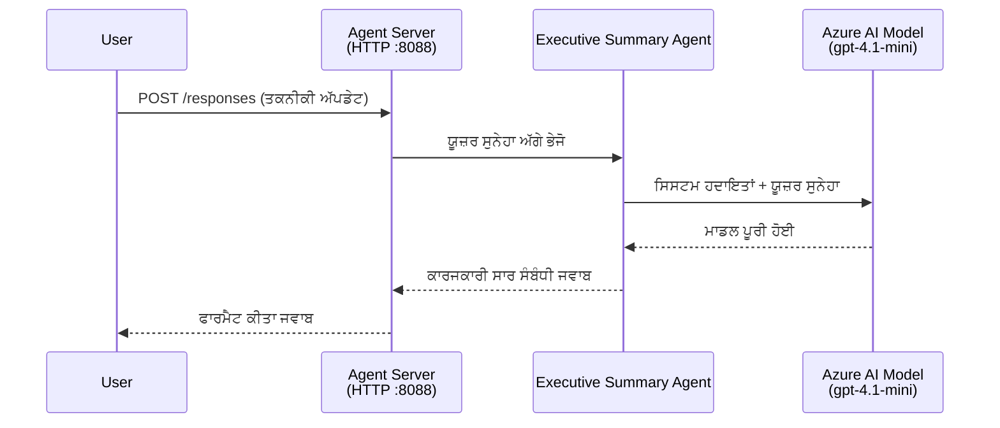
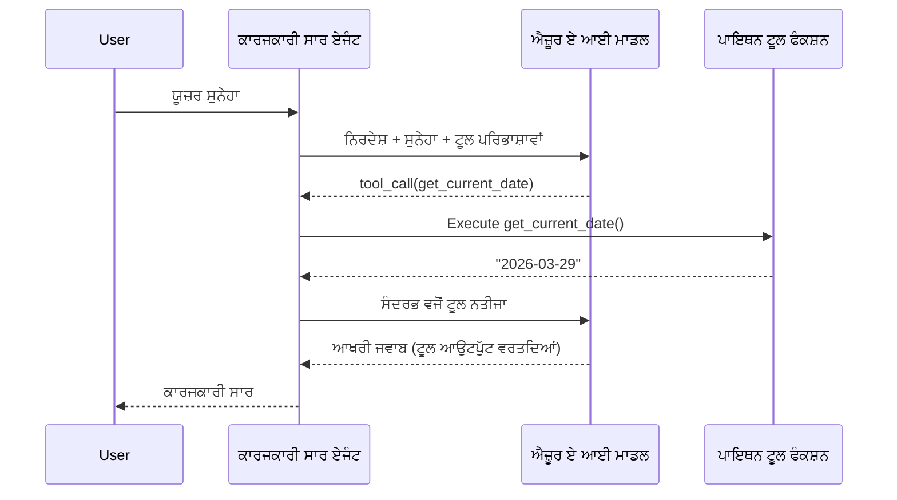

# Module 4 - ਨਿਰਦੇਸ਼, ਵਾਤਾਵਰਨ ਅਤੇ ਆਵਸ਼੍ਯਕDependenciesਾਂ ਨੂੰ ਸੰਰਚਿਤ ਕਰਨਾ

ਇਸ ਮੋਡਿਊਲ ਵਿੱਚ, ਤੁਸੀਂ ਮੋਡਿਊਲ 3 ਤੋਂ ਆਟੋ-ਸਕੈਫੋਲਡ ਕੀਤੇ ਗਿਆ ਏਜੰਟ ਫਾਇਲਾਂ ਨੂੰ ਕਸਟਮਾਈਜ਼ ਕਰਦੇ ਹੋ। ਇੱਥੇ ਤੁਸੀਂ ਜਨਰਲ ਸਕੈਫੋਲਡ ਨੂੰ **ਤੁਹਾਡੇ** ਏਜੰਟ ਵਿੱਚ ਬਦਲਦੇ ਹੋ - ਨਿਰਦੇਸ਼ ਲਿਖ ਕੇ, ਵਾਤਾਵਰਨ ਵੇਰੀਏਬਲ ਸੈੱਟ ਕਰਕੇ, ਬਦਲ ਦੀ ਸੂਚੀ ਵਿੱਚ ਸੰਭਵ ਤੌਰ ’ਤੇ ਟੂਲ ਜੋੜ ਕੇ, ਅਤੇ Dependenciesਾਂ ਨੂੰ ਇੰਸਟਾਲ ਕਰਕੇ।

> **ਯਾਦ ਦਿਵਾਣੀ:** Foundry ਐਕਸਟੈਂਸ਼ਨ ਨੇ ਤੁਹਾਡੇ ਪ੍ਰੋਜੈਕਟ ਫਾਇਲਾਂ ਆਪਣੇ ਆਪ ਜਨਰੇਟ ਕੀਤੀਆਂ ਸਨ। ਹੁਣ ਤੁਸੀਂ ਉਹਨਾਂ ਨੂੰ ਸੋਧਦੇ ਹੋ। ਕਿਸੇ ਕਸਟਮ ਏਜੰਟ ਦੇ ਬਿਲਕੁਲ ਕੰਮ ਕਰਨ ਵਾਲੇ ਉਦਾਹਰਨ ਲਈ [`agent/`](../../../../../workshop/lab01-single-agent/agent) ਫੋਲਡਰ ਵੇਖੋ।

---

## ਕੰਪੋਨੈਂਟ ਕਿਵੇਂ ਮਿਲਦੇ ਹਨ

### ਬੇਨਤੀ ਜੀਵਨ ਚੱਕਰ (ਇਕਲੌਤਾ ਏਜੰਟ)


> **ਟੂਲ ਨਾਲ:** ਜੇ ਏਜੰਟ ਕੋਲ ਟੂਲ ਰਜਿਸਟਰਡ ਹਨ, ਤਾਂ ਮਾਡਲ ਦੇ ਦਿੱਤੇ ਸੰਪੂਰਨ ਹੁਕਮ ਬਦਲੇ ਟੂਲ ਕਾਲ ਵਾਪਸੀ ਹੋ ਸਕਦੀ ਹੈ। ਫਰੇਮਵਰਕ ਉਸ ਟੂਲ ਨੂੰ ਲੋਕਲ ਤੌਰ ਤੇ ਚਲਾਉਂਦਾ ਹੈ, ਨਤੀਜਾ ਮਾਡਲ ਨੂੰ ਵਾਪਸ ਭੇਜਦਾ ਹੈ, ਅਤੇ ਫਿਰ ਮਾਡਲ ਅੰਤਿਮ ਜਵਾਬ ਪੈਦਾ ਕਰਦਾ ਹੈ।


---

## ਕਦਮ 1: ਵਾਤਾਵਰਨ ਵੇਰੀਏਬਲ ਸੰਰਚਿਤ ਕਰੋ

ਸਕੈਫੋਲਡ ਨੇ `.env` ਫਾਇਲ ਬਣਾਈ ਜਿਸ ਵਿੱਚ ਪਲੇਸਹੋਲਡਰ ਮੁੱਲ ਹਨ। ਤੁਹਾਨੂੰ ਮੋਡਿਊਲ 2 ਤੋਂ ਅਸਲੀ ਮੁੱਲ ਭਰਣੇ ਹਨ।

1. ਆਪਣੇ ਸਕੈਫੋਲਡ ਪ੍ਰੋਜੈਕਟ ਵਿੱਚ, **`.env`** ਫਾਇਲ ਖੋਲ੍ਹੋ (ਇਹ ਪ੍ਰੋਜੈਕਟ ਰੂਟ ਵਿੱਚ ਹੈ)।
2. ਪਲੇਸਹੋਲਡਰ ਮੁੱਲਾਂ ਨੂੰ ਆਪਣੇ ਅਸਲੀ Foundry ਪ੍ਰੋਜੈਕਟ ਵੇਰਵੇ ਨਾਲ ਬਦਲੋ:

   ```env
   PROJECT_ENDPOINT=https://<your-account>.services.ai.azure.com/api/projects/<your-project>
   MODEL_DEPLOYMENT_NAME=gpt-4.1-mini
   ```

3. ਫਾਇਲ ਸੇਵ ਕਰੋ।

### ਇਹ ਮੁੱਲ ਕਿੱਥੋਂ ਲੱਭਣਾ

| ਮੁੱਲ | ਕਿਵੇਂ ਲੱਭਣਾ ਹੈ |
|-------|---------------|
| **ਪ੍ਰੋਜੈਕਟ Endpoint** | VS ਕੋਡ ਵਿੱਚ **Microsoft Foundry** ਸਾਈਡਬਾਰ ਖੋਲ੍ਹੋ → ਆਪਣੇ ਪ੍ਰੋਜੈਕਟ ’ਤੇ ਕਲਿੱਕ ਕਰੋ → Endpoint URL ਵਿਸਥਾਰ ਦਰਸ਼ਨ ਵਿੱਚ ਦਿਖਾਇਆ ਗਿਆ ਹੈ। ਇਹ ਇਸ ਤਰ੍ਹਾਂ ਦਿਖਦਾ ਹੈ: `https://<account-name>.services.ai.azure.com/api/projects/<project-name>` |
| **ਮਾਡਲ ਡਿਪਲੋਇਮੈਂਟ ਨਾਮ** | Foundry ਸਾਈਡਬਾਰ ਵਿੱਚ, ਆਪਣੇ ਪ੍ਰੋਜੈਕਟ ਨੂੰ ਵਧਾਓ → **Models + endpoints** ਹੇਠਾਂ ਵੇਖੋ → ਨਾਂ ਡਿਪਲੋਇਮੈਂਟ ਮਾਡਲ ਦੇ ਨਾਲ ਦਿੱਤਾ ਗਿਆ ਹੁੰਦਾ ਹੈ (ਜਿਵੇਂ `gpt-4.1-mini`) |

> **ਸੁਰੱਖਿਆ:** ਕਦੇ ਵੀ `.env` ਫਾਇਲ ਨੂੰ ਵਰਜ਼ਨ ਕੰਟਰੋਲ ਵਿੱਚ ਕਮਿੱਟ ਨਾ ਕਰੋ। ਇਹ ਪਹਿਲਾਂ ਹੀ `.gitignore` ਵਿੱਚ ਸ਼ਾਮਿਲ ਹੈ। ਜੇ ਨਹੀਂ, ਤਾਂ ਇਸ ਨੂੰ ਸ਼ਾਮਿਲ ਕਰੋ:
> ```
> .env
> ```

### ਵਾਤਾਵਰਨ ਵੇਰੀਏਬਲ ਕਿਵੇਂ ਫਲੋ ਹੁੰਦੇ ਹਨ

ਮੈਪਿੰਗ ਚੇਨ ਹੈ: `.env` → `main.py` (`os.getenv` ਰਾਹੀਂ ਪੜ੍ਹਦਾ ਹੈ) → `agent.yaml` (ਡਿਪਲੋਇਮੈਂਟ ਸਮੇਂ ਕੰਟੇਨਰ ਵਾਤਾਵਰਨ ਵੇਰੀਏਬਲਾਂ ਨਾਲ ਮੈਪ ਕਰਦਾ ਹੈ)।

`main.py` ਵਿੱਚ ਸਕੈਫੋਲਡ ਇਨ੍ਹਾਂ ਨੂੰ ਇਸ ਤਰ੍ਹਾਂ ਪੜ੍ਹਦਾ ਹੈ:

```python
PROJECT_ENDPOINT = os.getenv("AZURE_AI_PROJECT_ENDPOINT") or os.getenv("PROJECT_ENDPOINT")
MODEL_DEPLOYMENT_NAME = os.getenv("AZURE_AI_MODEL_DEPLOYMENT_NAME", os.getenv("MODEL_DEPLOYMENT_NAME", "gpt-4.1-mini"))
```

ਦੋਹਾਂ `AZURE_AI_PROJECT_ENDPOINT` ਅਤੇ `PROJECT_ENDPOINT` ਕਬੂਲ ਕੀਤੇ ਜਾਂਦੇ ਹਨ (`agent.yaml` `AZURE_AI_*` ਪ੍ਰੀਫਿਕਸ ਵਰਤਦਾ ਹੈ)।

---

## ਕਦਮ 2: ਏਜੰਟ ਨਿਰਦੇਸ਼ ਲਿਖੋ

ਇਹ ਸਬ ਤੋਂ ਮਹੱਤਵਪੂਰਣ ਕਸਟਮਾਈਜ਼ੇਸ਼ਨ ਕਦਮ ਹੈ। ਨਿਰਦੇਸ਼ ਤੁਹਾਡੇ ਏਜੰਟ ਦੀ ਸ਼ਖਸੀਅਤ, ਵਿਹਾਰ, ਆਉਟਪੁੱਟ ਫਾਰਮੈਟ, ਅਤੇ ਸੁਰੱਖਿਆ ਪਾਬੰਦੀਆਂ ਨੂੰ ਪਰिभਾਸ਼ਿਤ ਕਰਦੇ ਹਨ।

1. ਆਪਣੇ ਪ੍ਰੋਜੈਕਟ ਵਿੱਚ `main.py` ਖੋਲ੍ਹੋ।
2. ਨਿਰਦੇਸ਼ ਸਤਰ ਨੂੰ ਲੱਭੋ (ਸਕੈਫੋਲਡ ਇੱਕ ਡਿਫਾਲਟ/ਆਮ ਸਤਰ ਸ਼ਾਮਲ ਕਰਦਾ ਹੈ)।
3. ਇਸ ਨੂੰ ਵਿਸਤਾਰਪੂਰਕ, ਸੰਰਚਿਤ ਨਿਰਦੇਸ਼ ਨਾਲ ਬਦਲੋ।

### ਚੰਗੇ ਨਿਰਦੇਸ਼ ਕੀ ਸ਼ਾਮਿਲ ਕਰਦੇ ਹਨ

| ਕੰਪੋਨੈਂਟ | ਮਕਸਦ | ਉਦਾਹਰਨ |
|-----------|---------|---------|
| **ਭੂਮਿਕਾ** | ਏਜੰਟ ਕੀ ਹੈ ਅਤੇ ਕੀ ਕਰਦਾ ਹੈ | "ਤੁਸੀਂ ਇੱਕ ਇੱਕਜ਼ੈਕਟਿਵ ਸਮਰੀ ਏਜੰਟ ਹੋ" |
| **ਦਰਸ਼ਕ** | ਜਿਨ੍ਹਾਂ ਲਈ ਜਵਾਬ ਹਨ | "ਸੀਨੀਅਰ ਲੀਡਰਜਿਨ੍ਹਾਂ ਦਾ ਤਕਨੀਕੀ ਪ੍ਰਸ਼ਿੱਖ knowledge ਘੱਟ ਹੋਵੇ" |
| **ਇਨਪੁੱਟ ਪਰਿਭਾਸ਼ਾ** | ਕਿਹੜੇ ਪ੍ਰਕਾਰ ਦੀਆਂ ਪ੍ਰੋੰਪਟਾਂ ਹੈਂਡਲ ਕਰਦਾ ਹੈ | "ਤਕਨੀਕੀ ਘਟਨਾ ਰਿਪੋਰਟਾਂ, آپਰੇਸ਼ਨਲ ਅੱਪਡੇਟ" |
| **ਆਉਟਪੁੱਟ ਫਾਰਮੈਟ** | ਜਵਾਬਾਂ ਦੀ ਠੀਕ ਸੰਰਚਨਾ | "Executive Summary: - ਕੀ ਵਾਪਰਿਆ: ... - ਕਾਰੋਬਾਰੀ ਪ੍ਰਭਾਵ: ... - ਅਗਲਾ ਕਦਮ: ..." |
| **ਨਿਯਮ** | ਪਾਬੰਦੀਆਂ ਅਤੇ ਇਨਕਾਰ ਕਰਨ ਦੀਆਂ ਹਾਲਤਾਂ | "ਉਪਲਬਧ ਜਾਣਕਾਰੀ ਤੋਂ ਅੱਗੇ ਜਾਣਕਾਰੀ ਨਾ ਜੋੜੋ" |
| **ਸੁਰੱਖਿਆ** | ਗਲਤ ਉਸਾਰ, ਗਲਤ ਜਾਣਕਾਰੀ ਤੋਂ ਬਚਾਉ | "ਜੇ ਇਨਪੁੱਟ ਅਸਪਸ਼ਟ ਹੈ ਤਾਂ ਸਪਸ਼ਟੀਕਰਨ ਮੰਗੋ" |
| **ਉਦਾਹਰਨਾਂ** | ਵਰਤਾਰਹ ਨਿਰਦੇਸ਼ ਲਈ ਇਨਪੁੱਟ/ਆਉਟਪੁੱਟ ਜੋੜੇ | 2-3 ਵੱਖ-ਵੱਖ ਇਨਪੁੱਟਾਂ ਨਾਲ ਉਦਾਹਰਨਾਂ ਸ਼ਾਮਿਲ ਕਰੋ |

### ਉਦਾਹਰਨ: ਇੱਕਜ਼ੈਕਟਿਵ ਸਮਰੀ ਏਜੰਟ ਨਿਰਦੇਸ਼

ਹੇਠਾਂ ਵਰਕਸ਼ਾਪ ਦੇ [`agent/main.py`](../../../../../workshop/lab01-single-agent/agent/main.py) ਵਿੱਚ ਵਰਤੇ ਗਏ ਨਿਰਦੇਸ਼ ਹਨ:

```python
AGENT_INSTRUCTIONS = """You are an "Explain Like I'm an Executive" agent.

Purpose:
Your job is to translate complex technical or operational information into
clear, concise, and outcome-focused summaries that can be easily understood
by non-technical executives.

Audience:
Senior leaders with limited technical background who care about impact,
risk, and what happens next.

What you must do:
- Rephrase the input so it is understandable to a non-technical audience
- Prioritize clarity, brevity, and outcomes over technical accuracy
- Remove technical jargon, logs, metrics, stack traces, and deep root-cause details
- Translate technical causes into simple cause-and-effect statements
- Explicitly call out business impact
- Always include a clear next step or action
- Maintain a neutral, factual, and calm executive tone
- Do NOT add new facts or speculate beyond the input

Standard Output Structure (always use this wording):

Executive Summary:
- What happened: <plain-language description>
- Business impact: <clear, non-technical impact>
- Next step: <clear action or mitigation>

Rules:
- Keep responses under 100 words
- Do NOT add facts beyond the input
- If input is unclear, ask for clarification
"""
```

4. `main.py` ਵਿੱਚ ਮੌਜੂਦਾ ਨਿਰਦੇਸ਼ ਸਤਰ ਨੂੰ ਆਪਣੀਆਂ ਕਸਟਮ ਨਿਰਦੇਸ਼ਾਂ ਨਾਲ ਬਦਲੋ।
5. ਫਾਇਲ ਸੇਵ ਕਰੋ।

---

## ਕਦਮ 3: (ਵਿਕਲਪਿਕ) ਕਸਟਮ ਟੂਲ ਸ਼ਾਮਿਲ ਕਰੋ

ਹੋਸਟ ਕੀਤੇ ਏਜੰਟ **ਲੋਕਲ Python ਫੰਗਸ਼ਨਾਂ** ਨੂੰ [ਟੂਲਾਂ](https://learn.microsoft.com/azure/foundry/agents/concepts/tool-catalog) ਵਜੋਂ ਚਲਾ ਸਕਦੇ ਹਨ। ਇਹ ਕੋਡ-ਆਧਾਰਿਤ ਹੋਸਟ-ਏਜੰਟਾਂ ਲਈ ਪ੍ਰੋੰਪਟ-ਓਨਲੀ ਏਜੰਟਾਂ ‘ਤੇ ਖਾਸ ਫਾਇਦਾ ਹੈ - ਤੁਹਾਡਾ ਏਜੰਟ ਸਰਵਰ-ਸਾਈਡ ਲੋਜਿਕ ਚਲਾ ਸਕਦਾ ਹੈ।

### 3.1 ਟੂਲ ਫੰਗਸ਼ਨ ਬਣਾਉ

`main.py` ਵਿੱਚ ਟੂਲ ਫੰਗਸ਼ਨ ਸ਼ਾਮਿਲ ਕਰੋ:

```python
from agent_framework import tool

@tool
def get_current_date() -> str:
    """Returns the current date in YYYY-MM-DD format."""
    from datetime import date
    return str(date.today())
```

`@tool` ਡੈਕੋਰੇਟਰ ਇੱਕ ਆਮ Python ਫੰਗਸ਼ਨ ਨੂੰ ਏਜੰਟ ਟੂਲ ਵਿੱਚ ਬਦਲਦਾ ਹੈ। ਡੌਕਸਟ੍ਰਿੰਗ ਉਹ ਟੂਲ ਵੇਰਵਾ ਬਣ ਜਾਂਦੀ ਹੈ ਜੋ ਮਾਡਲ ਵੇਖਦਾ ਹੈ।

### 3.2 ਟੂਲ ਨੂੰ ਏਜੰਟ ਨਾਲ ਰਜਿਸਟਰ ਕਰੋ

ਜਦੋਂ `.as_agent()` ਕੰਟੈਕਟ ਮੈਨੇਜਰ ਰਾਹੀਂ ਏਜੰਟ ਬਣਾਇਆ ਜਾਂਦਾ ਹੈ, ਤਾਂ `tools` ਪੈਰਾਮੀਟਰ ਵਿੱਚ ਟੂਲ ਪਾਸ ਕਰੋ:

```python
async with AzureAIAgentClient(
    project_endpoint=PROJECT_ENDPOINT,
    model_deployment_name=MODEL_DEPLOYMENT_NAME,
    credential=credential,
).as_agent(
    name="my-agent",
    instructions=AGENT_INSTRUCTIONS,
    tools=[get_current_date],
) as agent:
    server = from_agent_framework(agent)
    await server.run_async()
```

### 3.3 ਟੂਲ ਕਾਲ ਕਿਵੇਂ ਕੰਮ ਕਰਦੇ ਹਨ

1. ਯੂਜ਼ਰ ਇਕ ਪ੍ਰੋੰਪਟ ਭੇਜਦਾ ਹੈ।
2. ਮਾਡਲ ਫੈਸਲਾ ਕਰਦਾ ਹੈ ਕਿ ਕੀ ਟੂਲ ਲੋੜੀਂਦਾ ਹੈ (ਪ੍ਰੋੰਪਟ, ਨਿਰਦੇਸ਼ ਅਤੇ ਟੂਲ ਵੇਰਵਿਆਂ ਦੇ ਅਧਾਰ ਤੇ)।
3. ਜੇ ਟੂਲ ਲੋੜੀਂਦਾ ਹੈ, ਤਾਂ ਫਰੇਮਵਰਕ ਤੁਹਾਡੀ Python ਫੰਗਸ਼ਨ ਨੂੰ ਲੋਕਲ (ਕੰਟੇਨਰ ਦੇ ਅੰਦਰ) ਚਲਾਉਂਦਾ ਹੈ।
4. ਟੂਲ ਦਾ ਪਰਤ ਆਇਆ ਮੁੱਲ ਮਾਡਲ ਨੂੰ ਸੰਦਰਭ ਰੂਪ ਵਿੱਚ ਵਾਪਸ ਭੇਜਿਆ ਜਾਂਦਾ ਹੈ।
5. ਮਾਡਲ ਅੰਤਿਮ ਜਵਾਬ ਪੈਦਾ ਕਰਦਾ ਹੈ।

> **ਟੂਲ ਸਰਵਰ-ਸਾਈਡ ਚਲਦੇ ਹਨ** - ਇਹ ਤੁਹਾਡੇ ਕੰਟੇਨਰ ਦੇ ਅੰਦਰ ਚਲਦੇ ਹਨ, ਨਾ ਕਿ ਯੂਜ਼ਰ ਦੇ ਬਰਾਉਜ਼ਰ ਜਾਂ ਮਾਡਲ ਵਿੱਚ। ਇਸਦਾ ਮਤਲਬ ਤੁਸੀਂ ਡੇਟਾਬੇਸਾਂ, APIs, ਫਾਇਲ ਸਿਸਟਮ, ਜਾਂ ਕਿਸੇ ਵੀ Python ਲਾਇਬ੍ਰੇਰੀ ਤੱਕ ਪਹੁੰਚ ਸਕਦੇ ਹੋ।

---

## ਕਦਮ 4: ਇੱਕ ਵਰਚੁਅਲ ਵਾਤਾਵਰਨ ਬਣਾਓ ਅਤੇ ਚਾਲੂ ਕਰੋ

Dependencies ਇੰਸਟਾਲ ਕਰਨ ਤੋਂ ਪਹਿਲਾਂ, ਇੱਕ ਵੱਖਰਾ Python ਵਾਤਾਵਰਨ ਬਣਾਓ।

### 4.1 ਵਰਚੁਅਲ ਵਾਤਾਵਰਨ ਬਣਾਓ

VS ਕੋਡ ਵਿੱਚ ਟਰਮੀਨਲ ਖੋਲ੍ਹੋ (`` Ctrl+` ``) ਅਤੇ ਚਲਾਓ:

```powershell
python -m venv .venv
```

ਇਹ ਤੁਹਾਡੇ ਪ੍ਰੋਜੈਕਟ ਡਾਇਰੈਕਟਰੀ ਵਿੱਚ `.venv` ਫੋਲਡਰ ਬਣਾਉਂਦਾ ਹੈ।

### 4.2 ਵਰਚੁਅਲ ਵਾਤਾਵਰਨ ਚਾਲੂ ਕਰੋ

**PowerShell (Windows):**

```powershell
.\.venv\Scripts\Activate.ps1
```

**ਕਮਾਂਡ ਪ੍ਰੰਪਟ (Windows):**

```cmd
.venv\Scripts\activate.bat
```

**macOS/Linux (Bash):**

```bash
source .venv/bin/activate
```

ਤੁਹਾਡੇ ਟਰਮੀਨਲ ਪ੍ਰੰਪਟ ਦੇ ਸ਼ੁਰੂ ’ਤੇ `(.venv)` ਦਿਖਾਈ ਦੇਣਾ ਚਾਹੀਦਾ ਹੈ, ਜੋ ਖੁੱਲ੍ਹੇ ਵਰਚੁਅਲ ਵਾਤਾਵਰਨ ਦਾ ਸੰਕੇਤ ਹੈ।

### 4.3 Dependencies ਇੰਸਟਾਲ ਕਰੋ

ਵਰਚੁਅਲ ਵਾਤਾਵਰਨ ਚਾਲੂ ਹੋਣ 'ਤੇ, ਲੋੜੀਂਦੇ ਪੈਕੇਜ ਇੰਸਟਾਲ ਕਰੋ:

```powershell
pip install -r requirements.txt
```

ਇਹ ਇੰਸਟਾਲ ਕਰਦਾ ਹੈ:

| ਪੈਕੇਜ | ਮਕਸਦ |
|---------|---------|
| `agent-framework-azure-ai==1.0.0rc3` | [Microsoft Agent Framework](https://learn.microsoft.com/agent-framework/overview/) ਲਈ Azure AI ਇੰਟੀਗ੍ਰੇਸ਼ਨ |
| `agent-framework-core==1.0.0rc3` | ਏਜੰਟ ਬਣਾਉਣ ਲਈ ਕੋਰ ਰਨਟਾਈਮ (`python-dotenv` ਸ਼ਾਮਿਲ) |
| `azure-ai-agentserver-agentframework==1.0.0b16` | [Foundry Agent Service](https://learn.microsoft.com/azure/foundry/agents/overview) ਲਈ ਹੋਸਟ ਕੀਤੇ ਏਜੰਟ ਸਰਵਰ ਰਨਟਾਈਮ |
| `azure-ai-agentserver-core==1.0.0b16` | ਕੋਰ ਏਜੰਟ ਸਰਵਰ ਐਬਸਟ੍ਰੈਕਸ਼ਨਜ਼ |
| `debugpy` | Python ਡਿਬੱਗਿੰਗ (VS ਕੋਡ ਵਿੱਚ F5 ਡਿਬੱਗਿੰਗ ਯੋਗ) |
| `agent-dev-cli` | ਏਜੰਟਾਂ ਦੀ ਟੈਸਟਿੰਗ ਲਈ ਲੋਕਲ ਡਿਵੈਲਪਮੈਂਟ CLI |

### 4.4 ਇੰਸਟਾਲੇਸ਼ਨ ਦੀ ਜਾਂਚ ਕਰੋ

```powershell
pip list | Select-String "agent-framework|agentserver"
```

ਉਮੀਦ ਕੀਤਾ ਨਤੀਜਾ:
```
agent-framework-azure-ai   1.0.0rc3
agent-framework-core       1.0.0rc3
azure-ai-agentserver-agentframework 1.0.0b16
azure-ai-agentserver-core  1.0.0b16
```

---

## ਕਦਮ 5: ਪਛਾਣ ਦੀ ਪੁਸ਼ਟੀ ਕਰੋ

ਏਜੰਟ [`DefaultAzureCredential`](https://learn.microsoft.com/azure/developer/python/sdk/authentication/credential-chains#defaultazurecredential-overview) ਵਰਤਦਾ ਹੈ ਜੋ ਇਹਨਾਂ ਕ੍ਰਮ ਵਿੱਚ ਕਈ ਪਰਮਾਣਿਕਤਾ ਤਰੀਕੇ ਕੋਸ਼ਿਸ਼ ਕਰਦਾ ਹੈ:

1. **ਵਾਤਾਵਰਨ ਵੇਰੀਏਬਲ** - `AZURE_CLIENT_ID`, `AZURE_TENANT_ID`, `AZURE_CLIENT_SECRET` (ਸਰਵਿਸ ਪ੍ਰਿੰਸੀਪਲ)
2. **Azure CLI** - ਤੁਹਾਡਾ `az login` ਸੈਸ਼ਨ ਲੈਂਦਾ ਹੈ
3. **VS ਕੋਡ** - ਜਿਹੜੇ ਅਕਾਊਂਟ ਨਾਲ ਤੁਸੀਂ VS ਕੋਡ ਵਿੱਚ ਸਾਇਨ-ਇਨ ਹੋ, ਉਹ ਵਰਤਦਾ ਹੈ
4. **Managed Identity** - ਜਦੋਂ ਅਜ਼ੂਰ ਵਿੱਚ ਚਲਾਇਆ ਜਾਏ (ਡਿਪਲੋਇਮੈਂਟ ਸਮੇਂ)

### 5.1 ਸਥਾਨਕ ਵਿਕਾਸ ਲਈ ਪੁਸ਼ਟੀ ਕਰੋ

ਇਹਨਾਂ ਵਿੱਚੋਂ ਘੱਟੋ-ਘੱਟ ਇੱਕ ਕੰਮ ਕਰਨਾ ਚਾਹੀਦਾ ਹੈ:

**ਵਿਕਲਪ A: Azure CLI (ਸਿਫਾਰਸ਼ ਕੀਤੀ)**

```powershell
az account show --query "{name:name, id:id}" --output table
```

ਉਮੀਦ: ਤੁਹਾਡਾ ਸਬਸਕ੍ਰਿਪਸ਼ਨ ਨਾਂ ਅਤੇ ID ਦਿਖਾਉਂਦਾ ਹੈ।

**ਵਿਕਲਪ B: VS ਕੋਡ ਵਿੱਚ ਸਾਇਨ-ਇਨ**

1. VS ਕੋਡ ਦੇ ਹੇਠਾਂ-ਖੱਬੇ ਕੋਨੇ ਵਿੱਚ **Accounts** ਆਇਕਨ ਵੇਖੋ।
2. ਜੇ ਤੁਹਾਨੂੰ ਤੁਹਾਡਾ ਅਕਾਊਂਟ ਨਾਂ ਦਿਖਾਈ ਦੇਵੇ, ਤਾਂ ਤੁਸੀਂ ਪ੍ਰਮਾਣਿਤ ਹੋ।
3. ਨਹੀ ਤਾਂ ਆਇਕਨ ’ਤੇ ਕਲਿੱਕ ਕਰੋ → **Microsoft Foundry ਨੂੰ ਵਰਤਣ ਲਈ ਸਾਇਨ ਇਨ ਕਰੋ**।

**ਵਿਕਲਪ C: ਸਰਵਿਸ ਪ੍ਰਿੰਸੀਪਲ (CI/CD ਲਈ)**

```powershell
$env:AZURE_TENANT_ID = "<your-tenant-id>"
$env:AZURE_CLIENT_ID = "<your-client-id>"
$env:AZURE_CLIENT_SECRET = "<your-client-secret>"
```

### 5.2 ਆਮ ਅਥੇਂਟੀਕੇਸ਼ਨ ਸਮੱਸਿਆ

ਜੇ ਤੁਸੀਂ ਕਈ ਅਜ਼ੂਰ ਅਕਾਊਂਟਾਂ ਵਿੱਚ ਸਾਇਨ ਇਨ ਹੋ, ਤਾਂ ਯਕੀਨੀ ਬਣਾਓ ਕਿ ਸਹੀ ਸਬਸਕ੍ਰਿਪਸ਼ਨ ਚੁਣਿਆ ਗਿਆ ਹੈ:

```powershell
az account set --subscription "<your-subscription-id>"
```

---

### ਚੈਕਪੋਇੰਟ

- [ ] `.env` ਫਾਇਲ ਵਿੱਚ ਸਹੀ `PROJECT_ENDPOINT` ਅਤੇ `MODEL_DEPLOYMENT_NAME` ਭਰੇ ਹੋਏ ਹਨ (ਪਲੇਸਹੋਲਡਰ ਨਹੀਂ)
- [ ] ਏਜੰਟ ਨਿਰਦੇਸ਼ `main.py` ਵਿੱਚ ਕਸਟਮਾਈਜ਼ ਹਨ - ਇਹ ਭੂਮਿਕਾ, ਦਰਸ਼ਕ, ਆਉਟਪੁੱਟ ਫਾਰਮੈਟ, ਨਿਯਮ, ਅਤੇ ਸੁਰੱਖਿਆ ਪਾਬੰਦੀਆਂ ਨੂੰ ਪਰਿਭਾਸ਼ਿਤ ਕਰਦੇ ਹਨ
- [ ] (ਵਿਕਲਪਿਕ) ਕਸਟਮ ਟੂਲ ਪਰਿਭਾਸ਼ਿਤ ਅਤੇ ਰਜਿਸਟਰ ਹੋ ਚੁੱਕੇ ਹਨ
- [ ] ਵਰਚੁਅਲ ਵਾਤਾਵਰਨ ਬਣਾਇਆ ਅਤੇ ਚਾਲੂ ਕੀਤਾ ਗਿਆ (`(.venv)` ਟਰਮੀਨਲ ਪ੍ਰੰਪਟ ਵਿੱਚ ਦਿੱਸਦਾ ਹੈ)
- [ ] `pip install -r requirements.txt` ਸਫਲਤਾਪੂਰਵਕ ਖਤਮ ਹੋ ਜਾਂਦਾ ਹੈ ਬਿਨਾਂ ਗਲਤੀਆਂ ਦੇ
- [ ] `pip list | Select-String "azure-ai-agentserver"` ਦਿਖਾਉਂਦਾ ਹੈ ਕਿ ਪੈਕੇਜ ਇੰਸਟਾਲ ਹੈ
- [ ] ਪ੍ਰਮਾਣੀਕਰਨ ਸਹੀ ਹੈ - `az account show` ਤੁਹਾਡਾ ਸਬਸਕ੍ਰਿਪਸ਼ਨ ਵਾਪਸ ਕਰਦਾ ਹੈ ਜਾਂ ਤੁਸੀਂ VS ਕੋਡ ਵਿੱਚ ਸਾਈਨ ਇਨ ਹੋ

---

**ਪਿਛਲਾ:** [03 - Create Hosted Agent](03-create-hosted-agent.md) · **ਅਗਲਾ:** [05 - Test Locally →](05-test-locally.md)

---

<!-- CO-OP TRANSLATOR DISCLAIMER START -->
**ਅਸਵੀਕਾਰ**:  
ਇਹ ਦਸਤਾਵੇਜ਼ ਏਆਈ ਅਨੁਵਾਦ ਸੇਵਾ [Co-op Translator](https://github.com/Azure/co-op-translator) ਦੀ ਵਰਤੋਂ ਕਰਕੇ ਅਨੁਵਾਦ ਕੀਤਾ ਗਿਆ ਹੈ। ਜਦੋਂ ਕਿ ਅਸੀਂ ਸਹੀਤਾ ਲਈ ਕੋਸ਼ਿਸ਼ ਕਰਦੇ ਹਾਂ, ਕਿਰਪਾ ਕਰਕੇ ਇਹ ਜਾਣੋ ਕਿ ਆਟੋਮੈਟਿਕ ਅਨੁਵਾਦਾਂ ਵਿੱਚ ਗਲਤੀਆਂ ਜਾਂ ਅਸਥਿਰਤਾਵਾਂ ਹੋ ਸਕਦੀਆਂ ਹਨ। ਮੂਲ ਦਸਤਾਵੇਜ਼ ਨੂੰ ਇਸਦੀ ਮੂਲ ਭਾਸ਼ਾ ਵਿੱਚ ਪ੍ਰਮਾਣਿਕ ਸਰੋਤ ਸਮਝਿਆ ਜਾਣਾ ਚਾਹੀਦਾ ਹੈ। ਜਰੂਰੀ ਜਾਣਕਾਰੀ ਲਈ, ਪੇਸ਼ੇਵਰ ਮਨੁੱਖੀ ਅਨੁਵਾਦ ਦੀ ਸਿਫ਼ਾਰਸ਼ ਕੀਤੀ ਜਾਂਦੀ ਹੈ। ਇਸ ਅਨੁਵਾਦ ਦੀ ਵਰਤੋਂ ਤੋਂ ਉੱਪਜਣ ਵਾਲੀਆਂ ਕਿਸੇ ਵੀ ਗਲਤਫ਼ਹਮੀਆਂ ਜਾਂ ਗਲਤ ਵਿਆਖਿਆਵਾਂ ਲਈ ਅਸੀਂ ਜ਼ਿੰਮੇਵਾਰ ਨਹੀਂ ਹਾਂ।
<!-- CO-OP TRANSLATOR DISCLAIMER END -->