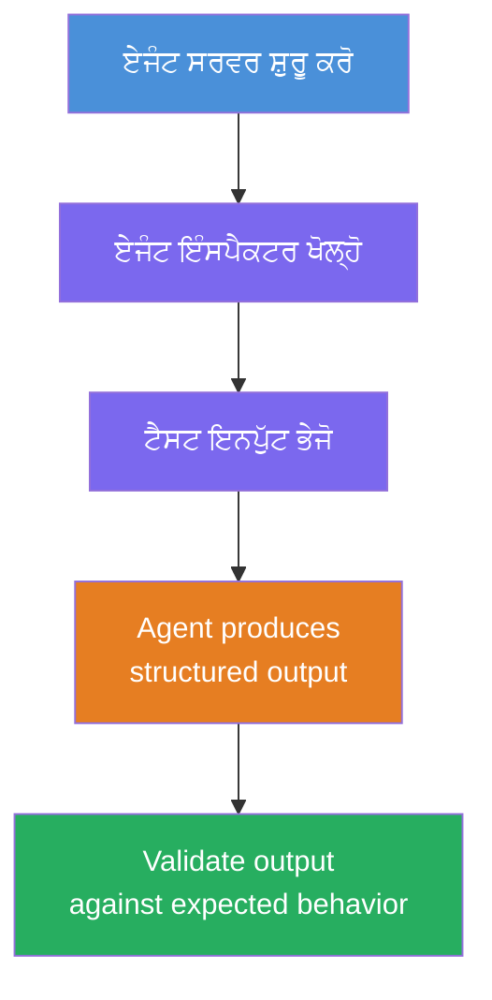
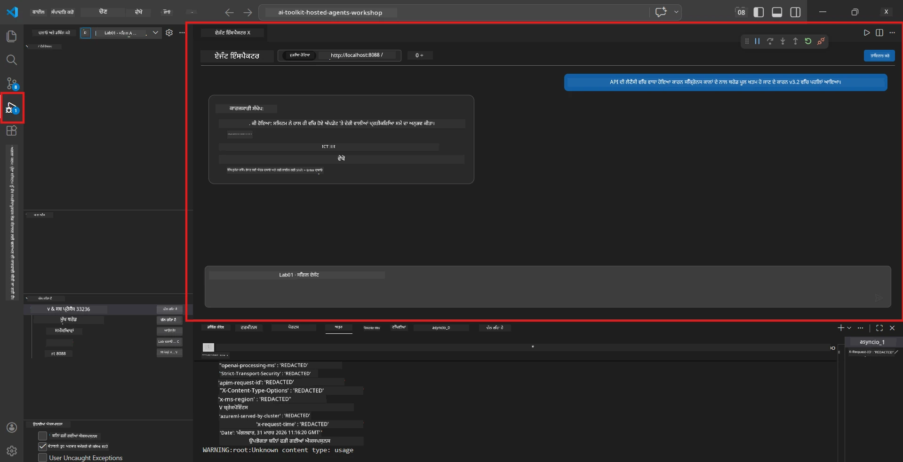
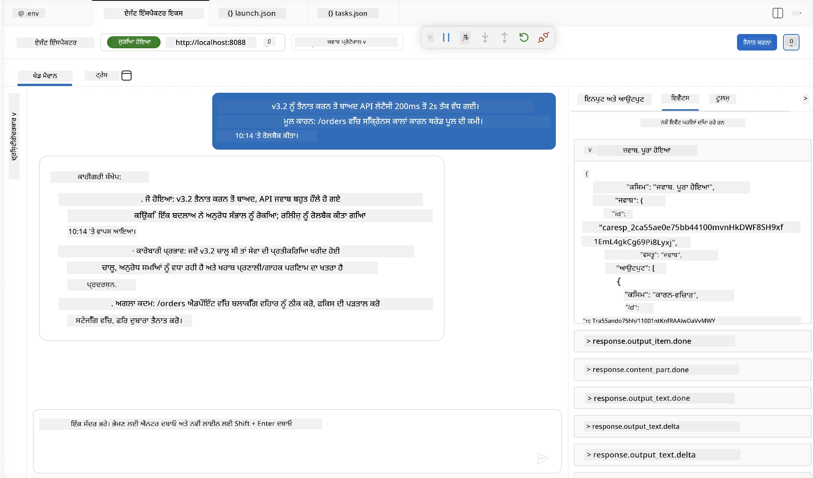

# ਮਾਡਿਊਲ 4 - ਸਥਾਨਕ ਤੌਰ 'ਤੇ ਟੈਸਟ ਕਰੋ

⏱️ ~10 ਮਿੰਟ

ਇਸ ਮਾਡਿਊਲ ਵਿੱਚ, ਤੁਸੀਂ ਆਪਣੇ ਏਜੰਟ ਨੂੰ ਸਥਾਨਕ ਤੌਰ 'ਤੇ ਚਲਾਉਂਦੇ ਹੋ ਅਤੇ ਇਹ ਪ੍ਰਮਾਣਿਤ ਕਰਦੇ ਹੋ ਕਿ ਇਹ ਠੀਕ ਤਰ੍ਹਾਂ ਕੰਮ ਕਰਦਾ ਹੈ **ਹੈਪੀ-ਪਾਥ ਫੰਕਸ਼ਨਲ ਟੈਸਟਾਂ** ਦੀ ਵਰਤੋਂ ਕਰਕੇ। ਤੁਸੀਂ ਏਜੰਟ ਇੰਸਪੈਕਟਰ (ਵੇਜ਼ੂਅਲ UI) ਜਾਂ ਸਿੱਧੀ HTTP ਕਾਲਾਂ ਦੀ ਵਰਤੋਂ ਕਰਕੇ ਇਹ ਪੁਸ਼ਟੀ ਕਰੋਗੇ ਕਿ ਏਜੰਟ ਸੰਰਚਿਤ, ਸਹੀ ਜਵਾਬ ਦਿੰਦਾ ਹੈ।

### ਸਥਾਨਕ ਟੈਸਟਿੰਗ ਪ੍ਰਕਿਰਿਆ



---

## ਵਿਕਲਪ 1: F5 ਦਬਾਓ - ਏਜੰਟ ਇੰਸਪੈਕਟਰ ਨਾਲ ਡੀਬੱਗ ਕਰੋ (ਸਿਫਾਰਸ਼ ਕੀਤੀ ਗਈ)

### ਡੀਬੱਗਰ ਸ਼ੁਰੂ ਕਰੋ

1. **executive-summary-agent/** ਫੋਲਡਰ ਨੂੰ ਸਿੱਧਾ VS ਕੋਡ ਵਿੱਚ ਖੋਲ੍ਹੋ (`File → Open Folder`)।
2. **Run and Debug** ਪੈਨਲ ਖੋਲ੍ਹੋ (`Ctrl+Shift+D`)।
3. ਡ੍ਰੌਪਡਾਊਨ ਤੋਂ **Debug Local Agent Server** ਚੁਣੋ।
4. **F5** ਦਬਾਓ (ਜਾਂ ▶ Start Debugging 'ਤੇ ਕਲਿੱਕ ਕਰੋ)।

> ⚠️ **ਮਹੱਤਵਪੂਰਨ: ਆਪਣੇ ਪਾਇਥਨ ਇੰਟਰਪ੍ਰੇਟਰ ਨੂੰ ਚੁਣੋ**
> ਜੇ ਤੁਸੀਂ "ModuleNotFoundError" ਮਿਲਿਆ ਜਾਂ ਡੀਬੱਗਰ ਸ਼ੁਰੂ ਨਹੀਂ ਹੁੰਦਾ, ਤਾਂ ਤੁਹਾਨੂੰ VS ਕੋਡ ਨੂੰ ਆਪਣਾ ਵਰਚੁਅਲ ਵਾਤਾਵਰਣ ਵਰਤਣ ਲਈ ਕਹਿਣਾ ਚਾਹੀਦਾ ਹੈ:
  > 1. `Ctrl+Shift+P` ਦਬਾਓ → ਤਾਈਪ ਕਰੋ **Python: Select Interpreter**।
  > 2. ਆਪਣੇ ਪ੍ਰੋਜੈਕਟ ਦੇ `.venv` ਫੋਲਡਰ ਵਿੱਚ ਸਥਿਤ ਇੰਟਰਪ੍ਰੇਟਰ ਚੁਣੋ (ਉਦਾਹਰਨ ਵਜੋਂ, Windows 'ਤੇ `.\.venv\Scripts\python.exe`)।
  > 3. ਡੀਬੱਗ ਸੈਸ਼ਨ ਨੂੰ ਮੁੜ ਸਟਾਰਟ ਕਰੋ।
> ਜੇ ਅਜੇ ਵੀ ਗਲਤੀਆਂ ਆ ਰਹੀਆਂ ਹਨ, ਤਾਂ ਆਪਣੇ `tasks.json` ਫਾਇਲ ਨੂੰ ਹੱਥੋਂ ਮੈਨੂੰ ਅਪਡੇਟ ਕਰੋ:
  > 1. `.vscode/tasks.json` ਫਾਇਲ ਤੇ ਜਾਓ
  > 2. ਕਮਾਂਡ ਜਿਸ ਦਾ ਨਾਂ ਹੈ: `Run Agent/Workflow HTTP Server` ਤੇ ਜਾਓ
  > 3. ਕਮਾਂਡ ਦਾ ਮੁੱਲ ਇਸ ਤਰ੍ਹਾਂ ਅਪਡੇਟ ਕਰੋ: `"value": "${workspaceFolder}/.venv/bin/python",`

### ਕੀ ਹੁੰਦਾ ਹੈ

1. HTTP ਸਰਵਰ `http://localhost:8088/responses` 'ਤੇ ਸ਼ੁਰੂ ਹੁੰਦਾ ਹੈ।
2. **Agent Inspector** ਪੈਨਲ ਖੁਦ ਬ ਖੁਦ ਖੁਲ ਜਾਂਦਾ ਹੈ - ਟੈਸਟਿੰਗ ਲਈ ਇੱਕ ਵੇਜ਼ੂਅਲ ਚੈਟ ਇੰਟਰਫੇਸ।
3. `main.py` ਵਿੱਚ ਬ੍ਰੇਕਪੋਇੰਟ ਸਕ੍ਰੀਨਚਾਲੂ ਹੁੰਦੇ ਹਨ।

ਟਰਮੀਨਲ ਨੂੰ ਵੇਖਦੇ ਰਹੋ:
```
Starting executive summary hosted agent
Executive agent server running on http://localhost:8088
```

> **ਜੇ Agent Inspector ਨਹੀਂ ਖੁਲਦਾ:** `Ctrl+Shift+P` ਦਬਾਓ → **Foundry Toolkit: Open Agent Inspector**।



> *ਸਕਰੀਨਸ਼ਾਟ ਪੁਰਾਣਾ 'AI TOOLKIT' ਬ੍ਰਾਂਡਿੰਗ ਦਿਖਾ ਸਕਦਾ ਹੈ ਜੋ ਪਹਿਲਾਂ ਵਰਜ਼ਨ ਦਾ ਹੈ।*

---

## ਵਿਕਲਪ 2: ਟਰਮੀਨਲ ਰਾਹੀਂ ਟੈਸਟ (ਵਿਕਲਪ)

ਏਜੰਟ ਨੂੰ ਇੱਕ ਟਰਮੀਨਲ ਵਿੱਚ ਚਲਾਓ, ਦੂਜੇ ਤੋਂ ਸਿਧੇ ਦਰਖ਼ਾਸਤ ਭੇਜੋ:

```bash
# ਟਰਮੀਨਲ 1: ਏਜੰਟ ਸ਼ੁਰੂ ਕਰੋ
cd executive-summary-agent/
source .venv/bin/activate
python main.py
```

```bash
# ਟਰਮੀਨਲ 2: ਟੈਸਟ ਭੇਜੋ (ਕਰਲ)
curl -sS -X POST http://localhost:8088/responses \
  -H "Content-Type: application/json" \
  -d '{"input": "The API latency increased due to thread pool exhaustion caused by sync calls in v3.2.", "stream": false}'
```

---

## ਦ੍ਰਿਸ਼ਟਾਂਤ ਟੈਸਟ: ਹੈਪੀ-ਪਾਥ ਫੰਕਸ਼ਨਲ ਪ੍ਰਮਾਣਿਤੀ

ਹੇਠਾਂ ਦਿੱਤੇ **ਤਿੰਨੋ** ਦ੍ਰਿਸ਼ਟਾਂਤ ਚਲਾਓ। ਇਹ ਪ੍ਰਮਾਣਿਤ ਕਰਦੇ ਹਨ ਕਿ ਤੁਹਾਡਾ ਏਜੰਟ ਹਕੀਕਤੀ ਇਨਪੁੱਟ ਲਈ ਸਹੀ, ਸੰਰਚਿਤ ਨਤੀਜੇ ਦਿੰਦਾ ਹੈ।



### ਦ੍ਰਿਸ਼ਟਾਂਤ 1: IT ਘਟਨਾ - API ਲੇਟেন্সੀ ਵਿੱਚ ਚੋਟੀ

**ਇਨਪੁੱਟ:**
```
The API latency increased from 200ms to 2s after deploying v3.2.
Root cause: thread pool starvation from synchronous calls in /orders.
Rolled back at 10:14.
```

**ਉਮੀਦ ਕੀਤੀ ਗਈ ਵਰਤੋਂ:**
- ✅ "Executive Summary" ਸੰਰਚਨਾ ਦਾ ਪਾਲਣ (ਕੀ ਹੋਇਆ / ਬਿਜ਼ਨਸ ਪ੍ਰਭਾਵ / ਅਗਲਾ ਕਦਮ)
- ✅ ਕੋਈ ਤਕਨੀਕੀ ਭਾਸ਼ਾ ਨਹੀਂ (ਨਾ "thread pool", ਨਾ "/orders", ਨਾ "v3.2")
- ✅ ਬਿਜ਼ਨਸ ਪ੍ਰਭਾਵ ਸਪਸ਼ਟ ਕੀਤਾ ਗਿਆ (ਉਦਾਹਰਣ ਲਈ, ਯੂਜ਼ਰਾਂ ਨੂੰ ਦੇਰੀ ਦਾ ਸਾਹਮਣਾ ਕਰਨਾ ਪਿਆ)
- ✅ ਇੱਕ ਅਗਲਾ ਕਦਮ ਸ਼ਾਮਿਲ ਹੈ (ਜਿਵੇਂ ਕਿ, ਫਿਕਸ ਲਾਇਆ ਗਿਆ, ਨਿਗਰਾਨੀ ਲਗਾਈ ਗਈ ਹੈ)

---

### ਦ੍ਰਿਸ਼ਟਾਂਤ 2: ਡਾਟਾ ਪਾਈਪਲਾਈਨ - ETL ਫੇਲ੍ਹ

**ਇਨਪੁੱਟ:**
```
The nightly ETL job failed because the upstream schema changed. APAC dashboards show missing data.
```

**ਉਮੀਦ ਕੀਤੀ ਗਈ ਵਰਤੋਂ:**
- ✅ ਸਧਾਰਣ ਭਾਸ਼ਾ ਵਿੱਚ ਡਾਟਾ ਰੀਫ੍ਰੈਸ਼ ਫੇਲ੍ਹ ਦਾ ਸੰਖੇਪ
- ✅ APAC ਡੈਸ਼ਬੋਰਡ ਪ੍ਰਭਾਵ ਦਾ ਜ਼ਿਕਰ
- ✅ ਨਿਵਾਰਣ ਲਈ ਅਗਲਾ ਕਦਮ ਸ਼ਾਮਿਲ
- ✅ "ETL", "schema", ਜਾਂ ਹੋਰ ਤਕਨੀਕੀ ਸ਼ਬਦ ਨਹੀਂ

---

### ਦ੍ਰਿਸ਼ਟਾਂਤ 3: ਸੁਰੱਖਿਆ - ਪ੍ਰਕਟ ਕੀਤੇ ਪ੍ਰਮਾਣ ਪੱਤਰ

**ਇਨਪੁੱਟ:**
```
Static analysis flagged a hardcoded secret in the repository.
The secret may have been exposed in commit history.
```

**ਉਮੀਦ ਕੀਤੀ ਗਈ ਵਰਤੋਂ:**
- ✅ ਸੁਰੱਖਿਆ/ਪ੍ਰਮਾਣ ਪੱਤਰ ਦੀ ਸਮੱਸਿਆ ਨੂੰ ਐਗਜ਼ੈਕਟਿਵ-ਫ੍ਰੈਂਡਲੀ ਭਾਸ਼ਾ ਵਿੱਚ ਵੇਰਵਾ
- ✅ ਸੰਭਾਵਿਤ ਜੋਖਮ (ਬਿਨਾਂ ਅਧਿਕਾਰ ਵਾਲੀ ਪਹੁੰਚ)
- ✅ ਨਿਵਾਰਣ ਕਾਰਵਾਈ ਦਾ ਜ਼ਿਕਰ (ਪ੍ਰਮਾਣ ਪੱਤਰ ਘੁਮਾਅ, ਆਡਿਟ)
- ✅ "static analysis", "commit history", ਜਾਂ "hardcoded" ਵਰਗੇ ਸ਼ਬਦ ਸ਼ਾਮਿਲ ਨਹੀਂ

---

## ਪ੍ਰਮਾਣਿਕਤਾ ਮਾਪਦੰਡ

ਹਰ ਦ੍ਰਿਸ਼ਟਾਂਤ ਲਈ, ਜਾਂਚ ਕਰੋ:

| # | ਮਾਪਦੰਡ | ਪਾਸ ਸ਼ਰਤ |
|---|----------|---------------|
| 1 | **ਸੰਰਚਨਾ** | ਜਵਾਬ "Executive Summary" ਫਾਰਮੈਟ ਵਰਤਦਾ ਹੈ ਜਿਸ ਵਿੱਚ ਤਿੰਨਵੇਂ ਬੁੱਲਟ ਹਨ |
| 2 | **ਸਧਾਰਣ ਭਾਸ਼ਾ** | ਕੋਈ ਤਕਨੀਕੀ ਜ਼ਰਗਨ ਨਹੀਂ ਜੋ ਕਿਸੇ ਐਗਜ਼ੈਕਟਿਵ ਨੂੰ ਸਮਝ ਨਾ ਆਵੇ |
| 3 | **ਸਹੀਤਾ** | ਸੰਖੇਪ ਇਨਪੁੱਟ ਨੂੰ ਦਰਸਾਉਂਦਾ ਹੈ - ਕੋਈ ਬਣਾਵਟੀ ਵੇਰਵਾ ਨਹੀਂ |
| 4 | **ਸੰਗ੍ਰਹਿਤਤਾ** | ਜਵਾਬ 100 ਸ਼ਬਦਾਂ ਤੋਂ ਘੱਟ ਹੋਵੇ |
| 5 | **ਅਗਲਾ ਕਦਮ** | ਇੱਕ ਸਪਸ਼ਟ ਕਦਮ ਜਾਂ ਘਟਾਇਆ ਜਾਣ ਦਾ ਕਾਰਨ ਦਿੱਤਾ ਗਿਆ |

---

## ਡੀਬੱਗਿੰਗ ਸੁਝਾਅ

| ਸਮੱਸਿਆ | ਸੁਧਾਰ |
|-------|-----|
| ਏਜੰਟ ਸ਼ੁਰੂ ਨਹੀਂ ਹੁੰਦਾ | `.env` ਮੁੱਲਾਂ ਦੀ ਜਾਂਚ ਕਰੋ, ਵੈਨਵ ਐਕਟੀਵੇਟ ਹੈ ਜਾਂ ਨਹੀਂ ਵੇਖੋ, `pip install -r requirements.txt` ਚਲਾਓ |
| ਖਾਲੀ ਜਾਂ ਜਨਰਿਕ ਜਵਾਬ | `main.py` ਵਿੱਚ ਦਿਦੇ ਜਾਣ ਵਾਲੇ ਦਿਸ਼ਾ ਨਿਰਦੇਸ਼ਾਂ ਨੂੰ ਦੁਬਾਰਾ ਵੇਖੋ - ਯਕੀਨੀ ਬਣਾਓ ਕਿ ਨਤੀਜੇ ਦਾ ਫਾਰਮੈਟ ਦਿੱਤਾ ਗਿਆ ਹੈ |
| ਜਵਾਬ ਵਿੱਚ ਜਰਗਨ ਸ਼ਾਮਿਲ ਹੈ | ਹਦਾਇਤਾਂ ਵਿੱਚ "ਤਕਨੀਕੀ ਸ਼ਬਦ ਹਟਾਉਣ" ਨਿਯਮ ਮਜ਼ਬੂਤ ਕਰੋ |
| Agent Inspector ਨਹੀਂ ਖੁਲਦਾ | `Ctrl+Shift+P` → **Foundry Toolkit: Open Agent Inspector** |
| ਟਰਮੀਨਲ ਵਿੱਚ ਮਾਡਲ ਗਲਤੀਆਂ | ਯਕੀਨੀ ਬਣਾਓ ਕਿ `AZURE_AI_MODEL_DEPLOYMENT_NAME` ਬਿਲਕੁਲ ਸਹੀ ਹੈ (ਕੇਸ-ਸੇਂਸਿਟਿਵ) |

---

### ✅ ਚੈਕਪੌਇੰਟ

- [ ] ਏਜੰਟ ਸਥਾਨਕ ਤੌਰ 'ਤੇ ਬਿਨਾਂ ਗਲਤੀ ਸ਼ੁਰੂ ਹੁੰਦਾ ਹੈ
- [ ] ਏਜੰਟ ਇੰਸਪੈਕਟਰ ਖੁਲਦਾ ਹੈ ਅਤੇ ਚੈਟ ਇੰਟਰਫੇਸ ਦਿਖਾਉਂਦਾ ਹੈ (ਜੇ F5 ਵਰਤ ਰਹੇ ਹੋ)
- [ ] **ਦ੍ਰਿਸ਼ਟਾਂਤ 1** (IT ਘਟਨਾ) - ਸੰਰਚਿਤ Executive Summary, ਕੋਈ ਜਰਗਨ ਨਹੀਂ
- [ ] **ਦ੍ਰਿਸ਼ਟਾਂਤ 2** (ਡਾਟਾ ਪਾਈਪਲਾਈਨ) - ਸਬੰਧਿਤ ਸੰਖੇਪ ਅਤੇ ਬਿਜ਼ਨਸ ਪ੍ਰਭਾਵ
- [ ] **ਦ੍ਰਿਸ਼ਟਾਂਤ 3** (ਸੁਰੱਖਿਆ ਚੇਤਾਵਨੀ) - ਉਚਿਤ ਜੋਖਮ ਸੰਚਾਰ
- [ ] ਸਾਰੇ ਜਵਾਬ ਨਿਰਧਾਰਤ ਨਤੀਜੇ ਦੀ ਸੰਰਚਨਾ ਨੂੰ ਫਾਲੋ ਕਰਦੇ ਹਨ

> **ਆਪਣੇ ਜਵਾਬ ਸੰਭਾਲੋ** (ਕਾਪੀ ਜਾਂ ਸਕਰੀਨਸ਼ਾਟ ਲਵੋ) - ਤੁਸੀਂ ਉਨ੍ਹਾਂ ਦੀ ਤੁਲਨਾ ਮਾਡਿਊਲ 06 ਵਿੱਚ ਕਲਾਉਡ ਦੇ ਨਤੀਜਿਆਂ ਨਾਲ ਕਰੋਗੇ।

---

**ਪਿਛਲਾ:** [03 - Configure & Code](03-configure-and-code.md) · **ਅਗਲਾ:** [05 - Deploy to Foundry →](05-deploy-to-foundry.md)

---

<!-- CO-OP TRANSLATOR DISCLAIMER START -->
**ਅਸਵੀਕਾਰੋਪਣ**:
ਇਸ ਦਸਤਾਵੇਜ਼ ਦਾ ਅਨੁਵਾਦ ਏਆਈ ਅਨੁਵਾਦ ਸੇਵਾ [Co-op Translator](https://github.com/Azure/co-op-translator) ਦੀ ਵਰਤੋਂ ਕਰਕੇ ਕੀਤਾ ਗਿਆ ਹੈ। ਜਦੋਂ ਕਿ ਅਸੀਂ ਸਹੀਤਾਵਾਂ ਲਈ ਯਤਨਸ਼ੀਲ ਹਾਂ, ਕਿਰਪਾ ਕਰਕੇ ਧਿਆਨ ਰੱਖੋ ਕਿ ਸਵੈਚਾਲਿਤ ਅਨੁਵਾਦਾਂ ਵਿੱਚ ਗਲਤੀਆਂ ਜਾਂ ਅਸਮੱਤਿਆਵਾਂ ਹੋ ਸਕਦੀਆਂ ਹਨ। ਮੂਲ ਦਸਤਾਵੇਜ਼ ਆਪਣੀ ਮੂਲ ਭਾਸ਼ਾ ਵਿੱਚ ਅਧਿਕਾਰਕ ਸਰੋਤ ਮੰਨਿਆ ਜਾਣਾ ਚਾਹੀਦਾ ਹੈ। ਜਰੂਰੀ ਜਾਣਕਾਰੀ ਲਈ, ਪੇਸ਼ੇਵਰ ਮਨੁੱਖੀ ਅਨੁਵਾਦ ਦੀ ਸਿਫ਼ਾਰਸ਼ ਕੀਤੀ ਜਾਂਦੀ ਹੈ। ਅਸੀਂ ਇਸ ਅਨੁਵਾਦ ਦੇ ਉਪਯੋਗ ਤੋਂ ਪੈਦਾ ਹੋਣ ਵਾਲੀਆਂ ਕਿਸੇ ਵੀ ਗਲਤਫਹਿਮੀਆਂ ਜਾਂ ਗਲਤ ਵਿਆਖਿਆਵਾਂ ਲਈ ਜਵਾਬਦੇਹ ਨਹੀਂ ਹਾਂ।
<!-- CO-OP TRANSLATOR DISCLAIMER END -->