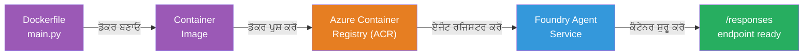
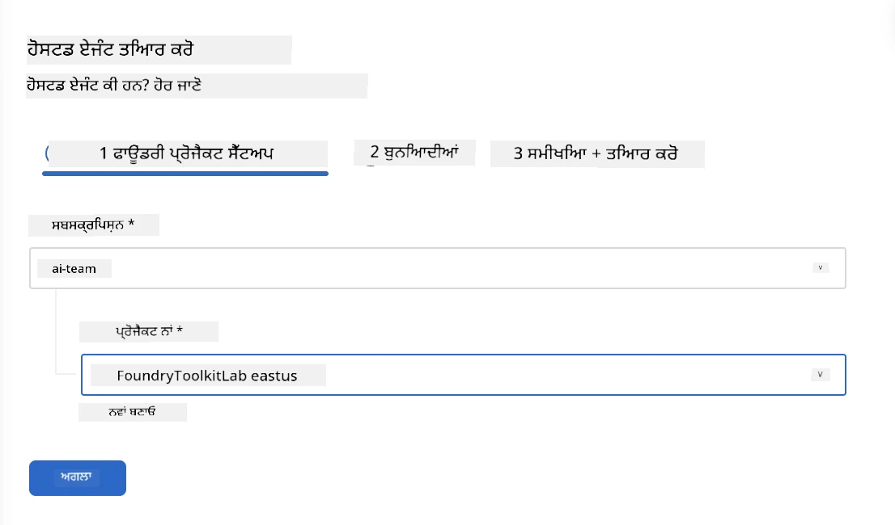
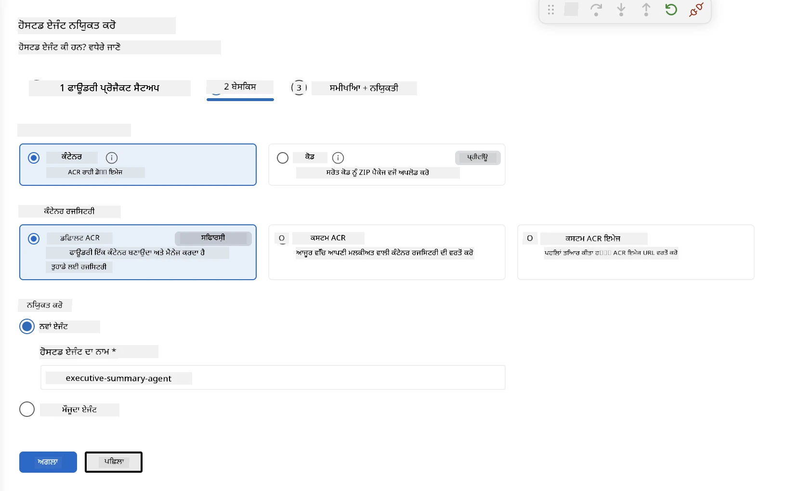
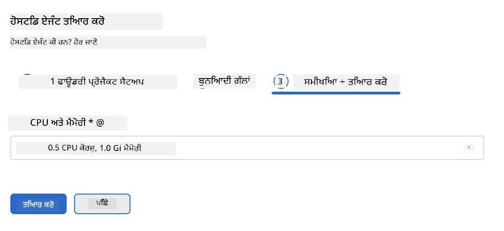
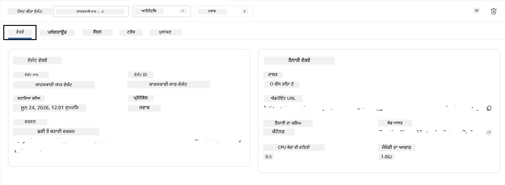

# ਮੋਡਿਊਲ 5 - ਫਾਉਂਡਰੀ ਏਜੰਟ ਸਰਵਿਸ 'ਤੇ ਤੈਨਾਤ ਕਰੋ

⏱️ ~10 ਮਿੰਟ

> ⚠️ **ਪਾਥ ਬੀ ਵਰਤੋਂਕਾਰ:** ਇਹ ਮੋਡਿਊਲ ਫਾਉਂਡਰੀ ਸਬਸਕ੍ਰਿਪਸ਼ਨ ਦੀ ਲੋੜ ਹੈ। ਜੇਕਰ ਤੁਸੀਂ ਫਾਉਂਡਰੀ ਲੋਕਲ ਵਰਤ ਰਹੇ ਹੋ, ਤਾਂ [ਮੋਡਿਊਲ 07 - ਸਾਰਾਂਸ਼](07-summary.md) 'ਤੇ ਜਾਓ। ਤੁਸੀਂ ਸਥਾਨਕ ਵਿਕਾਸ ਵਰਕਫਲੋ ਸਫਲਤਾਪੂਰਵਕ ਪੂਰਾ ਕੀਤਾ ਹੈ!

ਇਸ ਮੋਡਿਊਲ ਵਿੱਚ, ਤੁਸੀਂ ਆਪਣਾ ਸਥਾਨਕ ਤੌਰ 'ਤੇ ਪਰਖਿਆ ਗਿਆ ਏਜੰਟ ਮਾਈਕਰੋਸਾਫਟ ਫਾਉਂਡਰੀ 'ਤੇ **ਹੁਸਟਡ ਏਜੰਟ** ਵਜੋਂ ਤੈਨਾਤ ਕਰਦੇ ਹੋ। ਇਹ ਤੈਨਾਤੀ ਇੱਕ ਕੰਟੇਨਰ ਚਿੱਤਰ ਬਣਾਉਂਦੀ ਹੈ, ਇਸ ਨੂੰ ਅਜ਼ਿਊਰ ਕੰਟੇਨਰ ਰਜਿਸਟਰੀ 'ਚ ਧੱਕਦੀ ਹੈ, ਅਤੇ ਫਾਉਂਡਰੀ ਦੀ ਪ੍ਰਬੰਧਿਤ ਢਾਂਚੇ ਵਿੱਚ ਏਜੰਟ ਸ਼ੁਰੂ ਕਰਦੀ ਹੈ।

### ਤੈਨਾਤੀ ਪਾਈਪਲਾਈਨ

---

## ਪੂਰਵ ਸ਼ਰਤਾਂ ਦੀ ਜਾਂਚ

ਤੈਨਾਤੀ ਕਰਨ ਤੋਂ ਪਹਿਲਾਂ, ਯਕੀਨੀ ਬਣਾਓ:

- [ ] ਏਜੰਟ ਸਾਰੇ 3 ਸਥਾਨਕ ਸੈਨਾਰਿਯੋਜ਼ ਤੋਂ ਪਾਸ ਹੁੰਦਾ ਹੈ [ਮੋਡਿਊਲ 04](04-test-locally.md)
- [ ] ਤੁਹਾਡੇ ਕੋਲ ਪਰੋਜੈਕਟ ਪੱਧਰ ਤੇ **ਅਜ਼ਿਊਰ AI ਯੂਜ਼ਰ** ਰੋਲ ਹੈ ([ਮੋਡਿਊਲ 01, RBAC ਸੌਂਪਣਾ](01-setup.md#deploy-a-model--assign-rbac))
- [ ] ਤੁਸੀਂ VS ਕੋਡ ਵਿੱਚ ਅਜ਼ਿਊਰ ਵਿੱਚ ਸਾਈਨ ਇਨ ਹੋ ਚੁੱਕੇ ਹੋ (ਅਕਾਊਂਟ ਆਈਕਨ ਤੇ ਤੁਹਾਡਾ ਨਾਮ ਦਿਖਾਈ ਦੇ ਰਿਹਾ ਹੈ)

---

## ਕਦਮ 1: ਤੈਨਾਤੀ ਸ਼ੁਰੂ ਕਰੋ

### ਵਿਕਲਪ ਏ: ਏਜੰਟ ਇੰਸਪੈਕਟਰ ਤੋਂ ਤੈਨਾਤ ਕਰੋ (ਸਿਫਾਰਸ਼ ਕੀਤੀ)

ਜੇ ਏਜੰਟ ਇੰਸਪੈਕਟਰ ਖੁੱਲਾ ਹੈ (ਟੈਸਟਿੰਗ ਤੋਂ):
1. ਉੱਪਰ-ਸੱਜੇ ਕੋਨੇ ਵਿੱਚ **Deploy** ਬਟਨ ਤੇ ਕਲਿੱਕ ਕਰੋ (ਕਲਾਉਡ ਆਈਕਨ ↑).

### ਵਿਕਲਪ ਬੀ: ਕਮਾਂਡ ਪੈਲੇਟ ਤੋਂ ਤੈਨਾਤ ਕਰੋ

1. `Ctrl+Shift+P` ਦਬਾਓ → **Foundry Toolkit: Deploy Hosted Agent**.

---

## ਕਦਮ 2: ਤੈਨਾਤੀ ਕਾਨਫਿਗਰ ਕਰੋ

ਵਿਜ਼ਾਰਡ ਤੁਹਾਡੇ ਕੋਲ ਪੁੱਛੇਗਾ:

| ਪੁੱਛਤਾਛ | ਚੋਣ |
|--------|-----------|
| **ਸਬਸਕ੍ਰਿਪਸ਼ਨ** | ਤੁਹਾਡੀ ਅਜ਼ਿਊਰ ਸਬਸਕ੍ਰਿਪਸ਼ਨ |
| **ਟਾਰਗੇਟ ਪਰੋਜੈਕਟ** | ਤੁਹਾਡਾ ਫਾਉਂਡਰੀ ਪਰੋਜੈਕਟ (ਜਿਵੇਂ `workshop-agents`) |

자신의 에이전트를 ਕਾਨਫਿਗਰ ਕਰਨ ਲਈ **ਅਗਲਾ** 'ਤੇ ਕਲਿੱਕ ਕਰੋ।

| ਪੁੱਛਤਾਛ | ਚੋਣ |
|--------|-----------|
| **ਤੈਨਾਤੀ ਢੰਗ** | ਕੰਟੇਨਰ |
| **ਕੰਟੇਨਰ ਰਜਿਸਟਰੀ** | **ਡੀਫਾਲਟ ACR** (ਮਾਈਕਰੋਸਾਫਟ ਫਾਉਂਡਰੀ ਤੁਹਾਡੇ ਲਈ ਇੱਕ ਬਣਾਂਦਾ ਅਤੇ ਸੰਭਾਲਦਾ ਹੈ) |
| **ਤੈਨਾਤੀ ਲਈ** | ਨਵਾਂ ਏਜੰਟ (ਨਾਮ, `executive-summary-agent`) |

ਆਪਣੇ ਏਜੰਟ ਦੀ ਸਮੀਖਿਆ ਅਤੇ ਤੈਨਾਤੀ ਲਈ **ਅਗਲਾ** 'ਤੇ ਕਲਿੱਕ ਕਰੋ।

| ਪੁੱਛਤਾਛ | ਚੋਣ |
|--------|-----------|
| **CPU ਅਤੇ ਮੈਮੋਰੀ** | **0.25 CPU ਕੋਰ, 0.5 Gi ਮੈਮੋਰੀ** (ਵਰਕਸ਼ਾਪ ਲਈ ਕਾਫ਼ੀ) |

---

## ਕਦਮ 3: ਤੈਨਾਤੀ ਅਤੇ ਨਿਗਰਾਨੀ ਕਰੋ

1. **Deploy** 'ਤੇ ਕਲਿੱਕ ਕਰੋ।
2. **Output** ਪੈਨਲ ਨੂੰ ਦੇਖੋ (ਡ੍ਰਾਪਡਾਊਨ ਵਿੱਚੋਂ **Microsoft Foundry** ਚੁਣੋ)।
3. ਤੈਨਾਤੀ ਦੇ ਇਹ ਮੰਚਾਂ ਵਿੱਚ ਚਲਦੀ ਹੈ:
   - **Docker build** - ਤੁਹਾਡੇ Dockerfile ਤੋਂ ਕੰਟੇਨਰ ਬਣਾਉਂਦਾ ਹੈ
   - **Docker push** - ਚਿੱਤਰ ਨੂੰ ACR ਵਿੱਚ ਧੱਕਦਾ ਹੈ (ਪਹਿਲੀ ਵਾਰੀ 1–3 ਮਿੰਟ)
   - **Agent registration** - ਫਾਉਂਡਰੀ ਵਿੱਚ ਹੁਸਟਡ ਏਜੰਟ ਬਣਾਉਂਦਾ ਹੈ
   - **Container start** - ਸਿਸਟਮ-ਪ੍ਰਬੰਧਿਤ ਪਹਿਚਾਣ ਨਾਲ ਸ਼ੁਰੂ ਕਰਦਾ ਹੈ

4. ਜਦੋਂ ਮੁਕੰਮਲ ਹੋ ਜਾਵੇ, ਇੱਕ ਸੂਚਨਾ ਪ੍ਰਗਟ ਹੁੰਦੀ ਹੈ:
   > **my-agent ਸਫਲਤਾਪੂਰਵਕ ਤੈਨਾਤ ਕੀਤਾ ਗਿਆ ਹੈ।** `ਲੌਗ ਵੇਖੋ` `ਏਜੰਟ ਚਲਾਓ`

5. ਏਜੰਟ ਪਲੇਗ੍ਰਾਉਂਡ ਖੋਲ੍ਹਣ ਲਈ **Run agent** 'ਤੇ ਕਲਿੱਕ ਕਰੋ।

### ਤੈਨਾਤੀ ਸਥਿਤੀ ਦੀਆਂ ਕੀਮਤਾਂ

| ਸਥਿਤੀ | ਮਾਇਨਾ |
|--------|---------|
| **ਚੱਲ ਰਹੀ** | ਕੰਟੇਨਰ ਤਿਆਰ, ਏਜੰਟ ਜਵਾਬ ਦੇ ਰਿਹਾ ਹੈ |
| **ਮੁਲਤਵੀ** | ਕੰਟੇਨਰ ਸ਼ੁਰੂ ਹੋ ਰਿਹਾ ਹੈ - 30–60 ਸਕਿੰਟ ਦੇ ਲਈ ਉਡੀਕ ਕਰੋ |
| **ਵਿਫਲ** | ਲੌਗ ਚੈੱਕ ਕਰੋ (ਹੇਠਾਂ ਟ੍ਰਬਲਸ਼ੂਟਿੰਗ ਵੇਖੋ) |

---

## ਆਮ ਤੈਨਾਤੀ ਗਲਤੀਆਂ

| ਗਲਤੀ | ਮੁੱਖ ਕਾਰਣ | ਸੁਧਾਰ |
|-------|-----------|-----|
| `agents/write` ਅਨੁਮਤੀ ਨਕਾਰ ਦਿੱਤੀ ਗਈ | ਪ੍ਰੋਜੈਕਟ ਪੱਧਰ ਤੇ **ਅਜ਼ਿਊਰ AI ਯੂਜ਼ਰ** ਰੋਲ ਮੌਜੂਦ ਨਹੀਂ | [ਮੋਡਿਊਲ 01, RBAC ਸੌਂਪਣਾ](01-setup.md#deploy-a-model--assign-rbac) |
| Docker ਚੱਲ ਨਹੀਂ ਰਿਹਾ | Docker ਡੈਸਕਟਾਪ ਸ਼ੁਰੂ ਨਹੀਂ ਹੈ | Docker ਡੈਸਕਟਾਪ ਸ਼ੁਰੂ ਕਰੋ → `docker info` ਦੀ ਜਾਂਚ ਕਰੋ |
| ACR ਅਧਿਕਾਰ | ਪ੍ਰਬੰਧਿਤ ਪਹਿਚਾਣ ਚਿੱਤਰ ਪੂਲ ਨਹੀਂ ਕਰ ਸਕਦੀ | ਵੇਖੋ [ਮੋਡਿਊਲ 08 - ਟ੍ਰਬਲਸ਼ੂਟਿੰਗ](08-troubleshooting.md) |

---

### ✅ ਚੈੱਕਪਾਇਂਟ

- [ ] ਤੈਨਾਤੀ ਬਿਨਾ ਗਲਤੀਆਂ ਦੇ ਮੁਕੰਮਲ ਹੋਈ
- [ ] ਏਜੰਟ ਫਾਉਂਡਰੀ ਸਾਈਡਬਾਰ ਵਿੱਚ **Hosted Agents (Preview)** ਹੇਠਾਂ ਦਿਸਦਾ ਹੈ
- [ ] ਕੰਟੇਨਰ ਸਥਿਤੀ **ਚੱਲ ਰਹੀ** ਦਿਖਾਈ ਦਿੰਦੀ ਹੈ
- [ ] ਏਜੰਟ ਪਲੇਗ੍ਰਾਉਂਡ ਟੈਬ ਖੁੱਲੀ ਹੈ ਜਿਸ ਵਿੱਚ ਏਜੰਟ ਦੇ ਵੇਰਵੇ ਅਤੇ ਐਂਡਪੌਇੰਟ URL ਹਨ

---

**ਪਿਛਲਾ:** [04 - ਸਥਾਨਕ ਤੌਰ 'ਤੇ ਟੈਸਟ ਕਰੋ](04-test-locally.md) · **ਅਗਲਾ:** [06 - ਪਲੇਗ੍ਰਾਉਂਡ ਵਿੱਚ ਵੇਰੀਫਾਈ →](06-verify-in-playground.md)

---

<!-- CO-OP TRANSLATOR DISCLAIMER START -->
**ਅਸਵੀਕਾਰੋਪਣ**:
ਇਸ ਦਸਤਾਵੇਜ਼ ਦਾ ਅਨੁਵਾਦ ਏਆਈ ਅਨੁਵਾਦ ਸੇਵਾ [Co-op Translator](https://github.com/Azure/co-op-translator) ਦੀ ਵਰਤੋਂ ਕਰਕੇ ਕੀਤਾ ਗਿਆ ਹੈ। ਜਦੋਂ ਕਿ ਅਸੀਂ ਸਹੀਤਾਵਾਂ ਲਈ ਯਤਨਸ਼ੀਲ ਹਾਂ, ਕਿਰਪਾ ਕਰਕੇ ਧਿਆਨ ਰੱਖੋ ਕਿ ਸਵੈਚਾਲਿਤ ਅਨੁਵਾਦਾਂ ਵਿੱਚ ਗਲਤੀਆਂ ਜਾਂ ਅਸਮੱਤਿਆਵਾਂ ਹੋ ਸਕਦੀਆਂ ਹਨ। ਮੂਲ ਦਸਤਾਵੇਜ਼ ਆਪਣੀ ਮੂਲ ਭਾਸ਼ਾ ਵਿੱਚ ਅਧਿਕਾਰਕ ਸਰੋਤ ਮੰਨਿਆ ਜਾਣਾ ਚਾਹੀਦਾ ਹੈ। ਜਰੂਰੀ ਜਾਣਕਾਰੀ ਲਈ, ਪੇਸ਼ੇਵਰ ਮਨੁੱਖੀ ਅਨੁਵਾਦ ਦੀ ਸਿਫ਼ਾਰਸ਼ ਕੀਤੀ ਜਾਂਦੀ ਹੈ। ਅਸੀਂ ਇਸ ਅਨੁਵਾਦ ਦੇ ਉਪਯੋਗ ਤੋਂ ਪੈਦਾ ਹੋਣ ਵਾਲੀਆਂ ਕਿਸੇ ਵੀ ਗਲਤਫਹਿਮੀਆਂ ਜਾਂ ਗਲਤ ਵਿਆਖਿਆਵਾਂ ਲਈ ਜਵਾਬਦੇਹ ਨਹੀਂ ਹਾਂ।
<!-- CO-OP TRANSLATOR DISCLAIMER END -->