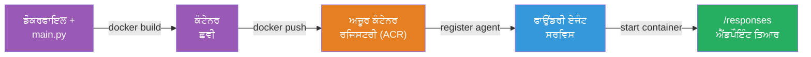
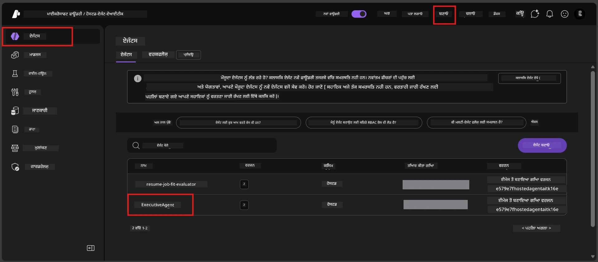

# Module 6 - Foundry Agent Service ਤੇ ਡਿਪਲੋਇ ਕਰੋ

ਇਸ ਮਾਡਿਊਲ ਵਿੱਚ, ਤੁਸੀਂ ਆਪਣੀ ਲੋਕਲ ਤੌਰ 'ਤੇ ਟੈਸਟ ਕੀਤੀ ਗਈ ਏਜੰਟ ਨੂੰ Microsoft Foundry 'ਚ ਇੱਕ [**Hosted Agent**](https://learn.microsoft.com/azure/foundry/agents/concepts/hosted-agents) ਵਜੋਂ ਡਿਪਲੋਇ ਕਰਦੇ ਹੋ। ਡਿਪਲੋਇਮੈਂਟ ਪ੍ਰਕਿਰਿਆ ਤੁਹਾਡੇ ਪ੍ਰੋਜੈਕਟ ਤੋਂ ਇੱਕ ਡੋਕਰ ਕੰਟੇਨਰ ਇਮੇਜ ਬਣਾਉਂਦੀ ਹੈ, ਇਸਨੂੰ [Azure Container Registry (ACR)](https://learn.microsoft.com/azure/container-registry/container-registry-intro) 'ਚ ਧੱਕਦੀ ਹੈ, ਅਤੇ [Foundry Agent Service](https://learn.microsoft.com/azure/foundry/agents/overview) ਵਿੱਚ ਇੱਕ ਹੋਸਟ ਕੀਤੀ ਏਜੰਟ ਵਰਜਨ ਬਣਾਉਂਦੀ ਹੈ।

### Deployment pipeline


---

## Prequisites check

ਡਿਪਲੋਇਮੈਂਟ ਤੋਂ ਪਹਿਲਾਂ, ਹੇਠਾਂ ਦਿੱਤੇ ਹਰ ਇਕ ਆਈਟਮ ਨੂੰ ਜਾਂਚੋ। ਇਹਨਾਂ ਨੂੰ ਛੱਡਣਾ ਡਿਪਲੋਇਮੈਂਟ ਦੀਆਂ ਅਸਫਲਤਾਵਾਂ ਦਾ ਸਭ ਤੋਂ ਸਧਾਰਣ ਕਾਰਨ ਹੈ।

1. **Agent ਨੇ ਸਥਾਨਕ ਸਮੋਕ ਟੈਸਟ ਪਾਸ ਕੀਤੇ ਹਨ:**
   - ਤੁਸੀਂ [Module 5](05-test-locally.md) ਵਿੱਚ ਸਾਰੇ 4 ਟੈਸਟ ਪੂਰੇ ਕੀਤੇ ਹਨ ਅਤੇ ਏਜੰਟ ਸਹੀ ਜਵਾਬ ਦਿੱਤਾ।

2. **ਤੁਹਾਡੇ ਕੋਲ [Azure AI User](https://learn.microsoft.com/azure/foundry/concepts/rbac-foundry#built-in-roles) ਰੋਲ ਹੈ:**
   - ਇਹ [Module 2, Step 3](02-create-foundry-project.md) ਵਿੱਚ ਨਿਰਧਾਰਿਤ ਕੀਤਾ ਗਿਆ ਸੀ। ਜੇ ਤੁਸੀਂ ਨਿਸ਼ਚਿਤ ਨਹੀਂ ਹੋ, ਤਾਂ ਹੁਣੇ ਜਾਂਚੋ:
   - Azure ਪੋਰਟਲ → ਤੁਹਾਡੇ Foundry **ਪ੍ਰੋਜੈਕਟ** ਸਰੋਤ → **Access control (IAM)** → **Role assignments** ਟੈਬ → ਆਪਣਾ ਨਾਮ ਖੋਜੋ → ਪੁਸ਼ਟੀ ਕਰੋ ਕਿ **Azure AI User** ਦਰਜ ਹੈ।

3. **ਤੁਸੀਂ VS Code ਵਿੱਚ Azure ਵਿੱਚ ਸਾਇਨ ਇਨ ਹੋ:**
   - VS Code ਦੇ ਖੱਬੇ-ਥੱਲੇ ਕੋਣ ਵਿੱਚ Accounts ਆਈਕਨ ਨੂੰ ਚੈੱਕ ਕਰੋ। ਤੁਹਾਡਾ ਖਾਤਾ ਨਾਮ ਦਿਖਣਾ ਚਾਹੀਦਾ ਹੈ।

4. **(ਵਿਕਲਪਿਕ) Docker Desktop ਚੱਲ ਰਿਹਾ ਹੈ:**
   - Docker ਸਿਰਫ ਤਦੋਂ ਜਰੂਰੀ ਹੈ ਜਦੋਂ Foundry ਵਿਸ਼ਤਾਰ ਤੁਹਾਡੇ ਤੋਂ ਸਥਾਨਕ ਬਿਲਡ ਲਈ ਪੁੱਛਦਾ ਹੈ। ਜ਼ਿਆਦਾਤਰ ਕੇਸਾਂ ਵਿੱਚ, ਵਿਸ਼ਤਾਰ ਡਿਪਲੋਇਮੈਂਟ ਦੌਰਾਨ ਕੰਟੇਨਰ ਬਿਲਡ ਆਪਣੇ ਆਪ ਸਾਂਭਦਾ ਹੈ।
   - ਜੇ Docker ਇੰਸਟਾਲ ਹੈ, ਤਦ ਇਹ ਚੱਲ ਰਿਹਾ ਹੈ ਕਿ ਨਹੀਂ ਜਾਂਚੋ: `docker info`

---

## Step 1: ਡਿਪਲੋਇਮੈਂਟ ਸ਼ੁਰੂ ਕਰੋ

ਤੁਹਾਡੇ ਕੋਲ ਡਿਪਲੋਇ ਕਰਨ ਦੇ ਦੋ ਤਰੀਕੇ ਹਨ - ਦੋਹਾਂ ਨਾਲ ਅਖੀਰਕਾਰ ਇੱਕੋ ਨਤੀਜਾ ਨਿਕਲਦਾ ਹੈ।

### ਵਿਕਲਪ A: Agent Inspector ਤੋਂ ਡਿਪਲੋਇ ਕਰੋ (ਸਿਫਾਰਸ਼ੀ)

ਜੇ ਤੁਸੀਂ ਏਜੰਟ ਨੂੰ ਡੀਬੱਗਰ (F5) ਨਾਲ ਚਲਾ ਰਹੇ ਹੋ ਅਤੇ Agent Inspector ਖੁੱਲ੍ਹਾ ਹੈ:

1. Agent Inspector ਪੈਨਲ ਦੇ **ਸਿਖਰ-ਸੱਜੇ ਕੋਨੇ** ਵਿੱਚ ਦੇਖੋ।
2. **Deploy** ਬਟਨ (ਬੱਦਲ ਆਈਕਨ ਉੱਪਰ ਤੀਰ ↑ ਵਾਲੀ) 'ਤੇ ਕਲਿੱਕ ਕਰੋ।
3. ਡਿਪਲੋਇਮੈਂਟ ਵਿਜ਼ਾਰਡ ਖੁੱਲ੍ਹੇਗਾ।

### ਵਿਕਲਪ B: Command Palette ਤੋਂ ਡਿਪਲੋਇ ਕਰੋ

1. `Ctrl+Shift+P` ਦਬਾ ਕੇ **Command Palette** ਖੋਲ੍ਹੋ।
2. ਟਾਈਪ ਕਰੋ: **Microsoft Foundry: Deploy Hosted Agent** ਅਤੇ ਚੁਣੋ।
3. ਡਿਪਲੋਇਮੈਂਟ ਵਿਜ਼ਾਰਡ ਖੁੱਲ੍ਹੇਗਾ।

---

## Step 2: ਡਿਪਲੋਇਮੈਂਟ ਕਾਨਫਿਗਰ ਕਰੋ

ਡਿਪਲੋਇਮੈਂਟ ਵਿਜ਼ਾਰਡ ਤੁਹਾਨੂੰ ਕਾਨਫਿਗ ਰਾਹੀਂ ਲੈ ਕੇ ਚਲਦਾ ਹੈ। ਹਰ ਪ੍ਰੰਪਟ ਨੂੰ ਭਰੋ:

### 2.1 ਨਿਸ਼ਾਨਾ ਪ੍ਰੋਜੈਕਟ ਚੁਣੋ

1. ਇੱਕ ਡ੍ਰਾਪਡਾਊਨ ਤੁਹਾਡੇ Foundry ਪ੍ਰੋਜੈਕਟ ਦਿਖਾਏਗਾ।
2. Module 2 ਵਿੱਚ ਬਣਾਇਆ ਪ੍ਰੋਜੈਕਟ ਚੁਣੋ (ਜਿਵੇਂ ਕਿ `workshop-agents`)।

### 2.2 ਕੰਟੇਨਰ ਏਜੰਟ ਫਾਈਲ ਚੁਣੋ

1. ਤੁਹਾਨੂੰ ਏਜੰਟ ਦੀ ਐਂਟਰੀ ਪਾਇੰਟ ਚੁਣਨ ਲਈ ਪੁੱਛਿਆ ਜਾਵੇਗਾ।
2. **`main.py`** (Python) ਚੁਣੋ - ਇਹ ਫਾਈਲ ਵਿਜ਼ਾਰਡ ਦੁਆਰਾ ਤੁਹਾਡੇ ਏਜੰਟ ਪ੍ਰੋਜੈਕਟ ਦੀ ਪਛਾਣ ਲਈ ਵਰਤੀ ਜਾਂਦੀ ਹੈ।

### 2.3 ਸ੍ਰੋਤ ਕਾਨਫਿਗਰ ਕਰੋ

| ਸੈਟਿੰਗ | ਸਿਫ਼ਾਰਸ਼ੀ ਮੁੱਲ | ਨੋਟਸ |
|---------|------------------|-------|
| **CPU** | `0.25` | ਮੂਲ, ਵਰਕਸ਼ਾਪ ਲਈ ਕਾਫੀ। ਪ੍ਰੋਡਕਸ਼ਨ ਲਈ ਵੱਧ ਕਰੋ |
| **Memory** | `0.5Gi` | ਮੂਲ, ਵਰਕਸ਼ਾਪ ਲਈ ਕਾਫੀ |

ਇਹ `agent.yaml` ਵਿੱਚ ਦਿੱਤੇ ਮੁੱਲਾਂ ਨਾਲ ਮਿਲਦੇ ਹਨ। ਤੁਸੀਂ ਡਿਫਾਲਟ ਸਮਝ ਕੇ ਪੂਰਾ ਕਰ ਸਕਦੇ ਹੋ।

---

## Step 3: ਪੁਸ਼ਟੀ ਕਰੋ ਅਤੇ ਡਿਪਲੋਇ ਕਰੋ

1. ਵਿਜ਼ਾਰਡ ਡਿਪਲੋਇਮੈਂਟ ਸੰਖੇਪ ਦਿਖਾਉਂਦਾ ਹੈ ਜਿਸ ਵਿੱਚ:
   - ਨਿਸ਼ਾਨਾ ਪ੍ਰੋਜੈਕਟ ਨਾਮ
   - ਏਜੰਟ ਨਾਮ (`agent.yaml` ਤੋਂ)
   - ਕੰਟੇਨਰ ਫਾਈਲ ਅਤੇ ਸ੍ਰੋਤ
2. ਸੰਖੇਪ ਨੂੰ ਸਮੀਖਿਆ ਕਰੋ ਅਤੇ **Confirm and Deploy** (ਜਾਂ **Deploy**) 'ਤੇ ਕਲਿੱਕ ਕਰੋ।
3. VS Code ਵਿੱਚ ਪ੍ਰਗਤੀ ਵੇਖੋ।

### ਡਿਪਲੋਇਮੈਂਟ ਦੌਰਾਨ ਕੀ ਹੁੰਦਾ ਹੈ (ਕਦਮ ਦਰ ਕਦਮ)

ਡਿਪਲੋਇਮੈਂਟ ਕਈ ਕਦਮਾਂ ਵੱਲੋਂ ਬਣਿਆ ਹੈ। VS Code ਦੇ **Output** ਪੈਨਲ ਨੂੰ ਦੇਖੋ (ਡ੍ਰਾਪਡਾਊਨ ਵਿੱਚੋਂ "Microsoft Foundry" ਚੁਣੋ):

1. **Docker build** - VS Code ਤੁਹਾਡੇ `Dockerfile` ਵਿੱਚੋਂ ਡੋਕਰ ਕੰਟੇਨਰ ਇਮੇਜ ਬਣਾਉਂਦਾ ਹੈ। ਤੁਹਾਨੂੰ ਡੋਕਰ ਲੇਅਰ ਸੁਨੇਹੇ ਵੇਖਣ ਨੂੰ ਮਿਲਣਗੇ:
   ```
   Step 1/6 : FROM python:<version>-slim
   Step 2/6 : WORKDIR /app
   ...
   Successfully built abc123def456
   ```

2. **Docker push** - ਇਮੇਜ ਤੁਹਾਡੇ Foundry ਪ੍ਰੋਜੈਕਟ ਨਾਲ ਸੰਬੰਧਿਤ **Azure Container Registry (ACR)** 'ਚ ਧੱਕੀ ਜਾਂਦੀ ਹੈ। ਪਹਿਲੀ ਵਾਰੀ ਡਿਪਲੋਇ 'ਤੇ ਇਹ 1-3 ਮਿੰਟ ਲੱਗ ਸਕਦੇ ਹਨ (ਬੇਸ ਇਮੇਜ >100MB ਹੈ)।

3. **Agent registration** - Foundry Agent Service ਇੱਕ ਨਵਾਂ ਹੋਸਟ ਕੀਤਾ ਏਜੰਟ ਬਣਾਉਂਦੀ ਹੈ (ਜਾਂ ਜੇ ਏਜੰਟ ਪਹਿਲਾਂ ਮੌਜੂਦ ਹੈ ਤਾਂ ਇੱਕ ਨਵਾਂ ਵਰਜਨ)। `agent.yaml` ਦਾ ਮੈਟਾਡੇਟਾ ਵਰਤਿਆ ਜਾਂਦਾ ਹੈ।

4. **Container start** - Foundry ਦੇ ਪ੍ਰਬੰਧਿਤ ਢਾਂਚੇ ਵਿੱਚ ਕੰਟੇਨਰ ਸ਼ੁਰੂ ਹੁੰਦਾ ਹੈ। ਪਲੇਟਫਾਰਮ ਇੱਕ [ਸिस्टम-ਪ੍ਰਬੰਧਿਤ ਪਛਾਣ](https://learn.microsoft.com/azure/foundry/agents/concepts/agent-identity) ਦਿੰਦਾ ਹੈ ਅਤੇ `/responses` ਐਂਡਪੌਇੰਟ ਖੋਲ੍ਹਦਾ ਹੈ।

> **ਪਹਿਲਾ ਡਿਪਲੋਇਮੈਂਟ ਹੌਲੀ-ਹੌਲੀ ਹੁੰਦਾ ਹੈ** (ਡੋਕਰ ਨੂੰ ਸਾਰੇ ਲੇਅਰ ਧੱਕਣੇ ਪੈਂਦੇ ਹਨ)। ਬਾਅਦ ਦਾ ਡਿਪਲੋਇ ਜ਼ਿਆਦਾ ਤੇਜ਼ ਹੁੰਦਾ ਹੈ ਕਿਉਂਕਿ ਡੌਕਰ ਬਦਲੇ ਨਾ ਗਏ ਲੇਅਰਾਂ ਨੂੰ ਕੈਸ਼ ਕਰਦਾ ਹੈ।

---

## Step 4: ਡਿਪਲੋਇਮੈਂਟ ਸਥਿਤੀ ਦੀ ਪੁਸ਼ਟੀ ਕਰੋ

ਡਿਪਲੋਇਮੈਂਟ ਕਮਾਂਡ ਮੁਕੰਮਲ ਹੋਣ ਤੋਂ ਬਾਅਦ:

1. Activity Bar ਵਿੱਚ Foundry ਆਈਕਨ 'ਤੇ ਕਲਿੱਕ ਕਰਕੇ **Microsoft Foundry** ਸਾਈਡਬਾਰ ਖੋਲ੍ਹੋ।
2. ਆਪਣੇ ਪ੍ਰੋਜੈਕਟ ਹੇਠਾਂ **Hosted Agents (Preview)** ਸੈਕਸ਼ਨ ਨੂੰ ਵਧਾਓ।
3. ਤੁਹਾਨੂੰ ਆਪਣਾ ਏਜੰਟ ਨਾਮ (ਜਿਵੇਂ `ExecutiveAgent` ਜਾਂ `agent.yaml` ਤੋਂ ਨਾਮ) ਦਿੱਖਾਈ ਦੇਵੇਗਾ।
4. **ਏਜੰਟ ਨਾਮ** 'ਤੇ ਕਲਿੱਕ ਕਰੋ ਇਹ ਫੈਲਾਇਏ।
5. ਤੁਹਾਨੂੰ ਇੱਕ ਜਾਂ ਹੋਰ **ਵਰਜਨ** (ਜਿਵੇਂ `v1`) ਵੱਖ-ਵੱਖ ਵੇਖਣ ਨੂੰ ਮਿਲਣਗੇ।
6. ਵਰਜਨ 'ਤੇ ਕਲਿੱਕ ਕਰਕੇ **Container Details** ਵੇਖੋ।
7. **Status** ਖੇਤਰ ਦੀ ਜਾਂਚ ਕਰੋ:

   | ਸਥਿਤੀ | ਅਰਥ |
   |--------|---------|
   | **Started** ਜਾਂ **Running** | ਕੰਟੇਨਰ ਚੱਲ ਰਿਹਾ ਹੈ ਅਤੇ ਏਜੰਟ ਤਿਆਰ ਹੈ |
   | **Pending** | ਕੰਟੇਨਰ ਸ਼ੁਰੂ ਹੋ ਰਿਹਾ ਹੈ (30-60 ਸਕਿੰਟ ਦਾ ਇੰਤਜ਼ਾਰ ਕਰੋ) |
   | **Failed** | ਕੰਟੇਨਰ ਸ਼ੁਰੂ ਨਹੀਂ ਹੋ ਸਕਿਆ (ਲੌਗ ਚੈਕ ਕਰੋ - ਹੇਠਾਂ troubleshooting ڏੇਖੋ) |



> **ਜੇ ਤੁਹਾਨੂੰ 2 ਮਿੰਟ ਤੋਂ ਵੱਧ ਸਮੇਂ ਲਈ "Pending" ਦਿਖਾਈ ਦੇ ਰਿਹਾ ਹੈ:** ਕੰਟੇਨਰ ਹੋ ਸਕਦਾ ਹੈ ਕਿ ਬੇਸ ਇਮੇਜ ਖਿੱਚ ਰਿਹਾ ਹੋਵੇ। ਕੁਝ ਹੋਰ ਸਮਾਂ ਇੰਤਜ਼ਾਰ ਕਰੋ। ਜੇ ਇਹਰਹੀ ਰਿਹਾ ਤਾਂ ਕੰਟੇਨਰ ਲੌਗਜ਼ ਚੈਕ ਕਰੋ।

---

## ਆਮ ਡਿਪਲੋਇਮੈਂਟ ਗਲਤੀਆਂ ਤੇ ਹੱਲ

### ਗਲਤੀ 1: Permission denied - `agents/write`

```
Error: lacks the required data action 
Microsoft.CognitiveServices/accounts/AIServices/agents/write 
to perform POST /api/projects/{projectName}/assistants operation.
```

**ਮੂਲ ਕਾਰਨ:** ਤੁਹਾਡੇ ਕੋਲ **ਪ੍ਰੋਜੈਕਟ** ਲੈਵਲ 'ਤੇ `Azure AI User` ਰੋਲ ਨਹੀਂ ਹੈ।

**ਕਦਮ ਬਦ ਕਦਮ ਹੱਲ:**

1. [https://portal.azure.com](https://portal.azure.com) ਖੋਲ੍ਹੋ।
2. ਖੋਜ ਬਾਰ ਵਿੱਚ ਆਪਣਾ Foundry **ਪ੍ਰੋਜੈਕਟ** ਨਾਮ ਟਾਈਪ ਕਰੋ ਅਤੇ ਉਸ 'ਤੇ ਕਲਿੱਕ ਕਰੋ।
   - **ਸਾਵਧਾਨ:** ਯਕੀਨੀ ਬਣਾਓ ਕਿ ਤੁਸੀਂ **ਪ੍ਰੋਜੈਕਟ** ਸਰੋਤ (ਪ੍ਰਕਾਰ: "Microsoft Foundry project") 'ਤੇ ਜਾ ਰਹੇ ਹੋ, ਨਾ ਕਿ ਮਾਤਾ ਖਾਤਾ/ਹੱਬ ਸਰੋਤ 'ਤੇ।
3. ਖੱਬੇ ਨੇਵੀਗੇਸ਼ਨ ਵਿੱਚ **Access control (IAM)** 'ਤੇ ਕਲਿੱਕ ਕਰੋ।
4. **+ Add** → **Add role assignment** 'ਤੇ ਕਲਿੱਕ ਕਰੋ।
5. **Role** ਟੈਬ ਵਿੱਚ [**Azure AI User**](https://learn.microsoft.com/azure/foundry/concepts/rbac-foundry#built-in-roles) ਖੋਜੋ ਅਤੇ ਚੁਣੋ। ਫਿਰ **Next** 'ਤੇ ਕਲਿੱਕ ਕਰੋ।
6. **Members** ਟੈਬ ਵਿੱਚ **User, group, or service principal** ਚੁਣੋ।
7. **+ Select members** 'ਤੇ ਕਲਿੱਕ ਕਰੋ, ਆਪਣਾ ਨਾਮ/ਈਮੇਲ ਖੋਜੋ, ਆਪਣਾ ਨਾਮ ਚੁਣੋ ਅਤੇ **Select** ਕਲਿੱਕ ਕਰੋ।
8. **Review + assign** 'ਤੇ ਕਲਿੱਕ ਕਰੋ, ਫਿਰ ਦੁਬਾਰਾ **Review + assign**।
9. ਰੋਲ ਅਸਾਈਨਮੈਂਟ ਦੇ ਫੈਲਣ ਲਈ 1-2 ਮਿੰਟ ਉਡੀਕੋ।
10. **ਡਿਪਲੋਇਮੈਂਟ ਮੁੜ ਕੋਸ਼ਿਸ਼ ਕਰੋ** Step 1 ਤੋਂ।

> ਇਹ ਰੋਲ **ਪ੍ਰੋਜੈਕਟ** ਸਕੋਪ 'ਤੇ ਹੋਣਾ ਚਾਹੀਦਾ ਹੈ, ਕੇਵਲ ਖਾਤਾ ਸਕੋਪ 'ਤੇ ਨਹੀਂ। ਇਹ ਡਿਪਲੋਇਮੈਂਟ ਅਸਫਲ ਹੋਣ ਦਾ ਸਭ ਤੋਂ ਆਮ ਕਾਰਨ ਹੈ।

### ਗਲਤੀ 2: Docker ਚੱਲ ਨਹੀਂ ਰਿਹਾ

```
Error: Docker build failed / Cannot connect to Docker daemon
```

**ਹੱਲ:**
1. Docker Desktop ਚਾਲੂ ਕਰੋ (ਆਪਣੇ Start ਮੇਨੂ ਜਾਂ ਸਿਸਟਮ ਟਰੇ ਵਿੱਚ ਲੱਭੋ)।
2. ਇਹ "Docker Desktop is running" ਦਿਖਾਉਣ ਤੱਕ ਉਡੀਕੋ (30-60 ਸਕਿੰਟ)।
3. ਜਾਂਚ ਕਰੋ: ਇੱਕ ਟਰਮੀਨਲ ਵਿੱਚ `docker info` ਦਬਾਓ।
4. **Windows ਖਾਸ:** Docker Desktop ਸੈਟਿੰਗਾਂ 'ਚ ਜਾਓ → **General** → **Use the WSL 2 based engine** ਯਕੀਨੀ ਬਣਾਓ ਕਿ ਚਾਲੂ ਹੈ।
5. ਡਿਪਲੋਇਮੈਂਟ ਮੁੜ ਕੋਸ਼ਿਸ਼ ਕਰੋ।

### ਗਲਤੀ 3: ACR authorization - `AcrPullUnauthorized`

```
Error: AcrPullUnauthorized
```

**ਮੂਲ ਕਾਰਨ:** Foundry ਪ੍ਰੋਜੈਕਟ ਦੀ ਮੈਨੇਜ ਕੀਤੀ ਪਛਾਣ ਨੂੰ ਕੰਟੇਨਰ ਰਜਿਸਟਰੀ ਤੋں ਪੂਲ ਐਕਸੈਸ ਨਹੀਂ ਮਿਲੀ।

**ਹੱਲ:**
1. Azure ਪੋਰਟਲ ਵਿੱਚ ਆਪਣੇ **[Container Registry](https://learn.microsoft.com/azure/container-registry/container-registry-intro)** 'ਤੇ ਜਾਓ (ਇਹ ਤੁਹਾਡੇ Foundry ਪ੍ਰੋਜੈਕਟ ਦੇ ਇੱਕੋ ਰਿਸੋਰਸ ਗਰੁੱਪ ਵਿੱਚ ਹੈ)।
2. **Access control (IAM)** → **Add** → **Add role assignment** 'ਤੇ ਜਾਓ।
3. **[AcrPull](https://learn.microsoft.com/azure/container-registry/container-registry-roles)** ਰੋਲ ਚੁਣੋ।
4. ਮੈਂਬਰਾਂ 'ਚੋਂ **Managed identity** ਨੂੰ ਚੁਣੋ → Foundry ਪ੍ਰੋਜੈਕਟ ਦੀ ਮੈਨੇਜ ਕੀਤੀ ਪਛਾਣ ਲੱਭੋ।
5. **Review + assign**।

> ਇਹ ਆਮ ਤੌਰ ਤੇ Foundry ਵਿਸ਼ਤਾਰ ਦੁਆਰਾ ਆਟੋਮੈਟਿਕ ਤੌਰ ਤੇ ਸੈੱਟ ਕੀਤਾ ਜਾਂਦਾ ਹੈ। ਜੇ ਇਹ ਗਲਤੀ ਆਏ, ਤਾਂ ਆਟੋਮੈਟਿਕ ਸੈਟਅੱਪ ਵਿੱਚ ਕੋਈ ਗੜਬੜ ਹੋ ਸਕਦੀ ਹੈ।

### ਗਲਤੀ 4: Container platform mismatch (Apple Silicon)

ਜੇ Apple Silicon Mac (M1/M2/M3) ਤੋਂ ਡਿਪਲੋਇ ਕਰ ਰਹੇ ਹੋ, ਤਾਂ ਕੰਟੇਨਰ ਨੂੰ `linux/amd64` ਲਈ ਬਣਾਉਣਾ ਚਾਹੀਦਾ ਹੈ:

```bash
docker build --platform linux/amd64 -t myagent:v1 .
```

> Foundry ਵਿਸ਼ਤਾਰ ਵੱਲੋਂ ਇਹ ਬਹੁਤ ਸਾਰੇ ਯੂਜ਼ਰਾਂ ਲਈ ਆਪੋਆਪ ਸੰਭਾਲਿਆ ਜਾਂਦਾ ਹੈ।

---

### Checkpoint

- [ ] VS Code ਵਿੱਚ ਡਿਪਲੋਇਮੈਂਟ ਕਮਾਂਡ ਬਿਨਾ ਗਲਤੀਆਂ ਦੇ ਮੁਕੰਮਲ ਹੋਈ
- [ ] Foundry ਸਾਈਡਬਾਰ ਵਿੱਚ **Hosted Agents (Preview)** ਹੇਠਾਂ ਏਜੰਟ ਦਿੱਖਾਈ ਦਿੱਤਾ
- [ ] ਤੁਸੀਂ ਏਜੰਟ 'ਤੇ ਕਲਿੱਕ ਕੀਤਾ → ਇੱਕ ਵਰਜਨ ਚੁਣਿਆ → **Container Details** ਦੇਖੇ
- [ ] ਕੰਟੇਨਰ ਸਥਿਤੀ **Started** ਜਾਂ **Running** ਦਿਖਾਈ ਦਿੱਤੀ
- [ ] (ਜੇ ਗਲਤੀਆਂ ਹੋਈਆਂ) ਤਸੀਂ ਗਲਤੀ ਪਛਾਣੀ, ਹੱਲ ਲਾਇਆ, ਅਤੇ ਦੁਬਾਰਾ ਡਿਪਲੋਇ ਕੀਤਾ

---

**ਪਿਛਲਾ:** [05 - Test Locally](05-test-locally.md) · **ਅਗਲਾ:** [07 - Verify in Playground →](07-verify-in-playground.md)

---

<!-- CO-OP TRANSLATOR DISCLAIMER START -->
**ਅਣਾਉਣ**:  
ਇਹ ਦਸਤਾਵੇਜ਼ AI ਅਨੁਵਾਦ ਸੇਵਾ [Co-op Translator](https://github.com/Azure/co-op-translator) ਦੀ ਵਰਤੋਂ ਕਰਕੇ ਅਨੁਵਾਦ ਕੀਤਾ ਗਿਆ ਹੈ। ਜਦੋਂ ਕਿ ਅਸੀਂ ਸਹੀਤਾ ਲਈ ਕੋਸ਼ਿਸ਼ ਕਰਦੇ ਹਾਂ, ਕਿਰਪਾ ਕਰਕੇ ਇਹ ਜਾਣੋ ਕਿ ਸਵੈਚਾਲਿਤ ਅਨੁਵਾਦਾਂ ਵਿੱਚ ਗਲਤੀਆਂ ਜਾਂ ਅਸਥਿਰਤਾਵਾਂ ਹੋ ਸਕਦੀਆਂ ਹਨ। ਮੂਲ ਦਸਤਾਵੇਜ਼ ਆਪਣੇ ਮੂਲ ਭਾਸ਼ਾ ਵਿੱਚ ਸਰਵਪ੍ਰਮਾਣਿਕ ਸਰੋਤ ਮੰਨਿਆ ਜਾਣਾ ਚਾਹੀਦਾ ਹੈ। ਜਰੂਰੀ ਜਾਣਕਾਰੀ ਲਈ, ਪੇਸ਼ੇਵਰ ਮਨੁੱਖੀ ਅਨੁਵਾਦ ਦੀ ਸਿਫਾਰਸ਼ ਕੀਤੀ ਜਾਂਦੀ ਹੈ। ਇਸ ਅਨੁਵਾਦ ਦੇ ਇਸਤੇਮਾਲ ਤੋਂ ਉਤਪੰਨ ਕਿਸੇ ਵੀ ਗਲਤਫਹਮੀ ਜਾਂ ਭ੍ਰਮ ਲਈ ਅਸੀਂ ਜ਼ਿੰਮੇਵਾਰ ਨਹੀਂ ਹਾਂ।
<!-- CO-OP TRANSLATOR DISCLAIMER END -->