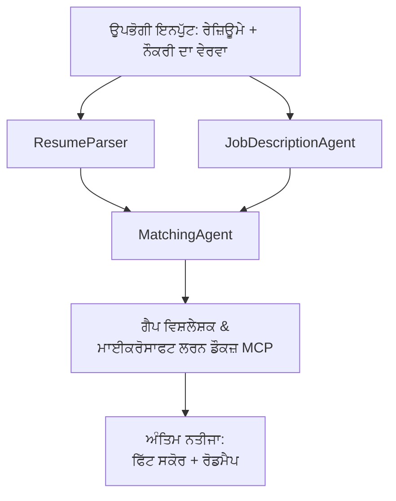

# PersonalCareerCopilot - Resume → ਨੌਕਰੀ ਲਈ ਫਿੱਟਤਾ ਮੂਲਾਂਕਣਕਾਰ

ਇੱਕ ਬਹੁ-ਏਜੰਟ ਵਰਕਫਲੋ ਜੋ ਇਹ ਮੁਲਾਂਕਣ ਕਰਦਾ ਹੈ ਕਿ ਇੱਕ ਰੇਜ਼ਿਊਮ ਇੱਕ ਨੌਕਰੀ ਦੇ ਵਰਣਨ ਨਾਲ ਕਿੰਨਾ ਠੀਕ ਮਿਲਦਾ ਹੈ, ਫਿਰ ਖ਼ਾਸ ਸਿੱਖਣ ਦਾ ਰੋਡਮੇਪ ਤਿਆਰ ਕਰਦਾ ਹੈ ਜੋ ਖਾਲੀਆਂ ਜਗ੍ਹਾਂ ਨੂੰ ਪੂਰ ਕਰੇ।

---

## ਏਜੰਟ

| ਏਜੰਟ | ਭੂਮਿਕਾ | ਸਾਜ਼ੋ-ਸਾਮਾਨ |
|-------|------|-------|
| **ResumeParser** | ਰੇਜ਼ਿਊਮ ਟੈਕਸਟ ਤੋਂ ਸੰਰਚਿਤ ਕੌਸ਼ਲ, ਅਨੁਭਵ, ਸਰਟੀਫਿਕੇਸ਼ਨ ਕੱਢਦਾ ਹੈ | - |
| **JobDescriptionAgent** | ਨੌਕਰੀ ਦੇ ਵਰਣਨ ਤੋਂ ਲੋੜੀਂਦੇ/ਪਸੰਦੀਦਾ ਕੌਸ਼ਲ, ਅਨੁਭਵ, ਸਰਟੀਫਿਕੇਸ਼ਨ ਕੱਢਦਾ ਹੈ | - |
| **MatchingAgent** | ਪ੍ਰੋਫਾਈਲ ਦੀ ਤੁਲਨਾ ਲੋੜਾਂ ਨਾਲ ਕਰਦਾ ਹੈ → ਫਿੱਟ ਸਕੋਰ (0-100) + ਮਿਲੀ/ਗਾਇਬ ਕੌਸ਼ਲ | - |
| **GapAnalyzer** | Microsoft Learn ਸਰੋਤਾਂ ਨਾਲ ਖ਼ਾਸ ਸਿੱਖਣ ਦਾ ਰੋਡਮੇਪ ਤਿਆਰ ਕਰਦਾ ਹੈ | `search_microsoft_learn_for_plan` (MCP) |

## ਵਰਕਫਲੋ


---

## ਤੇਜ਼ ਸ਼ੁਰੂਆਤ

### 1. ਵਾਤਾਵਰਣ ਸੈਟਅਪ ਕਰੋ

```powershell
cd workshop\lab02-multi-agent\PersonalCareerCopilot
python -m venv .venv
.\.venv\Scripts\Activate.ps1          # ਵਿੰਡੋਜ਼ ਪਾਵਰਸ਼ੈੱਲ
# source .venv/bin/activate            # macOS / ਲਿਨਕਸ
pip install -r requirements.txt
```

### 2. ਪ੍ਰਮਾਣਪੱਤਰ ਸੰਰਚਨਾ ਕਰੋ

ਉਦਾਹਰਣ env ਫਾਇਲ ਕਾਪੀ ਕਰੋ ਅਤੇ ਆਪਣੇ Foundry ਪਰੋਜੈਕਟ ਵੇਰਵੇ ਭਰੋ:

```powershell
cp .env.example .env
```

`.env` ਸੋਧੋ:

```env
PROJECT_ENDPOINT=https://<your-account>.services.ai.azure.com/api/projects/<your-project>
MODEL_DEPLOYMENT_NAME=gpt-4.1-mini
```

| ਮੁੱਲ | ਕਿੱਥੇ ਲੱਭਣਾ ਹੈ |
|-------|-----------------|
| `PROJECT_ENDPOINT` | Microsoft Foundry ਸਾਈਡਬਾਰ VS ਕੋਡ ਵਿਚ → ਆਪਣੇ ਪ੍ਰੋਜੈਕਟ 'ਤੇ ਰਾਈਟ-ਕਲਿੱਕ ਕਰੋ → **Copy Project Endpoint** |
| `MODEL_DEPLOYMENT_NAME` | Foundry ਸਾਈਡਬਾਰ → ਪਰੋਜੈਕਟ ਖੋਲ੍ਹੋ → **Models + endpoints** → ਡਿਪਲਾਇਮੈਂਟ ਨਾਂ |

### 3. ਲੋਕਲ ਰੂਪ ਵਿੱਚ ਚਲਾਓ

```powershell
python -m debugpy --listen 127.0.0.1:5679 -m agentdev run main.py --verbose --port 8088
```

ਜਾਂ VS ਕੋਡ ਟਾਸਕ ਦੀ ਵਰਤੋਂ ਕਰੋ: `Ctrl+Shift+P` → **Tasks: Run Task** → **Run Lab02 HTTP Server**।

### 4. Agent Inspector ਨਾਲ ਟੈਸਟ ਕਰੋ

Agent Inspector ਖੋਲ੍ਹੋ: `Ctrl+Shift+P` → **Foundry Toolkit: Open Agent Inspector**।

ਇਹ ਟੈਸਟ ਪ੍ਰਾਂਪਟ ਕੰਡੀ ਕਰੋ:

```
Resume:
Jane Doe
Senior Software Engineer with 5 years of experience in Python, Django, and AWS.
Built microservices handling 10K+ requests/second. Led a team of 4 developers.
Certifications: AWS Solutions Architect Associate.
Education: B.S. Computer Science, State University.

Job Description:
Senior Cloud Engineer at Contoso Ltd.
Required: Python, Azure, Kubernetes, Terraform, CI/CD pipelines.
Preferred: Go, monitoring (Prometheus/Grafana), cost optimization.
Experience: 5+ years in cloud infrastructure.
Certifications: Azure Solutions Architect Expert preferred.
```

**ਉਮੀਦ ਹੈ:** ਇਕ ਫਿੱਟ ਸਕੋਰ (0-100), ਮਿਲੇ/ਗਾਇਬ ਕੌਸ਼ਲ, ਅਤੇ Microsoft Learn URL ਦੇ ਨਾਲ ਖ਼ਾਸ ਸਿੱਖਣ ਦਾ ਰੋਡਮੇਪ।

### 5. Foundry 'ਤੇ ਡਿਪਲੌਇ ਕਰੋ

`Ctrl+Shift+P` → **Microsoft Foundry: Deploy Hosted Agent** → ਆਪਣਾ ਪਰੋਜੈਕਟ ਚੁਣੋ → ਪੁਸ਼ਟੀ ਕਰੋ।

---

## ਪਰੋਜੈਕਟ ਸੰਰਚਨਾ

```
PersonalCareerCopilot/
├── .env.example        ← Template for environment variables
├── .env                ← Your credentials (git-ignored)
├── agent.yaml          ← Hosted agent definition (name, resources, env vars)
├── Dockerfile          ← Container image for Foundry deployment
├── main.py             ← 4-agent workflow (instructions, MCP tool, WorkflowBuilder)
└── requirements.txt    ← Python dependencies
```

## ਮੁੱਖ ਫਾਇਲਾਂ

### `agent.yaml`

Foundry Agent Service ਲਈ ਹੋਸਟਡ ਏਜੰਟ ਨੂੰ ਪਰਿਭਾਸ਼ਿਤ ਕਰਦਾ ਹੈ:
- `kind: hosted` - ਇੱਕ ਪ੍ਰਬੰਧਿਤ ਕੰਟੇਨਰ ਵਜੋਂ ਚਲਦਾ ਹੈ
- `protocols: [responses v1]` - `/responses` HTTP ਐਂਡਪੌਇੰਟ ਨੂੰ ਖੋਲ੍ਹਦਾ ਹੈ
- `environment_variables` - `PROJECT_ENDPOINT` ਅਤੇ `MODEL_DEPLOYMENT_NAME` ਨੂੰ ਡਿਪਲਾਇਮੈਂਟ ਸਮੇਂ ਇੰਜੈਕਟ ਕੀਤਾ ਜਾਂਦਾ ਹੈ

### `main.py`

ਇਸ ਵਿੱਚ ਸ਼ਾਮਲ ਹੈ:
- **Agent ਨਿਰਦੇਸ਼** - ਚਾਰ `*_INSTRUCTIONS` ਸਥਿਰਾਂ, ਹਰ ਏਜੰਟ ਲਈ ਇੱਕ
- **MCP ਟੂਲ** - `search_microsoft_learn_for_plan()` ਨੂੰ `https://learn.microsoft.com/api/mcp` ਹੇਠਾਂ Streamable HTTP ਰਾਹੀਂ ਕਾਲ ਕਰਦਾ ਹੈ
- **Agent ਬਣਾਉਣ** - `create_agents()` ਸੰਦੇਸ਼ ਪ੍ਰਬੰਧਕ `AzureAIAgentClient.as_agent()` ਦੀ ਵਰਤੋਂ ਕਰਦਾ ਹੈ
- **ਵਰਕਫਲੋ ਗ੍ਰਾਫ** - `create_workflow()` `WorkflowBuilder` ਦੀ ਵਰਤੋਂ ਕਰਕੇ ਏਜੰਟ ਹੇਠਾਂ ਵਿਕਰਮਿਤ ਪੈਟਰਨਾਂ ਨਾਲ ਜੋੜਦਾ ਹੈ
- **ਸਰਵਰ ਸ਼ੁਰੂਆਤ** - `from_agent_framework(agent).run_async()` ਪੋਰਟ 8088 ਉੱਤੇ ਚਲਦਾ ਹੈ

### `requirements.txt`

| ਪੈਕੇਜ | ਵਰਜਨ | ਉਦਦੇਸ਼ |
|---------|---------|---------|
| `agent-framework-azure-ai` | `1.0.0rc3` | Microsoft Agent Framework ਲਈ Azure AI ਇंटीਗ੍ਰੇਸ਼ਨ |
| `agent-framework-core` | `1.0.0rc3` | ਕੋਰ ਰਨਟਾਈਮ (ਜਿਸ ਵਿੱਚ WorkflowBuilder ਸ਼ਾਮਲ ਹੈ) |
| `azure-ai-agentserver-agentframework` | `1.0.0b16` | ਹੋਸਟਡ ਏਜੰਟ ਸਰਵਰ ਰਨਟਾਈਮ |
| `azure-ai-agentserver-core` | `1.0.0b16` | ਕੋਰ ਏਜੰਟ ਸਰਵਰ ਐਬਸਟ੍ਰੈਕਸ਼ਨਜ਼ |
| `debugpy` | ਤਾਜ਼ਾ | Python ਡਿਬੱਗਿੰਗ (VS ਕੋਡ ਵਿੱਚ F5) |
| `agent-dev-cli` | `--pre` | ਲੋਕਲ ਡੇਵ CLI + Agent Inspector ਬੈਕਐਂਡ |

---

## ਸਮੱਸਿਆ ਸਮਾਧਾਨ

| ਸਮੱਸਿਆ | ਸੁਧਾਰ |
|-------|-----|
| `RuntimeError: Missing required environment variable(s)` | `.env` ਬਣਾਓ ਜਿਸ ਵਿੱਚ `PROJECT_ENDPOINT` ਅਤੇ `MODEL_DEPLOYMENT_NAME` ਹੋਣ |
| `ModuleNotFoundError: No module named 'agent_framework'` | ਵਿਰਚੁਅਲ ਐਨਵਾਇਰਨਮੈਂਟ ਸක්ਰੀਆ ਕਰੋ ਅਤੇ `pip install -r requirements.txt` ਚਲਾਓ |
| ਨਤੀਜੇ ਵਿੱਚ ਕੋਈ Microsoft Learn URL ਨਹੀਂ | ਇੰਟਰਨੈਟ ਕਨੈਕਸ਼ਨ ਜਾਂਚੋ `https://learn.microsoft.com/api/mcp` ਨਾਲ |
| ਸਿਰਫ 1 ਗੈਪ ਕਾਰਡ (ਛਾਂਟੀ ਹੋਈ) | ਯਕੀਨੀ ਬਣਾਓ ਕਿ `GAP_ANALYZER_INSTRUCTIONS` ਵਿੱਚ `CRITICAL:` ਬਲਾਕ ਸ਼ਾਮਲ ਹੈ |
| 8088 ਪੋਰਟ ਵਰਤਮਾਨ ਹੈ | ਹੋਰ ਸਰਵਰ ਬੰਦ ਕਰੋ: `netstat -ano \| findstr :8088` |

ਵੇਰਵਾ ਸਮੱਸਿਆ ਦੇ ਲਈ, ਵੇਖੋ [Module 8 - Troubleshooting](../docs/08-troubleshooting.md)।

---

**ਪੂਰਾ ਵੇਰਵਾ:** [Lab 02 Docs](../docs/README.md) · **ਵਾਪਸ ਜਾਓ:** [Lab 02 README](../README.md) · [ਵਰਕਸ਼ਾਪ ਮੁੱਖ ਸਫ਼ਾ](../../../README.md)

---

<!-- CO-OP TRANSLATOR DISCLAIMER START -->
**ਅਸਵੀਕਾਰਕ**:  
ਇਹ ਦਸਤਾਵੇਜ਼ AI ਅਨੁਵਾਦ ਸੇਵਾ [Co-op Translator](https://github.com/Azure/co-op-translator) ਦੀ ਵਰਤੋਂ ਕਰਕੇ ਅਨੁਵਾਦ ਕੀਤਾ ਗਿਆ ਹੈ। ਜਦੋਂ ਕਿ ਅਸੀਂ ਸਹੀਤਾ ਲਈ ਕੋਸ਼ਿਸ਼ ਕਰਦੇ ਹਾਂ, ਕਿਰਪਾ ਕਰਕੇ ਜਾਣੋ ਕਿ ਆਟੋਮੈਟਿਕ ਅਨੁਵਾਦਾਂ ਵਿੱਚ ਗਲਤੀਆਂ ਜਾਂ ਅਸਤੀਰਤਾ ਹੋ ਸਕਦੀ ਹੈ। ਮੂਲ ਦਸਤਾਵੇਜ਼ ਆਪਣੇ ਮੂਲ ਭਾਸ਼ਾ ਵਿੱਚ ਹੀ ਪ੍ਰਮਾਣਿਕ ਸਰੋਤ ਮੰਨਿਆ ਜਾਣਾ ਚਾਹੀਦਾ ਹੈ। ਮਹੱਤਵਪੂਰਨ ਜਾਣਕਾਰੀ ਲਈ, ਪੇਸ਼ੇਵਰ ਮਨੁੱਖੀ ਅਨੁਵਾਦ ਦੀ ਸਿਫਾਰਿਸ਼ ਕੀਤੀ ਜਾਂਦੀ ਹੈ। ਅਸੀਂ ਇਸ ਅਨੁਵਾਦ ਦੇ ਉਪਯੋਗ ਤੋਂ ਪੈਦ ਹੋਣ ਵਾਲੀਆਂ ਕਿਸੇ ਵੀ ਬੁਝਾਵਟਾਂ ਜਾਂ ਭ੍ਰਮਾਂ ਦੀ ਜ਼ਿੰਮੇਵਾਰੀ ਨਹੀਂ ਲੈਂਦੇ।
<!-- CO-OP TRANSLATOR DISCLAIMER END -->