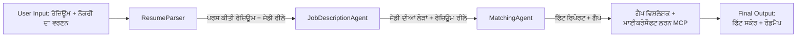

# PersonalCareerCopilot - ਰੇਜ਼ਿਊਮ → ਨੌਕਰੀ ਮੁਤਾਬਕਤਾ ਮੁਲਾਂਕਣ

ਇੱਕ ਵਰਕਫਲੋ-ਪਹਿਲਾ ਬਹੁ-ਏਜੰਟ ਐਪ ਜੋ ਇਹ ਅੰਕੜਾ ਲਗਾਉਂਦਾ ਹੈ ਕਿ ਇੱਕ ਰੇਜ਼ਿਊਮ ਕਿਸ ਹੱਦ ਤਕ ਨੌਕਰੀ ਦੀ ਵਰਣਨਾ ਨਾਲ ਮੇਲ ਖਾਂਦਾ ਹੈ, ਅਤੇ ਫਿਰ ਖ਼ਾਲੀਆਂ ਪੂਰੀਆਂ ਕਰਨ ਲਈ ਇੱਕ ਨਿੱਜੀਕ੍ਰਿਤ ਸਿੱਖਣ ਰੋਡਮੈਪ ਤਿਆਰ ਕਰਦਾ ਹੈ।

---

## ਏਜੰਟ

| ਏਜੰਟ | ਭੂਮਿਕਾ | ਸੰਦ |
|-------|------|-------|
| **ResumeParser** | ਰੇਜ਼ਿਊਮ ਟੈਕਸਟ ਤੋਂ ਸੰਰਚਿਤ ਕੌਸ਼ਲ, ਤਜਰਬਾ, ਸਰਟੀਫਿਕੇਸ਼ਨ ਇਕੱਠੇ ਕਰਦਾ ਹੈ | - |
| **JobDescriptionAgent** | ਜੇਡੀ ਤੋਂ ਲੋੜੀਂਦੇ/ਪਸੰਦੀਦਾ ਕੌਸ਼ਲ, ਤਜਰਬਾ, ਸਰਟੀਫਿਕੇਸ਼ਨ ਕੱਢਦਾ ਹੈ | - |
| **MatchingAgent** | ਪ੍ਰੋਫਾਇਲ ਅਤੇ ਲੋੜਾਂ ਦੀ ਤੁਲਨਾ ਕਰਦਾ ਹੈ → ਮੇਲ ਸਕੋਰ (0-100) + ਮਿਲੇ/ਮੌਜੂਦ ਨਾ ਰਹੇ ਕੌਸ਼ਲ | - |
| **GapAnalyzer** | Microsoft Learn ਸਰੋਤਾਂ ਨਾਲ ਇੱਕ ਨਿੱਜੀ ਸਿੱਖਣ ਰੋਡਮੈਪ ਬਣਾਉਂਦਾ ਹੈ | `search_microsoft_learn_for_plan` (MCP) |

## ਵਰਕਫਲੋ


```mermaid
flowchart LR
    UserInput["User Input: ਰੇਜ਼ਿਊਮ + ਨੌਕਰੀ ਦਾ ਵਰਣਨ"] --> ResumeParser
    ResumeParser -- "ਪਰਸ ਕੀਤੀ ਰੇਜ਼ਿਊਮ + ਜੇਡੀ ਰੀਲੇ" --> JobDescriptionAgent
    JobDescriptionAgent -- "ਜੇਡੀ ਦੀਆਂ ਲੋੜਾਂ + ਰੇਜ਼ਿਊਮ ਰੀਲੇ" --> MatchingAgent
    MatchingAgent -- "ਫਿੱਟ ਰਿਪੋਰਟ + ਗੈਪ" --> GapAnalyzerMCP["ਗੈਪ ਵਿਸ਼ਲੇਸ਼ਕ +\nਮਾਈਕਰੋਸੌਫਟ ਲਰਨ MCP"]
    GapAnalyzerMCP --> FinalOutput["Final Output:\nਫਿੱਟ ਸਕੋਰ + ਰੋਡਮੈਪ"]
```

---

## ਜਲਦੀ ਸ਼ੁਰੂਆਤ

### 1. ਵਾਤਾਵਰਣ ਸੈਟਅੱਪ ਕਰੋ

ਇਹ ਫੋਲਡਰ ਵਰਕਫਲੋ-ਅਧਾਰਤ ਲੈਬ 02 ਸਕੈਫੋਲਡ ਲਈ ਰੈਫਰੈਂਸ ਇੰਪਲੀਮੈਂਟੇਸ਼ਨ ਹੈ। ਇਸਦਾ `main.py` ਮੌਜੂਦਾ ਪ੍ਰੋੰਪਟ ਬਲਾਕਾਂ ਦੇ ਨਾਲ `WorkflowBuilder` ਦੀ ਵਰਤੋਂ ਕਰਕੇ ਚਾਰ ਏਜੰਟਾਂ ਨੂੰ ਜੋੜਦਾ ਹੈ।

```powershell
cd workshop\lab02-multi-agent\PersonalCareerCopilot
python -m venv .venv
.\.venv\Scripts\Activate.ps1          # ਵਿਂਡੋਜ਼ ਪਾਵਰਸ਼ੈੱਲ
# source .venv/bin/activate            # ਮੈਕਓਐਸ / ਲਿਨਕਸ
pip install -r requirements.txt
```

### 2. ਕ੍ਰੈਡੈਂਸ਼ਲ ਸੈਟ ਕਰੋ

ਇਸ ਫੋਲਡਰ ਵਿੱਚ `.env` ਫਾਇਲ ਬਣਾਓ:

```powershell
copy .env .env.bak 2>$null; echo $null > .env
```

`.env` ਨੂੰ ਸੋਧੋ:

```env
FOUNDRY_PROJECT_ENDPOINT=https://<your-account>.services.ai.azure.com/api/projects/<your-project>
AZURE_AI_MODEL_DEPLOYMENT_NAME=gpt-4.1-mini
```

| ਮੁੱਲ | ਕਿੱਥੋਂ ਲੱਭਣਾ ਹੈ |
|-------|------------------|
| `FOUNDRY_PROJECT_ENDPOINT` | Foundry Toolkit ਸਾਈਡਬਾਰ → ਆਪਣੀ ਪ੍ਰੋਜੈਕਟ `right-click` ਕਰੋ → **Copy Project Endpoint** |
| `AZURE_AI_MODEL_DEPLOYMENT_NAME` | Foundry ਸਾਈਡਬਾਰ → ਪ੍ਰੋਜੈਕਟ ਖੋਲ੍ਹੋ → **Models + endpoints** → ਡਿਪਲੋਇਮੈਂਟ ਨਾਮ |

### 3. ਲੋਕਲ ਚਲਾਓ

```powershell
python -m debugpy --listen 127.0.0.1:5679 main.py --port 8088
```

ਜਾਂ VS ਕੋਡ ਟਾਸਕ ਦੀ ਵਰਤੋਂ ਕਰੋ: `Ctrl+Shift+P` → **Tasks: Run Task** → **Run Agent HTTP Server**।

F5 ਡਿਬੱਗਿੰਗ ਲਈ, **Debug Local Agent HTTP Server** ਵਰਤੋ।

### 4. ਏਜੰਟ ਇੰਸਪੈਕਟਰ ਨਾਲ ਟੈਸਟ ਕਰੋ

ਏਜੰਟ ਇੰਸਪੈਕਟਰ ਖੋਲ੍ਹੋ: `Ctrl+Shift+P` → **Foundry Toolkit: Open Agent Inspector**।

ਇਹ ਟੈਸਟ ਪ੍ਰੌਂਪਟ ਪੇਸਟ ਕਰੋ:

```
Resume:
Jane Doe
Senior Software Engineer with 5 years of experience in Python, Django, and AWS.
Built microservices handling 10K+ requests/second. Led a team of 4 developers.
Certifications: AWS Solutions Architect Associate.
Education: B.S. Computer Science, State University.

Job Description:
Senior Cloud Engineer at Contoso Ltd.
Required: Python, Azure, Kubernetes, Terraform, CI/CD pipelines.
Preferred: Go, monitoring (Prometheus/Grafana), cost optimization.
Experience: 5+ years in cloud infrastructure.
Certifications: Azure Solutions Architect Expert preferred.
```

**ਉਮੀਦ ਕੀਤੀ ਗਈ:** ਇੱਕ ਮੇਲ ਸਕੋਰ (0-100), ਮਿਲੇ/ਮੌਜੂਦ ਨਾ ਰਹੇ ਕੌਸ਼ਲ, ਅਤੇ Microsoft Learn URL ਵਾਲਾ ਨਿੱਜੀ ਸਿੱਖਣ ਰੋਡਮੈਪ।

### 5. Foundry ਵਿੱਚ ਡਿਪਲੋਇ ਕਰੋ

`Ctrl+Shift+P` → **Foundry Toolkit: Deploy Hosted Agent** → ਆਪਣੀ ਪ੍ਰੋਜੈਕਟ ਚੁਣੋ → ਪੁਸ਼ਟੀ ਕਰੋ।

---

## ਪ੍ਰੋਜੈਕਟ ਸੰਰਚਨਾ

```
PersonalCareerCopilot/
├── .env                ← Your credentials (git-ignored)
├── agent.yaml          ← Hosted agent definition (name, resources, env vars)
├── Dockerfile          ← Container image for Foundry deployment
├── main.py             ← 4-agent workflow (instructions, MCP tool, WorkflowBuilder)
└── requirements.txt    ← Python dependencies
```

## ਮੁੱਖ ਫਾਈਲਾਂ

### `agent.yaml`

Foundry Agent ਸੇਵਾ ਲਈ ਹੋਸਟ ਕੀਤਾ ਏਜੰਟ ਪਰਿਭਾਸ਼ਤ ਕਰਦਾ ਹੈ:
- `kind: hosted` - ਇੱਕ ਪ੍ਰਬੰਧਿਤ ਕੰਟੇਨਰ ਵਜੋਂ ਚਲਦਾ ਹੈ
- `protocols` - `responses` ਪ੍ਰੋਟੋਕੋਲ ਨਾਲ `version: 1.0.0`, `/responses` HTTP ਐਂਡਪੌਇੰਟ ਖੋਲ੍ਹਦਾ ਹੈ
- `environment_variables` - ਇਥੇ `AZURE_AI_MODEL_DEPLOYMENT_NAME` ਘੋਸ਼ਿਤ ਕੀਤਾ ਗਿਆ ਹੈ; `FOUNDRY_PROJECT_ENDPOINT` ਡਿਪਲੋਇ ਸਮੇਂ ਸਵੈਚਾਲਿਤ ਇੰਜੈਕਟ ਹੁੰਦਾ ਹੈ

### `main.py`

ਸ਼ਾਮਲ ਹੈ:
- **ਏਜੰਟ ਨਿਰਦੇਸ਼** - ਚਾਰ `*_INSTRUCTIONS` ਸਥਿਰਾਂ, ਹਰ ਏਜੰਟ ਲਈ ਇੱਕ
- **MCP ਟੂਲ** - `search_microsoft_learn_for_plan()` ਸਟ੍ਰੀਮੇਬਲ HTTP ਰਾਹੀਂ `https://learn.microsoft.com/api/mcp` ਨੂੰ ਕਾਲ ਕਰਦਾ ਹੈ
- **ਏਜੰਟ ਬਣਾਉਣਾ** - ਚਾਰ `Agent()` + `AgentExecutor()` ਉਦਾਹਰਣਾਂ ਜੋ ਇੱਕ `FoundryChatClient` ਸਾਂਝਾ ਕਰਦੀਆਂ ਹਨ
- **ਵਰਕਫਲੋ ਗ੍ਰਾਫ** - `WorkflowBuilder` ਏਜੰਟਾਂ ਨੂੰ ਲੜੀਵਾਰ ਪਾਈਪਲਾਈਨ ਵਜੋਂ ਜੋੜਦਾ ਹੈ: ResumeParser → JD Agent → MatchingAgent → GapAnalyzer
- **ਸਰਵਰ ਸ਼ੁਰੂਆਤ** - `ResponsesHostServer` ਪੋਰਟ 8088 'ਤੇ ਚੱਲਦਾ ਹੈ

### `requirements.txt`

| ਪੈਕੇਜ | ਮਕਸਦ |
|---------|----------|
| `agent-framework-foundry` | ਕੋਰ ਰਨਟਾਈਮ: `Agent`, `AgentExecutor`, `WorkflowBuilder`, `@tool`, `FoundryChatClient` |
| `agent-framework-foundry-hosting` | `ResponsesHostServer` + Foundry ਹੋਸਟਿੰਗ ਇੰਟੀਗ੍ਰੇਸ਼ਨ |
| `mcp<2,>=1.24.0` | GapAnalyzer ਲਈ MCP ਕਲਾਇੰਟ (`streamable_http_client`) |
| `debugpy` | ਪਾਇਥਨ ਡਿਬੱਗਿੰਗ (VS ਕੋਡ ਵਿੱਚ F5) |

---

## ਸਮੱਸਿਆ ਹੱਲ

| ਸਮੱਸਿਆ | ਹੱਲ |
|-------|-----|
| `KeyError: 'FOUNDRY_PROJECT_ENDPOINT'` ਜਾਂ `KeyError: 'AZURE_AI_MODEL_DEPLOYMENT_NAME'` | `.env` ਬਣਾਓ ਜਿਸ ਵਿੱਚ ਦੋਹਾਂ `FOUNDRY_PROJECT_ENDPOINT` ਅਤੇ `AZURE_AI_MODEL_DEPLOYMENT_NAME` ਸੈਟ ਕੀਤੇ ਹੋਣ |
| `ModuleNotFoundError: No module named 'agent_framework'` | ਵੈਨਵਿਟ ਅਕਟਿਵੇਟ ਕਰੋ ਅਤੇ `pip install -r requirements.txt` ਚਲਾਓ |
| ਨਤੀਜੇ ਵਿੱਚ ਕੋਈ Microsoft Learn URLs ਨਹੀਂ | ਇੰਟਰਨੈਟ ਕਨੈਕਸ਼ਨ ਨੂੰ `https://learn.microsoft.com/api/mcp` ਚੈੱਕ ਕਰੋ |
| ਸਿਰਫ 1 ਗੈਪ ਕਾਰਡ (ਟ੍ਰੰਕੇਟ) | ਯਕੀਨੀ ਬਣਾਓ ਕਿ `GAP_ANALYZER_INSTRUCTIONS` ਵਿੱਚ `CRITICAL:` ਬਲਾਕ ਸ਼ਾਮਲ ਹੈ |
| ਪੋਰਟ 8088 ਵਰਤ ਰਹੀ ਹੈ | ਹੋਰ ਸਰਵਰ ਬੰਦ ਕਰੋ: `netstat -ano \| findstr :8088` |

ਵਿਸਤ੍ਰਿਤ ਸਮੱਸਿਆ ਹੱਲ ਲਈ, ਵੇਖੋ [Module 8 - Troubleshooting](../docs/08-troubleshooting.md).

---

**ਪੂਰੀ ਵਾਕਥਰੂ:** [Lab 02 Docs](../docs/README.md) · **ਵਾਪਸ ਜਾਓ:** [Lab 02 README](../README.md) · [Workshop Home](../../../README.md)

---

<!-- CO-OP TRANSLATOR DISCLAIMER START -->
**ਅਸਵੀਕਾਰੋਪਣ**:
ਇਸ ਦਸਤਾਵੇਜ਼ ਦਾ ਅਨੁਵਾਦ ਏਆਈ ਅਨੁਵਾਦ ਸੇਵਾ [Co-op Translator](https://github.com/Azure/co-op-translator) ਦੀ ਵਰਤੋਂ ਕਰਕੇ ਕੀਤਾ ਗਿਆ ਹੈ। ਜਦੋਂ ਕਿ ਅਸੀਂ ਸਹੀਤਾਵਾਂ ਲਈ ਯਤਨਸ਼ੀਲ ਹਾਂ, ਕਿਰਪਾ ਕਰਕੇ ਧਿਆਨ ਰੱਖੋ ਕਿ ਸਵੈਚਾਲਿਤ ਅਨੁਵਾਦਾਂ ਵਿੱਚ ਗਲਤੀਆਂ ਜਾਂ ਅਸਮੱਤਿਆਵਾਂ ਹੋ ਸਕਦੀਆਂ ਹਨ। ਮੂਲ ਦਸਤਾਵੇਜ਼ ਆਪਣੀ ਮੂਲ ਭਾਸ਼ਾ ਵਿੱਚ ਅਧਿਕਾਰਕ ਸਰੋਤ ਮੰਨਿਆ ਜਾਣਾ ਚਾਹੀਦਾ ਹੈ। ਜਰੂਰੀ ਜਾਣਕਾਰੀ ਲਈ, ਪੇਸ਼ੇਵਰ ਮਨੁੱਖੀ ਅਨੁਵਾਦ ਦੀ ਸਿਫ਼ਾਰਸ਼ ਕੀਤੀ ਜਾਂਦੀ ਹੈ। ਅਸੀਂ ਇਸ ਅਨੁਵਾਦ ਦੇ ਉਪਯੋਗ ਤੋਂ ਪੈਦਾ ਹੋਣ ਵਾਲੀਆਂ ਕਿਸੇ ਵੀ ਗਲਤਫਹਿਮੀਆਂ ਜਾਂ ਗਲਤ ਵਿਆਖਿਆਵਾਂ ਲਈ ਜਵਾਬਦੇਹ ਨਹੀਂ ਹਾਂ।
<!-- CO-OP TRANSLATOR DISCLAIMER END -->