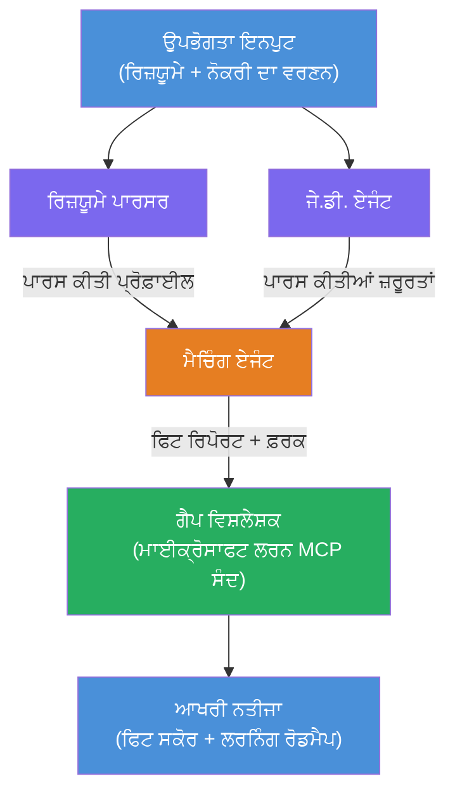

# Lab 02 - ਮਲਟੀ-ਏਜੇਂਟ ਵਰਕਫਲੋ: ਰਿਜਿਊਮੇ → ਨੌਕਰੀ ਫਿਟ ਅਨੁਮਾਨਕਾਰ

---

## ਤੁਸੀਂ ਕੀ ਬਣਾਵੋਗੇ

ਇੱਕ **ਰਿਜਿਊਮੇ → ਨੌਕਰੀ ਫਿਟ ਅਨੁਮਾਨਕਾਰ** - ਇੱਕ ਮਲਟੀ-ਏਜੇਂਟ ਵਰਕਫਲੋ ਜਿੱਥੇ ਚਾਰ ਵਿਸ਼ੇਸ਼ਗਿਆ ਏਜੇਂਟ ਮਿਲ ਕੇ ਇਹ ਅੰਦਾਜ਼ਾ ਲਾਉਂਦੇ ਹਨ ਕਿ ਉਮੀਦਵਾਰ ਦੀ ਰਿਜਿਊਮੇ ਨੌਕਰੀ ਵੇਰਵੇ ਨਾਲ ਕਿੰਨੀ ਮੇਲ ਖਾਂਦੀ ਹੈ, ਫਿਰ ਗੈਪ ਪੂਰੇ ਕਰਨ ਲਈ ਇੱਕ ਵਿਅਕਤੀਗਤ ਸਿੱਖਣ ਦਾ ਰੋਡਮੇਪ ਤਿਆਰ ਕਰਦੇ ਹਨ।

### ਏਜੇਂਟ

| ਏਜੇਂਟ | ਭੂਮਿਕਾ |
|-------|---------|
| **ਰਿਜਿਊਮੇ ਪਾਰਸਰ** | ਰਿਜਿਊਮੇ ਟੈਕਸਟ ਵਿੱਚੋਂ ਸੰਰਚਿਤ ਹੁਨਰ, ਅਨੁਭਵ, ਪ੍ਰਮਾਣ ਪੱਤਰ ਕੱਢਦਾ ਹੈ |
| **ਨੌਕਰੀ ਵੇਰਵਾ ਏਜੇਂਟ** | JD ਵਿੱਚੋਂ ਲੋੜੀਂਦੇ/ਪਸੰਦੀਦਾ ਹੁਨਰ, ਅਨੁਭਵ, ਪ੍ਰਮਾਣ ਪੱਤਰ ਕੱਢਦਾ ਹੈ |
| **ਮੈਚਿੰਗ ਏਜੇਂਟ** | ਪ੍ਰੋਫਾਈਲ ਮੁਕਾਬਲੇ ਲੋੜਾਂ ਨਾਲ → ਫਿਟ ਸਕੋਰ (0-100) + ਮਿਲਦੇ/ਘਾਟ ਵਾਲੇ ਹੁਨਰ |
| **ਗੈਪ ਐਨਾਲਾਈਜ਼ਰ** | ਸਰੋਤ, ਟਾਈਮਲਾਈਨ ਅਤੇ ਫਟਾਫਟ ਪ੍ਰੋਜੈਕਟਾਂ ਨਾਲ ਵਿਅਕਤੀਗਤ ਸਿੱਖਣ ਦਾ ਰੋਡਮੇਪ ਬਣਾਉਂਦਾ ਹੈ |

### ਡੈਮੋ ਫਲੋ

ਇੱਕ **ਰਿਜਿਊਮੇ + ਨੌਕਰੀ ਵੇਰਵਾ** ਅਪਲੋਡ ਕਰੋ → ਪ੍ਰਾਪਤ ਕਰੋ **ਫਿਟ ਸਕੋਰ + ਘੱਟ ਹੁਨਰ** → ਪ੍ਰਾਪਤ ਕਰੋ ਇੱਕ **ਵਿਆਕਤੀਗਤ ਸਿੱਖਣ ਦਾ ਰੋਡਮੇਪ**।

### ਵਰਕਫਲੋ ਆਰਕੀਟੈਕਚਰ

> ਬਿੱਲਾ = ਪੈਰਾਲਲ ਏਜੇਂਟ | ਸੰਤਰੀ = ਏਗ੍ਰੀਗੇਸ਼ਨ ਪੁਆਇੰਟ | ਹਰਾ = ਟੂਲਜ਼ ਵਾਲਾ ਆਖਰੀ ਏਜੇਂਟ। ਵਿਸਥਾਰ ਲਈ ਵੇਖੋ [Module 1 - Understand the Architecture](docs/01-understand-multi-agent.md) ਅਤੇ [Module 4 - Orchestration Patterns](docs/04-orchestration-patterns.md)।

### ਕਵਰੇਜ ਟਾਪਿਕਸ

- **WorkflowBuilder** ਦੀ ਵਰਤੋਂ ਨਾਲ ਮਲਟੀ-ਏਜੇਂਟ ਵਰਕਫਲੋ ਬਣਾਉਣਾ
- ਏਜੇਂਟਾਂ ਦੀਆਂ ਭੂਮਿਕਾਵਾਂ ਅਤੇ ਆਰਕੀਟੈਕਚਰ ਫਲੋ (ਪੈਰਾਲਲ + ਕ੍ਰਮਵਾਰ) ਨਿਰਧਾਰਿਤ ਕਰਨਾ
- ਏਜੇਂਟਾਂ ਵਿਚਕਾਰ ਸੰਚਾਰ ਪੈਟਰਨ
- Agent Inspector ਨਾਲ ਸਥਾਨਕ ਟੈਸਟਿੰਗ
- Foundry Agent Service ’ਤੇ ਮਲਟੀ-ਏਜੇਂਟ ਵਰਕਫਲੋ ਦਾ ਡਿਪਲੋਇਮੈਂਟ

---

## ਪਹਿਲਾਂ ਦੀਆਂ ਲੋੜਾਂ

ਪਹਿਲਾਂ Lab 01 ਪੂਰਾ ਕਰੋ:

- [Lab 01 - Single Agent](../lab01-single-agent/README.md)

---

## ਸ਼ੁਰੂਆਤ

ਪੂਰੇ ਸੈਟਅੱਪ ਹੁਕਮ, ਕੋਡ ਵਾਕਥਰੂ ਅਤੇ ਟੈਸਟ ਕਮਾਂਡਾਂ ਲਈ ਦੇਖੋ:

- [Lab 2 Docs - ਪੂਰਕ ਲੋੜਾਂ](docs/00-prerequisites.md)
- [Lab 2 Docs - ਪੂਰਾ ਸਿੱਖਣ ਮਾਰਗ](docs/README.md)
- [PersonalCareerCopilot ਰਨ ਰਹਿਤ](PersonalCareerCopilot/README.md)

## ਆਰਕੀਸਟ੍ਰੇਸ਼ਨ ਪੈਟਰਨ (ਏਜੇਂਟਿਕ ਵਿਕਲਪ)

Lab 2 ਵਿਚ ਡਿਫਾਲਟ **ਪੈਰਾਲਲ → ਏਗ੍ਰੀਗੇਟਰ → ਪਲੈਨਰ** ਫਲੋ ਸ਼ਾਮਿਲ ਹੈ, ਅਤੇ ਦਸਤਾਵੇਜ਼
ਹੋਰ ਵਿਕਲਪਿਕ ਪੈਟਰਨ ਵੀ ਦੱਸਦੇ ਹਨ ਜੋ ਬਲਦਾਰ ਏਜੇਂਟਿਕ ਵਰਤੋਂ ਦਿਖਾਉਂਦੇ ਹਨ:

- **Fan-out/Fan-in ਨਾਲ ਵਜ਼ਨੀ ਸਹਿਮਤੀ**
- **ਅਖੀਰਲੇ ਰੋਡਮੇਪ ਤੋਂ ਪਹਿਲਾਂ ਸਮੀਖਿਆਕਾਰ/ਆਲੋਚਕ ਪਾਸ**
- **ਸ਼ਰਤੀ ਰੂਟਰ** (ਫਿਟ ਸਕੋਰ ਅਤੇ ਘੱਟ ਹੁਨਰਾਂ ਦੇ ਆਧਾਰ ’ਤੇ ਰਸਤਾ ਚੁਣਨਾ)

ਵੇਖੋ [docs/04-orchestration-patterns.md](docs/04-orchestration-patterns.md)।

---

**ਪਿਛਲਾ:** [Lab 01 - Single Agent](../lab01-single-agent/README.md) · **ਵਾਪਸ ਜਾਓ:** [ਵਰਕਸ਼ਾਪ ਮੁੱਖ ਸਫ਼ਾ](../../README.md)

---

<!-- CO-OP TRANSLATOR DISCLAIMER START -->
**ਅਸਵੀਕਾਰਨ**:  
ਇਹ ਦਸਤਾਵੇਜ਼ ਏਆਈ ਅਨੁਵਾਦ ਸੇਵਾ [Co-op Translator](https://github.com/Azure/co-op-translator) ਦੀ ਵਰਤੋਂ ਕਰਕੇ ਅਨੁਵਾਦ ਕੀਤਾ ਗਿਆ ਹੈ। ਜਦੋਂ ਕਿ ਅਸੀਂ ਸ਼ੁੱਧਤਾ ਲਈ ਕੋਸ਼ਿਸ਼ ਕਰਦੇ ਹਾਂ, ਕਿਰਪਾ ਕਰਕੇ ਧਿਆਨ ਵਿੱਚ ਰੱਖੋ ਕਿ ਸਵੈਚਾਲਿਤ ਅਨੁਵਾਦ ਵਿੱਚ ਗਲਤੀਆਂ ਜਾਂ ਅਸਮਰਥਤਾਵਾਂ ਹੋ ਸਕਦੀਆਂ ਹਨ। ਮੂਲ ਦਸਤਾਵੇਜ਼ ਨੂੰ ਇਸ ਦੀ ਮੂਲ ਭਾਸ਼ਾ ਵਿੱਚ ਪ੍ਰਮਾਣਿਕ ਸਰੋਤ ਮੰਨਿਆ ਜਾਣਾ ਚਾਹੀਦਾ ਹੈ। ਮਹੱਤਵਪੂਰਨ ਜਾਣਕਾਰੀ ਲਈ, ਪੇਸ਼ੇਵਰ ਮਨੁੱਖੀ ਅਨੁਵਾਦ ਦੀ ਸਿਫਾਰਿਸ਼ ਕੀਤੀ ਜਾਂਦੀ ਹੈ। ਇਸ ਅਨੁਵਾਦ ਦੇ ਇਸਤੇਮਾਲ ਤੋਂ ਉੱਪਜਣ ਵਾਲੀਆਂ ਕਿਸੇ ਵੀ ਗਲਤਫਹਿਮੀਆਂ ਜਾਂ ਗਲਤ ਵਿਆਖਿਆਵਾਂ ਲਈ ਅਸੀਂ ਜਿੰਮੇਵਾਰ ਨਹੀਂ ਹਾਂ।
<!-- CO-OP TRANSLATOR DISCLAIMER END -->