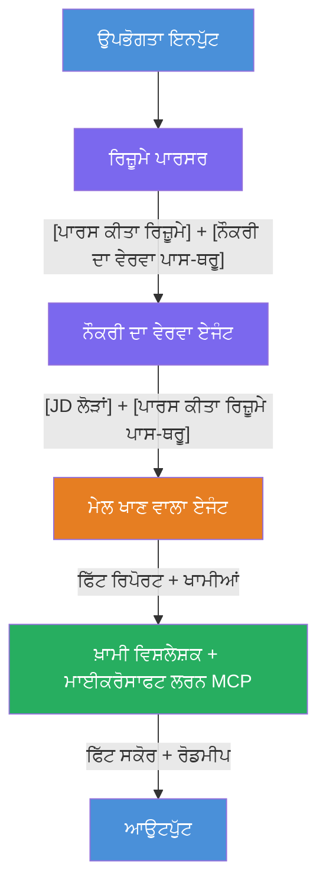

# ਲੈਬ 02 - ਬਹੁ-ਏਜੰਟ ਵਰਕਫਲੋ: ਰਿਜ਼ਿਊਮ → ਨੌਕਰੀ ਫਿੱਟ ਮੁਲਾਂਕਣਕਾਰ

## ਓਵਰਵਿਊ

ਇਸ ਹੱਥ-ਅਨ-ਲੈਬ ਵਿੱਚ, ਤੁਸੀਂ VS ਕੋਡ ਵਿੱਚ Foundry Toolkit ਦੀ ਵਰਤੋਂ ਨਾਲ ਇੱਕ **ਵਰਕਫਲੋ-ਪਹਿਲਾ ਬਹੁ-ਏਜੰਟ ਐਪ** ਬਣਾਉਂਦੇ ਹੋ ਅਤੇ ਇਸਨੂੰ Microsoft Foundry Agent Service 'ਤੇ ਡਿਪਲੋਇ ਕਰਦੇ ਹੋ।

**ਤੁਸੀਂ ਜੋ ਬਣਾਵੋਗੇ:** ਇੱਕ ਰਿਜ਼ਿਊਮ → ਨੌਕਰੀ ਫਿੱਟ ਮੁਲਾਂਕਣਕਾਰ ਜੋ ਰਿਜ਼ਿਊਮ ਅਤੇ ਨੌਕਰੀ ਦੇ ਵਰਣਨ ਨੂੰ ਪਾਰਸ ਕਰਦਾ ਹੈ, ਮੇਲ ਦਾ ਸਕੋਰ ਕਰਦਾ ਹੈ, ਅਤੇ Microsoft Learn ਸਰੋਤਾਂ ਦੀ ਵਰਤੋਂ ਕਰਕੇ ਇੱਕ ਵਿਅਕਤੀਗਤ ਸਿੱਖਿਆ ਯੋਜਨਾ ਤਿਆਰ ਕਰਦਾ ਹੈ।

---

## ਆਰਕੀਟੈਕਚਰ

```mermaid
flowchart TD
    A["ਉਪਭੋਗਤਾ ਇਨਪੁੱਟ"] --> B["ਰਿਜ਼ੂਮੇ ਪਾਰਸਰ"]
    B -->|"[ਪਾਰਸ ਕੀਤਾ ਰਿਜ਼ੂਮੇ] + [ਨੌਕਰੀ ਦਾ ਵੇਰਵਾ ਪਾਸ-ਥਰੂ]"| C["ਨੌਕਰੀ ਦਾ ਵੇਰਵਾ ਏਜੰਟ"]
    C -->|"[JD ਲੋੜਾਂ] + [ਪਾਰਸ ਕੀਤਾ ਰਿਜ਼ੂਮੇ ਪਾਸ-ਥਰੂ]"| D["ਮੇਲ ਖਾਣ ਵਾਲਾ ਏਜੰਟ"]
    D -->|ਫਿੱਟ ਰਿਪੋਰਟ + ਖਾਮੀਆਂ| E["ਖ਼ਾਮੀ ਵਿਸ਼ਲੇਸ਼ਕ + ਮਾਈਕਰੋਸਾਫਟ ਲਰਨ MCP"]
    E -->|ਫਿੱਟ ਸਕੋਰ + ਰੋਡਮੀਪ| F["ਆਉਟਪੁੱਟ"]

    style A fill:#4A90D9,color:#fff
    style B fill:#7B68EE,color:#fff
    style C fill:#7B68EE,color:#fff
    style D fill:#E67E22,color:#fff
    style E fill:#27AE60,color:#fff
    style F fill:#4A90D9,color:#fff
```

**ਇਹ ਕਿਵੇਂ ਕੰਮ ਕਰਦਾ ਹੈ:**
1. ਯੂਜ਼ਰ ਰਿਜ਼ਿਊਮ ਅਤੇ ਨੌਕਰੀ ਦਾ ਵਰਣਨ ਪੇਸਟ ਕਰਦਾ ਹੈ।
2. **ResumeParser** ਰਿਜ਼ਿਊਮ ਨੂੰ ਪਾਰਸ ਕਰਦਾ ਹੈ ਅਤੇ ਨੌਕਰੀ ਦੇ ਵਰਣਨ ਨੂੰ ਸ਼ਾਬਦਿਕ ਤੌਰ 'ਤੇ `[JOB DESCRIPTION PASS-THROUGH]` ਸੈਕਸ਼ਨ ਵਿੱਚ ਕਾਪੀ ਕਰਦਾ ਹੈ।
3. **JD Agent** ਪਾਸ-ਥਰੂ ਤੋਂ ਸੰਰਚਿਤ ਮੰਗਾਂ ਨਿਕਾਲਦਾ ਹੈ, ਫਿਰ `[PARSED RESUME]` ਨੂੰ ਅੱਗੇ ਵਧਾ ਕੇ `[PARSED RESUME PASS-THROUGH]` ਵਜੋਂ ਰੇਲੇ ਕਰਦਾ ਹੈ।
4. **MatchingAgent** `[PARSED RESUME PASS-THROUGH]` ਨੂੰ `[JD REQUIREMENTS]` ਨਾਲ ਤੁਲਨਾ ਕਰਦਾ ਹੈ ਅਤੇ ਇਕ ਫਿੱਟ ਸਕੋਰ ਤਿਆਰ ਕਰਦਾ ਹੈ।
5. **GapAnalyzer** ਖ਼ਾਮੀਆਂ ਨੂੰ ਇੱਕ ਪ੍ਰਯੋਗੀ ਯੋਜਨਾ ਵਿੱਚ ਬਦਲਦਾ ਹੈ ਅਤੇ MCP ਰਾਹੀਂ ਅਸਲੀ Microsoft Learn ਲਿੰਕ ਪ੍ਰਾਪਤ ਕਰਦਾ ਹੈ।

---

## ਪਹਿਲਾਂ ਲੋੜੀਂਦੇ ਹੋਣ ਵਾਲੇ ਕੰਮ

ਪਹਿਲਾਂ ਲੈਬ 01 ਮੁਕੰਮਲ ਕਰੋ:

- [Lab 01 - Single Agent](../lab01-single-agent/README.md)

---

## ਭਾਗ 1: ਮੋਡੀਊਲ ਨੂੰ ਕ੍ਰਮਵਾਰ ਪੜ੍ਹੋ

ਪੂਰੀ ਸਿੱਖਣੀ ਦਾ ਰਾਸਤਾ ਵੇਖੋ:

- [Lab 2 Docs - Prerequisites](docs/00-prerequisites.md)
- [Lab 2 Docs - Full Learning Path](docs/README.md)
- [PersonalCareerCopilot run guide](PersonalCareerCopilot/README.md)

---

## ਭਾਗ 2: ਵਰਕਫਲੋ ਬਣਾਓ ਅਤੇ ਟੈਸਟ ਕਰੋ

1. ਵਰਕਫਲੋ-ਅਧਾਰਿਤ ਪ੍ਰੋਜੈਕਟ ਬਣਾਉਣ ਲਈ Foundry Toolkit ਵਿਜ਼ਾਰਡ ਦੀ ਵਰਤੋਂ ਕਰੋ।
2. `PersonalCareerCopilot/main.py` ਤੋਂ ਪ੍ਰੰਪਟ ਬਲਾਕ ਅਤੇ ਵਰਕਫਲੋ ਗ੍ਰਾਫ ਨੂੰ ਆਪਣੇ ਵਰਕਸਪੇਸ ਵਿੱਚ ਕਾਪੀ ਕਰੋ।
3. Agent Inspector ਨਾਲ ਸਥਾਨੀ ਤੌਰ 'ਤੇ ਚਲਾਓ ਅਤੇ ਸਾਰੇ ਚਾਰ ਏਜੰਟਾਂ ਅਤੇ MCP ਟੂਲ ਦੀ ਜਾਂਚ ਕਰੋ।
4. ਸਥਾਨੀ ਟੈਸਟਿੰਗ ਪਾਸ ਹੋਣ 'ਤੇ ਹੋਸਟ ਕੀਤੇ ਏਜੰਟ ਨੂੰ Foundry 'ਤੇ ਡਿਪਲੋਇ ਕਰੋ।

---

## ਓਰਕੇਸਟਰੈਸ਼ਨ ਪੈਟਰਨ

ਲੈਬ 02 ਵਿੱਚ ਡਿਫੌਲਟ **fan-out → fan-in → ਕ੍ਰਮਵਾਰ** ਫਲੋ ਸ਼ਾਮਿਲ ਹੈ, ਅਤੇ ਡੌਕਸ ਵਿਚ ਵਿਕਲਪਿਕ ਓਰਕੇਸਟਰੈਸ਼ਨ ਪੈਟਰਨਾਂ ਵੀ ਵੇਖਾਏ ਗਏ ਹਨ ਜੋ ਪਰਖ ਲਈ ਹਨ।

- **ਬੋਝ ਵਾਲੇ ਸਹਿਮਤੀ ਨਾਲ Fan-out/Fan-in**
- **ਅਖੀਰੀ ਰੋਡਮੈਪ ਤੋਂ ਪਹਿਲਾਂ ਸਮੀਖਿਆਕਾਰ/ਆਲੋਚਕ ਪਾਸ**
- **ਫਿੱਟ ਸਕੋਰ ਅਤੇ ਗੈਰ-ਮੌਜੂਦ ਹੁਨਰਾਂ 'ਤੇ ਆਧਾਰਿਤ ਸਖਤ ਨਿਰਦੇਸ਼ਕ**

ਵੇਖੋ [docs/04-orchestration-patterns.md](docs/04-orchestration-patterns.md)।

---

**ਪਿਛਲਾ:** [Lab 01 - Single Agent](../lab01-single-agent/README.md) · **ਵਾਪਸ ਜਾਉ:** [Workshop Home](../../README.md)

---

<!-- CO-OP TRANSLATOR DISCLAIMER START -->
**ਅਸਵੀਕਾਰੋਪਣ**:
ਇਸ ਦਸਤਾਵੇਜ਼ ਦਾ ਅਨੁਵਾਦ ਏਆਈ ਅਨੁਵਾਦ ਸੇਵਾ [Co-op Translator](https://github.com/Azure/co-op-translator) ਦੀ ਵਰਤੋਂ ਕਰਕੇ ਕੀਤਾ ਗਿਆ ਹੈ। ਜਦੋਂ ਕਿ ਅਸੀਂ ਸਹੀਤਾਵਾਂ ਲਈ ਯਤਨਸ਼ੀਲ ਹਾਂ, ਕਿਰਪਾ ਕਰਕੇ ਧਿਆਨ ਰੱਖੋ ਕਿ ਸਵੈਚਾਲਿਤ ਅਨੁਵਾਦਾਂ ਵਿੱਚ ਗਲਤੀਆਂ ਜਾਂ ਅਸਮੱਤਿਆਵਾਂ ਹੋ ਸਕਦੀਆਂ ਹਨ। ਮੂਲ ਦਸਤਾਵੇਜ਼ ਆਪਣੀ ਮੂਲ ਭਾਸ਼ਾ ਵਿੱਚ ਅਧਿਕਾਰਕ ਸਰੋਤ ਮੰਨਿਆ ਜਾਣਾ ਚਾਹੀਦਾ ਹੈ। ਜਰੂਰੀ ਜਾਣਕਾਰੀ ਲਈ, ਪੇਸ਼ੇਵਰ ਮਨੁੱਖੀ ਅਨੁਵਾਦ ਦੀ ਸਿਫ਼ਾਰਸ਼ ਕੀਤੀ ਜਾਂਦੀ ਹੈ। ਅਸੀਂ ਇਸ ਅਨੁਵਾਦ ਦੇ ਉਪਯੋਗ ਤੋਂ ਪੈਦਾ ਹੋਣ ਵਾਲੀਆਂ ਕਿਸੇ ਵੀ ਗਲਤਫਹਿਮੀਆਂ ਜਾਂ ਗਲਤ ਵਿਆਖਿਆਵਾਂ ਲਈ ਜਵਾਬਦੇਹ ਨਹੀਂ ਹਾਂ।
<!-- CO-OP TRANSLATOR DISCLAIMER END -->