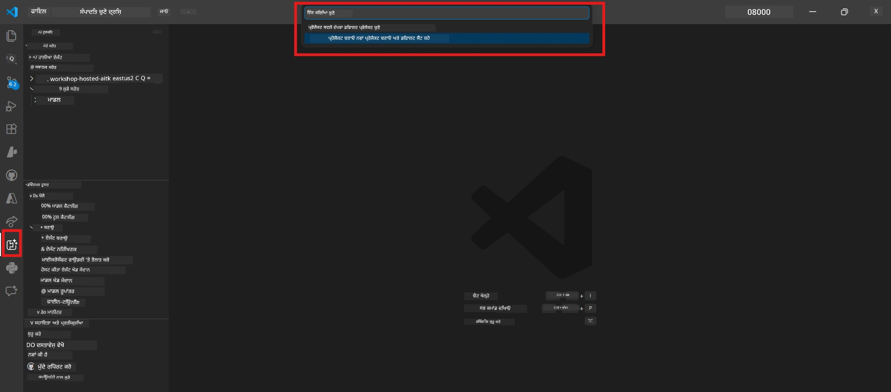

# Module 0 - ਪਹਿਲਾਂ ਦੀਆਂ ਲੋੜਾਂ

ਲੈਬ 02 ਸ਼ੁਰੂ ਕਰਨ ਤੋਂ ਪਹਿਲਾਂ, ਪੱਕਾ ਕਰੋ ਕਿ ਤੁਹਾਡੇ ਕੋਲ ਹੇਠਾਂ ਦਿੱਤੀਆਂ ਚੀਜ਼ਾਂ ਪੂਰੀਆਂ ਹਨ। ਇਹ ਲੈਬ ਸਿੱਧਾ ਲੈਬ 01 'ਤੇ ਆਧਾਰਿਤ ਹੈ - ਇਸ ਨੂੰ ਛੱਡੋ ਨਾ।

---

## 1. ਲੈਬ 01 ਪੂਰਾ ਕਰੋ

ਲੈਬ 02 ਇਹ ਮੰਨਦਾ ਹੈ ਕਿ ਤੁਸੀਂ ਪਹਿਲਾਂ ਹੀ ਕੀਤਾ ਹੈ:

- [x] [ਲੈਬ 01 - ਸਿੰਗਲ ਏਜੰਟ](../../lab01-single-agent/README.md) ਦੇ ਸਾਰੇ 8 ਮੋਡੀਊਲ ਪੂਰੇ ਕੀਤੇ
- [x] Foundry Agent Service 'ਤੇ ਇੱਕ ਸਿੰਗਲ ਏਜੰਟ ਸਫਲਤਾਪੂਰਵਕ ਤैनਾਤ ਕੀਤਾ
- [x] ਏਜੰਟ ਨੇ ਸਥਾਨਕ Agent Inspector ਅਤੇ Foundry Playground ਦੋਹਾਂ ਵਿੱਚ ਕੰਮ ਕਰਨ ਦੀ ਪੁਸ਼ਟੀ ਕੀਤੀ

ਜੇ ਤੁਸੀਂ ਲੈਬ 01 ਪੂਰਾ ਨਹੀਂ ਕੀਤਾ, ਤਾਂ ਵਾਪਸ ਜਾ ਕੇ ਹੁਣ ਹੀ ਇਹ ਮੁਕੰਮਲ ਕਰੋ: [ਲੈਬ 01 ਡੌਕਸ](../../lab01-single-agent/docs/00-prerequisites.md)

---

## 2. ਮੌਜੂਦਾ ਸੈਟਅਪ ਦੀ ਪੁਸ਼ਟੀ ਕਰੋ

ਲੈਬ 01 ਦੇ ਸਾਰੇ ਟੂਲ ਹਾਲੇ ਵੀ ਇੰਸਟਾਲ ਅਤੇ ਕੰਮ ਕਰ ਰਹੇ ਹੋਣੇ ਚਾਹੀਦੇ ਹਨ। ਇਹਨਾਂ ਛੇਤੀ ਚੈਕ ਕਰੋ:

### 2.1 ਅਜ਼ੂਰੀ CLI

```powershell
az account show --query "{name:name, id:id}" --output table
```

ਉਮੀਦ: ਤੁਹਾਡੀ ਸਬਸਕ੍ਰਿਪਸ਼ਨ ਨਾਮ ਅਤੇ ID ਦਿਖਾਈ ਦੇਵੇ। ਜੇ ਇਹ ਫੇਲ੍ਹ ਹੁੰਦਾ ਹੈ, ਤਾਂ [`az login`](https://learn.microsoft.com/cli/azure/authenticate-azure-cli-interactively) ਚਲਾਓ।

### 2.2 VS ਕੋਡ ਐਕਸਟੈਨਸ਼ਨ

1. `Ctrl+Shift+P` ਦਬਾਓ → ਟਾਈਪ ਕਰੋ **"Microsoft Foundry"** → ਪੁਸ਼ਟੀ ਕਰੋ ਕਿ ਤੁਹਾਨੂੰ ਕਮਾਂਡਾਂ ਦਿਖਾਈ ਦੇ ਰਹੀਆਂ ਹਨ (ਜਿਵੇਂ ਕਿ `Microsoft Foundry: Create a New Hosted Agent`)।
2. `Ctrl+Shift+P` ਦਬਾਓ → ਟਾਈਪ ਕਰੋ **"Foundry Toolkit"** → ਪੁਸ਼ਟੀ ਕਰੋ ਕਿ ਤੁਹਾਨੂੰ ਕਮਾਂਡਾਂ ਦਿਖਾਈ ਦੇ ਰਹੀਆਂ ਹਨ (ਜਿਵੇਂ ਕਿ `Foundry Toolkit: Open Agent Inspector`)।

### 2.3 Foundry ਪ੍ਰੋਜੈਕਟ ਅਤੇ ਮਾਡਲ

1. VS ਕੋਡ Activity Bar ਵਿੱਚ **Microsoft Foundry** ਚਿੰਨ੍ਹ 'ਤੇ ਕਲਿੱਕ ਕਰੋ।
2. ਪੁਸ਼ਟੀ ਕਰੋ ਕਿ ਤੁਹਾਡਾ ਪ੍ਰੋਜੈਕਟ ਲਿਸਟ ਵਿੱਚ ਹੈ (ਜਿਵੇਂ ਕਿ `workshop-agents`)।
3. ਪ੍ਰੋਜੈਕਟ ਨੂੰ ਵਧਾਓ → ਪੁਸ਼ਟੀ ਕਰੋ ਕਿ ਇੱਕ ਤੈਨਾਤ ਮਾਡਲ ਮੌਜੂਦ ਹੈ (ਜਿਵੇਂ ਕਿ `gpt-4.1-mini`) ਅਤੇ ਸਥਿਤੀ **Succeeded** ਹੈ।

> **ਜੇ ਤੁਹਾਡੇ ਮਾਡਲ ਦੀ ਤਾਇਨਾਤੀ ਮਿਆਦ ਸਮਾਪਤ ਹੋ ਗਈ ਹੈ:** ਕੁਝ ਫ੍ਰੀ-ਟੀਅਰ ਤਾਇਨाती ਆਟੋਮੈਟਿਕ ਤੌਰ 'ਤੇ ਸਮਾਪਤ ਹੋ ਜਾਂਦੀਆਂ ਹਨ। [ਮਾਡਲ ਕੈਟਾਲੌਗ](https://learn.microsoft.com/azure/foundry/foundry-models/concepts/models-sold-directly-by-azure) ਤੋਂ ਦੁਬਾਰਾ ਤਾਇਨਾਤ ਕਰੋ (`Ctrl+Shift+P` → **Microsoft Foundry: Open Model Catalog**)।



### 2.4 RBAC ਰੋਲਜ਼

ਪੁਸ਼ਟੀ ਕਰੋ ਕਿ ਤੁਹਾਡੇ ਕੋਲ Foundry ਪ੍ਰੋਜੈਕਟ 'ਤੇ **Azure AI User** ਹੈ:

1. [Azure Portal](https://portal.azure.com) → ਤੁਹਾਡਾ Foundry **ਪ੍ਰੋਜੈਕਟ** ਸਰੋਤ → **Access control (IAM)** → **[Role assignments](https://learn.microsoft.com/azure/foundry/concepts/rbac-foundry)** ਟੈਬ।
2. ਆਪਣੇ ਨਾਮ ਦੀ ਖੋਜ ਕਰੋ → ਪੁਸ਼ਟੀ ਕਰੋ ਕਿ **[Azure AI User](https://aka.ms/foundry-ext-project-role)** ਲਿਸਟ ਵਿੱਚ ਹੈ।

---

## 3. ਮਲਟੀ-ਏਜੰਟ ਸੰਕਲਪ ਸਮਝੋ (ਲੈਬ 02 ਲਈ ਨਵਾਂ)

ਲੈਬ 02 ਵਿੱਚ ਉਹ ਸੰਕਲਪ ਦਰਸਾਏ ਗਏ ਹਨ ਜੋ ਲੈਬ 01 ਵਿੱਚ ਨਹੀਂ ਸੀ। ਅੱਗੇ ਵਧਣ ਤੋਂ ਪਹਿਲਾਂ ਇਨ੍ਹਾਂ ਨੂੰ ਪੜ੍ਹੋ:

### 3.1 ਮਲਟੀ-ਏਜੰਟ ਵਰਕਫਲੋ ਕੀ ਹੈ?

ਇੱਕ ਏਜੰਟ ਦੁਆਰਾ ਸਾਰਾ ਕੰਮ ਸੰਭਾਲਣ ਦੀ ਬਜਾਏ, ਇੱਕ **ਮਲਟੀ-ਏਜੰਟ ਵਰਕਫਲੋ** ਕਈ ਵਿਸ਼ੇਸ਼ ਏਜੰਟਾਂ ਵਿੱਚ ਕੰਮ ਵੰਡਦਾ ਹੈ। ਹਰ ਏਜੰਟ ਕੋਲ ਹੁੰਦਾ ਹੈ:

- ਆਪਣੀਆਂ ਖਾਸ **ਹਦਾਇਤਾਂ** (ਸਿਸਟਮ ਪ੍ਰੰਪਟ)
- ਆਪਣੀ **ਭੂਮਿਕਾ** (ਜਿਸਦੀ ਜ਼ਿੰਮੇਵਾਰੀ ਹੈ)
- ਵਿਕਲਪਕ **ਟੂਲ** (ਫੰਕਸ਼ਨ ਜਿਹੜੇ ਉਹ ਕਾਲ ਕਰ ਸਕਦਾ ਹੈ)

ਏਜੰਟ ਇੱਕ **ਆਰਕੇਸਟਰੈਸ਼ਨ ਗ੍ਰਾਫ਼** ਰਾਹੀਂ ਸੰਚਾਰ ਕਰਦੇ ਹਨ ਜੋ ਦਿੱਖ ਦਿੰਦਾ ਹੈ ਕਿ ਡੇਟਾ ਕਿਵੇਂ ਉਨਾਂ ਵਿਚਕਾਰ ਵਗਦਾ ਹੈ।

### 3.2 WorkflowBuilder

`agent_framework` ਤੋਂ [`WorkflowBuilder`](https://learn.microsoft.com/agent-framework/workflows/agents-in-workflows) ਕਲਾਸ ਉਹ SDK ਕੰਪੋਨੇਟ ਹੈ ਜੋ ਏਜੰਟਾਂ ਨੂੰ ਜੋੜਦਾ ਹੈ:

```python
from agent_framework import WorkflowBuilder

workflow = (
    WorkflowBuilder(
        name="MyWorkflow",
        start_executor=agent_a,
        output_executors=[agent_d],
    )
    .add_edge(agent_a, agent_b)
    .add_edge(agent_a, agent_c)
    .add_edge(agent_b, agent_d)
    .add_edge(agent_c, agent_d)
    .build()
)
```

- **`start_executor`** - ਉਹ ਪਹਿਲਾਂ ਏਜੰਟ ਜੋ ਉਪਭੋਗਤਾ ਇਨਪੁਟ ਲੈਂਦਾ ਹੈ
- **`output_executors`** - ਉਹ ਏਜੰਟ(ਸ) ਜਿਹੜਿਆਂ ਦਾ ਆਉਟਪੁੱਟ ਅੰਤਿਮ ਜਵਾਬ ਬਣਦਾ ਹੈ
- **`add_edge(source, target)`** - ਇਹ ਪਰਿਭਾਸ਼ਿਤ ਕਰਦਾ ਹੈ ਕਿ `target` ਨੂੰ `source` ਦਾ ਆਉਟਪੁੱਟ ਮਿਲਦਾ ਹੈ

### 3.3 MCP (ਮਾਡਲ ਕਾਂਟੈਕਸਟ ਪ੍ਰੋਟੋਕੋਲ) ਟੂਲ

ਲੈਬ 02 ਇੱਕ **MCP ਟੂਲ** ਵਰਤਦਾ ਹੈ ਜੋ Microsoft Learn API ਨੂੰ ਕਾਲ ਕਰਦਾ ਹੈ ਤਾਂ ਜੋ ਸਿਖਲਾਈ ਸੰਸਾਧਨਾਂ ਨੂੰ ਲਿਆ ਜਾ ਸਕੇ। [MCP (ਮਾਡਲ ਕਾਂਟੈਕਸਟ ਪ੍ਰੋਟੋਕੋਲ)](https://modelcontextprotocol.io/introduction) ਇੱਕ ਮਾਨਕਪੂਰਨ ਪ੍ਰੋਟੋਕੋਲ ਹੈ ਜੋ AI ਮਾਡਲਾਂ ਨੂੰ ਬਾਹਰੀ ਡੇਟਾ ਸੋਰਸ ਅਤੇ ਟੂਲਜ਼ ਨਾਲ ਜੋੜਦਾ ਹੈ।

| ਸ਼ਬਦ | ਪਰਿਭਾਸ਼ਾ |
|------|-----------|
| **MCP ਸਰਵਰ** | ਇੱਕ ਸੇਵਾ ਜੋ [MCP ਪ੍ਰੋਟੋਕੋਲ](https://learn.microsoft.com/azure/foundry/agents/how-to/tools/model-context-protocol) ਰਾਹੀਂ ਟੂਲ/ਸੰਸਾਰਾਂ ਨੂੰ ਪ੍ਰਦਰਸ਼ਿਤ ਕਰਦੀ ਹੈ |
| **MCP ਕਲਾਇਂਟ** | ਤੁਹਾਡਾ ਏਜੰਟ ਕੋਡ ਜੋ MCP ਸਰਵਰ ਨਾਲ ਜੁੜਦਾ ਹੈ ਅਤੇ ਉਸ ਦੇ ਟੂਲ ਕਾਲ ਕਰਦਾ ਹੈ |
| **[Streamable HTTP](https://learn.microsoft.com/agent-framework/agents/tools/hosted-mcp-tools)** | MCP ਸਰਵਰ ਨਾਲ ਸੰਚਾਰ ਕਰਨ ਲਈ ਵਰਤਿਆ ਜਾਣ ਵਾਲਾ ਟ੍ਰਾਂਸਪੋਰਟ ਮੈਥਡ |

### 3.4 ਲੈਬ 02, ਲੈਬ 01 ਨਾਲ ਕੀ ਵੱਖਰਾ ਹੈ

| ਪਹਲੂ | ਲੈਬ 01 (ਸਿੰਗਲ ਏਜੰਟ) | ਲੈਬ 02 (ਮਲਟੀ-ਏਜੰਟ) |
|--------|----------------------|---------------------|
| ਏਜੰਟ | 1 | 4 (ਖਾਸ ਭੂਮਿਕਾਵਾਂ) |
| ਆਰਕੇਸਟਰੈਸ਼ਨ | ਕੋਈ ਨਹੀਂ | WorkflowBuilder (ਸਮੀਕਲ ਅਤੇ ਕ੍ਰਮਬੱਧ) |
| ਟੂਲਜ਼ | ਵਿਕਲਪਕ `@tool` ਫੰਕਸ਼ਨ | MCP ਟੂਲ (ਬਾਹਰੀ API ਕਾਲ) |
| ਕੰਪਲੈਕਸਿਟੀ | ਸਧਾਰਨ ਪ੍ਰੰਪਟ → ਜਵਾਬ | ਰਿਜ਼ਿਊਮ + JD → ਫਿੱਟ ਸਕੋਰ → ਰੋਡਮੇਪ |
| ਸੰਦਰਭ ਦਾ ਪ੍ਰਵਾਹ | ਸਿੱਧਾ | ਏਜੰਟ-ਤੋਂ-ਏਜੰਟ ਹੈਂਡਆਫ਼ |

---

## 4. ਲੈਬ 02 ਲਈ ਵਰਕਸ਼ਾਪ ਰਿਪੋਜ਼ਿਟਰੀ ਸਟ੍ਰਕਚਰ

ਪੱਕਾ ਕਰੋ ਕਿ ਤੁਸੀਂ ਜਾਣਦੇ ਹੋ ਕਿ ਲੈਬ 02 ਫਾਈਲਾਂ ਕਿੱਥੇ ਹਨ:

```
workshop/
└── lab02-multi-agent/
    ├── README.md                       ← Lab overview
    ├── docs/                           ← You are here
    │   ├── README.md                   ← Learning path index
    │   ├── 00-prerequisites.md         ← This file
    │   ├── 01-understand-multi-agent.md
    │   ├── ...
    │   └── 08-troubleshooting.md
    └── PersonalCareerCopilot/          ← The agent project
        ├── agent.yaml                  ← Agent definition
        ├── main.py                     ← 4-agent workflow code
        ├── Dockerfile                  ← Container configuration
        └── requirements.txt            ← Python dependencies
```

---

### ਚੈਕਪੋਇੰਟ

- [ ] ਲੈਬ 01 ਪੂਰੀ ਤਰ੍ਹਾਂ ਮੁਕੰਮਲ ਹੈ (ਸਾਰੇ 8 ਮੋਡੀਊਲ, ਏਜੰਟ ਤਾਇਨਾਤ ਤੇ ਪੁਸ਼ਟੀ ਕੀਤੀ)
- [ ] `az account show` ਤੁਹਾਡੀ ਸਬਸਕ੍ਰਿਪਸ਼ਨ ਵਾਪਸ ਕਰਦਾ ਹੈ
- [ ] Microsoft Foundry ਅਤੇ Foundry Toolkit ਐਕਸਟੈਂਸ਼ਨ ਇੰਸਟਾਲ ਅਤੇ ਜਵਾਬ ਦੇ ਰਹੇ ਹਨ
- [ ] Foundry ਪ੍ਰੋਜੈਕਟ ਵਿੱਚ ਇੱਕ ਤਾਇਨਾਤ ਮਾਡਲ ਹੈ (ਜਿਵੇਂ ਕਿ `gpt-4.1-mini`)
- [ ] ਤੁਹਾਡੇ ਕੋਲ ਪ੍ਰੋਜੈਕਟ 'ਤੇ **Azure AI User** ਰੋਲ ਹੈ
- [ ] ਤੁਸੀਂ ਉੱਪਰ ਦਿੱਤੇ ਮਲਟੀ-ਏਜੰਟ ਸੰਕਲਪ ਅੰਸ਼ ਨੂੰ ਪੜ੍ਹ ਲਿਆ ਹੈ ਅਤੇ WorkflowBuilder, MCP, ਅਤੇ ਏਜੰਟ ਆਰਕੇਸਟਰੈਸ਼ਨ ਨੂੰ ਸਮਝਦੇ ਹੋ

---

**ਅਗਲਾ:** [01 - ਮਲਟੀ-ਏਜੰਟ ਆਰਕੀਟੈਕਚਰ ਨੂੰ ਸਮਝਨਾ →](01-understand-multi-agent.md)

---

<!-- CO-OP TRANSLATOR DISCLAIMER START -->
**ਅਸਵੀਕਾਰੋakti**:  
ਇਹ ਦਸਤਾਵੇਜ਼ AI ਅਨੁਵਾਦ ਸੇਵਾ [Co-op Translator](https://github.com/Azure/co-op-translator) ਦੀ ਵਰਤੋਂ ਕਰਕੇ ਅਨੁਵਾਦ ਕੀਤਾ ਗਿਆ ਹੈ। ਜਦੋਂ ਕਿ ਅਸੀਂ ਸਹੀਤਾ ਲਈ ਪ੍ਰਯਾਸ ਕਰਦੇ ਹਾਂ, ਕਿਰਪਾ ਕਰਕੇ ਧਿਆਨ ਵਿੱਚ ਰੱਖੋ ਕਿ ਸਵੈਚਲਿਤ ਅਨੁਵਾਦਾਂ ਵਿੱਚ ਗਲਤੀਆਂ ਜਾਂ ਅਸਥਿਰਤਾਵਾਂ ਹੋ ਸਕਦੀਆਂ ਹਨ। ਮੂਲ ਦਸਤਾਵੇਜ਼ ਆਪਣੇ ਮੂਲ ਭਾਸ਼ਾ ਵਿੱਚ ਅਥਾਰਟੀਟੇਟਿਵ ਸਰੋਤ ਮੰਨਿਆ ਜਾਣਾ ਚਾਹੀਦਾ ਹੈ। ਮਹੱਤਵਪੂਰਨ ਜਾਣਕਾਰੀ ਲਈ, ਪੇਸ਼ਾਵਰ ਮਨੁੱਖੀ ਅਨੁਵਾਦ ਦੀ ਸਿਫਾਰਸ਼ ਕੀਤੀ ਜਾਂਦੀ ਹੈ। ਅਸੀਂ ਇਸ ਅਨੁਵਾਦ ਦੀ ਵਰਤੋਂ ਤੋਂ ਉਤਪੰਨ ਕਿਸੇ ਵੀ ਗਲਤਫਹਿਮੀ ਜਾਂ ਗਲਤ ਵਿਆਖਿਆਵਾਂ ਲਈ ਜ਼ਿੰਮੇਵਾਰ ਨਹੀਂ ਹਾਂ।
<!-- CO-OP TRANSLATOR DISCLAIMER END -->