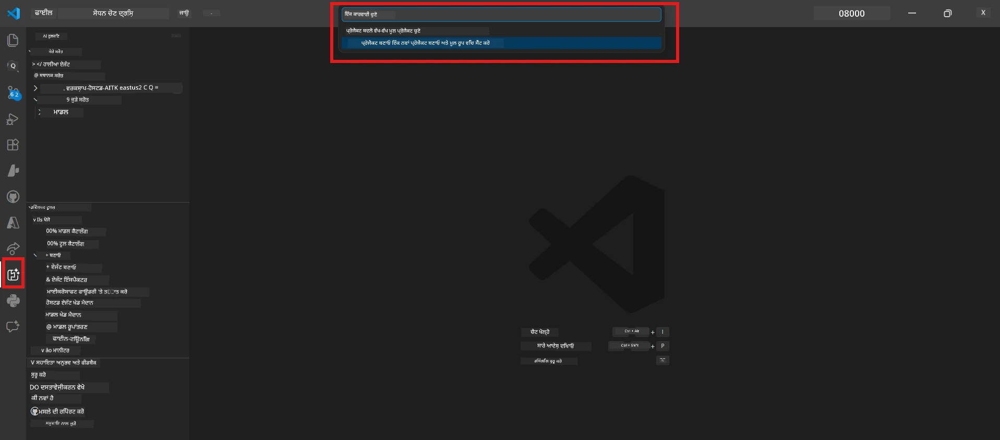

# ਮਾਡਿਊਲ 0 - ਪਰਿਚਯ

⏱️ ~10 ਮਿੰਟ

> [!WARNING]
> **ਪ੍ਰੀਵਿਊ ਅਤੇ ਸੀਮਾਵਾਂ:** [ਹੋਸਟ ਕੀਤੇ ਏਜੰਟ](https://learn.microsoft.com/azure/foundry/agents/concepts/hosted-agents) ਇਸ ਸਮੇਂ **ਪبلਿਕ ਪ੍ਰੀਵਿਊ** ਵਿੱਚ ਹਨ - ਉਤਪਾਦਨ ਕਾਰਜਭਾਰ ਲਈ ਸਿਫਾਰਸ਼ ਨਹੀਂ ਕੀਤੇ ਗਏ। ਇਸ ਵਰਕਸ਼ਾਪ ਵਿੱਚ ਦਿਖਾਈਆਂ ਕੁਝ ਵਿਸ਼ੇਸ਼ਤਾਵਾਂ ਸੇਵਾ ਦੇ GA ਵੱਲ ਵੱਧਣ ਦੇ ਨਾਲ ਬਦਲ ਸਕਦੀਆਂ ਹਨ।

## ਤੁਸੀਂ ਕੀ ਬਣਾਵੋਗੇ

ਇਸ ਲੈਬ ਵਿੱਚ, ਤੁਸੀਂ ਲੈਬ 01 ਤੋਂ ਇੱਕ ਸਿੰਗਲ-ਏਜੰਟ ਸਿੱਖਿਆਵਾਂ ਨੂੰ ਵਧਾ ਕੇ ਇੱਕ **ਮਲਟੀ-ਏਜੰਟ ਵਰਕਫਲੋ** ਬਣਾਉਂਦੇ ਹੋ - ਰਿਜ਼ੂਮੇ → ਨੌਕਰੀ ਫਿੱਟ ਇਵੈਲ્યુਏਟਰ।

ਤੁਸੀਂ ਇੱਕ **ਰਿਜ਼ੂਮੇ** ਅਤੇ ਇੱਕ **ਨੌਕਰੀ ਦੀ ਵਰਣਨਾ** ਪੇਸਟ ਕਰਦੇ ਹੋ। ਚਾਰ ਵਿਸ਼ੇਸ਼ ਏਜੰਟ ਕਰਮਬੱਧ ਤੌਰ 'ਤੇ ਇਨਪੁੱਟ ਪ੍ਰਕਿਰਿਆ ਕਰਦੇ ਹਨ ਅਤੇ ਫਿਰ ਵਾਪਸ ਕਰਦੇ ਹਨ:
- ਇਕ ਫਿੱਟ ਸਕੋਰ (0–100 ਦੇ ਸਕੋਰਿੰਗ ਵਿਭਾਜਨ ਨਾਲ)
- ਇੱਕ ਕੌਸ਼ਲ ਅਤੇ ਸਰਟੀਫਿਕੇਸ਼ਨ ਫ਼ਾਕੀ ਦੀ ਸੂਚੀ
- ਇੱਕ ਨਿੱਜੀਕ੍ਰਿਤ ਸਿੱਖਣ ਦਾ ਰੋਡਮੈਪ ਜਿਸ ਵਿੱਚ ਹਰ ਫ਼ਾਕ ਲਈ ਅਸਲੀ Microsoft Learn ਲਿੰਕ ਹਨ

**ਵਰਕਫਲੋ ਇਹਨਾਂ ਨੂੰ ਵਰਤਦਾ ਹੈ:**
- **Microsoft Agent Framework** - `WorkflowBuilder` ਸੀਰੀਆਲ ਪਾਇਪਲਾਈਨ ਆਰਕੇਸਟਰੈਸ਼ਨ ਲਈ
- **Foundry Toolkit for VS Code** - ਸਕੈਫੋਲਡ, ਸਥਾਨਕ ਟੈਸਟ, ਡਿਪਲੌਇ
- **ਏਕ ਏ ਆਈ ਮਾਡਲ** (ਜਿਵੇਂ, `gpt-4.1-mini`) - ਸਾਰੇ ਚਾਰ ਏਜੰਟਾਂ ਵਲੋਂ ਵਰਤਿਆ ਜਾਂਦਾ
- **Microsoft Learn MCP ਸਰਵਰ** - ਹਰ ਕੌਸ਼ਲ ਦੇ ਫ਼ਾਕ ਲਈ ਅਸਲੀ ਸਿੱਖਣ ਸਾਧਨ ਲਿੰਕ ਪ੍ਰਦਾਨ ਕਰਦਾ ਹੈ

---

## ਆਪਣਾ ਰਾਸ਼ਤਾ ਚੁਣੋ

> ⚠️ **ਉਹੀ ਰਾਹ ਜਾਰੀ ਰੱਖੋ ਜੋ ਤੁਸੀਂ ਲੈਬ 01 ਵਿੱਚ ਵਰਤਿਆ ਸੀ।**

<details open>
<summary><strong>🅰️ ਰਾਹ A - ਅਜ਼ੂਰ ਕਲਾਉਡ (ਅਜ਼ੂਰ ਸਬਸਕ੍ਰਿਪਸ਼ਨ ਦੀ ਲੋੜ)</strong></summary>

| | ਵੇਰਵੇ |
|---|---|
| **ਇਹ ਕਿਸ ਲਈ ਹੈ?** | ਤੁਸੀਂ ਅਜ਼ੂਰ ਸਬਸਕ੍ਰਿਪਸ਼ਨ ਵਰਤ ਕੇ ਲੈਬ 01 ਪੂਰੀ ਕੀਤੀ ਹੈ |
| **ਮਾਡਲ** | Foundry ਦੁਆਰਾ ਅਜ਼ੂਰ OpenAI (ਜਿਵੇਂ, `gpt-4.1-mini`) |
| **ਮਾਡਿਊਲ ਕਵਰ ਕੀਤੇ** | ਸਾਰੇ ਮਾਡਿਊਲ (00–09) |
| **ਕਲਾਉਡ ਤੇ ਡਿਪਲੌਇ ਕਰਨੇ?** | ✅ ਹਾਂ - ਪੂਰਾ ਅੰਤ-ਤੇ-ਅੰਤ ਡਿਪਲੌਇਮੈਂਟ |

</details>

<details open>
<summary><strong>🅱️ ਰਾਹ B - Foundry ਲੋਕਲ (ਕੋਈ ਅਜ਼ੂਰ ਸਬਸਕ੍ਰਿਪਸ਼ਨ ਦੀ ਲੋੜ ਨਹੀਂ)</strong></summary>

| | ਵੇਰਵੇ |
|---|---|
| **ਇਹ ਕਿਸ ਲਈ ਹੈ?** | ਤੁਸੀਂ Foundry ਲੋਕਲ ਵਰਤ ਕੇ ਲੈਬ 01 ਪੂਰੀ ਕੀਤੀ ਹੈ |
| **ਮਾਡਲ** | Foundry ਲੋਕਲ (ਮੁਫ਼ਤ, ਤੁਹਾਡੇ ਮਸ਼ੀਨ ਤੇ ਚੱਲਦਾ ਹੈ) |
| **ਮਾਡਿਊਲ ਕਵਰ ਕੀਤੇ** | ਮਾਡਿਊਲ 00–05 (06–07 ਨੂੰ ਛੱਡੋ - ਡਿਪਲੌਇ ਅਤੇ ਕਲਾਊਡ ਵੈਰੀਫਾਈ) |
| **ਕਲਾਉਡ ਤੇ ਡਿਪਲੌਇ ਕਰਨੇ?** | ❌ ਨਹੀਂ - ਸਿਰਫ ਲੋਕਲ ਟੈਸਟਿੰਗ Agent Inspector ਦੁਆਰਾ |

</details>

---

## ਲੈਬ 01 ਚੈੱਕ

ਲੈਬ 02 ਸਿੱਧਾ ਲੈਬ 01 'ਤੇ ਨਿਰਭਰ ਹੈ। ਇੱਥੇ ਸ਼ੁਰੂ ਕਰਨ ਤੋਂ ਪਹਿਲਾਂ ਲੈਬ 01 ਪੂਰਾ ਕਰੋ।

ਲੈਬ 01 ਨਹੀਂ ਕੀਤਾ? ਇੱਥੇ ਸ਼ੁਰੂ ਕਰੋ: [Lab 01 - Introduction](../../lab01-single-agent/docs/00-prerequisites.md)

<details open>
<summary><strong>🅰️ ਰਾਹ A - ਅਜ਼ੂਰ ਕਲਾਉਡ</strong></summary>

```powershell
az account show --query "{name:name, id:id}" --output table
```

ਜੇ ਇਹ ਫੇਲ੍ਹ ਹੋਵੇ, ਤਾਂ `az login` ਚਲਾਓ। ਫਿਰ VS ਕੋਡ ਵਿੱਚ ਵੇਰੀਫਾਈ ਕਰੋ:

1. `Ctrl+Shift+P` → ਟਾਈਪ ਕਰੋ **Foundry Toolkit** → ਕਮਾਂਡਜ਼ ਆਉਂਦੀਆਂ ਹੋਣ ਦੀ ਪੁਸ਼ਟੀ ਕਰੋ।
2. **Foundry Toolkit** ਆਈਕਨ 'ਤੇ ਕਲਿੱਕ ਕਰੋ → ਤੁਹਾਡਾ ਪ੍ਰੋਜੈਕਟ ਅਤੇ ਡਿਪਲੌਇ ਕੀਤਾ ਮਾਡਲ **Succeeded** ਦਿਖਾਉਂਦੇ ਹਨ।



> **RBAC:** ਤੁਸੀਂ ਲੈਬ 01 ਵਿੱਚ **Foundry User** ਦੇ ਕਿਰਦਾਰ ਸੌਂਪਿਆ ਸੀ। ਜੇ ਤੁਹਾਨੂੰ ਮੁੜ ਸੌਂਪਣਾ ਹੋਵੇ ਤਾਂ ਵੇਖੋ [Lab 01, Module 1](../../lab01-single-agent/docs/01-setup.md#deploy-a-model--assign-rbac)। ਇਸ ਕਿਰਦਾਰ ਨੂੰ ਪਹਿਲਾਂ **Azure AI User** ਕਿਹਾ ਜਾਂਦਾ ਸੀ - ਇਕੋ ਜਿਹੇ ਅਧਿਕਾਰ।

</details>

<details open>
<summary><strong>🅱️ ਰਾਹ B - Foundry ਲੋਕਲ</strong></summary>

```powershell
Invoke-WebRequest -Uri "http://localhost:5273/v1/health" -UseBasicParsing | Select-Object StatusCode
```

ਉਮੀਦ ਹੈ: `StatusCode: 200`। ਜੇ ਨਹੀਂ, Foundry Toolkit ਸਾਈਡਬਾਰ ਤੋਂ Foundry ਲੋਕਲ ਦੁਬਾਰਾ ਸ਼ੁਰੂ ਕਰੋ।

> ਸਾਰਾ ਇਨਫਰੰਸ ਤੁਹਾਡੇ ਮਸ਼ੀਨ ਤੇ ਹੁੰਦਾ ਹੈ। ਇਕੱਲੀ ਆਊਟਬਾਊਂਡ ਕਾਲ MCP ਟੂਲ ਦੁਆਰਾ `https://learn.microsoft.com/api/mcp` ਨੂੰ ਹੈ।

</details>

---

## ਲੈਬ 02 ਵਿੱਚ ਨਵਾਂ ਕੀ ਹੈ

| | ਲੈਬ 01 | ਲੈਬ 02 |
|--|--------|--------|
| ਏਜੰਟ | 1 | 4 (WorkflowBuilder ਨਾਲ ਚੇਨ ਕੀਤੇ) |
| ਸਕੈਫੋਲਡ ਟੈਂਪਲੇਟ | ਬੇਸਿਕ - Agent Framework | ਵਰਕਫਲੋ - Agent Framework |
| ਨਵਾਂ ਪੈਕੇਜ | - | `mcp` |
| ਆਰਕੇਸਟਰੈਸ਼ਨ | ਇਕਲੌਤਾ ਗੱਲਬਾਤੀ ਏਜੰਟ | ਸੀਰੀਆਲ ਪਾਇਪਲਾਈਨ (WorkflowBuilder) |
| ਨਵਾਂ ਟੂਲ | - | `search_microsoft_learn_for_plan` (MCP) |

---

**ਅਗਲਾ:** [01 - ਆਰਕੀਟੈਕਚਰ ਨੂੰ ਸਮਝੋ →](01-understand-multi-agent.md)

---

<!-- CO-OP TRANSLATOR DISCLAIMER START -->
**ਅਸਵੀਕਾਰੋਪਣ**:
ਇਸ ਦਸਤਾਵੇਜ਼ ਦਾ ਅਨੁਵਾਦ ਏਆਈ ਅਨੁਵਾਦ ਸੇਵਾ [Co-op Translator](https://github.com/Azure/co-op-translator) ਦੀ ਵਰਤੋਂ ਕਰਕੇ ਕੀਤਾ ਗਿਆ ਹੈ। ਜਦੋਂ ਕਿ ਅਸੀਂ ਸਹੀਤਾਵਾਂ ਲਈ ਯਤਨਸ਼ੀਲ ਹਾਂ, ਕਿਰਪਾ ਕਰਕੇ ਧਿਆਨ ਰੱਖੋ ਕਿ ਸਵੈਚਾਲਿਤ ਅਨੁਵਾਦਾਂ ਵਿੱਚ ਗਲਤੀਆਂ ਜਾਂ ਅਸਮੱਤਿਆਵਾਂ ਹੋ ਸਕਦੀਆਂ ਹਨ। ਮੂਲ ਦਸਤਾਵੇਜ਼ ਆਪਣੀ ਮੂਲ ਭਾਸ਼ਾ ਵਿੱਚ ਅਧਿਕਾਰਕ ਸਰੋਤ ਮੰਨਿਆ ਜਾਣਾ ਚਾਹੀਦਾ ਹੈ। ਜਰੂਰੀ ਜਾਣਕਾਰੀ ਲਈ, ਪੇਸ਼ੇਵਰ ਮਨੁੱਖੀ ਅਨੁਵਾਦ ਦੀ ਸਿਫ਼ਾਰਸ਼ ਕੀਤੀ ਜਾਂਦੀ ਹੈ। ਅਸੀਂ ਇਸ ਅਨੁਵਾਦ ਦੇ ਉਪਯੋਗ ਤੋਂ ਪੈਦਾ ਹੋਣ ਵਾਲੀਆਂ ਕਿਸੇ ਵੀ ਗਲਤਫਹਿਮੀਆਂ ਜਾਂ ਗਲਤ ਵਿਆਖਿਆਵਾਂ ਲਈ ਜਵਾਬਦੇਹ ਨਹੀਂ ਹਾਂ।
<!-- CO-OP TRANSLATOR DISCLAIMER END -->