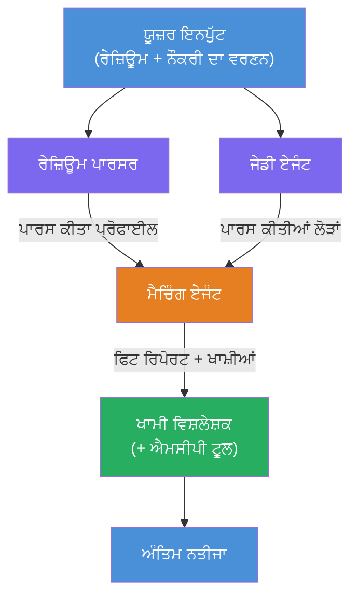
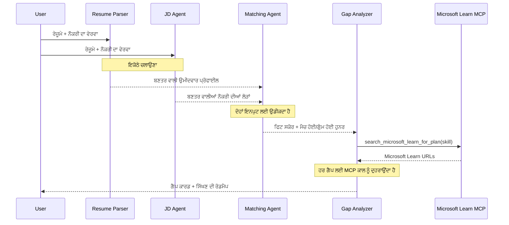
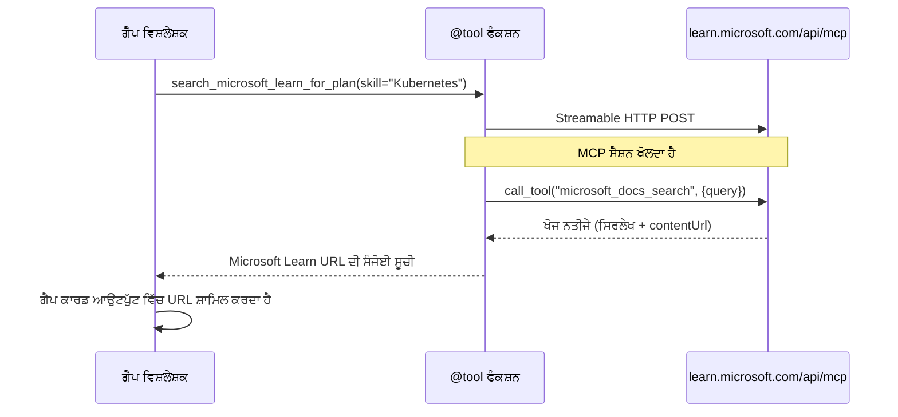

# Module 1 - ਮਲਟੀ-ਏਜੰਟ ਵਾਸਤੁਕਲਾ ਨੂੰ ਸਮਝੋ

ਇਸ ਮਾਡਿਊਲ ਵਿੱਚ, ਤੁਸੀਂ ਕੋਈ ਵੀ ਕੋਡ ਲਿਖਣ ਤੋਂ ਪਹਿਲਾਂ Resume → Job Fit Evaluator ਦੀ ਵਾਸਤੁਕਲਾ ਸਿੱਖਦੇ ਹੋ। ਆਰਕੀਸਟ੍ਰੇਸ਼ਨ ਗ੍ਰਾਫ, ਏਜੰਟ ਦੀ ਭੂਮਿਕਾਵਾਂ ਅਤੇ ਡਾਟਾ ਫਲੋ ਨੂੰ ਸਮਝਣਾ ਡੀਬੱਗਿੰਗ ਅਤੇ [ਮਲਟੀ-ਏਜੰਟ ਵਰਕਫਲੋਜ਼](https://learn.microsoft.com/azure/architecture/ai-ml/idea/multiple-agent-workflow-automation) ਵਿਸਥਾਰ ਲਈ ਬਹੁਤ ਜ਼ਰੂਰੀ ਹੈ।

---

## ਇਸ ਸਮੱਸਿਆ ਦਾ ਹੱਲ ਜੋ ਇਹ ਕਰਦਾ ਹੈ

ਰਿਜ਼ਯੂਮੇ ਨੂੰ ਨੌਕਰੀ ਦੇ ਵਰਣਨ ਨਾਲ ਮੈਚ ਕਰਨਾ ਕਈ ਵੱਖ-ਵੱਖ ਹੁਨਰਾਂ ਦੀ ਮੰਗ ਕਰਦਾ ਹੈ:

1. **ਪਾਰਸਿੰਗ** - ਅਸੰਰਚਿਤ ਟੈਕਸਟ (ਰਿਜ਼ਯੂਮੇ) ਤੋਂ ਸੰਰਚਿਤ ਡਾਟਾ ਕੱਢਣਾ
2. **ਵਿਸ਼ਲੇਸ਼ਣ** - ਨੌਕਰੀ ਦੇ ਵਰਣਨ ਵਿੱਚੋਂ ਲੋੜਾਂ ਕੱਢਣਾ
3. **ਤੁਲਨਾ** - ਦੋਹਾਂ ਦੇ ਵਿਚਕਾਰ ਮਿਲਾਪ ਦਾ ਅੰਕੜਾ ਦੇਣਾ
4. **ਯੋਜਨਾ ਬਣਾਉਣਾ** - ਖ਼ਾਮੀਆਂ ਪੂਰੀ ਕਰਨ ਲਈ ਸਿੱਖਣ ਦਾ ਰੋਡਮੈਪ ਤਿਆਰ ਕਰਨਾ

ਇੱਕ ਹੀ ਏਜੰਟ ਜਦੋਂ ਇਹ ਸਾਰੇ ਚਾਰ ਕੰਮ ਇੱਕੋ ਪ੍ਰਾਪਟ ਵਿੱਚ ਕਰਦਾ ਹੈ ਤਾਂ ਅਕਸਰ ਮਿਲਦਾ ਹੈ:
- ਅਧੂਰਾ ਨਿਕਾਸਾ (ਇਹ ਸਕੋਰ ਤੱਕ ਪਹੁੰਚਣ ਲਈ ਪਾਰਸਿੰਗ ਨੂੰ ਜਲਦੀ ਕਰਦਾ ਹੈ)
- ਸਤਹੀ ਸਕੋਰਿੰਗ (ਕੋਈ ਸਬੂਤ ਦੇ ਆਧਾਰ ਤੇ ਵਿਸ਼ਲੇਸ਼ਣ ਨਹੀਂ)
- ਆਮ ਰੋਡਮੈਪ (ਖਾਸ ਖਾਮੀਆਂ ਦੇ ਤੌਰ 'ਤੇ ਨਹੀਂ ਬਣਾਇਆ)

**ਚਾਰ ਵਿਸ਼ੇਸ਼ ਏਜੰਟਾਂ** ਵਿੱਚ ਵੰਡ ਕੇ, ਹਰ ਇੱਕ ਆਪਣੀ ਭੂਮਿਕਾ ਤੇ ਧਿਆਨ ਕੇਂਦਰਿਤ ਕਰਦਾ ਹੈ, ਜਿਸ ਨਾਲ ਹਰ ਪੜਾਅ ਤੇ ਉੱਚ ਗੁਣਵੱਤਾ ਵਾਲੀ ਆਉਟਪੁੱਟ ਮਿਲਦੀ ਹੈ।

---

## ਚਾਰ ਏਜੰਟ

ਹਰ ਏਜੰਟ ਇੱਕ ਪੂਰਾ [Microsoft Foundry](https://learn.microsoft.com/azure/foundry/agents/concepts/hosted-agents) ਏਜੰਟ ਹੈ ਜੋ `AzureAIAgentClient.as_agent()` ਦੁਆਰਾ ਬਣਾਇਆ ਗਿਆ ਹੈ। ਉਹ ਇੱਕੋ ਮਾਡਲ ਡਿਪਲੋਇਮੈਂਟ ਸਾਂਝਾ ਕਰਦੇ ਹਨ ਪਰ ਇਕ ਦੂਜੇ ਤੋਂ ਵੱਖ-ਵੱਖ ਦਿਸ਼ਾ-ਨਿਰਦੇਸ਼ ਅਤੇ (ਚਾਹੇ ਤਾਂ) ਵੱਖਰੇ ਟੂਲ ਵਰਤਦੇ ਹਨ।

| # | ਏਜੰਟ ਦਾ ਨਾਮ | ਭੂਮਿਕਾ | ਇਨਪੁੱਟ | ਆਊਟਪੁੱਟ |
|---|-------------|--------|---------|-----------|
| 1 | **ResumeParser** | ਰਿਜ਼ਯੂਮੇ ਟੈਕਸਟ ਤੋਂ ਸੰਰਚਿਤ ਪ੍ਰੋਫਾਈਲ ਕੱਢਦਾ ਹੈ | ਕੱਚਾ ਰਿਜ਼ਯੂਮੇ ਟੈਕਸਟ (ਉਪਭੋਗਤਾ ਵੱਲੋਂ) | ਉਮੀਦਵਾਰ ਪ੍ਰੋਫਾਈਲ, ਤਕਨੀਕੀ ਹੁਨਰ, ਨਰਮ ਹੁਨਰ, ਪ੍ਰਮਾਣ ਪੱਤਰ, ਡੋਮੇਨ ਅਨੁਭਵ, ਉਪਲਬਧੀਆਂ |
| 2 | **JobDescriptionAgent** | ਨੌਕਰੀ ਦੇ ਵਰਣਨ ਤੋਂ ਸੰਰਚਿਤ ਲੋੜਾਂ ਕੱਢਦਾ ਹੈ | ਕੱਚਾ ਨੌਕਰੀ ਦਾ ਵਰਣਨ ਟੈਕਸਟ (ਉਪਭੋਗਤਾ ਵੱਲੋਂ, ResumeParser ਰਾਹੀਂ ਅੱਗੇ ਭੇਜਿਆ) | ਭੂਮਿਕਾ ਦਾ ਸਾਰ, ਲੋੜੀਂਦੇ ਹੁਨਰ, ਪਸੰਦੀਦਾ ਹੁਨਰ, ਅਨੁਭਵ, ਪ੍ਰਮਾਣ ਪੱਤਰ, ਸਿੱਖਿਆ, ਜਿੰਮੇਵਾਰੀਆਂ |
| 3 | **MatchingAgent** | ਸਬੂਤ-ਆਧਾਰਿਤ ਫਿਟ ਸਕੋਰ ਗਣਨਾ ਕਰਦਾ ਹੈ | ResumeParser + JobDescriptionAgent ਤੋਂ ਆਉਟਪੁੱਟ | ਫਿਟ ਸਕੋਰ (0-100, ਵਿਸਥਾਰ ਸਮੇਤ), ਮਿਲੇ ਹੁਨਰ, ਗੁੰਮ ਹੋਏ ਹੁਨਰ, ਖਾਲੀ ਜਗ੍ਹਾ |
| 4 | **GapAnalyzer** | ਨਿੱਜੀਕ੍ਰਿਤ ਸਿੱਖਣ ਦਾ ਰੋਡਮੈਪ ਤਿਆਰ ਕਰਦਾ ਹੈ | MatchingAgent ਤੋਂ ਆਉਟਪੁੱਟ | ਖਾਲੀ ਕਾਰਡ (ਹਰ ਹੁਨਰ ਲਈ), ਸਿੱਖਣ ਦਾ ਕ੍ਰਮ, ਸਮਾਂਸਾਰਣੀ, Microsoft Learn ਤੋਂ ਸਰੋਤ |

---

## ਆਰਕੀਸਟ੍ਰੇਸ਼ਨ ਗ੍ਰਾਫ

ਵਰਕਫਲੋ **ਸਮਾਂਤਰੀ ਫੈਨ-ਆਉਟ** ਅਤੇ ਫਿਰ **ਕ੍ਰਮਬੱਧ ਸੰਘਰਸ਼** ਵਰਤਦਾ ਹੈ:


> **ਲੇਜੈਂਡ:** ਬੈਗਨੀ = ਸਮਾਂਤਰੀ ਏਜੰਟ, ਸੰਤਰੀ = ਸੰਘਰਸ਼ ਬਿੰਦੂ, ਹਰਾ = ਅੰਤਿਮ ਏਜੰਟ ਟੂਲਾਂ ਨਾਲ

### ਡਾਟਾ ਕਿਵੇਂ ਵਗਦਾ ਹੈ


1. **ਉਪਭੋਗਤਾ ਭੇਜਦਾ ਹੈ** ਇੱਕ ਸੁਨੇਹਾ ਜਿਸ ਵਿੱਚ ਰਿਜ਼ਯੂਮੇ ਅਤੇ ਨੌਕਰੀ ਦਾ ਵਰਣਨ ਹੁੰਦਾ ਹੈ।
2. **ResumeParser** ਪੂਰੀ ਉਪਭੋਗਤਾ ਇਨਪੁੱਟ ਲੈਂਦਾ ਹੈ ਅਤੇ ਸੰਰਚਿਤ ਉਮੀਦਵਾਰ ਪ੍ਰੋਫਾਈਲ ਕੱਢਦਾ ਹੈ।
3. **JobDescriptionAgent** ਸਮਾਂਤਰੀ ਤੇ ਉਪਭੋਗਤਾ ਇਨਪੁੱਟ ਲੈਂਦਾ ਹੈ ਅਤੇ ਲੋੜੀਂਦੇ ਕਾਰਜ ਕੱਢਦਾ ਹੈ।
4. **MatchingAgent** ਦੋਹਾਂ ResumeParser ਅਤੇ JobDescriptionAgent ਤੋਂ ਆਉਟਪੁੱਟ ਲੈਂਦਾ ਹੈ (ਫਰੇਮਵਰਕ ਦੋਹਾਂ ਦੇ ਖਤਮ ਹੋਣ ਦਾ ਇੰਤਜ਼ਾਰ ਕਰਦਾ ਹੈ ਫਿਰ MatchingAgent ਚਲਾਉਂਦਾ ਹੈ)।
5. **GapAnalyzer** MatchingAgent ਦਾ ਆਉਟਪੁੱਟ ਲੈਂਦਾ ਹੈ ਅਤੇ **Microsoft Learn MCP ਟੂਲ** ਨੂੰ ਕਾਲ ਕਰਕੇ ਹਰ ਖਾਲੀ ਲਈ ਅਸਲ ਸਿਖਲਾਈ ਦੇ ਸਰੋਤ ਲੈਂਦਾ ਹੈ।
6. **ਅੰਤਿਮ ਆਉਟਪੁੱਟ** GapAnalyzer ਦਾ ਜਵਾਬ ਹੁੰਦਾ ਹੈ ਜਿਸ ਵਿੱਚ ਫਿਟ ਸਕੋਰ, ਖਾਲੀ ਕਾਰਡ ਅਤੇ ਪੂਰਾ ਸਿੱਖਣ ਰੋਡਮੈਪ ਸ਼ਾਮਲ ਹਨ।

### ਸਮਾਂਤਰੀ ਫੈਨ-ਆਉਟ ਕਿਉਂ ਜ਼ਰੂਰੀ ਹੈ

ResumeParser ਅਤੇ JobDescriptionAgent **ਸਮਾਂਤਰੀ ਤੌਰ ਤੇ** ਚੱਲਦੇ ਹਨ ਕਿਉਂਕਿ ਇਹ ਇਕ ਦੂਜੇ 'ਤੇ ਨਿਰਭਰ ਨਹੀਂ ਹਨ। ਇਸ ਨਾਲ:
- ਕੁੱਲ ਲੇਟਸੀ ਘਟਦੀ ਹੈ (ਦੋਹਾਂ ਇੱਕੇ ਸਮੇਂ ਚਲਦੇ ਹਨ ਨਾ ਕਿ ਕ੍ਰਮਵੱਧ)
- ਕੁਦਰਤੀ ਵੰਡ ਹੈ (ਰਿਜ਼ਯੂਮੇ ਦੀ ਪਾਰਸਿੰਗ ਵੱਖ, JD ਦੀ ਪਾਰਸਿੰਗ ਵੱਖ ਹੈ)
- ਇਹ ਆਮ ਮਲਟੀ-ਏਜੰਟ ਪੈਟਰਨ ਨੂੰ ਦਰਸਾਉਂਦਾ ਹੈ: **ਫੈਨ-ਆਉਟ → ਸੰਘਰਸ਼ → ਕਾਰਵਾਈ**

---

## ਕੋਡ ਵਿੱਚ WorkflowBuilder

ਇਹ ਹੈ ਕਿਵੇਂ ਉਪਰ ਦਿੱਤਾ ਗ੍ਰਾਫ [`WorkflowBuilder`](https://learn.microsoft.com/agent-framework/workflows/agents-in-workflows) API ਕਾਲਾਂ ਨਾਲ `main.py` ਵਿੱਚ ਮਿਲਦਾ ਹੈ:

```python
from agent_framework import WorkflowBuilder

workflow = (
    WorkflowBuilder(
        name="ResumeJobFitEvaluator",
        start_executor=resume_parser,       # ਪਹਿਲਾ ਏਜੰਟ ਜੋ ਉਪਭੋਗਤਾ ਇਨਪੁੱਟ ਪ੍ਰਾਪਤ ਕਰਦਾ ਹੈ
        output_executors=[gap_analyzer],     # ਆਖਰੀ ਏਜੰਟ ਜਿਸਦਾ ਆਉਟਪੁੱਟ ਵਾਪਸ ਕੀਤਾ ਜਾਂਦਾ ਹੈ
    )
    .add_edge(resume_parser, jd_agent)      # ਰਿਜ਼ਿੂਮੇ ਪਾਰਸਰ → ਜੌਬ ਡਿਸਕ੍ਰਿਪਸ਼ਨ ਏਜੰਟ
    .add_edge(resume_parser, matching_agent) # ਰਿਜ਼ਿੂਮੇ ਪਾਰਸਰ → ਮਿਲਾਪ ਏਜੰਟ
    .add_edge(jd_agent, matching_agent)      # ਜੌਬ ਡਿਸਕ੍ਰਿਪਸ਼ਨ ਏਜੰਟ → ਮਿਲਾਪ ਏਜੰਟ
    .add_edge(matching_agent, gap_analyzer)  # ਮਿਲਾਪ ਏਜੰਟ → ਗੈਪ ਵਿਸ਼ਲੇਸ਼ਕ
    .build()
)
```

**ਐਜ਼ ਇਨ ਮੈਲਾ ਦਾ ਅਰਥ:**

| ਐਜ਼ | ਕੀ ਮਤਲਬ ਹੈ |
|-----|-------------|
| `resume_parser → jd_agent` | JD ਏਜੰਟ ਨੂੰ ResumeParser ਦਾ ਆਉਟਪੁੱਟ ਮਿਲਦਾ ਹੈ |
| `resume_parser → matching_agent` | MatchingAgent ਨੂੰ ResumeParser ਦਾ ਆਉਟਪੁੱਟ ਮਿਲਦਾ ਹੈ |
| `jd_agent → matching_agent` | MatchingAgent ਨੂੰ JD Agent ਦਾ ਵੀ ਆਉਟਪੁੱਟ ਮਿਲਦਾ ਹੈ (ਦੋਹਾਂ ਦਾ ਇੰਤਜ਼ਾਰ ਕਰਦਾ ਹੈ) |
| `matching_agent → gap_analyzer` | GapAnalyzer ਨੂੰ MatchingAgent ਦਾ ਆਉਟਪੁੱਟ ਮਿਲਦਾ ਹੈ |

ਕਿਉਂਕਿ `matching_agent` ਕੋਲ **ਦੋ ਆਉਣ ਵਾਲੇ ਰਸਤੇ** ਹਨ (`resume_parser` ਅਤੇ `jd_agent`), ਫਰੇਮਵਰਕ ਆਪਣੇ ਆਪ ਦੋਹਾਂ ਦੇ ਖਤਮ ਹੋਣ ਦਾ ਇੰਤਜ਼ਾਰ ਕਰਦਾ ਹੈ ਫਿਰ Matching Agent ਚਲਾਉਂਦਾ ਹੈ।

---

## MCP ਟੂਲ

GapAnalyzer ਏਜੰਟ ਕੋਲ ਇੱਕ ਔਜ਼ਾਰ ਹੈ: `search_microsoft_learn_for_plan`। ਇਹ ਇੱਕ **[MCP ਟੂਲ](https://learn.microsoft.com/agent-framework/agents/tools/hosted-mcp-tools)** ਹੈ ਜੋ Microsoft Learn API ਨੂੰ ਕਾਲ ਕਰਕੇ ਨਿਰਧਾਰਿਤ ਸਿੱਖਣ ਸਰੋਤ ਲੈ ਕੇ ਆਉਂਦਾ ਹੈ।

### ਇਹ ਕਿਵੇਂ ਕੰਮ ਕਰਦਾ ਹੈ

```python
@tool
async def search_microsoft_learn_for_plan(
    skill: str, role: str = "", max_results: int = 5
) -> str:
    """Search Microsoft Learn MCP and return curated official links."""
    # Streamable HTTP ਦੁਆਰਾ https://learn.microsoft.com/api/mcp ਨਾਲ ਜੁੜਦਾ ਹੈ
    # MCP ਸਰਵਰ 'ਤੇ 'microsoft_docs_search' ਟੂਲ ਨੂੰ ਕਾਲ ਕਰਦਾ ਹੈ
    # Microsoft Learn URL ਦੀ ਫਾਰਮੈਟ ਕੀਤੀ ਸੂਚੀ ਵਾਪਸ ਕਰਦਾ ਹੈ
```

### MCP ਕਾਲ ਫਲੋ


1. GapAnalyzer ਫੈਸਲਾ ਕਰਦਾ ਹੈ ਕਿ ਕਿਸੇ ਹੁਨਰ ਲਈ ਸਿੱਖਣ ਦੇ ਸਰੋਤ ਚਾਹੀਦੇ ਹਨ (ਜਿਵੇਂ, "Kubernetes")
2. ਫਰੇਮਵਰਕ `search_microsoft_learn_for_plan(skill="Kubernetes")` ਨੂੰ ਕਾਲ ਕਰਦਾ ਹੈ
3. ਫੰਕਸ਼ਨ ਇੱਕ [Streamable HTTP](https://learn.microsoft.com/agent-framework/agents/tools/hosted-mcp-tools) ਕਨੈਕਸ਼ਨ `https://learn.microsoft.com/api/mcp` ਤੇ ਖੋਲ੍ਹਦਾ ਹੈ
4. ਇਹ [MCP ਸਰਵਰ](https://learn.microsoft.com/azure/foundry/agents/how-to/tools/model-context-protocol) 'ਤੇ `microsoft_docs_search` ਟੂਲ ਨੂੰ ਕਾਲ ਕਰਦਾ ਹੈ
5. MCP ਸਰਵਰ ਖੋਜ ਨਤੀਜੇ (ਸਿਰਲੇਖ + URL) ਵਾਪਸ ਦਿੰਦਾ ਹੈ
6. ਫੰਕਸ਼ਨ ਨਤੀਜਿਆਂ ਨੂੰ ਫਾਰਮੈਟ ਕਰਦਾ ਹੈ ਅਤੇ ਸਤਰ ਰੂਪ ਵਿੱਚ ਵਾਪਸ ਕਰਦਾ ਹੈ
7. GapAnalyzer ਫਿਰ ਆਪਣੀ ਖਾਲੀ ਕਾਰਡ ਆਊਟਪੁੱਟ ਵਿੱਚ ਉਹ URL ਵਰਤਦਾ ਹੈ

### MCP ਲੌਗ ਉਮੀਦ

ਜਦ ਇਹ ਟੂਲ ਚੱਲਦਾ ਹੈ, ਤੁਹਾਨੂੰ ਲੌਗ ਐਂਟ੍ਰੀਆਂ ਇਸ ਤਰ੍ਹਾਂ ਮਿਲ ਸਕਦੀਆਂ ਹਨ:

```
GET https://learn.microsoft.com/api/mcp → 405 (Method Not Allowed)
POST https://learn.microsoft.com/api/mcp → 200
DELETE https://learn.microsoft.com/api/mcp → 405 (Method Not Allowed)
```

**ਇਹ ਸਧਾਰਨ ਗੱਲ ਹੈ।** MCP ਕਲਾਇੰਟ ਸ਼ੁਰੂਆਤ ਵਿੱਚ GET ਅਤੇ DELETE ਨਾਲ ਪ੍ਰੋਬ ਕਰਦਾ ਹੈ - 405 ਮਿਲਣਾ ਆਮ ਗੱਲ ਹੈ। ਅਸਲੀ ਟੂਲ ਕਾਲ POST ਨਾਲ ਹੁੰਦਾ ਹੈ ਅਤੇ 200 ਵਾਪਸ ਕਰਦਾ ਹੈ। ਸਿਰਫ਼ ਤਾਂ ਫਿਕਰ ਕਰੋ ਜੇ POST ਕਾਲਾਂ ਫੇਲ ਹੋਣ।

---

## ਏਜੰਟ ਬਣਾਉਣ ਦਾ ਪੈਟਰਨ

ਹਰ ਏਜੰਟ **[`AzureAIAgentClient.as_agent()`](https://learn.microsoft.com/python/api/overview/azure/ai-agents-readme) ਐਸਿੰਕ ਸੰਧਰਭ ਮੈਨੇਜਰ** ਨਾਲ ਬਣਾਇਆ ਜਾਂਦਾ ਹੈ। ਇਹ Foundry SDK ਦਾ ਪੈਟਰਨ ਹੈ ਜੋ ਆਪਣੇ ਆਪ ਸਾਫ-ਸੁਥਰੇ ਕਰਨਾ ਯਕੀਨੀ ਬਣਾਉਂਦਾ ਹੈ:

```python
async with (
    get_credential() as credential,
    AzureAIAgentClient(
        project_endpoint=PROJECT_ENDPOINT,
        model_deployment_name=MODEL_DEPLOYMENT_NAME,
        credential=credential,
    ).as_agent(
        name="ResumeParser",
        instructions=RESUME_PARSER_INSTRUCTIONS,
    ) as resume_parser,
    # ... ਹਰ ਏਜੰਟ ਲਈ ਦੁਹਰਾਓ ...
):
    # ਇੱਥੇ ਸਾਰੇ 4 ਏਜੰਟ ਮੌਜੂਦ ਹਨ
    workflow = create_workflow(resume_parser, jd_agent, matching_agent, gap_analyzer)
```

**ਮੁੱਖ ਗੱਲਾਂ:**
- ਹਰ ਏਜੰਟ ਨੂੰ ਆਪਣਾ `AzureAIAgentClient` ਇੰਸਟੈਂਸ ਮਿਲਦਾ ਹੈ (SDK ਏਜੰਟ ਨਾਮ ਨੂੰ ਕਲਾਇੰਟ ਨਾਲ ਸੀਮਿਤ ਕਰਦਾ ਹੈ)
- ਸਾਰੇ ਏਜੰਟ ਇੱਕੋ `credential`, `PROJECT_ENDPOINT`, ਅਤੇ `MODEL_DEPLOYMENT_NAME` ਸਾਂਝੇ ਕਰਦੇ ਹਨ
- `async with` ਬਲਾਕ ਨਿਸ਼ਚਿਤ ਕਰਦਾ ਹੈ ਕਿ ਸਰਵਰ ਬੰਦ ਹੋਣ 'ਤੇ ਸਾਰੇ ਏਜੰਟ ਸਾਫ ਹੋ ਜਾਂਦੇ ਹਨ
- GapAnalyzer ਨੂੰ ਇਲਾਵਾ ਟੂਲ `tools=[search_microsoft_learn_for_plan]` ਮਿਲਦੇ ਹਨ

---

## ਸਰਵਰ ਸ਼ੁਰੂਆਤ

ਏਜੰਟ ਬਣਾਉਣ ਅਤੇ ਵਰਕਫਲੋ ਬਣਾਉਣ ਤੋਂ ਬਾਅਦ, ਸਰਵਰ ਚਾਲੂ ਹੁੰਦਾ ਹੈ:

```python
from azure.ai.agentserver.agentframework import from_agent_framework

agent = create_workflow(resume_parser, jd_agent, matching_agent, gap_analyzer)
await from_agent_framework(agent).run_async()
```

`from_agent_framework()` ਵਰਕਫਲੋ ਨੂੰ HTTP ਸਰਵਰ ਦੇ ਤੌਰ ਤੇ ਰੈਪ ਕਰਦਾ ਹੈ ਜੋ ਪੋਰਟ 8088 'ਤੇ `/responses` ਐਂਡਪોયਿੰਟ ਪ੍ਰਦਾਨ ਕਰਦਾ ਹੈ। ਇਹ Lab 01 ਵਰਗੀ ਹੀ ਪੈਟਰਨ ਹੈ, ਪਰ ਹੁਣ "ਏਜੰਟ" ਪੂਰਾ [ਵਰਕਫਲੋ ਗ੍ਰਾਫ](https://learn.microsoft.com/agent-framework/workflows/as-agents) ਹੈ।

---

### ਚੈਕਪੌਇੰਟ

- [ ] ਤੁਸੀਂ 4-ਏਜੰਟ ਵਾਸਤੁਕਲਾ ਅਤੇ ਹਰ ਏਜੰਟ ਦੀ ਭੂਮਿਕਾ ਸਮਝਦੇ ਹੋ
- [ ] ਤੁਸੀਂ ਡਾਟਾ ਫਲੋ ਟ੍ਰੇਸ ਕਰ ਸਕਦੇ ਹੋ: ਉਪਭੋਗਤਾ → ResumeParser → (ਸਮਾਂਤਰੀ) JD Agent + MatchingAgent → GapAnalyzer → ਆਊਟਪੁੱਟ
- [ ] ਤੁਸੀਂ ਸਮਝਦੇ ਹੋ ਕਿ MatchingAgent ਕਿਉਂ ਦੋਹਾਂ ResumeParser ਅਤੇ JD Agent ਦਾ ਇੰਤਜ਼ਾਰ ਕਰਦਾ ਹੈ (ਦੋ ਆਉਣ ਵਾਲੇ ਰਸਤੇ)
- [ ] ਤੁਸੀਂ MCP ਟੂਲ ਨੂੰ ਸਮਝਦੇ ਹੋ: ਇਹ ਕੀ ਕਰਦਾ ਹੈ, ਕਿਵੇਂ ਕਾਲ ਹੁੰਦਾ ਹੈ, ਅਤੇ GET 405 ਲੌਗ ਆਮ ਗੱਲ ਹੈ
- [ ] ਤੁਸੀਂ `AzureAIAgentClient.as_agent()` ਪੈਟਰਨ ਅਤੇ ਕਿਉਂ ਹਰ ਏਜੰਟ ਨੂੰ ਆਪਣੇ ਕਲਾਇੰਟ ਇੰਸਟੈਂਸ ਦੀ ਲੋੜ ਹੈ, ਸਮਝਦੇ ਹੋ
- [ ] ਤੁਸੀਂ `WorkflowBuilder` ਕੋਡ ਪੜ੍ਹ ਸਕਦੇ ਹੋ ਅਤੇ ਇਸਨੂੰ ਵਿਜ਼ੂਅਲ ਗ੍ਰਾਫ ਨਾਲ ਮੈਚ ਕਰ ਸਕਦੇ ਹੋ

---

**ਪਿਛਲਾ:** [00 - ਪ੍ਰਿਥਮਕ ਸ਼ਰੌਤਾਂ](00-prerequisites.md) · **ਅਗਲਾ:** [02 - ਮਲਟੀ-ਏਜੰਟ ਪ੍ਰੋਜੈਕਟ ਦੀ ਢਾਂਚਾਬੰਦੀ →](02-scaffold-multi-agent.md)

---

<!-- CO-OP TRANSLATOR DISCLAIMER START -->
**ਅਸਵੀਕਾਰੋक्ति**:  
ਇਹ ਦਸਤਾਵੇਜ਼ ਏਆਈ ਅਨੁਵਾਦ ਸੇਵਾ [Co-op Translator](https://github.com/Azure/co-op-translator) ਦੀ ਵਰਤੋਂ ਕਰਕੇ ਅਨੁਵਾਦ ਕੀਤਾ ਗਿਆ ਹੈ। ਜਦੋਂ ਕਿ ਅਸੀਂ ਸਹੀਤਾ ਲਈ ਕੋਸ਼ਿਸ਼ ਕਰਦੇ ਹਾਂ, ਕਿਰਪਾ ਕਰਕੇ ਧਿਆਨ ਵਿੱਚ ਰੱਖੋ ਕਿ ਸਵੈਚਾਲਿਤ ਅਨੁਵਾਦ ਵਿੱਚ ਗਲਤੀਆਂ ਜਾਂ ਅਸੰਬੰਧਿਤ ਜਾਣਕਾਰੀ ਹੋ ਸਕਦੀ ਹੈ। ਮੂਲ ਦਸਤਾਵੇਜ਼ ਆਪਣੀ ਮੂਲ ਭਾਸ਼ਾ ਵਿੱਚ ਅਧਿਕਾਰਿਕ ਸਰੋਤ ਵਜੋਂ ਮੰਨਿਆ ਜਾਣਾ ਚਾਹੀਦਾ ਹੈ। ਜਰੂਰੀ ਜਾਣਕਾਰੀ ਲਈ, ਪ੍ਰੋਫੈਸ਼ਨਲ ਮਨੁੱਖੀ ਅਨੁਵਾਦ ਦੀ ਸਿਫ਼ਾਰਸ਼ ਕੀਤੀ ਜਾਂਦੀ ਹੈ। ਅਸੀਂ ਇਸ ਅਨੁਵਾਦ ਦੀ ਵਰਤੋਂ ਨਾਲ ਪੈਦਾ ਹੋਣ ਵਾਲੀਆਂ ਕਿਸੇ ਵੀ ਗਲਤਫਹਿਮੀਆਂ ਜਾਂ ਗਲਤ ਵਿਆਖਿਆਵਾਂ ਲਈ ਜ਼ਿੰਮੇਵਾਰ ਨਹੀਂ ਹਾਂ।
<!-- CO-OP TRANSLATOR DISCLAIMER END -->