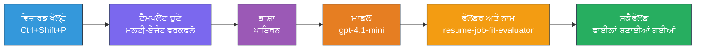
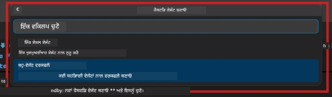

# Module 2 - ਮਲਟੀ-ਏਜੰਟ ਪ੍ਰੋਜੈਕਟ ਦਾ ਸਿਕੈਫੋਲਡ ਬਣਾਓ

 ਇਸ ਮਾਡਿਊਲ ਵਿੱਚ, ਤੁਸੀਂ [Microsoft Foundry extension](https://marketplace.visualstudio.com/items?itemName=TeamsDevApp.vscode-ai-foundry) ਦੀ ਵਰਤੋਂ ਕਰਕੇ **ਮਲਟੀ-ਏਜੰਟ ਵਰਕਫਲੋ ਪ੍ਰੋਜੈਕਟ ਦਾ ਸਿਕੈਫੋਲਡ ਬਣਾਉਂਦੇ ਹੋ**। ਐਕਸਟੈਂਸ਼ਨ ਪੂਰੇ ਪ੍ਰੋਜੈਕਟ ਢਾਂਚੇ ਨੂੰ ਜਨਰੇਟ ਕਰਦਾ ਹੈ - `agent.yaml`, `main.py`, `Dockerfile`, `requirements.txt`, `.env`, ਅਤੇ ਡੀਬੱਗ ਕੰਫਿਗਰੇਸ਼ਨ। ਫੇਰ ਤੁਸੀਂ ਇਹ ਫਾਇਲਾਂ ਮਾਡਿਊਲ 3 ਅਤੇ 4 ਵਿੱਚ ਕਸਟਮਾਈਜ਼ ਕਰਦੇ ਹੋ।

> **ਨੋਟ:** ਇਸ ਲੈਬ ਵਿੱਚ `PersonalCareerCopilot/` ਫੋਲਡਰ ਇੱਕ ਪੂਰਾ, ਕੰਮ ਕਰਦਾ ਉਦਾਹਰਨ ਹੈ ਇੱਕ ਕਸਟਮਾਈਜ਼ਡ ਮਲਟੀ-ਏਜੰਟ ਪ੍ਰੋਜੈਕਟ ਦਾ। ਤੁਸੀਂ ਨਵਾਂ ਪ੍ਰੋਜੈਕਟ ਸਕੈਫੋਲਡ ਕਰ ਸਕਦੇ ਹੋ (ਸਿੱਖਣ ਲਈ ਸਿਫਾਰਸ਼ੀ) ਜਾਂ ਮੌਜੂਦਾ ਕੋਡ ਨੂੰ ਸਿੱਧਾ ਅਧਿਐਨ ਕਰ ਸਕਦੇ ਹੋ।

---

## ਕਦਮ 1: Create Hosted Agent ਵਿਜ਼ਾਰਡ ਖੋਲ੍ਹੋ


1. `Ctrl+Shift+P` ਦਬਾਓ **Command Palette** ਖੋਲ੍ਹਣ ਲਈ।
2. ਟਾਈਪ ਕਰੋ: **Microsoft Foundry: Create a New Hosted Agent** ਅਤੇ ਚੁਣੋ।
3. ਹੋਸਟਿਡ ਏਜੰਟ ਬਣਾਉਣ ਦਾ ਵਿਜ਼ਾਰਡ ਖੁਲ ਜਾਵੇਗਾ।

> **ਵਿਕਲਪ:** Activity Bar ਵਿੱਚ **Microsoft Foundry** ਚਿੰਨ੍ਹ 'ਤੇ ਕਲਿਕ ਕਰੋ → **Agents** ਦੇ ਕੋਲ + ਚਿੰਨ੍ਹ 'ਤੇ ਕਲਿਕ ਕਰੋ → **Create New Hosted Agent**।

---

## ਕਦਮ 2: Multi-Agent Workflow ਟੈਮਪਲੇਟ ਚੁਣੋ

ਵਿਜ਼ਾਰਡ ਤੁਹਾਡੇ ਕੋਲ ਇੱਕ ਟੈਮਪਲੇਟ ਚੁਣਨ ਲਈ ਪੁੱਛਦਾ ਹੈ:

| ਟੈਮਪਲੇਟ | ਵੇਰਵਾ | ਕਦੋਂ ਵਰਤਣਾ ਹੈ |
|----------|-------------|-------------|
| Single Agent | ਇੱਕ ਏਜੰਟ ਨਾਲ ਹੁਕਮ ਅਤੇ ਵੈਕਲਪਿਕ ਸੰਦ | ਲੈਬ 01 |
| **Multi-Agent Workflow** | ਕਈ ਏਜੰਟ ਜੋ WorkflowBuilder ਰਾਹੀਂ ਸਹਿਯੋਗ ਕਰਦੇ ਹਨ | **ਇਹ ਲੈਬ (ਲੈਬ 02)** |

1. **Multi-Agent Workflow** ਚੁਣੋ।
2. **Next** 'ਤੇ ਕਲਿਕ ਕਰੋ।



---

## ਕਦਮ 3: ਪ੍ਰੋਗਰਾਮਿੰਗ ਭਾਸ਼ਾ ਚੁਣੋ

1. **Python** ਚੁਣੋ।
2. **Next** 'ਤੇ ਕਲਿਕ ਕਰੋ।

---

## ਕਦਮ 4: ਆਪਣਾ ਮਾਡਲ ਚੁਣੋ

1. ਵਿਜ਼ਾਰਡ ਤੁਹਾਡੇ Foundry ਪ੍ਰੋਜੈਕਟ ਵਿੱਚ ਡਿਪਲੋਇਡ ਮਾਡਲਜ਼ ਦਿਖਾਉਂਦਾ ਹੈ।
2. ਉਸੇ ਮਾਡਲ ਨੂੰ ਚੁਣੋ ਜੋ ਤੁਸੀਂ ਲੈਬ 01 ਵਿੱਚ ਵਰਤਿਆ ਸੀ (ਉਦਾਹਰਨ ਲਈ, **gpt-4.1-mini**).
3. **Next** 'ਤੇ ਕਲਿਕ ਕਰੋ।

> **ਸੁਝਾਵ:** [`gpt-4.1-mini`](https://learn.microsoft.com/azure/foundry/foundry-models/concepts/models-sold-directly-by-azure#gpt-41-series) ਵਿਕਾਸ ਲਈ ਸਿਫਾਰਸ਼ੀ ਹੈ - ਇਹ ਤੇਜ਼, ਸਸਤਾ ਅਤੇ ਮਲਟੀ-ਏਜੰਟ ਵਰਕਫਲੋ ਨੂੰ ਚੰਗੀ ਤਰ੍ਹਾਂ ਹੈਂਡਲ ਕਰਦਾ ਹੈ। ਅੰਤਿਮ ਉਤਪਾਦ ਲਈ ਤਿਆਰ ਕਰਨ ਵਾਸਤੇ `gpt-4.1` ਤੇ ਸਵਿੱਚ ਕਰੋ ਜੇ ਤੁਸੀਂ ਉੱਚ ਗੁਣਵੱਤਾ ਵਾਲਾ ਨਤੀਜਾ ਚਾਹੁੰਦੇ ਹੋ।

---

## ਕਦਮ 5: ਫੋਲਡਰ ਦਾ ਥਾਂ ਅਤੇ ਏਜੰਟ ਦਾ ਨਾਮ ਚੁਣੋ

1. ਫਾਇਲ ਡਾਇਲਾਗ ਖੁਲਦਾ ਹੈ। ਇੱਕ ਟਾਰਗেট ਫੋਲਡਰ ਚੁਣੋ:
   - ਜੇ ਤੁਸੀਂ ਵਰਕਸ਼ਾਪ ਰੇਪੋ ਨਾਲ ਅਗੇ ਵਧ ਰਹੇ ਹੋ: `workshop/lab02-multi-agent/` ਵਿੱਚ ਜਾਓ ਅਤੇ ਨਵਾਂ ਸਬਫੋਲਡਰ ਬਣਾਓ
   - ਜੇ ਨਵਾਂ ਸ਼ੁਰੂ ਕਰ ਰਹੇ ਹੋ: ਕੋਈ ਵੀ ਫੋਲਡਰ ਚੁਣੋ
2. ਹੋਸਟਿਡ ਏਜੰਟ ਲਈ ਇੱਕ **ਨਾਮ** ਦਿਓ (ਉਦਾਹਰਨ ਲਈ, `resume-job-fit-evaluator`).
3. **Create** 'ਤੇ ਕਲਿਕ ਕਰੋ।

---

## ਕਦਮ 6: ਸਕੈਫੋਲਡਿੰਗ ਦੇ ਹੋਣ ਦੀ ਉਡੀਕ ਕਰੋ

1. VS Code ਇੱਕ ਨਵੀਂ ਵਿੰਡੋ ਖੋਲ੍ਹਦਾ ਹੈ (ਜਾਂ ਮੌਜੂਦਾ ਵਿੰਡੋ ਅਪਡੇਟ ਹੁੰਦੀ ਹੈ) ਸਕੈਫੋਲਡ ਕਰਦਿਆਂ ਪ੍ਰੋਜੈਕਟ ਨਾਲ।
2. ਤੁਹਾਨੂੰ ਇਸ ਫਾਇਲ ਢਾਂਚੇ ਨੂੰ ਦੇਖਣਾ ਚਾਹੀਦਾ ਹੈ:

```
resume-job-fit-evaluator/
├── .env                ← Environment variables (placeholders)
├── .vscode/
│   └── launch.json     ← Debug configuration
├── agent.yaml          ← Agent definition (kind: hosted)
├── Dockerfile          ← Container configuration
├── main.py             ← Multi-agent workflow code (scaffold)
└── requirements.txt    ← Python dependencies
```

> **ਵਰਕਸ਼ਾਪ ਨੋਟ:** ਵਰਕਸ਼ਾਪ ਰੇਪੋ ਵਿੱਚ `.vscode/` ਫੋਲਡਰ **ਵਰਕਸਪੇਸ ਰੂਟ** ਤੇ ਹੁੰਦਾ ਹੈ ਜਿਸ ਵਿੱਚ ਸ਼ੇਅਰਡ `launch.json` ਅਤੇ `tasks.json` ਹੁੰਦੇ ਹਨ। ਲੈਬ 01 ਅਤੇ ਲੈਬ 02 ਦੋਹਾਂ ਲਈ ਡੀਬੱਗ ਕੰਫਿਗਰੇਸ਼ਨ ਸ਼ਾਮਿਲ ਹਨ। ਜਦੋਂ ਤੁਸੀਂ F5 ਦਬਾਉਂਦੇ ਹੋ, ਤਾਂ ਡ੍ਰੌਪਡਾਊਨ ਵਿੱਚੋਂ **"Lab02 - Multi-Agent"** ਚੁਣੋ।

---

## ਕਦਮ 7: ਸਕੈਫੋਲਡ ਕੀਤੀਆਂ ਫਾਇਲਾਂ ਨੂੰ ਸਮਝੋ (ਮਲਟੀ-ਏਜੰਟ ਖਾਸ)

ਮਲਟੀ-ਏਜੰਟ ਸਕੈਫੋਲਡ ਸਿੰਗਲ-ਏਜੰਟ ਸਕੈਫੋਲਡ ਤੋਂ ਕਈ ਮਹੱਤਵਪੂਰਨ ਤਰੀਕਿਆਂ ਨਾਲ ਵੱਖਰਾ ਹੈ:

### 7.1 `agent.yaml` - ਏਜੰਟ ਪਰਿਭਾਸ਼ਾ

```yaml
kind: hosted
name: resume-job-fit-evaluator
description: >
  A multi-agent workflow that evaluates resume-to-job fit.
metadata:
  authors:
    - Microsoft
  tags:
    - Multi-Agent Workflow
    - Resume Evaluator
protocols:
  - protocol: responses
    version: v1
environment_variables:
  - name: PROJECT_ENDPOINT
    value: ${PROJECT_ENDPOINT}
  - name: MODEL_DEPLOYMENT_NAME
    value: ${MODEL_DEPLOYMENT_NAME}
```

**ਲੈਬ 01 ਤੋਂ ਵੱਖਰਾ ਮੁੱਖ ਫਰਕ:** `environment_variables` ਸੈਕਸ਼ਨ ਵਿੱਚ MCP ਐਂਡਪੌਇੰਟਾਂ ਜਾਂ ਹੋਰ ਸੰਦ ਕਨਫਿਗਰੇਸ਼ਨ ਲਈ ਵਾਧੂ ਵੈਰੀਏਬਲ ਹੋ ਸਕਦੇ ਹਨ। `name` ਅਤੇ `description` ਮਲਟੀ-ਏਜੰਟ ਪ੍ਰਯੋਗ ਨੂੰ ਦਰਸਾਉਂਦੇ ਹਨ।

### 7.2 `main.py` - ਮਲਟੀ-ਏਜੰਟ ਵਰਕਫਲੋ ਕੋਡ

ਸਕੈਫੋਲਡ ਵਿੱਚ ਸ਼ਾਮਿਲ ਹੈ:
- **ਕਈ ਏਜੰਟ ਲਈ ਹੁਕਮ ਸਟਰਿੰਗਜ਼** (ਹਰ ਏਜੰਟ ਲਈ ਇੱਕ const)
- **ਕਈ [`AzureAIAgentClient.as_agent()`](https://learn.microsoft.com/python/api/overview/azure/ai-agents-readme) ਕੰਟੈਕਸਟ ਮੈਨੇਜਰ** (ਹਰ ਏਜੰਟ ਲਈ ਇੱਕ)
- **[`WorkflowBuilder`](https://learn.microsoft.com/agent-framework/workflows/agents-in-workflows)** ਏਜੰਟਾਂ ਨੂੰ ਇਕੱਠਾ ਜੋੜਣ ਲਈ
- **`from_agent_framework()`** ਵਰਕਫਲੋ ਨੂੰ HTTP ਐਂਡਪੌਇੰਟ ਵਜੋਂ ਸਰਵ ਕਰਨ ਲਈ

```python
from agent_framework import WorkflowBuilder, tool
from agent_framework.azure import AzureAIAgentClient
from azure.ai.agentserver.agentframework import from_agent_framework
```

ਵਾਧੂ ਇੰਪੋਰਟ [`WorkflowBuilder`](https://learn.microsoft.com/agent-framework/workflows/agents-in-workflows) ਲੈਬ 01 ਨਾਲੋਂ ਨਵਾਂ ਹੈ।

### 7.3 `requirements.txt` - ਵਾਧੂ ਡੀਪੈਂਡੇਸੀਜ਼

ਮਲਟੀ-ਏਜੰਟ ਪ੍ਰੋਜੈਕਟ ਲੈਬ 01 ਨਾਲੇ ਬੇਸ ਪੈਕੇਜ ਵਰਤਦਾ ਹੈ, ਨਾਲ ਹੀ ਕਿਸੇ ਵੀ MCP-ਸੰਬੰਧਿਤ ਪੈਕੇਜ ਵੀ:

```
agent-framework-azure-ai==1.0.0rc3
agent-framework-core==1.0.0rc3
azure-ai-agentserver-agentframework==1.0.0b16
azure-ai-agentserver-core==1.0.0b16
debugpy
agent-dev-cli --pre
```

> **ਜ਼ਰੂਰੀ ਵਰਜਨ ਨੋਟ:** `agent-dev-cli` ਪੈਕੇਜ ਨੂੰ `requirements.txt` ਵਿੱਚ `--pre` ਫਲੈਗ ਦੀ ਜ਼ਰੂਰਤ ਹੁੰਦੀ ਹੈ ਤਾ ਕਿ ਆਖਰੀ ਪ੍ਰੀਵਿਊ ਵਰਜਨ ਇੰਸਟਾਲ ਹੋ ਜਾਵੇ। ਇਹ Agent Inspector ਦੀ ਤਾਲਮੇਲ ਲਈ ਲਾਜ਼ਮੀ ਹੈ ਜੋ `agent-framework-core==1.0.0rc3` ਨਾਲ ਕੰਮ ਕਰਦਾ ਹੈ। ਵਰਜਨ ਦੀਆਂ ਵਿਸਥਾਰਾਂ ਲਈ [Module 8 - Troubleshooting](08-troubleshooting.md) ਦੇਖੋ।

| ਪੈਕੇਜ | ਵਰਜਨ | ਮਕਸਦ |
|---------|---------|---------|
| [`agent-framework-azure-ai`](https://learn.microsoft.com/agent-framework/overview/) | `1.0.0rc3` | [Microsoft Agent Framework](https://github.com/microsoft/agent-framework) ਲਈ Azure AI ਇੰਟਿਗ੍ਰੇਸ਼ਨ |
| [`agent-framework-core`](https://learn.microsoft.com/agent-framework/overview/) | `1.0.0rc3` | ਕੋਰ ਰਨਟਾਈਮ (WorkflowBuilder ਸ਼ਾਮਿਲ) |
| `azure-ai-agentserver-agentframework` | `1.0.0b16` | ਹੋਸਟਿਡ ਏਜੰਟ ਸਰਵਰ ਰਨਟਾਈਮ |
| `azure-ai-agentserver-core` | `1.0.0b16` | ਕੋਰ ਏਜੰਟ ਸਰਵਰ ਅਬਸਟ੍ਰੈਕਸ਼ਨ |
| `debugpy` | ਤਾਜ਼ਾ | Python ਡੀਬੱਗਿੰਗ (VS Code ਵਿੱਚ F5) |
| `agent-dev-cli` | `--pre` | ਲੋਕਲ ਡੈਵ CLI + ਏਜੰਟ ਇੰਸਪੈਕਟਰ ਬੈਕਐਂਡ |

### 7.4 `Dockerfile` - ਲੈਬ 01 ਵਰਗਾ ਹੀ

Dockerfile ਲੈਬ 01 ਵਾਲੇ ਵਰਗਾ ਹੈ - ਇਹ ਫਾਇਲਾਂ ਦੀ ਨਕਲ ਕਰਦਾ ਹੈ, `requirements.txt` ਤੋਂ ਡੀਪੈਂਡੇੰਸੀਜ਼ ਇੰਸਟਾਲ ਕਰਦਾ ਹੈ, ਪੋਰਟ 8088 ਖੋਲ੍ਹਦਾ ਹੈ, ਅਤੇ `python main.py` ਚਲਾਉਂਦਾ ਹੈ।

```dockerfile
FROM python:3.14-slim
WORKDIR /app
COPY ./ .
RUN pip install --upgrade pip && \
    if [ -f requirements.txt ]; then \
        pip install -r requirements.txt; \
    else \
      echo "No requirements.txt found" >&2; exit 1; \
    fi
EXPOSE 8088
CMD ["python", "main.py"]
```

---

### ਚੈਕਪოਇੰਟ

- [ ] ਸਕੈਫੋਲਡਿੰਗ ਵਿਜ਼ਾਰਡ ਮੁਕੰਮਲ ਹੋਇਆ → ਨਵਾਂ ਪ੍ਰੋਜੈਕਟ ਢਾਂਚਾ ਵੇਖੋ
- [ ] ਤੁਸੀਂ ਸਾਰੇ ਫਾਇਲ ਵੇਖ ਸਕਦੇ ਹੋ: `agent.yaml`, `main.py`, `Dockerfile`, `requirements.txt`, `.env`
- [ ] `main.py` ਵਿੱਚ `WorkflowBuilder` ਇੰਪੋਰਟ ਸ਼ਾਮਿਲ ਹੈ (ਪ੍ਰਮਾਣ ਹੈ ਕਿ ਮਲਟੀ-ਏਜੰਟ ਟੈਮਪਲੇਟ ਚੁਣਿਆ ਗਿਆ)
- [ ] `requirements.txt` ਵਿੱਚ ਦੋਹਾਂ `agent-framework-core` ਅਤੇ `agent-framework-azure-ai` ਹਨ
- [ ] ਤੁਸੀਂ ਸਮਝਦੇ ਹੋ ਕਿ ਮਲਟੀ-ਏਜੰਟ ਸਕੈਫੋਲਡ ਕਿਵੇਂ ਸਿੰਗਲ-ਏਜੰਟ ਸਕੈਫੋਲਡ ਤੋਂ ਵੱਖਰਾ ਹੈ (ਕਈ ਏਜੰਟ, WorkflowBuilder, MCP ਸੰਦ)

---

**ਪਿਛਲਾ:** [01 - Understand Multi-Agent Architecture](01-understand-multi-agent.md) · **ਅਗਲਾ:** [03 - Configure Agents & Environment →](03-configure-agents.md)

---

<!-- CO-OP TRANSLATOR DISCLAIMER START -->
**ਡਿਸਕਲੇਮਰ**:  
ਇਹ ਦਸਤਾਵੇਜ਼ ਏਆਈ ਅਨੁਵਾਦ ਸੇਵਾ [Co-op Translator](https://github.com/Azure/co-op-translator) ਦੀ ਵਰਤੋਂ ਕਰਕੇ ਅਨੁਵਾਦਿਤ ਕੀਤਾ ਗਿਆ ਹੈ। ਜਦੋਂ ਕਿ ਅਸੀਂ ਸਹੀਤਾ ਲਈ ਪ੍ਰਯਾਸ ਕਰਦੇ ਹਾਂ, ਕਿਰਪਾ ਕਰਕੇ ਧਿਆਨ ਵਿੱਚ ਰੱਖੋ ਕਿ ਆਟੋਮੈਟਿਕ ਅਨੁਵਾਦਾਂ ਵਿੱਚ ਗਲਤੀਆਂ ਜਾਂ ਅਣਸ਼ੁੱਧੀਆਂ ਹੋ ਸਕਦੀਆਂ ਹਨ। ਮੂਲ ਦਸਤਾਵੇਜ਼ ਆਪਣੇ ਮੂਲ ਭਾਸ਼ਾ ਵਿੱਚ ਅਧਿਕਾਰਕ ਸ੍ਰੋਤ ਮੰਨਿਆ ਜਾਣਾ ਚਾਹੀਦਾ ਹੈ। ਜਰੂਰੀ ਜਾਣਕਾਰੀ ਲਈ, ਪ੍ਰੋਫੈਸ਼ਨਲ ਮਨੁੱਖੀ ਅਨੁਵਾਦ ਦੀ ਸਿਫਾਰਿਸ਼ ਕੀਤੀ ਜਾਂਦੀ ਹੈ। ਇਸ ਅਨੁਵਾਦ ਦੀ ਵਰਤੋਂ ਦੇ ਨਤੀਜੇ ਵਜੋਂ ਹੋਣ ਵਾਲੀਆਂ ਕੋਈ ਵੀ ਗਲਤਫਹਮੀ ਜਾਂ ਭ੍ਰਮ ਦੇ ਲਈ ਅਸੀਂ ਜ਼ਿੰਮੇਵਾਰ ਨਹੀਂ ਹਾਂ।
<!-- CO-OP TRANSLATOR DISCLAIMER END -->