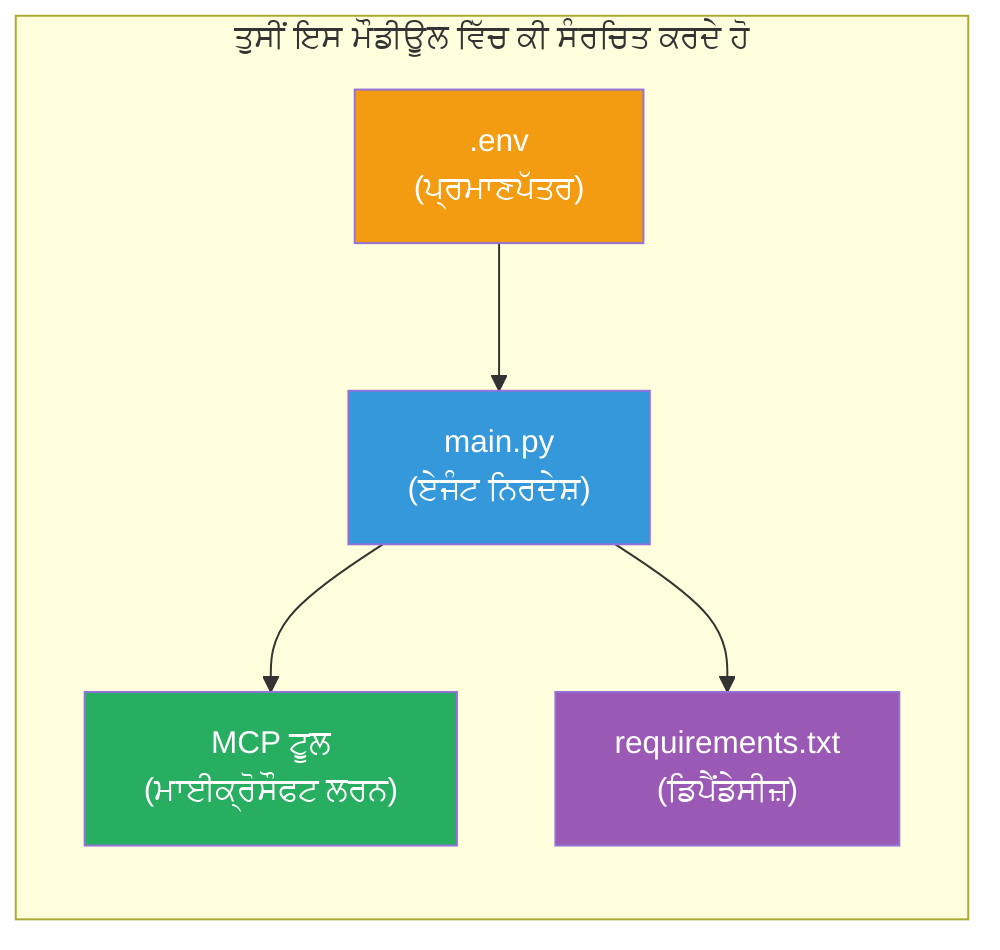

# Module 3 - ਏਜੰਟ, MCP ਟੂਲ ਅਤੇ ਵਾਤਾਵਰਣ ਨੂੰ ਸੰਰਚਿਤ ਕਰੋ

ਇਸ ਮੌਡੀਊਲ ਵਿੱਚ, ਤੁਸੀਂ ਸਕੈਫੋਲਡ ਕੀਤੇ ਗਏ ਮਲਟੀ-ਏਜੰਟ ਪ੍ਰੋਜੈਕਟ ਨੂੰ ਕਸਟਮਾਈਜ਼ ਕਰੋਗੇ। ਤੁਸੀਂ ਸਾਰੇ ਚਾਰ ਏਜੰਟਾਂ ਲਈ ਹਦਾਇਤਾਂ ਲਿਖੋਗੇ, ਮਾਈਕ੍ਰੋਸੌਫਟ ਲਰਨ ਲਈ MCP ਟੂਲ ਸੈੱਟਅਪ ਕਰੋਗੇ, ਵਾਤਾਵਰਣ ਚਲਾਂ ਨੂੰ ਸੰਰਚਿਤ ਕਰੋਗੇ ਅਤੇ ਡਿਪੈਂਡੈਂਸੀਜ਼ ਇੰਸਟਾਲ ਕਰੋਗੇ।


> **ਸੰਦੇਸ਼:** ਪੂਰਾ ਕੰਮ ਕਰਨ ਵਾਲਾ ਕੋਡ [`PersonalCareerCopilot/main.py`](../../../../../workshop/lab02-multi-agent/PersonalCareerCopilot/main.py) ਵਿੱਚ ਹੈ। ਆਪਣਾ ਬਣਾਉਂਦੇ ਸਮੇਂ ਇਸਦਾ ਹਵਾਲਾ ਵਰਤੋਂ।

---

## ਕਦਮ 1: ਵਾਤਾਵਰਣ ਚਲਾਂ ਦੀ ਸੰਰਚਨਾ ਕਰੋ

1. ਆਪਣੇ ਪ੍ਰੋਜੈਕਟ ਦੀ ਰੂਟ ਡਾਇਰੈਕਟਰੀ ਵਿੱਚ ਮੌਜੂਦ **`.env`** ਫਾਈਲ ਖੋਲ੍ਹੋ।
2. ਆਪਣੀ Foundry ਪ੍ਰੋਜੈਕਟ ਦੀ ਜਾਣਕਾਰੀ ਭਰੋ:

   ```env
   PROJECT_ENDPOINT=https://<your-account>.services.ai.azure.com/api/projects/<your-project>
   MODEL_DEPLOYMENT_NAME=gpt-4.1-mini
   ```

3. ਫਾਈਲ ਸੇਵ ਕਰੋ।

### ਇਹ ਮੁੱਲ ਕਿੱਥੋਂ ਮਿਲਣਗੇ

| ਮੁੱਲ | ਕਿਵੇਂ ਲੱਭਣਾ ਹੈ |
|-------|---------------|
| **ਪ੍ਰੋਜੈਕਟ ਐਂਡਪੌਇੰਟ** | Microsoft Foundry ਸਾਈਡਬਾਰ → ਆਪਣਾ ਪ੍ਰੋਜੈਕਟ ਕਲਿਕ ਕਰੋ → ਵੇਰਵਾ ਦਰਸ਼ਾਉਣ ਵਿੱਚ ਐਂਡਪੌਇੰਟ ਯੂਆਰਐਲ |
| **ਮਾਡਲ ਡਿਪਲੋਯਮੈਂਟ ਨਾਮ** | Foundry ਸਾਈਡਬਾਰ → ਪ੍ਰੋਜੈਕਟ ਖੋਲ੍ਹੋ → **Models + endpoints** → ਡਿਪਲੋਯ ਕੀਤੇ ਮਾਡਲ ਦੇ ਨਾਲ ਨਾਂ |

> **ਸੁਰੱਖਿਆ:** `.env` ਨੂੰ ਕਦੇ ਵੀ ਵਰਜਨ ਕੰਟਰੋਲ ਵਿੱਚ ਕਮੇਟ ਨਾ ਕਰੋ। ਜੇ ਪਹਿਲਾਂ ਹੀ ਨਹੀਂ ਹੈ ਤਾਂ ਇਸਨੂੰ `.gitignore` ਵਿੱਚ ਸ਼ਾਮਲ ਕਰੋ।

### ਵਾਤਾਵਰਣ ਚਲਾਂ ਦਾ ਨਕਸ਼ਾ

ਮਲਟੀ-ਏਜੰਟ ਦੀ `main.py` ਦੋਹਾਂ ਸਧਾਰਨ ਅਤੇ ਵਰਕਸ਼ਾਪ-ਖਾਸ env ਵਾਰੀਅਬਲ ਨਾਂ ਪੰਜਾਬੀ ਵਿੱਚ ਪੜ੍ਹਦੀ ਹੈ:

```python
PROJECT_ENDPOINT = os.getenv("AZURE_AI_PROJECT_ENDPOINT") or os.getenv("PROJECT_ENDPOINT")
MODEL_DEPLOYMENT_NAME = os.getenv(
    "AZURE_AI_MODEL_DEPLOYMENT_NAME",
    os.getenv("MODEL_DEPLOYMENT_NAME", "gpt-4.1-mini"),
)
MICROSOFT_LEARN_MCP_ENDPOINT = os.getenv(
    "MICROSOFT_LEARN_MCP_ENDPOINT", "https://learn.microsoft.com/api/mcp"
)
```

MCP ਐਂਡਪੌਇੰਟ ਲਈ ਸਮਝਦਾਰ ਡਿਫੌਲਟ ਹੈ – ਤੁਹਾਨੂੰ ਇਸਨੂੰ `.env` ਵਿੱਚ ਸੈੱਟ ਕਰਨ ਦੀ ਜ਼ਰੂਰਤ ਨਹੀਂ ਜੇਕਰ ਤੁਸੀਂ ਇਸਨੂੰ ਓਵਰਰਾਈਡ ਨਾ ਕਰਨਾ ਚਾਹੁੰਦੇ ਹੋ।

---

## ਕਦਮ 2: ਏਜੰਟ ਹਦਾਇਤਾਂ ਲਿਖੋ

ਇਹ ਸਭ ਤੋਂ ਅਹੰਕਾਰਪੂਰਕ ਕਦਮ ਹੈ। ਹਰ ਏਜੰਟ ਨੂੰ ਧਿਆਨ ਨਾਲ ਬਣਾਈਆਂ ਹੋਈਆਂ ਹਦਾਇਤਾਂ ਦੀ ਲੋੜ ਹੈ ਜੋ ਇਸਦਾ ਕਿਰਦਾਰ, ਨਤੀਜੇ ਦਾ ਫਾਰਮੈਟ ਅਤੇ ਨਿਯਮ ਪਰਿਭਾਸ਼ਿਤ ਕਰਦੀਆਂ ਹਨ। `main.py` ਖੋਲ੍ਹੋ ਅਤੇ ਹਿਦਾਇਤ ਕਾਂਸਟੈਂਟ ਬਣਾਓ (ਜਾਂ ਸੋਧੋ)।

### 2.1 ਰਿਜ਼ਯੂਮ ਪਾਰਸਰ ਏਜੰਟ

```python
RESUME_PARSER_INSTRUCTIONS = """\
You are the Resume Parser.
Extract resume text into a compact, structured profile for downstream matching.

Output exactly these sections:
1) Candidate Profile
2) Technical Skills (grouped categories)
3) Soft Skills
4) Certifications & Awards
5) Domain Experience
6) Notable Achievements

Rules:
- Use only explicit or strongly implied evidence.
- Do not invent skills, titles, or experience.
- Keep concise bullets; no long paragraphs.
- If input is not a resume, return a short warning and request resume text.
"""
```

**ਇਹ ਭਾਗ ਕਿਉਂ?** MatchingAgent ਨੂੰ ਸਕੋਰ ਕਰਨ ਲਈ ਸਾਂਭੀ ਡਾਟਾ ਚਾਹੀਦਾ ਹੈ। ਲਗਾਤਾਰ ਭਾਗਾਂ ਨਾਲ ਏਜੰਟਾਂ ਦਰਮਿਆਨ ਹੱਥ ਵੱਟਣਾ ਭਰੋਸੇਯੋਗ ਬਣਦਾ ਹੈ।

### 2.2 ਨੌਕਰੀ ਦਾ ਵੇਰਵਾ ਏਜੰਟ

```python
JOB_DESCRIPTION_INSTRUCTIONS = """\
You are the Job Description Analyst.
Extract a structured requirement profile from a JD.

Output exactly these sections:
1) Role Overview
2) Required Skills
3) Preferred Skills
4) Experience Required
5) Certifications Required
6) Education
7) Domain / Industry
8) Key Responsibilities

Rules:
- Keep required vs preferred clearly separated.
- Only use what the JD states; do not invent hidden requirements.
- Flag vague requirements briefly.
- If input is not a JD, return a short warning and request JD text.
"""
```

**ਲੋੜੀਂਦੇ ਅਤੇ ਪ੍ਰਾਥਮਿਕਤਾ ਵਾਲੇ ਕਿਉਂ ਵੱਖਰੇ ਹਨ?** MatchingAgent ਹਰ ਇੱਕ ਲਈ ਵੱਖਰੇ ਅੰਕ ਵਰਤਦਾ ਹੈ (ਲੋੜੀਂਦੇ ਹੁਨਰ = 40 ਅੰਕ, ਪ੍ਰਾਥਮਿਕਤਾ ਵਾਲੇ ਹੁਨਰ = 10 ਅੰਕ)।

### 2.3 ਮੇਲ ਖਾਣ ਵਾਲਾ ਏਜੰਟ

```python
MATCHING_AGENT_INSTRUCTIONS = """\
You are the Matching Agent.
Compare parsed resume output vs JD output and produce an evidence-based fit report.

Scoring (100 total):
- Required Skills 40
- Experience 25
- Certifications 15
- Preferred Skills 10
- Domain Alignment 10

Output exactly these sections:
1) Fit Score (with breakdown math)
2) Matched Skills
3) Missing Skills
4) Partially Matched
5) Experience Alignment
6) Certification Gaps
7) Overall Assessment

Rules:
- Be objective and evidence-only.
- Keep partial vs missing separate.
- Keep Missing Skills precise; it feeds roadmap planning.
"""
```

**ਖੁਲਾਸਾ ਸਕੋਰਿੰਗ ਕਿਉਂ?** ਦੁਹਰਾਉਣਯੋਗ ਸਕੋਰਿੰਗ ਨਾਲ ਦੌੜ ਦੀ ਤੁਲਨਾ ਅਤੇ ਸਮੱਸਿਆਵਾਂ ਨੂੰ ਡਿਬੱਗ ਕਰਨਾ ਆਸਾਨ ਹੁੰਦਾ ਹੈ। 100-ਪੁਆਇੰਟ ਸਕੇਲ ਆਖਰੀ ਉਪਭੋਗਤਾਵਾਂ ਲਈ ਸਮਝਣ ਯੋਗ ਹੈ।

### 2.4 ਗੈਪ ਵਿਸ਼ਲੇਸ਼ਣਕਾਰ ਏਜੰਟ

```python
GAP_ANALYZER_INSTRUCTIONS = """\
You are the Gap Analyzer and Roadmap Planner.
Create a practical upskilling plan from the matching report.

Microsoft Learn MCP usage (required):
- For EVERY High and Medium priority gap, call tool `search_microsoft_learn_for_plan`.
- Use returned Learn links in Suggested Resources.
- Prefer Microsoft Learn for free resources.

CRITICAL: You MUST produce a SEPARATE detailed gap card for EVERY skill listed in
the Missing Skills and Certification Gaps sections of the matching report. Do NOT
skip or combine gaps. Do NOT summarize multiple gaps into one card.

Output format:
1) Personalized Learning Roadmap for [Role Title]
2) One DETAILED card per gap (produce ALL cards, not just the first):
   - Skill
   - Priority (High/Medium/Low)
   - Current Level
   - Target Level
   - Suggested Resources (include Learn URL from tool results)
   - Estimated Time
   - Quick Win Project
3) Recommended Learning Order (numbered list)
4) Timeline Summary (week-by-week)
5) Motivational Note

Rules:
- Produce every gap card before writing the summary sections.
- Keep it specific, realistic, and actionable.
- Tailor to candidate's existing stack.
- If fit >= 80, focus on polish/interview readiness.
- If fit < 40, be honest and provide a staged path.
"""
```

**"CRITICAL" ਜ਼ੋਰ ਕਿਉਂ?** ਸਾਰੇ ਗੈਪ ਕਾਰਡ ਬਣਾਉਣ ਦੀ ਸਪਸ਼ਟ ਹਿਦਾਇਤਾਂ ਦੇ ਬਿਨਾਂ, ਮਾਡਲ ਸਿਰਫ 1-2 ਕਾਰਡ ਬਣਾਉਂਦਾ ਹੈ ਅਤੇ ਬਾਕੀ ਦਾ ਸਾਰ ਦਿੰਦਾ ਹੈ। "CRITICAL" ਬਲਾਕ ਇਸ ਕਟੌਤੀ ਨੂੰ ਰੋਕਦਾ ਹੈ।

---

## ਕਦਮ 3: MCP ਟੂਲ ਪਰਿਭਾਸ਼ਿਤ ਕਰੋ

GapAnalyzer ਉਸ ਟੂਲ ਨੂੰ ਵਰਤਦਾ ਹੈ ਜੋ [Microsoft Learn MCP ਸਰਵਰ](https://learn.microsoft.com/azure/foundry/agents/how-to/tools/model-context-protocol) ਨੂੰ ਕਾਲ ਕਰਦਾ ਹੈ। ਇਸਨੂੰ `main.py` ਵਿੱਚ ਸ਼ਾਮਲ ਕਰੋ:

```python
import json
from agent_framework import tool
from mcp.client.session import ClientSession
from mcp.client.streamable_http import streamable_http_client

@tool
async def search_microsoft_learn_for_plan(
    skill: str, role: str = "", max_results: int = 5
) -> str:
    """Search Microsoft Learn MCP and return curated official links for roadmap planning."""
    query = " ".join(part for part in [skill, role, "learning path module"] if part).strip()
    query = query or "job skills learning path"

    try:
        async with streamable_http_client(MICROSOFT_LEARN_MCP_ENDPOINT) as (
            read_stream, write_stream, _,
        ):
            async with ClientSession(read_stream, write_stream) as session:
                await session.initialize()
                result = await session.call_tool(
                    "microsoft_docs_search", {"query": query}
                )

        if not result.content:
            return (
                "No results returned from Microsoft Learn MCP. "
                "Fallback: https://learn.microsoft.com/training/support/catalog-api"
            )

        payload_text = getattr(result.content[0], "text", "")
        data = json.loads(payload_text) if payload_text else {}
        items = data.get("results", [])[:max(1, min(max_results, 10))]

        if not items:
            return f"No direct Microsoft Learn results found for '{skill}'."

        lines = [f"Microsoft Learn resources for '{skill}':"]
        for i, item in enumerate(items, start=1):
            title = item.get("title") or item.get("url") or "Microsoft Learn Resource"
            url = item.get("url") or item.get("link") or ""
            lines.append(f"{i}. {title} - {url}".rstrip(" -"))
        return "\n".join(lines)
    except Exception as ex:
        return (
            f"Microsoft Learn MCP lookup unavailable. Reason: {ex}. "
            "Fallbacks: https://learn.microsoft.com/api/mcp"
        )
```

### ਟੂਲ ਕਿਵੇਂ ਕੰਮ ਕਰਦਾ ਹੈ

| ਕਦਮ | ਕੀ ਹੁੰਦਾ ਹੈ |
|------|-------------|
| 1 | GapAnalyzer ਫੈਸਲਾ ਕਰਦਾ ਹੈ ਕਿ ਇੱਕ ਹੁਨਰ ਲਈ ਸਰੋਤਾਂ ਦੀ ਲੋੜ ਹੈ (ਜਿਵੇਂ, "Kubernetes") |
| 2 | ਫਰੈਂਮਵਰਕ ਕਾਲ ਕਰਦਾ ਹੈ `search_microsoft_learn_for_plan(skill="Kubernetes")` |
| 3 | ਫੰਕਸ਼ਨ [Streamable HTTP](https://learn.microsoft.com/agent-framework/agents/tools/hosted-mcp-tools) ਕਨੈਕਸ਼ਨ ਖੋਲ੍ਹਦਾ ਹੈ `https://learn.microsoft.com/api/mcp` ਤੇ |
| 4 | MCP ਸਰਵਰ 'ਤੇ `microsoft_docs_search` ਨੂੰ ਕਾਲ ਕਰਦਾ ਹੈ |
| 5 | MCP ਸਰਵਰ ਖੋਜ ਨਤੀਜੇ (ਸਿਰਲੇਖ + ਯੂਆਰਐਲ) ਵਾਪਸ ਕਰਦਾ ਹੈ |
| 6 | ਫੰਕਸ਼ਨ ਨਤੀਜਿਆਂ ਨੂੰ ਗਿਣਤੀਵਾਰ ਸੂਚੀ ਵਿੱਚ ਫਾਰਮੈਟ ਕਰਦਾ ਹੈ |
| 7 | GapAnalyzer ਯੂਆਰਐਲ ਗੈਪ ਕਾਰਡ ਵਿੱਚ ਸ਼ਾਮਲ ਕਰਦਾ ਹੈ |

### MCP ਡਿਪੈਂਡੈਂਸੀਜ਼

MCP ਕਲਾਇੰਟ ਲਾਈਬ੍ਰੇਰੀਆਂ [`agent-framework-core`](https://learn.microsoft.com/agent-framework/overview/) ਰਾਹੀਂ ਗੁਜਰਦੀਆਂ ਹਨ। ਤੁਹਾਨੂੰ ਇਹਨਾਂ ਨੂੰ ਵੱਖ ਕਰਕੇ `requirements.txt` ਵਿੱਚ ਸ਼ਾਮਲ ਕਰਨ ਦੀ ਲੋੜ ਨਹੀਂ। ਜੇ ਇੰਪੋਰਟ ਐਰਰ ਆਉਂਦੇ ਹਨ, ਤਾਂ ਜਾਂਚ ਕਰੋ:

```powershell
pip list | Select-String "mcp"
```

ਉਮੀਦ: `mcp` ਪੈਕੇਜ ਇੰਸਟਾਲ ਹੈ (ਵਰਜਨ 1.x ਜਾਂ ਆਗਲਾ)।

---

## ਕਦਮ 4: ਏਜੰਟ ਅਤੇ ਵਰਕਫਲੋ ਨੂੰ ਵਾਇਰ ਕਰੋ

### 4.1 ਕੌਂਟੈਕਸਟ ਮੈਨੇਜਰਾਂ ਨਾਲ ਏਜੰਟ ਬਣਾਓ

```python
from contextlib import asynccontextmanager

@asynccontextmanager
async def create_agents():
    async with (
        get_credential() as credential,
        AzureAIAgentClient(
            project_endpoint=PROJECT_ENDPOINT,
            model_deployment_name=MODEL_DEPLOYMENT_NAME,
            credential=credential,
        ).as_agent(
            name="ResumeParser",
            instructions=RESUME_PARSER_INSTRUCTIONS,
        ) as resume_parser,
        AzureAIAgentClient(
            project_endpoint=PROJECT_ENDPOINT,
            model_deployment_name=MODEL_DEPLOYMENT_NAME,
            credential=credential,
        ).as_agent(
            name="JobDescriptionAgent",
            instructions=JOB_DESCRIPTION_INSTRUCTIONS,
        ) as jd_agent,
        AzureAIAgentClient(
            project_endpoint=PROJECT_ENDPOINT,
            model_deployment_name=MODEL_DEPLOYMENT_NAME,
            credential=credential,
        ).as_agent(
            name="MatchingAgent",
            instructions=MATCHING_AGENT_INSTRUCTIONS,
        ) as matching_agent,
        AzureAIAgentClient(
            project_endpoint=PROJECT_ENDPOINT,
            model_deployment_name=MODEL_DEPLOYMENT_NAME,
            credential=credential,
        ).as_agent(
            name="GapAnalyzer",
            instructions=GAP_ANALYZER_INSTRUCTIONS,
            tools=[search_microsoft_learn_for_plan],
        ) as gap_analyzer,
    ):
        yield resume_parser, jd_agent, matching_agent, gap_analyzer
```

**ਮੁੱਖ ਬਿੰਦੂ:**
- ਹਰ ਏਜੰਟ ਦਾ ਆਪਣਾ `AzureAIAgentClient` ਇੰਸਟੈਂਸ ਹੁੰਦਾ ਹੈ
- ਸਿਰਫ GapAnalyzer ਨੂੰ ਮਿਲਦਾ ਹੈ `tools=[search_microsoft_learn_for_plan]`
- `get_credential()` ਵਿੱਚ Azure ਵਿੱਚ [`ManagedIdentityCredential`](https://learn.microsoft.com/python/api/overview/azure/identity-readme#managed-identity-support) ਅਤੇ ਲੋਕਲ ਤੌਰ ਤੇ [`DefaultAzureCredential`](https://learn.microsoft.com/azure/developer/python/sdk/authentication/credential-chains#defaultazurecredential-overview) ਮਿਲਦਾ ਹੈ

### 4.2 ਵਰਕਫਲੋ ਗ੍ਰਾਫ ਬਣਾਓ

```python
def create_workflow(resume_parser, jd_agent, matching_agent, gap_analyzer):
    workflow = (
        WorkflowBuilder(
            name="ResumeJobFitEvaluator",
            start_executor=resume_parser,
            output_executors=[gap_analyzer],
        )
        .add_edge(resume_parser, jd_agent)
        .add_edge(resume_parser, matching_agent)
        .add_edge(jd_agent, matching_agent)
        .add_edge(matching_agent, gap_analyzer)
        .build()
    )
    return workflow.as_agent()
```

> `.as_agent()` ਪੈਟਰਨ ਸਮਝਣ ਲਈ [Workflows as Agents](https://learn.microsoft.com/agent-framework/workflows/as-agents) ਵੇਖੋ।

### 4.3 ਸਰਵਰ ਸ਼ੁਰੂ ਕਰੋ

```python
async def main() -> None:
    validate_configuration()
    async with create_agents() as (resume_parser, jd_agent, matching_agent, gap_analyzer):
        agent = create_workflow(resume_parser, jd_agent, matching_agent, gap_analyzer)
        from azure.ai.agentserver.agentframework import from_agent_framework
        await from_agent_framework(agent).run_async()

if __name__ == "__main__":
    asyncio.run(main())
```

---

## ਕਦਮ 5: ਵਰਚੁਅਲ ਵਾਤਾਵਰਣ ਬਣਾਓ ਅਤੇ ਸਰਗਰਮ ਕਰੋ

### 5.1 ਵਾਤਾਵਰਣ ਬਣਾਓ

```powershell
cd workshop\lab02-multi-agent\PersonalCareerCopilot
python -m venv .venv
```

### 5.2 ਇਸਨੂੰ ਸਰਗਰਮ ਕਰੋ

**PowerShell (ਵਿੰਡੋਜ਼):**
```powershell
.\.venv\Scripts\Activate.ps1
```

**macOS/Linux:**
```bash
source .venv/bin/activate
```

### 5.3 ਡਿਪੈਂਡੈਂਸੀਜ਼ ਇੰਸਟਾਲ ਕਰੋ

```powershell
pip install -r requirements.txt
```

> **ਟਿੱਪਣੀ:** `agent-dev-cli --pre` ਵਾਲੀ ਲਾਈਨ `requirements.txt` ਵਿੱਚ ਨਵੀਨਤਮ ਪ੍ਰੀਵਿਊ ਵਰਜ਼ਨ ਨੂੰ ਇੰਸਟਾਲ ਕਰਦੀ ਹੈ। ਇਹ `agent-framework-core==1.0.0rc3` ਨਾਲ ਆਪਸੀ ਤਾਲਮੇਲ ਲਈ ਜ਼ਰੂਰੀ ਹੈ।

### 5.4 ਇੰਸਟਾਲੇਸ਼ਨ ਦੀ ਪੁਸ਼ਟੀ ਕਰੋ

```powershell
pip list | Select-String "agent-framework|agentserver|agent-dev"
```

ਉਮੀਦ ਕੀਤੀ ਗਈ ਨਤੀਜਾ:
```
agent-dev-cli                  0.0.1b260316
agent-framework-azure-ai       1.0.0rc3
agent-framework-core            1.0.0rc3
azure-ai-agentserver-agentframework 1.0.0b16
azure-ai-agentserver-core      1.0.0b16
```

> **ਜੇਕਰ `agent-dev-cli` ਪੁਰਾਣਾ ਵਰਜ਼ਨ ਦਿਖਾਉਂਦਾ ਹੈ** (ਜਿਵੇਂ `0.0.1b260119`), ਤਾਂ ਏਜੰਟ ਇੰਸਪੈਕਟਰ 403/404 ਗਲਤੀਆਂ ਦੇ ਨਾਲ ਫੇਲ ਹੋਵੇਗਾ। ਅੱਪਗ੍ਰੇਡ ਕਰੋ: `pip install agent-dev-cli --pre --upgrade`

---

## ਕਦਮ 6: ਪ੍ਰਮਾਣਿਕਤਾ ਪੁਸ਼ਟੀ ਕਰੋ

ਉਹੀ auth ਚੈੱਕ Lab 01 ਤੋਂ ਚਲਾਓ:

```powershell
az account show --query "{name:name, id:id}" --output table
```

ਜੇ ਇਹ ਫੇਲ੍ਹ ਹੋਵੇ, ਤਾਂ [`az login`](https://learn.microsoft.com/cli/azure/authenticate-azure-cli-interactively) ਚਲਾਓ।

ਮਲਟੀ-ਏਜੰਟ ਵਰਕਫਲੋਜ਼ ਲਈ, ਸਾਰੇ ਚਾਰ ਏਜੰਟ ਇੱਕੋ ਜਿਹੇ ਕ੍ਰੈਡੈਂਸ਼ਲ ਸਾਂਝੇ ਕਰਦੇ ਹਨ। ਜੇ ਇੱਕ ਲਈ ਪ੍ਰਮਾਣਿਕਤਾ ਕੰਮ ਕਰੇ, ਤਾਂ ਸਾਰੇ ਲਈ ਕੰਮ ਕਰਦੀ ਹੈ।

---

### ਚੈੱਕਪੌਇੰਟ

- [ ] `.env` ਵਿੱਚ ਸਹੀ `PROJECT_ENDPOINT` ਅਤੇ `MODEL_DEPLOYMENT_NAME` ਮੁੱਲ ਹਨ
- [ ] ਸਾਰੇ 4 ਏਜੰਟ ਹਦਾਇਤ ਕਾਂਸਟੈਂਟ `main.py` ਵਿੱਚ ਪਰਿਭਾਸ਼ਿਤ ਹਨ (ResumeParser, JD Agent, MatchingAgent, GapAnalyzer)
- [ ] `search_microsoft_learn_for_plan` MCP ਟੂਲ GapAnalyzer ਨਾਲ ਪਰਿਭਾਸ਼ਿਤ ਅਤੇ ਰਜਿਸਟਰ ਕੀਤਾ ਗਿਆ ਹੈ
- [ ] `create_agents()` ਹਰ ਏਜੰਟ ਲਈ ਵੱਖ-ਵੱਖ `AzureAIAgentClient` ਇੰਸਟੈਂਸ ਬਣਾਉਂਦਾ ਹੈ
- [ ] `create_workflow()` `WorkflowBuilder` ਨਾਲ ਸਹੀ ਗ੍ਰਾਫ ਬਣਾਉਂਦਾ ਹੈ
- [ ] ਵਰਚੁਅਲ ਵਾਤਾਵਰਣ ਬਣਾਈ ਅਤੇ ਸਰਗਰਮ ਕੀਤੀ ਗਈ ਹੈ (`(.venv)` ਵਿਖਾਈ ਦੇ ਰਿਹਾ ਹੈ)
- [ ] `pip install -r requirements.txt` ਬਿਨਾਂ ਗਲਤੀਆਂ ਦੇ ਮੁਕੰਮਲ ਹੋਇਆ
- [ ] `pip list` ਸਾਰੇ ਉਮੀਦ ਤਿਆਰ ਪੈਕੇਜਾਂ ਨੂੰ ਸਹੀ ਵਰਜਨ (rc3 / b16) ਦੇ ਨਾਲ ਦਿਖਾਉਂਦਾ ਹੈ
- [ ] `az account show` ਤੁਹਾਡੀ ਸਬਸਕ੍ਰਿਪਸ਼ਨ ਵਾਪਸ ਕਰਦਾ ਹੈ

---

**ਪਿਛਲਾ:** [02 - Scaffold Multi-Agent Project](02-scaffold-multi-agent.md) · **ਅਗਲਾ:** [04 - Orchestration Patterns →](04-orchestration-patterns.md)

---

<!-- CO-OP TRANSLATOR DISCLAIMER START -->
**ਹੇਠਾਂ ਦਿੱਤੀ ਗਈ ਗੱਲਾਂ ਦੀ ਜ਼ਿੰਮੇਵਾਰੀ ਤੋਂ ਛੁਟਕਾਰਾ**:  
ਇਹ ਦਸਤਾਵੇਜ਼ ਏਆਈ ਅਨੁਵਾਦ ਸੇਵਾ [Co-op Translator](https://github.com/Azure/co-op-translator) ਦੀ ਵਰਤੋਂ ਕਰਕੇ ਅਨੁਵਾਦ ਕੀਤਾ ਗਿਆ ਹੈ। ਜਦੋਂ ਕਿ ਅਸੀਂ ਸਹੀਤਾ ਲਈ ਪਰਤਿਆਸ਼ਾ ਕਰਦੇ ਹਾਂ, ਕ੍ਰਿਪਾ ਕਰਕੇ ਧਿਆਨ ਰੱਖੋ ਕਿ ਸਵੈਚਾਲਿਤ ਅਨੁਵਾਦਾਂ ਵਿੱਚ ਗਲਤੀਆਂ ਜਾਂ ਅਸਹੀਤਾਂ ਹੋ ਸਕਦੀਆਂ ਹਨ। ਮੂਲ ਦਸਤਾਵੇਜ਼ ਆਪਣੀ ਮੂਲ ਭਾਸ਼ਾ ਵਿੱਚ ਹੀ ਪ੍ਰਮਾਣਿਕ ਸਰੋਤ ਮੰਨਿਆ ਜਾਣਾ ਚਾਹੀਦਾ ਹੈ। ਗੰਭੀਰ ਜਾਣਕਾਰੀ ਲਈ, ਪ੍ਰੋਫੈਸ਼ਨਲ ਮਨੁੱਖੀ ਅਨੁਵਾਦ ਦੀ ਸਿਫਾਰਸ਼ ਕੀਤੀ ਜਾਂਦੀ ਹੈ। ਅਸੀਂ ਇਸ ਅਨੁਵਾਦ ਦੇ ਇਸਤੇਮਾਲ ਤੋਂ ਉਤਪੰਨ ਕਿਸੇ ਵੀ ਗਲਤਫਹਮੀ ਜਾਂ ਭ੍ਰਮ ਲਈ ਜ਼ਿੰਮੇਵਾਰ ਨਹੀਂ ਹਾਂ।
<!-- CO-OP TRANSLATOR DISCLAIMER END -->