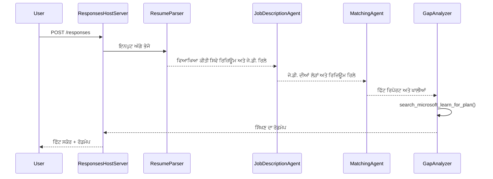

# ਮਾਡਿਊਲ 3 - ਨਿਰਦੇਸ਼ਾਂ, ਵਾਤਾਵਰਣ ਅਤੇ ਇੰਸਟਾਲ ਡਿਪੈਂਡੇਂਸੀਜ਼ ਨੂੰ ਸੰਰਚਿਤ ਕਰੋ

⏱️ ~15 ਮਿੰਟ

ਇਸ ਮਾਡਿਊਲ ਵਿੱਚ, ਤੁਸੀਂ ਫਰੇਮਵਰਕ ਸਟਬ ਨੂੰ **ਆਪਣੇ** ਮੁਲਟੀ-ਏਜੰਟ ਵਰਕਫਲੋ ਵਿੱਚ ਤਬਦੀਲ ਕਰਦੇ ਹੋ - ਵਾਤਾਵਰਣ ਵੈਰੀਏਬਲ ਸੈੱਟ ਕਰਕੇ, ਏਜੰਟ ਨਿਰਦੇਸ਼ ਲਿਖ ਕੇ, MCP ਟੂਲ ਸ਼ਾਮਲ ਕਰਕੇ, ਵਰਕਫਲੋ ਗ੍ਰਾਫ ਨੂੰ ਜੋੜ ਕੇ, ਅਤੇ ਡਿਪੈਂਡੇਂਸੀਜ਼ ਨੂੰ ਇੰਸਟਾਲ ਕਰਕੇ।

> **ਹਵਾਲਾ:** ਪੂਰਾ ਕੰਮ ਕਰਨ ਵਾਲਾ ਕੋਡ [`PersonalCareerCopilot/main.py`](../../../../../workshop/lab02-multi-agent/PersonalCareerCopilot/main.py) ਵਿੱਚ ਹੈ। ਆਪਣੇ ਵਰਕਫਲੋ ਗ੍ਰਾਫ ਅਤੇ ਪ੍ਰਾਂਪਟ ਬਲਾਕ ਬਣਾਉਂਦੇ ਸਮੇਂ ਇਸਨੂੰ ਹਵਾਲਾ ਵਜੋਂ ਵਰਤੋ।

---

## ਕਿਵੇਂ ਚਾਰ ਏਜੰਟ ਇਕੱਠੇ ਫਿੱਟ ਹੁੰਦੇ ਹਨ


```mermaid
sequenceDiagram
    participant User
    participant Server as ResponsesHostServer
    participant RP as ResumeParser
    participant JD as JobDescriptionAgent
    participant MA as MatchingAgent
    participant GA as GapAnalyzer

    User->>Server: POST /responses
    Server->>RP: ਇਨਪੁਟ ਅੱਗੇ ਭੇਜੋ
    RP-->>JD: ਵਿਆਖਿਆ ਕੀਤੀ ਸਿਵੇ ਰਿਜ਼ਿਊਮ ਅਤੇ ਜੇ.ਡੀ. ਰਿਲੇ
    JD-->>MA: ਜੇ.ਡੀ. ਦੀਆਂ ਲੋੜਾਂ ਅਤੇ ਰਿਜ਼ਿਊਮ ਰਿਲੇ
    MA-->>GA: ਫਿੱਟ ਰਿਪੋਰਟ ਅਤੇ ਖਾਲੀਆਂ
    GA->>GA: search_microsoft_learn_for_plan()
    GA-->>Server: ਸਿੱਖਣ ਦਾ ਰੋਡਮੇਪ
    Server-->>User: ਫਿੱਟ ਸਕੋਰ + ਰੋਡਮੇਪ
```

---

## ਕਦਮ 1: ਵਾਤਾਵਰਣ ਵੈਰੀਏਬਲ ਸੈੱਟ ਕਰੋ

1. ਆਪਣੇ ਪ੍ਰਾਜੈਕਟ ਰੂਟ ਵਿੱਚ **`.env`** ਫਾਇਲ ਖੋਲ੍ਹੋ (ਫਰੇਮਵਰਕ ਵਿਜ਼ਾਰਡ ਵੱਲੋਂ ਬਣਾਈ ਗਈ)।
2. ਲੈਬ 01 ਤੋਂ ਆਪਣੇ ਅਸਲੀ ਮੁੱਲਾਂ ਨਾਲ ਪਲੇਸਹੋਲਡਰਾਂ ਨੂੰ ਬਦਲੋ।

<details open>
<summary><strong>🅰️ ਰਾਹ A - Foundry ਸਬਸਕ੍ਰਿਪਸ਼ਨ</strong></summary>

```env
FOUNDRY_PROJECT_ENDPOINT=https://<your-account>.services.ai.azure.com/api/projects/<your-project>
AZURE_AI_MODEL_DEPLOYMENT_NAME=gpt-4.1-mini
```

> **ਮੁੱਲ ਕਿੱਥੋਂ ਲੱਭਣੇ ਹਨ:** ਵੇਖੋ [Lab 01, Module 1](../../lab01-single-agent/docs/01-setup.md#deploy-a-model--assign-rbac)।

</details>

<details open>
<summary><strong>🅱️ ਰਾਹ B - Foundry लोकਲ</strong></summary>

```env
FOUNDRY_PROJECT_ENDPOINT=http://localhost:5273/v1
AZURE_AI_MODEL_DEPLOYMENT_NAME=phi-4-mini
```

> ਸਾਰਾ ਇੰਫਰੰਸ ਤੁਹਾਡੇ ਮਸ਼ੀਨ 'ਤੇ ਹੁੰਦਾ ਹੈ - ਕੋਈ ਡੇਟਾ ਤੁਹਾਡੇ ਡਿਵਾਈਸ ਤੋਂ ਬਾਹਰ ਨਹੀਂ ਨਿਕਲਦਾ। ਸਹੀ ਮਾਡਲ ਐਲਿਆਸ ਪੱਕਾ ਕਰਨ ਲਈ `foundry model list` ਚਲਾਓ। ਇਕੱਲਾ ਬਾਹਰਲਾ ਰਿਕਵੇਸਟ MCP ਟੂਲ ਕਾਲ `https://learn.microsoft.com/api/mcp` ਹੈ।

> **ਮੁੱਲ ਕਿੱਥੋਂ ਲੱਭਣੇ ਹਨ:** ਵੇਖੋ [Lab 01, Module 1 - local path](../../lab01-single-agent/docs/01-setup.md#step-2-set-up-based-on-your-access)।

</details>

> **ਸੁਰੱਖਿਆ:** ਕਦੇ ਵੀ `.env` ਨੂੰ ਵਰਜਨ ਕੰਟਰੋਲ ਵਿੱਚ ਕਮਿੱਟ ਨਾ ਕਰੋ। ਇਹ ਪਹਿਲਾਂ ਹੀ `.gitignore` ਵਿੱਚ ਹੋਣਾ ਚਾਹੀਦਾ ਹੈ।

---

## ਕਦਮ 2: ਏਜੰਟ ਨਿਰਦੇਸ਼ ਲਿਖੋ

ਨਿਰਦੇਸ਼ ਹਰ ਏਜੰਟ ਦਾ ਰੋਲ, ਆਉਟਪੁੱਟ ਫਾਰਮੈਟ, ਅਤੇ ਨਿਯਮਾਂ ਨੂੰ ਪਰਿਭਾਸ਼ਿਤ ਕਰਦੇ ਹਨ। `main.py` ਖੋਲ੍ਹੋ ਅਤੇ ਚਾਰ ਨਿਰਦੇਸ਼ ਕਾਂਸਟੈਂਟ ਨੂੰ ਪਰਿਭਾਸ਼ਿਤ (ਜਾਂ ਬਦਲੋ) ਕਰੋ - ਪੂਰੇ ਸਤਰ [`PersonalCareerCopilot/main.py`](../../../../../workshop/lab02-multi-agent/PersonalCareerCopilot/main.py) ਵਿੱਚ ਹਨ।

### 2.1 `RESUME_PARSER_INSTRUCTIONS`
ਰੇਜ਼ਿਊਮ ਨੂੰ ਇੱਕ ਸੰਗਠਿਤ ਉਮੀਦਵਾਰ ਪ੍ਰੋਫਾਈਲ ਵਿੱਚ ਪਰਸ ਕਰਦਾ ਹੈ **ਅਤੇ** ਨੌਕਰੀ ਦੇ ਵਰਣਨ ਦੀ ਪਕੜ `[JOB DESCRIPTION PASS-THROUGH]` ਵਿੱਚ ਕਾਪੀ ਕਰਦਾ ਹੈ। ਦੋਵਾਂ ਲੇਬਲ ਕੀਤੇ ਹਿੱਸੇ ਆਉਟਪੁੱਟ ਵਿੱਚ ਹੋਣੇ ਚਾਹੀਦੇ ਹਨ।

> **ਪਾਸ-ਥਰੂ ਕਿਉਂ?** `context_mode="last_agent"` ਨਾਲ, ResumeParser ਇਕੱਲਾ ਏਜੰਟ ਹੈ ਜੋ ਮੂਲ ਉਪਭੋਗਤਾ ਸੁਨੇਹਾ ਵੇਖਦਾ ਹੈ। ਜੇ ਇਹ JD ਨੂੰ ਅੱਗੇ ਕਾਪੀ ਨਹੀਂ ਕਰਦਾ, ਤਾਂ ਬਾਅਦ ਵਾਲੇ ਏਜੰਟ ਇਸ ਨੂੰ ਨਹੀਂ ਵੇਖਦੇ।

### 2.2 `JOB_DESCRIPTION_INSTRUCTIONS`
ResumeParser ਆਉਟਪੁੱਟ ਤੋਂ `[PARSED RESUME]` ਅਤੇ `[JOB DESCRIPTION PASS-THROUGH]` ਪੜ੍ਹਦਾ ਹੈ। `[JD REQUIREMENTS]` (ਸੰਰਚਿਤ ਲੋੜਾਂ) ਅਤੇ `[PARSED RESUME PASS-THROUGH]` (MatchingAgent ਲਈ ਬਿਲਕੁਲ ਸਮਾਨ ਰੇਜ਼ਿਊਮ ਕਾਪੀ) ਬਾਹਰ ਕੱਢਦਾ ਹੈ।

### 2.3 `MATCHING_AGENT_INSTRUCTIONS`
`[JD REQUIREMENTS]` ਅਤੇ `[PARSED RESUME PASS-THROUGH]` ਪੜ੍ਹਦਾ ਹੈ। 0-100 ਦੀ ਦਰ ਨਾਲ ਇੱਕ ਸਕੋਰਡ ਫਿੱਟ ਰਿਪੋਰਟ ਤਿਆਰ ਕਰਦਾ ਹੈ ਜਿਸ ਵਿੱਚ ਗਣਿਤ ਦੇ ਟੁਕੜੇ, ਮਿਲਦੇ ਕੁਸਲਤਾਈ, ਗੁੰਮ ਕੁਸਲਤਾਈਆਂ, ਅਤੇ ਅਨੁਭਵ ਸਮੀਕਰਨ ਸ਼ਾਮਲ ਹਨ।

### 2.4 `GAP_ANALYZER_INSTRUCTIONS`
ਫਿੱਟ ਰਿਪੋਰਟ ਪੜ੍ਹਦਾ ਹੈ। ਹਰ ਗੁੰਮ ਕੁਸਲ ਲਈ, `search_microsoft_learn_for_plan` ਨੂੰ ਕਾਲ ਕਰਦਾ ਹੈ ਤਾਂ ਜੋ ਮਾਈਕ੍ਰੋਸੌਫਟ ਲਰਨ ਸਰੋਤ ਪ੍ਰਾਪਤ ਕਰ ਸਕੇ। ਹਰ ਕੁਸਲ ਲਈ ਇੱਕ ਵਿਸਥਾਰਿਤ ਗੈਪ ਕਾਰਡ ਅਤੇ ਹਫ਼ਤੇ ਦਿਨ ਦੀ ਸਿੱਖਣ ਯੋਜਨਾ ਤਿਆਰ ਕਰਦਾ ਹੈ।

---

## ਕਦਮ 3: MCP ਟੂਲ ਸ਼ਾਮਲ ਕਰੋ

GapAnalyzer ਹਰੇਕ ਕੁਸਲ ਦੇ ਗੈਪ ਲਈ ਅਸਲੀ ਸਿੱਖਣ ਸਰੋਤ ਪ੍ਰਾਪਤ ਕਰਨ ਲਈ [Microsoft Learn MCP ਸਰਵਰ](https://learn.microsoft.com/azure/foundry/agents/how-to/tools/model-context-protocol) ਨੂੰ ਕਾਲ ਕਰਦਾ ਹੈ। ਪੂਰਾ `search_microsoft_learn_for_plan` ਫੰਕਸ਼ਨ [`PersonalCareerCopilot/main.py`](../../../../../workshop/lab02-multi-agent/PersonalCareerCopilot/main.py) ਵਿੱਚ ਹੈ।

ਏਜੰਟ ਬਣਾਉਂਦੇ ਸਮੇਂ GapAnalyzer 'ਤੇ ਟੂਲ ਰਜਿਸਟਰ ਕਰੋ:

```python
gap_analyzer = Agent(
    client=client,
    instructions=GAP_ANALYZER_INSTRUCTIONS,
    name="GapAnalyzer",
    tools=[search_microsoft_learn_for_plan],
)
```

> ਪੂਰਾ `WorkflowBuilder` ਗ੍ਰਾਫ `FoundryChatClient`, `AgentExecutor`, ਅਤੇ ਸਾਰੀਆਂ `add_edge()` ਕਾਲਾਂ ਨਾਲ ਵੇਖਣ ਲਈ [`PersonalCareerCopilot/main.py`](../../../../../workshop/lab02-multi-agent/PersonalCareerCopilot/main.py) ਨੂੰ ਦੇਖੋ।

---

## ਕਦਮ 4: ਵਰਚੁਅਲ ਵਾਤਾਵਰਣ ਬਣਾਓ ਅਤੇ ਡਿਪੈਂਡੇਂਸੀਜ਼ ਇੰਸਟਾਲ ਕਰੋ

> ⚠️ **ਇਸ ਕਦਮ ਨੂੰ ਛੱਡੋ ਨਾ।** ਬਿਨਾਂ ਡਿਪੈਂਡੇਂਸੀਜ਼ ਦੇ ਇੰਸਟਾਲ ਹੋਏ, F5 ਡਿਬੱਗਿੰਗ ਫੇਲ੍ਹ ਹੋ ਜਾਵੇਗਾ।

### 4.1 ਵਰਚੁਅਲ ਵਾਤਾਵਰਣ ਬਣਾਓ

```powershell
python -m venv .venv
```

### 4.2 ਇਸਨੂੰ ਐਕਟੀਵੇਟ ਕਰੋ

| OS | ਕਮਾਂਡ |
|----|---------|
| **Windows (PowerShell)** | `.\.venv\Scripts\Activate.ps1` |
| **Windows (CMD)** | `.venv\Scripts\activate.bat` |
| **macOS / Linux** | `source .venv/bin/activate` |

ਤੁਹਾਨੂੰ ਟਰਮੀਨਲ ਪ੍ਰਾਂਪਟ ਵਿੱਚ `(.venv)` ਵੇਖਣਾ ਚਾਹੀਦਾ ਹੈ।

### 4.3 ਡਿਪੈਂਡੇਂਸੀਜ਼ ਇੰਸਟਾਲ ਕਰੋ

```powershell
pip install -r requirements.txt
```

### 4.4 ਤਸਦੀਕ ਕਰੋ

```powershell
pip list | Select-String "agent-framework|mcp|debugpy"
```

ਉਮੀਦ ਹੈ: `agent-framework-foundry`, `agent-framework-foundry-hosting`, `mcp`, ਅਤੇ `debugpy` ਲਿਸਟ ਕੀਤੇ ਹੋਣ।

---

## ਕਦਮ 5: ਪ੍ਰਮਾਣੀਕਰਨ ਦੀ ਪੁਸ਼ਟੀ ਕਰੋ

<details open>
<summary><strong>🅰️ ਰਾਹ A - Azure ਸਾਲਾਹੀ</strong></summary>

```powershell
az account show --query "{name:name, id:id}" --output table
```

ਜੇ ਇਹ ਅਸਫਲ ਹੁੰਦਾ ਹੈ, ਤਾਂ [`az login`](https://learn.microsoft.com/cli/azure/authenticate-azure-cli-interactively) ਚਲਾਓ।

ਸਾਰੇ ਚਾਰ ਏਜੰਟ ਇਕ `FoundryChatClient` ਅਤੇ ਇਕ `DefaultAzureCredential` ਸਾਂਝੇ ਕਰਦੇ ਹਨ। ਜੇ ਇੱਕ ਲਈ ਪ੍ਰਮਾਣੀਕਰਨ ਕੰਮ ਕਰਦਾ ਹੈ, ਤਾਂ ਸਾਰੇ ਲਈ ਕਰਦਾ ਹੈ।

</details>

<details open>
<summary><strong>🅱️ ਰਾਹ B - Foundry ਲੋਕਲ</strong></summary>

ਲੋਕਲ ਟੈਸਟਿੰਗ ਲਈ ਕਿਸੇ ਵੀ ਪ੍ਰਮਾਣੀਕਰਨ ਦੀ ਲੋੜ ਨਹੀਂ।

</details>

---

### ✅ ਚੈਕਪੋਇੰਟ

> ਮਾਡਿਊਲ 04 'ਤੇ ਜਾਵਣ ਤੋਂ ਪਹਿਲਾਂ ਇਹ ਯਕੀਨੀ ਬਣਾਓ: **(1)** `(.venv)` ਤੁਹਾਡੇ ਪ੍ਰਾਂਪਟ ਵਿੱਚ ਦਿਖਾਈ ਦੇ ਰਿਹਾ ਹੈ AND **(2)** `pip install -r requirements.txt` ਸਫਲਤਾਪੂਰਵਕ ਪੂਰਾ ਹੋ ਗਿਆ ਹੈ।

- [ ] `.env` ਵਿੱਚ ਵੈਧ ਐਂਡਪੌਇੰਟ ਅਤੇ ਮਾਡਲ ਡਿਪਲੋਇਮੈਂਟ ਨਾਮ (ਪਲੇਸਹੋਲਡਰ ਨਹੀਂ)
- [ ] ਸਾਰੇ 4 ਏਜੰਟ ਨਿਰਦੇਸ਼ ਕਾਂਸਟੈਂਟ `main.py` ਵਿੱਚ ਪਰਿਭਾਸ਼ਿਤ (ResumeParser, JD Agent, MatchingAgent, GapAnalyzer)
- [ ] `search_microsoft_learn_for_plan` MCP ਟੂਲ ਪਰਿਭਾਸ਼ਿਤ ਅਤੇ GapAnalyzer 'ਤੇ ਰਜਿਸਟਰ ਕੀਤਾ
- [ ] `FoundryChatClient` + 4 `Agent` + 4 `AgentExecutor` ਵਸਤੂਆਂ `main()` ਵਿੱਚ ਬਣਾਈਆਂ
- [ ] `WorkflowBuilder` ਸਹੀ ਕਰਮਬੱਧ ਗ੍ਰਾਫ ਸਾਰੇ 3 `add_edge()` ਕਾਲਾਂ ਨਾਲ ਬਣਾਉਂਦਾ ਹੈ
- [ ] ਵਰਚੁਅਲ ਵਾਤਾਵਰਣ ਬਣਾਇਆ ਅਤੇ ਐਕਟੀਵੇਟ ਕੀਤਾ (ਪ੍ਰਾਂਪਟ ਵਿੱਚ `(.venv)` ਦਿਖਦਾ ਹੈ)
- [ ] `pip install -r requirements.txt` ਕਾਮਯਾਬੀ ਨਾਲ ਮੁਕੰਮਲ
- [ ] **ਰਾਹ A:** `az account show` ਸਫਲ ਜਾਂ VS Code Accounts ਆਇਕਨ ਵਿੱਚ ਸਰਾਇਨਿਖਾਤਾ ਖਾਤਾ ਦਿਖਾਈ ਦੇ ਰਿਹਾ ਹੈ

---

**ਪਹਿਲਾਂ:** [02 - Scaffold Multi-Agent Project](02-scaffold-multi-agent.md) · **ਅਗਲਾ:** [04 - Orchestration Patterns →](04-orchestration-patterns.md)

---

<!-- CO-OP TRANSLATOR DISCLAIMER START -->
**ਅਸਵੀਕਾਰੋਪਣ**:
ਇਸ ਦਸਤਾਵੇਜ਼ ਦਾ ਅਨੁਵਾਦ ਏਆਈ ਅਨੁਵਾਦ ਸੇਵਾ [Co-op Translator](https://github.com/Azure/co-op-translator) ਦੀ ਵਰਤੋਂ ਕਰਕੇ ਕੀਤਾ ਗਿਆ ਹੈ। ਜਦੋਂ ਕਿ ਅਸੀਂ ਸਹੀਤਾਵਾਂ ਲਈ ਯਤਨਸ਼ੀਲ ਹਾਂ, ਕਿਰਪਾ ਕਰਕੇ ਧਿਆਨ ਰੱਖੋ ਕਿ ਸਵੈਚਾਲਿਤ ਅਨੁਵਾਦਾਂ ਵਿੱਚ ਗਲਤੀਆਂ ਜਾਂ ਅਸਮੱਤਿਆਵਾਂ ਹੋ ਸਕਦੀਆਂ ਹਨ। ਮੂਲ ਦਸਤਾਵੇਜ਼ ਆਪਣੀ ਮੂਲ ਭਾਸ਼ਾ ਵਿੱਚ ਅਧਿਕਾਰਕ ਸਰੋਤ ਮੰਨਿਆ ਜਾਣਾ ਚਾਹੀਦਾ ਹੈ। ਜਰੂਰੀ ਜਾਣਕਾਰੀ ਲਈ, ਪੇਸ਼ੇਵਰ ਮਨੁੱਖੀ ਅਨੁਵਾਦ ਦੀ ਸਿਫ਼ਾਰਸ਼ ਕੀਤੀ ਜਾਂਦੀ ਹੈ। ਅਸੀਂ ਇਸ ਅਨੁਵਾਦ ਦੇ ਉਪਯੋਗ ਤੋਂ ਪੈਦਾ ਹੋਣ ਵਾਲੀਆਂ ਕਿਸੇ ਵੀ ਗਲਤਫਹਿਮੀਆਂ ਜਾਂ ਗਲਤ ਵਿਆਖਿਆਵਾਂ ਲਈ ਜਵਾਬਦੇਹ ਨਹੀਂ ਹਾਂ।
<!-- CO-OP TRANSLATOR DISCLAIMER END -->