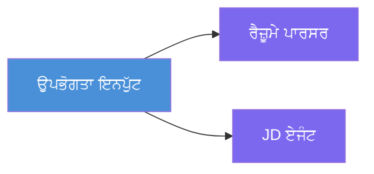
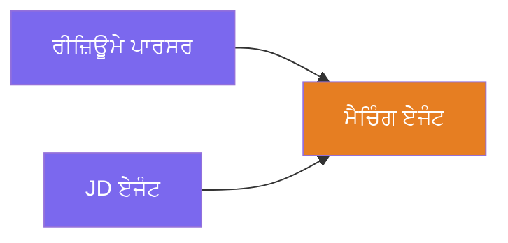
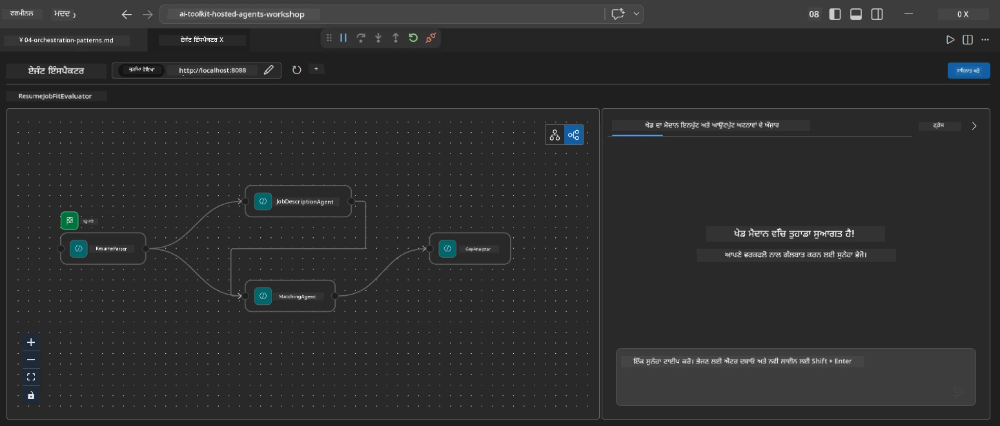
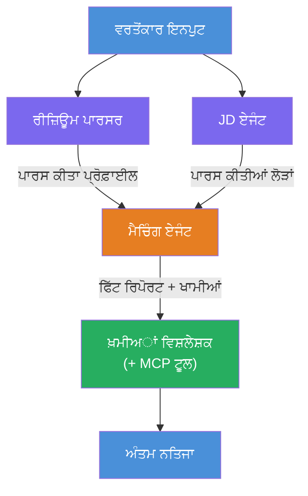
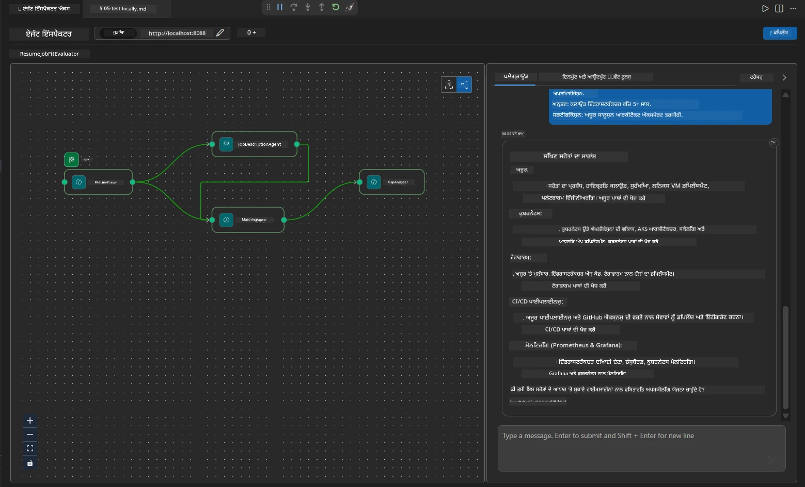

# Module 4 - ਓਰਕੇਸਟ੍ਰੇਸ਼ਨ ਪੈਟਰਨ

ਇਸ ਮੋਡੀਊਲ ਵਿੱਚ, ਤੁਸੀਂ Resume Job Fit Evaluator ਵਿੱਚ ਵਰਤੇ ਜਾਂਦੇ ਓਰਕੇਸਟ੍ਰੇਸ਼ਨ ਪੈਟਰਨਾਂ ਦਾ ਪਤਾ ਲਗਾਉਂਦੇ ਹੋ ਅਤੇ ਸਿੱਖਦੇ ਹੋ ਕਿ ਕਿਵੇਂ workflow ਗ੍ਰਾਫ ਨੂੰ ਪੜ੍ਹਨਾ, ਸੋਧਣਾ ਅਤੇ ਵਧਾਉਣਾ ਹੈ। ਇਹ ਪੈਟਰਨ ਸਮਝਣਾ ਡੇਟਾ ਫਲੋ ਦੀਆਂ ਸਮੱਸਿਆਵਾਂ ਨੂੰ ਡੀਬੱਗ ਕਰਨ ਅਤੇ ਆਪਣੇ [ਮਲਟੀ-ਏਜੰਟ ਵਰਕਫਲੋਜ਼](https://learn.microsoft.com/agent-framework/workflows/) ਬਣਾਉਣ ਲਈ ਜਰੂਰੀ ਹੈ।

---

## Pattern 1: ਫੈਨ-ਆਉਟ (ਪੈਰਲੇਲ ਵੰਡ)

ਵਰਕਫਲੋ ਵਿੱਚ ਪਹਿਲਾ ਪੈਟਰਨ **ਫੈਨ-ਆਉਟ** ਹੈ - ਇੱਕ ਹੀ ਇਨਪੁੱਟ ਨੂੰ ਇਕੱਠੇ ਕਈ ਏਜੰਟਾਂ ਨੂੰ ਭੇਜਿਆ ਜਾਂਦਾ ਹੈ।


ਕੋਡ ਵਿੱਚ, ਇਹ ਇਸ ਲਈ ਹੁੰਦਾ ਹੈ ਕਿਉਂਕਿ `resume_parser` `start_executor` ਹੈ - ਇਹ ਸਭ ਤੋਂ ਪਹਿਲਾਂ ਯੂਜ਼ਰ ਦਾ 메시ਜ ਪ੍ਰਾਪਤ ਕਰਦਾ ਹੈ। ਫਿਰ, ਕਿਉਂਕਿ `resume_parser` ਤੋਂ ਦੋਹਾਂ `jd_agent` ਅਤੇ `matching_agent` ਲਈ edges ਹਨ, ਫਰੇਮਵਰਕ `resume_parser` ਦਾ ਆਉਟਪੁੱਟ ਦੋਹਾਂ ਏਜੰਟਾਂ ਨੂੰ ਭੇਜਦਾ ਹੈ:

```python
.add_edge(resume_parser, jd_agent)         # ResumeParser ਨਿਕਾਸ → JD Agent
.add_edge(resume_parser, matching_agent)   # ResumeParser ਨਿਕਾਸ → MatchingAgent
```

**ਇਹ ਕਿਉਂ ਕੰਮ ਕਰਦਾ ਹੈ:** ResumeParser ਅਤੇ JD Agent ਇੱਕੋ ਇਨਪੁੱਟ ਦੇ ਵੱਖਰੇ ਪਹਿਲੂਆਂ ਨੂੰ ਸੰਭਾਲਦੇ ਹਨ। ਉਨ੍ਹਾਂ ਨੂੰ ਪੈਰਲੇਲ ਚਲਾਉਣ ਨਾਲ ਕੁੱਲ ਲੇਟੰਸੀ ਘੱਟ ਹੁੰਦੀ ਹੈ ਉਸ ਨਾਲ ਤੁਲਨਾ ਵਿੱਚ ਜਦੋਂ ਉਹ ਅਨੁਕ੍ਰਮ ਵਿੱਚ ਚਲਾਏ ਜਾਂਦੇ ਹਨ।

### ਫੈਨ-ਆਉਟ ਕਦੋਂ ਵਰਤਣਾ ਹੈ

| ਵਰਤੋਂ ਦਾ ਕੇਸ | ਉਦਾਹਰਣ |
|----------|---------|
| ਸੁਤੰਤਰ ਸਬਟਾਸਕ | resume ਦਾ ਵਿਸ਼ਲੇਸ਼ਣ ਬਨਾਮ JD ਦਾ ਵਿਸ਼ਲੇਸ਼ਣ |
| ਅਤਿਰਿਕਤਤਾ / ਵੋਟਿੰਗ | ਦੋ ਏਜੰਟ ਇੱਕੋ ਡੇਟਾ ਦਾ ਵਿਸ਼ਲੇਸ਼ਣ ਕਰਦੇ ਹਨ, ਤੀਜਾ ਸਭ ਤੋਂ ਵਧੀਆ ਜਵਾਬ ਚੁਣਦਾ ਹੈ |
| ਬਹੁ-ਫਾਰਮੈਟ ਆਉਟਪੁੱਟ | ਇੱਕ ਏਜੰਟ ਟੈਕਸਟ ਬਣਾਉਂਦਾ ਹੈ, ਦੂਜਾ ਬਣਾਉਂਦਾ ਹੈ ਢਾਂਚਾ ਵਾਲਾ JSON |

---

## Pattern 2: ਫੈਨ-ਇਨ (ਸੰਗ੍ਰਹਿ)

ਦੂਜਾ ਪੈਟਰਨ ਹੈ **ਫੈਨ-ਇਨ** - ਕਈ ਏਜੰਟ ਦੇ ਆਉਟਪੁੱਟਾਂ ਨੂੰ ਇਕੱਠਾ ਕਰਕੇ ਇੱਕ ਨੀਵਾਂ ਏਜੰਟ ਨੂੰ ਭੇਜਿਆ ਜਾਂਦਾ ਹੈ।


ਕੋਡ ਵਿੱਚ:

```python
.add_edge(resume_parser, matching_agent)   # ResumeParser ਆਉਟਪੁੱਟ → MatchingAgent
.add_edge(jd_agent, matching_agent)        # JD Agent ਆਉਟਪੁੱਟ → MatchingAgent
```

**ਮੁੱਖ ਵਰਤਾਵ:** ਜਦੋਂ ਕਿਸੇ ਏਜੰਟ ਕੋਲ **ਦੋ ਜਾਂ ਜ਼ਿਆਦਾ ਆਉਂਦੀਆਂ edges** ਹੁੰਦੀਆਂ ਹਨ, ਤਾਂ ਫਰੇਮਵਰਕ ਸਾਰੇ upstream ਏਜੰਟਾਂ ਦੇ ਸਮਾਪਤੀ ਦੀ ਉਡੀਕ ਕਰਦਾ ਹੈ ਤਾਂ ਜੋ ਨੀਵਾਂ ਏਜੰਟ ਚੱਲੇ। MatchingAgent ਤਾਂ ਤਦ ਤੱਕ ਸ਼ੁਰੂ ਨਹੀਂ ਹੁੰਦਾ ਜਦ ਤੱਕ ResumeParser ਅਤੇ JD Agent ਦੋਹਾਂ ਮੁਕੰਮਲ ਨਹੀਂ ਹੋ ਜਾਂਦੇ।

### MatchingAgent ਨੂੰ ਕੀ ਮਿਲਦਾ ਹੈ

ਫਰੇਮਵਰਕ ਸਾਰੇ upstream ਏਜੰਟਾਂ ਦੇ ਆਉਟਪੁੱਟ ਨੂੰ ਜੋੜਦਾ ਹੈ। MatchingAgent ਦਾ ਇਨਪੁੱਟ ਇਸ ਤਰ੍ਹਾਂ ਹੁੰਦਾ ਹੈ:

```
[ResumeParser output]
---
Candidate Profile:
  Name: Jane Doe
  Technical Skills: Python, Azure, Kubernetes, ...
  ...

[JobDescriptionAgent output]
---
Role Overview: Senior Cloud Engineer
Required Skills: Python, Azure, Terraform, ...
...
```

> **ਨੋਟ:** ਸਹੀ ਜੁੜਾਈ ਫਾਰਮੈਟ ਫਰੇਮਵਰਕ ਵਰਜਨ 'ਤੇ ਨਿਰਭਰ ਕਰਦਾ ਹੈ। ਏਜੰਟ ਦੀਆਂ ਹਦਾਇਤਾਂ ਇਹਨਾਂ ਦੋਹਾਂ ਧਾਂਚਾਬੱਧ ਅਤੇ ਅਧਾਂਚਿਤ ਉਪਰਲੀ ਆਉਟਪੁੱਟਾਂ ਨੂੰ ਸੰਭਾਲਣ ਯੋਗ ਹੋਣ ਚਾਹੀਦੀਆਂ ਹਨ।



---

## Pattern 3: ਕ੍ਰਮਵਾਰ ਚੇਨ

ਤੀਜਾ ਪੈਟਰਨ ਹੈ **ਕ੍ਰਮਵਾਰ ਚੇਨ** - ਇੱਕ ਏਜੰਟ ਦਾ ਆਉਟਪੁੱਟ ਸਿੱਧਾ ਅਗਲੇ ਏਜੰਟ ਵਿੱਚ ਜਾਂਦਾ ਹੈ।


ਕੋਡ ਵਿੱਚ:

```python
.add_edge(matching_agent, gap_analyzer)    # ਮੈਚਿੰਗਏਜੈਂਟ ਆਉਟਪੁੱਟ → ਗੈਪਐਨਾਲਾਈਜ਼ਰ
```

ਇਹ ਸਭ ਤੋਂ ਆਸਾਨ ਪੈਟਰਨ ਹੈ। GapAnalyzer MatchingAgent ਦੇ fit ਸਕੋਰ, ਮਿਲੇ/ਗੁੰਮਸਨ ਹੁਨਰਾਂ, ਅਤੇ ਖਾਲੀਆਂ ਨੁਕਸਾਨਾਂ ਨੂੰ ਪ੍ਰਾਪਤ ਕਰਦਾ ਹੈ। ਫਿਰ ਇਹ [MCP ਟੂਲ](https://learn.microsoft.com/azure/foundry/agents/how-to/tools/model-context-protocol) ਨੂੰ ਹਰ ਖਾਲੀ ਲਈ ਕਾਲ ਕਰਦਾ ਹੈ ਤਾਂ ਜੋ Microsoft Learn ਦੇ ਸਰੋਤ ਲੱਭੇ ਜਾ ਸਕਣ।

---

## ਪੂਰਾ ਗ੍ਰਾਫ

ਤਿਨਾਂ ਪੈਟਰਨਾਂ ਨੂੰ ਜੋੜ ਕੇ ਪੂਰਾ ਵਰਕਫਲੋ ਬਣਦਾ ਹੈ:


### ਐਕਜ਼ੀਕਿਊਸ਼ਨ ਟਾਈਮਲਾਈਨ

```mermaid
gantt
    title ਏਜੰਟ ਕਾਰਜਨਵੇਂ ਟਾਈਮਲਾਈਨ
    dateFormat X
    axisFormat %s

    section Parallel
    Resume Parser       :rp, 0, 3
    JD Agent            :jd, 0, 2

    section Sequential
    Matching Agent      :ma, 3, 5
    Gap Analyzer        :ga, 5, 9
```


> ਕੁੱਲ ਵੌਲ-ਕਲਾਕ ਸਮਾਂ ਲਗਭਗ `max(ResumeParser, JD Agent) + MatchingAgent + GapAnalyzer` ਹੁੰਦਾ ਹੈ। GapAnalyzer ਆਮ ਤੌਰ 'ਤੇ ਸਭ ਤੋਂ ਧੀਮਾ ਹੁੰਦਾ ਹੈ ਕਿਉਂਕਿ ਇਹ ਕਈ MCP ਟੂਲ ਕਾਲਾਂ ਕਰਦਾ ਹੈ (ਹਰ ਖਾਲੀ ਲਈ ਇੱਕ)।

---

## WorkflowBuilder ਕੋਡ ਨੂੰ ਪੜ੍ਹਨਾ

ਇਹ ਰਿਹਾ `main.py` ਵਿੱਚੋਂ ਮੁਕੰਮਲ `create_workflow()` ਫੰਕਸ਼ਨ, ਜਿਹੜਾ ਟਿੱਪਣੀਆਂ ਨਾਲ ਹੈ:

```python
def create_workflow(resume_parser, jd_agent, matching_agent, gap_analyzer):
    workflow = (
        WorkflowBuilder(
            name="ResumeJobFitEvaluator",

            # ਪਹਿਲਾ ਏਜੰਟ ਜੋ ਉਪਭੋਗਤਾ ਇਨਪੁਟ ਪ੍ਰਾਪਤ ਕਰਦਾ ਹੈ
            start_executor=resume_parser,

            # ਉਹ ਏਜੰਟ(ਸ) ਜਿਨ੍ਹਾਂ ਦੀ ਆઉਟਪੁੱਟ ਅੰਤਿਮ ਜਵਾਬ ਬਣਦੀ ਹੈ
            output_executors=[gap_analyzer],
        )
        # ਫੈਨ-ਆਊਟ: ResumeParser ਦੀ ਆਉਟਪੁੱਟ ਦੋਹਾਂ JD Agent ਅਤੇ MatchingAgent ਨੂੰ ਜਾਂਦੀ ਹੈ
        .add_edge(resume_parser, jd_agent)
        .add_edge(resume_parser, matching_agent)

        # ਫੈਨ-ਇਨ: MatchingAgent ਦੋਹਾਂ ResumeParser ਅਤੇ JD Agent ਦੀ ਉਡੀਕ ਕਰਦਾ ਹੈ
        .add_edge(jd_agent, matching_agent)

        # ਲੜੀਵਾਰ: MatchingAgent ਦੀ ਆਉਟਪੁੱਟ GapAnalyzer ਨੂੰ ਦਿੰਦੀ ਹੈ
        .add_edge(matching_agent, gap_analyzer)

        .build()
    )
    return workflow.as_agent()
```

### Edge ਸੰਖੇਪ ਟੇਬਲ

| # | Edge | ਪੈਟਰਨ | ਪ੍ਰਭਾਵ |
|---|------|---------|--------|
| 1 | `resume_parser → jd_agent` | ਫੈਨ-ਆਉਟ | JD Agent ਨੂੰ ResumeParser ਦਾ ਆਉਟਪੁੱਟ ਮਿਲਦਾ ਹੈ (ਅਤੇ ਮੂਲ ਯੂਜ਼ਰ ਇਨਪੁੱਟ ਵੀ) |
| 2 | `resume_parser → matching_agent` | ਫੈਨ-ਆਉਟ | MatchingAgent ਨੂੰ ResumeParser ਦਾ ਆਉਟਪੁੱਟ ਮਿਲਦਾ ਹੈ |
| 3 | `jd_agent → matching_agent` | ਫੈਨ-ਇਨ | MatchingAgent ਨੂੰ JD Agent ਦਾ ਵੀ ਆਉਟਪੁੱਟ ਮਿਲਦਾ ਹੈ (ਦੋਹਾਂ ਦੀ ਉਡੀਕ ਕਰਦਾ ਹੈ) |
| 4 | `matching_agent → gap_analyzer` | ਕ੍ਰਮਵਾਰ | GapAnalyzer ਨੂੰ ਫਿੱਟ ਰਿਪੋਰਟ + ਖਾਲੀ ਸੂਚੀ ਮਿਲਦੀ ਹੈ |

---

## ਗ੍ਰਾਫ ਸੋਧਣਾ

### ਨਵਾਂ ਏਜੰਟ ਸ਼ਾਮਲ ਕਰਨਾ

ਪੰਜਵਾਂ ਏਜੰਟ ਸ਼ਾਮਲ ਕਰਨ ਲਈ (ਜਿਵੇਂ ਕਿ ਇੱਕ **InterviewPrepAgent** ਜੋ ਖਾਲੀ ਵਿਸ਼ਲੇਸ਼ਣ ਦੇ ਆਧਾਰ 'ਤੇ ਇੰਟਰਵਿਊ ਪ੍ਰਸ਼ਨ ਬਣਾਉਂਦਾ ਹੈ):

```python
# 1. ਹੁਕਮ ਨਿਰਧਾਰਤ ਕਰੋ
INTERVIEW_PREP_INSTRUCTIONS = """\
You are the Interview Prep Agent.
Given a gap analysis and fit report, generate 10 targeted interview questions
the candidate should prepare for.
"""

# 2. ਏਜੰਟ ਬਣਾਓ (async with ਬਲਾਕ ਦੇ ਅੰਦਰ)
AzureAIAgentClient(
    project_endpoint=PROJECT_ENDPOINT,
    model_deployment_name=MODEL_DEPLOYMENT_NAME,
    credential=credential,
).as_agent(
    name="InterviewPrepAgent",
    instructions=INTERVIEW_PREP_INSTRUCTIONS,
) as interview_prep,

# 3. create_workflow() ਵਿੱਚ ਏਜ जोड़ੋ
.add_edge(matching_agent, interview_prep)   # ਫਿਟ ਰਿਪੋਰਟ ਪ੍ਰਾਪਤ ਕਰਦਾ ਹੈ
.add_edge(gap_analyzer, interview_prep)     # ਗੈਪ ਕਾਰਡ ਵੀ ਪ੍ਰਾਪਤ ਕਰਦਾ ਹੈ

# 4. output_executors ਨੂੰ ਅਪਡੇਟ ਕਰੋ
output_executors=[interview_prep],  # ਹੁਣ ਅੰਤਿਮ ਏਜੰਟ
```

### ਐਕਜ਼ੀਕਿਊਸ਼ਨ ਕ੍ਰਮ ਬਦਲਣਾ

JD Agent ਨੂੰ ResumeParser ਦੇ ਬਾਅਦ ਚਲਾਉਣ ਲਈ (ਪੈਰਲੇਲ ਦੀ ਬਜਾਏ ਕ੍ਰਮਵਾਰ):

```python
# ਹਟਾਓ: .add_edge(resume_parser, jd_agent) ← ਪਹਿਲਾਂ ਹੀ ਮੌਜੂਦ ਹੈ, ਇਸਨੂੰ ਰੱਖੋ
# ਕੁਦਰਤੀ ਸਮਾਂਤਰੀਤਾ ਨੂੰ ਹਟਾਓ ਜਦੋਂ jd_agent ਸਿਧਾ ਯੂਜ਼ਰ ਇਨਪੁਟ ਨਾ ਲਵੇ
# start_executor ਪਹਿਲਾਂ resume_parser ਨੂੰ ਭੇਜਦਾ ਹੈ, ਅਤੇ jd_agent ਸਿਰਫ
# resume_parser ਦੇ ਆਉਟਪੁੱਟ ਨੂੰ edge ਰਾਹੀਂ ਲੈਂਦਾ ਹੈ। ਇਸ ਨਾਲ ਉਹ ਕ੍ਰਮਬੱਧ ਬਣ ਜਾਂਦੇ ਹਨ।
```

> **ਮਹੱਤਵਪੂਰਨ:** `start_executor` ਇਕੋ ਏਜੰਟ ਹੁੰਦਾ ਹੈ ਜੋ ਮੂਲ ਯੂਜ਼ਰ ਇਨਪੁੱਟ ਪ੍ਰਾਪਤ ਕਰਦਾ ਹੈ। ਸਾਰੇ ਹੋਰ ਏਜੰਟ upstream edges ਤੋਂ ਆਉਟਪੁੱਟ ਪ੍ਰਾਪਤ ਕਰਦੇ ਹਨ। ਜੇ ਕਿਸੇ ਏਜੰਟ ਨੂੰ ਵੀ ਮੂਲ ਯੂਜ਼ਰ ਇਨਪੁੱਟ ਚਾਹੀਦਾ ਹੈ, ਤਾਂ ਉਸ ਕੋਲ `start_executor` ਤੋਂ edge ਹੋਣਾ ਚਾਹੀਦਾ ਹੈ।

---

## ਆਮ ਗ੍ਰਾਫ ਗਲਤੀਆਂ

| ਗਲਤੀ | ਲੱਛਣ | ਸੁਧਾਰ |
|---------|---------|-----|
| `output_executors` ਲਈ edge ਨਾ ਹੋਣਾ | ਏਜੰਟ ਚੱਲਦਾ ਹੈ ਪਰ ਆਉਟਪੁੱਟ ਖਾਲੀ ਹੈ | ਯਕੀਨੀ ਬਣਾਓ ਕਿ `start_executor` ਤੋਂ `output_executors` ਵਿੱਚ ਹਰ ਏਜੰਟ ਤੱਕ ਰਸਤਾ ਹੈ |
| ਸਰਕੁਲਰ ਡਿਪੈਂਡੇੰਸੀ | ਅਨੰਤ ਲੂਪ ਜਾਂ ਟਾਈਮਆਊਟ | ਚੈੱਕ ਕਰੋ ਕਿ ਕੋਈ ਏਜੰਟ upstream ਏਜੰਟ ਨੂੰ ਵਾਪਸ ਫੀਡ ਨਹੀਂ ਕਰਦਾ |
| `output_executors` ਵਿੱਚ ਏਜੰਟ ਬਿਨਾ ਇਨਕਮਿੰਗ edge ਦੇ | ਆਉਟਪੁੱਟ ਖਾਲੀ | ਘੱਟੋ ਘੱਟ ਇੱਕ `add_edge(source, that_agent)` ਸ਼ਾਮਲ ਕਰੋ |
| ਕਈ `output_executors` ਬਿਨਾ ਫੈਨ-ਇਨ ਦੇ | ਆਉਟਪੁੱਟ ਵਿੱਚ ਸਿਰਫ਼ ਇੱਕ ਏਜੰਟ ਦਾ ਜਵਾਬ ਹੁੰਦਾ ਹੈ | ਇੱਕ ਸਿੰਗਲ ਆਉਟਪੁੱਟ ਏਜੰਟ ਵਰਤੋਂ ਜੋ ਸੰਗ੍ਰਹਿ ਕਰਦਾ ਹੋਵੇ, ਜਾਂ ਕਈ ਆਉਟਪੁੱਟ ਕਬੂਲ ਕਰੋ |
| `start_executor` ਗੁੰਮ | ਬਿਲਡ ਸਮੇਂ `ValueError` | ਹਮੇਸ਼ਾ `WorkflowBuilder()` ਵਿੱਚ `start_executor` ਦਰਜ ਕਰੋ |

---

## ਗ੍ਰਾਫ ਡੀਬੱਗ ਕਰਨਾ

### Agent Inspector ਵਰਤੋਂ

1. ਏਜੰਟ ਨੂੰ ਲੋਕਲ ਲੈਵਲ 'ਤੇ ਚਲਾਓ (F5 ਜਾਂ ਟਰਮੀਨਲ - ਵੇਖੋ [Module 5](05-test-locally.md))।
2. Agent Inspector ਖੋਲ੍ਹੋ (`Ctrl+Shift+P` → **Foundry Toolkit: Open Agent Inspector**).
3. ਟੈਸਟ ਮੈਸੇਜ ਭੇਜੋ।
4. Inspector ਦੇ ਰਿਸਪਾਂਸ ਪੈਨਲ ਵਿੱਚ **streaming output** ਵੇਖੋ - ਇਹ ਹਰ ਏਜੰਟ ਦੀ ਹਿੱਸੇਦਾਰੀ ਨੂੰ ਕ੍ਰਮਵਾਰ ਦਿਖਾਉਂਦਾ ਹੈ।



### ਲੌਗਿੰਗ ਵਰਤੋਂ

ਮੁੱਖ.py ਵਿੱਚ ਲੌਗਿੰਗ ਸ਼ਾਮਲ ਕਰੋ ਤਾਂ ਜੋ ਡੇਟਾ ਫਲੋ ਟਰੇਸ ਕੀਤਾ ਜਾ ਸਕੇ:

```python
import logging
logger = logging.getLogger("resume-job-fit")

# create_workflow() ਵਿੱਚ, ਬਣਾਉਣ ਤੋਂ ਬਾਅਦ:
logger.info("Workflow graph built with edges: RP→JD, RP→MA, JD→MA, MA→GA")
```

ਸਰਵਰ ਲੌਗ ਅੰਦਰ ਓਏਜੰਟ ਦੀ ਐਕਜ਼ੀਕਿਊਸ਼ਨ ਕ੍ਰਮ ਅਤੇ MCP ਟੂਲ ਕਾਲਾਂ ਵੇਖਾਈ ਦੇਂਦੀਆਂ ਹਨ:

```
INFO:resume-job-fit:Starting Resume -> Job Fit Evaluator HTTP server...
INFO:resume-job-fit:Server running on http://localhost:8088
INFO:agent_framework:Executing agent: ResumeParser
INFO:agent_framework:Executing agent: JobDescriptionAgent
INFO:agent_framework:Waiting for upstream agents: ResumeParser, JobDescriptionAgent
INFO:agent_framework:Executing agent: MatchingAgent
INFO:agent_framework:Executing agent: GapAnalyzer
INFO:agent_framework:Tool call: search_microsoft_learn_for_plan(skill="Kubernetes")
POST https://learn.microsoft.com/api/mcp → 200
INFO:agent_framework:Tool call: search_microsoft_learn_for_plan(skill="Terraform")
POST https://learn.microsoft.com/api/mcp → 200
```

---

### ਚੈਕਪੌਇੰਟ

- [ ] ਤੁਸੀਂ workflow ਵਿੱਚ ਤਿੰਨ ਓਰਕੇਸਟ੍ਰੇਸ਼ਨ ਪੈਟਰਨਾਂ: ਫੈਨ-ਆਉਟ, ਫੈਨ-ਇਨ ਅਤੇ ਕ੍ਰਮਵਾਰ ਚੇਨ ਨੂੰ ਪਛਾਣ ਸਕਦੇ ਹੋ
- [ ] ਤੁਸੀਂ ਸਮਝਦੇ ਹੋ ਕਿ ਜਿਨ੍ਹਾਂ ਏਜੰਟਾਂ ਕੋਲ ਕਈ ਆਉਂਦੀਆਂ edges ਹਨ, ਉਹ ਸਾਰੇ upstream ਏਜੰਟਾਂ ਦੇ ਮੁਕੰਮਲ ਹੋਣ ਦੀ ਉਡੀਕ ਕਰਦੇ ਹਨ
- [ ] ਤੁਸੀਂ `WorkflowBuilder` ਕੋਡ ਨੂੰ ਪੜ੍ਹ ਸਕਦੇ ਹੋ ਅਤੇ ਹਰ ਏਜੰਟ ਨੂੰ `add_edge()` ਕਾਲ ਨਾਲ ਵਿਜ਼ੁਅਲ ਗ੍ਰਾਫ ਵਿੱਚ ਮੇਲ ਕਰ ਸਕਦੇ ਹੋ
- [ ] ਤੁਸੀਂ ਐਕਜ਼ੀਕਿਊਸ਼ਨ ਟਾਈਮਲਾਈਨ ਨੂੰ ਸਮਝਦੇ ਹੋ: ਪਹਿਲਾਂ ਪੈਰਲੇਲ ਏਜੰਟ ਚਲਦੇ ਹਨ, ਫਿਰ aggregation, ਫਿਰ ਕ੍ਰਮਵਾਰ
- [ ] ਤੁਸੀਂ ਜਾਣਦੇ ਹੋ ਕਿ ਗ੍ਰਾਫ ਵਿੱਚ ਨਵਾਂ ਏਜੰਟ ਕਿਵੇਂ ਜੋੜਿਆ ਜਾਂਦਾ ਹੈ (ਹਦਾਇਤਾਂ ਬਣਾਉਣਾ, ਏਜੰਟ ਬਣਾਉਣਾ, edges ਸ਼ਾਮਲ ਕਰਨਾ, ਆਉਟਪੁੱਟ ਅੱਪਡੇਟ ਕਰਨਾ)
- [ ] ਤੁਸੀਂ ਆਮ ਗ੍ਰਾਫ ਗਲਤੀਆਂ ਅਤੇ ਉਹਨਾਂ ਦੇ ਲੱਛਣਾਂ ਨੂੰ ਪਛਾਣ ਸਕਦੇ ਹੋ

---

**ਪਿਛਲਾ:** [03 - Configure Agents & Environment](03-configure-agents.md) · **ਅਗਲਾ:** [05 - Test Locally →](05-test-locally.md)

---

<!-- CO-OP TRANSLATOR DISCLAIMER START -->
**ਅਸਵੀਕਾਰ ਪਰਚਾ**:  
ਇਹ ਦਸਤਾਵੇਜ਼ ਏਆਈ ਅਨੁਵਾਦ ਸੇਵਾ [Co-op Translator](https://github.com/Azure/co-op-translator) ਦੀ ਵਰਤੋਂ ਕਰਕੇ ਅਨੁਵਾਦਿਤ ਕੀਤਾ ਗਿਆ ਹੈ। ਜਦੋਂ ਕਿ ਅਸੀਂ ਸਹੀਤਾ ਲਈ ਕੋਸ਼ਿਸ਼ ਕਰਦੇ ਹਾਂ, ਕਿਰਪਾ ਕਰਕੇ ਧਿਆਨ ਦਿਓ ਕਿ ਸਵੈਚਾਲਿਤ ਅਨੁਵਾਦ ਵਿੱਚ ਗਲਤੀਆਂ ਜਾਂ ਅਸਪਸ਼ਟਤਾਵਾਂ ਹੋ ਸਕਦੀਆਂ ਹਨ। ਮੂਲ ਦਸਤਾਵੇਜ਼ ਆਪਣੇ ਮੂਲ ਭਾਸ਼ਾ ਵਿੱਚ ਹੀ ਅਧਿਕਾਰਤ ਸਰੋਤ ਮੰਨਿਆ ਜਾਣਾ ਚਾਹੀਦਾ ਹੈ। ਮਹੱਤਵਪੂਰਣ ਜਾਣਕਾਰੀ ਲਈ, ਪੇਸ਼ੇਵਰ ਮਨੁੱਖੀ ਅਨੁਵਾਦ ਦੀ ਸਿਫਾਰਸ਼ ਕੀਤੀ ਜਾਂਦੀ ਹੈ। ਅਸੀਂ ਇਸ ਅਨੁਵਾਦ ਦੇ ਬਰਤਾਓ ਕਾਰਨ ਹੋਣ ਵਾਲੀਆਂ ਕਿਸੇ ਵੀ ਗਲਤ ਸਮਝ ਜਾਂ ਗਲਤ ਅਰਥ ਲਗਾਉਣ ਲਈ ਜ਼ਿੰਮੇਵਾਰ ਨਹੀਂ ਹਾਂ।
<!-- CO-OP TRANSLATOR DISCLAIMER END -->