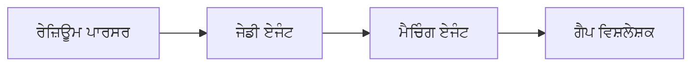
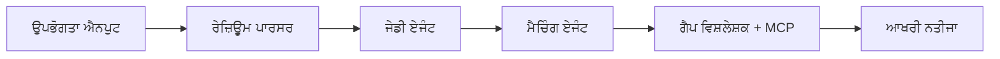

# ਮਾਡਿਊਲ 4 - ਓਰਕੇਸਟ੍ਰੇਸ਼ਨ ਪੈਟਰਨ

⏱️ ~10 ਮਿੰਟ

ਇਸ ਮਾਡਿਊਲ ਵਿੱਚ, ਤੁਸੀਂ Resume Job Fit Evaluator ਵਿੱਚ ਵਰਤੇ ਜਾਂਦੇ ਓਰਕੇਸਟ੍ਰੇਸ਼ਨ ਪੈਟਰਨ ਦੀ ਜਾਂਚ ਕਰਦੇ ਹੋ ਅਤੇ ਸਕਿੱਖਦੇ ਹੋ ਕਿ ਵਰਕਫਲੋ ਗ੍ਰਾਫ ਨੂੰ ਕਿਵੇਂ ਪੜ੍ਹਨਾ, ਸੋਧਣਾ ਅਤੇ ਵਿਸਥਾਰ ਕਰਨਾ ਹੈ। ਇਹ ਪੈਟਰਨ ਸਮਝਣਾ ਡੇਟਾ ਫਲੋ ਦੀਆਂ ਸਮੱਸਿਆਵਾਂ ਨੂੰ ਡੀਬੱਗ ਕਰਨ ਅਤੇ ਆਪਣਾ ਖ਼ੁਦ ਦਾ [ਮਲਟੀ-ਏਜੰਟ ਵਰਕਫਲੋ](https://learn.microsoft.com/agent-framework/workflows/) ਬਣਾਉਣ ਲਈ ਜ਼ਰੂਰੀ ਹੈ।

---

## ਪੈਟਰਨ 1: ਲੜੀਵਾਰ ਚੇਨ

ਵਰਕਫਲੋ ਵਿੱਚ ਮੂਲ ਪੈਟਰਨ ਇੱਕ **ਲੜੀਵਾਰ ਚੇਨ** ਹੈ - ਹਰ ਏਜੰਟ ਦਾ ਨਤੀਜਾ ਸਿੱਧਾ ਅਗਲੇ ਏਜੰਟ ਨੂੰ ਮਿਲਦਾ ਹੈ।


```mermaid
flowchart LR
    RP[ਰੇਜ਼ਿਊਮ ਪਾਰਸਰ] --> JD[ਜੇਡੀ ਏਜੰਟ]
    JD --> MA[ਮੈਚਿੰਗ ਏਜੰਟ]
    MA --> GA[ਗੈਪ ਵਿਸ਼ਲੇਸ਼ਕ]
```

ਕੋਡ ਵਿੱਚ, ਹਰ `add_edge()` ਕਾਲ ਲੜੀ ਵਿੱਚ ਇੱਕ ਕਦਮ ਬਣਾਉਂਦਾ ਹੈ:

```python
.add_edge(resume_executor, jd_executor)       # ResumeParser ਆਉਟਪੁੱਟ → JD Agent
.add_edge(jd_executor, matching_executor)     # JD Agent ਆਉਟਪੁੱਟ → MatchingAgent
.add_edge(matching_executor, gap_executor)    # MatchingAgent ਆਉਟਪੁੱਟ → GapAnalyzer
```

> **ਲੜੀਵਾਰ ਕਿਉਂ, ਫੈਨ-ਆਉਟ/ਫੈਨ-ਇਨ ਨਹੀਂ?** `WorkflowBuilder` ਆਉਣ ਵਾਲੀਆਂ ਏਜਾਂ ਲਈ **OR-ਸੈਮਾਂਟਿਕਸ** ਵਰਤਦਾ ਹੈ: ਜਿਵੇਂ ਹੀ **ਕੋਈ ਵੀ** ਪੂਰਵ-ਹੇਠਾਂ ਵਾਲਾ ਕੰਮ ਪੂਰਾ ਹੁੰਦਾ ਹੈ, ਨੀਵਾਂ ਮਸ਼ੀਨ ਚਾਲੂ ਹੋ ਜਾਂਦੀ ਹੈ। ਜੇ `matching_executor` ਕੋਲ ਦੋ ਆਉਣ ਵਾਲੀਆਂ ਲੜੀਆਂ ਹੁੰਦੀਆਂ (ਦੋਹਾਂ `resume_executor` ਅਤੇ `jd_executor` ਤੋਂ), ਤਾਂ ਇਹ ਦੋ ਵਾਰੀ ਚਾਲੂ ਹੁੰਦਾ - ਇੱਕ ਵਾਰੀ ResumeParser ਦੇ ਖ਼ਤਮ ਹੋਣ ਤੇ ਅਤੇ ਇਕ ਵਾਰੀ JD Agent ਦੇ ਖ਼ਤਮ ਹੋਣ ਤੇ - ਜਿਸ ਨਾਲ GapAnalyzer ਵੀ ਦੋ ਵਾਰੀ ਚੱਲਦਾ ਅਤੇ ਨਤੀਜਾ ਵੀ ਦੋ ਵਾਰੀ ਦਿਖਾਈ ਦਿੰਦਾ। ਲੜੀਵਾਰ ਪਾਈਪਲਾਈਨ ਇਸ ਨੂੰ ਪੂਰੀ ਤਰ੍ਹਾਂ ਰੋਕਦੀ ਹੈ।

## ਪੈਟਰਨ 2: ਸਮੱਗਰੀ ਰੀਲੇ

ਕਿਉਂਕਿ `context_mode="last_agent"` ਦਾ ਮਤਲਬ ਹੈ ਕਿ ਹਰ ਏਜੰਟ ਸਿਰਫ ਆਪਣੇ **ਸਿੱਧੇ ਪੂਰਵਵਤੀ ਦਾ ਨਤੀਜਾ** ਵੇਖਦਾ ਹੈ, ਲੜੀਵਾਰ ਚੇਨ ਦੇ ਏਜੰਟਾਂ ਨੂੰ ਖੁਦਵੇਖੀ ਅੱਗੇ ਉਹ ਡੇਟਾ ਭੇਜਣਾ ਪੈਂਦਾ ਹੈ ਜੋ ਹੇਠਾਂ ਵਾਲੇ ਏਜੰਟਾਂ ਨੂੰ ਚਾਹੀਦਾ ਹੈ।

ਇਸ ਵਰਕਫਲੋ ਵਿੱਚ:
- **ResumeParser** JD ਨੂੰ ਸਿੱਧਾ `[JOB DESCRIPTION PASS-THROUGH]` ਵਿੱਚ ਕਾਪੀ ਕਰਦਾ ਹੈ (ਤਾਂ ਜੋ JD Agent ਇਸਨੂੰ ਲੱਭ ਸਕੇ)।
- **JD Agent** `[PARSED RESUME]` ਨੂੰ ਸਿੱਧਾ `[PARSED RESUME PASS-THROUGH]` ਵਿੱਚ ਕਾਪੀ ਕਰਦਾ ਹੈ (ਤਾਂ ਜੋ MatchingAgent ਦੋਹਾਂ ਪ੍ਰੋਫ਼ਾਈਲਾਂ ਦੀ ਤੁਲਨਾ ਕਰ ਸਕੇ)।

```
ResumeParser output
└─ [PARSED RESUME]               ← extracted by JD Agent
└─ [JOB DESCRIPTION PASS-THROUGH] ← extracted by JD Agent

JD Agent output
└─ [JD REQUIREMENTS]             ← extracted by MatchingAgent
└─ [PARSED RESUME PASS-THROUGH]  ← extracted by MatchingAgent
```

ਹਰ ਇੱਕ ਰੀਲੇ ਭਾਗ ਨੂੰ **ਸਾਬਤ ਸਿਰਫ ਸਾਬਤ** ਕਾਪੀ ਕਰਨਾ ਲਾਜ਼ਮੀ ਹੈ - ਇਸਨੂੰ ਸੰਖੇਪ ਜਾਂ ਮੁੜ-ਲਿਖਣਾ ਹੇਠਾਂ ਵਾਲੇ ਏਜੰਟ ਨੂੰ ਬਰਬਾਦ ਕਰ ਦਿੰਦਾ ਹੈ ਜੋ ਇਸ 'ਤੇ ਮੋਹਰ ਰੱਖਦਾ ਹੈ।

---

## ਪੂਰਾ ਗ੍ਰਾਫ਼

ਲੜੀਵਾਰ ਚੇਨ ਅਤੇ ਸਮੱਗਰੀ ਰੀਲੇ ਪੈਟਰਨ ਨੂੰ ਮਿਲਾ ਕੇ ਪੂਰਾ ਵਰਕਫਲੋ ਬਣਦਾ ਹੈ:


```mermaid
flowchart LR
    U[ਉਪਭੋਗਤਾ ਐਨਪੁਟ] --> RP[ਰੇਜ਼ਿਊਮ ਪਾਰਸਰ]
    RP --> JD[ਜੇਡੀ ਏਜੰਟ]
    JD --> MA[ਮੈਚਿੰਗ ਏਜੰਟ]
    MA --> GA[ਗੈਪ ਵਿਸ਼ਲੇਸ਼ਕ + MCP]
    GA --> O[ਆਖਰੀ ਨਤੀਜਾ]
```

ਏਜੰਟ ਇੰਸਪੈਕਟਰ ਇਸੇ ਗ੍ਰਾਫ਼ ਸਟ੍ਰਕਚਰ ਨੂੰ ਦਿਖਾਉਂਦਾ ਹੈ ਜਦੋਂ ਏਜੰਟ ਲੋਕਲ ਤੌਰ ਤੇ ਚੱਲ ਰਿਹਾ ਹੁੰਦਾ ਹੈ। ਸਕ੍ਰੀਨਸ਼ਾਟ ਲਈ ਵੇਖੋ [ਮਾਡਿਊਲ 5 - ਯਥास्थਿਤੀ ਵਿੱਚ ਟੈਸਟ](05-test-locally.md)।

---

## WorkflowBuilder ਕੋਡ ਪੜ੍ਹਨਾ

ਪੂਰਾ `create_workflow()` ਫੰਕਸ਼ਨ [`PersonalCareerCopilot/main.py`](../../../../../workshop/lab02-multi-agent/PersonalCareerCopilot/main.py) ਵਿੱਚ ਹੈ। ਤਿੰਨ `add_edge()` ਕਾਲ ਲੜੀਵਾਰ ਪਾਈਪਲਾਈਨ ਬਣਾਉਂਦੀਆਂ ਹਨ:

| # | ਲੜੀ | ਪ੍ਰਭਾਵ |
|---|------|--------|
| 1 | `resume_executor → jd_executor` | JD Agent ਨੂੰ `[PARSED RESUME]` + `[JOB DESCRIPTION PASS-THROUGH]` ਮਿਲਦਾ ਹੈ |
| 2 | `jd_executor → matching_executor` | MatchingAgent ਨੂੰ `[JD REQUIREMENTS]` + `[PARSED RESUME PASS-THROUGH]` ਮਿਲਦਾ ਹੈ |
| 3 | `matching_executor → gap_executor` | GapAnalyzer ਨੂੰ ਫਿਟ ਰਿਪੋਰਟ + ਗੈਪ ਲਿਸਟ ਮਿਲਦੀ ਹੈ |

---

## ਗ੍ਰਾਫ਼ ਸੋਧਣਾ

### ਨਵਾਂ ਏਜੰਟ ਜੋੜਣਾ

ਪੰਜਾਂਵੇਂ ਏਜੰਟ ਨੂੰ ਜੋੜਨ ਲਈ (ਜਿਵੇਂ ਕਿ GapAnalyzer ਤੋਂ ਬਾਅਦ **InterviewPrepAgent**):

1. ਇੱਕ `INTERVIEW_PREP_INSTRUCTIONS` ਕਾਂਸਟੈਂਟ ਪਰਿਭਾਸ਼ਿਤ ਕਰੋ।
2. `Agent` ਅਤੇ `AgentExecutor` ਓਬਜੈਕਟ ਬਣਾਓ (ਮੌਜੂਦਾ ਚਾਰਾਂ ਵਾਂਗ ਹੀ)।
3. `WorkflowBuilder` ਵਿੱਚ `.add_edge(gap_executor, interview_exec)` ਜੋੜੋ।
4. `output_executors=[interview_exec]` ਅਪਡੇਟ ਕਰੋ।

> **ਮਹੱਤਵਪੂਰਨ:** `start_executor` ਹੀ ਇਕੋ ਇੱਕ ਏਜੰਟ ਹੈ ਜੋ ਕੱਚਾ ਯੂਜ਼ਰ ਇੰਪੁੱਟ ਪ੍ਰਾਪਤ ਕਰਦਾ ਹੈ। ਹੋਰ ਸਾਰੇ ਏਜੰਟ ਆਪਣੇ ਉਪਰਲੇ ਕਿਨਾਰੇ ਤੋਂ ਆਉਟਪੁੱਟ ਪ੍ਰਾਪਤ ਕਰਦੇ ਹਨ।

---

## ਆਮ ਗ੍ਰਾਫ਼ ਦੀਆਂ ਗਲਤੀਆਂ

| ਗਲਤੀ | ਲਛਣ | ਸੁਧਾਰ |
|---------|---------|-----|
| `output_executors` ਵੱਲੋਂ ਕਿਨਾਰਾ ਗੁੰਮ ਹੋਣਾ | ਏਜੰਟ ਚੱਲਦਾ ਹੈ ਪਰ ਨਤੀਜਾ ਖਾਲੀ ਹੁੰਦਾ ਹੈ | ਯਕੀਨੀ ਬਣਾਓ ਕਿ `start_executor` ਤੋਂ ਹਰੇਕ ਏਜੰਟ ਤੱਕ ਰਸਤਾ ਹੈ ਜੋ `output_executors` ਵਿੱਚ ਹੈ |
| ਗੋਲ ਚੱਕਰ ਦਾ ਨਿਰਭਰਤਾ | ਅਨੰਤ ਲੂਪ ਜਾਂ ਸਮਾਂ ਬਾਹਰ | ਚੈੱਕ ਕਰੋ ਕਿ ਕੋਈ ਏਜੰਟ ਆਪਣੇ ਉਪਰਲੇ ਏਜੰਟ ਨੂੰ ਮੁੜ ਨਹੀਂ ਭੇਜ ਰਿਹਾ |
| `output_executors` ਵਿੱਚ ਏਜੰਟ ਜਿਸਦੇ ਕੋਲ ਕੋਈ ਆਉਣ ਵਾਲਾ ਕਿਨਾਰਾ ਨਹੀਂ | ਨਤੀਜਾ ਖਾਲੀ | ਘੱਟੋ-ਘੱਟ ਇੱਕ `add_edge(source, that_agent)` ਜੋੜੋ |
| ਕਈ `output_executors` ਬਿਨਾਂ ਫੈਨ-ਇਨ ਦੇ | ਨਤੀਜਾ ਸਿਰਫ ਇੱਕ ਏਜੰਟ ਦਾ ਹੁੰਦਾ ਹੈ | ਇੱਕ ਮੁੱਖ ਆਉਟਪੁੱਟ ਏਜੰਟ ਵਰਤੋ ਜੋ ਸਭ ਨੂੰ ਮਿਲਾ ਕੇ ਦਿੰਦਾ ਹੈ, ਜਾਂ ਵੱਖ-ਵੱਖ ਆਉਟਪੁੱਟ ਮੰਨੋ |
| `start_executor` ਗੁੰਮ ਹੋਣਾ | ਬਣਾਉਂਦੇ ਸਮੇਂ `ValueError` | ਹਮੇਸ਼ਾ `WorkflowBuilder()` ਵਿੱਚ `start_executor` ਦਿਓ |

---

## ਗ੍ਰਾਫ਼ ਡੀਬੱਗਿੰਗ

### ਏਜੰਟ ਇੰਸਪੈਕਟਰ ਵਰਤਣਾ

1. F5 ਨਾਲ ਏਜੰਟ ਨੂੰ ਲੋਕਲ ਤੌਰ 'ਤੇ ਸ਼ੁਰੂ ਕਰੋ।
2. ਏਜੰਟ ਇੰਸਪੈਕਟਰ ਖੋਲ੍ਹੋ (`Ctrl+Shift+P` → **Foundry Toolkit: Open Agent Inspector**)।
3. ਇੱਕ ਟੈਸਟ ਸੁਨੇਹਾ ਭੇਜੋ।
4. ਇੰਸਪੈਕਟਰ ਦੇ ਜਵਾਬ ਪੈਨਲ ਵਿੱਚ **ਸਟਰੀਮਿੰਗ ਆਉਟਪੁੱਟ** ਵੇਖੋ - ਇਹ ਹਰ ਏਜੰਟ ਦਾ ਯੋਜਨਾ ਦੇ ਅਨੁਕੂਲ ਯੋਗਦਾਨ ਦਿਖਾਉਂਦਾ ਹੈ।


### ਲੌਗਿੰਗ ਦੀ ਵਰਤੋਂ

ਡੇਟਾ ਫਲੋ ਟ੍ਰੇਸ ਕਰਨ ਲਈ `main.py` ਵਿੱਚ ਲੌਗਿੰਗ ਸ਼ਾਮਲ ਕਰੋ:

```python
import logging
logger = logging.getLogger("resume-job-fit")

# main() ਵਿੱਚ, workflow ਬਣਾਉਣ ਤੋਂ ਬਾਅਦ:
logger.info("Workflow graph built with edges: RP→JD, JD→MA, MA→GA")
```

ਸਰਵਰ ਲੌਗ ਏਜੰਟ ਐਗਜ਼ੈਕਯੂਸ਼ਨ ਕ੍ਰਮ ਅਤੇ MCP ਟੂਲ ਕਾਲ ਦਿਖਾਉਂਦੇ ਹਨ:

```
INFO:agent_framework:Executing agent: ResumeParser
INFO:agent_framework:Executing agent: JobDescriptionAgent
INFO:agent_framework:Executing agent: MatchingAgent
INFO:agent_framework:Executing agent: GapAnalyzer
INFO:agent_framework:Tool call: search_microsoft_learn_for_plan(skill="Kubernetes")
POST https://learn.microsoft.com/api/mcp → 200
INFO:agent_framework:Tool call: search_microsoft_learn_for_plan(skill="Terraform")
POST https://learn.microsoft.com/api/mcp → 200
```

---

### ਚੈਕਪੋਇੰਟ

- [ ] ਤੁਸੀਂ ਵਰਕਫਲੋ ਵਿੱਚ ਦੋ ਓਰਕੇਸਟ੍ਰੇਸ਼ਨ ਪੈਟਰਨ, ਲੜੀਵਾਰ ਚੇਨ ਅਤੇ ਸਮੱਗਰੀ ਰੀਲੇ ਦੀ ਪਛਾਣ ਕਰ ਸਕਦੇ ਹੋ
- [ ] ਤੁਸੀਂ ਸਮਝਦੇ ਹੋ ਕਿ ਕਿਉਂ `context_mode="last_agent"` ਏਜੰਟਾਂ ਵਿਚਕਾਰ ਖੁੱਲ੍ਹੇ ਤੌਰ 'ਤੇ ਡੇਟਾ ਰੀਲੇ ਮੰਗਦਾ ਹੈ
- [ ] ਤੁਸੀਂ `WorkflowBuilder` ਕੋਡ ਪੜ੍ਹ ਸਕਦੇ ਹੋ ਅਤੇ ਹਰ `add_edge()` ਕਾਲ ਨੂੰ ਵਿਜ਼ੂਅਲ ਗ੍ਰਾਫ ਨਾਲ ਜੋੜ ਸਕਦੇ ਹੋ
- [ ] ਤੁਸੀਂ ਪਾਈਪਲਾਈਨ ਦੇ ਅੰਤ ਵਿੱਚ ਨਵਾਂ ਏਜੰਟ ਜੋੜਣ ਦੇ ਤਰੀਕੇ ਜਾਣਦੇ ਹੋ
- [ ] ਤੁਸੀਂ ਆਮ ਗ੍ਰਾਫ਼ ਦੀਆਂ ਗਲਤੀਆਂ ਅਤੇ ਉਹਨਾਂ ਦੇ ਲੱਛਣਾਂ ਨੂੰ ਪਛਾਣ ਸਕਦੇ ਹੋ

---

**ਪਿਛਲਾ:** [03 - ਏਜੰਟ ਅਤੇ ਵਾਤਾਵਰਣ ਸੈੱਟਅੱਪ ਕਰੋ](03-configure-agents.md) · **ਅਗਲਾ:** [05 - ਲੋਕਲ ਤੌਰ ਤੇ ਟੈਸਟ ਕਰੋ →](05-test-locally.md)

---

<!-- CO-OP TRANSLATOR DISCLAIMER START -->
**ਅਸਵੀਕਾਰੋਪਣ**:
ਇਸ ਦਸਤਾਵੇਜ਼ ਦਾ ਅਨੁਵਾਦ ਏਆਈ ਅਨੁਵਾਦ ਸੇਵਾ [Co-op Translator](https://github.com/Azure/co-op-translator) ਦੀ ਵਰਤੋਂ ਕਰਕੇ ਕੀਤਾ ਗਿਆ ਹੈ। ਜਦੋਂ ਕਿ ਅਸੀਂ ਸਹੀਤਾਵਾਂ ਲਈ ਯਤਨਸ਼ੀਲ ਹਾਂ, ਕਿਰਪਾ ਕਰਕੇ ਧਿਆਨ ਰੱਖੋ ਕਿ ਸਵੈਚਾਲਿਤ ਅਨੁਵਾਦਾਂ ਵਿੱਚ ਗਲਤੀਆਂ ਜਾਂ ਅਸਮੱਤਿਆਵਾਂ ਹੋ ਸਕਦੀਆਂ ਹਨ। ਮੂਲ ਦਸਤਾਵੇਜ਼ ਆਪਣੀ ਮੂਲ ਭਾਸ਼ਾ ਵਿੱਚ ਅਧਿਕਾਰਕ ਸਰੋਤ ਮੰਨਿਆ ਜਾਣਾ ਚਾਹੀਦਾ ਹੈ। ਜਰੂਰੀ ਜਾਣਕਾਰੀ ਲਈ, ਪੇਸ਼ੇਵਰ ਮਨੁੱਖੀ ਅਨੁਵਾਦ ਦੀ ਸਿਫ਼ਾਰਸ਼ ਕੀਤੀ ਜਾਂਦੀ ਹੈ। ਅਸੀਂ ਇਸ ਅਨੁਵਾਦ ਦੇ ਉਪਯੋਗ ਤੋਂ ਪੈਦਾ ਹੋਣ ਵਾਲੀਆਂ ਕਿਸੇ ਵੀ ਗਲਤਫਹਿਮੀਆਂ ਜਾਂ ਗਲਤ ਵਿਆਖਿਆਵਾਂ ਲਈ ਜਵਾਬਦੇਹ ਨਹੀਂ ਹਾਂ।
<!-- CO-OP TRANSLATOR DISCLAIMER END -->