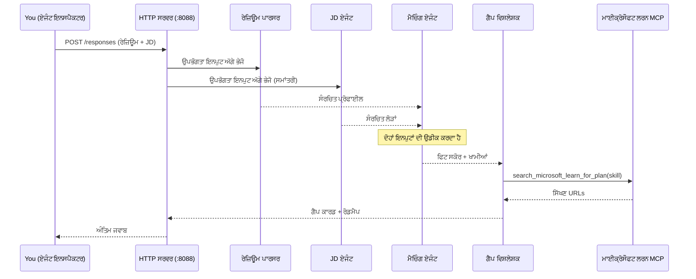
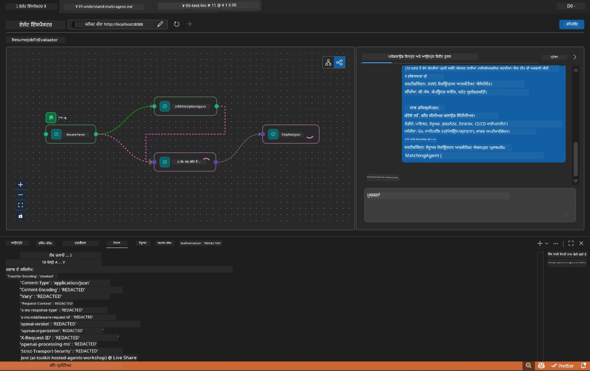

# ਮੋਡੀਊਲ 5 - ਸਥਾਨਕ ਤੌਰ 'ਤੇ ਟੈਸਟ ਕਰੋ (ਮਲਟੀ-ਏਜੰਟ)

ਇਸ ਮੋਡੀਊਲ ਵਿੱਚ, ਤੁਸੀਂ ਮਲਟੀ-ਏਜੰਟ ਵਰਕਫਲੋ ਸਥਾਨਕ ਤੌਰ 'ਤੇ ਚਲਾਉਂਦੇ ਹੋ, Agent Inspector ਨਾਲ ਟੈਸਟ ਕਰਦੇ ਹੋ, ਅਤੇ ਇਹ ਪੱਕਾ ਕਰਦੇ ਹੋ ਕਿ ਸਾਰੇ ਚਾਰ ਏਜੰਟ ਅਤੇ MCP ਟੂਲ ਠੀਕ ਤਰ੍ਹਾਂ ਕੰਮ ਕਰ ਰਹੇ ਹਨ ਇਸ ਤੋਂ ਪਹਿਲਾਂ ਕਿ ਤੁਸੀਂ ਉਸਨੂੰ Foundry 'ਤੇ ਡਿਪਲੌਇ ਕਰੋ।

### ਸਥਾਨਕ ਟੈਸਟ ਦੌਰਾਨ ਕੀ ਹੁੰਦਾ ਹੈ


---

## ਕਦਮ 1: ਏਜੰਟ ਸਰਵਰ ਸ਼ੁਰੂ ਕਰੋ

### ਵਿਕਲਪ A: VS ਕੋਡ ਟਾਸਕ ਦੀ ਵਰਤੋਂ ਕਰਨਾ (ਸਿਫਾਰਸ਼ੀ)

1. `Ctrl+Shift+P` ਦਬਾਓ → **Tasks: Run Task** ਲਿਖੋ → **Run Lab02 HTTP Server** ਚੁਣੋ।
2. ਟਾਸਕ ਡਿਬੱਗਪੀ ਨਾਲ ਪੋਰਟ `5679` ‘ਤੇ ਅਤੇ ਏਜੰਟ ਨੂੰ ਪੋਰਟ `8088` ‘ਤੇ ਲਗਾ ਕੇ ਸਰਵਰ ਚਲਾਉਂਦਾ ਹੈ।
3. ਆਉਟਪੁੱਟ ਲਈ ਉਡੀਕ ਕਰੋ:

```
INFO:resume-job-fit:Starting Resume -> Job Fit Evaluator HTTP server...
INFO:resume-job-fit:Server running on http://localhost:8088
```

### ਵਿਕਲਪ B: ਟਰਮੀਨਲ ਦੀ ਬੰਦੂਬਸਤ ਨਾਲ ਵਰਤੋਂ

```powershell
cd workshop\lab02-multi-agent\PersonalCareerCopilot
```

ਵਰਚੁਅਲ ਵਾਤਾਵਰਨ ਐਕਟੀਵੇਟ ਕਰੋ:

**PowerShell (ਵਿੰਡੋਜ਼):**
```powershell
.\.venv\Scripts\Activate.ps1
```

**macOS/Linux:**
```bash
source .venv/bin/activate
```

ਸਰਵਰ ਸ਼ੁਰੂ ਕਰੋ:

```powershell
python -m debugpy --listen 127.0.0.1:5679 -m agentdev run main.py --verbose --port 8088
```

### ਵਿਕਲਪ C: F5 ਵਰਤ ਕੇ (ਡਿਬੱਗ ਮੋਡ)

1. `F5` ਦਬਾਓ ਜਾਂ **Run and Debug** (`Ctrl+Shift+D`) ‘ਤੇ ਜਾਓ।
2. ਡਰੌਪਡਾਊਨ ‘ਚੋਂ **Lab02 - Multi-Agent** ਲਾਂਚ ਕੰਫਿਗਰੇਸ਼ਨ ਚੁਣੋ।
3. ਸਰਵਰ ਪੂਰੇ ਬ੍ਰੇਕਪੌਇੰਟ ਸਹਾਇਤਾ ਨਾਲ ਸ਼ੁਰੂ ਹੁੰਦਾ ਹੈ।

> **ਟਿੱਪਣੀ:** ਡਿਬੱਗ ਮੋਡ ਤੁਹਾਨੂੰ `search_microsoft_learn_for_plan()` ਦੇ ਅੰਦਰ ਬ੍ਰੇਕਪੌਇੰਟ ਲਗਾਉਣ ਦਾ ਮੌਕਾ ਦਿੰਦਾ ਹੈ ਤਾਂ ਜੋ MCP ਦੇ ਜਵਾਬਾਂ ਦੀ ਜਾਂਚ ਕਰ ਸਕੋ, ਜਾਂ ਏਜੰਟ ਨਿਰਦੇਸ਼ ਸਟਰਿੰਗਜ਼ ਦੇ ਅੰਦਰ ਦੇਖ ਸਕੋ ਕਿ ਹਰ ਏਜੰਟ ਨੂੰ ਕੀ ਮਿਲਦਾ ਹੈ।

---

## ਕਦਮ 2: Agent Inspector ਖੋਲ੍ਹੋ

1. `Ctrl+Shift+P` ਦਬਾਓ → **Foundry Toolkit: Open Agent Inspector** ਲਿਖੋ।
2. Agent Inspector ਬ੍ਰਾਊਜ਼ਰ ਟੈਬ ਵਿੱਚ `http://localhost:5679` ‘ਤੇ ਖੁੱਲਦਾ ਹੈ।
3. ਤੁਹਾਨੂੰ ਏਜੰਟ ਇੰਟਰਫੇਸ ਮੈਸੇਜ ਲੈਣ ਲਈ ਤਿਆਰ ਦਿਖਾਈ ਦੇਣਾ ਚਾਹੀਦਾ ਹੈ।

> **ਜੇ Agent Inspector ਨਹੀਂ ਖੁਲਦਾ:** ਯਕੀਨੀ ਬਣਾਓ ਕਿ ਸਰਵਰ ਪੂਰੀ ਤਰ੍ਹਾਂ ਚੱਲ ਰਿਹਾ ਹੈ (ਤੁਹਾਨੂੰ "Server running" ਦਾ ਲੋਗ ਵੇਖਣਾ ਚਾਹੀਦਾ ਹੈ)। ਜੇ ਪੋਰਟ 5679 ਬਿਜ਼ੀ ਹੈ, ਤਾਂ [Module 8 - Troubleshooting](08-troubleshooting.md) ਦੀ ਰਾਹਨੁਮਾਈ ਵੇਖੋ।

---

## ਕਦਮ 3: ਸSmoke ਟੈਸਟ ਚਲਾਓ

ਇਹ ਤਿੰਨ ਟੈਸਟ ਕ੍ਰਮਵਾਰ ਚਲਾਓ। ਹਰ ਇੱਕ ਵਰਕਫਲੋ ਦੇ ਹੋਰ ਹਿੱਸੇ ਦੀ ਜਾਂਚ ਕਰਦਾ ਹੈ।

### ਟੈਸਟ 1: ਬੇਸਿਕ ਰੇਜ਼ੂਮੇ + ਨੌਕਰੀ ਦਾ ਵੇਰਵਾ

ਹੇਠਾਂ ਦਿੱਤਾ ਸਮੱਗਰੀ Agent Inspector ਵਿੱਚ ਚਿਪਕਾਓ:

```
Resume:
Jane Doe
Senior Software Engineer with 5 years of experience in Python, Django, and AWS.
Built microservices handling 10K+ requests/second. Led a team of 4 developers.
Certifications: AWS Solutions Architect Associate.
Education: B.S. Computer Science, State University.

Job Description:
Senior Cloud Engineer at Contoso Ltd.
Required: Python, Azure, Kubernetes, Terraform, CI/CD pipelines.
Preferred: Go, monitoring (Prometheus/Grafana), cost optimization.
Experience: 5+ years in cloud infrastructure.
Certifications: Azure Solutions Architect Expert preferred.
```

**ਉਮੀਦ ਕੀਤੀ ਆਉਟਪੁੱਟ ਸਤਰੰਚਨਾ:**

ਜਵਾਬ ਵਿੱਚ ਸਾਰੀ ਚਾਰਾਂ ਏਜੰਟਾਂ ਤੋਂ ਸੰਬੰਧਿਤ ਆਉਟਪੁੱਟ ਲੜੀਵਾਰ ਹੋਣੀ ਚਾਹੀਦੀ ਹੈ:

1. **Resume Parser ਆਉਟਪੁੱਟ** - ਸ਼੍ਰੇਣੀ ਕਰ ਕੇ ਹੁਨਰਾਂ ਨਾਲ ਬਣਿਆ ਸੰਰਚਿਤ ਉਮੀਦਵਾਰ ਪ੍ਰੋਫਾਈਲ
2. **JD Agent ਆਉਟਪੁੱਟ** - ਲੋੜਾਂ ਦੀ ਸੰਰਚਨਾ ਜਿਸ ਵਿੱਚ ਜਰੂਰੀ ਅਤੇ ਪREFERRED ਹੁਨਰ ਵੱਖਰੇ ਹਨ
3. **Matching Agent ਆਉਟਪੁੱਟ** - ਫਿਟ ਸਕੋਰ (0-100) ਸਹਿਤ ਵਿਸਤਾਰ, ਮਿਲੇ ਹੋਏ ਹੁਨਰ, ਗੁੰਮ ਹੁਨਰ, ਖਾਲੀ ਥਾਵਾਂ
4. **Gap Analyzer ਆਉਟਪੁੱਟ** - ਹਰ ਗੁੰਮ ਹੁਨਰ ਲਈ ਵੱਖ-ਵੱਖ ਗੈਪ ਕਾਰਡ, ਹਰ ਇੱਕ ਵਿਚ Microsoft Learn URLs



### ਟੈਸਟ 1 ਵਿੱਚ ਕੀ ਚੈੱਕ ਕਰਨਾ ਹੈ

| ਚੈੱਕ | ਉਮੀਦ | ਪਾਸ? |
|-------|----------|-------|
| ਜਵਾਬ ਵਿੱਚ ਫਿਟ ਸਕੋਰ ਹੋਵੇ | 0-100 ਦਰਮਿਆਨ ਨੰਬਰ ਸਹਿਤ ਵਿਸਤਾਰ | |
| ਮਿਲੇ ਹੁਨਰ ਲਿਖੇ ਹੋਣ | Python, CI/CD (ਆਧਾ), ਆਦਿ | |
| ਗੁੰਮ ਹੁਨਰ ਲਿਖੇ ਹੋਣ | Azure, Kubernetes, Terraform ਆਦਿ | |
| ਹਰ ਗੁੰਮ ਹੁਨਰ ਲਈ ਗੈਪ ਕਾਰਡ ਹੋਣ | ਹਰ ਹੁਨਰ ਲਈ ਇੱਕ ਕਾਰਡ | |
| Microsoft Learn URLs ਮੌਜੂਦ ਹੋਣ | ਆਸਲੀ `learn.microsoft.com` ਲਿੰਕ | |
| ਕੋਈ ਐਰਰ ਸੰਦਰ ਨਾਂ ਹੋਵੇ | ਸਾਫ ਅਤੇ ਸੰਰਚਿਤ ਆਉਟਪੁੱਟ | |

### ਟੈਸਟ 2: MCP ਟੂਲ ਕ_EXECUTION_ ਦੀ ਜਾਂਚ ਕਰੋ

ਟੈਸਟ 1 ਚੱਲ ਰਹੇ ਹੋਣ ਦੌਰਾਨ, **ਸਰਵਰ ਟਰਮੀਨਲ** ਵਿੱਚ MCP ਲੌਗ ਇਨਟਰੀਜ਼ ਦੇਖੋ:

```
GET https://learn.microsoft.com/api/mcp → 405 (Method Not Allowed)
POST https://learn.microsoft.com/api/mcp → 200
DELETE https://learn.microsoft.com/api/mcp → 405 (Method Not Allowed)
```

| ਲੌਗ ਇਨਟਰੀ | ਅਰਥ | ਉਮੀਦ ਹੈ? |
|-----------|---------|-----------|
| `GET ... → 405` | MCP ਕਲਾਇੰਟ ਮੌੜ ਵਿਚ GET ਨਾਲ ਪ੍ਰੋਬ ਕਰਦਾ ਹੈ | ਹਾਂ - ਸਧਾਰਣ |
| `POST ... → 200` | Microsoft Learn MCP ਸਰਵਰ ਨੂੰ ਅਸਲ ਟੂਲ ਕਾਲ | ਹਾਂ - ਇਹ ਅਸਲ ਕਾਲ ਹੈ |
| `DELETE ... → 405` | MCP ਕਲਾਇੰਟ ਕਲੀਨਅੱਪ ਵਿੱਚ DELETE ਨਾਲ ਪ੍ਰੋਬ ਕਰਦਾ ਹੈ | ਹਾਂ - ਸਧਾਰਣ |
| `POST ... → 4xx/5xx` | ਟੂਲ ਕਾਲ ਫੇਲ੍ਹ ਹੋਈ | ਨਹੀਂ - ਵੇਖੋ [Troubleshooting](08-troubleshooting.md) |

> **ਮੁੱਖ ਮੱਦਾ:** `GET 405` ਅਤੇ `DELETE 405` ਲਾਈਨਾਂ **ਉਮੀਦ ਵਾਲਾ ਵਿਹਾਰ** ਹਨ। ਸਿਰਫ ਉਸ ਵੇਲੇ ਚਿੰਤਾ ਕਰੋ ਜਦੋਂ `POST` ਕਾਲਾਂ ਨਾ-200 ਸਥਿਤੀ ਕੋਡ ਵਾਪਸ ਦਿੰਦੀਆਂ ਹਨ।

### ਟੈਸਟ 3: ਐਡਜ ਕੇਸ - ਉੱਚ-ਫਿਟ ਉਮੀਦਵਾਰ

ਇੱਕ ਰੇਜ਼ੂਮੇ ਪੇਸਟ ਕਰੋ ਜੋ JD ਨਾਲ ਬਹੁਤ ਮਿਲਦਾ ਜੁਲਦਾ ਹੋਵੇ ਤਾਂ ਜੋ ਇਹ ਦੇਖਿਆ ਜਾ ਸਕੇ ਕਿ GapAnalyzer ਉੱਚ-ਫਿਟ ਪ੍ਰਸੰਗਾਂ ਨੂੰ ਕਿਵੇਂ ਸੰਭਾਲਦਾ ਹੈ:

```
Resume:
Alex Chen
Senior Cloud Engineer with 7 years of experience.
Skills: Python, Azure (AKS, Functions, DevOps), Kubernetes, Terraform, CI/CD (GitHub Actions, Azure Pipelines), Go, Prometheus, Grafana, cost optimization.
Certifications: Azure Solutions Architect Expert, Azure DevOps Engineer Expert.
Led infrastructure migration to Azure for 3 enterprise clients.
Education: M.S. Computer Science, Tech University.

Job Description:
Senior Cloud Engineer at Contoso Ltd.
Required: Python, Azure, Kubernetes, Terraform, CI/CD pipelines.
Preferred: Go, monitoring (Prometheus/Grafana), cost optimization.
Experience: 5+ years in cloud infrastructure.
Certifications: Azure Solutions Architect Expert preferred.
```

**ਉਮੀਦ ਕੀਤੀ ਵਿਵਹਾਰ:**
- ਫਿਟ ਸਕੋਰ **80+** ਹੋਣਾ ਚਾਹੀਦਾ ਹੈ (ਜਿਆਦਾ ਹੂੰਰ ਮਿਲਦੇ ਹਨ)
- ਗੈਪ ਕਾਰਡ polish/interview ਤਿਆਰੀ ‘ਤੇ ਧਿਆਨ ਦੇਣੇ ਚਾਹੀਦੇ ਹਨ ਨਾ ਕਿ ਬੁਨਿਆਦੀ ਸਿੱਖਿਆ ‘ਤੇ
- GapAnalyzer ਦੇ ਨਿਰਦੇਸ਼ ਕਹਿੰਦੇ ਹਨ: "ਜੇ ਫਿਟ >= 80, ਤਾਂ polish/interview ਤਿਆਰੀ ਉੱਤੇ ਧਿਆਨ ਦਿਓ"

---

## ਕਦਮ 4: ਆਉਟਪੁੱਟ ਦੀ ਪੂਰਨਤਾ ਦੀ ਜਾਂਚ ਕਰੋ

ਟੈਸਟਾਂ ਚਲਾਉਣ ਤੋਂ ਬਾਅਦ, ਇਸ ਗੱਲ ਨੂੰ ਯਕੀਨੀ ਬਣਾਓ ਕਿ ਆਉਟਪੁੱਟ ਹੇਠ ਲਿਖੇ ਮਾਪਦੰਡਾਂ ‘ਤੇ ਖਰਾ ਉਤਰਦਾ ਹੈ:

### ਆਉਟਪੁੱਟ ਸਤਰੰਚਨਾ ਚੈਕਲਿਸਟ

| ਸੈਕਸ਼ਨ | ਏਜੰਟ | ਮੌਜੂਦ ਹੈ? |
|---------|-------|----------|
| ਉਮੀਦਵਾਰ ਪ੍ਰੋਫਾਈਲ | Resume Parser | |
| ਤਕਨੀਕੀ ਹੁਨਰ (ਸ਼੍ਰੇਣੀਬੱਧ) | Resume Parser | |
| ਭੂਮਿਕਾ ਓਵerview | JD Agent | |
| ਲੋੜੀਂਦੇ ਵੱਧ ਪREFERRED ਹੁਨਰ | JD Agent | |
| ਫਿਟ ਸਕੋਰ ਸਹਿਤ ਵਿਸਤਾਰ | Matching Agent | |
| ਮਿਲੇ / ਗੁੰਮ / ਅਧੂਰੇ ਹੁਨਰ | Matching Agent | |
| ਹਰ ਗੁੰਮ ਹੁਨਰ ਲਈ ਗੈਪ ਕਾਰਡ | Gap Analyzer | |
| ਗੈਪ ਕਾਰਡ ਵਿੱਚ Microsoft Learn URLs | Gap Analyzer (MCP) | |
| ਸਿੱਖਣ ਦਾ ਕ੍ਰਮ (ਨੰਬਰਦਾਰ) | Gap Analyzer | |
| ਸਮਾਂ-ਰੇਖਾ ਸੰਖੇਪ | Gap Analyzer | |

### ਇਸ ਮੌੜ ‘ਤੇ ਆਮ ਸਮੱਸਿਆਵਾਂ

| ਸਮੱਸਿਆ | ਕਾਰਨ | ਸੁਧਾਰ |
|-------|-------|-----|
| ਸਿਰਫ 1 ਗੈਪ ਕਾਰਡ (ਬਾਕੀ ਕੱਟੇ ਗਏ) | GapAnalyzer ਨਿਰਦੇਸ਼ਾਂ ਵਿੱਚ CRITICAL ਬਲਾਕ ਗਾਇਬ | `GAP_ANALYZER_INSTRUCTIONS` ਵਿੱਚ `CRITICAL:` ਪੈਰਾ ਸ਼ਾਮਿਲ ਕਰੋ - ਵੇਖੋ [Module 3](03-configure-agents.md) |
| Microsoft Learn URLs ਨਹੀਂ ਹਨ | MCP ਏਂਡਪੁਇੰਟ ਪਹੁੰਚਯੋਗ ਨਹੀਂ | ਇੰਟਰਨੈੱਟ ਕનેਕਸ਼ਨ ਚੈੱਕ ਕਰੋ। `.env` ਵਿੱਚ `MICROSOFT_LEARN_MCP_ENDPOINT` ਨੂੰ ਯਕੀਨੀ ਬਣਾਓ ਕਿ ਇਹ `https://learn.microsoft.com/api/mcp` ਹੈ |
| ਖਾਲੀ ਜਵਾਬ | `PROJECT_ENDPOINT` ਜਾਂ `MODEL_DEPLOYMENT_NAME` ਸੈੱਟ ਨਹੀਂ | `.env` ਫਾਈਲ ਦੀਆਂ ਵੈਲਿਊਆਂ ਚੈੱਕ ਕਰੋ। ਟਰਮੀਨਲ ਵਿੱਚ `echo $env:PROJECT_ENDPOINT` ਚਲਾਓ |
| ਫਿਟ ਸਕੋਰ 0 ਜਾਂ ਗੁੰਮ | MatchingAgent ਨੂੰ ਕੋਈ ਡੇਟਾ ਨਹੀਂ ਮਿਲਿਆ | `create_workflow()` ਵਿੱਚ `add_edge(resume_parser, matching_agent)` ਅਤੇ `add_edge(jd_agent, matching_agent)` ਹੋਣ ਦੀ ਜਾਂਚ ਕਰੋ |
| ਏਜੰਟ ਤੁਰੰਤ ਬੰਦ | ਆਯਾਤ ਗਲਤੀ ਜਾਂ ਨਿਰਭਰਤਾ ਗਾਇਬ | `pip install -r requirements.txt` ਦੁਬਾਰਾ ਚਲਾਓ। ਟਰਮੀਨਲ ਵਿੱਚ ਟਰੇਸ ਚੈੱਕ ਕਰੋ |
| `validate_configuration` ਗਲਤੀ | env ਵੈਰੀਏਬਲ ਗਾਇਬ | `.env` ਬਣਾਓ ਜਿਸ ਵਿੱਚ `PROJECT_ENDPOINT=<your-endpoint>` ਅਤੇ `MODEL_DEPLOYMENT_NAME=<your-model>` ਹੋਵੇ |

---

## ਕਦਮ 5: ਆਪਣਾ ਡੇਟਾ ਨਾਲ ਟੈਸਟ ਕਰੋ (ਵਿਅਕਲਪਿਕ)

ਆਪਣਾ ਰੇਜ਼ੂਮੇ ਅਤੇ ਅਸਲ ਨੌਕਰੀ ਦਾ ਵੇਰਵਾ ਪੇਸਟ ਕਰਨ ਦੀ ਕੋਸ਼ਿਸ਼ ਕਰੋ। ਇਹ ਜਾਂਚ ਕਰਨ ਵਿੱਚ ਮਦਦ ਕਰਦਾ ਹੈ ਕਿ:

- ਏਜੰਟ ਵੱਖ-ਵੱਖ ਰੇਜ਼ੂਮੇ ਫਾਰਮੈਟ (ਕ੍ਰਮਵਾਰ, ਕਾਰਗੁਜ਼ਾਰੀ, ਆਧਾਰਭੂਤ) ਨੂੰ ਸੰਭਾਲਦੇ ਹਨ
- JD Agent ਵੱਖ-ਵੱਖ JD ਸਟਾਈਲ (ਬੁਲੇਟ ਪੁਆਇੰਟ, ਪੈਰਾਗ੍ਰਾਫ, ਸੰਰਚਿਤ) ਨੂੰ ਸੰਭਾਲਦਾ ਹੈ
- MCP ਟੂਲ ਅਸਲੀ ਹੁਨਰਾਂ ਲਈ ਸੰਬੰਧਿਤ ਸਰੋਤ ਮੁਹੱਈਆ ਕਰਵਾਉਂਦਾ ਹੈ
- ਗੈਪ ਕਾਰਡ ਤੁਹਾਡੇ ਖ਼ਾਸ ਪਿਛੋਕੜ ਲਈ ਵਿਅਕਤੀਗਤ ਹੁੰਦੇ ਹਨ

> **ਗੋਪਨੀਯਤਾ ਨੋਟ:** ਜਦੋਂ ਸਥਾਨਕ ਤੌਰ ‘ਤੇ ਟੈਸਟ ਕਰਦੇ ਹੋ, ਤਾਂ ਤੁਹਾਡਾ ਡੇਟਾ ਤੁਹਾਡੇ ਮਸ਼ੀਨ ’ਤੇ ਹੀ ਰਹਿੰਦਾ ਹੈ ਅਤੇ ਸਿਰਫ ਤੁਹਾਡੇ Azure OpenAI ਡਿਪਲੋਇਮੈਂਟ ਨੂੰ ਭੇਜਿਆ ਜਾਂਦਾ ਹੈ। ਇਹ ਵਰਕਸ਼ਾਪ ਇੰਫਰਾਸਟਰੱਕਚਰ ਵੱਲੋਂ ਲੌਗ ਜਾਂ ਸਟੋਰ ਨਹੀਂ ਕੀਤਾ ਜਾਂਦਾ। ਜੇ ਤੁਸੀਂ ਚਾਹੋ ਤਾਂ ਡਮੀ ਨਾਮ ਵਰਤੋ (ਜਿਵੇਂ, "Jane Doe" ਤੁਹਾਡੇ ਅਸਲੀ ਨਾਮ ਦੀ ਥਾਂ)।

---

### ਚੈਕਪੋਇੰਟ

- [ ] ਪੋਰਟ `8088` ‘ਤੇ ਸਰਵਰ ਸਫਲਤਾਪੂਰਵਕ ਚੱਲ ਰਿਹਾ ਹੈ (ਲੌਗ ‘ਚ "Server running" ਦਿਖਾਈ ਦੇ ਰਿਹਾ ਹੈ)
- [ ] Agent Inspector ਖੁੱਲ ਗਿਆ ਅਤੇ ਏਜੰਟ ਨਾਲ ਜੁੜਿਆ
- [ ] ਟੈਸਟ 1: ਪੂਰਾ ਜਵਾਬ ਫਿਟ ਸਕੋਰ, ਮਿਲੇ/ਗੁੰਮ ਹੁਨਰ, ਗੈਪ ਕਾਰਡ ਅਤੇ Microsoft Learn URLs ਦੇ ਨਾਲ
- [ ] ਟੈਸਟ 2: MCP ਲੌਗ ਵਿੱਚ `POST ... → 200` (ਟੂਲ ਕਾਲ ਸਫਲ)
- [ ] ਟੈਸਟ 3: ਉੱਚ-ਫਿਟ ਉਮੀਦਵਾਰ ਨੂੰ 80+ ਸਕੋਰ ਮਿਲਿਆ ਹੈ ਜਿਸ ਵਿੱਚ polish-ਕੇਂਦਰਿਤ ਸਿਫਾਰਸ਼ਾਂ ਹਨ
- [ ] ਸਾਰੇ ਗੈਪ ਕਾਰਡ ਮੌਜੂਦ ਹਨ (ਹਰ ਗੁੰਮ ਹੁਨਰ ਲਈ ਇੱਕ, ਕੋਈ ਕੱਟੜਾਈ ਨਹੀਂ)
- [ ] ਸਰਵਰ ਟਰਮੀਨਲ ਵਿੱਚ ਕੋਈ ਗਲਤੀ ਜਾਂ ਸਟੈਕ ਟਰੇਸ ਨਹੀਂ

---

**ਪਿਛਲਾ:** [04 - Orchestration Patterns](04-orchestration-patterns.md) · **ਅਗਲਾ:** [06 - Deploy to Foundry →](06-deploy-to-foundry.md)

---

<!-- CO-OP TRANSLATOR DISCLAIMER START -->
**ਅਸਵੀਕਾਰੋक्ति**:  
ਇਹ ਦਸਤਾਵੇਜ਼ AI ਅਨੁਵਾਦ ਸੇਵਾ [Co-op Translator](https://github.com/Azure/co-op-translator) ਦੀ ਵਰਤੋਂ ਕਰਕੇ ਅਨੁਵਾਦਿਤ ਕੀਤਾ ਗਿਆ ਹੈ। ਜਦੋਂ ਕਿ ਅਸੀਂ ਸਹੀਤਾ ਲਈ ਕੋਸ਼ਿਸ਼ ਕਰਦੇ ਹਾਂ, ਕਿਰਪਾ ਕਰਕੇ ਧਿਆਨ ਵਿੱਚ ਰੱਖੋ ਕਿ ਆਟੋਮੈਟਿਕ ਅਨੁਵਾਦਾਂ ਵਿੱਚ ਗਲਤੀਆਂ ਜਾਂ ਅਣਸਹੀ ਹੁੰਦੀਆਂ ਹੋ ਸਕਦੀਆਂ ਹਨ। ਮੂਲ ਦਸਤਾਵੇਜ਼ ਆਪਣੀ ਮੂਲ ਭਾਸ਼ਾ ਵਿੱਚ ਅਧਿਕਾਰਤ ਸਰੋਤ ਮੰਨਿਆ ਜਾਣਾ ਚਾਹੀਦਾ ਹੈ। ਜਰੂਰੀ ਜਾਣਕਾਰੀ ਲਈ, ਪੇਸ਼ੇਵਰ ਮਨੁੱਖੀ ਅਨੁਵਾਦ ਦੀ ਸਿਫਾਰਿਸ਼ ਕੀਤੀ ਜਾਂਦੀ ਹੈ। ਇਸ ਅਨੁਵਾਦ ਦੀ ਵਰਤੋਂ ਨਾਲ ਪੈਦਾ ਹੋਣ ਵਾਲੀਆਂ ਕਿਸੇ ਵੀ ਗਲਤਫਹਿਮੀਆਂ ਜਾਂ ਗਲਤ ਵਿਵਾਧਾਂ ਲਈ ਅਸੀਂ ਜ਼ਿੰਮੇਵਾਰ ਨਹੀਂ ਹਾਂ।
<!-- CO-OP TRANSLATOR DISCLAIMER END -->