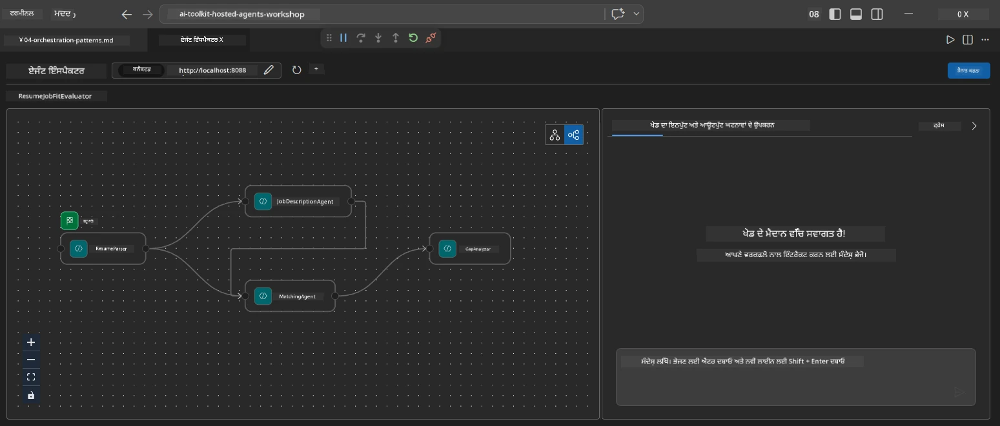
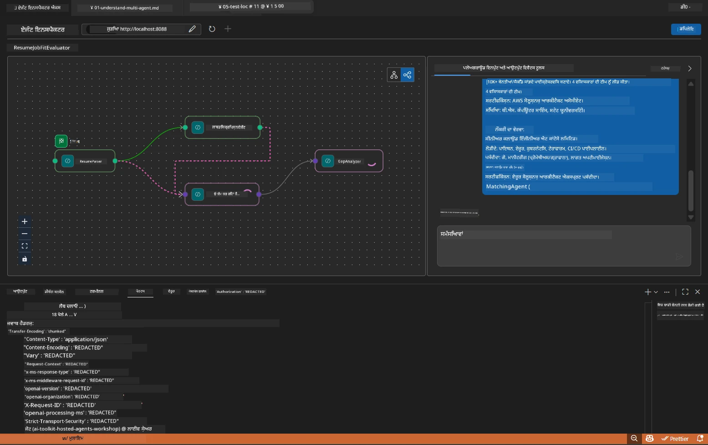
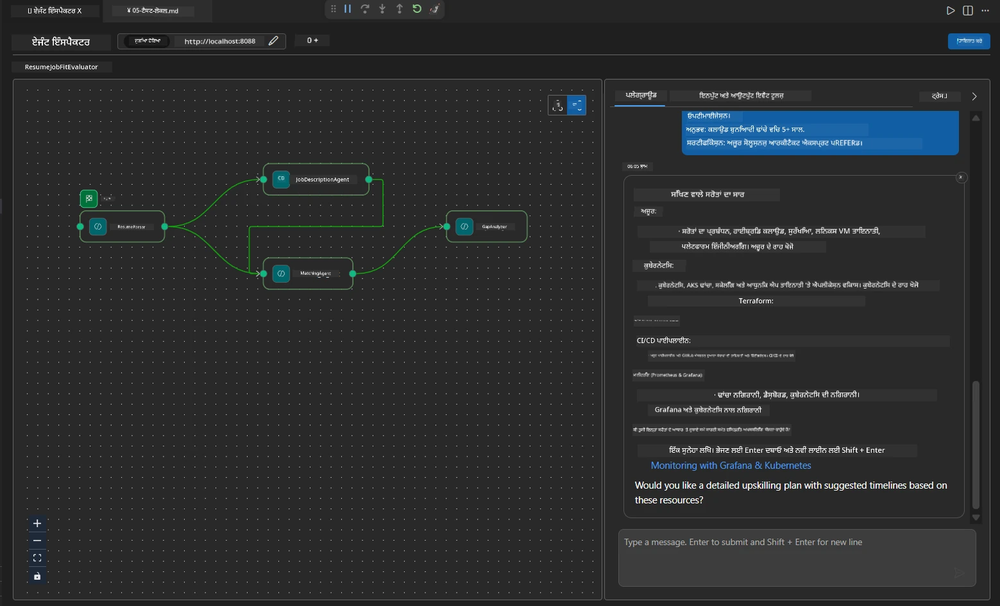

# ਮੋਡੀਊਲ 5 - ਸਥਾਨਕ ਤੌਰ 'ਤੇ ਟੈਸਟ ਕਰੋ

⏱️ ~15 ਮਿੰਟ

ਇਸ ਮੋਡੀਊਲ ਵਿੱਚ, ਤੁਸੀਂ ਮਲਟੀ-ਏਜੰਟ ਵਰਕਫਲੋ ਸਥਾਨਕ ਤੌਰ 'ਤੇ ਚਲਾਉਂਦੇ ਹੋ, ਇਸਨੂੰ ਏਜੰਟ ਇੰਸਪੈਕਟਰ ਨਾਲ ਟੈਸਟ ਕਰਦੇ ਹੋ, ਅਤੇ ਇਹ ਪੁਸ਼ਟੀ ਕਰਦੇ ਹੋ ਕਿ ਸਾਰੇ ਚਾਰ ਏਜੰਟ ਅਤੇ MCP ਟੂਲ ਸਹੀ ਤਰੀਕੇ ਨਾਲ ਕੰਮ ਕਰ ਰਹੇ ਹਨ ਜਾਂ ਨਹੀਂ ਪਹਿਲਾਂ ਡਿਪਲੋਯਮੈਂਟ ਕਰਦੇ ਹੋਏ।

---

## ਕਦਮ 1: ਏਜੰਟ ਸਰਵਰ ਸ਼ੁਰੂ ਕਰੋ

### ਵਿਕਲਪ A: VS ਕੋਡ ਟਾਸਕ ਦੀ ਵਰਤੋਂ ਕਰਕੇ (ਸਿਫਾਰਸ਼ੀ)

1. `workshop/lab02-multi-agent/PersonalCareerCopilot/` ਨੂੰ ਆਪਣੇ VS ਕੋਡ ਫੋਲਡਰ ਵਜੋਂ ਖੋਲ੍ਹੋ।
2. `Ctrl+Shift+P` ਦਬਾਓ → **Tasks: Run Task** ਲਿਖੋ → **Run Agent HTTP Server** ਚੁਣੋ।
3. ਟਾਸਕ ਸਰਵਰ ਨੂੰ ਡਿਬੱਗਪੀ ਨਾਲ ਪੋਰਟ `5679` ਅਤੇ ਏਜੰਟ ਪੋਰਟ `8088` 'ਤੇ ਚਾਲੂ ਕਰਦਾ ਹੈ।
4. ਆਉਟਪੁੱਟ ਵਿੱਚ ਇਹ ਦਿਖਾਈ ਦੇਣ ਦੀ ਉਡੀਕ ਕਰੋ:

```
INFO:resume-job-fit:Starting Resume -> Job Fit Evaluator HTTP server...
INFO:resume-job-fit:Server running on http://localhost:8088
```

### ਵਿਕਲਪ B: F5 ਦਾ ਵਰਤੋਂ (ਡਿਬੱਗ ਮੋਡ)

1. `F5` ਦਬਾਓ → **Debug Local Agent HTTP Server** ਚੁਣੋ।
2. ਸਰਵਰ ਪੂਰੇ ਬ੍ਰੇਕਪਾਇੰਟ ਸਹਿਯੋਗ ਨਾਲ ਚੱਲਦਾ ਹੈ - MCP ਰਿਸਪਾਂਸ ਜਾਂ ਏਜੰਟ ਆਉਟਪੁੱਟ ਸਮਝਣ ਲਈ ਲਾਭਦਾਇਕ।

---

## ਕਦਮ 2: ਏਜੰਟ ਇੰਸਪੈਕਟਰ ਖੋਲ੍ਹੋ

1. `Ctrl+Shift+P` ਦਬਾਓ → **Foundry Toolkit: Open Agent Inspector** ਲਿਖੋ।
2. ਏਜੰਟ ਇੰਸਪੈਕਟਰ ਇੱਕ VS ਕੋਡ ਪੈਨਲ ਵਜੋਂ ਖੁਲਦਾ ਹੈ ਜੋ `http://localhost:8088` ਨਾਲ ਜੁੜਿਆ ਹੁੰਦਾ ਹੈ।
3. ਤੁਹਾਨੂੰ ਏਜੰਟ ਇੰਟਰਫੇਸ ਹੇਠਾਂ ਸੁਨੇਹੇ ਸਵੀਕਾਰ ਕਰਨ ਲਈ ਤਿਆਰ ਦਿੱਖਨਾ ਚਾਹੀਦਾ ਹੈ।



> **ਜੇ ਏਜੰਟ ਇੰਸਪੈਕਟਰ ਨਾ ਖੁਲੇ:** ਪੱਕਾ ਕਰੋ ਕਿ ਸਰਵਰ ਪੂਰੀ ਤਰ੍ਹਾਂ ਚੱਲ ਰਿਹਾ ਹੈ (ਤੁਸੀਂ "Server running" ਲਾਗ ਦੇਖਦੇ ਹੋ). ਜੇ ਪੋਰਟ 5679 ਵਿਆਸਤ ਹੈ, ਤਾਂ [ਮੋਡੀਊਲ 8 - ਟ੍ਰਬਲਸ਼ੂਟਿੰਗ](08-troubleshooting.md) ਵੇਖੋ।

---

## ਕਦਮ 2b: (ਵੈਕਲਪਿਕ) ਵਰਕਫਲੋ ਵਿਜ਼ੁਅਲਾਈਜ਼ਰ ਖੋਲ੍ਹੋ

Foundry Toolkit ਵਿੱਚ ਇੱਕ ਰਿਆਲ-ਟਾਈਮ **Workflow Visualizer** ਸ਼ਾਮਿਲ ਹੈ ਜੋ ਦਿਖਾਉਂਦਾ ਹੈ ਕਿ ਏਜੰਟ ਕਿਸ ਤਰ੍ਹਾਂ ਗ੍ਰਾਫ ਨਿਰਵਾਹ ਕਰਦੇ ਹਨ। ਇਹ ਮੁਲਟੀ-ਏਜੰਟ ਡਿਬੱਗਿੰਗ ਲਈ ਖਾਸ ਤੌਰ 'ਤੇ ਮਦਦਗਾਰ ਹੈ।

1. `Ctrl+Shift+P` ਦਬਾਓ → **Foundry Toolkit: Open Visualizer for Hosted Agents** ਲਿਖੋ।
2. ਇੱਕ ਨਵੀਂ VS ਕੋਡ ਟੈਬ ਖੁਲਦੀ ਹੈ ਜੋ ਲਾਈਵ ਐਗਜ਼ੀਕਿਊਸ਼ਨ ਗ੍ਰਾਫ ਦਿਖਾਉਂਦੀ ਹੈ।
3. ਜਿਵੇਂ ਤੁਸੀਂ ਏਜੰਟ ਇੰਸਪੈਕਟਰ ਵਿੱਚ ਸੁਨੇਹੇ ਭੇਜਦੇ ਹੋ, ਵਿਜ਼ੁਅਲਾਈਜ਼ਰ ਆਪਣੇ ਆਪ ਅੱਪਡੇਟ ਹੁੰਦਾ ਹੈ - ਹਰੇ ਨੋਡਾਂ ਦਾ ਮਤਲਬ ਪੂਰੇ ਏਜੰਟ ਹਨ, ਅਤੇ ਐਨੀਮੇਟ ਹੋਏ ਕਿਨਾਰੇ ਡੇਟਾ ਦਿਖਾਉਂਦੇ ਹਨ ਜੋ ਉਨ੍ਹਾਂ ਵਿਚਕਾਰ ਵਗਦਾ ਹੈ।

> **ਪੋਰਟ ਟਕਰਾਅ:** ਜੇ ਵਿਜ਼ੁਅਲਾਈਜ਼ਰ ਪੋਰਟ ਪਹਿਲਾਂ ਹੀ ਵਰਤੀ ਜਾ ਰਹੀ ਹੈ, ਤਾਂ VS ਕੋਡ ਸੈਟਿੰਗਜ਼ → **Extensions** → **Microsoft Foundry Configuration** → **Hosted Agents: Visualizer Port** ਵਿੱਚ ਇਸਨੂੰ ਬਦਲੋ।

---

## ਕਦਮ 3: ਸਮੋਕ ਟੈਸਟ ਚਲਾਓ

ਇਹ ਤਿੰਨ ਟੈਸਟ ਕ੍ਰਮ ਵਿੱਚ ਚਲਾਓ। ਹਰ ਇੱਕ ਟੈਸਟ ਵਰਕਫਲੋ ਦਾ ਵੱਧ ਤੋਂ ਵੱਧ ਹਿੱਸਾ ਜਾਂਚਦਾ ਹੈ।

### ਟੈਸਟ 1: ਮੂਲ ਰੇਜ਼ਿਊਮੇ + ਨੌਕਰੀ ਵਰਣਨ

ਹੇਠਾਂ ਦਿੱਤਾ ਗਇਆ ਟੈਕਸਟ ਏਜੰਟ ਇੰਸਪੈਕਟਰ ਵਿੱਚ ਪੇਸਟ ਕਰੋ:

```
Resume:
Jane Doe
Senior Software Engineer with 5 years of experience in Python, Django, and AWS.
Built microservices handling 10K+ requests/second. Led a team of 4 developers.
Certifications: AWS Solutions Architect Associate.
Education: B.S. Computer Science, State University.

Job Description:
Senior Cloud Engineer at Contoso Ltd.
Required: Python, Azure, Kubernetes, Terraform, CI/CD pipelines.
Preferred: Go, monitoring (Prometheus/Grafana), cost optimization.
Experience: 5+ years in cloud infrastructure.
Certifications: Azure Solutions Architect Expert preferred.
```

**ਉਮੀਦ ਕੀਤੀ ਆਉਟਪੁੱਟ ਸਰਚਨਾ:**

ਜਵਾਬ ਵਿੱਚ ਚਾਰੋ ਏਜੰਟਾਂ ਦਾ ਆਉਟਪੁੱਟ ਲੜੀਵਾਰ ਹੋਣਾ ਚਾਹੀਦਾ ਹੈ:

1. **Resume Parser ਆਉਟਪੁੱਟ** - ਦੋ ਲੇਬਿਲ ਕੀਤਾ ਸੈਕਸ਼ਨ: `[PARSED RESUME]` (ਉਮੀਦਵਾਰ ਦੀ ਪ੍ਰੋਫ਼ਾਈਲ ਗਰੁੱਪ ਕੀਤੀਆਂ ਸਿਖਲਾਈਆਂ ਨਾਲ) ਅਤੇ `[JOB DESCRIPTION PASS-THROUGH]` (ਵਿਰਬ੍ਰੇਟਮ JD ਟੈਕਸਟ ਜੋ JD ਏਜੰਟ ਨੂੰ ਭੇਜਦਾ ਹੈ)
2. **JD Agent ਆਉਟਪੁੱਟ** - ਸੰਰਚਿਤ ਲੋੜਾਂ ਜਿਨ੍ਹਾਂ ਵਿੱਚ ਜਰੂਰੀ ਅਤੇ ਪਸੰਦੀਦਾ ਯੋਗਤਾਂ ਵੱਖ-ਵੱਖ ਕੀਤੀਆਂ
3. **Matching Agent ਆਉਟਪੁੱਟ** - ਫਿੱਟ ਸਕੋਰ (0-100) ਵਿਖਾਂਦਾ ਹੈ ਵਿਭਾਜ਼ਨ, ਮਿਲੀ ਸਿਖਲਾਈਆਂ, ਗੁੰਮ ਸਿਖਲਾਈਆਂ, ਖਾਲੀਆਂ
4. **Gap Analyzer ਆਉਟਪੁੱਟ** - ਹਰ ਗੁੰਮ ਸਿਖਲਾਈ ਲਈ ਵਿਅਕਤੀਗਤ ਗੈਪ ਕਾਰਡ, ਹਰ ਇਕ ਵਰਗੇ ਮਾਇਕ੍ਰੋਸੌਫਟ ਲਰਨ URLs ਨਾਲ





### ਟੈਸਟ 1 ਵਿੱਚ ਕੀ ਜਾਂਚਣਾ ਹੈ

| ਜਾਂਚੋ | ਉਮੀਦ ਕੀਤੀ | ਪਾਸ? |
|-------|----------|-------|
| ਜਵਾਬ ਵਿੱਚ ਫਿੱਟ ਸਕੋਰ ਹੈ | 0-100 ਵਿੱਚ ਕੋਈ ਨੰਬਰ ਵਿਭਾਜਨ ਨਾਲ | |
| ਮਿਲੀ ਸਿਖਲਾਈਆਂ ਲਿਸਟ ਕੀਤੀਆਂ ਗਈਆਂ ਹਨ | Python, CI/CD (ਅਧੂਰੇ), ਆਦਿ | |
| ਗੁੰਮ ਸਿਖਲਾਈਆਂ ਲਿਸਟ ਕੀਤੀਆਂ ਗਈਆਂ ਹਨ | Azure, Kubernetes, Terraform, ਆਦਿ | |
| ਹਰ ਗੁੰਮ ਸਿਖਲਾਈ ਲਈ ਗੈਪ ਕਾਰਡ ਹਨ | ਪ੍ਰਤੀ ਸਿਖਲਾਈ ਇੱਕ ਕਾਰਡ | |
| ਮਾਇਕ੍ਰੋਸੌਫਟ ਲਰਨ URLs ਮੌਜੂਦ ਹਨ | ਅਸਲ `learn.microsoft.com` ਲਿੰਕ | |
| ਜਵਾਬ ਵਿੱਚ ਕੋਈ ਐਰਰ ਸੁਨੇਹੇ ਨਹੀਂ | ਸਾਫ਼ ਸੰਰਚਿਤ ਆਉਟਪੁੱਟ | |

### ਟੈਸਟ 2: ਐੱਡਜ ਕੇਸ - ਉੱਚ ਫਿੱਟ ਉਮੀਦਵਾਰ

ਇੱਕ ਐਸੀ ਰੇਜ਼ਿਊਮੇ ਪੇਸਟ ਕਰੋ ਜੋ ਜੇ ਡੀ ਨਾਲ ਬਹੁਤ ਮਿਲਦੀ-ਝੁਲਦੀ ਹੋਵੇ ਤਾਂ ਗੈਪ ਐਨਾਲਾਈਜ਼ਰ ਦੇ ਉੱਚ ਫਿੱਟ ਸਥਿਤੀ ਨੂੰ ਸਹੀ ਤਰੀਕੇ ਨਾਲ ਸਹਿਯੋਗ ਕਿਰਦਾ ਹੈ:

```
Resume:
Alex Chen
Senior Cloud Engineer with 7 years of experience.
Skills: Python, Azure (AKS, Functions, DevOps), Kubernetes, Terraform, CI/CD (GitHub Actions, Azure Pipelines), Go, Prometheus, Grafana, cost optimization.
Certifications: Azure Solutions Architect Expert, Azure DevOps Engineer Expert.
Led infrastructure migration to Azure for 3 enterprise clients.
Education: M.S. Computer Science, Tech University.

Job Description:
Senior Cloud Engineer at Contoso Ltd.
Required: Python, Azure, Kubernetes, Terraform, CI/CD pipelines.
Preferred: Go, monitoring (Prometheus/Grafana), cost optimization.
Experience: 5+ years in cloud infrastructure.
Certifications: Azure Solutions Architect Expert preferred.
```

**ਉਮੀਦ ਕੀਤੀ ਵਰਤੋਂ:**
- ਫਿੱਟ ਸਕੋਰ **80+** ਹੋਣਾ ਚਾਹੀਦਾ ਹੈ (ਅਧਿਕਤਮ ਸਿਖਲਾਈਆ ਮਿਲਦੀਆਂ ਹਨ)
- ਗੈਪ ਕਾਰਡਾਂ ਨੂੰ ਆਧਾਰਭੂਤ ਸਿੱਖਿਆ ਦੀ ਬਜਾਏ ਪਾਲਿਸ਼/ਇੰਟਰਵਿਊ ਤਿਆਰੀ ’ਤੇ ਧਿਆਨ ਦਿੱਤਾ ਜਾਣਾ ਚਾਹੀਦਾ ਹੈ
- ਗੈਪ ਐਨਾਲਾਈਜ਼ਰ ਦਿਸ਼ਾ-ਨਿਰਦੇਸ਼ ਕਹਿੰਦੇ ਹਨ: "ਜੇ ਫਿੱਟ >= 80, ਤਾਂ ਪਾਲਿਸ਼/ਇੰਟਰਵਿਊ ਤਿਆਰੀ ’ਤੇ ਧਿਆਨ ਦਿਓ"

---

## ਕਦਮ 4: ਆਪਣਾ ਡੇਟਾ ਨਾਲ ਟੈਸਟ ਕਰੋ (ਵੈਕਲਪਿਕ)

ਆਪਣੀ ਆਪਣੀ ਰੇਜ਼ਿਊਮੇ ਅਤੇ ਅਸਲੀ ਨੌਕਰੀ ਵਰਣਨ ਪੇਸਟ ਕਰਕੇ ਕੋਸ਼ਿਸ਼ ਕਰੋ। ਇਹ ਯਕੀਨੀ ਬਣਾਉਂਦਾ ਹੈ:

- ਏਜੰਟ ਵੱਖ-ਵੱਖ ਰੇਜ਼ਿਊਮੇ ਫਾਰਮੈਟਾਂ ਨੂੰ ਸੰਭਾਲਦੇ ਹਨ (ਕ੍ਰੋਨੋਲੋਜੀਕਲ, ਫਂਕਸ਼ਨਲ, ਹਾਈਬ੍ਰਿਡ)
- JD Agent ਵੱਖ-ਵੱਖ JD ਸ਼ੈਲੀਆਂ ਨੂੰ ਸੰਭਾਲਦਾ ਹੈ (ਬੁਲੇਟ ਪੁਆਇੰਟਸ, ਪੈਰਾਗ੍ਰਾਫ, ਸੰਰਚਿਤ)
- MCP ਟੂਲ ਅਸਲੀ ਸਿਖਲਾਈਆਂ ਲਈ ਸਬੰਧਤ ਸਰੋਤ ਵਾਪਸ ਕਰਦਾ ਹੈ
- ਗੈਪ ਕਾਰਡ ਤੁਹਾਡੇ ਵਿਸ਼ੇਸ਼ ਪਿਛੋਕੜ ਲਈ ਨਿੱਜੀਕ੍ਰਿਤ ਹਨ

> **ਪ੍ਰਾਈਵੇਸੀ - ਮਾਰਗ A (ਫਾਉਂਡਰੀ ਕਲਾਉਡ):** ਰੇਜ਼ਿਊਮੇ ਅਤੇ JD ਟੈਕਸਟ ਤੁਹਾਡੇ Azure OpenAI ਡਿਪਲੋਯਮੈਂਟ ਨੂੰ ਨਿਰਣਾ ਲਈ ਭੇਜਿਆ ਜਾਂਦਾ ਹੈ। ਇਹ ਵਰਕਸ਼ਾਪ ਢਾਂਚੇ ਦੁਆਰਾ ਲਾਗ ਨਹੀਂ ਕੀਤਾ ਜਾਂਦਾ ਜਾਂ ਸਟੋਰ ਨਹੀਂ ਕੀਤਾ ਜਾਂਦਾ। ਜੇ ਤੁਹਾਨੂੰ ਚਾਹੀਦਾ ਹੈ ਤਾਂ ਪਲੇਸਹੋਲਡਰ ਨਾਮ (ਜਿਵੇਂ "Jane Doe") ਵਰਤੋ।
>
> **ਪ੍ਰਾਈਵੇਸੀ - ਮਾਰਗ B (ਫਾਉਂਡਰੀ ਸਥਾਨਕ):** ਸਾਰੇ ਚਾਰ ਏਜੰਟ ਅਨੁਮਾਨ ਪੂਰੀ ਤਰ੍ਹਾਂ ਤੁਹਾਡੇ ਡਿਵਾਈਸ 'ਤੇ ਚੱਲਦੇ ਹਨ। ਤੁਹਾਡਾ ਰੇਜ਼ਿਊਮੇ ਅਤੇ ਨੌਕਰੀ ਵਰਣਨ ਟੈਕਸਟ **ਕਦੇ ਵੀ ਤੁਹਾਡੇ ਮਸ਼ੀਨ ਤੋਂ ਨਹੀਂ ਨਿਕਲਦਾ**। ਇੱਕੋ ਬਾਹਰੀ ਕਾਲ MCP ਟੂਲ ਨੂੰ ਸਰੋਤ ਲੈ ਕੇ ਆਉਣ ਲਈ ਹੈ `https://learn.microsoft.com/api/mcp`; ਉਸ ਕ੍ਵੈਰੀ ਵਿੱਚ ਸਿਰਫ ਸਿਖਲਾਈ ਨਾਮ ਹੁੰਦਾ ਹੈ, ਤੁਹਾਡੇ ਨਿੱਜੀ ਡੇਟਾ ਨਹੀਂ।

---

### ਜਾਂਚ ਸਥਾਨ

- [ ] ਸਰਵਰ ਸਫਲਤਾਪੂਰਵਕ ਪੋਰਟ `8088` 'ਤੇ ਚਾਲੂ (ਲਾਗ ਵਿੱਚ "Server running" ਦਿਖਾਈ ਦੇ ਰਿਹਾ ਹੈ)
- [ ] ਏਜੰਟ ਇੰਸਪੈਕਟਰ ਖੁਲ੍ਹਾ ਅਤੇ ਏਜੰਟ ਨਾਲ ਜੁੜਿਆ
- [ ] ਟੈਸਟ 1: ਪੂਰਾ ਜਵਾਬ ਫਿੱਟ ਸਕੋਰ, ਮਿਲੀਆਂ/ਗੁੰਮ ਸਿਖਲਾਈਆਂ, ਗੈਪ ਕਾਰਡ, ਅਤੇ ਮਾਇਕ੍ਰੋਸੌਫਟ ਲਰਨ URLs ਨਾਲ
- [ ] ਟੈਸਟ 2: ਉੱਚ ਫਿੱਟ ਉਮੀਦਵਾਰ ਨੂੰ ਸਕੋਰ 80+ ਮਿਲਦਾ ਹੈ ਪਾਲਿਸ਼-ਕੇਂਦ੍ਰਿਤ ਸਿਫਾਰਸ਼ਾਂ ਨਾਲ
- [ ] ਸਾਰੇ ਗੈਪ ਕਾਰਡ ਮੌਜੂਦ ਹਨ (ਹਰ ਗੁੰਮ ਸਿਖਲਾਈ ਲਈ ਇੱਕ, ਕੋਈ ਕੱਟ-ਛਾਂਟ ਨਹੀਂ)
- [ ] ਸਰਵਰ ਟਰਮੀਨਲ ਵਿੱਚ ਕੋਈ ਗਲਤੀਆਂ ਜਾਂ ਸਟੈਕ ਟ੍ਰੇਸ ਨਹੀਂ

---

**ਪਿਛਲਾ:** [04 - Orchestration Patterns](04-orchestration-patterns.md) · **ਅਗਲਾ:** [06 - Deploy to Foundry →](06-deploy-to-foundry.md)

---

<!-- CO-OP TRANSLATOR DISCLAIMER START -->
**ਅਸਵੀਕਾਰੋਪਣ**:
ਇਸ ਦਸਤਾਵੇਜ਼ ਦਾ ਅਨੁਵਾਦ ਏਆਈ ਅਨੁਵਾਦ ਸੇਵਾ [Co-op Translator](https://github.com/Azure/co-op-translator) ਦੀ ਵਰਤੋਂ ਕਰਕੇ ਕੀਤਾ ਗਿਆ ਹੈ। ਜਦੋਂ ਕਿ ਅਸੀਂ ਸਹੀਤਾਵਾਂ ਲਈ ਯਤਨਸ਼ੀਲ ਹਾਂ, ਕਿਰਪਾ ਕਰਕੇ ਧਿਆਨ ਰੱਖੋ ਕਿ ਸਵੈਚਾਲਿਤ ਅਨੁਵਾਦਾਂ ਵਿੱਚ ਗਲਤੀਆਂ ਜਾਂ ਅਸਮੱਤਿਆਵਾਂ ਹੋ ਸਕਦੀਆਂ ਹਨ। ਮੂਲ ਦਸਤਾਵੇਜ਼ ਆਪਣੀ ਮੂਲ ਭਾਸ਼ਾ ਵਿੱਚ ਅਧਿਕਾਰਕ ਸਰੋਤ ਮੰਨਿਆ ਜਾਣਾ ਚਾਹੀਦਾ ਹੈ। ਜਰੂਰੀ ਜਾਣਕਾਰੀ ਲਈ, ਪੇਸ਼ੇਵਰ ਮਨੁੱਖੀ ਅਨੁਵਾਦ ਦੀ ਸਿਫ਼ਾਰਸ਼ ਕੀਤੀ ਜਾਂਦੀ ਹੈ। ਅਸੀਂ ਇਸ ਅਨੁਵਾਦ ਦੇ ਉਪਯੋਗ ਤੋਂ ਪੈਦਾ ਹੋਣ ਵਾਲੀਆਂ ਕਿਸੇ ਵੀ ਗਲਤਫਹਿਮੀਆਂ ਜਾਂ ਗਲਤ ਵਿਆਖਿਆਵਾਂ ਲਈ ਜਵਾਬਦੇਹ ਨਹੀਂ ਹਾਂ।
<!-- CO-OP TRANSLATOR DISCLAIMER END -->