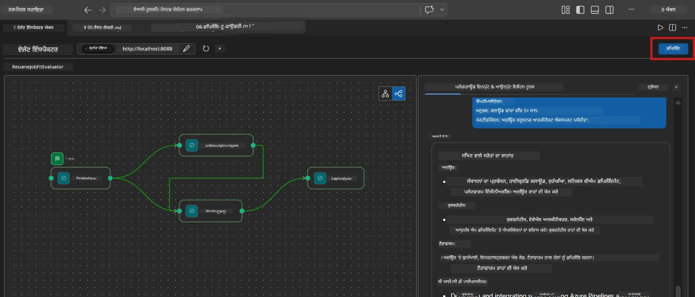
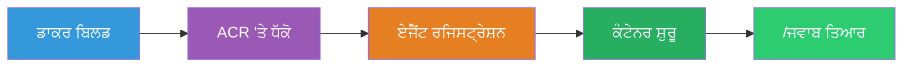
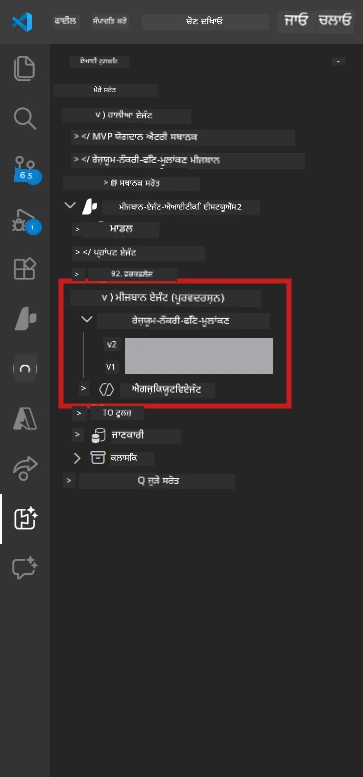

# Module 6 - Foundry Agent Service ਨੂੰ ਡਿਪਲੋਈ ਕਰੋ

ਇਸ ਮਾਡਿਊਲ ਵਿੱਚ, ਤੁਸੀਂ ਆਪਣੇ ਸਥਾਨਕ ਤੌਰ ਤੇ ਟੈਸਟ ਕੀਤੇ ਗਏ ਮਲਟੀ-ਏਜੰਟ ਵਰਕਫਲੋ ਨੂੰ [Microsoft Foundry](https://learn.microsoft.com/azure/foundry/agents/concepts/hosted-agents) ‘ਚ ਇੱਕ **Hosted Agent** ਵਜੋਂ ਡਿਪਲੋਈ ਕਰਦੇ ਹੋ। ਡਿਪਲੋਈਮੈਂਟ ਪ੍ਰਕਿਰਿਆ ਇੱਕ Docker ਕੰਟੇਨਰ ਇਮੇਜ ਬਣਾਉਂਦੀ ਹੈ, ਇਸਨੂੰ [Azure Container Registry (ACR)](https://learn.microsoft.com/azure/container-registry/container-registry-intro) ‘ਤੇ ਪੁਸ਼ ਕਰਦੀ ਹੈ, ਅਤੇ [Foundry Agent Service](https://learn.microsoft.com/azure/foundry/agents/how-to/publish-agent) ਵਿੱਚ ਇੱਕ hosted agent ਵਰਜ਼ਨ ਬਣਾਉਂਦੀ ਹੈ।

> **Lab 01 ਤੋਂ ਮੁੱਖ ਫਰਕ:** ਡਿਪਲੋਈਮੈਂਟ ਪ੍ਰਕਿਰਿਆ ਇੱਕੋ ਜਿਹੀ ਹੈ। Foundry ਤੁਹਾਡੇ ਮਲਟੀ-ਏਜੰਟ ਵਰਕਫਲੋ ਨੂੰ ਇੱਕ ਹੀ hosted agent ਵਜੋਂ ਵੇਖਦਾ ਹੈ - ਜਟਿਲਤਾ ਕੰਟੇਨਰ ਦੇ ਅੰਦਰ ਹੈ, ਪਰ ਡਿਪਲੋਈਮੈਂਟ ਸਤਹ ਇੱਕੋ `/responses` ਏਂਡਪੌਇੰਟ ਹੈ।

---

## ਪ੍ਰੀ-ਰਿਕੁਆਰਮੈਂਟ ਚੈੱਕ

ਡਿਪਲੋਈ ਕਰਨ ਤੋਂ ਪਹਿਲਾਂ, ਹੇਠਾਂ ਦਿੱਤੇ ਹਰ ਇਕ ਆਈਟਮ ਦੀ ਜਾਂਚ ਕਰ ਲਵੋ:

1. **ਏਜੰਟ ਸਥਾਨਕ ਸਮੋਕ ਟੈਸਟ ਪਾਸ ਕਰਦਾ ਹੈ:**
   - ਤੁਸੀਂ [Module 5](05-test-locally.md) ਵਿੱਚ ਸਾਰੇ 3 ਟੈਸਟ ਕੀਤੇ ਹਨ ਅਤੇ ਵਰਕਫਲੋ ਨੇ ਪੂਰਾ ਆਉਟਪੁੱਟ ਦਿੱਤਾ ਹੈ ਜਿਸ ਵਿੱਚ ਗੈਪ ਕਾਰਡ ਅਤੇ Microsoft Learn URL ਸ਼ਾਮਲ ਹਨ।

2. **ਤੁਹਾਡੇ ਕੋਲ [Azure AI User](https://learn.microsoft.com/azure/foundry/concepts/rbac-foundry) ਰੋਲ ਹੈ:**
   - [Lab 01, Module 2](../../lab01-single-agent/docs/02-create-foundry-project.md) ਵਿੱਚ ਸੌਂਪਿਆ ਗਿਆ। ਜਾਂਚ ਕਰੋ:
   - [Azure Portal](https://portal.azure.com) → ਤੁਹਾਡੀ Foundry **project** ਰਿਸੋਰਸ → **Access control (IAM)** → **Role assignments** → ਪੁਸ਼ਟੀ ਕਰੋ ਕਿ ਤੁਹਾਡੇ ਖਾਤੇ ਲਈ **[Azure AI User](https://aka.ms/foundry-ext-project-role)** ਲਿਸਟਡ ਹੈ।

3. **ਤੁਸੀਂ VS Code ਵਿੱਚ Azure ਵਿੱਚ ਸਾਈਨ ਇਨ ਹੋ:**
   - VS Code ਦੇ ਨਿ੍ਹਵੇਂ-ਖੱਬੇ ਕੌਣੇ ਵਿੱਚ ਖਾਤੇ ਦੇ ਆਈਕਨ ਦੀ ਜਾਂਚ ਕਰੋ। ਤੁਹਾਡਾ ਖਾਤਾ ਨਾਮ ਦਿਖਾਈ ਦੇਣਾ ਚਾਹੀਦਾ ਹੈ।

4. **`agent.yaml` ਵਿੱਚ ਸਹੀ ਮੁੱਲ ਹਨ:**
   - `PersonalCareerCopilot/agent.yaml` ਖੋਲ੍ਹੋ ਅਤੇ ਜਾਂਚੋ:
     ```yaml
     environment_variables:
       - name: PROJECT_ENDPOINT
         value: ${PROJECT_ENDPOINT}
       - name: MODEL_DEPLOYMENT_NAME
         value: ${MODEL_DEPLOYMENT_NAME}
     ```
   - ਇਹ ਉਹ env vars ਨਾਲ ਮੇਲ ਖਾਣੇ ਚਾਹੀਦੇ ਹਨ ਜਿਹੜੇ ਤੁਹਾਡਾ `main.py` ਪੜ੍ਹਦਾ ਹੈ।

5. **`requirements.txt` ਵਿੱਚ ਸਹੀ ਵਰਜ਼ਨ ਹਨ:**
   ```
   agent-framework-azure-ai==1.0.0rc3
   agent-framework-core==1.0.0rc3
   azure-ai-agentserver-agentframework==1.0.0b16
   azure-ai-agentserver-core==1.0.0b16
   debugpy
   agent-dev-cli --pre
   ```

---

## ਕਦਮ 1: ਡਿਪਲੋਈਮੈਂਟ ਸ਼ੁਰੂ ਕਰੋ

### ਵਿਕਲਪ A: Agent Inspector ਤੋਂ ਡਿਪਲੋਈ ਕਰੋ (ਸਿਫਾਰਸ਼ੀ)

ਜੇ ਏਜੰਟ F5 ਰਾਹੀਂ ਚੱਲ ਰਿਹਾ ਹੈ ਅਤੇ Agent Inspector ਖੁੱਲ੍ਹਾ ਹੈ:

1. Agent Inspector ਪੈਨਲ ਦੇ **ਸਿਖਰ-ਸੱਜੇ ਕੌਣੇ** ਨੂੰ ਵੇਖੋ।
2. **Deploy** ਬਟਨ ਤੇ ਕਲਿੱਕ ਕਰੋ (ਕਲਾਉਡ ਆਈਕਨ ਜਿਸ ਉੱਪਰ ਤੀਰ ↑ ਹੈ)।
3. ਡਿਪਲੋਈਮੈਂਟ ਵਿਜ਼ਾਰਡ ਖੁੱਲ੍ਹ ਜਾਵੇਗਾ।



### ਵਿਕਲਪ B: Command Palette ਤੋਂ ਡਿਪਲੋਈ ਕਰੋ

1. `Ctrl+Shift+P` ਦਬਾਕੇ **Command Palette** ਖੋਲ੍ਹੋ।
2. ਲਿਖੋ: **Microsoft Foundry: Deploy Hosted Agent** ਅਤੇ ਉਸਨੂੰ ਚੁਣੋ।
3. ਡਿਪਲੋਈਮੈਂਟ ਵਿਜ਼ਾਰਡ ਖੁੱਲ੍ਹ ਜਾਵੇਗਾ।

---

## ਕਦਮ 2: ਡਿਪਲੋਈਮੈਂਟ ਸੰਰਚਨਾ ਕਰੋ

### 2.1 ਲਕੜੀ ਪ੍ਰੋਜੈਕਟ ਚੁਣੋ

1. ਇੱਕ ਡ੍ਰੌਪਡਾਊਨ ਤੁਹਾਡੇ Foundry ਪ੍ਰੋਜੈਕਟ ਦਿਖਾਉਂਦਾ ਹੈ।
2. ਉਸ ਪ੍ਰੋਜੈਕਟ ਨੂੰ ਚੁਣੋ ਜੋ ਤੁਸੀਂ ਵਰਕਸ਼ਾਪ ਦੌਰਾਨ ਵਰਤਿਆ ਸੀ (ਜਿਵੇਂ `workshop-agents`)।

### 2.2 ਕੰਟੇਨਰ ਏਜੰਟ ਫਾਇਲ ਚੁਣੋ

1. ਤੁਹਾਡੇ ਕੋਲ ਏਜੰਟ ਦੀ ਐਂਟਰੀ ਪੁਆਇੰਟ ਚੁਣਨ ਲਈ ਕਿਹਾ ਜਾਵੇਗਾ।
2. `workshop/lab02-multi-agent/PersonalCareerCopilot/` ਵਿੱਚ ਜਾਓ ਅਤੇ **`main.py`** ਚੁਣੋ।

### 2.3 ਸਰੋਤ ਸੰਰਚਨਾ

| ਸੈਟਿੰਗ       | ਸਿਫਾਰਸ਼ੀ ਮੁੱਲ          | ਟਿੱਪਣੀਆਂ                                       |
|--------------|------------------------|-----------------------------------------------|
| **CPU**      | `0.25`                 | ਡਿਫਾਲਟ। ਮਲਟੀ-ਏਜੰਟ ਵਰਕਫਲੋਜ਼ ਨੂੰ ਵਧੇਰੇ CPU ਦੀ ਲੋੜ ਨਹੀਂ ਕਿਉਂਕਿ ਮਾਡਲ ਕਾਲ I/O-ਬਾਊਂਡ ਹੁੰਦੇ ਹਨ |
| **Memory**   | `0.5Gi`                | ਡਿਫਾਲਟ। ਵੱਡੇ ਡੇਟਾ ਪ੍ਰੋਸੈਸਿੰਗ ਟੂਲ ਸ਼ਾਮਲ ਕਰਨ 'ਤੇ `1Gi` ਕਰੋ |

---

## ਕਦਮ 3: ਪੁਸ਼ਟੀ ਕਰੋ ਅਤੇ ਡਿਪਲੋਈ ਕਰੋ

1. ਵਿਜ਼ਾਰਡ ਇੱਕ ਡਿਪਲੋਈਮੈਂਟ ਸਾਰਾਂਸ਼ ਦਿਖਾਉਂਦਾ ਹੈ।
2. ਸਮੀਖਿਆ ਕਰੋ ਅਤੇ **Confirm and Deploy** ‘ਤੇ ਕਲਿੱਕ ਕਰੋ।
3. VS Code ਵਿੱਚ ਪ੍ਰਗਤੀ ਨੂੰ ਵੇਖੋ।

### ਡਿਪਲੋਈਮੈਂਟ ਦੌਰਾਨ ਕੀ ਹੁੰਦਾ ਹੈ

VS Code ਦੇ **Output** ਪੈਨਲ ਨੂੰ ਵੇਖੋ (ਡ੍ਰੌਪਡਾਊਨ ਤੋਂ "Microsoft Foundry" ਚੁਣੋ):


1. **Docker build** - ਤੁਹਾਡੇ `Dockerfile` ਤੋਂ ਕੰਟੇਨਰ ਬਣਾਉਂਦਾ ਹੈ:
   ```
   Step 1/6 : FROM python:3.14-slim
   Step 2/6 : WORKDIR /app
   ...
   Successfully built abc123def456
   ```

2. **Docker push** - ਚਿੱਤਰ ਨੂੰ ACR ‘ਤੇ ਧੱਕਦਾ ਹੈ (ਪਹਿਲੀ ਵਾਰੀ ਡਿਪਲੋਈ ਤੇ 1-3 ਮਿੰਟ ਲਗਦੇ ਹਨ)।

3. **Agent registration** - Foundry `agent.yaml` ਮੇਟਾਡੇਟਾ ਨਾਲ ਇੱਕ hosted agent ਬਣਾਉਂਦਾ ਹੈ। ਏਜੰਟ ਦਾ ਨਾਮ `resume-job-fit-evaluator` ਹੈ।

4. **Container start** - ਕੰਟੇਨਰ Foundry ਦੀ ਪਰਬੰਧਿਤ ਢਾਂਚਾ ਵਿੱਚ ਸਿਸਟਮ-ਪ੍ਰਬੰਧਿਤ ਪਹਿਚਾਣੀ ਸਹਿਤ ਚੱਲਦਾ ਹੈ।

> **ਪਹਿਲੀ ਵਾਰੀ ਡਿਪਲੋਈਮੈਂਟ ਧੀਮਾ ਹੁੰਦਾ ਹੈ** (Docker ਸਾਰੇ ਪਰਤਾਂ ਨੂੰ ਧੱਕਦਾ ਹੈ)। ਬਾਅਦ ਵਾਲੀਆਂ ਡਿਪਲੋਈਮੈਂਟ ਕੈਸ਼ ਕੀਤੀਆਂ ਪਰਤਾਂ ਨੂੰ ਦੁਬਾਰਾ ਵਰਤਦੀਆਂ ਹਨ ਅਤੇ ਤੇਜ਼ ਹੁੰਦੀਆਂ ਹਨ।

### ਮਲਟੀ-ਏਜੰਟ ਖਾਸ ਟਿੱਪਣੀਆਂ

- **ਸਾਰੇ ਚਾਰ ਏਜੰਟ ਇੱਕ ਹੀ ਕੰਟੇਨਰ ਵਿੱਚ ਹਨ।** Foundry ਇੱਕ ਹੀ hosted agent ਦੇ ਤੌਰ ‘ਤੇ ਵੇਖਦਾ ਹੈ। WorkflowBuilder ਦਾ ਗਰਾਫ ਅੰਦਰੂਨੀ ਤੌਰ ਤੇ ਚੱਲਦਾ ਹੈ।
- **MCP ਕਾਲ ਆਊਟਬਾਊਂਡ ਹੁੰਦੇ ਹਨ।** ਕੰਟੇਨਰ ਨੂੰ ਇੰਟਰਨੈੱਟ ਐਕਸੈਸ ਦੀ ਲੋੜ ਹੈ `https://learn.microsoft.com/api/mcp` ਤੱਕ ਪਹੁੰਚਣ ਲਈ। Foundry ਦਾ ਪਰਬੰਧਿਤ ਢਾਂਚਾ ਇਹ ਸਵੈਚਾਲਿਤ ਤੌਰ ਤੇ ਮੁਹੱਈਆ ਕਰਵਾਉਂਦਾ ਹੈ।
- **[Managed Identity](https://learn.microsoft.com/python/api/overview/azure/identity-readme#managed-identity-support).** ਹੋਸਟਡ ਵਾਤਾਵਰਣ ਵਿੱਚ, `main.py` ਵਿਚ `get_credential()` `ManagedIdentityCredential()` ਵਾਪਸ ਕਰਦਾ ਹੈ (ਕਿਉਂਕਿ `MSI_ENDPOINT` ਸੈੱਟ ਹੈ)। ਇਹ ਸਵੈਚਾਲਿਤ ਹੈ।

---

## ਕਦਮ 4: ਡਿਪਲੋਈਮੈਂਟ ਸਥਿਤੀ ਦੀ ਜਾਂਚ ਕਰੋ

1. **Microsoft Foundry** ਸਾਈਡਬਾਰ ਖੋਲ੍ਹੋ (ਕਿਰਿਆ ਪੱਟੀ ਵਿੱਚ Foundry ਆਈਕਨ ਤੇ ਕਲਿੱਕ ਕਰੋ)।
2. ਆਪਣੀ ਪ੍ਰੋਜੈਕਟ ਹੇਠਾਂ **Hosted Agents (Preview)** ਖੋਲ੍ਹੋ।
3. **resume-job-fit-evaluator** (ਜਾਂ ਤੁਹਾਡੇ ਏਜੰਟ ਨਾਮ) ਨੂੰ ਲੱਭੋ।
4. ਏਜੰਟ ਨਾਮ ਤੇ ਕਲਿੱਕ ਕਰੋ → ਵਰਜ਼ਨਾਂ ਨੂੰ ਖੋਲ੍ਹੋ (ਜਿਵੇਂ `v1`)।
5. ਵਰਜ਼ਨ ਤੇ ਕਲਿੱਕ ਕਰੋ → **Container Details** → **Status** ਚੈੱਕ ਕਰੋ:



| ਸਥਿਤੀ      | ਮਤਲਬ                        |
|-------------|-----------------------------|
| **Started** / **Running** | ਕੰਟੇਨਰ ਚੱਲ ਰਿਹਾ ਹੈ, ਏਜੰਟ ਤਿਆਰ ਹੈ             |
| **Pending** | ਕੰਟੇਨਰ ਸ਼ੁਰੂ ਹੋ ਰਿਹਾ ਹੈ (30-60 ਸਕਿੰਟ ਇੰਤਜ਼ਾਰ ਕਰੋ)  |
| **Failed**  | ਕੰਟੇਨਰ ਸ਼ੁਰੂ ਹੋਣ ਵਿੱਚ ਅਸਫਲ (ਲੌਗ ਵੇਖੋ - ਹੇਠਾਂ ਦੇਖੋ) |

> **ਮਲਟੀ-ਏਜੰਟ ਸ਼ੁਰੂਆਤ ਸਿੰਗਲ ਏਜੰਟ ਨਾਲੋਂ ਲੰਮੀ ਲੱਗਦੀ ਹੈ** ਕਿਉਂਕਿ ਕੰਟੇਨਰ ਸ਼ੁਰੂਆਤ ਵਿੱਚ 4 ਏਜੰਟ ਇਨਸਟੈਂਸ ਬਣਾਉਂਦਾ ਹੈ। "Pending" 2 ਮਿੰਟ ਤੱਕ ਆਮ ਗੱਲ ਹੈ।

---

## ਆਮ ਡਿਪਲੋਈਮੈਂਟ ਗਲਤੀਆਂ ਅਤੇ ਠੀਕ ਕਰਨ ਦੇ ਤਰੀਕੇ

### ਗਲਤੀ 1: ਪਰਮਿਸ਼ਨ ਡਿਨਾਈਡ - `agents/write`

```
Error: lacks the required data action 
Microsoft.CognitiveServices/accounts/AIServices/agents/write
```

**ਠੀਕ ਕਰੋ:** ਪ੍ਰੋਜੈਕਟ ਪੱਧਰ ਤੇ **[Azure AI User](https://learn.microsoft.com/azure/foundry/concepts/rbac-foundry)** ਰੋਲ ਦਿਓ। ਕਦਮ-ਦਰ-ਕਦਮ ਹਦਾਇਤਾਂ ਲਈ [Module 8 - Troubleshooting](08-troubleshooting.md) ਵੇਖੋ।

### ਗਲਤੀ 2: Docker ਚੱਲ ਨਹੀਂ ਰਿਹਾ

```
Error: Docker build failed / Cannot connect to Docker daemon
```

**ਠੀਕ ਕਰੋ:**
1. Docker Desktop ਚਲਾਓ।
2. "Docker Desktop is running" ਆਉਣ ਦੀ ਉਡੀਕ ਕਰੋ।
3. ਜਾਂਚ ਕਰੋ: `docker info`
4. **Windows:** Docker Desktop ਸੈੱਟਿੰਗ ਵਿੱਚ WSL 2 ਬੈਕਐਂਡ ਚਾਲੂ ਕਰੋ।
5. ਦੁਬਾਰਾ ਕੋਸ਼ਿਸ਼ ਕਰੋ।

### ਗਲਤੀ 3: Docker build ਦੌਰਾਨ pip install ਫੇਲ

```
Error: Could not find a version that satisfies the requirement agent-dev-cli
```

**ਠੀਕ ਕਰੋ:** Docker ਵਿੱਚ `requirements.txt` ਦਾ `--pre` ਫਲੈਗ ਵੱਖਰੇ ਢੰਗ ਨਾਲ ਹੈਂਡਲ ਹੁੰਦਾ ਹੈ। ਯਕੀਨੀ ਬਣਾਓ ਕਿ ਤੁਹਾਡੇ `requirements.txt` ਵਿੱਚ:
```
agent-dev-cli --pre
```

ਜੇ Docker ਫੇਲ ਹੁੰਦਾ ਰਹੇ, ਤਾਂ ਇੱਕ `pip.conf` ਬਣਾਓ ਜਾਂ `--pre` ਨੂੰ ਬਿਲਡ ਆਰਗੂਮੈਂਟ ਵਜੋਂ ਪਾਸ ਕਰੋ। ਵੇਰਵਾ ਲਈ [Module 8](08-troubleshooting.md) ਵੇਖੋ।

### ਗਲਤੀ 4: MCP ਟੂਲ hosted agent ਵਿੱਚ ਫੇਲ

ਜੇ ਡਿਪਲੋਈਮੈਂਟ ਤੋਂ ਬਾਅਦ Gap Analyzer Microsoft Learn URLs ਬਣਾ ਪਾਉਂਦਾ ਨਾ ਰਹੇ:

**ਮੂਲ ਕਾਰਨ:** ਕੰਟੇਨਰ ਤੋਂ ਬਾਹਰ HTTPS ਬਲਾਕ ਹੋ ਰਿਹਾ ਹੋ ਸਕਦਾ ਹੈ।

**ਠੀਕ ਕਰੋ:**
1. ਆਮ ਤੌਰ ‘ਤੇ ਇਹ Foundry ਦੀ ਡਿਫਾਲਟ ਸੰਰਚਨਾ ਵਿੱਚ ਸਮੱਸਿਆ ਨਹੀਂ ਹੁੰਦੀ।
2. ਜੇ ਇਹ ਹੁੰਦਾ ਹੈ, ਤਾਂ ਵੇਖੋ ਕਿ Foundry ਪ੍ਰੋਜੈਕਟ ਦਾ ਵਰਚੁਅਲ ਨੈੱਟਵਰਕ ਕੋਈ NSG ਹੈ ਜੋ ਆਊਟਬਾਊਂਡ HTTPS ਬਲਾਕ ਕਰਦਾ ਹੈ।
3. MCP ਟੂਲ ਵਿੱਚ ਬਿਲਟ-ਇਨ ਫ਼ਾਲਬੈਕ URLs ਹੁੰਦੇ ਹਨ, ਇਸ ਲਈ ਏਜੰਟ ਫਿਰ ਵੀ ਆਉਟਪੁੱਟ ਦੇਵੇਗਾ (ਜਿਥੇ ਲਾਈਵ URLs ਨਹੀਂ ਹੋਣਗੇ)।

---

### ਚੈਕਪੌਇੰਟ

- [ ] ਡਿਪਲੋਈਮੈਂਟ ਕਮਾਂਡ VS Code ਵਿੱਚ ਬਿਨਾਂ ਗਲਤੀਆਂ ਦੇ ਪੂਰੀ ਹੋਈ
- [ ] ਏਜੰਟ Foundry ਸਾਈਡਬਾਰ ਵਿੱਚ **Hosted Agents (Preview)** ਹੇਠਾਂ ਦਿਖਾਈ ਦੇ ਰਿਹਾ ਹੈ
- [ ] ਏਜੰਟ ਨਾਮ `resume-job-fit-evaluator` (ਜਾਂ ਤੁਹਾਡੇ ਚੁਣੇ ਹੋਏ ਨਾਮ) ਹੈ
- [ ] ਕੰਟੇਨਰ ਸਥਿਤੀ **Started** ਜਾਂ **Running** ਦਿਖਾ ਰਹੀ ਹੈ
- [ ] (ਜੇ ਗਲਤੀਆਂ) ਤੁਸੀਂ ਗਲਤੀ ਪਛਾਣੀ, ਠੀਕ ਕੀਤੀ, ਅਤੇ ਸਫਲਤਾਪੂਰਵਕ ਦੁਬਾਰਾ ਡਿਪਲੋਈ ਕੀਤਾ

---

**ਪਿਛਲਾ:** [05 - Test Locally](05-test-locally.md) · **ਅਗਲਾ:** [07 - Verify in Playground →](07-verify-in-playground.md)

---

<!-- CO-OP TRANSLATOR DISCLAIMER START -->
**ਅਸਵੀਕਾਰੋਤਾ**:  
ਇਹ ਦਸਤਾਵੇਜ਼ AI ਅਨੁਵਾਦ ਸੇਵਾ [Co-op Translator](https://github.com/Azure/co-op-translator) ਦੀ ਵਰਤੋਂ ਕਰਕੇ ਅਨੁਵਾਦ ਕੀਤਾ ਗਿਆ ਹੈ। ਜਦੋਂ ਕਿ ਅਸੀਂ ਸਹੀਅਤ ਲਈ ਯਤਨ ਕਰਦੇ ਹਾਂ, ਕਿਰਪਾ ਕਰਕੇ ਧਿਆਨ ਰੱਖੋ ਕਿ ਸਵੈਚਲਿਤ ਅਨੁਵਾਦਾਂ ਵਿੱਚ ਤਰੁੱਟੀਆਂ ਜਾਂ ਅਸੁਚਿਤਤਾ ਹੋ ਸਕਦੀ ਹੈ। ਮੂਲ ਦਸਤਾਵੇਜ਼ ਇਸ ਦੀ ਮੂਲ ਭਾਸ਼ਾ ਵਿੱਚ ਸਰੋਤ ਦੇ ਤੌਰ 'ਤੇ ਧਿਆਨ ਵਿੱਚ ਰੱਖਣਾ ਚਾਹੀਦਾ ਹੈ। ਮਹੱਤਵਪੂਰਨ ਜਾਣਕਾਰੀ ਲਈ, ਵਿਸ਼ਵਾਸਯੋਗ ਮਨੁੱਖੀ ਅਨੁਵਾਦ ਦੀ ਸਿਫਾਰਸ਼ ਕੀਤੀ ਜਾਂਦੀ ਹੈ। ਅਸੀਂ ਇਸ ਅਨੁਵਾਦ ਦੀ ਵਰਤੋਂ ਤੋਂ ਪੈਦਾ ਹੋਣ ਵਾਲੀਆਂ ਕਿਸੇ ਵੀ ਗਲਤਫ਼ਹਿਮੀਆਂ ਜਾਂ ਭੁੱਲ-ਵਿਆਖਿਆਵਾਂ ਲਈ ਜ਼ਿੰਮੇਵਾਰ ਨਹੀਂ ਹਾਂ।
<!-- CO-OP TRANSLATOR DISCLAIMER END -->