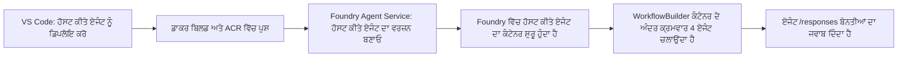
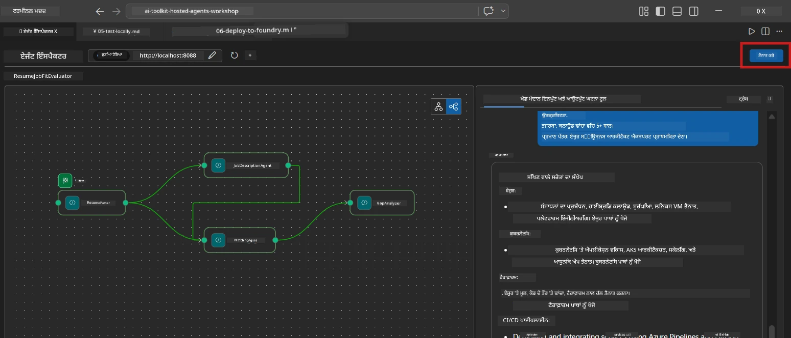

# ਮੌਡਿਊਲ 6 - ਫਾਉਂਡਰੀ ਏਜੰਟ ਸਰਵਿਸ ‘ਚ ਡਿਪਲੋয়

⏱️ ~10 ਮਿੰਟ

ਇਸ ਮੌਡਿਊਲ ਵਿੱਚ, ਤੁਸੀਂ ਆਪਣੀ ਸਥਾਨਕ ਤੌਰ ‘ਤੇ ਟੈਸਟ ਕੀਤੀ ਗਈ ਮਲਟੀ-ਏਜੰਟ ਵਰਕਫਲੋ ਨੂੰ [Microsoft Foundry](https://learn.microsoft.com/azure/foundry/agents/concepts/hosted-agents) ‘ਚ **ਹੋਸਟ ਕੀਤੇ ਈਜੰਟ** ਵਜੋਂ ਡਿਪਲੋਅ ਕਰਦੇ ਹੋ। ਡਿਪਲੋਯਮੈਂਟ ਪ੍ਰਕਿਰਿਆ Docker ਕੰਟੇਨਰ ਇਮੇਜ ਬਣਾਂਦੀ ਹੈ, ਉਸਨੂੰ [Azure Container Registry (ACR)](https://learn.microsoft.com/azure/container-registry/container-registry-intro) ‘ਚ ਧੱਕਦੀ ਹੈ, ਅਤੇ [Foundry Agent Service](https://learn.microsoft.com/azure/foundry/agents/how-to/publish-agent) ਵਿੱਚ ਇੱਕ ਹੋਸਟ ਕੀਤੀ ਗਈ ਏਜੰਟ ਵਰਜਨ ਬਣਾਉਂਦੀ ਹੈ।

> **ਲੈਬ 01 ਤੋਂ ਮੁੱਖ ਫਰਕ:** ਡਿਪਲੋਯਮੈਂਟ ਪ੍ਰਕਿਰਿਆ ਇਕੋ ਜਾਣੀ ਜਾਂਦੀ ਹੈ। ਫਾਉਂਡਰੀ ਤੁਹਾਡੇ ਮਲਟੀ-ਏਜੰਟ ਵਰਕਫਲੋ ਨੂੰ ਇੱਕਲੋਟੇ ਹੋਸਟ ਕੀਤੇ ਏਜੰਟ ਵੱਜੋਂ ਵੇਖਦਾ ਹੈ - ਜਟਿਲਤਾ ਕੰਟੇਨਰ ਦੇ ਅੰਦਰ ਹੁੰਦੀ ਹੈ, ਪਰ ਡਿਪਲੋਯਮੈਂਟ ਸਤਹ ਇੱਕੋ `/responses` ਐਂਡਪੋਇੰਟ ਹੁੰਦਾ ਹੈ।

### ਡਿਪਲੋਯਮੈਂਟ ਪਾਈਪਲਾਈਨ


```mermaid
flowchart LR
    A[VS Code: ਹੋਸਟ ਕੀਤੇ ਏਜੰਟ ਨੂੰ ਡਿਪਲੋਇ ਕਰੋ] --> B[ਡਾਕਰ ਬਿਲਡ ਅਤੇ ACR ਵਿੱਚ ਪੁਸ਼]
    B --> C[Foundry Agent Service: ਹੋਸਟ ਕੀਤੇ ਏਜੰਟ ਦਾ ਵਰਜ਼ਨ ਬਣਾਓ]
    C --> D[Foundry ਵਿੱਚ ਹੋਸਟ ਕੀਤੇ ਏਜੰਟ ਦਾ ਕੰਟੇਨਰ ਸ਼ੁਰੂ ਹੁੰਦਾ ਹੈ]
    D --> E[WorkflowBuilder ਕੰਟੇਨਰ ਦੇ ਅੰਦਰ ਕ੍ਰਮਵਾਰ 4 ਏਜੰਟ ਚਲਾਉਂਦਾ ਹੈ]
    E --> F[ਏਜੰਟ /responses ਬੇਨਤੀਆਂ ਦਾ ਜਵਾਬ ਦਿੰਦਾ ਹੈ]
```

---

## ਜ਼ਰੂਰੀਆਂ ਦੀ ਜਾਂਚ

ਡਿਪਲੋਅ ਕਰਨ ਤੋਂ ਪਹਿਲਾਂ ਹੇਠਾਂ ਦਿੱਤੇ ਹਰ ਇਕ ਆਈਟਮ ਦੀ ਜਾਂਚ ਕਰੋ:

1. **ਏਜੰਟ ਸਥਾਨਕ ਸਮੋਕ ਟੈਸਟ ਪਾਸ ਕਰਦਾ ਹੈ:**
   - ਤੁਸੀਂ [ਮੌਡਿਊਲ 5](05-test-locally.md) ਵਿੱਚ 3 ਟੈਸਟ ਪੂਰੇ ਕੀਤੇ ਹਨ ਅਤੇ ਵਰਕਫਲੋ ਨੇ ਗੈਪ ਕਾਰਡ ਅਤੇ Microsoft Learn URLs ਨਾਲ ਪੂਰਾ ਨਤੀਜਾ ਦਿੱਤਾ ਹੈ।

2. **ਤੁਹਾਡੇ ਕੋਲ [Foundry User](https://learn.microsoft.com/azure/foundry/concepts/rbac-foundry) ਰੋਲ ਹੈ** (ਡਿਪਲੋਅ ਲਈ ਕਮ ਤੋਂ ਕਮ ਤੁਹਾਨੂੰ ਪ੍ਰੋਜੈਕਟ ਸਪੇਕ ਵਿੱਚ **Foundry Project Manager** ਚਾਹੀਦਾ ਹੈ):

   > **ਨੋਟ:** Foundry RBAC ਰੋਲਾਂ ਦੇ ਨਾਮ ਹਾਲ ਹੀ ਵਿੱਚ ਬਦਲੇ ਗਏ ਹਨ - **Foundry User**, **Foundry Owner**, ਅਤੇ **Foundry Project Manager** ਪਹਿਲਾਂ Azure AI User, Azure AI Owner, ਅਤੇ Azure AI Project Manager ਦੇ ਨਾਮ ਨਾਲ ਜਾਣੇ ਜਾਂਦੇ ਸਨ। ਰੋਲ ਆਈਡੀ ਅਤੇ ਅਧਿਕਾਰ ਬਦਲੇ ਨਹੀਂ ਗਏ।

   - [Azure Portal](https://portal.azure.com) ਵਿੱਚ ਆਪਣੇ Foundry **ਪ੍ਰੋਜੈਕਟ** ਰਿਸੋਰਸ → **Access control (IAM)** → **Role assignments** → ਆਪਣੇ ਅਕਾਊਂਟ ਲਈ **Foundry User** (ਜਾਂ ਉੱਚਾ) ਮੌਜੂਦ ਹੋਣ ਦੀ ਪੁਸ਼ਟੀ ਕਰੋ।

3. **ਤੁਸੀਂ VS Code ਵਿੱਚ Azure ਵਿਚ ਸਾਈਨ ਇਨ ਹੋ ਚੁੱਕੇ ਹੋ:**
   - VS Code ਦੇ ਤਲੇ-ਖੱਬੇ ਖੰਡ ਵਿੱਚ Accounts ਆਈਕਨ ਵੇਖੋ। ਤੁਹਾਡੇ ਅਕਾਊਂਟ ਦਾ ਨਾਮ ਦਿਸਣਾ ਚਾਹੀਦਾ ਹੈ।

4. **`agent.yaml` ਵਿੱਚ ਸਹੀ ਮੁੱਲ ਹਨ:**
   - `PersonalCareerCopilot/agent.yaml` ਖੋਲ੍ਹੋ ਅਤੇ ਜਾਂਚੋ:
     ```yaml
     environment_variables:
       - name: AZURE_AI_MODEL_DEPLOYMENT_NAME
         value: ${AZURE_AI_MODEL_DEPLOYMENT_NAME}
     ```
   - `FOUNDRY_PROJECT_ENDPOINT` ਇੱਥੇ **ਲਿਖਿਆ ਨਹੀਂ** ਹੋਣਾ ਚਾਹੀਦਾ - Foundry ਇਹ ਰੰਟਾਈਮ ’ਤੇ.Inject ਕਰਦਾ ਹੈ। ਸਿਰਫ `AZURE_AI_MODEL_DEPLOYMENT_NAME` ਦਾ ਘੋਸ਼ਣਾ ਲਾਜ਼ਮੀ ਹੈ।

5. **`requirements.txt` ਵਿੱਚ ਸਹੀ ਵਰਜ਼ਨ ਹਨ:**
   ```
   agent-framework-foundry
   agent-framework-foundry-hosting
   mcp<2,>=1.24.0
   debugpy
   ```

---

## ਕਦਮ 1: ਡਿਪਲੋਯਮੈਂਟ ਸ਼ੁਰੂ ਕਰੋ

### ਵਿਕਲਪ A: ਏਜੰਟ ਇੰਸਪੈਕਟਰ ਤੋਂ ਡਿਪਲੋਅ ਕਰੋ (ਸਿਫਾਰਸ਼ੀ)

ਜੇ ਏਜੰਟ F5 ਨਾਲ ਚੱਲ ਰਿਹਾ ਹੈ ਅਤੇ ਏਜੰਟ ਇੰਸਪੈਕਟਰ ਖੁੱਲਾ ਹੈ:

1. ਏਜੰਟ ਇੰਸਪੈਕਟਰ ਪੈਨਲ ਦੇ **ਸਭ ਤੋਂ ਉੱਪਰ-ਸੱਜੇ ਕੋਨੇ** ‘ਤੇ ਦੇਖੋ।
2. **Deploy** ਬਟਨ (ਕਲਾਊਡ ਆਈਕਨ ਜਿਸ ਵਿੱਚ ਉਪਰ ਤੀਰ ↑) ‘ਤੇ ਕਲਿੱਕ ਕਰੋ।
3. ਡਿਪਲੋਯਮੈਂਟ ਵਿਜ਼ਾਰਡ ਖੁਲ ਜਾਵੇਗਾ।



### ਵਿਕਲਪ B: ਕਮਾਂਡ ਪੈਲੇਟ ਤੋਂ ਡਿਪਲੋਅ ਕਰੋ

1. `Ctrl+Shift+P` ਦਬਾ ਕੇ **Command Palette** ਖੋਲ੍ਹੋ।
2. ਲਿਖੋ: **Foundry Toolkit: Deploy Hosted Agent** ਅਤੇ ਚੁਣੋ।
3. ਡਿਪਲੋਯਮੈਂਟ ਵਿਜ਼ਾਰਡ ਖੁਲ ਜਾਵੇਗਾ।

---

## ਕਦਮ 2: ਡਿਪਲੋਯਮੈਂਟ ਸੰਰਚਨਾ ਕਰੋ

### 2.1 ਲਕੜੀ ਪ੍ਰੋਜੈਕਟ ਚੁਣੋ

1. ਇੱਕ ਡ੍ਰੌਪਡਾਊਨ ਤੁਹਾਡੇ Foundry ਪ੍ਰੋਜੈਕਟ ਦਿਖਾਵੇਗਾ।
2. ਉਹ ਪ੍ਰੋਜੈਕਟ ਚੁਣੋ ਜੋ ਤੁਸੀਂ ਵਰਕਸ਼ਾਪ ਦੌਰਾਨ ਵਰਤਿਆ (ਉਦਾਹਰਣ ਲਈ, `workshop-agents`)।

### 2.2 ਕੰਟੇਨਰ ਏਜੰਟ ਫਾਈਲ ਚੁਣੋ

1. ਤੁਹਾਨੂੰ ਏਜੰਟ ਏਂਟਰੀ ਪੁਆਇੰਟ ਚੁਣਣ ਲਈ ਕਿਹਾ ਜਾਵੇਗਾ।
2. `workshop/lab02-multi-agent/PersonalCareerCopilot/` ਵਿੱਚ ਜਾਓ ਅਤੇ **`main.py`** ਚੁਣੋ।

### 2.3 ਸਰੋਤ ਸਾਧਨਾਂ ਦੀ ਸੰਰਚਨਾ ਕਰੋ

| ਸੈਟਿੰਗ | ਸਿਫਾਰਸ਼ੀ ਮੁੱਲ | ਟਿੱਪਣੀਆਂ |
|---------|------------------|-------|
| **ਡਿਪਲੋਯਮੈਂਟ ਵਿਧੀ** | **ਕੰਟੇਨਰ** (ਸਿਫਾਰਸ਼ੀ) ਜਾਂ **ਕੋਡ** | ਕੰਟੇਨਰ Docker ਇਮੇਜ ਬਣਾਉਂਦਾ ਹੈ; ਕੋਡ ਸਰੋਤ ਨੂੰ ZIP ਵਜੋਂ ਅੱਪਲੋਡ ਕਰਦਾ ਹੈ (ਪ੍ਰੀਵਿਊ) |
| **ਕੰਟੇਨਰ ਰਜਿਸਟਰੀ** | **ਡਿਫਾਲਟ ACR** | ਫਾਉਂਡਰੀ ਤੁਹਾਡੇ ਲਈ ਇਕ ਬਣਾਉਂਦਾ ਅਤੇ ਸੰਭਾਲਦਾ ਹੈ |
| **CPU** | `0.25` | ਡਿਫਾਲਟ। ਮਲਟੀ-ਏਜੰਟ ਵਰਕਫਲੋਜ਼ ਨੂੰ ਵੱਧ CPU ਦੀ ਲੋੜ ਨਹੀਂ ਕਿਉਂਕਿ ਮਾਡਲ ਕਾਲ I/O-ਬਾਊਂਡ ਹੁੰਦੇ ਹਨ |
| **ਮੈਮੋਰੀ** | `0.5Gi` | ਡਿਫਾਲਟ। ਵੱਡੇ ਡੇਟਾ ਪ੍ਰੋਸੈਸਿੰਗ ਟੂਲ ਸ਼ਾਮਲ ਕਰਨ ‘ਤੇ `1Gi` ਤੱਕ ਵਧਾਓ |

---

## ਕਦਮ 3: ਪੁਸ਼ਟੀ ਕਰੋ ਅਤੇ ਡਿਪਲੋਅ ਕਰੋ

1. ਵਿਜ਼ਾਰਡ ਡਿਪਲੋਯਮੈਂਟ ਸਾਰ ਸਿਖਾਉਂਦਾ ਹੈ।
2. ਸਮੀਖਿਆ ਕਰੋ ਅਤੇ **Confirm and Deploy** ‘ਤੇ ਕਲਿੱਕ ਕਰੋ।
3. VS Code ਵਿੱਚ ਪ੍ਰਗਤੀ ਨੂੰ ਵੇਖੋ।

### ਡਿਪਲੋਜ਼ਮੈਂਟ ਦੌਰਾਨ ਕੀ ਹੁੰਦਾ ਹੈ

VS Code **Output** ਪੈਨਲ ਦੇਖੋ (“Microsoft Foundry” ਡ੍ਰਾਪਡਾਊਨ ਚੁਣੋ):

1. **Docker build** - ਤੁਹਾਡੇ `Dockerfile` ਤੋਂ ਕੰਟੇਨਰ ਬਣਾਉਂਦਾ ਹੈ
   ```
   Step 1/6 : FROM python:3.12-slim
   Step 2/6 : WORKDIR /app
   ...
   Successfully built abc123def456
   ```

2. **Docker push** - ਇਮੇਜ ਨੂੰ ACR ‘ਤੇ ਧੱਕਦਾ ਹੈ (ਪਹਿਲੀ ਵਾਰੀ 1-3 ਮਿੰਟ ਲੱਗਦੇ ਹਨ)।

3. **ਏਜੰਟ ਰਜਿਸਟਰੇਸ਼ਨ** - Foundry `agent.yaml` ਮੈਟਾਡੇਟਾ ਨਾਲ ਇੱਕ ਹੋਸਟ ਕੀਤਾ ਏਜੰਟ ਬਣਾਉਂਦਾ ਹੈ। ਏਜੰਟ ਦਾ ਨਾਮ `resume-job-fit-evaluator` ਹੈ।

4. **ਕੰਟੇਨਰ ਸ਼ੁਰੂ** - ਫਾਉਂਡਰੀ ਦੀ ਪ੍ਰਬੰਧਿਤ ਢਾਂਚਾ ਵਿੱਚ ਕੰਟੇਨਰ ਸਿਸਟਮ-ਮੈਨੇਜਡ ਆਈਡੈਂਟੀਟੀ ਨਾਲ ਸ਼ੁਰੂ ਹੁੰਦਾ ਹੈ।

> **ਪਹਿਲਾ ਡਿਪਲੋਯਮੈਂਟ ਹੌਲੀ ਹੁੰਦਾ ਹੈ** (Docker ਸਾਰੇ ਲੇਅਰ ਧੱਕਦਾ ਹੈ)। ਅਗਲੇ ਡਿਪਲੋਯਮੈਂਟ ਕੈਸ਼ ਕੀਤੇ ਲੇਅਰ ਵਰਤਦੇ ਹਨ ਅਤੇ ਤੇਜ਼ੀ ਨਾਲ ਹੁੰਦੇ ਹਨ।

### ਮਲਟੀ-ਏਜੰਟ ਖਾਸ ਟਿੱਪਣੀਆਂ

- **ਸਾਰੇ ਚਾਰ ਏਜੰਟ ਇੱਕ ਕੰਟੇਨਰ ਵਿੱਚ ਹਨ।** ਫਾਉਂਡਰੀ ਇੱਕੋ ਹੋਸਟ ਕੀਤੇ ਏਜੰਟ ਨੂੰ ਵੇਖਦਾ ਹੈ। WorkflowBuilder ਗਰਾਫ ਅੰਦਰੂਨੀ ਤੌਰ ਤੇ ਚਲਦਾ ਹੈ।
- **MCP ਕਾਲ ਬਾਹਰ ਜਾਂਦੀਆਂ ਹਨ।** ਕੰਟੇਨਰ ਨੂੰ ਇੰਟਰਨੈਟ ਐਕਸੈਸ ਚਾਹੀਦਾ ਹੈ, ਤਾਂ ਕਿ `https://learn.microsoft.com/api/mcp` ਤੱਕ ਪਹੁੰਚ ਸਕੇ। ਫਾਉਂਡਰੀ ਦਾ ਪ੍ਰਬੰਧਿਤ ਢਾਂਚਾ ਇਸ ਨੂੰ ਸਧਾਰਨ ਤੌਰ ਤੇ ਮੁਹੱਈਆ ਕਰਵਾਉਂਦਾ ਹੈ।
- **[ਪਰਬੰਧਿਤ ਆਈਡੈਂਟੀਟੀ](https://learn.microsoft.com/azure/foundry/agents/concepts/agent-identity).** ਡਿਪਲੋਅ ਸਮੇਂ ਹਰੇਕ ਹੋਸਟ ਕੀਤੇ ਏਜੰਟ ਲਈ ਫਾਉਂਡਰੀ ਆਪੋ آپ ਇੱਕ **ਨਿਰਧਾਰਿਤ ਪ੍ਰਤੀ ਏਜੰਟ Entra ਆਈਡੈਂਟੀਟੀ** ਬਣਾਂਦਾ ਹੈ। ਹੋਸਟ ਕੀਤੇ ਮਾਹੌਲ ਵਿੱਚ, `DefaultAzureCredential` ਆਪਣੇ ਆਪ ਇਸ ਏਜੰਟ ਆਈਡੈਂਟੀਟੀ ਨਾਲ ਹੱਲ ਹੁੰਦਾ ਹੈ - ਕਿਸੇ ਵੀ ਮੈਨੂਅਲ ਪ੍ਰਬੰਧਿਤ ਆਈਡੈਂਟੀਟੀ ਸੰਰਚਨਾ ਦੀ ਲੋੜ ਨਹੀਂ।

---

## ਕਦਮ 4: ਡਿਪਲੋਯਮੈਂਟ ਸਥਿਤੀ ਦੀ ਜਾਂਚ ਕਰੋ

1. **Microsoft Foundry** ਸਾਈਡਬਾਰ ਖੋਲ੍ਹੋ (ਐਕਟਿਵਿਟੀ ਬਾਰ ਵਿੱਚ Foundry ਆਈਕਨ ‘ਤੇ ਕਲਿੱਕ ਕਰੋ)।
2. ਆਪਣੇ ਪ੍ਰੋਜੈਕਟ ਹੇਠਾਂ **Hosted Agents (Preview)** ਖੋਲ੍ਹੋ।
3. **resume-job-fit-evaluator** (ਜਾਂ ਤੁਹਾਡੇ ਏਜੰਟ ਦਾ ਨਾਮ) ਲੱਭੋ।
4. ਏਜੰਟ ਦੇ ਨਾਮ ‘ਤੇ ਕਲਿੱਕ ਕਰੋ → ਵਰਜਨ ਖੋਲ੍ਹੋ (ਉਦਾਹਰਨ ਲਈ, `v1`)।
5. ਵਰਜਨ ‘ਤੇ ਕਲਿੱਕ ਕਰੋ → **Container Details** → **Status** ਚੈਕ ਕਰੋ:


| ਸਥਿਤੀ | ਮਤਲਬ |
|--------|---------|
| **active** | ਏਜੰਟ ਚੱਲ ਰਿਹਾ ਹੈ ਅਤੇ ਬੇਨਤੀ ਸਵੀਕਾਰ ਕਰਨ ਲਈ ਤਿਆਰ ਹੈ |
| **creating** | ਕੰਟੇਨਰ ਸ਼ੁਰੂ ਹੋ ਰਿਹਾ ਹੈ (30–60 ਸਕਿੰਟ ਉਡੀਕ ਕਰੋ) |
| **failed** | ਕੰਟੇਨਰ ਸ਼ੁਰੂ ਕਰਨ ਵਿੱਚ ਅਸਫਲ (ਲਾਗ ਚੈੱਕ ਕਰੋ - ਹੇਠਾਂ ਵੇਖੋ) |

> **ਨੋਟ:** VS Code ਸਾਈਡਬਾਰ "Running" ਜਾਂ "Started" ਵਰਗੇ ਲੇਬਲ ਦਿਖਾ ਸਕਦਾ ਹੈ ਜਦ ਕਿ ਅਧਾਰਭੂਤ API ਸਥਿਤੀ `active`/`creating` ਹੈ। ਇਹ ਦੋਹਾਂ ਐਕਸਪ੍ਰੈਸ਼ਨ ਇੱਕੋ ਹਾਲਤ ਦਰਸਾਉਂਦੇ ਹਨ।

> **ਮਲਟੀ-ਏਜੰਟ ਸ਼ੁਰੂਆਤ ਇਕ-ਏਜੰਟ ਨਾਲੋਂ ਜ਼ਿਆਦਾ ਸਮਾਂ ਲੈਂਦੀ ਹੈ** ਕਿਉਂਕਿ ਕੰਟੇਨਰ ਸ਼ੁਰੂ ਹੋਣ ‘ਤੇ 4 ਏਜੰਟ ਇੰਸਟੈਂਸ ਬਣਾਉਂਦਾ ਹੈ। `creating` ਲਈ 2 ਮਿੰਟ ਤੱਕ ਕੁਝ ਸਮਾਂ ਲੱਗਣਾ ਸਧਾਰਨ ਹੈ।

---

## ਆਮ ਡਿਪਲੋਯਮੈਂਟ ਗਲਤੀਆਂ ਅਤੇ ਉਨ੍ਹਾਂ ਦੇ ਹੱਲ

### ਗਲਤੀ 1: ਪਰਵਾਨਗੀ ਨਾਂ ਮਿਲੀ - `agents/write`

```
Error: lacks the required data action 
Microsoft.CognitiveServices/accounts/AIServices/agents/write
```

**ਹੱਲ:** ਪ੍ਰੋਜੈਕਟ ਲੈਵਲ ‘ਤੇ **[Foundry User](https://learn.microsoft.com/azure/foundry/concepts/rbac-foundry)** ਰੋਲ ਨਿਯੁਕਤ ਕਰੋ (ਪਹਿਲਾਂ **Azure AI User**)। ਕਦਮ-ਬਾਈ-ਕਦਮ ਹਦਾਇਤਾਂ ਲਈ [ਮੌਡਿਊਲ 8 - Troubleshooting](08-troubleshooting.md) ਵੇਖੋ।

### ਗਲਤੀ 2: Docker ਚੱਲ ਰਿਹਾ ਨਹੀਂ

```
Error: Docker build failed / Cannot connect to Docker daemon
```

**ਹੱਲ:**
1. Docker Desktop ਸ਼ੁਰੂ ਕਰੋ।
2. "Docker Desktop is running" ਦੇ ਆਉਣ ਦਾ ਇੰਤਜ਼ਾਰ ਕਰੋ।
3. ਜਾਂਚ ਕਰੋ: `docker info`
4. **Windows:** Docker Desktop ਸੈਟਿੰਗਜ਼ ਵਿੱਚ WSL 2 ਬੈਕਐਂਡ ਨੂੰ ਯਕੀਨੀ ਬਣਾਓ ਕਿ ਚਾਲੂ ਹੈ।
5. ਮੁੜ ਕੋਸ਼ਿਸ਼ ਕਰੋ।

### ਗਲਤੀ 3: Docker build ਤੋਂ ਦੌਰਾਨ pip install ਫੇਲ

```
Error: Could not find a version that satisfies the requirement agent-framework-foundry
```

**ਹੱਲ:** ਜਾਂਚੋ ਕਿ `requirements.txt` ਮੇਲ ਖਾਂਦਾ ਹੈ:
```
agent-framework-foundry
agent-framework-foundry-hosting
mcp<2,>=1.24.0
debugpy
```

ਜੇ ਇਮਾਰਤ ਫੇਲ ਹੁੰਦੀ ਹੈ, ਤਾਂ ਤੁਹਾਡੇ Docker ਨੈੱਟਵਰਕ ਵੱਲੋਂ PyPI ਬਲੌਕ ਹੋ ਸਕਦਾ ਹੈ। ਪ੍ਰਾਕਸੀ ਸੈਟਿੰਗ ਲਈ `docker info` ਵੇਖੋ।

### ਗਲਤੀ 4: MCP ਟੂਲ ਹੋਸਟ ਕੀਤੇ ਏਜੰਟ ਵਿੱਚ ਫੇਲ

ਜੇ ਗੈਪ ਐਨਾਲਾਈਜ਼ਰ ਡਿਪਲੋਯਮੈਂਟ ਤੋਂ ਬਾਅਦ Microsoft Learn URLs ਨਾਹ ਬਣਾਏ:

**ਮੂਲ ਕਾਰਨ:** ਨੈੱਟਵਰਕ ਨੀਤੀ ਕੰਟੇਨਰ ਤੋਂ ਬਾਹਰ HTTPS ਨੂੰ ਬਲੌਕ ਕਰ ਸਕਦੀ ਹੈ।

**ਹੱਲ:**
1. ਆਮ ਤੌਰ ‘ਤੇ Foundry ਦੇ ਡਿਫਾਲਟ ਸੰਰਚਨਾ ਨਾਲ ਇਸ ਤਰ੍ਹਾਂ ਦੀ ਸਮੱਸਿਆ ਨਹੀਂ ਹੁੰਦੀ।
2. ਜੇ ਹੋਵੇ, ਤਾਂ ਜाँचੋ ਕਿ Foundry ਪ੍ਰੋਜੈਕਟ ਦਾ ਵਰਚੁਅਲ ਨੈੱਟਵਰਕ ਕਿਸੇ NSG ਨਾਲ ਬਾਹਰ HTTPS ਬਲੌਕ ਤਾਂ ਨਹੀਂ ਕਰ ਰਿਹਾ।
3. MCP ਟੂਲ ਦੇ ਕੋਲ ਬਿਲਟ-ਇਨ ਫਾਲਬੈਕ URLs ਹਨ, ਇਸ ਕਰਕੇ ਏਜੰਟ ਫਿਰ ਵੀ ਆਉਟਪੁੱਟ ਕਰੇਗਾ (ਲਾਈਵ URLs ਦੇ ਬਿਨਾਂ)।

---

### ਚੈਕਪੋਇੰਟ

- [ ] VS Code ਵਿੱਚ ਡਿਪਲੋਯਮੈਂਟ ਕਮਾਂਡ ਬਿਨਾਂ ਗਲਤੀਆਂ ਦੇ ਪੂਰੀ ਹੋਈ
- [ ] Foundry ਸਾਈਡਬਾਰ ਵਿੱਚ **Hosted Agents (Preview)** ਹੇਠਾਂ ਏਜੰਟ ਦਿੱਸ ਰਿਹਾ ਹੈ
- [ ] ਏਜੰਟ ਦਾ ਨਾਮ `resume-job-fit-evaluator` (ਜਾਂ ਤੁਹਾਡਾ ਚੁਣਿਆ ਨਾਮ) ਹੈ
- [ ] ਕੰਟੇਨਰ ਸਥਿਤੀ **Started** ਜਾਂ **Running** ਦਿਖਾ ਰਹੀ ਹੈ
- [ ] (ਜੇ ਗਲਤੀਆਂ ਹੋਣ) ਤੁਸੀਂ ਗਲਤੀ ਪਹਿਚਾਣੀ, ਹੱਲ ਲਗਾਇਆ, ਅਤੇ ਫਿਰ ਡਿਪਲੋਅ ਕੀਤਾ

---

**ਪਿਛਲਾ:** [05 - Test Locally](05-test-locally.md) · **ਅਗਲਾ:** [07 - Verify in Playground →](07-verify-in-playground.md)

---

<!-- CO-OP TRANSLATOR DISCLAIMER START -->
**ਅਸਵੀਕਾਰੋਪਣ**:
ਇਸ ਦਸਤਾਵੇਜ਼ ਦਾ ਅਨੁਵਾਦ ਏਆਈ ਅਨੁਵਾਦ ਸੇਵਾ [Co-op Translator](https://github.com/Azure/co-op-translator) ਦੀ ਵਰਤੋਂ ਕਰਕੇ ਕੀਤਾ ਗਿਆ ਹੈ। ਜਦੋਂ ਕਿ ਅਸੀਂ ਸਹੀਤਾਵਾਂ ਲਈ ਯਤਨਸ਼ੀਲ ਹਾਂ, ਕਿਰਪਾ ਕਰਕੇ ਧਿਆਨ ਰੱਖੋ ਕਿ ਸਵੈਚਾਲਿਤ ਅਨੁਵਾਦਾਂ ਵਿੱਚ ਗਲਤੀਆਂ ਜਾਂ ਅਸਮੱਤਿਆਵਾਂ ਹੋ ਸਕਦੀਆਂ ਹਨ। ਮੂਲ ਦਸਤਾਵੇਜ਼ ਆਪਣੀ ਮੂਲ ਭਾਸ਼ਾ ਵਿੱਚ ਅਧਿਕਾਰਕ ਸਰੋਤ ਮੰਨਿਆ ਜਾਣਾ ਚਾਹੀਦਾ ਹੈ। ਜਰੂਰੀ ਜਾਣਕਾਰੀ ਲਈ, ਪੇਸ਼ੇਵਰ ਮਨੁੱਖੀ ਅਨੁਵਾਦ ਦੀ ਸਿਫ਼ਾਰਸ਼ ਕੀਤੀ ਜਾਂਦੀ ਹੈ। ਅਸੀਂ ਇਸ ਅਨੁਵਾਦ ਦੇ ਉਪਯੋਗ ਤੋਂ ਪੈਦਾ ਹੋਣ ਵਾਲੀਆਂ ਕਿਸੇ ਵੀ ਗਲਤਫਹਿਮੀਆਂ ਜਾਂ ਗਲਤ ਵਿਆਖਿਆਵਾਂ ਲਈ ਜਵਾਬਦੇਹ ਨਹੀਂ ਹਾਂ।
<!-- CO-OP TRANSLATOR DISCLAIMER END -->