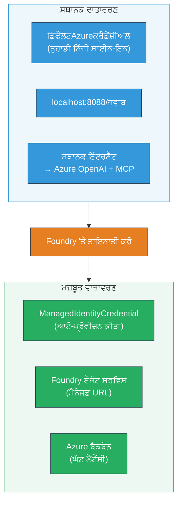

# Module 7 - Playground ਵਿੱਚ ਪੜਤਾਲ ਕਰੋ

ਇਸ ਮੋਡੀਊਲ ਵਿੱਚ, ਤੁਸੀਂ ਆਪਣੇ ਡਿਪਲੋਇਡ ਮਲਟੀ-ਏਜੰਟ ਵਰਕਫਲੋ ਨੂੰ **VS ਕੋਡ** ਅਤੇ **[Foundry ਪੋਰਟਲ](https://ai.azure.com)** ਦੋਹਾਂ ਵਿੱਚ ਟੈਸਟ ਕਰਦੇ ਹੋ, ਇਹ ਪੱਕਾ ਕਰਦੇ ਹੋ ਕਿ ਏਜੰਟ ਸਥਾਨਕ ਟੈਸਟਿੰਗ ਨਾਲ ਇਕਸਾਰ ਅੰਦਾਜ਼ ਵਿੱਚ ਕੰਮ ਕਰ ਰਿਹਾ ਹੈ।

---

## ਡਿਪਲੋਇਮੈਂਟ ਤੋਂ ਬਾਅਦ ਕਿਉਂ ਪੜਤਾਲ ਕਰਨੀ ਹੈ?

ਤੁਹਾਡਾ ਮਲਟੀ-ਏਜੰਟ ਵਰਕਫਲੋ ਸਥਾਨਕ ਤੌਰ 'ਤੇ ਬੇਹਤਰੀਨ ਚੱਲਿਆ ਸੀ, ਤਾਂ ਫਿਰ ਮੁੜ ਟੈਸਟ ਕਰਨ ਦੀ ਲੋੜ ਕਿਉਂ? ਹੋਸਟ ਕੀਤੇ ਗਏ ਵਾਤਾਵਰਨ ਵਿੱਚ ਕਈ ਤਰੀਕਿਆਂ ਨਾਲ ਫਰਕ ਹੁੰਦਾ ਹੈ:


| ਫਰਕ | ਸਥਾਨਕ | ਹੋਸਟ ਕੀਤਾ ਗਿਆ |
|-----------|-------|--------|
| **ਪਛਾਣ** | [`DefaultAzureCredential`](https://learn.microsoft.com/azure/developer/python/sdk/authentication/credential-chains#defaultazurecredential-overview) (ਤੁਹਾਡਾ ਨਿੱਜੀ ਸਾਈਨ-ਇਨ) | [`ManagedIdentityCredential`](https://learn.microsoft.com/python/api/overview/azure/identity-readme#managed-identity-support) (ਆਪਮਾਤਰ ਪ੍ਰਦਾਨ ਕੀਤਾ ਗਿਆ) |
| **ਐਂਡਪੌਇੰਟ** | `http://localhost:8088/responses` | [Foundry Agent Service](https://learn.microsoft.com/azure/foundry/agents/concepts/hosted-agents) ਐਂਡਪੌਇੰਟ (ਮੈਨੇਜਡ URL) |
| **ਨੈਟਵਰਕ** | ਸਥਾਨਕ ਮਸ਼ੀਨ → Azure OpenAI + MCP ਆਉਟਬਾਊਂਡ | Azure ਬੈਕਬੋਨ (ਸਰਵਿਸਾਂ ਵਿਚਕਾਰ ਘੱਟ ਲੇਟेंसी) |
| **MCP ਕਨੈਕਟਿਵਿਟੀ** | ਸਥਾਨਕ ਇੰਟਰਨੈੱਟ → `learn.microsoft.com/api/mcp` | ਕਿਵੇਂਟੇਨਰ ਆਉਟਬਾਊਂਡ → `learn.microsoft.com/api/mcp` |

ਜੇ ਕੋਈ ਵੀ ਵਾਤਾਵਰਨ ਚਲਾਕੀ ਗਲਤ ਸੈੱਟ ਹੈ, RBAC ਵਿਚ ਫਰਕ ਹੈ, ਜਾਂ MCP ਆਉਟਬਾਊਂਡ ਰੋਕੇ ਗਏ ਹਨ, ਤਾਂ ਤੁਸੀਂ ਇਹ ਇੱਥੇ ਪਤਾ ਲਗਾ ਲਵੋਗੇ।

---

## ਵਿਕਲਪ A: VS ਕੋਡ ਪਲੇਗ੍ਰਾਉਂਡ ਵਿੱਚ ਟੈਸਟ ਕਰੋ (ਪਹਿਲਾਂ ਸਿਫਾਰਸ਼ ਕੀਤੀ)

[Foundry ਐਕਸਟੇਂਸ਼ਨ](https://marketplace.visualstudio.com/items?itemName=TeamsDevApp.vscode-ai-foundry) ਵਿੱਚ ਇੱਕ ਸੰਗ੍ਰਹਿਤ ਪਲੇਗ੍ਰਾਉਂਡ ਸ਼ਾਮਲ ਹੈ ਜੋ ਤੁਹਾਨੂੰ ਆਪਣੇ ਡਿਪਲੋਇਡ ਏਜੰਟ ਨਾਲ VS ਕੋਡ ਛੱਡੇ ਬਿਨਾਂ ਗੱਲਬਾਤ ਕਰਨ ਦੀ ਆਗਿਆ ਦਿੰਦਾ ਹੈ।

### ਕਦਮ 1: ਆਪਣੇ ਹੋਸਟ ਕੀਤੇ ਏਜੰਟ ਤੱਕ ਜਾਓ

1. VS ਕੋਡ ਦੇ **ਐਕਟੀਵਿਟੀ ਬਾਰ** (ਖੱਬੇ ਸਾਈਡਬਾਰ) ਵਿੱਚ **Microsoft Foundry** ਆਈਕਨ 'ਤੇ ਕਲਿੱਕ ਕਰੋ ਤਾਂ ਕਿ Foundry ਪੈਨਲ ਖੁੱਲ ਜਾਵੇ।
2. ਆਪਣੇ ਜੁੜੇ ਪ੍ਰੋਜੈਕਟ (ਜਿਵੇਂ `workshop-agents`) ਨੂੰ ਵਧਾਓ।
3. **Hosted Agents (Preview)** ਨੂੰ ਵਧਾਓ।
4. ਤੁਹਾਨੂੰ ਆਪਣੇ ਏਜੰਟ ਦਾ ਨਾਮ ਦਿੱਸਨਾ ਚਾਹੀਦਾ ਹੈ (ਜਿਵੇਂ `resume-job-fit-evaluator`)।

### ਕਦਮ 2: ਇੱਕ ਵਰਜ਼ਨ ਚੁਣੋ

1. ਏਜੰਟ ਦੇ ਨਾਮ 'ਤੇ ਕਲਿੱਕ ਕਰਕੇ ਇਸ ਦੇ ਵਰਜ਼ਨਾਂ ਨੂੰ ਖੋਲ੍ਹੋ।
2. ਜਿਸ ਵਰਜਨ ਨੂੰ ਤੁਸੀਂ ਡਿਪਲੋਇ ਕੀਤਾ ਹੈ ਉਸ 'ਤੇ ਕਲਿੱਕ ਕਰੋ (ਜਿਵੇਂ `v1`)।
3. ਇੱਕ **ਡਿਟੇਲ ਪੈਨਲ** ਖੁੱਲ ਜਾਵੇਗਾ ਜੋ ਕਨټੇਨਰ ਵੇਰਵੇ ਦਿਖਾਉਂਦਾ ਹੈ।
4. ਯਕੀਨੀ ਬਣਾਓ ਕਿ ਸਥਿਤੀ **Started** ਜਾਂ **Running** ਹੈ।

### ਕਦਮ 3: ਪਲੇਗ੍ਰਾਉਂਡ ਖੋਲ੍ਹੋ

1. ਡਿਟੇਲ ਪੈਨਲ ਵਿੱਚ, **ਪਲੇਗ੍ਰਾਉਂਡ** ਬਟਨ 'ਤੇ ਕਲਿੱਕ ਕਰੋ (ਜਾਂ ਵਰਜ਼ਨ 'ਤੇ ਰਾਈਟ-ਕਲਿੱਕ ਕਰਕੇ → **Open in Playground**)।
2. ਇੱਕ ਚੈਟ ਇੰਟਰਫੇਸ VS ਕੋਡ ਟੈਬ ਵਿੱਚ ਖੁੱਲ ਜਾਵੇਗਾ।

### ਕਦਮ 4: ਆਪਣੇ ਸਮੋਕ ਟੈਸਟ ਚਲਾਓ

ਮੋਡੀਊਲ 5 ਤੋਂ ਸਾਡੇ ਨੰਬਰ 3 ਟੈਸਟ ਬਰਾਬਰ ਵਰਤੋ। ਹਰ ਸੰਦੇਸ਼ ਨੂੰ ਪਲੇਗ੍ਰਾਉਂਡ ਦੇ ਇਨਪੁੱਟ ਬਾਕਸ ਵਿੱਚ ਟਾਈਪ ਕਰੋ ਅਤੇ **Send** (ਜਾਂ **Enter**) ਦਬਾਓ।

#### ਟੈਸਟ 1 - ਪੂਰਾ ਰਿਜ਼ਯੂਮੇ + JD (ਮਿਆਰੀ ਪ੍ਰਵਾਹ)

ਮੋਡੀਊਲ 5, ਟੈਸਟ 1 (Jane Doe + Senior Cloud Engineer at Contoso Ltd) ਤੋਂ ਪੂਰਾ ਰਿਜ਼ਯੂਮੇ + JD ਪ੍ਰਾਂਪਟ ਚਿਪਕਾਓ।

**ਉਮੀਦ ਕੀਤੀ ਗਈ:**
- ਫਿਟ ਸਕੋਰ ਸਮੇਤ ਵਿਸ਼ਲੇਸ਼ਣ ਗਣਿਤ (100-ਪોઈਂਟ ਸਕੇਲ)
- ਮਿਲੀ ਹੋਈ ਕੌਸ਼ਲਾਂ ਦਾ ਭਾਗ
- ਗੁੰਮ ਕੌਸ਼ਲਾਂ ਦਾ ਭਾਗ
- **ਹਰ ਗੁੰਮ ਕੌਸ਼ਲ ਲਈ ਇੱਕ ਗੈਪ ਕਾਰਡ** Microsoft Learn URLs ਸਮੇਤ
- ਲਰਨਿੰਗ ਰੋਡਮੈਪ ਸਮੇਤ ਟਾਈਮਲਾਈਨ

#### ਟੈਸਟ 2 - ਛੋਟਾ ਤੇਜ਼ ਟੈਸਟ (ਘੱਟੋ-ਘੱਟ ਇਨਪੁੱਟ)

```
RESUME: 3 years Python developer, knows Django and PostgreSQL, no cloud experience.

JOB: Cloud DevOps Engineer requiring AWS, Kubernetes, Terraform, CI/CD. 5 years needed.
```

**ਉਮੀਦ ਕੀਤੀ ਗਈ:**
- ਘੱਟ ਫਿਟ ਸਕੋਰ (< 40)
- ਸੱਚੀ ਮੁਲਾਂਕਣ ਸਮੇਤ ਸਟੀਜਡ ਲਰਨਿੰਗ ਪਾਥ
- ਕਈ ਗੈਪ ਕਾਰਡ (AWS, Kubernetes, Terraform, CI/CD, ਅਨੁਭਵ ਖਾਲੀ)

#### ਟੈਸਟ 3 - ਉੱਚ-ਫਿਟ ਉਮੀਦਵਾਰ

```
RESUME:
10 years Azure Cloud Architect. AZ-305 certified. Expert in AKS, Terraform, Azure DevOps, 
Azure Functions, Helm, Prometheus, Grafana, Python, Go. Led platform team of 8.

JOB:
Senior Cloud Engineer. Required: AKS, Terraform, Azure DevOps, Python. Preferred: Helm, Go.
5+ years experience. AZ-305 preferred.
```

**ਉਮੀਦ ਕੀਤੀ ਗਈ:**
- ਉੱਚ ਫਿਟ ਸਕੋਰ (≥ 80)
- ਇੰਟਰਵਿਊ ਤਿਆਰੀ ਤੇ ਧਿਆਨ ਅਤੇ ਪੋਲਿਸ਼ਿੰਗ
- ਥੋੜੇ ਜਾਂ ਕੋਈ ਗੈਪ ਕਾਰਡ ਨਹੀਂ
- ਤਿਆਰੀ ‘ਤੇ ਧਿਆਨ ਕੇਂਦਰਿਤ ਛੋਟੀ ਟਾਈਮਲਾਈਨ

### ਕਦਮ 5: ਸਥਾਨਕ ਨਤੀਜਿਆਂ ਨਾਲ ਤੁਲਨਾ ਕਰੋ

ਮੋਡੀਊਲ 5 ਤੋਂ ਤੁਹਾਡੇ ਨੋਟਸ ਜਾਂ ਬ੍ਰਾਊਜ਼ਰ ਟੈਬ ਨੂੰ ਖੋਲ੍ਹੋ ਜਿੱਥੇ ਤੁਸੀਂ ਸਥਾਨਕ ਜਵਾਬ ਸੰਭਾਲੇ ਹਨ। ਹਰ ਟੈਸਟ ਲਈ:

- ਕੀ ਜਵਾਬ ਦਾ **ਸੰਰਚਨਾ ਬਰਾਬਰ** ਹੈ (ਫਿਟ ਸਕੋਰ, ਗੈਪ ਕਾਰਡ, ਰੋਡਮੈਪ)?
- ਕੀ ਇਹ **ਇੱਕੋ ਸਕੋਰਿੰਗ ਨਿਯਮ** ਨੂੰ ਫੋਲੋ ਕਰਦਾ ਹੈ (100-ਪੋਇੰਟ ਵਿਸ਼ਲੇਸ਼ਣ)?
- ਕੀ **Microsoft Learn URLs** ਅਜੇ ਵੀ ਗੈਪ ਕਾਰਡ ਵਿੱਚ ਹਨ?
- ਕੀ ਇੱਕ ਗੁੰਮ ਕੌਸ਼ਲ ਲਈ **ਇੱਕ ਗੈਪ ਕਾਰਡ** ਹੈ (ਕੱਟਿਆ ਨਹੀਂ ਗਿਆ)?

> **ਛੋਟੀ-ਮੋਟੀ ਸ਼ਬਦਾਵਲੀ ਵਿੱਚ ਫਰਕ ਸਧਾਰਣ ਹੈ** - ਮਾਡਲ ਗੈਰ-ਨਿਯਮਤ ਹੈ। ਸੰਰਚਨਾ, ਸਕੋਰਿੰਗ ਸਥਿਰਤਾ, ਅਤੇ MCP ਟੂਲ ਦੀ ਵਰਤੋਂ 'ਤੇ ਧਿਆਨ ਦਿਓ।

---

## ਵਿਕਲਪ B: Foundry ਪੋਰਟਲ ਵਿੱਚ ਟੈਸਟ ਕਰੋ

[Foundry ਪੋਰਟਲ](https://ai.azure.com) ਇੱਕ ਵੈੱਬ-ਆਧਾਰਿਤ ਪਲੇਗ੍ਰਾਉਂਡ ਪ੍ਰਦਾਨ ਕਰਦਾ ਹੈ ਜੋ ਟੀਮ ਮੈਂਬਰਾਂ ਜਾਂ ਹਿੱਸੇਦਾਰਾਂ ਨਾਲ ਸਾਂਝਾ ਕਰਨ ਲਈ ਲਾਭਦਾਇਕ ਹੈ।

### ਕਦਮ 1: Foundry ਪੋਰਟਲ ਖੋਲ੍ਹੋ

1. ਆਪਣੇ ਬ੍ਰਾਊਜ਼ਰ ਨੂੰ ਖੋਲ੍ਹੋ ਅਤੇ [https://ai.azure.com](https://ai.azure.com) ’ਤੇ ਜਾਓ।
2. ਉਹੀ Azure ਖਾਤਾ ਵਰਤੋਂ ਜੋ ਤੁਸੀਂ ਵਰਕਸ਼ਾਪ ਦੌਰਾਨ ਵਰਤ ਰਹੇ ਹੋ।

### ਕਦਮ 2: ਆਪਣੇ ਪ੍ਰੋਜੈਕਟ ਤੱਕ ਜਾਓ

1. ਘਰ ਦੇ ਸਫ਼ੇ ‘ਤੇ, ਖੱਬੇ ਸਾਈਡਬਾਰ ‘ਚ **Recent projects** ਨੂੰ ਵੇਖੋ।
2. ਆਪਣੇ ਪ੍ਰੋਜੈਕਟ ਦੇ ਨਾਮ (ਜਿਵੇਂ `workshop-agents`) ‘ਤੇ ਕਲਿੱਕ ਕਰੋ।
3. ਜੇ ਇਹ ਨਹੀਂ ਦਿੱਸ ਰਿਹਾ, ਤਾਂ **All projects** ‘ਤੇ ਕਲਿੱਕ ਕਰਕੇ ਖੋਜੋ।

### ਕਦਮ 3: ਆਪਣੇ ਡਿਪਲੋਇਡ ਏਜੰਟ ਨੂੰ ਲੱਭੋ

1. ਪ੍ਰੋਜੈਕਟ ਦੇ ਖੱਬੇ ਨੈਵੀਗੇਸ਼ਨ ਵਿੱਚ, **Build** → **Agents** ‘ਤੇ ਕਲਿੱਕ ਕਰੋ (ਜਾਂ **Agents** ਹਿੱਸਾ ਵੇਖੋ)।
2. ਤੁਹਾਨੂੰ ਏਜੰਟਾਂ ਦੀ ਸੂਚੀ ਦਿੱਸੇਗੀ। ਆਪਣੇ ਡਿਪਲੋਇਡ ਏਜੰਟ ਨੂੰ ਲੱਭੋ (ਜਿਵੇਂ `resume-job-fit-evaluator`)।
3. ਏਜੰਟ ਦੇ ਨਾਮ ‘ਤੇ ਕਲਿੱਕ ਕਰਕੇ ਇਸ ਡਿਟੇਲ ਸਫ਼ੇ ਨੂੰ ਖੋਲ੍ਹੋ।

### ਕਦਮ 4: ਪਲੇਗ੍ਰਾਉਂਡ ਖੋਲ੍ਹੋ

1. ਏਜੰਟ ਡਿਟੇਲ ਸਫ਼ੇ ‘ਚ, ਉਪਰਲੇ ਟੂਲਬਾਰ ਨੂੰ ਵੇਖੋ।
2. **Open in playground** (ਜਾਂ **Try in playground**) ‘ਤੇ ਕਲਿੱਕ ਕਰੋ।
3. ਇੱਕ ਚੈਟ ਇੰਟਰਫੇਸ ਖੁੱਲ ਜਾਵੇਗਾ।

### ਕਦਮ 5: ਬਿਲਕੁਲ ਉਹੇ ਸਮੋਕ ਟੈਸਟ ਚਲਾਓ

ਉਪਰੋਕਤ VS ਕੋਡ ਪਲੇਗ੍ਰਾਉਂਡ ਭਾਗ ਤੋਂ ਸਾਰੇ 3 ਟੈਸਟ ਦੁਹਰਾਓ। ਹਰ ਜਵਾਬ ਨੂੰ ਸਥਾਨਕ ਨਤੀਜਿਆਂ (ਮੋਡੀਊਲ 5) ਅਤੇ VS ਕੋਡ ਪਲੇਗ੍ਰਾਉਂਡ ਨਤੀਜਿਆਂ (ਵਿਕਲਪ A) ਨਾਲ ਤੁਲਨਾ ਕਰੋ।

---

## ਮਲਟੀ-ਏਜੰਟ ਖਾਸ ਪੜਤਾਲ

ਮੂਲ ਸਹੀਤ ਤੋਂ ਅੱਗੇ, ਇਨ੍ਹਾਂ ਮਲਟੀ-ਏਜੰਟ-ਖਾਸ ਬਿਹੀਵਿਅਰਾਂ ਦੀ ਪੜਤਾਲ ਕਰੋ:

### MCP ਟੂਲ ਕਾਰਜਸਿੱਧਤਾ

| ਚੈਕ | ਕਿਵੇਂ ਪੁਸ਼ਟੀ ਕਰਨੀ ਹੈ | ਪਾਸ ਸ਼ਰਤ |
|-------|---------------|----------------|
| MCP ਕਾਲ ਸਫਲ | ਗੈਪ ਕਾਰਡਾਂ ਵਿੱਚ `learn.microsoft.com` URLs ਹਨ | ਅਸਲ URLs, ਫੌਲਬੈਕ ਸੁਨੇਹਿਆਂ ਨਾਲ ਨਹੀਂ |
| ਕਈ MCP ਕਾਲਾਂ | ਹਰ ਹਾਈ/ਮੀਡੀਆਮ ਤਰਜੀਹ ਦੇ ਗੈਪ ਲਈ ਸਰੋਤ ਹਨ | ਸਿਰਫ ਪਹਿਲਾ ਗੈਪ ਕਾਰਡ ਨਹੀਂ |
| MCP ਫੌਲਬੈਕ ਕੰਮ ਕਰਦਾ ਹੈ | ਜੇ URLs ਗੁੰਮ ਹਨ, ਫੌਲਬੈਕ ਪਾਠ ਦੀ ਜਾਂਚ ਕਰੋ | ਏਜੰਟ ਫਿਰ ਵੀ ਗੈਪ ਕਾਰਡ ਬਣਾਉਂਦਾ ਹੈ (URLs ਦੇ ਨਾਲ ਜਾਂ ਬਿਨਾਂ) |

### ਏਜੰਟ ਸਮਨਵਯ

| ਚੈਕ | ਕਿਵੇਂ ਪੁਸ਼ਟੀ ਕਰਨੀ ਹੈ | ਪਾਸ ਸ਼ਰਤ |
|-------|---------------|----------------|
| ਸਾਰੇ 4 ਏਜੰਟ ਚੱਲੇ | ਆਉਟਪੁੱਟ ਵਿੱਚ ਫਿਟ ਸਕੋਰ ਅਤੇ ਗੈਪ ਕਾਰਡ ਹਨ | ਸਕੋਰ MatchingAgent ਤੋਂ, ਕਾਰਡ GapAnalyzer ਤੋਂ |
| ਪੈਰਲਲ ਫੈਨ-ਆਉਟ | ਜਵਾਬ ਦਾ ਸਮਾਂ ਠੀਕ ਹੈ (< 2 ਮਿੰਟ) | > 3 ਮਿੰਟ ਹੋਣ 'ਤੇ ਪੈਰਲਲ ਐਗਜ਼ਿਕਿਊਸ਼ਨ ਸੰਭਵ ਨਹੀਂ |
| ਡੇਟਾ ਫਲੋ ਦੀ ਅਖੰਡਤਾ | ਗੈਪ ਕਾਰਡ ਮੈਚਿੰਗ ਰਿਪੋਰਟ ਦੀਆਂ ਕੌਸ਼ਲਾਂ ਨੂੰ ਦਰਸਾਉਂਦੇ ਹਨ | ਕੋਈ ਜਲੂਸੀ ਕੌਸ਼ਲ ਜੋ JD ਵਿੱਚ ਨਹੀਂ ਹਨ ਨਹੀਂ |

---

## ਮੂਲਾਂਕਣ ਰਿਗੋਰ

ਆਪਣੇ ਮਲਟੀ-ਏਜੰਟ ਵਰਕਫਲੋ ਦੇ ਹੋਸਟ ਕੀਤੇ ਬਿਹੀਵਿਅਰ ਦਾ ਮੁਲਾਂਕਣ ਕਰਨ ਲਈ ਇਹ ਰਿਗੋਰ ਵਰਤੋ:

| # | ਮਿਆਰ | ਪਾਸ ਸ਼ਰਤ | ਪਾਸ? |
|---|----------|---------------|-------|
| 1 | **ਕਾਰਜਕਾਰੀ ਸਹੀਗਿਆਨਤਾ** | ਏਜੰਟ ਰਿਜ਼ਯੂਮੇ + JD ਨੂੰ ਫਿਟ ਸਕੋਰ ਅਤੇ ਗੈਪ ਵਿਸ਼ਲੇਸ਼ਣ ਨਾਲ ਜਵਾਬ ਦੇਂਦਾ ਹੈ | |
| 2 | **ਸਕੋਰਿੰਗ ਸਥਿਰਤਾ** | ਫਿਟ ਸਕੋਰ 100-ਪੋਇੰਟ ਸਕੇਲ ਸਮੇਤ ਵਿਸ਼ਲੇਸ਼ਣ | |
| 3 | **ਗੈਪ ਕਾਰਡ ਦੀ ਪੂਰਨਤਾ** | ਹਰ ਗੁੰਮ ਕੌਸ਼ਲ ਲਈ ਇੱਕ ਕਾਰਡ (ਕੱਟਿਆ ਹੋਇਆ ਜਾਂ ਜੋੜਿਆ ਨਹੀਂ) | |
| 4 | **MCP ਟੂਲ ਇੰਟੀਗ੍ਰੇਸ਼ਨ** | ਗੈਪ ਕਾਰਡਾਂ ਵਿੱਚ ਅਸਲ Microsoft Learn URLs ਹਨ | |
| 5 | **ਸੰਰਚਨਾਤਮਕ ਸਥਿਰਤਾ** | ਨਤੀਜੇ ਸਥਾਨਕ ਅਤੇ ਹੋਸਟ ਰਨ ਦੇ ਵਿੱਚ ਮੇਲ ਖਾਂਦੇ ਹਨ | |
| 6 | **ਜਵਾਬ ਦਾ ਸਮਾਂ** | ਹੋਸਟ ਕੀਤਾ ਏਜੰਟ ਪੂਰੇ ਮੁਲਾਂਕਣ ਲਈ 2 ਮਿੰਟਾਂ ਵਿੱਚ ਜਵਾਬ ਦਿੰਦਾ ਹੈ | |
| 7 | **ਕੋਈ ਗਲਤੀ ਨਹੀਂ** | ਕੋਈ HTTP 500 ਗਲਤੀ, ਟਾਈਮਆਊਟ, ਜਾਂ ਖਾਲੀ ਜਵਾਬ ਨਹੀਂ | |

> "ਪਾਸ" ਦਾ ਅਰਥ ਇਹ ਹੈ ਕਿ ਸਾਰੇ 7 ਮਿਆਰ ਸਭ 3 ਸਮੋਕ ਟੈਸਟਾਂ ਲਈ ਕਿਸੇ ਏਕ ਪਲੇਗ੍ਰਾਉਂਡ (VS ਕੋਡ ਜਾਂ ਪੋਰਟਲ) ਵਿੱਚ ਮਿਲ ਜਾਣ।

---

## ਪਲੇਗ੍ਰਾਉਂਡ ਸਮੱਸਿਆਵਾਂ ਦਾ ਹੱਲ

| ਲੱਛਣ | ਸੰਭਾਵਿਤ ਕਾਰਨ | ਸੁਧਾਰ |
|---------|-------------|-----|
| ਪਲੇਗ੍ਰਾਉਂਡ ਲੋਡ ਨਹੀਂ ਹੁੰਦਾ | ਕਨਟੇਨਰ ਸਥਿਤੀ "Started" ਨਹੀਂ ਹੈ | [Module 6](06-deploy-to-foundry.md) 'ਤੇ ਵਾਪਸ ਜਾਓ, ਡਿਪਲੋਇਮੈਂਟ ਸਥਿਤੀ ਦੀ ਪੁਸ਼ਟੀ ਕਰੋ। ਜੇ "Pending" ਹੋਵੇ ਤਾਂ ਉਡੀਕੋ |
| ਏਜੰਟ ਖਾਲੀ ਜਵਾਬ ਦੇਂਦਾ ਹੈ | ਮਾਡਲ ਡਿਪਲੋਇਮੈਂਟ ਨਾਮ ਮਿਲਦਾ-ਜੁਲਦਾ ਨਹੀਂ | `agent.yaml` → `environment_variables` → `MODEL_DEPLOYMENT_NAME` ਨੂੰ ਆਪਣੇ ਡਿਪਲੋਇਡ ਮਾਡਲ ਨਾਲ ਮਿਲਾਓ |
| ਏਜੰਟ ਗਲਤੀ ਸੁਨੇਹਾ ਦੇਂਦਾ ਹੈ | [RBAC](https://learn.microsoft.com/azure/foundry/concepts/rbac-foundry) ਅਧਿਕਾਰ ਗਾਇਬ | ਪ੍ਰੋਜੈਕਟ ਸਕੋਪ‘ਤੇ **[Azure AI User](https://aka.ms/foundry-ext-project-role)** ਅਸਾਈਨ ਕਰੋ |
| ਗੈਪ ਕਾਰਡਾਂ ਵਿੱਚ ਕੋਈ Microsoft Learn URLs ਨਹੀਂ | MCP ਆਉਟਬਾਊਂਡ ਬਲਾਕ ਜਾਂ MCP ਸਰਵਰ ਉਪਲੱਬਧ ਨਹੀਂ | ਦੇਖੋ ਕਿ ਕਨਟੇਨਰ `learn.microsoft.com` ਤੱਕ ਪਹੁੰਚ ਸਕਦਾ ਹੈ ਜਾਂ ਨਹੀਂ। [Module 8](08-troubleshooting.md) ਵੇਖੋ |
| ਸਿਰਫ 1 ਗੈਪ ਕਾਰਡ (ਕੱਟਿਆ ਹੋਇਆ) | GapAnalyzer ਹਦਾਇਤਾਂ ਵਿੱਚ "CRITICAL" ਬਲੌਕ ਨਹੀਂ | [Module 3, Step 2.4](03-configure-agents.md) ਨੂੰ ਸਮੀਖਿਆ ਕਰੋ |
| ਸਥਾਨਕ ਨਾਲੋਂ ਫਿਟ ਸਕੋਰ ਬਹੁਤ ਵੱਖਰਾ | ਵੱਖਰੇ ਮਾਡਲ ਜਾਂ ਹਦਾਇਤਾਂ ਡਿਪਲੋਇ ਕੀਤੀ ਗਈਆਂ | `agent.yaml` env vars ਨੂੰ ਸਥਾਨਕ `.env` ਨਾਲ ਤੁਲਨਾ ਕਰੋ। ਜਰੂਰਤ ਹੋਣ ਤੇ ਮੁੜ ਡਿਪਲੋਇ ਕਰੋ |
| ਪੋਰਟਲ ਵਿੱਚ "Agent not found" | ਡਿਪਲੋਇਮੈਂਟ ਅਜੇ ਵੀ ਪ੍ਰਚਾਰਿਤ ਹੋ ਰਹੀ ਹੈ ਜਾਂ ਅਸਫਲ ਹੋਈ | 2 ਮਿੰਟ ਉਡੀਕੋ, ਤਾਜ਼ਾ ਕਰੋ। ਫਿਰ ਵੀ ਨਹੀਂ ਮਿਲਿਆ ਤਾਂ [Module 6](06-deploy-to-foundry.md) ਤੋਂ ਮੁੜ ਡਿਪਲੋਇ ਕਰੋ |

---

### ਚੈਕਪੌਇੰਟ

- [ ] VS ਕੋਡ ਪਲੇਗ੍ਰਾਉਂਡ ਵਿੱਚ ਏਜੰਟ ਟੈਸਟ ਕੀਤਾ - ਸਾਰੇ 3 ਸਮੋਕ ਟੈਸਟ ਪਾਸ ਹੋਏ
- [ ] [Foundry ਪੋਰਟਲ](https://ai.azure.com) ਪਲੇਗ੍ਰਾਉਂਡ ਵਿੱਚ ਏਜੰਟ ਟੈਸਟ ਕੀਤਾ - ਸਾਰੇ 3 ਸਮੋਕ ਟੈਸਟ ਪਾਸ ਹੋਏ
- [ ] ਜਵਾਬ ਸਥਾਨਕ ਟੈਸਟਿੰਗ ਨਾਲ ਸੰਰਚਨਾਤਮਕ ਰੂਪ ਵਿੱਚ ਸਮਰੂਪ ਹਨ (ਫਿਟ ਸਕੋਰ, ਗੈਪ ਕਾਰਡ, ਰੋਡਮੈਪ)
- [ ] ਗੈਪ ਕਾਰਡਾਂ ਵਿੱਚ Microsoft Learn URLs ਮੌਜੂਦ ਹਨ (MCP ਟੂਲ ਹੋਸਟ ਵਾਤਾਵਰਨ ਵਿੱਚ ਕਾਰਜਸ਼ੀਲ)
- [ ] ਹਰ ਗੁੰਮ ਕੌਸ਼ਲ ਲਈ ਇੱਕ ਗੈਪ ਕਾਰਡ (ਕੱਟਤਿ ਨਹੀਂ)
- [ ] ਟੈਸਟਿੰਗ ਦੌਰਾਨ ਕੋਈ ਗਲਤੀਆਂ ਜਾਂ ਟਾਈਮਆਊਟ ਨਹੀਂ
- [ ] ਮੁਲਾਂਕਣ ਰਿਗੋਰ ਮੁਕੰਮਲ ਕੀਤਾ (ਸਾਰੇ 7 ਮਿਆਰ ਪਾਸ)

---

**ਪਿਛਲੇ:** [06 - Deploy to Foundry](06-deploy-to-foundry.md) · **ਅਗਲਾ:** [08 - Troubleshooting →](08-troubleshooting.md)

---

<!-- CO-OP TRANSLATOR DISCLAIMER START -->
**ਇਨਾਂ ਖੰਡਨ**:  
ਇਹ ਦਸਤਾਵੇਜ਼ AI ਅਨੁਵਾਦ ਸੇਵਾ [Co-op Translator](https://github.com/Azure/co-op-translator) ਦੀ ਵਰਤੋਂ ਨਾਲ ਅਨੁਵਾਦਿਤ ਕੀਤਾ ਗਿਆ ਹੈ। ਜਦੋਂ ਕਿ ਅਸੀਂ ਸ਼ੁੱਧਤਾ ਲਈ ਕੋਸ਼ਿਸ਼ ਕਰਦੇ ਹਾਂ, ਕਿਰਪਾ ਕਰਕੇ ਜਾਣਕਾਰੀ ਰੱਖੋ ਕਿ ਸਵੈਚਾਲਿਤ ਅਨੁਵਾਦਾਂ ਵਿੱਚ ਗਲਤੀਆਂ ਜਾਂ ਅਸਹੀਤਾਵਾਂ ਹੋ ਸਕਦੀਆਂ ਹਨ। ਮੂਲ ਦਸਤਾਵੇਜ਼ ਆਪਣੇ ਮੂਲ ਭਾਸ਼ਾ ਵਿੱਚ ਪ੍ਰਮਾਣਿਕ ਸਰੋਤ ਮੰਨਿਆ ਜਾਣਾ ਚਾਹੀਦਾ ਹੈ। ਸੰਵੇਦਨਸ਼ੀਲ ਜਾਣਕਾਰੀ ਲਈ, ਪੇਸ਼ੇਵਰ ਮਾਨਵ ਅਨੁਵਾਦ ਦੀ ਸਿਫਾਰਸ਼ ਕੀਤੀ ਜਾਂਦੀ ਹੈ। ਇਸ ਅਨੁਵਾਦ ਦੇ ਉਪਯੋਗ ਤੋਂ ਉਤਪੰਨ ਹੋਣ ਵਾਲੀਆਂ ਕਿਸੇ ਵੀ ਗਲਤਫ਼ਹਮੀਆਂ ਜਾਂ ਗਲਤ ਵਿਆਖਿਆਵਾਂ ਲਈ ਅਸੀਂ ਜਿੰਮੇਵਾਰ ਨਹੀਂ ਹਾਂ।
<!-- CO-OP TRANSLATOR DISCLAIMER END -->