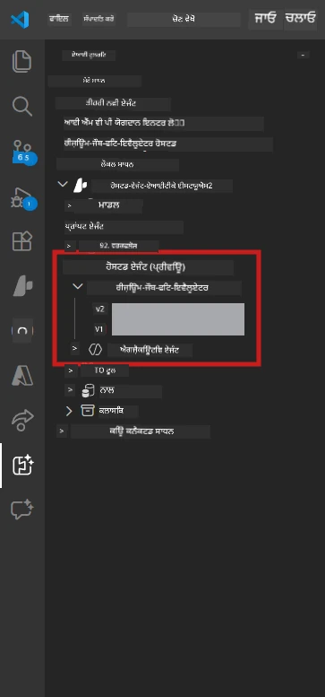

# ਮਾਡਿਊਲ 7 - ਖੇਡ-ਮੈਦਾਨ ਵਿਚ ਜਾਂਚ ਕਰੋ

⏱️ ~10 ਮਿੰਟ

ਇਸ ਮਾਡਿਊਲ ਵਿੱਚ, ਤੁਸੀਂ ਆਪਣੇ ਤੈਅ ਕੀਤੇ ਮਲਟੀ-ਏਜੰਟ ਵਰਕਫਲੋ ਨੂੰ VS ਕੋਡ ਅਤੇ Foundry ਪੋਰਟਲ ਵਿੱਚ ਟੈਸਟ ਕਰਦੇ ਹੋ, ਇਹ ਪੁਸ਼ਟੀ ਕਰਦੇ ਹੋ ਕਿ ਏਜੰਟ ਸਥਾਨਕ ਟੈਸਟਿੰਗ ਵਰਗਾ ਹੀ ਵਰਤਾਵ ਕਰਦਾ ਹੈ।

---

## ਤੈਅ ਕਰਨ ਤੋਂ ਬਾਅਦ ਫਿਰ ਟੈਸਟ ਕਿਉਂ ਕਰਨਾ ਚਾਹੀਦਾ ਹੈ?

ਹੋਸਟ ਕੀਤਾ ਮਾਹੌਲ ਕੁਝ ਅਹੰਕਾਰਪੂਰਕ ਤਰੀਕਿਆਂ ਵਿੱਚ ਸਥਾਨਕ ਤੋਂ ਵੱਖਰਾ ਹੁੰਦਾ ਹੈ:

| | ਸਥਾਨਕ | ਹੋਸਟ ਕੀਤਾ |
|--|-------|--------|
| **ਪਹਚਾਨ** | ਤੁਹਾਡਾ ਨਿੱਜੀ ਸਾਈਨ-ਇਨ (`DefaultAzureCredential`) | ਹਰ ਏਜੰਟ ਲਈ ਸਮਰਪਿਤ Entra ਪਹਚਾਨ (ਤੈਅ ਕਰਨ ਸਮੇਂ ਆਟੋ-ਪ੍ਰੋਵਿਜਨ ਕੀਤੀ) |
| **ਏਂਡਪਾਇੰਟ** | `http://localhost:8088/responses` | Foundry ਏਜੰਟ ਸਰਵਿਸ ਦੁਆਰਾ ਪ੍ਰਬੰਧਿਤ URL |
| **ਨੈੱਟਵਰਕ** | ਤੁਹਾਡੀ ਮਸ਼ੀਨ → Azure OpenAI + MCP | Azure ਬੈਕਬੋਨ (ਘੱਟ ਲੇਟੇਨਸੀ) |

ਕੋਈ ਖ਼ਰਾਬ ਕਰ ਰਹੀ env var, RBAC ਸਮੱਸਿਆ, ਜਾਂ ਬਲਾਕ ਕੀਤੀ MCP ਆਉਟਬਾਊਂਡ ਕਾਲ ਪਹਿਲਾਂ ਇੱਥੇ ਦਰਸਾਈ ਜਾਵੇਗੀ।

---

## ਵਿਕਲਪ A: VS ਕੋਡ ਖੇਡ-ਮੈਦਾਨ ਵਿਚ ਟੈਸਟ ਕਰੋ (ਪਹਿਲਾਂ ਸਿਫਾਰਸ਼ੀ)

### ਕਦਮ 1: ਆਪਣੇ ਹੋਸਟ ਕੀਤੇ ਏਜੰਟ ਤੱਕ ਜਾਓ

1. Activity Bar ਵਿੱਚ **Foundry Toolkit** ਆਈਕਨ 'ਤੇ ਕਲਿੱਕ ਕਰੋ।
2. ਆਪਣੇ ਪ੍ਰੋਜੈਕਟ ਨੂੰ ਫੈਲਾਓ → **Hosted Agents (Preview)** → ਆਪਣਾ ਏਜੰਟ ਲੱਭੋ।



### ਕਦਮ 2: ਇੱਕ ਵਰਜ਼ਨ ਚੁਣੋ

1. ਏਜੰਟ 'ਤੇ ਕਲਿੱਕ ਕਰੋ ਆਪਣੇ ਵਰਜ਼ਨਾਂ ਨੂੰ ਵਧਾਉਣ ਲਈ।
2. `v1` 'ਤੇ ਕਲਿੱਕ ਕਰੋ → ਸਥਿਤੀ **ਸਰਗਰਮ** ਹੋਣ ਦੀ ਪੁਸ਼ਟੀ ਕਰੋ (sidebar ਵਿੱਚ "Running" ਜਾਂ "Started" ਦਿਖਾਈ ਦੇ ਸਕਦਾ ਹੈ - ਦੋਵੇਂ ਹੀ ਤਿਆਰ ਸਥਿਤੀ ਦਰਸਾਉਂਦੇ ਹਨ)।

### ਕਦਮ 3: ਖੇਡ-ਮੈਦਾਨ ਖੋਲ੍ਹੋ

1. **Playground** 'ਤੇ ਕਲਿੱਕ ਕਰੋ (ਜਾਂ ਵਰਜ਼ਨ 'ਤੇ ਰਾਈਟ-ਕਲਿੱਕ → **Open in Playground**).
2. VS ਕੋਡ ਟੈਬ ਵਿੱਚ ਚੈਟ ਵਿੰਡੋ ਖੁਲਵੇਗੀ।

### ਕਦਮ 4: ਆਪਣੇ ਸਥੂਲ ਟੈਸਟ ਚਲਾਓ

[Module 5](05-test-locally.md) ਤੋਂ ਉਹੀ 3 ਟੈਸਟ ਵਰਤੋ। ਹਰ ਸੁਨੇਹਾ ਖੇਡ-ਮੈਦਾਨ ਇਨਪੁੱਟ ਬਾਕਸ ਵਿੱਚ ਟਾਈਪ ਕਰੋ ਅਤੇ **Send** (ਜਾਂ **Enter**) ਦਬਾਓ।

#### ਟੈਸਟ 1 - ਪੂਰਾ ਰਿਜ਼ਯੂਮੇ + ਜੇਡੀ (ਮਿਆਰੀ ਫ਼ਲੋ)

Module 5, ਟੈਸਟ 1 (Jane Doe + Senior Cloud Engineer at Contoso Ltd) ਤੋਂ ਪੂਰਾ ਰਿਜ਼ਯੂਮੇ + ਜੇਡੀ ਪ੍ਰੰਪਟ ਪੇਸਟ ਕਰੋ।

**ਉਮੀਦ ਕੀਤੀ ਜਾਂਦੀ ਹੈ:**
- ਫਿਟ ਸਕੋਰ ਵਿੱਥ ਵਿਭਾਜਨ ਗਣਿਤ (100-ਅੰਕ ਸਕੇਲ)
- ਮੇਲ ਖਾਂਦੇ ਹੁਨਰਾਂ ਦਾ ਭਾਗ
- ਗੁਆਚੇ ਹੁਨਰਾਂ ਦਾ ਭਾਗ
- **ਹਰ ਗੁਆਚੇ ਹੁਨਰ ਲਈ ਇੱਕ ਗੈਪ ਕਾਰਡ** ਮਾਇਕ੍ਰੋਸਾਫਟ ਲਰਨ URLs ਦੇ ਨਾਲ
- ਸਿੱਖਣ ਵਾਲਾ ਰੋਡਮੈਪ ਟਾਈਮਲਾਈਨ ਸਮੇਤ

#### ਟੈਸਟ 2 - ਤੇਜ਼ ਛੋਟਾ ਟੈਸਟ (ਘੱਟੋ-ਘੱਟ ਇਨਪੁੱਟ)

```
RESUME: 3 years Python developer, knows Django and PostgreSQL, no cloud experience.

JOB: Cloud DevOps Engineer requiring AWS, Kubernetes, Terraform, CI/CD. 5 years needed.
```

**ਉਮੀਦ ਕੀਤੀ ਜਾਂਦੀ ਹੈ:**
- ਘੱਟ ਫਿਟ ਸਕੋਰ (< 40)
- ਇਮਾਨਦਾਰ ਅੰਕਲਨ ਸਟੇਜਡ ਸਿੱਖਣ ਦੇ ਰਸਤੇ ਨਾਲ
- ਕਈ ਗੈਪ ਕਾਰਡ (AWS, Kubernetes, Terraform, CI/CD, ਤਜ਼ਰਬੇ ਦਾ ਗੈਪ)

#### ਟੈਸਟ 3 - ਉੱਚ-ਫਿਟ ਉਮੀਦਵਾਰ

```
RESUME:
10 years Azure Cloud Architect. AZ-305 certified. Expert in AKS, Terraform, Azure DevOps, 
Azure Functions, Helm, Prometheus, Grafana, Python, Go. Led platform team of 8.

JOB:
Senior Cloud Engineer. Required: AKS, Terraform, Azure DevOps, Python. Preferred: Helm, Go.
5+ years experience. AZ-305 preferred.
```

**ਉਮੀਦ ਕੀਤੀ ਜਾਂਦੀ ਹੈ:**
- ਉੱਚ ਫਿਟ ਸਕੋਰ (≥ 80)
- ਇੰਟਰਵਿਊ ਤਈਆਰੀ ਅਤੇ ਪੋਲਿਸ਼ਿੰਗ 'ਤੇ ਧਿਆਨ
- ਕੁਝ ਜਾਂ ਕੋਈ ਵੀ ਗੈਪ ਕਾਰਡ ਨਹੀਂ
- ਤਈਆਰੀ 'ਤੇ ਕੇਂਦਰਿਤ ਛੋਟੀ ਟਾਈਮਲਾਈਨ

### ਕਦਮ 5: ਸਥਾਨਕ ਨਤੀਜਿਆਂ ਨਾਲ ਤੁਲਨਾ ਕਰੋ

ਆਪਣੇ ਨੋਟਸ ਜਾਂ Module 5 ਤੋਂ ਬ੍ਰਾਉਜ਼ਰ ਟੈਬ ਖੋਲ੍ਹੋ ਜਿੱਥੇ ਤੁਸੀਂ ਸਥਾਨਕ ਜਵਾਬ ਸੇਵ ਕੀਤੇ ਸਨ। ਹਰ ਟੈਸਟ ਲਈ:

- ਕੀ ਜਵਾਬ ਵਿੱਚ **ਉਹੀ ਸੰਰਚਨਾ** ਹੈ (ਫਿਟ ਸਕੋਰ, ਗੈਪ ਕਾਰਡ, ਰੋਡਮੈਪ)?
- ਕੀ ਇਹ **ਉਹੀ ਸਕੋਰਿੰਗ ਰੁਬਰਿਕ** ਨੂੰ ਫਾਲੋ ਕਰਦਾ ਹੈ (100-ਅੰਕ ਵਰਗੀ ਵਿਭਾਜਨ)?
- ਕੀ **ਮਾਇਕ੍ਰੋਸਾਫਟ ਲਰਨ URLs** ਅਜੇ ਵੀ ਗੈਪ ਕਾਰਡਾਂ ਵਿੱਚ ਮੌਜੂਦ ਹਨ?
- ਕੀ ਹਰ ਗੁਆਚੇ ਹੁਨਰ ਲਈ **ਇੱਕ ਗੈਪ ਕਾਰਡ** ਹੈ (ਛਾਂਟਿਆ ਨਹੀਂ ਗਿਆ)?

> **ਛੋਟੀਆਂ ਸ਼ਬਦ-ਵਾਰ ਫਰਕ ਸਧਾਰਨ ਹਨ** - ਮਾਡਲ ਗੈਰ-ਨਿਰਧਾਰਤਮਕ ਹੈ। ਸੰਰਚਨਾ, ਸਕੋਰਿੰਗ ਸਥਿਰਤਾ, ਅਤੇ MCP ਸੰਦ ਦੀ ਵਰਤੋਂ 'ਤੇ ਧਿਆਨ ਦਿਓ।

---

## ਵਿਕਲਪ B: Foundry ਪੋਰਟਲ ਵਿੱਚ ਟੈਸਟ ਕਰੋ

[Foundry Portal](https://ai.azure.com) ਇੱਕ ਵੈੱਬ-ਅਧਾਰਤ ਖੇਡ-ਮੈਦਾਨ ਮੁਹੱਈਆ ਕਰਵਾਉਂਦਾ ਹੈ ਜੋ ਸਾਥੀਆਂ ਜਾਂ ਸਟੇਕਹੋਲਡਰਾਂ ਨਾਲ ਸਾਂਝਾ ਕਰਨ ਲਈ ਲਾਭਕਾਰੀ ਹੈ।

### ਕਦਮ 1: Foundry ਪੋਰਟਲ ਖੋਲ੍ਹੋ

1. ਆਪਣਾ ਬ੍ਰਾਉਜ਼ਰ ਖੋਲ੍ਹੋ ਅਤੇ [https://ai.azure.com](https://ai.azure.com) 'ਤੇ ਜਾਓ।
2. ਉਸੇ Azure ਖਾਤੇ ਨਾਲ ਸਾਈਨ-ਇਨ ਕਰੋ ਜਿਸ ਨੂੰ ਤੁਸੀਂ ਸਾਰੀ ਵਰਕਸ਼ਾਪ ਵਿਚ ਵਰਤਿਆ ਹੈ।

### ਕਦਮ 2: ਆਪਣੇ ਪ੍ਰੋਜੈਕਟ ਤੱਕ ਜਾਓ

1. ਹੋਮ ਪੇਜ਼ 'ਤੇ, ਖੱਬੀ ਸਾਈਡਬਾਰ 'ਤੇ **Recent projects** ਖੋਜੋ।
2. ਆਪਣੇ ਪ੍ਰੋਜੈਕਟ ਦੇ ਨਾਮ (ਉਦਾਹਰਨ ਲਈ, `workshop-agents`) 'ਤੇ ਕਲਿੱਕ ਕਰੋ।
3. ਜੇ ਨਹੀਂ ਦਿਖਾਈ ਦੇ ਰਿਹਾ, ਤਾਂ **All projects** 'ਤੇ ਕਲਿੱਕ ਕਰੋ ਅਤੇ ਲੱਭੋ।

### ਕਦਮ 3: ਆਪਣੇ ਤੈਅ ਕੀਤੇ ਏਜੰਟ ਨੂੰ ਲੱਭੋ

1. ਪ੍ਰੋਜੈਕਟ ਖੱਬੇ ਨੈਵੀਗੇਸ਼ਨ ਵਿੱਚ, **Build** → **Agents** 'ਤੇ ਕਲਿੱਕ ਕਰੋ (ਜਾਂ **Agents** ਹਿੱਸਾ ਲੱਭੋ)।
2. ਤੁਹਾਨੂੰ ਏਜੰਟਾਂ ਦੀ ਸੂਚੀ ਦਿਖਾਈ ਦੇਵੇਗੀ। ਆਪਣੇ ਤੈਅ ਕੀਤੇ ਏਜੰਟ ਨੂੰ ਲੱਭੋ (ਉਦਾਹਰਨ ਲਈ, `resume-job-fit-evaluator`)।
3. ਏਜੰਟ ਦੇ ਨਾਮ 'ਤੇ ਕਲਿੱਕ ਕਰੋ ਇਸ ਦੀ ਵਿਸਥਾਰ ਪੰਨਾ ਖੋਲ੍ਹਣ ਲਈ।

### ਕਦਮ 4: ਖੇਡ-ਮੈਦਾਨ ਖੋਲ੍ਹੋ

1. ਏਜੰਟ ਵਿਸਥਾਰ ਪੰਨੇ 'ਤੇ, ਉੱਪਰ ਟੂਲਬਾਰ ਵੇਖੋ।
2. **Open in playground** (ਜਾਂ **Try in playground**) 'ਤੇ ਕਲਿੱਕ ਕਰੋ।
3. ਚੈਟ ਇੰਟਰਫੇਸ ਖੁਲ ਜਾਵੇਗਾ।

### ਕਦਮ 5: ਉਹੀ ਸਥੂਲ ਟੈਸਟ ਚਲਾਓ

VS ਕੋਡ ਖੇਡ-ਮੈਦਾਨ ਭਾਗ ਵਿੱਚ ਉੱਪਰ ਦਿੱਤੇ ਸਾਰੇ 3 ਟੈਸਟ ਦੁਹਰਾਓ। ਹਰ ਜਵਾਬ ਦੀ ਤੁਲਨਾ ਦੋਹਾਂ ਸਥਾਨਕ ਨਤੀਜਿਆਂ (Module 5) ਅਤੇ VS ਕੋਡ ਖੇਡ ਮੈਦਾਨ ਨਤੀਜਿਆਂ (ਵਿਕਲਪ A ਉੱਪਰ) ਨਾਲ ਕਰੋ।

---

## ਮਲਟੀ-ਏਜੰਟ ਵਿਸ਼ੇਸ਼ ਜਾਂਚ

ਆਮ ਸਹੀਤਾ ਤੋਂ ਅੱਗੇ, ਇਹ ਮਲਟੀ-ਏਜੰਟ ਵਿਸ਼ੇਸ਼ ਵਿਹਾਰ ਪੁਸ਼ਟੀ ਕਰੋ:

### MCP ਸੰਦ ਪ੍ਰਵਾਹ

| ਚੈੱਕ ਕਰੋ | ਕਿਵੇਂ ਪੁਸ਼ਟੀ ਕਰਨੀ ਹੈ | ਪਾਸ ਸ਼ਰਤ |
|-------|---------------|----------------|
| MCP ਕਾਲ ਸਫਲ | ਗੈਪ ਕਾਰਡਾਂ ਵਿੱਚ `learn.microsoft.com` URLs ਹਨ | ਅਸਲੀ URLs, ਸੰਕਟ ਪੁਸ਼ਟੀਕਰਨ ਸੰਦੇਸ਼ ਨਹੀਂ |
| ਕਈ MCP ਕਾਲਾਂ | ਹਰ ਉੱਚ/ਮੱਧਮ ਤਰਜੀਹ ਗੈਪ ਕੋਲ ਸਰੋਤ ਹਨ | ਸਿਰਫ ਪਹਿਲਾ ਗੈਪ ਕਾਰਡ ਨਹੀਂ |
| MCP ਬੈਕਅਪ ਕੰਮ ਕਰਦਾ ਹੈ | ਜੇ URLs ਖੋਏ ਹੋਏ ਹਨ, ਬੈਕਅਪ ਟੈਕਸਟ ਚੈੱਕ ਕਰੋ | ਏਜੰਟ ਫਿਰ ਵੀ ਗੈਪ ਕਾਰਡ ਤਿਆਰ ਕਰਦਾ ਹੈ (URLs ਨਾਲ ਜਾਂ ਬਿਨਾਂ) |

### ਏਜੰਟ ਸਹਿਕਾਰ

| ਚੈੱਕ ਕਰੋ | ਕਿਵੇਂ ਪੁਸ਼ਟੀ ਕਰਨੀ ਹੈ | ਪਾਸ ਸ਼ਰਤ |
|-------|---------------|----------------|
| ਸਾਰੇ 4 ਏਜੰਟ ਚਲਾਏ ਗਏ | ਆਉਟਪੁੱਟ ਵਿੱਚ ਫਿਟ ਸਕੋਰ ਅਤੇ ਗੈਪ ਕਾਰਡ ਹਨ | ਸਕੋਰ MatchingAgent ਤੋਂ, ਕਾਰਡ GapAnalyzer ਤੋਂ |
| ਲੜੀਵਾਰ ਪ੍ਰਵਾਹ | ਜਵਾਬ ਸਮਾਂ ਵਾਜਬ ਹੈ (< 2 ਮਿੰਟ) | ਜੇ > 3 ਮਿੰਟ, ਟਰਮੀਨਲ ਲਾਗ ਵਿੱਚ ਗਲਤੀਆਂ ਚੈੱਕ ਕਰੋ |
| ਡੇਟਾ ਫਲੋ ਸਾਫ਼-ਸੁਥਰਾ | ਗੈਪ ਕਾਰਡ ਮੇਲ ਖਾਂਦੇ ਰਿਪੋਰਟ ਦੇ ਹੁਨਰਾਂ ਦਾ ਹਵਾਲਾ ਦਿੰਦੇ ਹਨ | ਕੋਈ ਵੀ ਵਿਹਾਰਤ ਫੈਰ ਤੋਂ ਬਿਨਾਂ ਜੋ ਜੇडी ਵਿੱਚ ਨਹੀਂ |

---

## ਮੂਲਯੰਕਨ ਰੁਬਰਿਕ

ਇਸ ਰੁਬਰਿਕ ਨੂੰ ਵਰਤਕੇ ਆਪਣੇ ਮਲਟੀ-ਏਜੰਟ ਵਰਕਫਲੋ ਦੇ ਹੋਸਟ ਕੀਤੇ ਵਿਹਾਰ ਦਾ ਮੂਲਯੰਕਨ ਕਰੋ:

| # | ਮਿਆਰੀ | ਪਾਸ ਸ਼ਰਤ | ਪਾਸ? |
|---|----------|---------------|-------|
| 1 | **ਕਾਰਗੁਜ਼ਾਰੀ ਸਹੀਤਾ** | ਏਜੰਟ ਰਿਜ਼ਯੂਮੇ + ਜੇਡੀ ਨੂੰ ਫਿਟ ਸਕੋਰ ਅਤੇ ਗੈਪ ਵਿਸ਼ਲੇਸ਼ਣ ਨਾਲ ਜਵਾਬ ਦਿੰਦਾ ਹੈ | |
| 2 | **ਸਕੋਰਿੰਗ ਸਥਿਰਤਾ** | ਫਿਟ ਸਕੋਰ 100-ਅੰਕ ਸਕੇਲ ਅਤੇ ਵਿਭਾਜਨ ਗਣਿਤ ਵਰਤਦਾ ਹੈ | |
| 3 | **ਗੈਪ ਕਾਰਡ ਪੂਰਨਤਾ** | ਹਰ ਗੁਆਚੇ ਹੁਨਰ ਲਈ ਇੱਕ ਕਾਰਡ (ਛਾਂਟਿਆ ਜਾਂ ਜੋੜਿਆ ਨਹੀਂ) | |
| 4 | **MCP ਸੰਦ ਇੰਟੀਗ੍ਰੇਸ਼ਨ** | ਗੈਪ ਕਾਰਡਾਂ ਵਿੱਚ ਅਸਲੀ ਮਾਇਕ੍ਰੋਸਾਫਟ ਲਰਨ URLs ਹਨ | |
| 5 | **ਸੰਰਚਨਾਤਮਕ ਸਥਿਰਤਾ** | ਆਉਟਪੁੱਟ ਸੰਰਚਨਾ ਸਥਾਨਕ ਅਤੇ ਹੋਸਟ ਕੀਤੇ ਚਲਾਅ ਵਿੱਚ ਮਿਲਦੀ ਹੈ | |
| 6 | **ਜਵਾਬ ਦਾ ਸਮਾਂ** | ਹੋਸਟ ਕੀਤਾ ਏਜੰਟ ਪੂਰੇ ਅੰਕਲਨ ਲਈ 2 ਮਿੰਟਾਂ ਵਿਚ ਜਵਾਬ ਦਿੰਦਾ ਹੈ | |
| 7 | **ਕੋਈ ਗਲਤੀਆਂ ਨਹੀਂ** | HTTP 500 ਗਲਤੀਆਂ, ਟਾਈਮਆਉਟ ਜਾਂ ਖਾਲੀ ਜਵਾਬ ਨਹੀਂ | |

> ਇੱਕ "ਪਾਸ" ਦਾ ਮਤਲਬ ਹੈ ਕਿ 3 ਸਥੂਲ ਟੈਸਟਾਂ ਲਈ 7ੋਂ ਸਾਰੇ ਮਾਪਦੰਡ ਪੂਰੇ ਹੋਣ (ਕਮਜ਼ੋਰੀ ਤਾਂ ਇੱਕ ਖੇਡ-ਮੈਦਾਨ ਵਿੱਚ - VS ਕੋਡ ਜਾਂ ਪੋਰਟਲ).

---

## ਖੇਡ-ਮੈਦਾਨ ਸਮੱਸਿਆਵਾਂ ਦੀ ਸਹਾਇਤਾ

| ਲੱਛਣ | ਸੰਭਾਵਿਤ ਕਾਰਨ | ਸੁਧਾਰ |
|---------|-------------|-----|
| ਖੇਡ-ਮੈਦਾਨ ਲੋਡ ਨਹੀਂ ਹੁੰਦਾ | ਕੰਟੇਨਰ `active` ਸਥਿਤੀ ਵਿੱਚ ਨਹੀਂ | [Module 6](06-deploy-to-foundry.md) ਤੇ ਵਾਪਸ ਜਾਓ, ਤੈਅ ਸਥਿਤੀ ਚੈੱਕ ਕਰੋ। ਜੇ `creating` ਹੋਵੇ ਤਾਂ ਉਡੀਕ ਕਰੋ |
| ਏਜੰਟ ਖਾਲੀ ਜਵਾਬ ਦਿੰਦਾ ਹੈ | ਮਾਡਲ ਡਿਪਲੋਇਮੈਂਟ ਨਾਮ ਅਣਮਿਲਦਾ | `agent.yaml` → `environment_variables` → `AZURE_AI_MODEL_DEPLOYMENT_NAME` ਨੂੰ ਆਪਣੇ ਤੈਅ ਮਾਡਲ ਨਾਲ ਮਿਲਾਓ |
| ਏਜੰਟ ਗਲਤੀ ਸੁਨੇਹਾ ਦਿੰਦਾ ਹੈ | [RBAC](https://learn.microsoft.com/azure/foundry/concepts/rbac-foundry) ਅਨੁਮਤੀ ਗਾਇਬ | ਪ੍ਰੋਜੈਕਟ ਪੱਧਰ ਤੇ **[Foundry User](https://aka.ms/foundry-ext-project-role)** (ਪਹਿਲਾਂ Azure AI User) ਅਸਾਈਨ ਕਰੋ |
| ਗੈਪ ਕਾਰਡਾਂ ਵਿੱਚ ਕੋਈ ਮਾਇਕ੍ਰੋਸਾਫਟ ਲਰਨ URLs ਨਹੀਂ | MCP ਆਉਟਬਾਊਂਡ ਬਲਾਕ ਜਾਂ MCP ਸਰਵਰ ਅਣਉਪਲਬਧ | ਚੈੱਕ ਕਰੋ ਕਿ ਕੰਟੇਨਰ `learn.microsoft.com` ਤੱਕ ਪਹੁੰਚ ਸਕਦਾ ਹੈ। ਵੇਖੋ [Module 8](08-troubleshooting.md) |
| ਸਿਰਫ 1 ਗੈਪ ਕਾਰਡ (ਛਾਂਟਿਆ ਗਿਆ) | GapAnalyzer ਨਿਰਦੇਸ਼ਾਂ ਵਿੱਚ "CRITICAL" ਬਲਾਕ ਗਾਇਬ | ਰਿਵਿਊ ਕਰੋ [Module 3, Step 2.4](03-configure-agents.md) |
| ਫਿਟ ਸਕੋਰ ਸਥਾਨਕ ਨਾਲ ਬਹੁਤ ਵੱਖਰਾ ਹੈ | ਵੱਖਰਾ ਮਾਡਲ ਜਾਂ ਨਿਰਦੇਸ਼ ਤੈਅ ਕੀਤਾ ਗਿਆ | `agent.yaml` env vars ਨੂੰ ਸਥਾਨਕ `.env` ਨਾਲ ਤੁਲਨਾ ਕਰੋ। ਜਰੂਰਤ ਹੋਵੇ ਤਾਂ ਦੁਬਾਰਾ ਤੈਅ ਕਰੋ |
| "ਏਜੰਟ ਨਹੀਂ ਮਿਲਿਆ" ਪੋਰਟਲ ਵਿੱਚ | ਡਿਪਲੋਇਮੈਂਟ ਅਜੇ ਵੀ ਫੈਲਾਉਂਦਾ ਜਾਂ ਅਸਫਲ | 2 ਮਿੰਟ ਉਡੀਕੋ, ਰੀਫਰੇਸ਼ ਕਰੋ। ਜੇ ਅਜੇ ਵੀ ਨਹੀਂ ਮਿਲਦਾ, [Module 6](06-deploy-to-foundry.md) ਤੋਂ ਦੁਬਾਰਾ ਤੈਅ ਕਰੋ |

---

### ਚੈਕਪੌਇੰਟ

- [ ] VS ਕੋਡ ਖੇਡ-ਮੈਦਾਨ ਵਿੱਚ ਏਜੰਟ ਟੈਸਟ ਕੀਤਾ - ਸਾਰੇ 3 ਸਥੂਲ ਟੈਸਟ ਪਾਸ ਹੋਏ
- [ ] [Foundry Portal](https://ai.azure.com) ਖੇਡ-ਮੈਦਾਨ ਵਿੱਚ ਏਜੰਟ ਟੈਸਟ ਕੀਤਾ - ਸਾਰੇ 3 ਸਥੂਲ ਟੈਸਟ ਪਾਸ ਹੋਏ
- [ ] ਨਤੀਜੇ ਸਥਾਨਕ ਟੈਸਟਿੰਗ ਨਾਲ ਸੰਰਚਨਾਤਮਕ ਤੌਰ 'ਤੇ ਮੇਲ ਖਾਂਦੇ ਹਨ (ਫਿਟ ਸਕੋਰ, ਗੈਪ ਕਾਰਡ, ਰੋਡਮੈਪ)
- [ ] ਗੈਪ ਕਾਰਡਾਂ ਵਿੱਚ ਮਾਇਕ੍ਰੋਸਾਫਟ ਲਰਨ URLs ਮੌਜੂਦ ਹਨ (ਹੋਸਟ ਮਾਹੌਲ ਵਿੱਚ MCP ਟੂਲ ਕੰਮ ਕਰ ਰਿਹਾ ਹੈ)
- [ ] ਹਰ ਗੁਆਚੇ ਹੁਨਰ ਲਈ ਇੱਕ ਗੈਪ ਕਾਰਡ (ਛਾਂਟਿਆ ਨਹੀਂ)
- [ ] ਟੈਸਟਿੰਗ ਦੌਰਾਨ ਕੋਈ ਗਲਤੀ ਜਾਂ ਟਾਈਮਆਉਟ ਨਹੀ ਹੋਏ
- [ ] ਮੂਲਯੰਕਨ ਰੁਬਰਿਕ ਪੂਰੀ ਕੀਤੀ (7 ਮਾਪਦੰਡ ਸਾਰੇ ਪਾਸ)

---

**ਪਿਛਲਾ:** [06 - Foundry ਨੂੰ ਤੈਅ ਕਰੋ](06-deploy-to-foundry.md) · **ਅਗਲਾ:** [08 - ਸਮੱਸਿਆ-ਸੁਧਾਰ →](08-troubleshooting.md)

---

<!-- CO-OP TRANSLATOR DISCLAIMER START -->
**ਅਸਵੀਕਾਰੋਪਣ**:
ਇਸ ਦਸਤਾਵੇਜ਼ ਦਾ ਅਨੁਵਾਦ ਏਆਈ ਅਨੁਵਾਦ ਸੇਵਾ [Co-op Translator](https://github.com/Azure/co-op-translator) ਦੀ ਵਰਤੋਂ ਕਰਕੇ ਕੀਤਾ ਗਿਆ ਹੈ। ਜਦੋਂ ਕਿ ਅਸੀਂ ਸਹੀਤਾਵਾਂ ਲਈ ਯਤਨਸ਼ੀਲ ਹਾਂ, ਕਿਰਪਾ ਕਰਕੇ ਧਿਆਨ ਰੱਖੋ ਕਿ ਸਵੈਚਾਲਿਤ ਅਨੁਵਾਦਾਂ ਵਿੱਚ ਗਲਤੀਆਂ ਜਾਂ ਅਸਮੱਤਿਆਵਾਂ ਹੋ ਸਕਦੀਆਂ ਹਨ। ਮੂਲ ਦਸਤਾਵੇਜ਼ ਆਪਣੀ ਮੂਲ ਭਾਸ਼ਾ ਵਿੱਚ ਅਧਿਕਾਰਕ ਸਰੋਤ ਮੰਨਿਆ ਜਾਣਾ ਚਾਹੀਦਾ ਹੈ। ਜਰੂਰੀ ਜਾਣਕਾਰੀ ਲਈ, ਪੇਸ਼ੇਵਰ ਮਨੁੱਖੀ ਅਨੁਵਾਦ ਦੀ ਸਿਫ਼ਾਰਸ਼ ਕੀਤੀ ਜਾਂਦੀ ਹੈ। ਅਸੀਂ ਇਸ ਅਨੁਵਾਦ ਦੇ ਉਪਯੋਗ ਤੋਂ ਪੈਦਾ ਹੋਣ ਵਾਲੀਆਂ ਕਿਸੇ ਵੀ ਗਲਤਫਹਿਮੀਆਂ ਜਾਂ ਗਲਤ ਵਿਆਖਿਆਵਾਂ ਲਈ ਜਵਾਬਦੇਹ ਨਹੀਂ ਹਾਂ।
<!-- CO-OP TRANSLATOR DISCLAIMER END -->