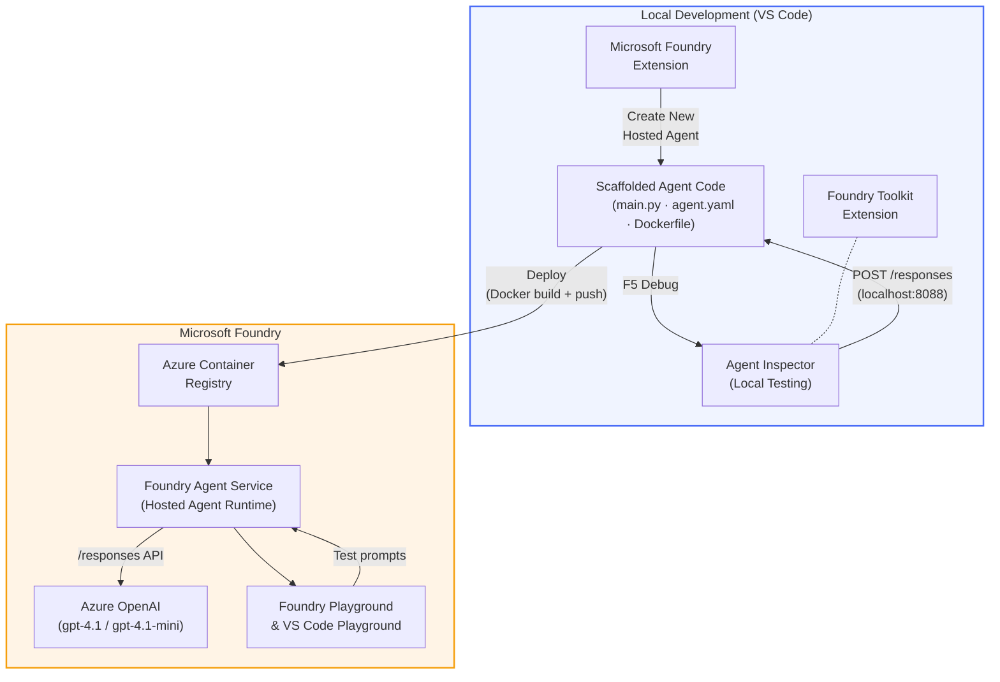

# Foundry Toolkit + Foundry Hosted Agents Workshop

[](https://www.python.org/)
[](https://github.com/microsoft/agents)
[](https://learn.microsoft.com/azure/ai-foundry/agents/concepts/hosted-agents/)
[](https://ai.azure.com/)
[](https://learn.microsoft.com/azure/ai-services/openai/)
[](https://learn.microsoft.com/cli/azure/install-azure-cli)
[](https://learn.microsoft.com/azure/developer/azure-developer-cli/install-azd)
[](https://www.docker.com/)
[](https://marketplace.visualstudio.com/items?itemName=ms-windows-ai-studio.windows-ai-studio)
[](LICENSE)

Build, test, and deploy AI agents to **Microsoft Foundry Agent Service** as **Hosted Agents** - na totally from VS Code using di **Microsoft Foundry extension** and **Foundry Toolkit**.

> **Hosted Agents dey currently for preview.** Supported regions no too plenty - see [region availability](https://learn.microsoft.com/azure/foundry/agents/concepts/hosted-agents#region-availability).

> Di `agent/` folder wey dey each lab na **automatically scaffolded** by di Foundry extension - you go den customize di code, test am for your machine, and deploy.

### 🌐 Multi-Language Support

#### Supported via GitHub Action (Automated & Always Up-to-Date)

<!-- CO-OP TRANSLATOR LANGUAGES TABLE START -->
[Arabic](../ar/README.md) | [Bengali](../bn/README.md) | [Bulgarian](../bg/README.md) | [Burmese (Myanmar)](../my/README.md) | [Chinese (Simplified)](../zh-CN/README.md) | [Chinese (Traditional, Hong Kong)](../zh-HK/README.md) | [Chinese (Traditional, Macau)](../zh-MO/README.md) | [Chinese (Traditional, Taiwan)](../zh-TW/README.md) | [Croatian](../hr/README.md) | [Czech](../cs/README.md) | [Danish](../da/README.md) | [Dutch](../nl/README.md) | [Estonian](../et/README.md) | [Finnish](../fi/README.md) | [French](../fr/README.md) | [German](../de/README.md) | [Greek](../el/README.md) | [Hebrew](../he/README.md) | [Hindi](../hi/README.md) | [Hungarian](../hu/README.md) | [Indonesian](../id/README.md) | [Italian](../it/README.md) | [Japanese](../ja/README.md) | [Kannada](../kn/README.md) | [Khmer](../km/README.md) | [Korean](../ko/README.md) | [Lithuanian](../lt/README.md) | [Malay](../ms/README.md) | [Malayalam](../ml/README.md) | [Marathi](../mr/README.md) | [Nepali](../ne/README.md) | [Nigerian Pidgin](./README.md) | [Norwegian](../no/README.md) | [Persian (Farsi)](../fa/README.md) | [Polish](../pl/README.md) | [Portuguese (Brazil)](../pt-BR/README.md) | [Portuguese (Portugal)](../pt-PT/README.md) | [Punjabi (Gurmukhi)](../pa/README.md) | [Romanian](../ro/README.md) | [Russian](../ru/README.md) | [Serbian (Cyrillic)](../sr/README.md) | [Slovak](../sk/README.md) | [Slovenian](../sl/README.md) | [Spanish](../es/README.md) | [Swahili](../sw/README.md) | [Swedish](../sv/README.md) | [Tagalog (Filipino)](../tl/README.md) | [Tamil](../ta/README.md) | [Telugu](../te/README.md) | [Thai](../th/README.md) | [Turkish](../tr/README.md) | [Ukrainian](../uk/README.md) | [Urdu](../ur/README.md) | [Vietnamese](../vi/README.md)

> **You prefer Clone am for your local?**
>
> This repository get 50+ language translations wey make di download size big. If you want clone without di translations, use sparse checkout:
>
> **Bash / macOS / Linux:**
> ```bash
> git clone --filter=blob:none --sparse https://github.com/microsoft-foundry/Foundry_Toolkit_for_VSCode_Lab.git
> cd Foundry_Toolkit_for_VSCode_Lab
> git sparse-checkout set --no-cone '/*' '!translations' '!translated_images'
> ```
>
> **CMD (Windows):**
> ```cmd
> git clone --filter=blob:none --sparse https://github.com/microsoft-foundry/Foundry_Toolkit_for_VSCode_Lab.git
> cd Foundry_Toolkit_for_VSCode_Lab
> git sparse-checkout set --no-cone "/*" "!translations" "!translated_images"
> ```
>
> Dis one go give you everything wey you need to complete di course quick quick.
<!-- CO-OP TRANSLATOR LANGUAGES TABLE END -->

---

## Architecture


**Flow:** Foundry extension dey scaffold di agent → you go customize code & instructions → test am locally wit Agent Inspector → deploy am for Foundry (Docker image wey dem push go ACR) → verify am for Playground.

---

## Wetin you go build

| Lab | Description | Status |
|-----|-------------|--------|
| **Lab 01 - Single Agent** | Build di **"Explain Like I'm an Executive" Agent**, test am locally, and deploy go Foundry | ✅ Available |
| **Lab 02 - Multi-Agent Workflow** | Build di **"Resume → Job Fit Evaluator"** - 4 agents dey work together to score di resume fit and make learning roadmap | ✅ Available |

---

## Meet di Executive Agent

For dis workshop, you go build di **"Explain Like I'm an Executive" Agent** - na AI agent wey go take technikal wahala talk and translate am into calm, boardroom-ready summaries. Because make we honest, nobody wey dey C-suite wan hear about "thread pool exhaustion caused by synchronous calls introduced in v3.2."

I build dis agent afta one too many times wey my perfect post-mortem report get answer: *"So... di website down or no be so?"*

### How e dey work

You go give am technikal update. E go return executive summary - three bullet points, no jargon, no stack traces, no fear or yawa. Just **wetin happen**, **business impact**, and **next step**.

### See am for action

**You talk:**  
> "The API latency increased due to thread pool exhaustion caused by synchronous calls introduced in v3.2."

**Di agent go answer:**

> **Executive Summary:**  
> - **Wetin happen:** After di latest release, di system slow down.  
> - **Business impact:** Some users experience delay wen dem dey use di service.  
> - **Next step:** Dem don rollback di change and dem dey prepare fix before dem go deploy again.

### Why dis agent?

Na dead-simple, single-purpose agent - perfect make you learn how the hosted agent workflow dey from beginning to end without yawa with complex tool chains. And true true? Every engineering team fit use one like dis.

---

## Workshop structure

```
📂 Foundry_Toolkit_for_VSCode_Lab/
├── 📄 README.md                      ← You are here
├── 📂 ExecutiveAgent/                ← Standalone hosted agent project
│   ├── agent.yaml
│   ├── Dockerfile
│   ├── main.py
│   └── requirements.txt
└── 📂 workshop/
    ├── 📂 lab01-single-agent/        ← Full lab: docs + agent code
    │   ├── README.md                 ← Hands-on lab instructions
    │   ├── 📂 docs/                  ← Step-by-step tutorial modules
    │   │   ├── 00-prerequisites.md
    │   │   ├── 01-install-foundry-toolkit.md
    │   │   ├── 02-create-foundry-project.md
    │   │   ├── 03-create-hosted-agent.md
    │   │   ├── 04-configure-and-code.md
    │   │   ├── 05-test-locally.md
    │   │   ├── 06-deploy-to-foundry.md
    │   │   ├── 07-verify-in-playground.md
    │   │   └── 08-troubleshooting.md
    │   └── 📂 agent/                 ← Reference solution (auto-scaffolded by Foundry extension)
    │       ├── agent.yaml
    │       ├── Dockerfile
    │       ├── main.py
    │       └── requirements.txt
    └── 📂 lab02-multi-agent/         ← Resume → Job Fit Evaluator
        ├── README.md                 ← Hands-on lab instructions (end-to-end)
        ├── 📂 docs/                  ← Step-by-step tutorial modules
        │   ├── 00-prerequisites.md
        │   ├── 01-understand-multi-agent.md
        │   ├── 02-scaffold-multi-agent.md
        │   ├── 03-configure-agents.md
        │   ├── 04-orchestration-patterns.md
        │   ├── 05-test-locally.md
        │   ├── 06-deploy-to-foundry.md
        │   ├── 07-verify-in-playground.md
        │   └── 08-troubleshooting.md
        └── 📂 PersonalCareerCopilot/ ← Reference solution (multi-agent workflow)
            ├── agent.yaml
            ├── Dockerfile
            ├── main.py
            └── requirements.txt
```

> **Note:** Di `agent/` folder inside each lab na wetin di **Microsoft Foundry extension** generate wen you run `Microsoft Foundry: Create a New Hosted Agent` from di Command Palette. Di files go den get customized with your agent instructions, tools, and config. Lab 01 go guide you how to recreate am from scratch.

---

## How to start

### 1. Clone di repository

```bash
git clone https://github.com/microsoft-foundry/Foundry_Toolkit_for_VSCode_Lab.git
cd Foundry_Toolkit_for_VSCode_Lab
```

### 2. Set up Python virtual environment

```bash
python -m venv venv
```

Activate am:

- **Windows (PowerShell):**  
  ```powershell
  .\venv\Scripts\Activate.ps1
  ```
- **macOS / Linux:**  
  ```bash
  source venv/bin/activate
  ```

### 3. Install di dependencies

```bash
pip install -r workshop/lab01-single-agent/agent/requirements.txt
```

### 4. Configure environment variables

Copy di example `.env` file inside di agent folder and fill am with your values:

```bash
cp workshop/lab01-single-agent/agent/.env.example workshop/lab01-single-agent/agent/.env
```

Edit `workshop/lab01-single-agent/agent/.env`:

```env
AZURE_AI_PROJECT_ENDPOINT=https://<your-account>.services.ai.azure.com/api/projects/<your-project>
MODEL_DEPLOYMENT_NAME=<your-model-deployment-name>
```

### 5. Follow di workshop labs

Each lab get imself modules. Start with **Lab 01** to learn di basics, den move go **Lab 02** for multi-agent workflows.

#### Lab 01 - Single Agent ([full instructions](workshop/lab01-single-agent/README.md))

| # | Module | Link |
|---|--------|------|
| 1 | Read di prerequisites | [00-prerequisites.md](workshop/lab01-single-agent/docs/00-prerequisites.md) |
| 2 | Install Foundry Toolkit & Foundry extension | [01-install-foundry-toolkit.md](workshop/lab01-single-agent/docs/01-install-foundry-toolkit.md) |
| 3 | Create Foundry project | [02-create-foundry-project.md](workshop/lab01-single-agent/docs/02-create-foundry-project.md) |
| 4 | Create hosted agent | [03-create-hosted-agent.md](workshop/lab01-single-agent/docs/03-create-hosted-agent.md) |
| 5 | Configure instructions & environment | [04-configure-and-code.md](workshop/lab01-single-agent/docs/04-configure-and-code.md) |
| 6 | Test locally | [05-test-locally.md](workshop/lab01-single-agent/docs/05-test-locally.md) |
| 7 | Deploy to Foundry | [06-deploy-to-foundry.md](workshop/lab01-single-agent/docs/06-deploy-to-foundry.md) |
| 8 | Verify for playground | [07-verify-in-playground.md](workshop/lab01-single-agent/docs/07-verify-in-playground.md) |
| 9 | Troubleshooting | [08-troubleshooting.md](workshop/lab01-single-agent/docs/08-troubleshooting.md) |

#### Lab 02 - Multi-Agent Workflow ([full instructions](workshop/lab02-multi-agent/README.md))

| # | Module | Link |
|---|--------|------|
| 1 | Prerequisites (Lab 02) | [00-prerequisites.md](workshop/lab02-multi-agent/docs/00-prerequisites.md) |
| 2 | Understand multi-agent architecture | [01-understand-multi-agent.md](workshop/lab02-multi-agent/docs/01-understand-multi-agent.md) |
| 3 | Scaffold di multi-agent project | [02-scaffold-multi-agent.md](workshop/lab02-multi-agent/docs/02-scaffold-multi-agent.md) |
| 4 | Configure agents & environment | [03-configure-agents.md](workshop/lab02-multi-agent/docs/03-configure-agents.md) |
| 5 | Orchestration patterns | [04-orchestration-patterns.md](workshop/lab02-multi-agent/docs/04-orchestration-patterns.md) |
| 6 | Test locally (multi-agent) | [05-test-locally.md](workshop/lab02-multi-agent/docs/05-test-locally.md) |
| 7 | Deploy to Foundry | [06-deploy-to-foundry.md](workshop/lab02-multi-agent/docs/06-deploy-to-foundry.md) |
| 8 | Verify for playground | [07-verify-in-playground.md](workshop/lab02-multi-agent/docs/07-verify-in-playground.md) |
| 9 | Troubleshooting (multi-agent) | [08-troubleshooting.md](workshop/lab02-multi-agent/docs/08-troubleshooting.md) |

---

## Maintainer

<table>
<tr>
    <td align="center"><a href="https://github.com/ShivamGoyal03">
        <br />
        <sub><b>Shivam Goyal</b></sub>
    </a><br />
    </td>
</tr>
</table>

---

## Required permissions (quick reference)

| Scenario | Required roles |
|----------|---------------|
| Create new Foundry project | **Azure AI Owner** for Foundry resource |
| Deploy to existing project (new resources) | **Azure AI Owner** + **Contributor** for subscription |
| Deploy to fully configured project | **Reader** for account + **Azure AI User** for project |

> **Important:** Azure `Owner` and `Contributor` roles only get *management* permission, no *development* (data action) permission. You need **Azure AI User** or **Azure AI Owner** to build and deploy agents.

---

## References

- [Quickstart: Deploy your first hosted agent (VS Code)](https://learn.microsoft.com/azure/foundry/agents/quickstarts/quickstart-hosted-agent)
- [Wetin be hosted agents?](https://learn.microsoft.com/azure/foundry/agents/concepts/hosted-agents)
- [Create hosted agent workflows for VS Code](https://learn.microsoft.com/azure/foundry/agents/how-to/vs-code-agents-workflow-pro-code)
- [Deploy hosted agent](https://learn.microsoft.com/azure/foundry/agents/how-to/deploy-hosted-agent)
- [RBAC for Microsoft Foundry](https://learn.microsoft.com/azure/foundry/concepts/rbac-foundry)
- [Architecture Review Agent Sample](https://github.com/Azure-Samples/agent-architecture-review-sample) - Real-life hosted agent wit MCP tools, Excalidraw diagrams, and dual deployment

---


## License

[MIT](../../LICENSE)

---

<!-- CO-OP TRANSLATOR DISCLAIMER START -->
**Disclaimer**:  
Dis document don translate wit AI translation service [Co-op Translator](https://github.com/Azure/co-op-translator). Even tho we dey try make am correct, abeg sabi say automated translations fit get error or no too correct. Di original document for dia own language na di correct one wey you suppose trust. For important tin dem, na professional human translation dem recommend. We no go responsible for any yawa or wrong understanding wey fit happen because of dis translation.
<!-- CO-OP TRANSLATOR DISCLAIMER END -->