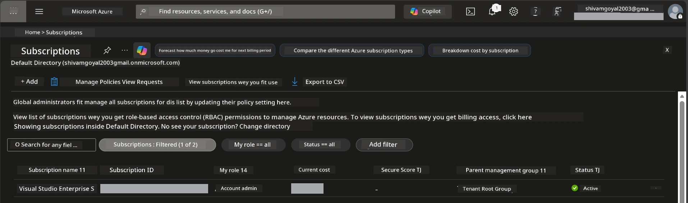

# Module 0 - Prerequisites

Before you start dis workshop, make sure say you get all di tools, access, and environment wey you go need ready. Follow every step wey dey below - no skip am.

---

## 1. Azure account & subscription

### 1.1 Create or check your Azure subscription

1. Open browser come go [https://azure.microsoft.com/free/](https://azure.microsoft.com/free/).
2. If you no get Azure account, click **Start free** come follow di sign-up process. You go need Microsoft account (or make one) plus credit card for identity check.
3. If you get account already, sign in for [https://portal.azure.com](https://portal.azure.com).
4. For di Portal, click di **Subscriptions** side for left navigation (or search for "Subscriptions" for top search box).
5. Make sure say you see at least one **Active** subscription. Write down di **Subscription ID** - you go need am later.



### 1.2 Understand di RBAC roles wey you need

[Hosted Agent](https://learn.microsoft.com/azure/foundry/agents/concepts/hosted-agents) deployment need **data action** permissions wey standard Azure `Owner` and `Contributor` roles no get. You go need one of dis [role combinations](https://learn.microsoft.com/azure/foundry/concepts/rbac-foundry#built-in-roles):

| Scenario | Required roles | Where to assign them |
|----------|---------------|----------------------|
| Create new Foundry project | **Azure AI Owner** for Foundry resource | Foundry resource inside Azure Portal |
| Deploy to existing project (new resources) | **Azure AI Owner** + **Contributor** for subscription | Subscription + Foundry resource |
| Deploy to fully configured project | **Reader** for account + **Azure AI User** for project | Account + Project for Azure Portal |

> **Important:** Azure `Owner` and `Contributor` roles na only *management* permissions dem cover (ARM operations). You need [**Azure AI User**](https://learn.microsoft.com/azure/foundry/concepts/rbac-foundry#built-in-roles) (or higher) for *data actions* like `agents/write` wey necessary to create and deploy agents. You go assign these roles for [Module 2](02-create-foundry-project.md).

---

## 2. Install local tools

Install every tool wey dey this list. After you install am, check say e dey work by running di check command.

### 2.1 Visual Studio Code

1. Go [https://code.visualstudio.com/](https://code.visualstudio.com/).
2. Download installer for your OS (Windows/macOS/Linux).
3. Run di installer with default settings.
4. Open VS Code come confirm say e open well.

### 2.2 Python 3.10+

1. Go [https://www.python.org/downloads/](https://www.python.org/downloads/).
2. Download Python 3.10 or higher (3.12+ dey recommended).
3. **Windows:** When you dey install, check **"Add Python to PATH"** for di first screen.
4. Open terminal come verify:

   ```powershell
   python --version
   ```

   Expected output: `Python 3.10.x` or higher.

### 2.3 Azure CLI

1. Go [https://learn.microsoft.com/cli/azure/install-azure-cli](https://learn.microsoft.com/cli/azure/install-azure-cli).
2. Follow installation instructions for your OS.
3. Verify:

   ```powershell
   az --version
   ```

   Expected: `azure-cli 2.80.0` or higher.

4. Sign in:

   ```powershell
   az login
   ```

### 2.4 Azure Developer CLI (azd)

1. Go [https://learn.microsoft.com/azure/developer/azure-developer-cli/install-azd](https://learn.microsoft.com/azure/developer/azure-developer-cli/install-azd).
2. Follow installation instructions for your OS. If you dey Windows:

   ```powershell
   winget install microsoft.azd
   ```

3. Verify:

   ```powershell
   azd version
   ```

   Expected: `azd version 1.x.x` or higher.

4. Sign in:

   ```powershell
   azd auth login
   ```

### 2.5 Docker Desktop (optional)

Docker dey only needed if you want build and test container image locally before deployment. The Foundry extension dey handle container builds automatically during deployment.

1. Go [https://docs.docker.com/get-docker/](https://docs.docker.com/get-docker/).
2. Download and install Docker Desktop for your OS.
3. **Windows:** Make sure say WSL 2 backend dey selected during installation.
4. Start Docker Desktop and wait till di icon for system tray show **"Docker Desktop is running"**.
5. Open terminal come verify:

   ```powershell
   docker info
   ```

   Dis one suppose show Docker system info without error. If you see `Cannot connect to the Docker daemon`, wait small more seconds make Docker fully start.

---

## 3. Install VS Code extensions

You need three extensions. Install dem **before** workshop start.

### 3.1 Microsoft Foundry for VS Code

1. Open VS Code.
2. Press `Ctrl+Shift+X` to open Extensions panel.
3. For search box, type **"Microsoft Foundry"**.
4. Find **Microsoft Foundry for Visual Studio Code** (publisher: Microsoft, ID: `TeamsDevApp.vscode-ai-foundry`).
5. Click **Install**.
6. After installation, you go see **Microsoft Foundry** icon for Activity Bar (left sidebar).

### 3.2 Foundry Toolkit

1. For Extensions panel (`Ctrl+Shift+X`), search **"Foundry Toolkit"**.
2. Find **Foundry Toolkit** (publisher: Microsoft, ID: `ms-windows-ai-studio.windows-ai-studio`).
3. Click **Install**.
4. **Foundry Toolkit** icon go show for Activity Bar.

### 3.3 Python

1. For Extensions panel, search **"Python"**.
2. Find **Python** (publisher: Microsoft, ID: `ms-python.python`).
3. Click **Install**.

---

## 4. Sign into Azure from VS Code

The [Microsoft Agent Framework](https://learn.microsoft.com/agent-framework/overview/) dey use [`DefaultAzureCredential`](https://learn.microsoft.com/azure/developer/python/sdk/authentication/credential-chains#defaultazurecredential-overview) for authentication. You must sign into Azure for VS Code.

### 4.1 Sign in via VS Code

1. Look bottom-left corner for VS Code, click **Accounts** icon (person silhouette).
2. Click **Sign in to use Microsoft Foundry** (or **Sign in with Azure**).
3. Browser window go open - sign in with Azure account wey get subscription access.
4. Come back to VS Code. You go see your account name for bottom-left.

### 4.2 (Optional) Sign in via Azure CLI

If you install Azure CLI and you like CLI-based auth:

```powershell
az login
```

E go open browser for sign-in. After you sign in, set the correct subscription:

```powershell
az account set --subscription "<your-subscription-id>"
```

Verify:

```powershell
az account show --query "{name:name, id:id, state:state}" --output table
```

You go see your subscription name, ID, and state = `Enabled`.

### 4.3 (Alternative) Service principal auth

For CI/CD or shared environment, set these environment variables instead:

```powershell
$env:AZURE_TENANT_ID = "<your-tenant-id>"
$env:AZURE_CLIENT_ID = "<your-client-id>"
$env:AZURE_CLIENT_SECRET = "<your-client-secret>"
```

---

## 5. Preview limitations

Before you continue, know these current limits:

- [**Hosted Agents**](https://learn.microsoft.com/azure/foundry/agents/concepts/hosted-agents) still dey **public preview** - no recommend am for production work.
- **Supported regions dey limited** - check [region availability](https://learn.microsoft.com/azure/foundry/agents/concepts/hosted-agents#region-availability) before you create resources. If you choose unsupported region, deployment go fail.
- The `azure-ai-agentserver-agentframework` package still pre-release (`1.0.0b16`) - APIs fit change.
- Scale limits: hosted agents fit support 0-5 replicas (including scale-to-zero).

---

## 6. Preflight checklist

Run through every item for di list. If any step fail, go back correct am before you continue.

- [ ] VS Code open with no errors
- [ ] Python 3.10+ dey your PATH (`python --version` print `3.10.x` or higher)
- [ ] Azure CLI dey installed (`az --version` print `2.80.0` or higher)
- [ ] Azure Developer CLI installed (`azd version` print version info)
- [ ] Microsoft Foundry extension installed (icon dey Activity Bar)
- [ ] Foundry Toolkit extension installed (icon dey Activity Bar)
- [ ] Python extension installed
- [ ] You dey signed into Azure for VS Code (check Accounts icon, bottom-left)
- [ ] `az account show` show your subscription
- [ ] (Optional) Docker Desktop dey run (`docker info` show system info without error)

### Checkpoint

Open VS Code Activity Bar come confirm say you fit see both **Foundry Toolkit** and **Microsoft Foundry** sidebar views. Click each one come check dem load without error.

---

**Next:** [01 - Install Foundry Toolkit & Foundry Extension →](01-install-foundry-toolkit.md)

---

<!-- CO-OP TRANSLATOR DISCLAIMER START -->
**Disclaimer**:  
Dis document don translate wit AI translation service [Co-op Translator](https://github.com/Azure/co-op-translator). Even tho we dey try make am correct, abeg sabi say automated translations fit get some errors or mistakes. Di original document wey dey im native language na di correct source. For important tori dem, na professional human translation you suppose use. We no go carry any wahala or misunderstandings wey fit show because of dis translation.
<!-- CO-OP TRANSLATOR DISCLAIMER END -->