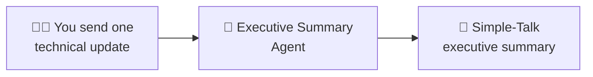

# Module 0 - Introdakshon

⏱️ ~10 min

> [!WARNING]
> **Preview & Limitations:** [Hosted Agents](https://learn.microsoft.com/azure/foundry/agents/concepts/hosted-agents) di currently for **public preview** - e no good for production workloads. Make you sabi dis one:
> - **Supported regions dem limited** - check [region availability](https://learn.microsoft.com/azure/foundry/agents/concepts/hosted-agents#region-availability) before you create resources. If you choose place wey no dey supported, deployment go fail.
> - The `azure-ai-agentserver-agentframework` package still dey pre-release - APIs fit change between versions.
> - Scale limits: hosted agents dey support 0–5 replicas (including scale-to-zero).
> - Some features wey dey this workshop fit change as service dey waka go GA.

## Wetin you go build

For this workshop, you go build **"Explain Like I'm an Executive"** agent - na hosted AI agent wey go take complex technical update dem and rewrite am as simple English executive summaries.

```mermaid
flowchart LR
    A["🧑‍💻 You send one\ntechnical update"] --> B["🤖 Executive Summary\nAgent"]
    B --> C["📝 Simple-Talk\nexecutive summary"]
```

**The agent dey use:**
- **Microsoft Agent Framework** - for agent logic and structure
- **Foundry Toolkit for VS Code** - to scaffold, test am for your machine, and deploy
- **AI model** (ex: `gpt-4.1-mini/gpt-5-mini`) - to generate the summaries

By the end for this lab, you go get working agent wey you fit test for your machine via Agent Inspector, and if you want you fit deploy am for cloud.

---

## Wetin be hosted agents?

**Hosted agent** na AI agent wey dey run as managed service inside Microsoft Foundry. Instead of you dey manage your own server, you go package your agent code inside container and Foundry go manage scaling, hosting, and e go expose am via normal HTTP endpoint.

| Concept | Wetin e mean |
|---------|--------------|
| **Agent** | Na your Python code wey dey receive user message, call AI model, and return structured response |
| **Hosted** | Foundry dey run your container for you - no VMs, no Kubernetes, no infrastructure to manage |
| **Responses protocol** | Na normal HTTP API (`POST /responses`) wey any client fit call to talk with your agent |
| **Agent Inspector** | Na local testing UI (wey dey inside Foundry Toolkit) wey allow you to chat with your agent before you deploy am |

Inside this workshop, you go from zero go complete hosted agent - or you fit stop for local testing if you want.

---

## Choose your path

> ⚠️ **Pick one path before you continue.** Your choice go decide which tools you go install and which modules you go do. You fit change from Path B → Path A later if you get subscription.

<strong>🅰️ Path A - Azure cloud (you need Azure subscription)</strong>

| | Details |
|---|---|
| **Who na for?** | You get active Azure subscription and fit create Foundry resources |
| **Model** | Azure OpenAI via Foundry (ex: `gpt-4.1-mini/gpt-5-mini`) |
| **Modules dem cover** | All modules (00–07) |
| **Deploy to cloud?** | ✅ Yes - full complete deployment |

<strong>🅱️ Path B - Local / free-tier (no need Azure subscription)</strong>

| | Details |
|---|---|
| **Who na for?** | MVPs, students, or anybody wey no get Azure |
| **Model** | **Foundry Local** (free, e run for your machine) |
| **Modules dem cover** | Modules 00–04 (skip deploy & cloud verify) |
| **Deploy to cloud?** | ❌ No - only local testing via Agent Inspector |

---

## All paths: Tools wey you need

Install all the tools wey dey below. After you install, check say e dey work by running the verify command.

| # | Tool | Version | Install | Verify (Wetn you go see) |
|---|------|---------|---------|---------------------------|
| 1 | **Visual Studio Code** | Latest | [code.visualstudio.com](https://code.visualstudio.com/) | E go open without error |
| 2 | **Python** | 3.12 or higher | [python.org/downloads](https://www.python.org/downloads/) | `python --version` → `Python 3.12.x` |
| 3 | **Foundry Toolkit for VS Code** | Latest | Extension ID: `ms-windows-ai-studio.windows-ai-studio` | Foundry icon dey Activity Bar |
| 4 | **Python extension for VS Code** | Latest | Extension ID: `ms-python.python` | E go dey inside Extensions panel |

> [!TIP]
> **Pro-tips for installation:**
> - **Python PATH (Windows):** Always choose **"Add Python to PATH"** for the first screen of Python installer. If no do dis one, your terminal no go fit find `python`.
> - **Multiple Python versions:** If you get both Python 3.10 and 3.12 installed, use `python3.12 -m venv .venv` make sure say na correct version your virtual environment go use.
> - **Docker WSL 2 (Windows):** When you dey install Docker Desktop, make sure say you select **WSL 2 backend**. Docker with Hyper-V dey slow and e fit cause wahala with Foundry container builds.
> - **Docker no dey start?** Wait 30–60 seconds after you start Docker Desktop. Run `docker info` - if you see "Cannot connect to the Docker daemon," Docker still dey initialize.
> - **VS Code extensions no dey load?** After you install extensions, reload the window: `Ctrl+Shift+P` → `Developer: Reload Window`.

> **Windows users:** Make sure say you check **"Add Python to PATH"** for Python installation.

**Next:** [01 - Setup →](01-setup.md)

---

<!-- CO-OP TRANSLATOR DISCLAIMER START -->
**Disclaimer**:
Dis document don translate wit AI translation service [Co-op Translator](https://github.com/Azure/co-op-translator). Even tho we dey try make am correct, abeg make you know say automated translation fit get errors or mistakes. Di original document for dia own language na im be di correct source. For important info, make person wey sabi human translation do am. We no go responsible for any misunderstanding or wrong understanding wey fit happen because of dis translation.
<!-- CO-OP TRANSLATOR DISCLAIMER END -->