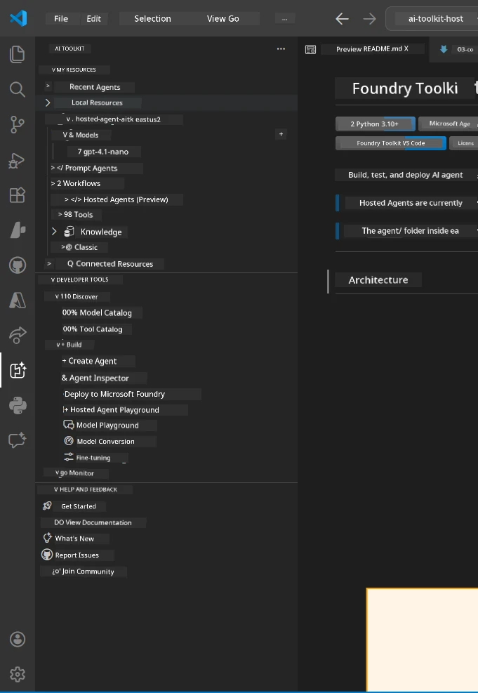
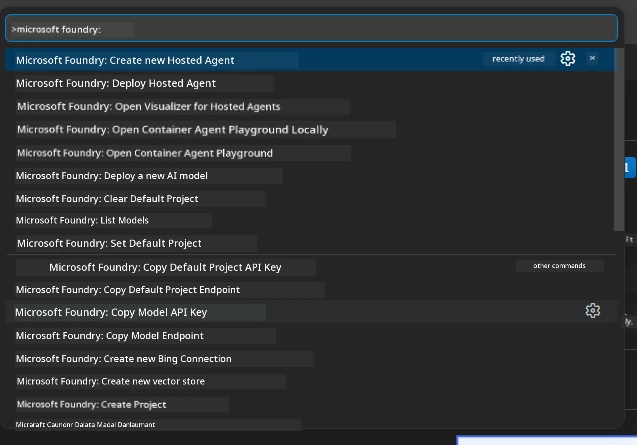

# Module 1 - Install Foundry Toolkit & Foundry Extension

Dis module go show you how to install and check di two main VS Code extensions for dis workshop. If you don don install dem during [Module 0](00-prerequisites.md), use dis module make sure say dem dey work well.

---

## Step 1: Install di Microsoft Foundry Extension

Di **Microsoft Foundry for VS Code** extension na di main tool wey you go use create Foundry projects, deploy models, scaffold hosted agents, and deploy direct from VS Code.

1. Open VS Code.
2. Press `Ctrl+Shift+X` to open di **Extensions** panel.
3. For di search box wey dey top, type: **Microsoft Foundry**
4. Find di result wey get di title **Microsoft Foundry for Visual Studio Code**.
   - Publisher: **Microsoft**
   - Extension ID: `TeamsDevApp.vscode-ai-foundry`
5. Click di **Install** button.
6. Wait make di installation complete (you go see small progress indicator).
7. After installation, look di **Activity Bar** (di vertical icon bar for di left side of VS Code). You go see new **Microsoft Foundry** icon (e be like diamond/AI icon).
8. Click di **Microsoft Foundry** icon to open im sidebar view. You go see sections for:
   - **Resources** (or Projects)
   - **Agents**
   - **Models**

> **If di icon no show:** Try reload VS Code (`Ctrl+Shift+P` → `Developer: Reload Window`).

---

## Step 2: Install di Foundry Toolkit Extension

Di **Foundry Toolkit** extension get di [**Agent Inspector**](https://learn.microsoft.com/azure/foundry/agents/how-to/vs-code-agents-workflow-pro-code) - na visual interface wey you fit use test and debug agents locally - plus playground, model management, and evaluation tools.

1. For Extensions panel (`Ctrl+Shift+X`), clear di search box and type: **Foundry Toolkit**
2. Find **Foundry Toolkit** for di results.
   - Publisher: **Microsoft**
   - Extension ID: `ms-windows-ai-studio.windows-ai-studio`
3. Click **Install**.
4. After installation, di **Foundry Toolkit** icon go appear for Activity Bar (e be like robot/sparkle icon).
5. Click di **Foundry Toolkit** icon to open im sidebar view. You go see di Foundry Toolkit welcome screen with options for:
   - **Models**
   - **Playground**
   - **Agents**

---

## Step 3: Verify say both extensions dey work

### 3.1 Verify Microsoft Foundry Extension

1. Click di **Microsoft Foundry** icon for Activity Bar.
2. If you signed into Azure (from Module 0), you go see your projects list under **Resources**.
3. If e ask you to sign in, click **Sign in** and follow di authentication flow.
4. Confirm say you fit see di sidebar without errors.

### 3.2 Verify Foundry Toolkit Extension

1. Click di **Foundry Toolkit** icon for Activity Bar.
2. Confirm say di welcome view or main panel open without errors.
3. You no need configure anything now - we go use di Agent Inspector for [Module 5](05-test-locally.md).

### 3.3 Verify using Command Palette

1. Press `Ctrl+Shift+P` to open di Command Palette.
2. Type **"Microsoft Foundry"** - you go see commands like:
   - `Microsoft Foundry: Create a New Hosted Agent`
   - `Microsoft Foundry: Deploy Hosted Agent`
   - `Microsoft Foundry: Open Model Catalog`
3. Press `Escape` to close di Command Palette.
4. Open di Command Palette again and type **"Foundry Toolkit"** - you go see commands like:
   - `Foundry Toolkit: Open Agent Inspector`

> If you no see these commands, e fit mean say di extensions no install well. Try uninstall and install dem again.

---

## Wetin these extensions dey do for dis workshop

| Extension | Wetin e dey do | When you go use am |
|-----------|----------------|--------------------|
| **Microsoft Foundry for VS Code** | Create Foundry projects, deploy models, **scaffold [hosted agents](https://learn.microsoft.com/azure/foundry/agents/concepts/hosted-agents)** (auto-generate `agent.yaml`, `main.py`, `Dockerfile`, `requirements.txt`), deploy to [Foundry Agent Service](https://learn.microsoft.com/azure/foundry/agents/overview) | Modules 2, 3, 6, 7 |
| **Foundry Toolkit** | Agent Inspector for local testing/debugging, playground UI, model management | Modules 5, 7 |

> **Di Foundry extension na di most important tool for dis workshop.** E dey handle di whole lifecycle: scaffold → configure → deploy → verify. Di Foundry Toolkit help am by giving di visual Agent Inspector for local testing.

---

### Checkpoint

- [ ] Microsoft Foundry icon dey visible for Activity Bar
- [ ] Click am open di sidebar without errors
- [ ] Foundry Toolkit icon dey visible for Activity Bar
- [ ] Click am open di sidebar without errors
- [ ] `Ctrl+Shift+P` → type "Microsoft Foundry" show available commands
- [ ] `Ctrl+Shift+P` → type "Foundry Toolkit" show available commands

---

**Previous:** [00 - Prerequisites](00-prerequisites.md) · **Next:** [02 - Create Foundry Project →](02-create-foundry-project.md)

---

<!-- CO-OP TRANSLATOR DISCLAIMER START -->
**Disclaimer**:  
Dis document don translate wit AI translation service [Co-op Translator](https://github.com/Azure/co-op-translator). Even tho we dey try make am correct, abeg sabi say automated translations fit get some errors or wahala. The original document wey e dey for im own language na di correct and trusted source. For important matter, make person wey sabi translate am well well do am. We no go take responsibility for any gbege or wrong understanding wey fit follow dis translation.
<!-- CO-OP TRANSLATOR DISCLAIMER END -->