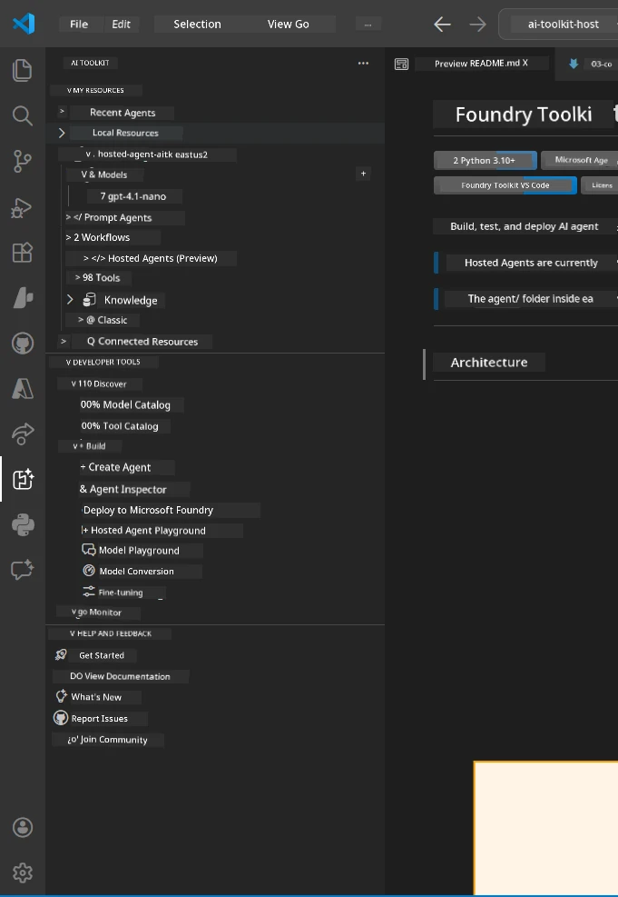
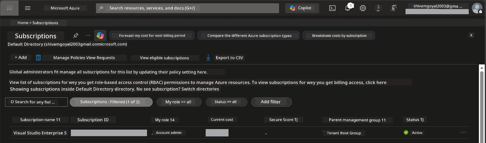
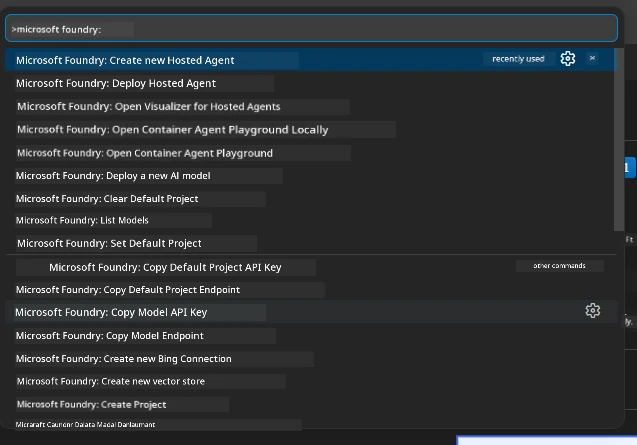
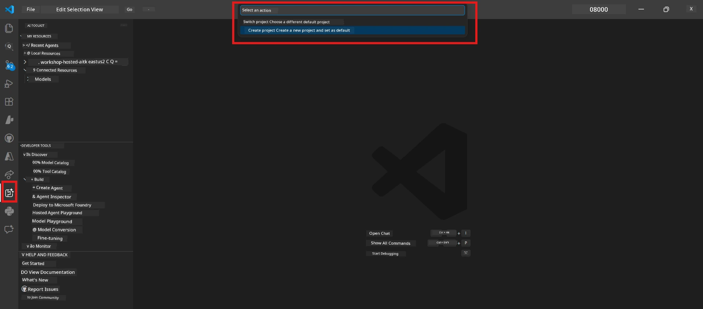
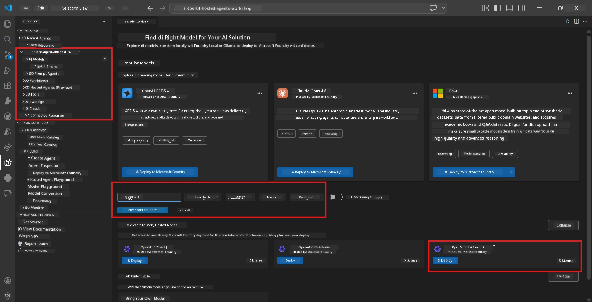

# Setup: Extension, Project & Model

⏱️ ~15 min

For dis module, you go install and check the Foundry Toolkit extension, create (or connect to) Foundry project, and deploy model wey your agent go use.

## Step 1: Install Foundry Toolkit

**Foundry Toolkit for VS Code** na di main extension for dis workshop. E dey provide project creation, model deployment, agent scaffolding, local testing (Agent Inspector), and cloud deployment - all from VS Code.

1. Open VS Code then press `Ctrl+Shift+X` make e open **Extensions** panel.
2. Search for **Foundry Toolkit**.
3. Install **Foundry Toolkit for VS Code** (Publisher: Microsoft, ID: `ms-windows-ai-studio.windows-ai-studio`).
4. After you don install am, the **Foundry Toolkit** icon go show for Activity Bar (left sidebar).

> *Note: The Activity Bar fit show "AI TOOLKIT" for older extension versions. Di functionality na di same.*



## Step 2: Set up based on your access

> **Choose your path:** Open di section wey match your setup. You only need to complete **one** path.

<details>
<summary><strong>🅰️ Path A - Azure cloud (need Azure subscription)</strong></summary>

### Azure CLI

1. Install from [learn.microsoft.com/cli/azure/install-azure-cli](https://learn.microsoft.com/cli/azure/install-azure-cli).
2. Verify: `az --version` (expect 2.80.0+).
3. Sign in: `az login`

### Authentication Options

Di [Microsoft Agent Framework](https://learn.microsoft.com/agent-framework/overview/) dey use [`DefaultAzureCredential`](https://learn.microsoft.com/azure/developer/python/sdk/authentication/credential-chains#defaultazurecredential-overview) wey dey try plenti authentication methods one by one. Choose di one wey fit your environment:

#### Option 1: VS Code Accounts (recommended for workshops)
1. Click di **Accounts** icon (person silhouette) for bottom-left corner for VS Code.
2. Select **Sign in to use Microsoft Foundry** (or **Sign in with Azure**).
3. Browser go open - sign in with di Azure account wey get access to your subscription.
4. Go back to VS Code. You suppose see your account name for bottom-left.

#### Option 2: Azure CLI
```bash
az login
az account set --subscription "<your-subscription-id>"
```

#### Option 3: Service Principal (Enterprise/CI)
For locked-down environments or CI/CD pipelines, set these environment variables for your `.env` file:
```env
AZURE_TENANT_ID=<your-tenant-id>
AZURE_CLIENT_ID=<your-client-id>
AZURE_CLIENT_SECRET=<your-client-secret>
```

> **How `DefaultAzureCredential` dey work:** E go try environment variables first, then managed identity, then VS Code sign-in, then Azure CLI - and e go use di one wey succeed first. See [credential chain docs](https://learn.microsoft.com/azure/developer/python/sdk/authentication/credential-chains#defaultazurecredential-overview).

### Azure Developer CLI (azd)

1. Install: `winget install microsoft.azd` (Windows) or see [install docs](https://learn.microsoft.com/azure/developer/azure-developer-cli/install-azd).
2. Verify: `azd version`
3. Sign in: `azd auth login`

### Docker Desktop (optional)

Docker na only if you wan build containers locally. The Foundry extension go handle builds automatically during deployment.

1. Install from [docs.docker.com/get-docker](https://docs.docker.com/get-docker/).
2. Verify: `docker info`

### Azure subscription & RBAC

1. Sign in for [portal.azure.com](https://portal.azure.com).
2. Go to **Subscriptions** and confirm say at least one dey **Active**.
3. Write down your **Subscription ID** - you go need am for Module 01.



#### RBAC Scenario Table

[Hosted Agent](https://learn.microsoft.com/azure/foundry/agents/concepts/hosted-agents) deployment need **data action** permissions wey normal Azure `Owner` and `Contributor` roles no get. Use di table below to know di roles wey you need:

| Scenario | Roles wey dey required | Where to assign am |
|----------|--------------|----------------------|
| Create new Foundry project | **Azure AI Owner** on Foundry resource | Foundry resource for Azure Portal |
| Deploy to existing project (new resources) | **Azure AI Owner** + **Contributor** on subscription | Subscription + Foundry resource |
| Deploy to fully configured project | **Reader** on account + **Azure AI User** on project | Account + Project for Azure Portal |
| Local testing only (no deployment) | **Azure AI User** on project | Project for Azure Portal |

> **Important:** Azure `Owner` and `Contributor` roles na only for *management* permissions (ARM operations). You need [**Azure AI User**](https://learn.microsoft.com/azure/foundry/concepts/rbac-foundry#built-in-roles) (or higher) for *data actions* like `agents/write` wey na to create and deploy agents.

## Connect or create a Foundry project



1. Press `Ctrl+Shift+P` → type **Foundry Toolkit: Create Project** → select am.
2. Select your **Azure subscription** from di dropdown.
3. Select or create **resource group** (example: `rg-hosted-agents-workshop`).
4. Select **region** wey sabi support hosted agents: `East US`, `West US 2`, or `Sweden Central`. See [region availability](https://learn.microsoft.com/azure/foundry/agents/concepts/hosted-agents#region-availability).
5. Enter project name (example: `workshop-agents`).
6. Wait 2–5 minutes for e to provision. Progress notification go show for VS Code.
7. When e finish, your project go show for **Foundry Toolkit** sidebar under **MY RESOURCES**.



## Deploy a model & assign RBAC

Your hosted agent need one AI model to generate responses.

#### Model Selection Matrix
Depending on your needs, you fit choose from diff model tiers:

| Model | Best for | Cost | Notes |
|-------|---------|------|-------|
| `gpt-4.1` | High-quality, nuanced responses | Higher | Best results, recommended for final testing |
| `gpt-4.1-mini/gpt-5-mini` | Fast iteration, lower cost | Lower | Good for workshop development and quick testing |
| `gpt-4.1-nano` | Lightweight tasks | Lowest | Most cost-effective, but simpler responses |

1. Press `Ctrl+Shift+P` → **Foundry Toolkit: Open Model Catalog** (or click **Model Catalog** for sidebar under DEVELOPER TOOLS → Discover).
2. Search for **gpt-4.1** for catalog.
3. Find **OpenAI GPT-4.1-mini** (or `gpt-5-mini` for better quality) then click **Deploy**.



4. For deployment config:
  - **Deployment name:** Make you leave am default or enter custom name. **Remember dis name.**
  - **Target:** Select **Deploy to Foundry Toolkit** → choose your project.
5. Click **Deploy** and wait 1–3 minutes.

> **Recommendation:** Use `gpt-4.1-mini/gpt-5-mini` for workshop - na fast, affordable, and e dey give good results.

### Note your values

After you deploy, write down these two values (you go need am for Module 03):

| Value | Where to find am |
|-------|-----------------|
| **Project endpoint** | Click your project for sidebar → detail view go show the URL (example: `https://<account>.services.ai.azure.com/api/projects/<project>`) |
| **Model deployment name** | Expand project → **Models** → di name next to your deployed model (example: `gpt-4.1-mini/gpt-5-mini`) |

### Assign RBAC role

> ⚠️ **Dis na di step wey most people dey miss.** Without correct role, deployment inside Module 05 go fail.

#### Which role I need?
Depending on your scenario, you go need dis role combinations:

| Scenario | Roles wey dey required | Where to assign dem |
|----------|--------------|----------------------|
| Create new Foundry project | **Azure AI Owner** on Foundry resource | Foundry resource for Azure Portal |
| Deploy to existing project (new resources) | **Azure AI Owner** + **Contributor** on subscription | Subscription + Foundry resource |
| Deploy to fully configured project | **Reader** on account + **Azure AI User** on project | Account + Project for Azure Portal |

**Important:** Azure `Owner` and `Contributor` roles cover only *management* permissions. You need **Azure AI User** (or higher) for *data actions* like `agents/write` wey na to create and deploy agents.

1. Open [portal.azure.com](https://portal.azure.com).
2. Search your **Foundry project** name → click di result of type **"Foundry Toolkit project"** (NOT di parent account).
3. Click **Access control (IAM)** for left navigation.
4. Click **+ Add** → **Add role assignment**.
5. **Role tab:** Search for **Azure AI User**, select am, click **Next**.
6. **Members tab:** Select **User, group, or service principal** → click **+ Select members** → find and select yourself → click **Select**.
7. Click **Review + assign** → **Review + assign** again.
8. **Wait 1–2 minutes** for propagation.

> **Why dis role?** Azure `Owner`/`Contributor` only get management permissions. Di **Azure AI User** role get di `agents/write` data action wey needed to create and deploy agents. See [Foundry RBAC docs](https://learn.microsoft.com/azure/foundry/concepts/rbac-foundry#built-in-roles).


</details>

<details>
<summary><strong>🅱️ Path B - Local / free-tier (no Azure subscription needed)</strong></summary>

### Foundry Local

Foundry Local make you run AI models for your machine only - no cloud account needed. You fit access Foundry Local models with Foundry Toolkit through model catalog like dis:

1. Go to Foundry Toolkit extension.
2. For Foundry Toolkit navigation go to **Developer Tools** > select **Model Catalog**
3. For new window, select **local** for navigation bar.
4. Scroll down to **Phi 4 Mini,** and click **add button** - popup go show say model dey download.
5. After model don download, you fit continue to next step.

</details>

### ✅ Checkpoint


- [ ] `Ctrl+Shift+P` → "Foundry Toolkit" dey show available commands
- [ ] Foundry Toolkit extension don install and sidebar dey load without errors
- [ ] VS Code open and dey run correct
- [ ] `python --version` dey show 3.10+
- [ ] Foundry Toolkit icon dey visible for VS Code Activity Bar
- [ ] **Path A:** `az login` succeed, subscription dey Active
- [ ] **Path B:** Foundry Local dey run (`foundry local status`)
- [ ] **Path A:** Foundry project dey visible for sidebar, model don deploy, Azure AI User role assign
- [ ] **Path B:** Foundry Local dey run with model
- [ ] You don write down your **endpoint** and **model deployment name**


**Previous:** [00 - Prerequisites](00-prerequisites.md) · **Next:** [02 - Create Hosted Agent →](02-create-hosted-agent.md)

---

<!-- CO-OP TRANSLATOR DISCLAIMER START -->
**Disclaimer**:
Dis document don translate wit AI translation service [Co-op Translator](https://github.com/Azure/co-op-translator). Even tho we dey try make am correct, abeg make you know say automated translation fit get errors or mistakes. Di original document for dia own language na im be di correct source. For important info, make person wey sabi human translation do am. We no go responsible for any misunderstanding or wrong understanding wey fit happen because of dis translation.
<!-- CO-OP TRANSLATOR DISCLAIMER END -->