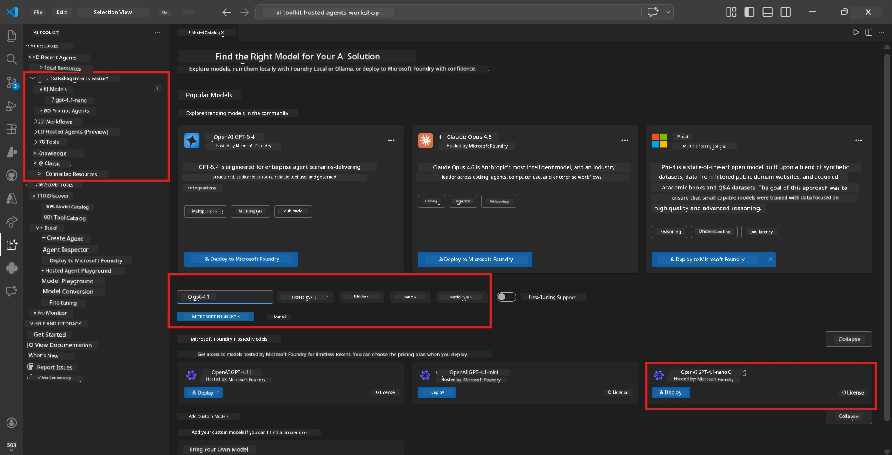
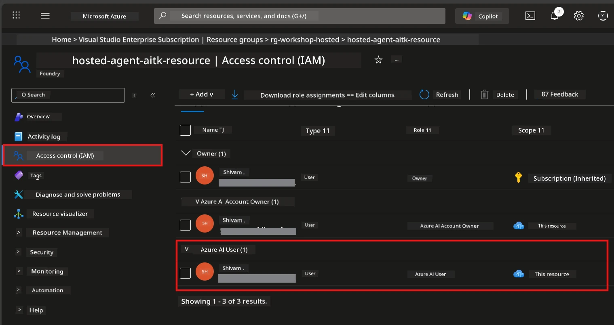

# Module 2 - Create a Foundry Project & Deploy a Model

For dis module, you go create (or choose) Microsoft Foundry project and deploy model wey your agent go use. All steps dem dey clearly written - follow dem for order.

> If you don get Foundry project wey get deployed model already, waka go [Module 3](03-create-hosted-agent.md).

---

## Step 1: Create Foundry project from VS Code

You go use Microsoft Foundry extension to create project without comot for VS Code.

1. Press `Ctrl+Shift+P` to open **Command Palette**.
2. Type: **Microsoft Foundry: Create Project** and select am.
3. Dropdown go show - select your **Azure subscription** for list.
4. You go asked to choose or create **resource group**:
   - To create new one: type name (like `rg-hosted-agents-workshop`) and press Enter.
   - To use old one: select am from dropdown.
5. Choose **region**. **Important:** Pick region wey support hosted agents. Check [region availability](https://learn.microsoft.com/azure/foundry/agents/concepts/hosted-agents#region-availability) - common options be `East US`, `West US 2`, or `Sweden Central`.
6. Enter **name** for Foundry project (like `workshop-agents`).
7. Press Enter and wait make e provision finish.

> **Provisioning dey take 2-5 minutes.** You go see progress notification for VS Code bottom-right corner. No close VS Code while e dey provision.

8. When e finish, **Microsoft Foundry** sidebar go show your new project under **Resources**.
9. Click the project name make e expand and confirm say e get sections like **Models + endpoints** and **Agents**.


### Another way: Create from Foundry Portal

If you dey prefer browser:

1. Open [https://ai.azure.com](https://ai.azure.com) and sign in.
2. Click **Create project** for home page.
3. Enter project name, select subscription, resource group, and region.
4. Click **Create** and wait for e to provision.
5. When e don create, waka back to VS Code - project go show for Foundry sidebar after you refresh (click refresh icon).

---

## Step 2: Deploy model

Your [hosted agent](https://learn.microsoft.com/azure/foundry/agents/concepts/hosted-agents) need Azure OpenAI model to generate responses. You go [deploy one now](https://learn.microsoft.com/azure/ai-foundry/openai/how-to/create-resource#deploy-a-model).

1. Press `Ctrl+Shift+P` to open **Command Palette**.
2. Type: **Microsoft Foundry: Open [Model Catalog](https://learn.microsoft.com/azure/ai-foundry/openai/concepts/models)** and select am.
3. Model Catalog view go open for VS Code. Search or browse to find **gpt-4.1**.
4. Click the **gpt-4.1** model card (or `gpt-4.1-mini` if you want less cost).
5. Click **Deploy**.


6. For deployment configuration:
   - **Deployment name**: Leave the default (e.g., `gpt-4.1`) or enter name wey you like. **Remember dis name** - you go need am for Module 4.
   - **Target**: Choose **Deploy to Microsoft Foundry** and pick the project you just create.
7. Click **Deploy** and wait make deployment finish (1-3 minutes).

### How to pick model

| Model | Best for | Cost | Notes |
|-------|----------|------|-------|
| `gpt-4.1` | High-quality, detailed responses | Higher | Best results, recommended for final testing |
| `gpt-4.1-mini` | Fast tests, lower cost | Lower | Good for workshop development and quick testing |
| `gpt-4.1-nano` | Simple tasks | Lowest | Cheapest, but responses no too complex |

> **Workshop recommendation:** Use `gpt-4.1-mini` for development and testing. E fast, cheap, and make good results for the exercises.

### Check model deployment

1. For **Microsoft Foundry** sidebar, expand your project.
2. Look under **Models + endpoints** (or similar).
3. You suppose see your deployed model (like `gpt-4.1-mini`) with status **Succeeded** or **Active**.
4. Click the deployed model to see details.
5. **Write down** these two things - you go need dem for Module 4:

   | Setting | Where to find am | Example value |
   |---------|-----------------|---------------|
   | **Project endpoint** | Click project name for Foundry sidebar. Endpoint URL dey details view. | `https://<account>.services.ai.azure.com/api/projects/<project>` |
   | **Model deployment name** | Name wey dey next to deployed model. | `gpt-4.1-mini` |

---

## Step 3: Assign correct RBAC roles

Dis step na **the one wey most people dey miss**. Without correct roles, Module 6 deployment go fail with permissions error.

### 3.1 Assign Azure AI User role to yourself

1. Open browser waka go [https://portal.azure.com](https://portal.azure.com).
2. For top search bar, type your **Foundry project** name and click am for results.
   - **Important:** Make sure say you go the **project** resource (type: "Microsoft Foundry project"), **no be** parent account/hub resource.
3. For project left navigation, click **Access control (IAM)**.
4. Click **+ Add** button top → select **Add role assignment**.
5. For **Role** tab, search for [**Azure AI User**](https://learn.microsoft.com/azure/foundry/concepts/rbac-foundry#built-in-roles) and select am. Click **Next**.
6. For **Members** tab:
   - Select **User, group, or service principal**.
   - Click **+ Select members**.
   - Search your name or email, select yourself, then click **Select**.
7. Click **Review + assign** → then click **Review + assign** again to confirm.



### 3.2 (Optional) Assign Azure AI Developer role

If you want create more resources inside project or manage deployments by code:

1. Repeat the steps above but for step 5 choose **Azure AI Developer** instead.
2. Assign am on **Foundry resource (account)** level, no only project level.

### 3.3 Verify your role assignments

1. For project **Access control (IAM)** page, click **Role assignments** tab.
2. Search your name.
3. You suppose see at least **Azure AI User** for project scope.

> **Why e important:** The [`Azure AI User`](https://learn.microsoft.com/azure/foundry/concepts/rbac-foundry#built-in-roles) role dey grant `Microsoft.CognitiveServices/accounts/AIServices/agents/write` data action. Without am, you go see error during deployment:
>
> ```
> Error: lacks the required data action 
> Microsoft.CognitiveServices/accounts/AIServices/agents/write 
> to perform POST /api/projects/{projectName}/assistants operation.
> ```
>
> Check [Module 8 - Troubleshooting](08-troubleshooting.md) for more details.

---

### Checkpoint

- [ ] Foundry project dey and you fit see am for Microsoft Foundry sidebar inside VS Code
- [ ] At least one model dey deployed (e.g., `gpt-4.1-mini`) with status **Succeeded**
- [ ] You don write down **project endpoint** URL and **model deployment name**
- [ ] You get **Azure AI User** role assigned for **project** level (check for Azure Portal → IAM → Role assignments)
- [ ] Project dey for [supported region](https://learn.microsoft.com/azure/foundry/agents/concepts/hosted-agents#region-availability) for hosted agents

---

**Previous:** [01 - Install Foundry Toolkit](01-install-foundry-toolkit.md) · **Next:** [03 - Create a Hosted Agent →](03-create-hosted-agent.md)

---

<!-- CO-OP TRANSLATOR DISCLAIMER START -->
**Disclaimer**:  
Dis document don translate wit AI translation service [Co-op Translator](https://github.com/Azure/co-op-translator). Even though we dey try for accuracy, abeg make you sabi say automated translations fit get errors or small mistakes. Di original document wey dey im native language na im be di correct one. For important mata, e better make professional human translation do am. We no go responsible for any misunderstanding or wrong interpretation wey fit happen because of dis translation.
<!-- CO-OP TRANSLATOR DISCLAIMER END -->