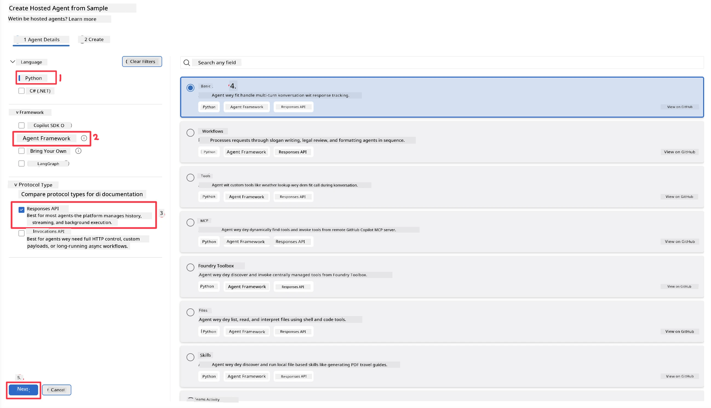
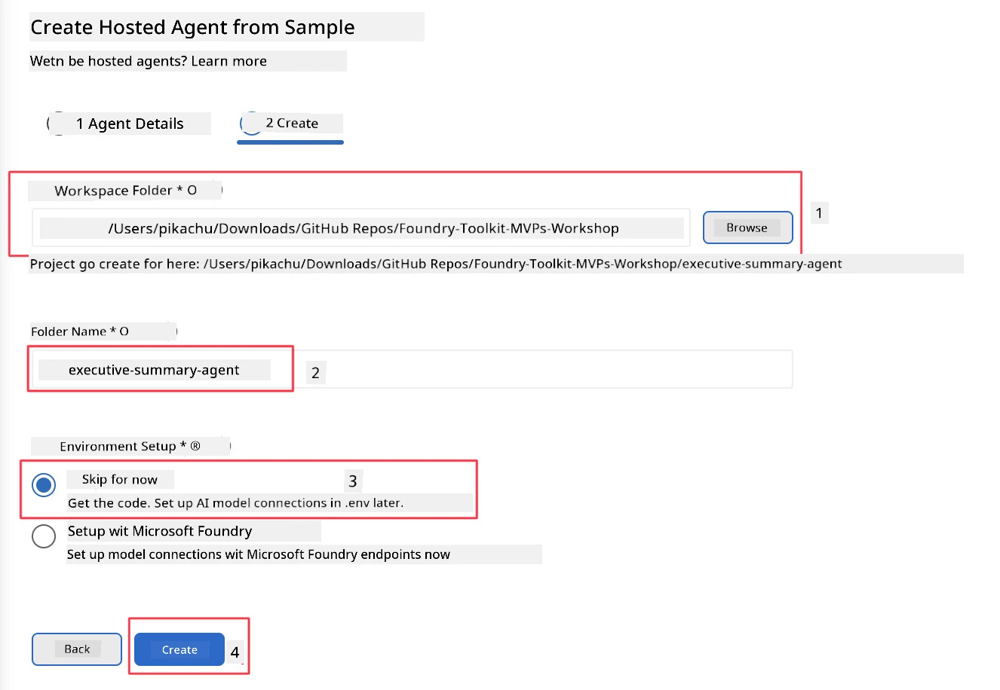

# Module 2 - Create New Hosted Agent

⏱️ ~5 min

For dis module, you go use Foundry Toolkit to **scaffold one hosted agent project**. The scaffold go generate the full project structure - `agent.yaml`, `main.py`, `Dockerfile`, `requirements.txt`, and VS Code debug configuration - so you fit focus for how you wan make the agent dey behave.

> **Key concept:** The `agent/` folder wey dey this lab na example to how Foundry Toolkit go generate am. You no need write these files from beginning.

### Scaffold wizard flow

```mermaid
flowchart LR
    A["Command Palette:
    Create new Hosted Agent"] --> B["Language:
    Python"]
    B --> C["API type:
    Response API"]
    C --> D["Template:
    Basic - Agent Framework"]
    D --> E["Chook eye for model"]
    E --> F["Workspace folder
    & agent name"]
    F --> G["Project we dem don generate"]

    style A fill:#4A90D9,color:#fff
    style B fill:#7B68EE,color:#fff
    style C fill:#7B68EE,color:#fff
    style D fill:#7B68EE,color:#fff
    style E fill:#7B68EE,color:#fff
    style F fill:#7B68EE,color:#fff
    style G fill:#27AE60,color:#fff
```



---

## Step 1: Open the Create Hosted Agent wizard

1. Press `Ctrl+Shift+P` to open **Command Palette**.
2. Type: **Foundry Toolkit: Create new Hosted Agent** then select am.

> **Alternative: Create via Foundry Portal**
> If you prefer browser, you fit create your project for [https://ai.azure.com](https://ai.azure.com). After you don create am, come back VS Code then use **Foundry Toolkit** sidebar connect am.

> **Alternative:** Click the **+** icon wey dey next **Hosted Agents (Preview)** for Foundry Toolkit sidebar.

## Step 2: Choose settings



1. For left navigation/options section choose these:

| Menu | Selection | Notes |
|--------|-----------|-------|
| **Language** | Python | C# still dey supported |
| **Framework** | Agent Framework | Simple starting point wey use Agent Framework SDK |
| **API type** | Response API | `POST /responses` - conversational, with platform-managed history |
| **Template** | Basic | Simple starting point wey use Agent Framework SDK |

2. After you don select, click **Next**



3. For next window, select these:

| Menu | Selection | Notes |
|--------|-----------|-------|
| **Workspace folder** | Choose the folder wey you want put am | e.g., `/workspace/Foundry_Toolkit_for_VSCode_Lab/` or subfolder for dis repo |
| **Agent name** | Put one name | e.g., `executive-summary-agent` |
| **Environment Setup** | skip setup for now |  |

Click **create** to create our agent. New folder go create with the hosted agent name.

## Step 3: Check the generated project

After scaffolding finish, check say you see these files inside Explorer (`Ctrl+Shift+E`):

```
📂 my-agent/
├── .env                ← Environment variables (placeholders)
├── .vscode/
│   ├── launch.json     ← Debug config (F5 → run + Agent Inspector)
│   └── tasks.json      ← VS Code task definitions
├── agent.yaml          ← Agent definition (kind: hosted)
├── Dockerfile          ← Container config for deployment
├── main.py             ← Agent entry point (your main code)
└── requirements.txt    ← Python dependencies
```

### Key files explained

| File | Purpose |
|------|---------|
| `agent.yaml` | Declare the agent as `kind: hosted`, maps environment variables, define `/responses` protocol |
| `main.py` | Create `FoundryChatClient` → wrap am inside `Agent` with instructions → serve through `ResponsesHostServer` for port 8088 |
| `Dockerfile` | Use `python:3.12-slim`, install dependencies, open port 8088, run `main.py` |
| `requirements.txt` | `agent-framework-foundry`, `agent-framework-foundry-hosting`, `mcp`, `debugpy` |

> **Important:** Open the scaffolded agent folder directly for VS Code (the `agent/` folder itself) so that `.vscode/launch.json` and `tasks.json` fit work well for F5 debugging.

---

### ✅ Checkpoint

- [ ] Scaffolded project create with all the correct files
- [ ] `agent.yaml` show `kind: hosted` and `protocol: responses`
- [ ] `main.py` dey import `Agent`, `FoundryChatClient`, `ResponsesHostServer`
- [ ] Agent folder dey open for VS Code as the workspace root

---

**Previous:** [01 - Setup](01-setup.md) · **Next:** [03 - Configure & Code →](03-configure-and-code.md)

---

<!-- CO-OP TRANSLATOR DISCLAIMER START -->
**Disclaimer**:
Dis document don translate wit AI translation service [Co-op Translator](https://github.com/Azure/co-op-translator). Even tho we dey try make am correct, abeg make you know say automated translation fit get errors or mistakes. Di original document for dia own language na im be di correct source. For important info, make person wey sabi human translation do am. We no go responsible for any misunderstanding or wrong understanding wey fit happen because of dis translation.
<!-- CO-OP TRANSLATOR DISCLAIMER END -->