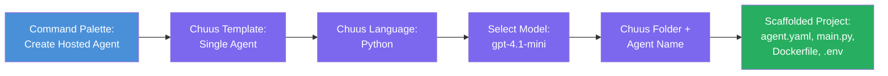

# Module 3 - Create a New Hosted Agent (Auto-Scaffolded by Foundry Extension)

For dis module, you go use the Microsoft Foundry extension to **scaffold new [hosted agent](https://learn.microsoft.com/azure/foundry/agents/concepts/hosted-agents) project**. The extension go generate di whole project structure for you - including `agent.yaml`, `main.py`, `Dockerfile`, `requirements.txt`, one `.env` file, plus VS Code debug configuration. After you scaffold, you go customize dem files wit your agent instructions, tools, and configuration.

> **Key concept:** The `agent/` folder for dis lab na example of wetin the Foundry extension go generate wen you run dis scaffold command. You no go write dis files from scratch - the extension go create dem, then you fit modify dem.

### Scaffold wizard flow


---

## Step 1: Open the Create Hosted Agent wizard

1. Press `Ctrl+Shift+P` to open **Command Palette**.
2. Type: **Microsoft Foundry: Create a New Hosted Agent** and select am.
3. The hosted agent creation wizard go open.

> **Alternative path:** You fit also reach dis wizard from the Microsoft Foundry sidebar → click di **+** icon beside **Agents** or right-click and choose **Create New Hosted Agent**.

---

## Step 2: Choose your template

Di wizard go ask you to select one template. You go see options like:

| Template | Description | When to use |
|----------|-------------|-------------|
| **Single Agent** | One agent get im own model, instructions, and optional tools | Dis workshop (Lab 01) |
| **Multi-Agent Workflow** | Multiple agents wey dey collaborate in sequence | Lab 02 |

1. Select **Single Agent**.
2. Click **Next** (or di selection go continue automatically).

---

## Step 3: Choose programming language

1. Select **Python** (we recommend am for dis workshop).
2. Click **Next**.

> **C# also dey supported** if you like .NET. Di scaffold structure dey similar (e dey use `Program.cs` instead of `main.py`).

---

## Step 4: Select your model

1. Di wizard go show di models wey you don deploy for your Foundry project (from Module 2).
2. Select di model wey you deploy - e.g., **gpt-4.1-mini**.
3. Click **Next**.

> If you no see any model, go back to [Module 2](02-create-foundry-project.md) make you deploy one first.

---

## Step 5: Choose folder location and agent name

1. One file dialog go open - choose di **target folder** wey you want di project go create. For dis workshop:
   - If you dey start fresh: choose any folder (e.g., `C:\Projects\my-agent`)
   - If you dey work for inside di workshop repo: create one new subfolder under `workshop/lab01-single-agent/agent/`
2. Enter **name** for di hosted agent (e.g., `executive-summary-agent` or `my-first-agent`).
3. Click **Create** (or press Enter).

---

## Step 6: Wait for scaffolding to complete

1. VS Code go open one **new window** with scaffolded project.
2. Wait small make di project fully load.
3. You suppose see dis files for di Explorer panel (`Ctrl+Shift+E`):

```
📂 my-first-agent/
├── .env                ← Environment variables (auto-generated with placeholders)
├── .vscode/
│   └── launch.json     ← Debug configuration (F5 to run + Agent Inspector)
├── agent.yaml          ← Agent definition (kind: hosted)
├── Dockerfile          ← Container configuration for deployment
├── main.py             ← Agent entry point (your main code file)
└── requirements.txt    ← Python dependencies
```

> **Dis na di same structure as di `agent/` folder** for dis lab. The Foundry extension dey generate dis files automatically - you no need create am manually.

> **Workshop note:** For dis workshop repository, di `.vscode/` folder dey for **workspace root** (no inside each project). E get shared `launch.json` and `tasks.json` wey get two debug configurations - **"Lab01 - Single Agent"** and **"Lab02 - Multi-Agent"** - each one dey point to di correct lab `cwd`. When you press F5, select di config wey match di lab wey you dey work on from di dropdown.

---

## Step 7: Understand each generated file

Take time inspect each file wey di wizard create. To sabi dem important for Module 4 (customization).

### 7.1 `agent.yaml` - Agent definition

Open `agent.yaml`. E go be like dis:

```yaml
# yaml-language-server: $schema=https://raw.githubusercontent.com/microsoft/AgentSchema/refs/heads/main/schemas/v1.0/ContainerAgent.yaml

kind: hosted
name: my-first-agent
description: >
  A hosted agent deployed to Microsoft Foundry Agent Service.
metadata:
  authors:
    - Microsoft
  tags:
    - Azure AI AgentServer
    - Microsoft Agent Framework
    - Hosted Agent
protocols:
  - protocol: responses
    version: v1
environment_variables:
  - name: AZURE_AI_PROJECT_ENDPOINT
    value: ${PROJECT_ENDPOINT}
  - name: AZURE_AI_MODEL_DEPLOYMENT_NAME
    value: ${MODEL_DEPLOYMENT_NAME}
dockerfile_path: Dockerfile
resources:
  cpu: '0.25'
  memory: 0.5Gi
```

**Key fields:**

| Field | Purpose |
|-------|---------|
| `kind: hosted` | Means say dis na hosted agent (container-based, deployed to [Foundry Agent Service](https://learn.microsoft.com/azure/foundry/agents/overview)) |
| `protocols: responses v1` | Di agent dey expose OpenAI-compatible `/responses` HTTP endpoint |
| `environment_variables` | E map `.env` values to container env vars wen dem deploy am |
| `dockerfile_path` | E point to di Dockerfile wey dem use build di container image |
| `resources` | CPU and memory wey di container get (0.25 CPU, 0.5Gi memory) |

### 7.2 `main.py` - Agent entry point

Open `main.py`. Dis na di main Python file wey your agent logic dey. Di scaffold get:

```python
from agent_framework.azure import AzureAIAgentClient
from azure.ai.agentserver.agentframework import from_agent_framework
from azure.identity.aio import DefaultAzureCredential
```

**Key imports:**

| Import | Purpose |
|--------|--------|
| `AzureAIAgentClient` | E connect to your Foundry project and create agents via `.as_agent()` |
| [`DefaultAzureCredential`](https://learn.microsoft.com/azure/developer/python/sdk/authentication/credential-chains#defaultazurecredential-overview) | E handle authentication (Azure CLI, VS Code sign-in, managed identity, or service principal) |
| `from_agent_framework` | E wrap di agent as HTTP server dey expose di `/responses` endpoint |

Di main flow na:
1. Create credential → create client → call `.as_agent()` to get agent (async context manager) → wrap am as server → run am

### 7.3 `Dockerfile` - Container image

```dockerfile
FROM python:3.14-slim

WORKDIR /app

COPY ./ .

RUN pip install --upgrade pip && \
    if [ -f requirements.txt ]; then \
        pip install -r requirements.txt; \
    else \
        echo "No requirements.txt found" >&2; exit 1; \
    fi

EXPOSE 8088

CMD ["python", "main.py"]
```

**Key details:**
- E dey use `python:3.14-slim` as base image.
- E copy all project files go inside `/app`.
- E upgrade `pip`, install dependencies from `requirements.txt`, and e go fail fast if that file no dey.
- **E expose port 8088** - dis na di port wey hosted agents must use. No change am.
- E start di agent with `python main.py`.

### 7.4 `requirements.txt` - Dependencies

```
agent-framework-azure-ai==1.0.0rc3
agent-framework-core==1.0.0rc3
azure-ai-agentserver-agentframework==1.0.0b16
azure-ai-agentserver-core==1.0.0b16
debugpy
agent-dev-cli
```

| Package | Purpose |
|---------|---------|
| `agent-framework-azure-ai` | Azure AI integration for Microsoft Agent Framework |
| `agent-framework-core` | Core runtime wey you fit build agents with (e get `python-dotenv` inside) |
| `azure-ai-agentserver-agentframework` | Hosted agent server runtime for Foundry Agent Service |
| `azure-ai-agentserver-core` | Core agent server abstractions |
| `debugpy` | Python debugging support (to allow F5 debugging for VS Code) |
| `agent-dev-cli` | Local development CLI for testing agents (used by di debug/run configuration) |

---

## Understanding the agent protocol

Hosted agents dey communicate thru **OpenAI Responses API** protocol. When dem dey run (locally or for cloud), di agent go expose one HTTP endpoint:

```
POST http://localhost:8088/responses
Content-Type: application/json

{
  "input": "Your prompt here",
  "stream": false
}
```

Foundry Agent Service go call dis endpoint to send user prompts and receive agent responses. Dis na di same protocol wey OpenAI API use, so your agent go fit work with any client wey sabi OpenAI Responses format.

---

### Checkpoint

- [ ] Di scaffold wizard complete successful and new **VS Code window** open
- [ ] You fit see all di 5 files: `agent.yaml`, `main.py`, `Dockerfile`, `requirements.txt`, `.env`
- [ ] Di `.vscode/launch.json` file dey (make e possible to debug F5 - for dis workshop e dey workspace root wit lab-specific configs)
- [ ] You don read each file well and you sabi wetin dem mean
- [ ] You sabi say port `8088` na the one wey e need and `/responses` endpoint na di protocol

---

**Previous:** [02 - Create Foundry Project](02-create-foundry-project.md) · **Next:** [04 - Configure & Code →](04-configure-and-code.md)

---

<!-- CO-OP TRANSLATOR DISCLAIMER START -->
**Disclaimer**:  
Dis document don translate wit AI translation service [Co-op Translator](https://github.com/Azure/co-op-translator). Even tho we dey try make am correct, abeg understand say automated translations fit get mistakes or wrong parts. Di original document for dia correct language na di main correct source. If na important information, make person wey sabi human translation do am. We no go responsible if any misunderstanding or misinterpretation happen because of dis translation.
<!-- CO-OP TRANSLATOR DISCLAIMER END -->