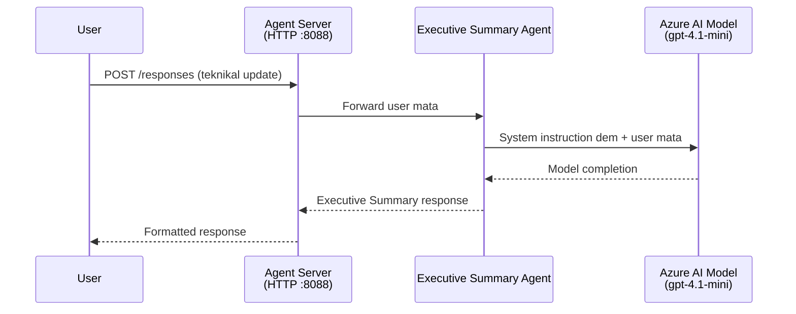
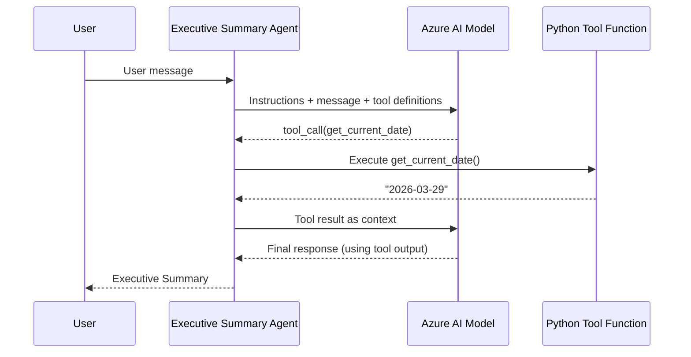

# Module 4 - Configure Instructions, Environment & Install Dependencies

For dis module, you go customize di auto-scaffolded agent files wey come from Module 3. Na here you go turn di generic scaffold to **your** own agent - by writing instructions, setting environment variables, fit add tools if you want, plus install dependencies.

> **Reminder:** Di Foundry extension na im generate your project files automatically. Now you go modify dem. See di [`agent/`](../../../../../workshop/lab01-single-agent/agent) folder for di complete working example of customized agent.

---

## How di components dey fit together

### Request lifecycle (single agent)


> **With tools:** If di agent get tools wey dem don register, di model fit return tool-call instead of direct completion. Di framework go run di tool locally, give di result back to di model, and di model go generate di final response.


---

## Step 1: Configure environment variables

Di scaffold create `.env` file with placeholder values. You gats put di correct values from Module 2.

1. For your scaffolded project, open di **`.env`** file (e dey root of di project).
2. Change di placeholder values to your actual Foundry project details:

   ```env
   PROJECT_ENDPOINT=https://<your-account>.services.ai.azure.com/api/projects/<your-project>
   MODEL_DEPLOYMENT_NAME=gpt-4.1-mini
   ```

3. Save di file.

### Where you fit find these values

| Value | How to find am |
|-------|---------------|
| **Project endpoint** | Open **Microsoft Foundry** sidebar for VS Code → click your project → di endpoint URL go show for detail view. E go look like `https://<account-name>.services.ai.azure.com/api/projects/<project-name>` |
| **Model deployment name** | For Foundry sidebar, expand your project → look under **Models + endpoints** → di name dey beside di deployed model (e.g., `gpt-4.1-mini`) |

> **Security:** No ever commit di `.env` file enter version control. E don already include for `.gitignore` as default. If e no dey, you gats add am:
> ```
> .env
> ```

### How environment variables dey flow

Di mapping na: `.env` → `main.py` (wey dey read am via `os.getenv`) → `agent.yaml` (wey map am to container env vars when deploying).

Inside `main.py`, di scaffold dey read these values like dis:

```python
PROJECT_ENDPOINT = os.getenv("AZURE_AI_PROJECT_ENDPOINT") or os.getenv("PROJECT_ENDPOINT")
MODEL_DEPLOYMENT_NAME = os.getenv("AZURE_AI_MODEL_DEPLOYMENT_NAME", os.getenv("MODEL_DEPLOYMENT_NAME", "gpt-4.1-mini"))
```

Both `AZURE_AI_PROJECT_ENDPOINT` and `PROJECT_ENDPOINT` dey accepted (di `agent.yaml` dey use `AZURE_AI_*` prefix).

---

## Step 2: Write agent instructions

Dis step na di most important customization step. Di instructions na wetin dey define your agent personality, behavior, output format, plus safety rules.

1. Open `main.py` inside your project.
2. Find di instructions string (di scaffold get default/generic one).
3. Replace am with detailed, structured instructions.

### Wetin beta instructions get

| Component | Purpose | Example |
|-----------|---------|---------|
| **Role** | Wetin di agent be, and wetin e dey do | "You be executive summary agent" |
| **Audience** | Who di responses dey for | "Senior leaders wey no get beta technical background" |
| **Input definition** | Kain prompts wey e fit handle | "Technical incident reports, operational updates" |
| **Output format** | Di exact structure of di responses | "Executive Summary: - Wetin happen: ... - Business impact: ... - Next step: ..." |
| **Rules** | Constraints and wetin e no go do | "No add information wey no dey for di prompt" |
| **Safety** | How to stop misuse and hallucination | "If input no clear, ask make e give more explanation" |
| **Examples** | Input/output pairs to guide behavior | Include 2-3 examples with different inputs |

### Example: Executive Summary Agent instructions

Here na di instructions wey demo use for workshop inside [`agent/main.py`](../../../../../workshop/lab01-single-agent/agent/main.py):

```python
AGENT_INSTRUCTIONS = """You are an "Explain Like I'm an Executive" agent.

Purpose:
Your job is to translate complex technical or operational information into
clear, concise, and outcome-focused summaries that can be easily understood
by non-technical executives.

Audience:
Senior leaders with limited technical background who care about impact,
risk, and what happens next.

What you must do:
- Rephrase the input so it is understandable to a non-technical audience
- Prioritize clarity, brevity, and outcomes over technical accuracy
- Remove technical jargon, logs, metrics, stack traces, and deep root-cause details
- Translate technical causes into simple cause-and-effect statements
- Explicitly call out business impact
- Always include a clear next step or action
- Maintain a neutral, factual, and calm executive tone
- Do NOT add new facts or speculate beyond the input

Standard Output Structure (always use this wording):

Executive Summary:
- What happened: <plain-language description>
- Business impact: <clear, non-technical impact>
- Next step: <clear action or mitigation>

Rules:
- Keep responses under 100 words
- Do NOT add facts beyond the input
- If input is unclear, ask for clarification
"""
```

4. Replace di old instructions string for `main.py` with your own instructions.
5. Save di file.

---

## Step 3: (Optional) Add custom tools

Hosted agents fit run **local Python functions** as [tools](https://learn.microsoft.com/azure/foundry/agents/concepts/tool-catalog). Dis na big advantage for code-based hosted agents compared to prompt-only agents - your agent fit run any server-side logic.

### 3.1 Define tool function

Add one tool function to `main.py`:

```python
from agent_framework import tool

@tool
def get_current_date() -> str:
    """Returns the current date in YYYY-MM-DD format."""
    from datetime import date
    return str(date.today())
```

Di `@tool` decorator go turn normal Python function to agent tool. Di docstring na di tool description wey di model go see.

### 3.2 Register di tool with di agent

When you dey create agent through `.as_agent()` context manager, pass di tool inside `tools` parameter:

```python
async with AzureAIAgentClient(
    project_endpoint=PROJECT_ENDPOINT,
    model_deployment_name=MODEL_DEPLOYMENT_NAME,
    credential=credential,
).as_agent(
    name="my-agent",
    instructions=AGENT_INSTRUCTIONS,
    tools=[get_current_date],
) as agent:
    server = from_agent_framework(agent)
    await server.run_async()
```

### 3.3 How tool calls dey work

1. User send prompt.
2. Di model go decide if tool dey needed (based on prompt, instructions, plus tool descriptions).
3. If tool needed, di framework go call your Python function locally (inside di container).
4. Di tool return value go go back as context to di model.
5. Di model go generate di final answer.

> **Tools run server side** - dem dey inside your container, no be your browser or di model. Dis one mean you fit access databases, APIs, file systems, or any Python library.

---

## Step 4: Create and activate virtual environment

Before you install dependencies, create isolated Python environment.

### 4.1 Create virtual environment

Open terminal for VS Code (`` Ctrl+` ``) and run:

```powershell
python -m venv .venv
```

Dis one go create `.venv` folder inside your project directory.

### 4.2 Activate virtual environment

**PowerShell (Windows):**

```powershell
.\.venv\Scripts\Activate.ps1
```

**Command Prompt (Windows):**

```cmd
.venv\Scripts\activate.bat
```

**macOS/Linux (Bash):**

```bash
source .venv/bin/activate
```

You go see `(.venv)` for start of your terminal prompt, meaning say virtual environment don activate.

### 4.3 Install dependencies

With virtual environment active, install all di packages wey you need:

```powershell
pip install -r requirements.txt
```

Dis one go install:

| Package | Purpose |
|---------|---------|
| `agent-framework-azure-ai==1.0.0rc3` | Azure AI integration for di [Microsoft Agent Framework](https://learn.microsoft.com/agent-framework/overview/) |
| `agent-framework-core==1.0.0rc3` | Core runtime for building agents (e get `python-dotenv`) |
| `azure-ai-agentserver-agentframework==1.0.0b16` | Hosted agent server runtime for [Foundry Agent Service](https://learn.microsoft.com/azure/foundry/agents/overview) |
| `azure-ai-agentserver-core==1.0.0b16` | Core agent server abstractions |
| `debugpy` | Python debugging (enable F5 debugging for VS Code) |
| `agent-dev-cli` | Local development CLI for testing agents |

### 4.4 Verify installation

```powershell
pip list | Select-String "agent-framework|agentserver"
```

Expected output:
```
agent-framework-azure-ai   1.0.0rc3
agent-framework-core       1.0.0rc3
azure-ai-agentserver-agentframework 1.0.0b16
azure-ai-agentserver-core  1.0.0b16
```

---

## Step 5: Verify authentication

Di agent dey use [`DefaultAzureCredential`](https://learn.microsoft.com/azure/developer/python/sdk/authentication/credential-chains#defaultazurecredential-overview) wey dey try different authentication methods for this order:

1. **Environment variables** - `AZURE_CLIENT_ID`, `AZURE_TENANT_ID`, `AZURE_CLIENT_SECRET` (service principal)
2. **Azure CLI** - e go use your `az login` session
3. **VS Code** - e use di account wey you sign in VS Code with
4. **Managed Identity** - e dey use when run inside Azure (deployment time)

### 5.1 Verify for local development

At least one of dem suppose work:

**Option A: Azure CLI (recommended)**

```powershell
az account show --query "{name:name, id:id}" --output table
```

Expected: Go show your subscription name and ID.

**Option B: VS Code sign-in**

1. Look for bottom-left for VS Code, find **Accounts** icon.
2. If you see your account name, you don authenticate.
3. If no, click di icon → **Sign in to use Microsoft Foundry**.

**Option C: Service principal (for CI/CD)**

```powershell
$env:AZURE_TENANT_ID = "<your-tenant-id>"
$env:AZURE_CLIENT_ID = "<your-client-id>"
$env:AZURE_CLIENT_SECRET = "<your-client-secret>"
```

### 5.2 Common auth issue

If you sign into multiple Azure accounts, make sure di correct subscription dey selected:

```powershell
az account set --subscription "<your-subscription-id>"
```

---

### Checkpoint

- [ ] `.env` file get correct `PROJECT_ENDPOINT` and `MODEL_DEPLOYMENT_NAME` (no be placeholders)
- [ ] Agent instructions don customize for `main.py` - dem dey define role, audience, output format, rules, and safety constraints
- [ ] (Optional) Custom tools don define and register
- [ ] Virtual environment don create and activate (`(.venv)` dey terminal prompt)
- [ ] `pip install -r requirements.txt` don run finish without error
- [ ] `pip list | Select-String "azure-ai-agentserver"` dey show package dey installed
- [ ] Authentication correct - `az account show` show your subscription OR you sign in VS Code

---

**Previous:** [03 - Create Hosted Agent](03-create-hosted-agent.md) · **Next:** [05 - Test Locally →](05-test-locally.md)

---

<!-- CO-OP TRANSLATOR DISCLAIMER START -->
**Disclaimer**:  
Dis dokument don translate wit AI translation service [Co-op Translator](https://github.com/Azure/co-op-translator). Even though we dey try make am correct, abeg sabi say automated translations fit get error or mistake. Di original dokument wey e be for im own language na di correct source. For important info, better make professional human translation do am. We no go responsible for any misunderstanding or wrong meaning wey fit come from dis translation.
<!-- CO-OP TRANSLATOR DISCLAIMER END -->