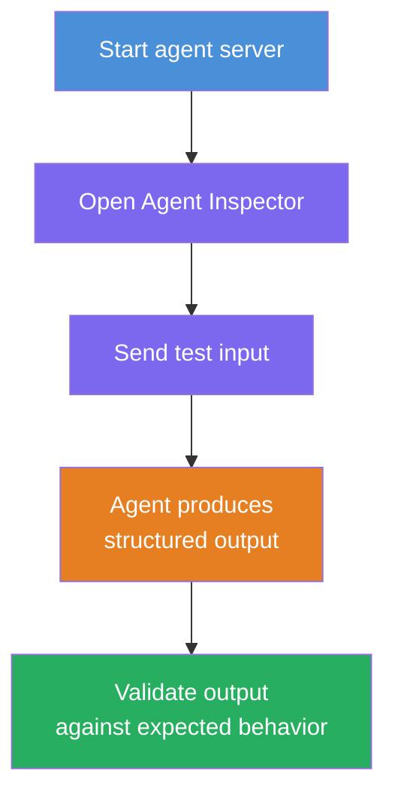
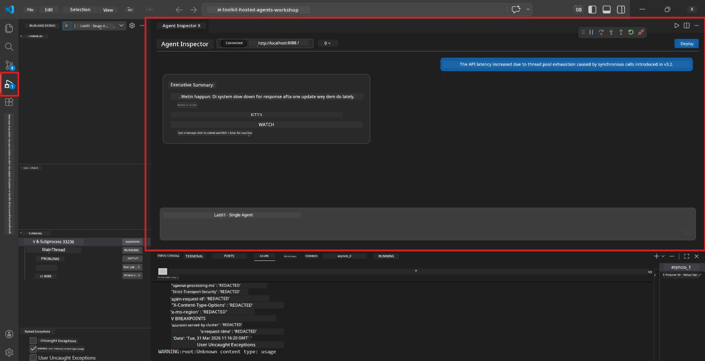
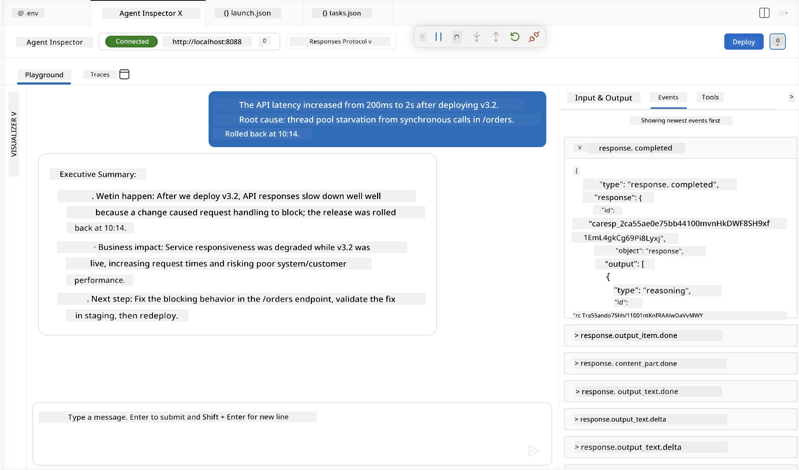

# Module 4 - Test Am Locally

⏱️ ~10 min

For dis module, you go run your agent for your machine come validate say e dey work well using **happy-path functional tests**. You go use Agent Inspector (visual UI) or direct HTTP calls to confirm say the agent dey give correct structured answers.

### Local testing flow



---

## Option 1: Press F5 - Debug with Agent Inspector (recommended)

### Start the debugger

1. Open the **executive-summary-agent/** folder directly for VS Code (`File → Open Folder`).
2. Open the **Run and Debug** panel (`Ctrl+Shift+D`).
3. Select **Debug Local Agent Server** from the dropdown.
4. Press **F5** (or click ▶ Start Debugging).

> ⚠️ **Critical: Select your Python Interpreter**
> If you see "ModuleNotFoundError" or debugger no fit start, you gats tell VS Code make e use your virtual environment:
  > 1. Press `Ctrl+Shift+P` $\rightarrow$ type **Python: Select Interpreter**.
  > 2. Pick the interpreter wey dey your project's `.venv` folder (e.g., `.\.venv\Scripts\python.exe` for Windows).
  > 3. Restart the debug session.
> If wah still dey, manually update your file `tasks.json` like this:
  > 1. Enter `.vscode/tasks.json` file
  > 2. Find the command wey get label: `Run Agent/Workflow HTTP Server`
  > 3. Change the command value like dis: `"value": "${workspaceFolder}/.venv/bin/python",`

### Wetin go happen

1. The HTTP server go start for `http://localhost:8088/responses`.
2. The **Agent Inspector** panel go open automatically - na visual chat interface for testing.
3. Breakpoints go dey enabled for `main.py`.

Dey watch the Terminal for:
```
Starting executive summary hosted agent
Executive agent server running on http://localhost:8088
```

> **If the Agent Inspector no open:** Press `Ctrl+Shift+P` → **Foundry Toolkit: Open Agent Inspector**.



> *Screenshot fit show old 'AI TOOLKIT' branding from earlier extension version.*

---

## Option 2: Test via Terminal (alternative)

Start the agent for one terminal, dey send requests from another one:

```bash
# Terminal 1: Make we start agent
cd executive-summary-agent/
source .venv/bin/activate
python main.py
```

```bash
# Terminal 2: Send test (curl)
curl -sS -X POST http://localhost:8088/responses \
  -H "Content-Type: application/json" \
  -d '{"input": "The API latency increased due to thread pool exhaustion caused by sync calls in v3.2.", "stream": false}'
```

---

## Scenario tests: Happy-path functional validation

Run **all three** scenarios wey dey below. These ones dey validate say your agent dey produce correct, structured output for realistic inputs.



### Scenario 1: IT Incident - API latency spike

**Input:**
```
The API latency increased from 200ms to 2s after deploying v3.2.
Root cause: thread pool starvation from synchronous calls in /orders.
Rolled back at 10:14.
```

**Expected behavior:**
- ✅ Follow the "Executive Summary" structure (Wetin happen / Business impact / Next step)
- ✅ No technical jargon (no "thread pool", no "/orders", no "v3.2")
- ✅ Clear talk business impact (e.g., users get delay)
- ✅ Get next step (e.g., fix don deploy, monitoring dey)

---

### Scenario 2: Data Pipeline - ETL failure

**Input:**
```
The nightly ETL job failed because the upstream schema changed. APAC dashboards show missing data.
```

**Expected behavior:**
- ✅ Summarize the data refresh failure for simple language
- ✅ Talk the APAC dashboard impact
- ✅ Get remediation next step
- ✅ No talk "ETL", "schema", or other technical terms

---

### Scenario 3: Security - Exposed credential

**Input:**
```
Static analysis flagged a hardcoded secret in the repository.
The secret may have been exposed in commit history.
```

**Expected behavior:**
- ✅ Describe credential/security issue for executive-friendly language
- ✅ Show potential risk (unauthorized access)
- ✅ Talk remediation action (credential rotation, audit)
- ✅ No include terms like "static analysis", "commit history", or "hardcoded"

---

## Validation criteria

For each scenario, check:

| # | Criteria | Pass condition |
|---|----------|---------------|
| 1 | **Structure** | Response use "Executive Summary" format with all three bullets |
| 2 | **Plain language** | No technical jargon wey executive no go fit understand |
| 3 | **Accuracy** | Summary match input - no fake details |
| 4 | **Brevity** | Response no pass 100 words |
| 5 | **Next step** | Clear action or mitigation dey stated |

---

## Debugging tips

| Issue | Fix |
|-------|-----|
| Agent no start | Check `.env` values, verify venv dey activated, run `pip install -r requirements.txt` |
| Empty or generic response | Dey review instructions for `main.py` - make sure output format dey specified |
| Response get jargon | Make stronger the "remove technical terms" rules for instructions |
| Agent Inspector no open | `Ctrl+Shift+P` → **Foundry Toolkit: Open Agent Inspector** |
| Model errors for Terminal | Confirm `AZURE_AI_MODEL_DEPLOYMENT_NAME` correct (case-sensitive) |

---

### ✅ Checkpoint

- [ ] Agent start locally without error
- [ ] Agent Inspector open and show chat interface (if you dey use F5)
- [ ] **Scenario 1** (IT incident) - structured Executive Summary, no jargon
- [ ] **Scenario 2** (data pipeline) - relevant summary with business impact
- [ ] **Scenario 3** (security alert) - correct risk communication
- [ ] All responses follow the defined output structure

> **Save your responses** (copy or screenshot) - you go compare them with cloud results for Module 06.

---

**Previous:** [03 - Configure & Code](03-configure-and-code.md) · **Next:** [05 - Deploy to Foundry →](05-deploy-to-foundry.md)

---

<!-- CO-OP TRANSLATOR DISCLAIMER START -->
**Disclaimer**:
Dis document don translate wit AI translation service [Co-op Translator](https://github.com/Azure/co-op-translator). Even tho we dey try make am correct, abeg make you know say automated translation fit get errors or mistakes. Di original document for dia own language na im be di correct source. For important info, make person wey sabi human translation do am. We no go responsible for any misunderstanding or wrong understanding wey fit happen because of dis translation.
<!-- CO-OP TRANSLATOR DISCLAIMER END -->