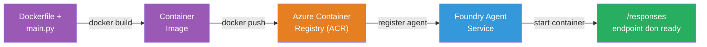
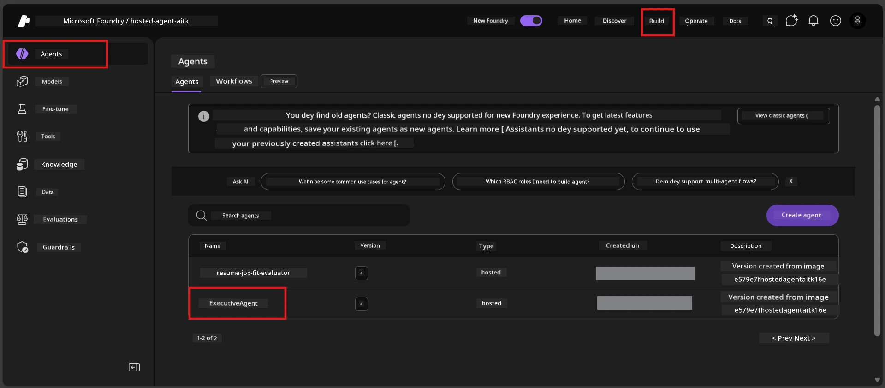

# Module 6 - Deploy to Foundry Agent Service

For dis module, you go deploy your locally-tested agent go Microsoft Foundry as [**Hosted Agent**](https://learn.microsoft.com/azure/foundry/agents/concepts/hosted-agents). The deployment process na to build Docker container image from your project, push am go [Azure Container Registry (ACR)](https://learn.microsoft.com/azure/container-registry/container-registry-intro), then create hosted agent version for [Foundry Agent Service](https://learn.microsoft.com/azure/foundry/agents/overview).

### Deployment pipeline


---

## Prerequisites check

Before you deploy, make sure say all dis tins below dey correct. If you skip am, na im dey cause most deployment wahala.

1. **Agent don pass local smoke tests:**
   - You don finish all 4 tests for [Module 5](05-test-locally.md) and the agent respond well.

2. **You get [Azure AI User](https://learn.microsoft.com/azure/foundry/concepts/rbac-foundry#built-in-roles) role:**
   - Dem assign dis role to you for [Module 2, Step 3](02-create-foundry-project.md). If you no sure, check now:
   - Azure Portal → your Foundry **project** resource → **Access control (IAM)** → **Role assignments** tab → search for your name → confirm say **Azure AI User** dey inside.

3. **You sign in for Azure inside VS Code:**
   - Check di Accounts icon for bottom-left corner for VS Code. Your account name gats dey.

4. **(Optional) Docker Desktop dey run:**
   - Docker na only if Foundry extension yan make you do local build. Most times, di extension dey handle container builds automatic during deployment.
   - If Docker dey for your machine, check if e dey run: `docker info`

---

## Step 1: Start the deployment

You get two ways to deploy - both go give you di same result.

### Option A: Deploy from the Agent Inspector (recommended)

If you dey run the agent with debugger (F5) and Agent Inspector dey open:

1. Look for **top-right corner** of the Agent Inspector panel.
2. Click the **Deploy** button (cloud icon get up arrow ↑).
3. The deployment wizard go open.

### Option B: Deploy from the Command Palette

1. Press `Ctrl+Shift+P` to open the **Command Palette**.
2. Type: **Microsoft Foundry: Deploy Hosted Agent** then select am.
3. The deployment wizard go open.

---

## Step 2: Configure the deployment

The deployment wizard go carry you go configuration. Fill every prompt:

### 2.1 Select the target project

1. Dropdown go show your Foundry projects.
2. Choose the project wey you create for Module 2 (for example `workshop-agents`).

### 2.2 Select the container agent file

1. Dem go ask make you select agent entry point.
2. Choose **`main.py`** (Python) - na this file the wizard go use sabi your agent project.

### 2.3 Configure resources

| Setting | Recommended value | Notes |
|---------|------------------|-------|
| **CPU** | `0.25` | Default, e good for workshop. Increase if na bigger production work |
| **Memory** | `0.5Gi` | Default, e good for workshop |

Dis ones na the same values as inside `agent.yaml`. You fit accept di default dem.

---

## Step 3: Confirm and deploy

1. Wizard go show deployment summary with:
   - Target project name
   - Agent name (from `agent.yaml`)
   - Container file and resources
2. Review the summary then click **Confirm and Deploy** (or **Deploy**).
3. Watch how e dey go for VS Code.

### Wetin dey happen during deployment (step by step)

Deployment na multi-step process. Check VS Code **Output** panel (choose "Microsoft Foundry" from dropdown) to follow progress:

1. **Docker build** - VS Code go build Docker container image from your `Dockerfile`. You go see Docker layer messages:
   ```
   Step 1/6 : FROM python:<version>-slim
   Step 2/6 : WORKDIR /app
   ...
   Successfully built abc123def456
   ```

2. **Docker push** - The image go push enter **Azure Container Registry (ACR)** wey dey your Foundry project. For first deploy, e fit take 1-3 minutes (base image na >100MB).

3. **Agent registration** - Foundry Agent Service go create new hosted agent (or new version if agent don already dey). E go use metadata from `agent.yaml`.

4. **Container start** - Container go start for Foundry managed infrastructure. Platform go assign [system-managed identity](https://learn.microsoft.com/azure/foundry/agents/concepts/agent-identity) and expose `/responses` endpoint.

> **First deployment dey slow pass** (because Docker need push all layers). Next deployments go fast pass because Docker go cache layers wey no change.

---

## Step 4: Verify the deployment status

After deployment command finish:

1. Open **Microsoft Foundry** sidebar by clicking Foundry icon for Activity Bar.
2. Expand **Hosted Agents (Preview)** section under your project.
3. You go see your agent name (e.g., `ExecutiveAgent` or the name wey dey `agent.yaml`).
4. **Click on the agent name** to expand am.
5. You go see one or more **versions** (e.g., `v1`).
6. Click the version to see **Container Details**.
7. Check di **Status** field:

   | Status | Meaning |
   |--------|---------|
   | **Started** or **Running** | Container dey run and agent dey ready |
   | **Pending** | Container just dey start (wait 30-60 seconds) |
   | **Failed** | Container no fit start (check logs - see troubleshooting section below) |



> **If you see "Pending" pass 2 minutes:** The container fit still dey pull base image. Wait small more. If e still stay pending, check container logs.

---

## Common deployment errors and fixes

### Error 1: Permission denied - `agents/write`

```
Error: lacks the required data action 
Microsoft.CognitiveServices/accounts/AIServices/agents/write 
to perform POST /api/projects/{projectName}/assistants operation.
```

**Root cause:** You no get `Azure AI User` role for **project** level.

**Fix step by step:**

1. Open [https://portal.azure.com](https://portal.azure.com).
2. For search bar, type your Foundry **project** name then click am.
   - **Important:** Make sure say you enter **project** resource (type: "Microsoft Foundry project"), NOT di parent account/hub resource.
3. For left navigation, click **Access control (IAM)**.
4. Click **+ Add** → **Add role assignment**.
5. For **Role** tab, search [**Azure AI User**](https://learn.microsoft.com/azure/foundry/concepts/rbac-foundry#built-in-roles) then select am. Click **Next**.
6. For **Members** tab, select **User, group, or service principal**.
7. Click **+ Select members**, search your name/email, select yourself, then click **Select**.
8. Click **Review + assign** → **Review + assign** again.
9. Wait 1-2 minutes make role assignment propagate.
10. **Try deploy again** from Step 1.

> Role gats dey for **project** scope, no be only account level. Na dis one dey cause most deployment failure.

### Error 2: Docker not running

```
Error: Docker build failed / Cannot connect to Docker daemon
```

**Fix:**
1. Start Docker Desktop (find am for your Start menu or system tray).
2. Wait make e show "Docker Desktop is running" (30-60 seconds).
3. Check with: `docker info` for terminal.
4. **Windows specific:** Make sure say WSL 2 backend dey enabled for Docker Desktop settings → **General** → **Use the WSL 2 based engine**.
5. Retry the deployment.

### Error 3: ACR authorization - `AcrPullUnauthorized`

```
Error: AcrPullUnauthorized
```

**Root cause:** Foundry project's managed identity no get pull access to container registry.

**Fix:**
1. For Azure Portal, go your **[Container Registry](https://learn.microsoft.com/azure/container-registry/container-registry-intro)** (e dey same resource group as your Foundry project).
2. Go to **Access control (IAM)** → **Add** → **Add role assignment**.
3. Select **[AcrPull](https://learn.microsoft.com/azure/container-registry/container-registry-roles)** role.
4. For Members, select **Managed identity** → find your Foundry project's managed identity.
5. **Review + assign**.

> Dis one dey usually automatic set up by Foundry extension. If you see this error, mean say automatic setup fail.

### Error 4: Container platform mismatch (Apple Silicon)

If you dey deploy from Apple Silicon Mac (M1/M2/M3), container gats build for `linux/amd64`:

```bash
docker build --platform linux/amd64 -t myagent:v1 .
```

> Foundry extension dey handle dis automatically for most users.

---

### Checkpoint

- [ ] Deployment command finish without error for VS Code
- [ ] Agent don appear under **Hosted Agents (Preview)** inside Foundry sidebar
- [ ] You click the agent → select version → see **Container Details**
- [ ] Container status show **Started** or **Running**
- [ ] (If error happen) You know the error, apply fix, and do deployment again correct

---

**Previous:** [05 - Test Locally](05-test-locally.md) · **Next:** [07 - Verify in Playground →](07-verify-in-playground.md)

---

<!-- CO-OP TRANSLATOR DISCLAIMER START -->
**Disclaimer**:  
Dis document don translate wit AI translation service [Co-op Translator](https://github.com/Azure/co-op-translator). Even though we dey try make am correct, abeg sabi say artificial translation fit get mistake or no too correct. Di original document wey dey im correct language na di main authority. For important mata dem, make person wey sabi do proper human translation do am. We no responsible for any misunderstanding or mistake wey fit comot from using dis translation.
<!-- CO-OP TRANSLATOR DISCLAIMER END -->