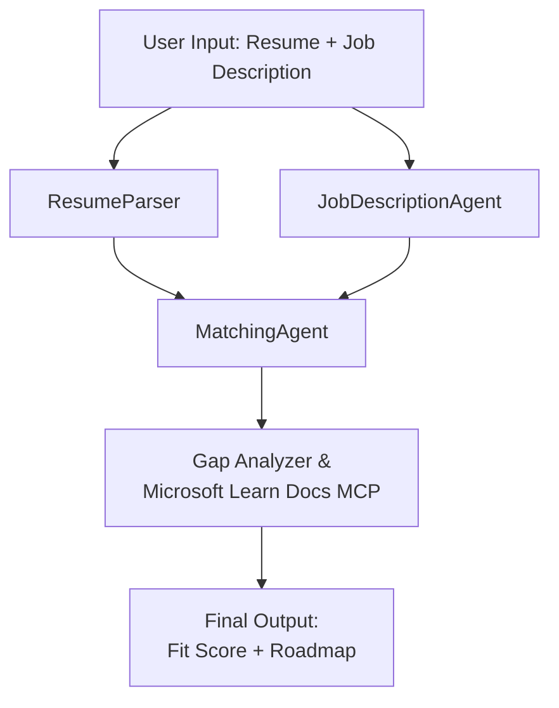

# PersonalCareerCopilot - Resume → Job Fit Evaluator

Na multi-agent workflow wey dey check how resume dey match job description well-well, den e go create personal learning roadmap to help close the gap dem.

---

## Agents

| Agent | Role | Tools |
|-------|------|-------|
| **ResumeParser** | E go tear out structured skills, experience, certifications from resume text | - |
| **JobDescriptionAgent** | E go tear out required/preferred skills, experience, certifications from JD | - |
| **MatchingAgent** | E go compare profile vs requirements → fit score (0-100) + matched/missing skills | - |
| **GapAnalyzer** | E go build personal learning roadmap with Microsoft Learn resources | `search_microsoft_learn_for_plan` (MCP) |

## Workflow


---

## Quick start

### 1. Set up environment

```powershell
cd workshop\lab02-multi-agent\PersonalCareerCopilot
python -m venv .venv
.\.venv\Scripts\Activate.ps1          # Windows PowerShell
# source .venv/bin/activate            # macOS / Linux
pip install -r requirements.txt
```

### 2. Configure credentials

Copy the example env file and fill your Foundry project details:

```powershell
cp .env.example .env
```

Edit `.env`:

```env
PROJECT_ENDPOINT=https://<your-account>.services.ai.azure.com/api/projects/<your-project>
MODEL_DEPLOYMENT_NAME=gpt-4.1-mini
```

| Value | Where to find am |
|-------|-----------------|
| `PROJECT_ENDPOINT` | Microsoft Foundry sidebar for VS Code → right-click your project → **Copy Project Endpoint** |
| `MODEL_DEPLOYMENT_NAME` | Foundry sidebar → expand project → **Models + endpoints** → deployment name |

### 3. Run locally

```powershell
python -m debugpy --listen 127.0.0.1:5679 -m agentdev run main.py --verbose --port 8088
```

Or use VS Code task: `Ctrl+Shift+P` → **Tasks: Run Task** → **Run Lab02 HTTP Server**.

### 4. Test with Agent Inspector

Open Agent Inspector: `Ctrl+Shift+P` → **Foundry Toolkit: Open Agent Inspector**.

Paste dis test prompt:

```
Resume:
Jane Doe
Senior Software Engineer with 5 years of experience in Python, Django, and AWS.
Built microservices handling 10K+ requests/second. Led a team of 4 developers.
Certifications: AWS Solutions Architect Associate.
Education: B.S. Computer Science, State University.

Job Description:
Senior Cloud Engineer at Contoso Ltd.
Required: Python, Azure, Kubernetes, Terraform, CI/CD pipelines.
Preferred: Go, monitoring (Prometheus/Grafana), cost optimization.
Experience: 5+ years in cloud infrastructure.
Certifications: Azure Solutions Architect Expert preferred.
```

**Expected:** Na fit score (0-100), matched/missing skills, plus personal learning roadmap with Microsoft Learn URLs.

### 5. Deploy to Foundry

`Ctrl+Shift+P` → **Microsoft Foundry: Deploy Hosted Agent** → pick your project → confirm.

---

## Project structure

```
PersonalCareerCopilot/
├── .env.example        ← Template for environment variables
├── .env                ← Your credentials (git-ignored)
├── agent.yaml          ← Hosted agent definition (name, resources, env vars)
├── Dockerfile          ← Container image for Foundry deployment
├── main.py             ← 4-agent workflow (instructions, MCP tool, WorkflowBuilder)
└── requirements.txt    ← Python dependencies
```

## Key files

### `agent.yaml`

Defines the hosted agent for Foundry Agent Service:
- `kind: hosted` - e dey run as managed container
- `protocols: [responses v1]` - e expose the `/responses` HTTP endpoint
- `environment_variables` - `PROJECT_ENDPOINT` and `MODEL_DEPLOYMENT_NAME` go dey inject for deploy time

### `main.py`

E get:
- **Agent instructions** - four `*_INSTRUCTIONS` constants, one per agent
- **MCP tool** - `search_microsoft_learn_for_plan()` go call `https://learn.microsoft.com/api/mcp` via Streamable HTTP
- **Agent creation** - `create_agents()` context manager wey use `AzureAIAgentClient.as_agent()`
- **Workflow graph** - `create_workflow()` dey use `WorkflowBuilder` take join agents with fan-out/fan-in/sequential patterns
- **Server startup** - `from_agent_framework(agent).run_async()` dey run for port 8088

### `requirements.txt`

| Package | Version | Purpose |
|---------|---------|---------|
| `agent-framework-azure-ai` | `1.0.0rc3` | Azure AI integration for Microsoft Agent Framework |
| `agent-framework-core` | `1.0.0rc3` | Core runtime (get WorkflowBuilder) |
| `azure-ai-agentserver-agentframework` | `1.0.0b16` | Hosted agent server runtime |
| `azure-ai-agentserver-core` | `1.0.0b16` | Core agent server abstractions |
| `debugpy` | latest | Python debugging (F5 for VS Code) |
| `agent-dev-cli` | `--pre` | Local dev CLI + Agent Inspector backend |

---

## Troubleshooting

| Issue | Fix |
|-------|-----|
| `RuntimeError: Missing required environment variable(s)` | Create `.env` with `PROJECT_ENDPOINT` and `MODEL_DEPLOYMENT_NAME` |
| `ModuleNotFoundError: No module named 'agent_framework'` | Activate venv and run `pip install -r requirements.txt` |
| No Microsoft Learn URLs for output | Check internet connection to `https://learn.microsoft.com/api/mcp` |
| Only 1 gap card (truncated) | Make sure `GAP_ANALYZER_INSTRUCTIONS` get the `CRITICAL:` block |
| Port 8088 dey use | Stop other servers: `netstat -ano \| findstr :8088` |

For detailed troubleshooting, see [Module 8 - Troubleshooting](../docs/08-troubleshooting.md).

---

**Full walkthrough:** [Lab 02 Docs](../docs/README.md) · **Back to:** [Lab 02 README](../README.md) · [Workshop Home](../../../README.md)

---

<!-- CO-OP TRANSLATOR DISCLAIMER START -->
**Disclaimer**:  
Dis document don translate wit AI translation service [Co-op Translator](https://github.com/Azure/co-op-translator). Even though we dey try make am accurate, make you sabi say automated translations fit get errors or wahala. Di original document for im own language na di real correct source. For important matter, make you use professional human translation. We no dey responsible for any misunderstanding or wrong interpretation wey fit happen from using dis translation.
<!-- CO-OP TRANSLATOR DISCLAIMER END -->