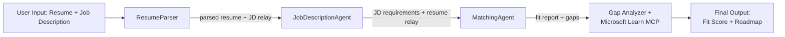

# PersonalCareerCopilot - Resume → Job Fit Evaluator

Na workflow-first multi-agent app wey dey check how resume match well with job description, den e go generate personalized learning roadmap to close di gap dem.

---

## Agents

| Agent | Role | Tools |
|-------|------|-------|
| **ResumeParser** | Extracts structured skills, experience, certifications from resume text | - |
| **JobDescriptionAgent** | Extracts required/preferred skills, experience, certifications from a JD | - |
| **MatchingAgent** | Compares profile vs requirements → fit score (0-100) + matched/missing skills | - |
| **GapAnalyzer** | Builds a personalized learning roadmap with Microsoft Learn resources | `search_microsoft_learn_for_plan` (MCP) |

## Workflow


```mermaid
flowchart LR
    UserInput["User Input: Resume + Job Description"] --> ResumeParser
    ResumeParser -- "parsed resume + JD relay" --> JobDescriptionAgent
    JobDescriptionAgent -- "JD requirements + resume relay" --> MatchingAgent
    MatchingAgent -- "fit report + gaps" --> GapAnalyzerMCP["Gap Analyzer +\nMicrosoft Learn MCP"]
    GapAnalyzerMCP --> FinalOutput["Final Output:\nFit Score + Roadmap"]
```

---

## Quick start

### 1. Set up environment

Dis folder na di reference implementation for di workflow-based Lab 02 scaffold. E get `main.py` wey dey use di existing prompt blocks plus `WorkflowBuilder` to join di four agents together.

```powershell
cd workshop\lab02-multi-agent\PersonalCareerCopilot
python -m venv .venv
.\.venv\Scripts\Activate.ps1          # Windows PowerShell
# source .venv/bin/activate            # macOS / Linux
pip install -r requirements.txt
```

### 2. Configure credentials

Create `.env` file for dis folder:

```powershell
copy .env .env.bak 2>$null; echo $null > .env
```

Edit `.env`:

```env
FOUNDRY_PROJECT_ENDPOINT=https://<your-account>.services.ai.azure.com/api/projects/<your-project>
AZURE_AI_MODEL_DEPLOYMENT_NAME=gpt-4.1-mini
```

| Value | Where to find it |
|-------|------------------|
| `FOUNDRY_PROJECT_ENDPOINT` | Foundry Toolkit sidebar → right-click your project → **Copy Project Endpoint** |
| `AZURE_AI_MODEL_DEPLOYMENT_NAME` | Foundry sidebar → expand project → **Models + endpoints** → deployment name |

### 3. Run locally

```powershell
python -m debugpy --listen 127.0.0.1:5679 main.py --port 8088
```

Or use di VS Code task: `Ctrl+Shift+P` → **Tasks: Run Task** → **Run Agent HTTP Server**.

For F5 debugging, use **Debug Local Agent HTTP Server**.

### 4. Test with Agent Inspector

Open Agent Inspector: `Ctrl+Shift+P` → **Foundry Toolkit: Open Agent Inspector**.

Paste dis test prompt:

```
Resume:
Jane Doe
Senior Software Engineer with 5 years of experience in Python, Django, and AWS.
Built microservices handling 10K+ requests/second. Led a team of 4 developers.
Certifications: AWS Solutions Architect Associate.
Education: B.S. Computer Science, State University.

Job Description:
Senior Cloud Engineer at Contoso Ltd.
Required: Python, Azure, Kubernetes, Terraform, CI/CD pipelines.
Preferred: Go, monitoring (Prometheus/Grafana), cost optimization.
Experience: 5+ years in cloud infrastructure.
Certifications: Azure Solutions Architect Expert preferred.
```

**Expected:** Fit score (0-100), matched/missing skills, and personalized learning roadmap with Microsoft Learn URLs.

### 5. Deploy to Foundry

`Ctrl+Shift+P` → **Foundry Toolkit: Deploy Hosted Agent** → select your project → confirm.

---

## Project structure

```
PersonalCareerCopilot/
├── .env                ← Your credentials (git-ignored)
├── agent.yaml          ← Hosted agent definition (name, resources, env vars)
├── Dockerfile          ← Container image for Foundry deployment
├── main.py             ← 4-agent workflow (instructions, MCP tool, WorkflowBuilder)
└── requirements.txt    ← Python dependencies
```

## Key files

### `agent.yaml`

Di define di hosted agent for Foundry Agent Service:
- `kind: hosted` - e run as managed container
- `protocols` - `responses` protocol wey get `version: 1.0.0`, e expose `/responses` HTTP endpoint
- `environment_variables` - `AZURE_AI_MODEL_DEPLOYMENT_NAME` dey for here; `FOUNDRY_PROJECT_ENDPOINT` dey inject automatically wen you deploy am

### `main.py`

E get:
- **Agent instructions** - four `*_INSTRUCTIONS` constants, one per agent
- **MCP tool** - `search_microsoft_learn_for_plan()` dey call `https://learn.microsoft.com/api/mcp` via Streamable HTTP
- **Agent creation** - four `Agent()` + `AgentExecutor()` instances dey share one `FoundryChatClient`
- **Workflow graph** - `WorkflowBuilder` dey wire agents as sequential pipeline: ResumeParser → JD Agent → MatchingAgent → GapAnalyzer
- **Server startup** - `ResponsesHostServer` dey run for port 8088

### `requirements.txt`

| Package | Purpose |
|---------|----------|
| `agent-framework-foundry` | Core runtime: `Agent`, `AgentExecutor`, `WorkflowBuilder`, `@tool`, `FoundryChatClient` |
| `agent-framework-foundry-hosting` | `ResponsesHostServer` + Foundry hosting integration |
| `mcp<2,>=1.24.0` | MCP client for GapAnalyzer (`streamable_http_client`) |
| `debugpy` | Python debugging (F5 for VS Code) |

---

## Troubleshooting

| Issue | Fix |
|-------|-----|
| `KeyError: 'FOUNDRY_PROJECT_ENDPOINT'` or `KeyError: 'AZURE_AI_MODEL_DEPLOYMENT_NAME'` | Create `.env` with BOTH `FOUNDRY_PROJECT_ENDPOINT` AND `AZURE_AI_MODEL_DEPLOYMENT_NAME` set |
| `ModuleNotFoundError: No module named 'agent_framework'` | Activate venv and run `pip install -r requirements.txt` |
| No Microsoft Learn URLs for output | Check internet connection to `https://learn.microsoft.com/api/mcp` |
| Only 1 gap card (e short) | Make sure say `GAP_ANALYZER_INSTRUCTIONS` get di `CRITICAL:` block |
| Port 8088 dey in use | Stop other servers: `netstat -ano \| findstr :8088` |

For detailed troubleshooting, see [Module 8 - Troubleshooting](../docs/08-troubleshooting.md).

---

**Full walkthrough:** [Lab 02 Docs](../docs/README.md) · **Back to:** [Lab 02 README](../README.md) · [Workshop Home](../../../README.md)

---

<!-- CO-OP TRANSLATOR DISCLAIMER START -->
**Disclaimer**:
Dis document don translate wit AI translation service [Co-op Translator](https://github.com/Azure/co-op-translator). Even tho we dey try make am correct, abeg make you know say automated translation fit get errors or mistakes. Di original document for dia own language na im be di correct source. For important info, make person wey sabi human translation do am. We no go responsible for any misunderstanding or wrong understanding wey fit happen because of dis translation.
<!-- CO-OP TRANSLATOR DISCLAIMER END -->