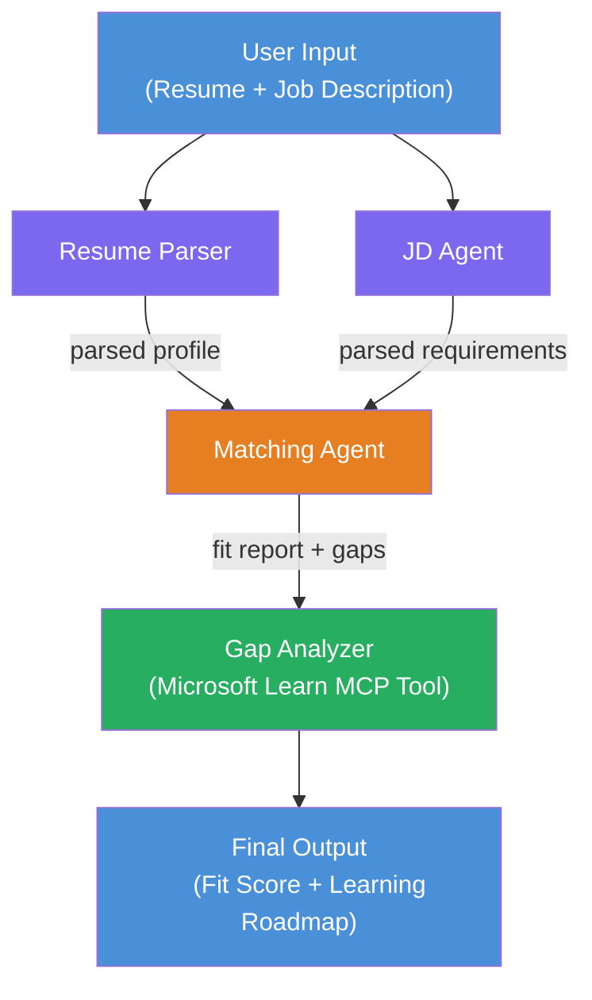

# Lab 02 - Multi-Agent Workflow: Resume → Job Fit Evaluator

---

## Wetin you go build

A **Resume → Job Fit Evaluator** - na multi-agent workflow wey four specialized agents go dey collaborate to evaluate how well candidate resume match job description, den go generate personalized learning roadmap to close the gaps.

### The agents

| Agent | Role |
|-------|------|
| **Resume Parser** | Extract structured skills, experience, certifications from resume text |
| **Job Description Agent** | Extract required/preferred skills, experience, certifications from a JD |
| **Matching Agent** | Compare profile vs requirements → fit score (0-100) + matched/missing skills |
| **Gap Analyzer** | Build personalized learning roadmap with resources, timelines, and quick-win projects |

### Demo flow

Upload **resume + job description** → get **fit score + missing skills** → receive **personalized learning roadmap**.

### Workflow architecture

> Purple = parallel agents | Orange = aggregation point | Green = final agent with tools. See [Module 1 - Understand the Architecture](docs/01-understand-multi-agent.md) and [Module 4 - Orchestration Patterns](docs/04-orchestration-patterns.md) for detailed diagrams and data flow.

### Topics wey dem cover

- How to create multi-agent workflow using **WorkflowBuilder**
- How to define agent roles and orchestration flow (parallel + sequential)
- Inter-agent communication patterns
- Local testing with Agent Inspector
- Deploy multi-agent workflows to Foundry Agent Service

---

## Prerequisites

Finish Lab 01 first:

- [Lab 01 - Single Agent](../lab01-single-agent/README.md)

---

## How to start

See full setup instructions, code walkthrough, and test commands for:

- [Lab 2 Docs - Prerequisites](docs/00-prerequisites.md)
- [Lab 2 Docs - Full Learning Path](docs/README.md)
- [PersonalCareerCopilot run guide](PersonalCareerCopilot/README.md)

## Orchestration patterns (agentic alternatives)

Lab 2 get the default **parallel → aggregator → planner** flow, and the docs still talk about alternative patterns wey show stronger agentic behavior:

- **Fan-out/Fan-in with weighted consensus**
- **Reviewer/critic pass before final roadmap**
- **Conditional router** (path selection based on fit score and missing skills)

See [docs/04-orchestration-patterns.md](docs/04-orchestration-patterns.md).

---

**Previous:** [Lab 01 - Single Agent](../lab01-single-agent/README.md) · **Back to:** [Workshop Home](../../README.md)

---

<!-- CO-OP TRANSLATOR DISCLAIMER START -->
**Disclaimer**:
Dis dokument don translate wit AI translation service [Co-op Translator](https://github.com/Azure/co-op-translator). Even tho we dey try make e correct, abeg sabi say automated translations fit get mistake or no too correct. Di original dokument wey dem write for im own language na di correct one. For important mata, make person wey sabi human translation do am. We no go responsible for any kind misunderstanding or wrong meaning wey fit come from using dis translation.
<!-- CO-OP TRANSLATOR DISCLAIMER END -->